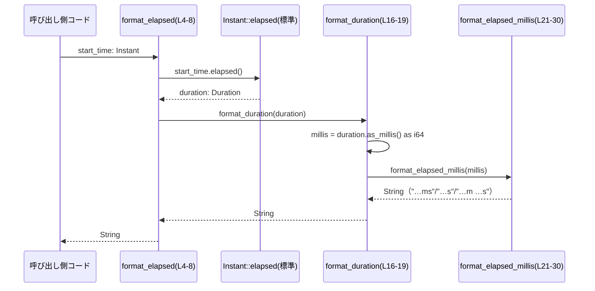

# utils/elapsed/src/lib.rs

## 0. ざっくり一言

経過時間（`Instant` からの経過や `Duration`）を、人間が読みやすい短い文字列（例: `"250ms"`, `"1.50s"`, `"1m 15s"`）に変換するユーティリティです。

---

## 1. このモジュールの役割

### 1.1 概要

- このモジュールは、**経過時間をログなどに表示しやすいフォーマットに変換する** ために存在します。
- `Instant` からの経過時間を直接フォーマットする関数と、`Duration` をフォーマットする関数を提供します（`lib.rs:L4-8`, `L16-19`）。
- 内部ではミリ秒単位の整数値をもとに、ミリ秒・秒・分＋秒の 3 パターンに分けて出力形式を切り替えています（`lib.rs:L21-30`）。

### 1.2 アーキテクチャ内での位置づけ

このファイル単体では他の自作モジュールとの関係は現れていませんが、外部から見ると次のような依存関係になります。

```mermaid
graph TD
    Caller["任意の呼び出し側コード"] -->|経過時間を表示したい| FE["format_elapsed(start_time) (L4-8)"]
    Caller -->|Duration をそのまま表示したい| FD["format_duration(duration) (L16-19)"]

    FE -->|elapsed()| Inst["std::time::Instant (標準ライブラリ)"]
    FE --> FD
    FD --> FEM["format_elapsed_millis(millis) (L21-30)"]
    FD --> Dur["std::time::Duration (標準ライブラリ)"]
```

- `format_elapsed` は `Instant::elapsed()` と `format_duration` に依存します（`lib.rs:L6-7`）。
- `format_duration` は `Duration::as_millis()` と内部関数 `format_elapsed_millis` に依存します（`lib.rs:L16-19`）。
- `format_elapsed_millis` はこのモジュール内に閉じた純粋なフォーマッタです（`lib.rs:L21-30`）。

### 1.3 設計上のポイント

- **責務の分割**
  - 公開 API は `Instant` と `Duration` を受け取る 2 関数 (`format_elapsed`, `format_duration`) に限定されています（`lib.rs:L6`, `L16`）。
  - 実際のフォーマットロジックはミリ秒単位の整数を扱うプライベート関数 `format_elapsed_millis` に集約されています（`lib.rs:L21`）。
- **状態を持たない**
  - すべての関数は引数のみから結果文字列を計算し、グローバル状態や可変な共有状態を一切使っていません。
  - そのため、関数呼び出しはスレッド間で安全に並行実行可能です（純粋関数として振る舞います）。
- **エラーハンドリング**
  - このモジュール内には `Result` や `Option` を用いたエラーハンドリングは登場せず、すべての関数が **任意の入力に対して常に `String` を返す** 形になっています（`lib.rs:L6`, `L16`, `L21`）。
  - パニックを起こしうる操作（インデックスアクセス、`unwrap` など）は含まれていません。
- **フォーマット規則の明文化**
  - コメントとテストにより、「1 秒未満」「1〜60 秒」「60 秒以上」の扱いが明文化されています（`lib.rs:L10-15`, `L37-76`）。

### 1.4 コンポーネントインベントリー（本チャンク）

関数・モジュールの一覧と定義位置です。

| 名前 | 種別 | 公開 | 役割 / 説明 | 定義位置 |
|------|------|------|-------------|----------|
| `format_elapsed` | 関数 | `pub` | `Instant` からの経過時間を計測し、人間向け文字列に変換するフロント関数 | `lib.rs:L4-8` |
| `format_duration` | 関数 | `pub` | `Duration` をフォーマット規則に従って文字列に変換するフロント関数 | `lib.rs:L10-19` |
| `format_elapsed_millis` | 関数 | `fn`（非公開） | ミリ秒単位の `i64` を受け取り、`ms` / `s` / `m ss` の 3 形式で文字列化するコアロジック | `lib.rs:L21-30` |
| `tests` | モジュール | `mod`（テスト時のみ有効） | 各境界条件のフォーマット結果を検証するテスト群 | `lib.rs:L33-78` |
| `test_format_duration_subsecond` | 関数 | `#[test]` | 1 秒未満と 0 秒のフォーマットを検証 | `lib.rs:L37-46` |
| `test_format_duration_seconds` | 関数 | `#[test]` | 1〜60 秒未満の秒表示と丸め挙動を検証 | `lib.rs:L48-58` |
| `test_format_duration_minutes` | 関数 | `#[test]` | 1 分以上の分＋秒表示を検証 | `lib.rs:L60-71` |
| `test_format_duration_one_hour_has_space` | 関数 | `#[test]` | ちょうど 1 時間（60 分）の表示（スペース含む）を検証 | `lib.rs:L73-77` |

---

## 2. 主要な機能一覧

- `format_elapsed`: `Instant` からの経過時間を測り、短い人間向け文字列に変換する。
- `format_duration`: 任意の `Duration` を、ミリ秒／秒／分＋秒のいずれかの形式で文字列化する。
- `format_elapsed_millis`: ミリ秒（`i64`）をもとに、フォーマット規則に従った文字列を生成する内部ヘルパー。

---

## 3. 公開 API と詳細解説

### 3.1 型一覧（構造体・列挙体など）

このファイル内で独自に定義されている構造体・列挙体はありません。

利用している主な標準ライブラリ型は次の通りです。

| 名前 | 種別 | 役割 / 用途 | 使用箇所 |
|------|------|-------------|----------|
| `std::time::Instant` | 構造体 | 現在時刻との差から経過時間を測定するモノトニックな時刻表現 | `format_elapsed` の引数と `elapsed()` 呼び出し（`lib.rs:L4-7`） |
| `std::time::Duration` | 構造体 | 時間の長さ（秒・ナノ秒）を表す標準型 | `format_duration` の引数・テスト内での生成（`lib.rs:L10-19`, `L40`, `L44`, `L52`, `L56`, `L63`, `L66`, `L69`, `L75`） |

### 3.2 関数詳細

#### `format_elapsed(start_time: Instant) -> String`

**概要**

- `start_time` から現在時刻までの経過時間を測定し、その結果を `format_duration` を用いて人間向けの文字列に変換します（`lib.rs:L4-7`）。

**引数**

| 引数名 | 型 | 説明 |
|--------|----|------|
| `start_time` | `Instant` | 経過時間の起点となる時刻。`Instant` は標準ライブラリのモノトニック時計型です。 |

**戻り値**

- `String`: `start_time` から現在までの経過時間を表す文字列。  
  具体的なフォーマットは `format_duration` の規則に従います（`lib.rs:L10-19`）。

**内部処理の流れ（アルゴリズム）**

1. `start_time.elapsed()` を呼び出して、現在までの経過時間を `Duration` として取得します（`lib.rs:L6`）。
2. 得られた `Duration` をそのまま `format_duration` に渡します（`lib.rs:L6-7`）。
3. `format_duration` が返した文字列を、そのまま呼び出し元に返します（`lib.rs:L6-7`）。

> 根拠: `lib.rs:L4-8`

**Examples（使用例）**

```rust
use std::time::Instant;
use utils::elapsed::format_elapsed; // 仮のクレートパス。実際のパスはプロジェクト構成に依存します。

fn main() {
    let start = Instant::now();                    // 処理開始時刻を取得
    // ... 何らかの処理 ...
    let elapsed_str = format_elapsed(start);       // 経過時間をフォーマット
    println!("処理時間: {elapsed_str}");          // 例: "処理時間: 1.50s"
}
```

**Errors / Panics**

- この関数自体は、任意の `Instant` に対して常に `String` を返し、パニックを発生させるコードは含んでいません。
- ただし、内部で呼び出している `Instant::elapsed` の詳細な挙動（将来の `Instant` を渡した場合など）は標準ライブラリの仕様に依存し、このファイルだけからは判定できません。

**Edge cases（エッジケース）**

- `start_time` とほぼ同時に呼び出した場合、`"0ms"` のような非常に小さな時間が返ります（`format_duration` の挙動より推測、`lib.rs:L16-19`, `L21-24`）。
- 非現実的に古い `Instant` からの経過など、非常に長い経過時間についても、内部では `Duration` として扱われますが、その後の `as_millis() as i64` キャストによりオーバーフローの可能性があります（詳細は後述 `format_duration` 参照）。

**使用上の注意点**

- 測りたい区間の開始時点で `Instant::now()` を取得し、その値をそのまま `format_elapsed` に渡す使い方が想定されています。
- この関数は副作用を持たないため、どのスレッドから呼んでも問題ありません（共有状態を参照していません）。

---

#### `format_duration(duration: Duration) -> String`

**概要**

- 与えられた `Duration` を、**ミリ秒・秒（小数点以下 2 桁）・分＋秒** のいずれかの形式でコンパクトにフォーマットします（`lib.rs:L10-19`, `L21-30`）。
- フォーマット規則はドキュメントコメントおよびテストで明文化されています（`lib.rs:L10-15`, `L37-76`）。

**引数**

| 引数名 | 型 | 説明 |
|--------|----|------|
| `duration` | `Duration` | フォーマット対象の時間長。`Duration` は常に非負です。 |

**戻り値**

- `String`: 次のいずれかの形式の文字列。
  - `< 1 s`: `"NNNms"`（ミリ秒）
  - `1 s <= < 60 s`: `"S.SSs"`（秒、小数点以下 2 桁）
  - `>= 60 s`: `"Mm SSs"`（分と秒、秒は 2 桁ゼロ埋め）

**内部処理の流れ（アルゴリズム）**

1. `duration.as_millis()` で `u128` 型のミリ秒値を取得します（`lib.rs:L17`）。
2. それを `as i64` キャストで符号付き 64bit 整数に変換し、`millis` として保持します（`lib.rs:L17`）。
3. `millis` を `format_elapsed_millis(millis)` に渡し、実際の文字列化を行います（`lib.rs:L18`）。
4. `format_elapsed_millis` から返された文字列をそのまま返します（`lib.rs:L18-19`）。

> 根拠: `lib.rs:L16-19`, `L21-30`

**Examples（使用例）**

```rust
use std::time::Duration;
use utils::elapsed::format_duration; // 実際のパスはプロジェクト構成に依存

fn main() {
    let dur1 = Duration::from_millis(250);
    assert_eq!(format_duration(dur1), "250ms");     // 1秒未満はms表記

    let dur2 = Duration::from_millis(1_500);
    assert_eq!(format_duration(dur2), "1.50s");    // 1〜60秒未満は秒（小数2桁）

    let dur3 = Duration::from_millis(75_000);
    assert_eq!(format_duration(dur3), "1m 15s");   // 60秒以上は分＋秒
}
```

**Errors / Panics**

- この関数内部にはパニックを起こすような操作はありません。
- `Duration::as_millis()` は標準ライブラリ側で実装されており、このファイルからはパニック条件などは読み取れません。
- `u128` から `i64` へのキャスト（`as i64`）は、**極端に大きな `Duration`** に対して値の折り返し（オーバーフロー）を起こす可能性がありますが、その場合も Rust の `as` キャストはパニックせず、切り捨て・ビットトリミングによる値変換が行われます。
  - したがって、「異常な数値になる可能性」はありますが、「パニックする可能性」はコード上はありません（`lib.rs:L17`, `L21-24`）。

**Edge cases（エッジケース）**

テストコードと実装から読み取れる主なエッジケースです。

- **0 ミリ秒**
  - `Duration::from_millis(0)` → `"0ms"`  
    テストで検証されています（`lib.rs:L43-45`）。
- **1 秒未満（0 < ms < 1000）**
  - `Duration::from_millis(250)` → `"250ms"`（`lib.rs:L39-41`）。
  - 実装では `millis < 1000` で `"NNNms"` 表記になります（`lib.rs:L21-23`）。
- **1 秒〜 60 秒未満（1000 <= ms < 60_000）**
  - `Duration::from_millis(1_500)` → `"1.50s"`（`lib.rs:L52-53`）。
  - `Duration::from_millis(59_999)` → `"60.00s"`（四捨五入結果、`lib.rs:L55-57`）。
    - 実装は `millis as f64 / 1000.0` を 2 桁でフォーマットしており、59.999s が丸められて 60.00s と表示されます（`lib.rs:L24-25`）。
- **60 秒以上（>= 60_000ms）**
  - `Duration::from_millis(60_000)` → `"1m 00s"`（`lib.rs:L66-67`）。
  - `Duration::from_millis(75_000)` → `"1m 15s"`（`lib.rs:L62-64`）。
  - `Duration::from_millis(3_600_000)` → `"60m 00s"`（1時間、`lib.rs:L73-76`）。
  - `Duration::from_millis(3_601_000)` → `"60m 01s"`（60分＋1秒、`lib.rs:L69-70`）。
  - 実装では分を `millis / 60_000`、秒を `(millis % 60_000) / 1000` により整数計算しています（`lib.rs:L27-29`）。

**使用上の注意点**

- `Duration` が非常に大きい場合（年単位・それ以上など）、`as_millis() as i64` によって値が折り返され、意図しない数値になる可能性があります。
  - この挙動はコードから読み取れるものであり、「極端な長時間の計測値を正確にフォーマットする」用途には注意が必要です（`lib.rs:L17`, `L21-24`）。
- 出力は人間向けの簡易表示であり、機械的なパースや厳密な計算用フォーマットではありません。

---

#### `format_elapsed_millis(millis: i64) -> String`

**概要**

- ミリ秒単位の整数値を受け取り、その大きさに応じて `"NNNms"`, `"S.SSs"`, `"Mm SSs"` のいずれかの文字列を返す内部ヘルパーです（`lib.rs:L21-30`）。
- 現在は `format_duration` からのみ呼び出されています（`lib.rs:L17-19`）。

**引数**

| 引数名 | 型 | 説明 |
|--------|----|------|
| `millis` | `i64` | ミリ秒単位の時間長。通常は非負値が渡されます（`format_duration` から供給）。 |

**戻り値**

- `String`: `millis` に応じて次のいずれかの形式。
  - `millis < 1000`: `"NNNms"`
  - `1000 <= millis < 60_000`: `"S.SSs"`（2 桁小数の秒）
  - `millis >= 60_000`: `"Mm SSs"`（分と秒、秒は 2 桁ゼロ埋め）

**内部処理の流れ（アルゴリズム）**

1. `if millis < 1000` の場合:
   - `format!("{millis}ms")` で `"NNNms"` 形式の文字列を返します（`lib.rs:L21-23`）。
2. `else if millis < 60_000` の場合:
   - `millis as f64 / 1000.0` で秒に変換し、`"{:.2}s"` で小数点以下 2 桁の秒数としてフォーマットします（`lib.rs:L24-25`）。
3. それ以外（`millis >= 60_000`）の場合:
   - `minutes = millis / 60_000` で分を計算します（整数除算、`lib.rs:L27`）。
   - `seconds = (millis % 60_000) / 1000` で残り秒を計算します（`lib.rs:L28`）。
   - `format!("{minutes}m {seconds:02}s")` で、分と 2 桁ゼロ埋めの秒を含む文字列を返します（`lib.rs:L29`）。

> 根拠: `lib.rs:L21-30`

**Examples（使用例）**

この関数は非公開ですが、`format_duration` を通じて間接的に利用されます。上記の `format_duration` の例がそのまま `format_elapsed_millis` の挙動を示しています。

**Errors / Panics**

- `format!` マクロへの渡し方はいずれも静的フォーマット文字列＋値であり、パニック要因は見当たりません。
- 任意の `i64` に対して必ず何らかの文字列を返します。

**Edge cases（エッジケース）**

- **`millis < 0`**
  - 実装上は `"…ms"` の形式でそのまま負の値が表示されます（`lib.rs:L21-23`）。
  - ただしこの関数が呼ばれる経路では、`Duration::as_millis()` 由来の非負値しか渡されないため、実際に負数が渡ることは想定していません（`lib.rs:L17`）。
- **`millis` が 59_999 の場合**
  - 秒表示の分岐に入り、`59.999` 秒が四捨五入されて `"60.00s"` になります（`lib.rs:L24-25`）。
  - テストによりこの挙動が受け入れられていることが確認できます（`lib.rs:L55-57`）。
- **大きな値**
  - `millis` が非常に大きい場合でも、整数除算と剰余を用いて分・秒に分解しているため、計算そのものは行えます（`lib.rs:L27-28`）。
  - ただし `format_duration` からの呼び出し時点で `i64` にキャストされているため、極端な時間長では値の折り返しが起き得ます。

**使用上の注意点**

- 外部から直接利用することはできません（`pub` ではなくファイル内限定の関数です）。
- 時間長の表示仕様を変えたい場合（例: 時・分・秒表示にしたいなど）は、この関数のロジックを変更するのが自然な変更ポイントです。

---

### 3.3 その他の関数

テスト関数は実行時の挙動を保証するためのものであり、通常の利用者が直接呼び出すものではありません。

| 関数名 | 役割（1 行） | 定義位置 |
|--------|--------------|----------|
| `test_format_duration_subsecond` | 1 秒未満と 0 秒のフォーマットが `"NNNms"` になることを検証 | `lib.rs:L37-46` |
| `test_format_duration_seconds` | 1〜60 秒未満で秒・小数点 2 桁表示および 59.999 秒の丸めを検証 | `lib.rs:L48-58` |
| `test_format_duration_minutes` | 1 分以上を分＋秒表示し、長時間（60 分＋1 秒）の切り出しを検証 | `lib.rs:L60-71` |
| `test_format_duration_one_hour_has_space` | ちょうど 1 時間の表示が `"60m 00s"` となり、分と秒の間にスペースが入ることを検証 | `lib.rs:L73-77` |

---

## 4. データフロー

ここでは、`Instant` からの経過時間を文字列化する典型的なフローを示します。

### 4.1 `format_elapsed` 呼び出し時のフロー

`format_elapsed` と `format_duration` および `format_elapsed_millis` 間のシーケンスです（対象コード範囲: `lib.rs:L4-31`）。



### 4.2 主要なポイント（文章まとめ）

- 呼び出し側は `Instant` か `Duration` のどちらかしか扱わず、ミリ秒や分秒の計算はすべてモジュール内部で完結しています（`lib.rs:L6-7`, `L16-19`, `L21-30`）。
- 計算はすべてローカル変数で行われ、外部状態への書き込みはないため、複数スレッドから同時に同じ関数を呼び出しても相互干渉はありません。
- フォーマット仕様の境界条件（0ms、1s、60s など）はテストによって保証されています（`lib.rs:L37-76`）。

---

## 5. 使い方（How to Use）

### 5.1 基本的な使用方法

処理時間をログに出したい場合の典型的なコード例です。

```rust
use std::time::{Instant, Duration};
// 実際のクレートパスはプロジェクト次第ですが、ここでは utils::elapsed を仮定します。
use utils::elapsed::{format_elapsed, format_duration};

fn main() {
    // 計測開始
    let start = Instant::now();                            // 開始時刻

    // ... 計測したい処理 ...
    std::thread::sleep(Duration::from_millis(1500));       // 例として 1.5 秒スリープ

    // 開始からの経過時間をフォーマット
    let elapsed_str = format_elapsed(start);               // 例: "1.50s"
    println!("処理時間: {elapsed_str}");

    // 既に Duration を持っている場合は format_duration を直接使う
    let dur = Duration::from_millis(250);
    println!("待機時間: {}", format_duration(dur));       // "250ms"
}
```

### 5.2 よくある使用パターン

- **ログ出力との組み合わせ**
  - 構造化ログやトレースログに、処理時間を人間が読みやすい形で載せる用途。
- **メトリクスのラベル表示**
  - メトリクス本体は数値（秒など）で保持しつつ、ダッシュボード上に補助的に `"1m 23s"` のような表示を行う用途。

```rust
fn log_task_duration(task_name: &str, start: Instant) {
    let elapsed = format_elapsed(start);                   // "1.23s" など
    println!("[task={task_name}] duration={elapsed}");
}
```

### 5.3 よくある間違い

```rust
use std::time::Instant;
use utils::elapsed::format_elapsed;

// 間違い例: Instant::now() をその場で渡してしまう
fn log_now_wrong() {
    // 毎回ほぼ 0ms になる
    println!("now: {}", format_elapsed(Instant::now()));
}

// 正しい例: 開始時刻を別で取得してから処理後に渡す
fn log_operation() {
    let start = Instant::now();       // 開始時刻
    // ... 実際の処理 ...
    println!("took: {}", format_elapsed(start));
}
```

- `format_elapsed(Instant::now())` のように「開始時刻」と「計測時刻」が同じだと、ほぼ常に `"0ms"` になります。
- 経過時間を測る場合は、**処理開始前に `Instant::now()` を取得して保持する** ことが前提です。

### 5.4 使用上の注意点（まとめ）

- **スレッド安全性**
  - このモジュールの関数は純粋関数であり、共有可変状態を一切持ちません。
  - そのため、複数スレッドから同時に呼び出しても問題ありません。
- **非常に長い時間の扱い**
  - `format_duration` は内部で `Duration::as_millis()` の結果を `i64` にキャストしており、**極端に長い時間（理論的に数十億年レベルなど）** では値が折り返されてしまう可能性があります（`lib.rs:L17`）。
  - 通常のアプリケーション寿命・処理時間の範囲では問題になるケースは限定的と考えられますが、「絶対にオーバーフローしてはならない」要件には注意が必要です。
- **フォーマット仕様**
  - 秒表示は四捨五入により 59.999 秒が `"60.00s"` と表示されます（`lib.rs:L24-25`, `L55-57`）。
  - ちょうど 60 秒以上は分＋秒表記に切り替わるため、`60.00s` の表示は 59.999 秒のような境界でのみ現れることになります。

---

## 6. 変更の仕方（How to Modify）

### 6.1 新しい機能を追加する場合

例として、「時間が 1 時間以上の場合に `Hh Mm Ss` 表記をしたい」など、新たなフォーマット形式を追加する場合の流れです。

1. **フォーマット仕様の決定**
   - 何秒以上を「時間」表記にするか、丸めやゼロ埋めの規則を決めます。
2. **`format_elapsed_millis` の分岐を拡張**
   - 例: `millis >= 3_600_000`（1時間）を新たな分岐条件として追加（`lib.rs:L21-30` が変更ポイント）。
   - 既存の分岐ロジックに追加条件を入れるのが自然です。
3. **テストの追加**
   - 新しいフォーマット仕様に対するテストケースを `tests` モジュールに追加します（`lib.rs:L33-78`）。
   - 例: `Duration::from_secs(3_600 * 2 + 15)` → `"2h 0m 15s"` など。
4. **既存テストとの整合性確認**
   - 既存のテストが期待する挙動が変わる場合は、仕様変更としてテストの期待値も更新します。

### 6.2 既存の機能を変更する場合

- **影響範囲の確認**
  - 実質的なロジックは `format_elapsed_millis` に集中しているため、時間表記の仕様変更は主にこの関数に対する変更になります（`lib.rs:L21-30`）。
  - `format_elapsed` と `format_duration` は、上位のインターフェースとしてできるだけ互換性を維持した方が他コードへの影響が少なくなります（`lib.rs:L4-8`, `L16-19`）。
- **契約（前提条件・返り値の意味）の確認**
  - テストコメントには「1 秒未満はミリ秒」「1〜60 秒未満は秒（小数点 2 桁）」「1 分以上は分＋秒」という仕様が記述されています（`lib.rs:L39-41`, `L50-52`, `L62-63`）。
  - これらが事実上の「契約」となっているため、仕様を変える際はテストとコメントを一緒に更新する必要があります。
- **バグになりうる点の注意**
  - `Duration::as_millis() as i64` によるオーバーフロー挙動を変更したい場合（例: `i64::MAX` にクリップする、`String` で特別表記にする等）は、`format_duration` の `millis` 代入部分が変更ポイントです（`lib.rs:L17`）。
- **テストと使用箇所の再確認**
  - 変更後は、テストモジュール内の全テストが通ることを確認します（`lib.rs:L37-76`）。
  - 他ファイルからの呼び出し箇所（このチャンクには現れません）についても、フォーマット仕様の変更による影響（ログ解析ツールなど）を確認する必要があります。

---

## 7. 関連ファイル

このチャンクには `utils/elapsed/src/lib.rs` 以外のファイルやディレクトリに関する情報は現れていません。そのため、他モジュールとの関係はこのコードだけからは判断できません。

| パス | 役割 / 関係 |
|------|------------|
| `utils/elapsed/src/lib.rs` | 本体。`Instant` / `Duration` のフォーマット関数とそのテストを提供する。 |
| （不明） | 他のファイルやモジュールとの連携は、このチャンクには現れません。 |

---

### 付記: セキュリティ・並行性・性能に関する観点（本ファイルに関する範囲）

- **セキュリティ**
  - 外部入力を直接扱うことはなく、算術演算と文字列フォーマットのみを行うため、入力検証不足やインジェクションのような典型的なセキュリティ問題は含まれていません。
- **並行性**
  - すべての関数は再入可能で副作用がないため、複数スレッドから安全に利用できます。
- **性能（概要）**
  - 内部処理は整数演算と `format!` の文字列生成のみであり、単一呼び出しのオーバーヘッドは小さいです。
  - 高頻度で呼び出される場合でも、通常のアプリケーションではボトルネックになりにくい性質の処理と考えられます。
