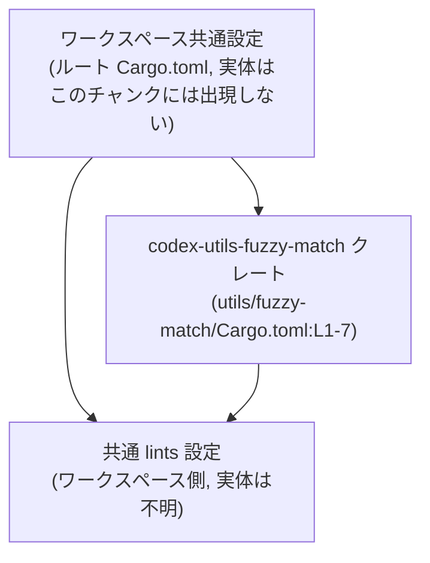
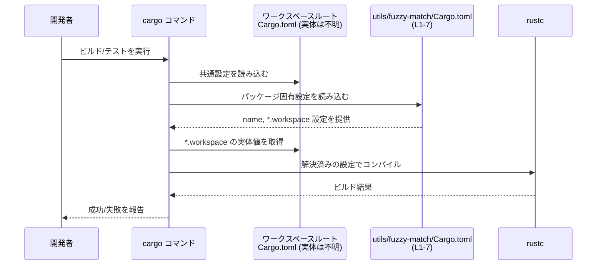

# utils/fuzzy-match/Cargo.toml コード解説

## 0. ざっくり一言

`utils/fuzzy-match/Cargo.toml` は、`codex-utils-fuzzy-match` クレートの **Cargo マニフェスト（ビルド設定ファイル）** であり、パッケージ名と、バージョン・エディション・ライセンス・lints をワークスペース共通設定から継承するように定義されています（Cargo.toml:L1-7）。

---

## 1. このモジュールの役割

### 1.1 概要

- このファイルは Rust のビルドツール **Cargo** 用の設定ファイルです。
- `codex-utils-fuzzy-match` というクレート名を定義し（Cargo.toml:L1-2）、  
  バージョン・エディション・ライセンス情報をワークスペースの設定から引き継ぎます（Cargo.toml:L3-5）。
- 同様に、lint 設定もワークスペース共通の設定を利用するよう指定されています（Cargo.toml:L6-7）。

このファイルからは、ファジーマッチング自体のロジックや公開 API は読み取れません。

### 1.2 アーキテクチャ内での位置づけ

このファイルは、Rust ワークスペース内の 1 クレートに対応する Cargo マニフェストです。  
`*.workspace = true` の記述から、ワークスペースルート側に共通設定が存在する前提になっています（Cargo.toml:L3-5, L7）。



- `WS` ノードの実際のファイルパスや中身は、このチャンクには現れていないため不明です。
- ただし、`version.workspace = true` などが有効になるには、`WS` 側で対応する項目が定義されている必要があります。

### 1.3 設計上のポイント

コード（設定）から読み取れる特徴は次のとおりです。

- **ワークスペース集中管理**  
  - バージョン・エディション・ライセンスをワークスペース側で一元管理し（Cargo.toml:L3-5）、  
    各クレートでは `name` のみをローカルに持つ構造になっています。
- **lint 設定もワークスペースに集約**  
  - `[lints]` テーブルで `workspace = true` としており（Cargo.toml:L6-7）、  
    lint レベルの設定もワークスペース共通のものを利用する設計です。
- **状態は保持しない設定ファイル**  
  - 実行時の状態やロジックではなく、ビルド時に使用される静的なメタデータのみを定義します。
- **エラー発生タイミングは「ビルド時」**  
  - 設定に矛盾がある場合（例: ワークスペース側に該当設定がない）、  
    実行時ではなく Cargo 実行時（ビルド / テスト時）にエラーになります。

---

## 2. 主要な機能一覧

この `Cargo.toml` が担う主な役割（機能）をまとめます。

- パッケージ名の定義:  
  - `name = "codex-utils-fuzzy-match"` でクレートのパッケージ名を定義します（Cargo.toml:L2）。
- バージョンのワークスペース継承:  
  - `version.workspace = true` により、ワークスペース共通のバージョンを利用します（Cargo.toml:L3）。
- エディションのワークスペース継承:  
  - `edition.workspace = true` により、Rust のエディション設定をワークスペース側に委譲します（Cargo.toml:L4）。
- ライセンスのワークスペース継承:  
  - `license.workspace = true` により、ライセンス表記をワークスペース共通設定から取得します（Cargo.toml:L5）。
- lints 設定のワークスペース継承:  
  - `[lints]` テーブルにおいて `workspace = true` とすることで、  
    lint レベルをワークスペース全体で統一します（Cargo.toml:L6-7）。

### 2.1 コンポーネントインベントリー（設定項目一覧）

このチャンクに現れる「コンポーネント」（設定ブロック・キー）の一覧です。

| コンポーネント                    | 種別        | 定義位置                     | 説明 |
|-----------------------------------|-------------|------------------------------|------|
| `[package]`                       | テーブル    | Cargo.toml:L1-5              | パッケージメタデータ（名前・バージョンなど）を定義するブロック |
| `name`                            | キー        | Cargo.toml:L2                | クレートのパッケージ名 (`codex-utils-fuzzy-match`) |
| `version.workspace = true`        | キー設定    | Cargo.toml:L3                | バージョン番号をワークスペース共通設定から継承 |
| `edition.workspace = true`        | キー設定    | Cargo.toml:L4                | Rust エディションをワークスペース共通設定から継承 |
| `license.workspace = true`        | キー設定    | Cargo.toml:L5                | ライセンス情報をワークスペース共通設定から継承 |
| `[lints]`                         | テーブル    | Cargo.toml:L6                | lint 設定をまとめるブロック |
| `workspace = true`（`[lints]`下） | キー設定    | Cargo.toml:L7                | lint 設定をワークスペース共通設定から継承 |

#### 関数・構造体インベントリー

このファイルは Cargo の設定ファイルであり、Rust の関数や構造体の定義は含みません。

| 名前 | 種別 | 定義位置 | 備考 |
|------|------|----------|------|
| （なし） | ー | ー | このチャンクには関数・構造体定義は存在しません |

---

## 3. 公開 API と詳細解説

このファイル自体には Rust の公開 API（関数・型）はありません。  
ここでは、ビルドシステムに対するインターフェースとして重要な設定項目を整理します。

### 3.1 型一覧（構造体・列挙体など）

このファイルには、Rust の構造体・列挙体・型エイリアスなどの定義は存在しません（Cargo.toml:L1-7 はすべて設定記述です）。

### 3.2 関数詳細

関数定義も存在しないため、このセクションに該当項目はありません。

### 3.3 その他の関数

同様に、補助的な関数やメソッドの定義もありません。

---

## 4. データフロー

ここでは、「ビルド時にこの `Cargo.toml` がどのように利用されるか」という観点でデータフローを説明します。

1. 開発者が `cargo build` や `cargo test` などのコマンドを実行します。
2. Cargo はワークスペースルートの `Cargo.toml` を読み込み、共通設定（バージョン・エディション・ライセンス・lints など）を解決します（ワークスペース側のファイル内容は、このチャンクには現れません）。
3. 各クレートごとの `Cargo.toml` を読み込みます。`codex-utils-fuzzy-match` については、このファイル（Cargo.toml:L1-7）が該当します。
4. このファイルの `*.workspace = true` 設定に従って、ワークスペース側から値が引き継がれます。
5. それらの情報を元に、Cargo が `rustc` にコンパイル設定を渡します。



このデータフローは、Cargo の一般的な動作に基づくものであり、`utils/fuzzy-match/Cargo.toml:L1-7` 単体から読み取れるのは「*ワークスペースから値を継承する設定になっている*」という点までです。

---

## 5. 使い方（How to Use）

### 5.1 基本的な使用方法

このファイルは「直接呼び出す」ものではなく、Cargo がビルド時に自動的に読み込みます。  
他のクレートからこのクレートを利用する場合の、典型的な依存関係の宣言例を示します。

```toml
# （例）ワークスペース内の別クレート側の Cargo.toml
[dependencies]
# codex-utils-fuzzy-match クレートをパス依存として指定する例
# 実際のパスはプロジェクトのディレクトリ構造に合わせて調整する
codex-utils-fuzzy-match = { path = "../utils/fuzzy-match" }
```

- 上記はあくまで一般的な例です。実際の相対パスは、このチャンクからは分かりません。
- このとき、バージョン・エディション・ライセンスは `utils/fuzzy-match/Cargo.toml` 経由でワークスペースから継承されます（Cargo.toml:L3-5）。

### 5.2 よくある使用パターン

1. **ワークスペース一括バージョン管理**  
   - ルートの `Cargo.toml` に一度だけバージョンを定義し、  
     個々のクレートでは `version.workspace = true` としてそろえる（Cargo.toml:L3）。

2. **共通 lint ポリシーの適用**  
   - ワークスペースルートで `[lints]` を定義し、各クレート側では `workspace = true` と書くだけで、  
     全クレートに同じ lint 設定が適用される（Cargo.toml:L6-7）。

3. **エディションの統一**  
   - 全クレートを同じ Rust エディションでコンパイルするため、  
     `edition.workspace = true` による一括管理をする（Cargo.toml:L4）。

### 5.3 よくある間違い

この設定スタイルで起こりがちな誤りと、その正しい例を示します。

```toml
[package]
name = "codex-utils-fuzzy-match"
version.workspace = true
# 間違い例: workspace から継承する設定と、ローカル指定を同時に書いている
# version = "0.1.0"  # ← これは削除する必要がある

# 正しい例: どちらか一方だけを使う
# （ワークスペース共通のバージョンを使いたい場合）
# version.workspace = true

# （このクレートだけ別バージョンにしたい場合）
# version = "0.1.0"
# # その場合、workspace側の設定と役割が変わることに注意する
```

注意点:

- 同じキーに対して `*.workspace = true` と実値 (`"0.1.0"` 等) を同時に記述すると、Cargo の仕様上エラーになります。
- ワークスペース共通設定を前提にしているため、ルート側から該当設定を削除すると、このクレートのビルドが失敗します。

### 5.4 使用上の注意点（まとめ）

- **ワークスペース側の設定が前提**  
  - `version.workspace`, `edition.workspace`, `license.workspace`, `lints.workspace` は、  
    ルートの `Cargo.toml` に対応するキーが定義されていることが前提です（Cargo.toml:L3-5, L7）。
- **設定の二重定義は避ける**  
  - 同じキーに対して `*.workspace = true` と実値を併記しないようにする必要があります。
- **ランタイムの安全性・並行性とは無関係**  
  - このファイルはビルド設定のみを扱い、実行時のメモリ安全性や並行性制御ロジックは含みません。  
    それらはソースコード側（例: `src/*.rs`）で扱われますが、このチャンクには現れていません。
- **ツールチェイン要件**  
  - `[lints]` テーブルなど、一部の設定は比較的新しい Cargo 機能です。  
    利用には対応するツールチェインが必要ですが、具体的なバージョンはこのファイルからは分かりません。

---

## 6. 変更の仕方（How to Modify）

### 6.1 新しい機能を追加する場合（このクレートのコード側）

このファイルには実装コードが含まれていないため、「機能追加」は通常 `src/` 以下の Rust ファイルに対して行われます。  
ただし、新機能に伴い依存クレートを追加する場合には、この `Cargo.toml` にセクションを追加します。

例: 新しい依存クレートを追加する場合

```toml
[package]
name = "codex-utils-fuzzy-match"
version.workspace = true
edition.workspace = true
license.workspace = true

[dependencies]
# 例として、serde を依存に追加する
serde = { version = "1", features = ["derive"] }
```

- このチャンク（Cargo.toml:L1-7）には `[dependencies]` セクションはまだ存在しません。  
  追加する場合は上のように新しいテーブルを定義します。
- 実際にどの依存が必要かは、このファイルからは判断できず、ソースコード側の要件に依存します。

### 6.2 既存の機能（設定）を変更する場合

設定を変更する際に注意すべき点を挙げます。

- **バージョン管理方針の変更**  
  - もしこのクレートだけ別バージョンにしたい場合は、`version.workspace = true` を削除し、  
    代わりに `version = "..."` を書く必要があります（Cargo.toml:L3）。  
    その際、ワークスペース全体のリリースポリシーとの整合性を確認する必要があります。
- **エディションの分離**  
  - 同様に `edition.workspace = true` をやめて、このクレート専用のエディションを指定することもできます（Cargo.toml:L4）。  
    ただし、ほかのクレートとエディションが異なると、使用できる言語機能や警告が変わる可能性があります。
- **lint ポリシーの個別調整**  
  - 特定の理由により、このクレートだけ lint を変えたい場合は、`[lints]` テーブルで  
    `workspace = true` を削除し、ローカルな lint 設定を記述します（Cargo.toml:L6-7）。  
    しかし、ワークスペース全体で統一された品質基準がある場合は、その方針との衝突に注意が必要です。
- **影響範囲の確認**  
  - これらの変更は、ワークスペース内の他クレートとの依存関係やリリースフローに影響する可能性があります。  
    実際にどのクレートが `codex-utils-fuzzy-match` に依存しているかは、このチャンクには現れていないため、  
    リポジトリ全体の依存グラフを別途確認する必要があります。

---

## 7. 関連ファイル

このチャンクから直接参照できる情報を元に、関係しうるファイル・設定を整理します。

| パス / 名称                           | 役割 / 関係 |
|--------------------------------------|------------|
| （ワークスペースルートの `Cargo.toml`） | `version`, `edition`, `license`, `lints` などの共通設定を定義し、本ファイルの `*.workspace = true` がそれを参照する前提になっています（Cargo.toml:L3-5, L7）。実際のパスや中身はこのチャンクには現れません。 |
| `utils/fuzzy-match/src/…`（想定）     | 通常、`Cargo.toml` に対応する Rust ソースコードは `src/` 以下に配置されますが、このチャンクには存在が示されていないため、実在するかどうかは不明です。 |

> 補足:  
> このファイル単体からは、テストコードやユーティリティモジュールなど、実装側の構成は分かりません。  
> 実際の公開 API やファジーマッチングロジックの詳細を把握するには、`src/` 以下の Rust ファイルを確認する必要があります。
