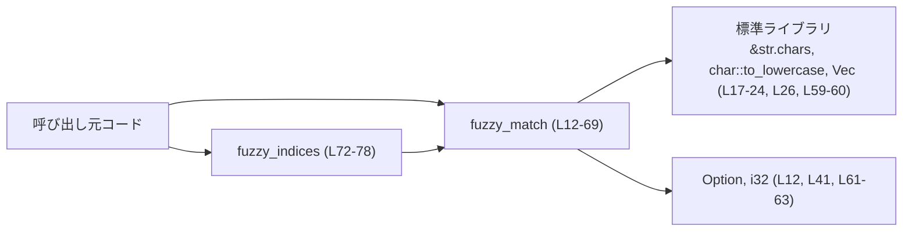
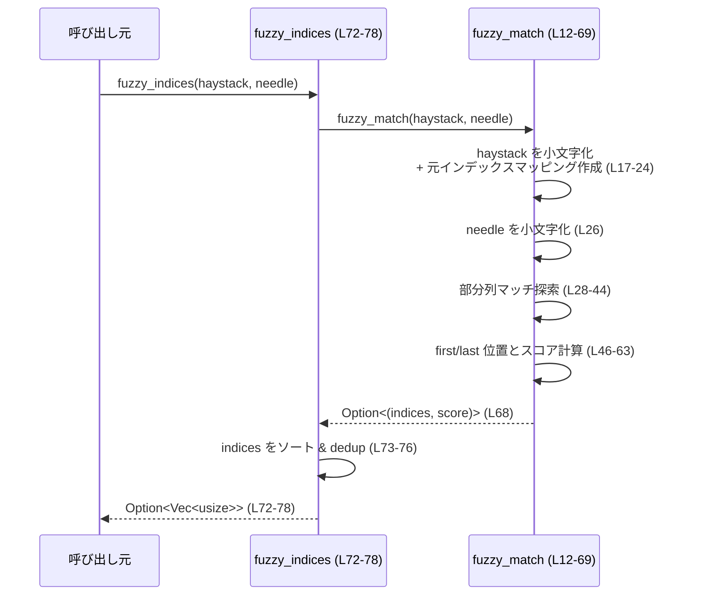

# utils/fuzzy-match/src/lib.rs コード解説

## 0. ざっくり一言

大文字小文字を無視して「needle が haystack の部分列として含まれるか」を判定し、  
マッチした元文字インデックスと「小さいほど良い」スコアを返すシンプルなファジーマッチ用ユーティリティです。

---

## 1. このモジュールの役割

### 1.1 概要

このモジュールは **文字列のファジーフィルタリング** を行うために存在し、以下の機能を提供します。

- 大文字小文字を無視した部分列マッチ（subsequence match）  
  （`haystack` の中に、順序を保ったまま `needle` の文字が現れるか）
- マッチした文字の **元の文字インデックスの集合** の返却
- マッチ範囲の詰まり具合・先頭一致を考慮した **スコアリング**（小さいほど高評価）

Unicode 文字を一度小文字化してからマッチングしますが、小文字化後の位置から元の文字位置へのマッピングを保持することで、**文字拡張（例: `İ` → `i̇`）が起きても元文字列に対するハイライトが安全に行える**ようにしています  
（`utils/fuzzy-match/src/lib.rs:L17-24`）。

### 1.2 アーキテクチャ内での位置づけ

このファイルはスタンドアロンなユーティリティで、公開関数は `fuzzy_match` と `fuzzy_indices` の 2 つです（`L12-69`, `L72-78`）。  
テスト以外で他の自前モジュールへの依存はなく、標準ライブラリのみを利用します。



※ 他のプロジェクト内モジュールとの関係は、このチャンクには現れないため不明です。

### 1.3 設計上のポイント

- **責務の分割**
  - コアロジック＋スコアリング: `fuzzy_match`（`L12-69`）
  - 便利ラッパー（スコア不要時）: `fuzzy_indices`（`L72-78`）

- **Unicode への配慮**
  - 各文字を `char::to_lowercase` で小文字化し、その結果の各文字に対応する元の文字インデックスを記録（`L17-24`）。
  - これにより、`İ` のように小文字化が複数文字に拡張しても、元の `haystack` のインデックスでハイライト可能。

- **エラーハンドリング方針**
  - マッチが存在しない場合は `None` を返す（`L41` の `?` による早期 `None`）。
  - マッチがある場合は `Some((indices, score))` を返す。panic を起こすコードはありません。

- **スコアリング方針**
  - マッチした最初と最後の小文字化位置の「窓幅 - needle 長さ」をベースにスコアを算出し（`L59-61`）、小さいほど良い。
  - 先頭から始まるマッチには大きなボーナス（`-100`）を与える（`L62-63`）。

- **状態と並行性**
  - グローバル状態は持たず、すべてのデータは関数ローカルな変数と引数のみ。
  - `unsafe` は使用しておらず（このチャンクに `unsafe` は現れません）、スレッド間で同時に呼び出してもデータ競合は発生しません。

---

## 2. 主要な機能一覧（コンポーネントインベントリー）

このチャンクに登場する関数・モジュールの一覧です（テストも含む）。

| 名前 | 種別 | 公開 | 定義位置（根拠） | 役割 / 用途 |
|------|------|------|------------------|-------------|
| `fuzzy_match` | 関数 | `pub` | `utils/fuzzy-match/src/lib.rs:L12-69` | 大文字小文字を無視した部分列マッチを行い、元インデックス列とスコアを返す。 |
| `fuzzy_indices` | 関数 | `pub` | `utils/fuzzy-match/src/lib.rs:L72-78` | `fuzzy_match` の結果からインデックスのみを返す簡易ラッパー。 |
| `tests` | モジュール | `cfg(test)` | `utils/fuzzy-match/src/lib.rs:L80-177` | `fuzzy_match` の挙動（ASCII, Unicode,スコアリング）のユニットテスト群。 |
| `ascii_basic_indices` | テスト関数 | 非公開 | `L84-93` | 基本的な ASCII マッチとスコアの確認。 |
| `unicode_dotted_i_istanbul_highlighting` | テスト関数 | 非公開 | `L95-104` | `İstanbul` に対する Unicode 小文字化＋ハイライトの確認。 |
| `unicode_german_sharp_s_casefold` | テスト関数 | 非公開 | `L106-109` | `ß` と `ss` を同一視しないことの確認。 |
| `prefer_contiguous_match_over_spread` | テスト関数 | 非公開 | `L111-126` | 連続マッチが離散マッチより高評価になることの確認。 |
| `start_of_string_bonus_applies` | テスト関数 | 非公開 | `L128-143` | 先頭一致ボーナスの確認。 |
| `empty_needle_matches_with_max_score_and_no_indices` | テスト関数 | 非公開 | `L145-153` | 空 needle の特別扱い（最大スコア & 空インデックス）の確認。 |
| `case_insensitive_matching_basic` | テスト関数 | 非公開 | `L155-164` | 大文字小文字を無視したマッチングの確認。 |
| `indices_are_deduped_for_multichar_lowercase_expansion` | テスト関数 | 非公開 | `L166-176` | 小文字化で複数文字になる場合のインデックス重複除去の確認。 |

---

## 3. 公開 API と詳細解説

### 3.1 型一覧（構造体・列挙体など）

このファイルには、公開されている構造体・列挙体はありません（関数のみです）。

---

### 3.2 関数詳細

#### `fuzzy_match(haystack: &str, needle: &str) -> Option<(Vec<usize>, i32)>`

**概要**

- `needle` が `haystack` の中に **部分列（順番を保ちながら間に文字が挟まってもよい）** として存在するかを大文字小文字を無視して調べます。
- マッチした場合は:
  - `haystack.chars().enumerate()` のインデックスに対応する `Vec<usize>`（マッチ文字位置の集合）
  - 「小さいほど良い」`i32` スコア
  を `Some` で返します（`L12, L68`）。
- マッチしない場合は `None` を返します（`L41` の `?`）。

**引数**

| 引数名 | 型 | 説明 |
|--------|----|------|
| `haystack` | `&str` | 検索対象の文字列。UTF-8 文字列として `chars()` 単位で扱われます（`L19`）。 |
| `needle` | `&str` | 探したいパターン文字列。大文字小文字は無視されます（`L26`）。 |

**戻り値**

- `Option<(Vec<usize>, i32)>`
  - `Some((indices, score))`:
    - `indices`: `haystack.chars().enumerate()` でのインデックス（0 始まり）の昇順・重複なし集合（`L66-67`）。
    - `score`: マッチの良さ。小さいほど良く、特に **先頭から始まる連続マッチ** は `-100` となります（`L61-63`, テスト `L117-120`, `L134-141`）。
  - `None`: `needle` のすべての文字が順序を保って `haystack` に現れない場合（`L31-41`）。

**内部処理の流れ（アルゴリズム）**

1. **空 needle の特別扱い**  
   - `needle.is_empty()` なら `Some((Vec::new(), i32::MAX))` を返し終了（`L13-15`）。
   - スコアは `i32::MAX` で、他のすべてのマッチよりも劣る扱いになります（テスト `L145-153`）。

2. **小文字化した haystack と元インデックスの対応表作成**（Unicode 対応）
   - `haystack.chars().enumerate()` で各文字とそのインデックス（`orig_idx`）を取得し（`L19`）、
   - 各文字について `ch.to_lowercase()` の結果を 1 文字ずつ `lowered_chars` に push（`L20-21`）、
   - 同時に、その文字が元の `haystack` の何番目の文字かを `lowered_to_orig_char_idx` に push（`L22`）。
   - これにより、**小文字化で 1 文字が複数文字に増えた場合でも、それらが元の 1 文字に対応していること**が分かります。

3. **小文字化した needle の作成**
   - `needle.to_lowercase().chars().collect()` によって `lowered_needle: Vec<char>` を得ます（`L26`）。

4. **部分列マッチの探索**
   - `lowered_chars` を `cur` というポインタで前から順に走査しながら、`lowered_needle` の各文字 `nc` を順に探します（`L28-37`）。
   - 各 `nc` について:
     - ループ `while cur < lowered_chars.len()` で `lowered_chars[cur] == nc` を探し（`L29-35`）、
     - 見つかれば `found_at = Some(cur)` としてポインタを 1 進めて抜ける（`L31-33`）、
     - 最終的に `found_at` が `None` のままなら `let pos = found_at?;` で関数全体が `None` を返して終了（`L37-41`）。
   - 見つかった場合、その位置 `pos` から元インデックス `lowered_to_orig_char_idx[pos]` を取得し `result_orig_indices` に追加（`L42`）。
   - 同時に「最後にマッチした小文字化位置」を `last_lower_pos` に記録（`L43`）。

5. **最初の小文字化位置 `first_lower_pos` の決定**
   - `result_orig_indices` が空なら `first_lower_pos = 0`（`L46-47`）。
   - そうでなければ、最初にマッチした元インデックス `target_orig` を基に、`lowered_to_orig_char_idx.iter().position(|&oi| oi == target_orig)` で **その元インデックスが lowered_chars に初めて現れる位置**を調べます（`L48-53`）。
   - 見つからなかった場合のフォールバックとして `unwrap_or(0)` により 0 を用いますが、このケースは正常系では起こらない想定です（`L53`）。

6. **スコアの計算**
   - `last_lower_pos` が `None` の場合は `first_lower_pos` と同じにする（`L58`）。
   - `window = (last_lower_pos - first_lower_pos + 1) - lowered_needle.len()` を計算（`L59-60`）。
     - `last` と `first` の間に含まれる小文字化文字数から needle の長さを引いたもの。
     - 連続マッチなら `window = 0`、間に余計な文字が多いほど大きくなります。
   - `let mut score = window.max(0);` で負の値は 0 に切り上げ（`L61`）。
   - さらに、`first_lower_pos == 0`（先頭からマッチが始まる）場合は `score -= 100` して強いボーナスを与えます（`L62-63`）。

7. **インデックスのソートと重複除去**
   - `result_orig_indices.sort_unstable();` で昇順ソートし（`L66`）、
   - `result_orig_indices.dedup();` で重複を削除（`L67`）。
     - これは、`İ` のような小文字化で複数文字に拡張されるケースで、同じ元インデックスが複数回入るのをまとめるためです（テスト `L166-176`）。
   - 最終的に `Some((result_orig_indices, score))` を返します（`L68`）。

**Examples（使用例）**

基本的な使用例（同一クレート内での利用を想定）です。

```rust
// ファイル名リストからクエリにマッチするものを探す例
fn main() {
    let files = vec!["README.md", "main.rs", "fuzzy_match.rs"];

    let query = "fuz";

    for name in files {
        if let Some((indices, score)) = fuzzy_match(name, query) {
            println!("matched: {name}, score={score}, indices={indices:?}");
            // indices は name.chars().enumerate() に対応するインデックス
            // なので、その位置をハイライトするなどに使える
        }
    }
}
```

**Errors / Panics**

- `Err` 型は使わず、失敗は `Option::None` で表現します。
  - `needle` の全ての文字が順序通りに見つからなかった場合、途中で `None` となります（`L37-41`）。
- `panic` を起こす操作はありません。
  - `unwrap_or(0)` を使用しており `unwrap()` は使っていません（`L53`）。
  - ベクタはすべて境界チェック付きインデックス（`lowered_chars[cur]` など）ですが、`cur < lowered_chars.len()` を保証した上でアクセスしています（`L29-35`）。

**Edge cases（エッジケース）**

- `needle` が空文字列:  
  - `Some((Vec::new(), i32::MAX))` を返します（`L13-15`）。  
    テスト: `empty_needle_matches_with_max_score_and_no_indices`（`L145-153`）。
- `haystack` が空で `needle` 非空:
  - 小文字化後の `lowered_chars` が空になり、最初の `found_at?` で `None` を返します（`L31-41`）。
- `haystack` と `needle` の長さが非常に異なる:
  - アルゴリズム上は問題ありませんが、スコアが大きくなりマッチとしては低評価になります（`window` が大きくなる、`L59-61`）。
- Unicode の小文字化拡張:
  - `İ` のような文字が小文字化で複数文字になる場合でも、インデックスは元文字に対して 1 つだけ返されます（ソート＋dedup、`L66-67`、テスト `L166-176`）。
- `ß` と `ss` の扱い:
  - 現実装では `straße` と `strasse` はマッチしないことがテストで確認されています（`L106-109`）。
  - つまり、フルな Unicode ケースフォールドまでは行っていません。

**使用上の注意点**

- **スコアの意味**
  - 小さいほど良い（`window` と先頭ボーナスで決定、`L59-63`）。
  - 先頭からの連続マッチは `-100`（テスト `L117-120`, `L134-141`）。
  - 異なる長さの haystack 間での比較には適していますが、「絶対的な類似度」ではなく、**順位付け用のスコア**という位置付けです。

- **大文字小文字**
  - 常に `to_lowercase` で比較するため、大文字小文字の違いは区別されません（`L17-21`, `L26`）。

- **Unicode ケースフォールドとの違い**
  - `ß` vs `ss` のような、より高度なケースフォールドまでは扱っていません（`L106-109`）。
  - そのため、ユーザーが「自然言語としての完全な大文字小文字同一視」を期待すると、期待と異なる可能性があります。

- **並行性**
  - グローバルな可変状態や `unsafe` を使用していないため、複数スレッドから同時に呼び出しても問題ありません。
  - ただし、大量の長い文字列に対して高頻度に呼び出すと CPU 使用量が増えます（メモリ確保を伴うため）。

---

#### `fuzzy_indices(haystack: &str, needle: &str) -> Option<Vec<usize>>`

**概要**

- `fuzzy_match` のラッパーで、スコアを無視して **インデックスだけ** を取得したい場合に使います（`L72-78`）。

**引数**

| 引数名 | 型 | 説明 |
|--------|----|------|
| `haystack` | `&str` | 検索対象文字列。 |
| `needle` | `&str` | 検索パターン文字列。 |

**戻り値**

- `Option<Vec<usize>>`
  - `Some(indices)`: `fuzzy_match(haystack, needle)` が `Some((indices, score))` を返した場合の `indices`（ソート＋重複除去済）を返します（`L73-77`）。
  - `None`: `fuzzy_match` が `None` の場合（マッチしない場合）。

**内部処理の流れ**

1. `fuzzy_match(haystack, needle)` を呼び出す（`L73`）。
2. 結果の `Option<(Vec<usize>, i32)>` に対して `map` を適用し、
   - タプル `(mut idx, _)` からスコアを破棄、
   - `idx.sort_unstable(); idx.dedup();` で再度ソート＆重複除去（`L73-76`）、
   - `idx` を返します。
3. `None` の場合はそのまま `None` を返します。

**Examples（使用例）**

```rust
fn main() {
    let name = "İstanbul";
    let query = "is";

    if let Some(indices) = fuzzy_indices(name, query) {
        println!("matched indices: {indices:?}"); // 例: [0, 1]
        // indices を使って name.chars().enumerate() でハイライトなどができる
    } else {
        println!("no match");
    }
}
```

**Errors / Panics**

- `fuzzy_match` と同様、失敗は `None` で表現されます。
- `panic` を起こすコードは含まれていません。

**Edge cases（エッジケース）**

- `needle` が空の場合:
  - `fuzzy_match` が `Some(([], i32::MAX))` を返すため、`fuzzy_indices` は `Some([])` を返します。
- `haystack` が空で `needle` 非空:
  - `fuzzy_match` が `None` のため、`fuzzy_indices` も `None` を返します。
- `indices` のソートと重複除去:
  - `fuzzy_match` 側でもソート＆重複除去を行っていますが（`L66-67`）、`fuzzy_indices` でも再度実施しています（`L73-76`）。
  - これは若干冗長ですが、インターフェースとしては問題ありません。

**使用上の注意点**

- スコアが不要で、ハイライトなど **位置情報だけ** が欲しい場合に適しています。
- どの候補がより良いマッチかを比較したい場合は、`fuzzy_match` のスコアを利用する必要があります。

---

### 3.3 その他の関数（テスト）

テスト関数は全て `mod tests` 内にあり、実行時にはコンパイルされません（`#[cfg(test)]`、`L80`）。

| 関数名 | 役割（1 行） | 定義位置 |
|--------|--------------|----------|
| `ascii_basic_indices` | `"hello"` と `"hl"` の基本的な ASCII マッチとスコア（-99）の確認（`L84-93`）。 | `utils/fuzzy-match/src/lib.rs:L84-93` |
| `unicode_dotted_i_istanbul_highlighting` | `"İstanbul"` と `"is"` のマッチで、インデックス [0,1] とスコア -99 となることの確認（`L95-104`）。 | `L95-104` |
| `unicode_german_sharp_s_casefold` | `"straße"` と `"strasse"` がマッチしないことの確認（`L106-109`）。 | `L106-109` |
| `prefer_contiguous_match_over_spread` | `"abc"` vs `"a-b-c"` で、連続マッチの方がスコアが良くなる（-100 < -98）ことの確認（`L111-126`）。 | `L111-126` |
| `start_of_string_bonus_applies` | 先頭からのマッチと途中からのマッチでスコアに差がつくことの確認（`L128-143`）。 | `L128-143` |
| `empty_needle_matches_with_max_score_and_no_indices` | 空 needle が最大スコア `i32::MAX` と空インデックスを返すことの確認（`L145-153`）。 | `L145-153` |
| `case_insensitive_matching_basic` | `"FooBar"` と `"foO"` が先頭連続マッチとして扱われ、インデックス [0,1,2] とスコア -100 になることの確認（`L155-164`）。 | `L155-164` |
| `indices_are_deduped_for_multichar_lowercase_expansion` | `"İ"` の小文字化が複数文字になる場合でも、インデックスが [0] のみ返ることの確認（`L166-176`）。 | `L166-176` |

---

## 4. データフロー

ここでは、`fuzzy_indices` を通じてファジーマッチを行う典型的なシナリオを示します。

1. 呼び出し元が `fuzzy_indices(haystack, needle)` を呼ぶ。
2. `fuzzy_indices` が `fuzzy_match` を呼び出し、マッチングとスコアリングを実行（`L72-73`）。
3. `fuzzy_match` 内で小文字化・部分列探索・スコア計算が行われる（`L17-63`）。
4. 結果のインデックスを `fuzzy_indices` が整形して返す（`L73-77`）。



直接 `fuzzy_match` を呼び出す場合は、`C` が `FM` に直接メッセージを送る形になります。

---

## 5. 使い方（How to Use）

### 5.1 基本的な使用方法

`fuzzy_match` を用いてフィルタリングとスコア付けを行う例です（同一クレート内想定）。

```rust
fn main() {
    let candidates = vec!["main.rs", "mod.rs", "fuzzy_match.rs"]; // 候補文字列
    let query = "fzmt";                                           // ユーザ入力のクエリ

    // マッチした候補だけをスコア付きで集める
    let mut matches = candidates
        .iter()
        .filter_map(|name| {
            fuzzy_match(name, query).map(|(indices, score)| {
                (name, indices, score) // マッチした候補のみ残す
            })
        })
        .collect::<Vec<_>>();

    // スコアの昇順（小さいほど良い）にソート
    matches.sort_by_key(|(_, _, score)| *score);

    for (name, indices, score) in matches {
        println!("name={name}, score={score}, hit_indices={indices:?}");
    }
}
```

- `indices` は `name.chars().enumerate()` に対応するインデックスなので、ハイライト表示などに利用できます。
- スコアを使って、候補のランキングを簡単に実装できます。

### 5.2 よくある使用パターン

1. **ハイライト付き検索結果表示**

   ```rust
   fn highlight_match(haystack: &str, needle: &str) -> Option<String> {
       let (indices, _score) = fuzzy_match(haystack, needle)?;
       let indices_set: std::collections::HashSet<_> = indices.into_iter().collect();

       // マッチ位置を [ ] で囲んで表示する
       let mut out = String::new();
       for (i, ch) in haystack.chars().enumerate() {
           if indices_set.contains(&i) {
               out.push('[');
               out.push(ch);
               out.push(']');
           } else {
               out.push(ch);
           }
       }
       Some(out)
   }
   ```

2. **単にマッチしたかどうかだけ知りたい**

   ```rust
   fn is_match(haystack: &str, needle: &str) -> bool {
       fuzzy_indices(haystack, needle).is_some()
   }
   ```

### 5.3 よくある間違い

```rust
// 誤り: None の可能性を考慮せずに unwrap してしまう
let (idx, score) = fuzzy_match("abc", "xyz").unwrap(); // マッチしないと panic の可能性

// 正しい例: Option を安全に処理する
if let Some((idx, score)) = fuzzy_match("abc", "xyz") {
    println!("matched at {idx:?} with score={score}");
} else {
    println!("no match");
}
```

```rust
// 誤り: この実装は常に大文字小文字を無視することを忘れている前提
let is_case_sensitive = true;
if is_case_sensitive {
    // fuzzy_match は常に to_lowercase で比較するため、ここで true にしても
    // 実際のマッチングはケースインセンシティブ
}

// 正しい理解: fuzzy_match は常に case-insensitive
let _ = fuzzy_match("FooBar", "foO"); // テストで確認済 (L155-164)
```

```rust
// 誤り: 'ß' と "ss" を同じとみなすことを期待する
assert!(fuzzy_match("straße", "strasse").is_some()); // <-- これは通らない

// 正しい例: 現行実装ではマッチしないことを前提に利用する必要がある
assert!(fuzzy_match("straße", "strasse").is_none()); // テスト L106-109
```

### 5.4 使用上の注意点（まとめ）

- **スコアの解釈**
  - 小さいほど良い。特に `-100` は「先頭からの連続マッチ」を意味し、最も高評価です。
  - 離れた位置にばらけたマッチはスコアが高くなり、順位が低くなります。

- **Option の扱い**
  - マッチしない場合は `None` が返るため、必ず `if let` / `match` などで `None` を考慮する必要があります。

- **Unicode の扱い**
  - `char::to_lowercase` ベースの処理であり、複雑なケースフォールド（`ß` vs `ss` など）までは考慮されていません。
  - 小文字化時の文字拡張には対応している（`İ` の例）一方で、言語学的に完全な正規化を期待する場面には向きません。

- **性能と並行性**
  - 1 回の呼び出しで `haystack` の長さに比例した処理（小文字化と 1 回の線形走査）を行います（`L17-24`, `L28-40`）。
  - マルチスレッド環境で並列に呼び出しても安全ですが、大量の長い文字列への高頻度な適用は CPU 負荷を考慮する必要があります。

---

## 6. 変更の仕方（How to Modify）

### 6.1 新しい機能を追加する場合

例として「スコアリングをカスタマイズ可能にしたい」場合を考えます。

1. **エントリポイントの検討**
   - 既存の `fuzzy_match` をそのまま残し、別関数（例: `fuzzy_match_with_config`）を追加するのが自然です。
   - 追加関数は `lib.rs` に定義し、必要なら設定用の構造体を同ファイルか別モジュールに追加します（このチャンクにはまだ構造体はありません）。

2. **既存ロジックの再利用**
   - 小文字化＆マッピング部分（`L17-26`）と部分列探索部分（`L28-44`）はそのまま利用し、スコア計算部分（`L46-63`）のみを分離して関数化する構成が考えられます。
   - ただし、実際に切り出す際はテストがカバーしている挙動を維持する必要があります（`L84-176`）。

3. **API の公開**
   - 新しい関数を `pub fn` として公開するか、内部専用にとどめるかを用途に応じて決めます。

### 6.2 既存の機能を変更する場合

特に `fuzzy_match` の挙動変更は影響範囲が大きいため、次の点に注意が必要です。

- **契約（前提条件・返り値の意味）の確認**
  - `needle` が空のとき `Some(…, i32::MAX)` を返す契約（`L13-15`, テスト `L145-153`）。
  - インデックスが昇順＆重複なしで返る契約（`L66-67`, テスト `L166-176`）。
  - 先頭一致ボーナスや連続マッチ優遇といったスコアリングの相対的関係（`L59-63`, テスト `L111-126`, `L128-143`）。

- **テストの更新**
  - 上記の契約に関わる変更を行った場合は、対応するテストの期待値を更新するか、新しいテストを追加する必要があります。
  - テスト一覧: `mod tests` 内の 8 関数（`L84-176`）。

- **エラーパスの維持**
  - `None` の条件（マッチ不成立）が変わっていないか確認し、依存コードがその変化を許容できるかを検討します。

---

## 7. 関連ファイル

このチャンク内で参照されているのは標準ライブラリのみであり、他の自前ファイルとの関係は確認できません。

| パス | 役割 / 関係 |
|------|------------|
| `utils/fuzzy-match/src/lib.rs` | ファジーマッチングのコア実装およびユニットテストを含む。 |
| （不明） | このモジュールを呼び出す上位モジュールやバイナリクレートは、このチャンクには現れません。 |

以上が、`utils/fuzzy-match/src/lib.rs` に関する公開 API・コアロジック・データフロー・安全性などの整理です。
