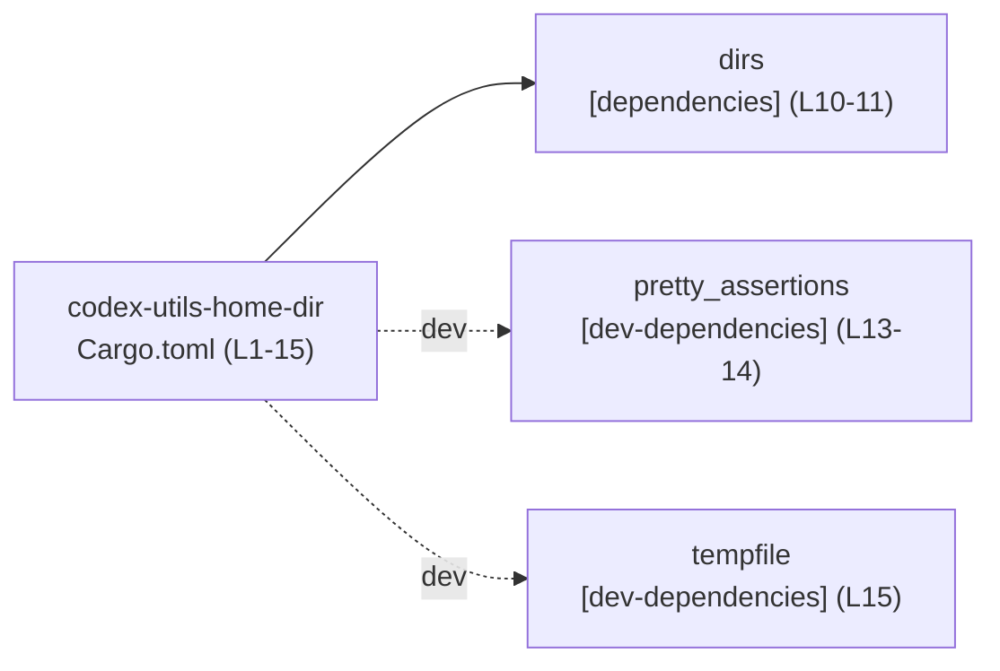
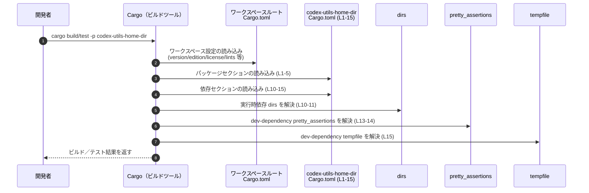

# utils\home-dir\Cargo.toml コード解説

## 0. ざっくり一言

`utils\home-dir\Cargo.toml` は、ワークスペース内のクレート `codex-utils-home-dir` の **パッケージメタデータと依存関係** を定義する Cargo マニフェストです（utils\home-dir\Cargo.toml:L1-5, L10-15）。

---

## 1. このモジュールの役割

### 1.1 概要

- このファイルは、クレート `codex-utils-home-dir` の **名前** と、**バージョン／edition／license をワークスペースから継承する設定** を行います（L1-5）。
- ワークスペース共通の **lint 設定** を有効化します（L7-8）。
- 実行時依存として `dirs` クレートを、開発時依存として `pretty_assertions` と `tempfile` を宣言します（L10-11, L13-15）。
- Rust の関数や構造体の定義はこのファイルには含まれておらず、**API やロジックはここからは分かりません**。

### 1.2 アーキテクチャ内での位置づけ

`codex-utils-home-dir` クレートは、ワークスペース内の 1 コンポーネントとして定義され、依存クレートを通じて他コンポーネントと間接的に関わります。

- パッケージ名: `codex-utils-home-dir`（L1-2）
- ワークスペース共通項目: `version.workspace`, `edition.workspace`, `license.workspace`（L3-5）
- 実行時依存: `dirs`（L10-11）
- 開発時依存: `pretty_assertions`, `tempfile`（L13-15）

これを依存関係図で表します。



- `A → B`: `codex-utils-home-dir` は実行時に `dirs` に依存します（L10-11）。
- `A -.dev.-> C/D`: テストや開発補助として `pretty_assertions` と `tempfile` を使用する前提になっています（L13-15）。

`dirs` は一般的に「ホームディレクトリなどの標準ディレクトリ取得」を提供するクレートです。このことから、クレート名 `codex-utils-home-dir` と合わせると「ホームディレクトリ関連ユーティリティ」であることが示唆されますが、**実際の API や実装はこのファイルには存在しません**。

### 1.3 設計上のポイント

コードから読み取れる設計上の特徴は次のとおりです。

- **ワークスペース一元管理**
  - バージョン・edition・license はすべてワークスペース側に委譲しています（`*.workspace = true`、L3-5）。
  - lints 設定もワークスペース共通のものを使用しています（L7-8）。
- **依存の最小化**
  - 実行時依存は `dirs` のみで、依存ツリーを抑えています（L10-11）。
- **開発時依存の分離**
  - テスト改善用の `pretty_assertions` と一時ディレクトリ用の `tempfile` を dev-dependencies として分離しています（L13-15）。
- **状態・ロジックの非保持**
  - このファイルは設定のみを記述するため、実行時の状態やロジック、エラーハンドリング方針、並行性に関する情報は含まれていません。

---

## 2. 主要な機能一覧（コンポーネントインベントリー）

このファイルからは具体的な「機能（関数やメソッド）」は分かりませんが、**コンポーネント（クレート単位）** として次の要素が現れています。

- `codex-utils-home-dir`（パッケージ）
  - 役割: ホームディレクトリ関連ユーティリティであることが名称から示唆されます（L1-2）。
  - バージョン／edition／license はワークスペースルートで定義された値を利用します（L3-5）。
- `dirs`（実行時依存）
  - 役割: OS ごとの標準ディレクトリ（ホームディレクトリなど）へのパス取得を提供するクレートとして知られています（一般的なクレート知識）。依存定義は L10-11。
- `pretty_assertions`（開発時依存）
  - 役割: アサーション失敗時に見やすい diff を表示するために用いられることが多いテスト支援クレートです。依存定義は L13-14。
- `tempfile`（開発時依存）
  - 役割: 一時ファイルや一時ディレクトリを安全に扱うためのクレートで、テストで一時ディレクトリを扱う際などに使われることが多いです（L15）。

**関数や構造体など、Rust のコードコンポーネントはこのファイルには現れません。**

---

## 3. 公開 API と詳細解説

### 3.1 型一覧（構造体・列挙体など）とコードコンポーネントインベントリー

このファイルは Cargo の設定ファイルであり、Rust の型定義は含まれていません。

#### Rust コードコンポーネントインベントリー（このチャンク）

| 種別     | 名前 | 定義箇所                                    | 備考 |
|----------|------|---------------------------------------------|------|
| 関数     | なし | –                                           | `utils\home-dir\Cargo.toml:L1-15` に関数定義は存在しません |
| 構造体   | なし | –                                           | 同上 |
| 列挙体   | なし | –                                           | 同上 |
| トレイト | なし | –                                           | 同上 |

> このチャンクには Rust ソースコードが含まれていないため、**公開 API / コアロジックは一切判別できません**。

### 3.2 関数詳細

- **該当なし**
  - このファイルには関数定義がないため、「関数詳細テンプレート」を適用できる対象がありません（utils\home-dir\Cargo.toml:L1-15 全体）。

### 3.3 その他の関数

- **該当なし**
  - 補助関数やラッパー関数も、このファイルには存在しません。

---

## 4. データフロー

このファイルにロジックはありませんが、**ビルド時の設定読み込みフロー**という観点で「データ（設定情報）」の流れを整理できます。

### 4.1 ビルド時の設定読み込みフロー

Cargo が `codex-utils-home-dir` をビルドするときの典型的な流れは次のようになります。

1. 開発者が `cargo build -p codex-utils-home-dir` や `cargo test -p codex-utils-home-dir` を実行する。
2. Cargo はワークスペースルートの `Cargo.toml` を読み込み、ワークスペースメンバーと共通設定（`version`, `edition`, `license`, `lints` など）を解決する。
3. その後、このファイル `utils\home-dir\Cargo.toml`（L1-15）を読み込む。
4. `name = "codex-utils-home-dir"`（L1-2）、`version.workspace = true` など（L3-5）から、クレート自身のメタデータを確定する。
5. `[dependencies]` セクション（L10-11）から実行時依存 `dirs` を、`[dev-dependencies]` セクション（L13-15）から開発時依存 `pretty_assertions`, `tempfile` を解決し、ビルドプランを構築する。

この流れをシーケンス図で表すと次のようになります。



> この図は **Cargo の一般的な挙動** を示しています。`codex-utils-home-dir` 内部での関数呼び出しやデータフローは、このチャンクからは不明です。

---

## 5. 使い方（How to Use）

### 5.1 基本的な使用方法（このマニフェストの観点）

このファイル自体は手で編集する設定ファイルであり、「関数呼び出し」のような使用方法はありません。  
ここでは、このクレートを他のクレートから利用する典型的な流れを示します（コードは **例示** であり、このチャンクには存在しません）。

#### 1. 同一ワークスペース内の別クレートから依存する例（想定）

```toml
# 他クレートの Cargo.toml（例）
[dependencies]
codex-utils-home-dir = { path = "utils/home-dir" }  # 同一リポジトリ内のパス依存
```

- 前提: 現在のリポジトリ構造が `utils/home-dir/Cargo.toml` であることは、このチャンクのファイルパスから分かります。
- 上記のように `path` 依存を記述すると、そのクレートから `codex-utils-home-dir` の公開 API を利用できます。
- ただし、その「公開 API」が何かは、このファイルからは分かりません（Rust ソースコードがこのチャンクに存在しないため）。

### 5.2 よくある使用パターン

このマニフェストの設定から推測できる **使用パターン** は次のとおりです。

- `dirs` を通じたパス操作
  - 実行時にホームディレクトリなどを取得する用途で `dirs` が使われるケースが一般的です（L10-11）。
- テスト補助用の `pretty_assertions` と `tempfile`
  - `pretty_assertions` により、テスト失敗時の差分確認がしやすくなります（L13-14）。
  - `tempfile` により、一時的なディレクトリ・ファイルを安全に生成し、テスト終了後に自動削除するパターンが考えられます（L15）。

具体的なテストコード例はこのチャンクには含まれていないため、ここでは一般的なイメージの例だけを示します。

```rust
// 以下は「このクレートを使ったテスト」のイメージ例であり、
// utils\home-dir\Cargo.toml には現れていません。

use tempfile::tempdir;            // L15 で宣言されている dev-dependency の利用イメージ
use pretty_assertions::assert_eq; // L13-14 で宣言されている dev-dependency の利用イメージ

#[test]
fn example_test() -> Result<(), Box<dyn std::error::Error>> {
    let tmp = tempdir()?; // 一時ディレクトリを作成
    let path = tmp.path().join("test.txt");

    // ここで仮に codex-utils-home-dir の API を使うと仮定（実際の API はこのチャンクから不明）
    // let home_path = codex_utils_home_dir::home_dir()?;

    // pretty_assertions を使った見やすい比較
    assert_eq!(path.exists(), false);
    Ok(())
}
```

> 上記コードは **一般的な利用例** であり、実際の API 名や関数はこのファイルからは特定できません。

### 5.3 よくある間違い（このファイルに関するもの）

このファイルに関して起こりうる誤りは、主に **Cargo 設定レベルのミス** です。

```toml
# 間違い例: ワークスペースで version が定義されていないのに workspace = true を使う
[package]
name = "codex-utils-home-dir"
version.workspace = true   # ← ルートの [workspace.package] 等に version がないとエラーになる
```

```toml
# 正しい例: ワークスペース側に version を定義する（このチャンクにはルートファイルは現れません）
[workspace.package]
version = "0.1.0"
edition = "2021"
license = "MIT"
```

- このファイル（L3-5）は `version.workspace = true` などを使っているため、  
  ルートのワークスペース `Cargo.toml` 側に対応する設定がないと `cargo` 実行時にエラーとなります。

### 5.4 使用上の注意点（まとめ）

- **ワークスペース依存**
  - `version.workspace = true` などの記述（L3-5）は、ワークスペースルートに対応する設定があることを前提としています。
  - ルート側の設定を削除・変更すると、このクレートのビルドにも影響します。
- **依存関係の範囲**
  - 実行時の挙動は `dirs` クレートに依存します（L10-11）。`dirs` の仕様変更は、このクレートの挙動に影響する可能性がありますが、このチャンクからはどう使っているかは分かりません。
- **dev-dependencies は本番環境には影響しない**
  - `pretty_assertions` と `tempfile` は `[dev-dependencies]`（L13-15）なので、通常は本番バイナリにはリンクされません。
- **スレッド安全性・エラーハンドリング・並行性**
  - これらに関する情報は、この Cargo.toml だけからは一切読み取れません。実際の Rust コード（`src/lib.rs` など）が必要です。

---

## 6. 変更の仕方（How to Modify）

### 6.1 新しい機能を追加する場合（依存追加）

新機能を追加する際に新たな外部クレートが必要になった場合、このファイルに対する変更は主に次のステップになります。

1. **実行時依存を追加する**
   - `[dependencies]` に追記します（`dirs` が定義されている L10-11 と同じセクション）。

   ```toml
   [dependencies]
   dirs = { workspace = true }           # 既存（L10-11）
   anyhow = "1.0"                        # 例: エラー処理用クレートを追加
   ```

   - 上記は例示であり、実際に `anyhow` を使っているかどうかはこのチャンクからは分かりません。

2. **テスト専用の依存を追加する**
   - テストや開発ツール用であれば `[dev-dependencies]`（L13-15）に追加します。

   ```toml
   [dev-dependencies]
   pretty_assertions = { workspace = true }  # 既存（L13-14）
   tempfile = { workspace = true }          # 既存（L15）
   insta = "1.0"                            # 例: スナップショットテスト用
   ```

3. **ワークスペース共有を使うかどうか判断する**
   - 既存の `dirs` や `pretty_assertions` のように、バージョンをワークスペースで一元管理したい場合は `workspace = true` を使います（L10, L13-15 参照）。
   - 個別にバージョンを指定したい場合は `workspace = true` の代わりに `"x.y.z"` を指定します。

### 6.2 既存の機能を変更する場合（メタデータ・依存の変更）

このファイルの変更時に注意すべき点を整理します。

- **パッケージ情報の変更**
  - `name`（L1-2）を変更すると、クレート名が変わり、他クレートからの参照名も変わります。
  - `version.workspace = true` などを個別指定に切り替える場合は、ワークスペースとの整合性に注意が必要です。
- **依存関係の変更**
  - `dirs` を別のクレートに切り替える場合（例: `dirs-next` など）、Rust コード側での API 呼び出しも変更が必要です。このチャンクだけでは影響範囲を特定できません。
  - `pretty_assertions` や `tempfile` を削除する場合、対応するテストコードの修正や削除が必要です。
- **影響範囲の確認**
  - このファイルに対する変更は、`codex-utils-home-dir` を依存としている他クレートの **コンパイル結果や挙動** に影響します。
  - 依存の削除・バージョン変更時には、ワークスペース全体で `cargo test` を実行して破壊的変更がないか確認することが望ましいです。

---

## 7. 関連ファイル

このファイルと密接に関係すると思われるファイル・ディレクトリを整理します。

| パス                         | 役割 / 関係 |
|------------------------------|------------|
| （ワークスペースルート）`Cargo.toml` | `version.workspace = true` などの設定（L3-5, L7-8）を解決するために必須となるファイルです。このチャンクには内容は現れませんが、Cargo の仕様上存在が前提です。 |
| `utils/home-dir/src/lib.rs` または `src/main.rs`（推定） | `codex-utils-home-dir` クレートの実際の Rust ソースコードのエントリポイントであると推定されます。実際の API やロジックはここに定義されているはずですが、このチャンクには含まれていません。 |
| ワークスペース内の他クレートの `Cargo.toml` | `codex-utils-home-dir` を依存として利用している可能性がありますが、このチャンクからはどのクレートが参照しているかは分かりません。 |
| テストコード（例: `utils/home-dir/tests/` や `src/lib.rs` 内の `#[cfg(test)]` モジュール） | `pretty_assertions`（L13-14）や `tempfile`（L15）を利用していると考えられるテストコードですが、具体的なパスや内容はこのチャンクには現れません。 |

---

### まとめ

- `utils\home-dir\Cargo.toml` は **設定専用ファイル** であり、公開 API・コアロジック・並行性・エラーハンドリングについては **このチャンクからは一切判断できません**。
- 読み取れるのは、ワークスペース設定との連携（L3-5, L7-8）と、依存クレート `dirs` / `pretty_assertions` / `tempfile` の存在（L10-15）のみです。
- より詳細な解析（関数・構造体インベントリー、エッジケース、実際のデータフロー等）には、同ディレクトリ配下の Rust ソースファイルの情報が必要になります。
