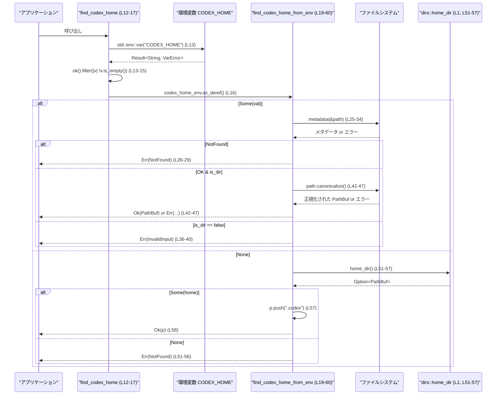

# utils/home-dir/src/lib.rs コード解説

## 0. ざっくり一言

Codex の設定ディレクトリ（`CODEX_HOME` 環境変数、なければ `~/.codex`）のパスを求めるユーティリティです。（根拠: `utils/home-dir/src/lib.rs:L4-11, L12-17, L19-60`）

---

## 1. このモジュールの役割

### 1.1 概要

- このモジュールは、Codex の「ホームディレクトリ」（設定・キャッシュを置く場所）を一意に決定する役割を持ちます。
- `CODEX_HOME` 環境変数が指定されていればそれを優先し、ディレクトリの存在確認とパスの正規化（canonicalize）を行います。（根拠: `L19-49`）
- `CODEX_HOME` が指定されていない場合は、OS ユーザーのホームディレクトリ配下の `~/.codex` を返します。（根拠: `L20-22, L50-59`）
- エラー時には `std::io::Error` を返し、呼び出し側が詳細な原因を判別できるようにメッセージを付与します。（根拠: `L25-33, L36-40, L42-47, L51-56`）

### 1.2 アーキテクチャ内での位置づけ

- 公開 API は `find_codex_home` の 1 関数のみです。（根拠: `L12-17`）
- 実際の解決ロジックは非公開の `find_codex_home_from_env` に切り出されています。（根拠: `L19-60`）
- 環境変数の読み取り・ファイルシステムの操作・ユーザーホームディレクトリの取得は標準ライブラリと `dirs` クレートに委譲しています。（根拠: `L1, L19-24, L25-34, L51-57`）

```mermaid
graph TD
  Caller["呼び出し側アプリケーション"] --> FCH["find_codex_home (L12-17)"]
  FCH --> FCHEnv["find_codex_home_from_env (L19-60)"]

  FCHEnv --> Env["std::env::var(\"CODEX_HOME\") (L13-16)"]
  FCHEnv --> FSMetadata["std::fs::metadata (L25-34)"]
  FCHEnv --> Canon["PathBuf::canonicalize (L42-47)"]
  FCHEnv --> DirsHome["dirs::home_dir (L1, L51-57)"]
```

### 1.3 設計上のポイント

- **責務分割**
  - 「環境変数から Option<&str> を構成する」部分と、「その値から最終パスを決定する」部分を別関数に分離しています。（`find_codex_home` / `find_codex_home_from_env`、根拠: `L12-17, L19-60`）
  - テストは後者 `find_codex_home_from_env` を直接呼び出すことで、環境変数に依存しないテストを書いています。（根拠: `L63-65, L72-128`）
- **状態**
  - モジュール内にグローバルな可変状態はなく、関数は入力（環境変数の値／ファイルシステム状態）に対して決定的な `Result<PathBuf>` を返します。
- **エラーハンドリング**
  - すべて `std::io::Result<PathBuf>` で返し、`ErrorKind` と詳細メッセージを明示的に構成します。（根拠: `L19, L25-33, L36-40, L42-47, L51-56`）
  - 環境変数が非 UTF-8 の場合はエラーにせず、「未設定（None）」扱いにしています（`std::env::var(...).ok()` の使用、根拠: `L13-15`）。
- **並行性**
  - 明示的なスレッド・非同期処理は使っておらず、標準 I/O（`std::fs::metadata`, `PathBuf::canonicalize`）と環境変数読み取りのみです。
  - Rust の安全性の観点では、共有可変状態や `unsafe` は使っていないため、型システム上のスレッド安全性は保たれています（ただし環境変数・ファイルシステムの状態はプロセス外部要因で変化しえます）。

---

## 2. 主要な機能一覧（コンポーネントインベントリー）

### 2.1 関数・モジュール一覧

| 種別 | 名前 | 公開 | 位置 | 役割 / 説明 | 根拠 |
|------|------|------|------|------------|------|
| 関数 | `find_codex_home()` | `pub` | L12-17 | Codex ホームディレクトリを決定する公開 API。環境変数 `CODEX_HOME` とデフォルト値の仲介を行う。 | `utils/home-dir/src/lib.rs:L4-17` |
| 関数 | `find_codex_home_from_env(codex_home_env: Option<&str>)` | 非公開 | L19-60 | 環境変数相当の値から、存在確認・ディレクトリ確認・canonicalize を行って `PathBuf` を返す中核ロジック。 | `utils/home-dir/src/lib.rs:L19-60` |
| モジュール | `tests`（`cfg(test)`） | 非公開 | L63-128 | 上記ロジックのテスト。環境変数値を直接渡して挙動を検証する。 | `utils/home-dir/src/lib.rs:L63-128` |
| テスト関数 | `find_codex_home_env_missing_path_is_fatal` | テスト | L72-86 | `CODEX_HOME` が存在しないパスの場合に `ErrorKind::NotFound` になることを検証。 | `L72-86` |
| テスト関数 | `find_codex_home_env_file_path_is_fatal` | テスト | L88-103 | `CODEX_HOME` がファイルを指すときに `ErrorKind::InvalidInput` になることを検証。 | `L88-103` |
| テスト関数 | `find_codex_home_env_valid_directory_canonicalizes` | テスト | L105-118 | `CODEX_HOME` が有効なディレクトリのとき、返り値が canonicalize されたパスであることを検証。 | `L105-118` |
| テスト関数 | `find_codex_home_without_env_uses_default_home_dir` | テスト | L121-127 | `CODEX_HOME` が None のとき、`dirs::home_dir()/.codex` が返ることを検証。 | `L121-127` |

### 2.2 外部依存コンポーネント

| コンポーネント | 用途 | 位置 | 根拠 |
|----------------|------|------|------|
| `dirs::home_dir` | OS ユーザーのホームディレクトリ `PathBuf` を取得 | L1, L51-57 | `use dirs::home_dir;` と None ブランチでの使用 |
| `std::env::var` | 環境変数 `CODEX_HOME` の取得 | L13-16 | `std::env::var("CODEX_HOME")` |
| `std::fs::metadata` | 指定パスの存在確認と種別（ファイル/ディレクトリ）の取得 | L25-34 | `let metadata = std::fs::metadata(&path)...` |
| `PathBuf::canonicalize` | ディレクトリパスの正規化（絶対パス化） | L42-47 | `path.canonicalize().map_err(...)` |
| `tempfile::TempDir` | テストでの一時ディレクトリ作成 | L70, L72-75, L89-92, L106-107 | `use tempfile::TempDir;` など |
| `pretty_assertions::assert_eq` | テストでの比較表示向上 | L67 | `use pretty_assertions::assert_eq;` |

---

## 3. 公開 API と詳細解説

### 3.1 型一覧（構造体・列挙体など）

このファイル内で定義される新しい構造体・列挙体はありません。  
使用している主な型は標準ライブラリ・外部クレート由来の以下のものです。

| 名前 | 種別 | 役割 / 用途 | 根拠 |
|------|------|-------------|------|
| `PathBuf` | 構造体（標準ライブラリ） | パスの所有型として Codex ホームディレクトリを表現する。 | `L2, L12, L19, L24, L51-58` |
| `std::io::Result<PathBuf>` | 型エイリアス | ホームディレクトリ決定処理の成功／失敗を表現。 | `L12, L19` |
| `std::io::ErrorKind` | 列挙体 | エラーの種類（NotFound, InvalidInput など）を区別。 | `L26-28, L31-33, L38-39, L53-54` |

### 3.2 関数詳細

#### `find_codex_home() -> std::io::Result<PathBuf>`

**概要**

- Codex のホームディレクトリのパスを返す公開関数です。（根拠: `L4-12`）
- 環境変数 `CODEX_HOME` が設定されていればその値を用い、未設定・空文字・非 UTF-8 の場合はデフォルトのホームディレクトリ `~/.codex` を返します。（根拠: `L13-16`）

**引数**

- なし

**戻り値**

- `Ok(PathBuf)`:
  - 成功時の Codex ホームディレクトリパス。
- `Err(std::io::Error)`:
  - `CODEX_HOME` の内容が不正（存在しない／ディレクトリでない／canonicalize 失敗）な場合。
  - `dirs::home_dir()` がホームディレクトリを返せなかった場合。（根拠: `L19-60`）

**内部処理の流れ（アルゴリズム）**

1. `std::env::var("CODEX_HOME")` を呼び、結果を `Result<String, VarError>` として受け取る。（根拠: `L13`）
2. `.ok()` により、成功なら `Some(String)`、エラーなら `None` として、非 UTF-8 を含むすべてのエラーを「未設定」と同等扱いにする。（根拠: `L13`）
3. `.filter(|val| !val.is_empty())` により、空文字列の場合も `None` として扱う。（根拠: `L14-15`）
4. `codex_home_env.as_deref()` で `Option<&String>` を `Option<&str>` に変換し、`find_codex_home_from_env` に引き渡す。（根拠: `L16`）
5. 以降の処理は `find_codex_home_from_env` に委譲される。（根拠: `L16-17, L19-60`）

**Examples（使用例）**

```rust
use std::io;

// main 関数などからホームディレクトリを取得する例
fn main() -> io::Result<()> {
    // Codex ホームディレクトリを解決
    let codex_home = find_codex_home()?;        // CODEX_HOME または ~/.codex

    // 必要に応じてディレクトリを作成する
    std::fs::create_dir_all(&codex_home)?;      // 存在しない場合に作成

    println!("Codex home: {}", codex_home.display());
    Ok(())
}
```

※ `find_codex_home` がどのモジュールから公開されているかはこのチャンクからは分からないため、`use` パスは省略しています。

**Errors / Panics**

- この関数自体はパニックしません（`expect`, `unwrap` を使用していません、根拠: `L12-17`）。
- 返し得るエラーはすべて `find_codex_home_from_env` に由来します。
  - `ErrorKind::NotFound`:
    - `CODEX_HOME` が存在しないパスを指している。（根拠: `L25-28`）
    - または、`dirs::home_dir()` が `None` を返し、ホームディレクトリが特定できない。（根拠: `L51-56`）
  - `ErrorKind::InvalidInput`:
    - `CODEX_HOME` がディレクトリではなくファイル等を指している。（根拠: `L36-40`）
  - その他の `ErrorKind`:
    - `std::fs::metadata` や `canonicalize` が OS 由来の別種のエラーを返した場合。（根拠: `L30-33, L42-47`）

**Edge cases（エッジケース）**

- `CODEX_HOME` が非 UTF-8:
  - `std::env::var` が `Err(VarError::NotUnicode)` を返し、`.ok()` により `None` となるため、「環境変数未設定」と同じ扱いになります。（根拠: `L13`）
- `CODEX_HOME` が空文字列:
  - `.filter(|val| !val.is_empty())` により `None` 扱いになります。（根拠: `L14-15`）
- `CODEX_HOME` が存在しないパス:
  - `find_codex_home_from_env` 側で `ErrorKind::NotFound` のエラーになります。（根拠: `L25-28`）
- デフォルトパス `~/.codex`:
  - ディレクトリの存在確認や作成は行われず、そのまま `PathBuf` として返されます。（根拠: `L50-58`）

**使用上の注意点**

- デフォルトパス（`CODEX_HOME` 未設定時）は存在確認を行わないため、呼び出し側で `std::fs::create_dir_all` などを使って作成する前提になります。（根拠: `L50-59`）
- 非 UTF-8 の `CODEX_HOME` は「未設定」とみなされるため、そのような環境では意図せず `~/.codex` が使われる可能性があります。
- ブロッキング I/O（`metadata`, `canonicalize`, `home_dir`）を使用しているため、非同期コンテキストでは専用のブロッキングスレッドなどで呼び出すことが望ましいです。

---

#### `find_codex_home_from_env(codex_home_env: Option<&str>) -> std::io::Result<PathBuf>`

**概要**

- `CODEX_HOME` 環境変数に相当する値（`Option<&str>`）から Codex ホームディレクトリを決定する内部関数です。（根拠: `L19-23`）
- 値が `Some` の場合はパスの存在確認・ディレクトリ確認・canonicalize を行い、`None` の場合は `dirs::home_dir()/.codex` を返します。（根拠: `L22-23, L24-49, L50-59`）

**引数**

| 引数名 | 型 | 説明 |
|--------|----|------|
| `codex_home_env` | `Option<&str>` | `CODEX_HOME` 環境変数の値に相当する文字列。`Some` なら環境変数が設定済み、`None` なら未設定扱い。 |

**戻り値**

- `Ok(PathBuf)`:
  - 有効な Codex ホームディレクトリパス。
  - `Some` ブランチでは canonicalize 済みの絶対パス。（根拠: `L42-47`）
  - `None` ブランチでは `home_dir()/.codex` のパス（canonicalize していない）。 （根拠: `L51-58`）
- `Err(std::io::Error)`:
  - パスが存在しない・ディレクトリではない・OS 由来の I/O エラー・ホームディレクトリが取得できない場合。

**内部処理の流れ（アルゴリズム）**

1. `match codex_home_env` で `Some(val)` / `None` に分岐。（根拠: `L22-23`）

   **`Some(val)` の場合:**

   1. `PathBuf::from(val)` で文字列からパスを生成。（根拠: `L24`）
   2. `std::fs::metadata(&path)` を呼び、パスのメタデータを取得。エラー時は `map_err` で `ErrorKind` を保持しつつメッセージを加工した `std::io::Error` に変換。（根拠: `L25-34`）
      - `ErrorKind::NotFound` の場合は、「CODEX_HOME が存在しないパスを指している」というメッセージにする。（根拠: `L26-29`）
      - その他のエラーは、「failed to read CODEX_HOME ...: {err}」というメッセージにする。（根拠: `L30-33`）
   3. `metadata.is_dir()` をチェックし、`false` の場合は `InvalidInput` エラーを返す。（根拠: `L36-40`）
   4. `path.canonicalize()` により絶対パスに正規化し、エラー時は同様に `map_err` でラップ。成功時はそれを返す。（根拠: `L42-47`）

   **`None` の場合:**

   1. `dirs::home_dir()` を呼び、`Option<PathBuf>` を取得。（根拠: `L51`）
   2. `ok_or_else` で `None` の場合に `ErrorKind::NotFound` の `std::io::Error` を生成。（根拠: `L51-56`）
   3. 得られたパスに対して `.push(".codex")` で `~/.codex` を構築し、そのまま `Ok(p)` として返す。（根拠: `L57-58`）

**Examples（使用例）**

テストと同様に、`Option<&str>` を直接渡して動作を確認する例です。

```rust
use std::io;

fn example_with_env() -> io::Result<()> {
    // 環境変数があるものとして文字列を直接指定
    let resolved = find_codex_home_from_env(Some("/tmp/my-codex-home"))?;

    println!("Codex home (from env): {}", resolved.display());
    Ok(())
}

fn example_without_env() -> io::Result<()> {
    // 環境変数がない想定
    let resolved = find_codex_home_from_env(None)?;

    println!("Codex home (default): {}", resolved.display());
    Ok(())
}
```

**Errors / Panics**

- 関数内に `unwrap` や `expect` はなく、この関数自体がパニックする可能性はありません。（根拠: `L19-60`）
- 返し得るエラーと条件は以下のとおりです。

  - `ErrorKind::NotFound`
    - `Some(val)` ブランチで、`std::fs::metadata(&path)` が `NotFound` を返した場合。（根拠: `L25-29`）
    - `None` ブランチで、`dirs::home_dir()` が `None` を返した場合。（根拠: `L51-56`）
  - `ErrorKind::InvalidInput`
    - `metadata.is_dir()` が `false` の場合、すなわち CODEX_HOME がファイル・ソケットなどディレクトリ以外を指している場合。（根拠: `L36-40`）
  - その他の I/O エラー
    - `std::fs::metadata` や `canonicalize` が OS 由来の別種の `ErrorKind` を返した場合、その `kind()` を維持しつつメッセージをラップします。（根拠: `L30-33, L42-47`）

**Edge cases（エッジケース）**

- `Some(val)` だが `val` が存在しないパス:
  - `std::fs::metadata` が `NotFound` となり、`ErrorKind::NotFound` のエラーになります。（根拠: `L25-29`）
- `Some(val)` がディレクトリではない（通常ファイル等）:
  - `metadata.is_dir()` が `false` となり、`ErrorKind::InvalidInput` で「not a directory」というメッセージのエラーになります。（根拠: `L36-40`）
- `Some(val)` がディレクトリだが `canonicalize` に失敗する場合:
  - たとえば権限不足等で `canonicalize` がエラーになると、その `ErrorKind` に応じたエラーが返ります。（根拠: `L42-47`）
- `None` かつ `dirs::home_dir()` が `None` を返す環境:
  - ホームディレクトリが特定できず、`ErrorKind::NotFound` で「Could not find home directory」というメッセージのエラーになります。（根拠: `L51-56`）
- `None` ブランチではディレクトリの存在確認を行わない:
  - `~/.codex` が存在しなくても `Ok` でパスが返されます。（根拠: `L50-58`）

**使用上の注意点**

- `Some` ブランチでは **必ず存在するディレクトリ** にのみ成功します。環境変数側で事前にディレクトリを作成しておく必要があります。
- `None` ブランチでは、存在しないディレクトリでも成功するため、呼び出し側で必要に応じて作成・権限確認を行う必要があります。
- canonicalize によりシンボリックリンクなどが解決されることがあります。セキュリティ要件によっては「リンクを解決した最終パス」が許容されるか注意が必要です。
- 引数は `Option<&str>` なので、テストや他モジュールから直接呼び出して挙動をコントロールしやすい設計になっています。（実テスト参照、`L72-128`）

### 3.3 その他の関数（テスト）

| 関数名 | 役割（1 行） | 根拠 |
|--------|--------------|------|
| `find_codex_home_env_missing_path_is_fatal` | 存在しないパスを渡した場合に `ErrorKind::NotFound` となり、エラーメッセージに `CODEX_HOME` が含まれることを確認するテスト。 | `L72-86` |
| `find_codex_home_env_file_path_is_fatal` | ファイルパスを渡した場合に `ErrorKind::InvalidInput` となり、メッセージに `not a directory` が含まれることを確認するテスト。 | `L88-103` |
| `find_codex_home_env_valid_directory_canonicalizes` | 有効なディレクトリを渡した際に返り値が canonicalize されたパスと等しいことを確認するテスト。 | `L105-118` |
| `find_codex_home_without_env_uses_default_home_dir` | `None` を渡した際に `home_dir()/.codex` が返ることを確認するテスト。 | `L121-127` |

---

## 4. データフロー

典型的なシナリオとして、アプリケーションが Codex ホームディレクトリを取得するまでのデータフローを示します。

### フロー概要

1. 呼び出し側が `find_codex_home()` を呼ぶ。（根拠: `L12-17`）
2. 関数内部で環境変数 `CODEX_HOME` を取得し、`Option<&str>` に変換される。（根拠: `L13-16`）
3. その `Option<&str>` が `find_codex_home_from_env` に渡される。（根拠: `L16, L19-60`）
4. `Some` であればファイルシステムで存在確認・ディレクトリ確認・canonicalize を行い、`PathBuf` を返す。（根拠: `L23-49`）
5. `None` であれば `dirs::home_dir()` からホームディレクトリを取得し、`.codex` を付加して返す。（根拠: `L50-58`）



---

## 5. 使い方（How to Use）

### 5.1 基本的な使用方法

Codex ホームディレクトリを取得し、存在しなければ作成してから利用する一連のフロー例です。

```rust
use std::io;

fn main() -> io::Result<()> {
    // Codex ホームディレクトリを取得する
    let codex_home = find_codex_home()?;                  // L12-17 に対応

    // ディレクトリがなければ作成する
    std::fs::create_dir_all(&codex_home)?;               // デフォルトケースでは存在しない可能性がある

    // 設定ファイルのパス例: ~/.codex/config.toml または CODEX_HOME/config.toml
    let config_path = codex_home.join("config.toml");

    println!("Using config: {}", config_path.display());
    Ok(())
}
```

### 5.2 よくある使用パターン

1. **環境変数で完全に制御したい場合**

   ```rust
   // シェル側:
   // export CODEX_HOME=/var/lib/codex

   // アプリ側:
   let codex_home = find_codex_home()?;   // /var/lib/codex に解決される（存在・ディレクトリチェック付き）
   ```

2. **テストで明示的に場所を切り替える場合**

   テストコードと同様に `find_codex_home_from_env` を直接呼ぶことで、`CODEX_HOME` をセットしなくても動作検証が可能です。（根拠: `L72-128`）

   ```rust
   use std::io;
   use tempfile::TempDir;

   fn test_like_usage() -> io::Result<()> {
       let temp = TempDir::new()?;                      // 一時ディレクトリ
       let temp_str = temp.path().to_str().unwrap();    // テストでは expect を使用（L106-111）

       let codex_home = find_codex_home_from_env(Some(temp_str))?;
       assert_eq!(codex_home, temp.path().canonicalize()?); // L113-118 に相当

       Ok(())
   }
   ```

3. **環境変数を使わずデフォルトに固定したい場合**

   ```rust
   use std::io;

   fn default_only() -> io::Result<()> {
       // CODEX_HOME を無視して常にデフォルトを利用したい場合
       let codex_home = find_codex_home_from_env(None)?; // L50-59

       println!("Default Codex home: {}", codex_home.display());
       Ok(())
   }
   ```

### 5.3 よくある間違い

#### 間違い例 1: デフォルトパスが必ず存在すると仮定する

```rust
// 間違い例: 存在チェックや作成をしていない
let codex_home = find_codex_home()?;
// ここで codex_home 配下へ直接ファイルを書こうとすると、
// ~/.codex が存在しない環境では親ディレクトリがなくてエラーになる可能性がある
std::fs::write(codex_home.join("data"), b"content")?;
```

```rust
// 正しい例: 必要に応じてディレクトリを作成する
let codex_home = find_codex_home()?;
std::fs::create_dir_all(&codex_home)?;
std::fs::write(codex_home.join("data"), b"content")?;
```

デフォルトパスは存在確認を行わずに返されるため（根拠: `L50-58`）、呼び出し側でケアする必要があります。

#### 間違い例 2: `CODEX_HOME` の値の妥当性を関数が自動修正してくれると期待する

```rust
// 間違い例: CODEX_HOME にファイルパスや存在しないパスを設定しても、
// 自動で作成されたり、"近い" ディレクトリにフォールバックしてくれると期待する
std::env::set_var("CODEX_HOME", "/tmp/codex-home.txt");   // ファイルを指す

let codex_home = find_codex_home()?; // 実際にはここで Err(InvalidInput) となる可能性が高い
```

```rust
// 正しい例: CODEX_HOME は有効なディレクトリを指すように設定する
std::env::set_var("CODEX_HOME", "/tmp/codex-home-dir");
std::fs::create_dir_all("/tmp/codex-home-dir")?;

let codex_home = find_codex_home()?;  // 正常に canonicalize されたディレクトリが返る
```

テストでも「ファイルパス」「存在しないパス」がエラーになることが確認されています。（根拠: `L72-86, L88-103`）

### 5.4 使用上の注意点（まとめ）

- **前提条件**
  - `Some` ブランチで成功させるには、`CODEX_HOME` が **既に存在するディレクトリ** を指している必要があります。（根拠: `L25-40`）
  - `None` ブランチでは `dirs::home_dir()` が有効なホームディレクトリを返す環境が前提です。（根拠: `L51-56`）
- **エラー処理**
  - `ErrorKind` に応じて、「環境変数の設定ミス」か「システムのホームディレクトリ取得失敗」かを判別できます。
- **セキュリティ / パス扱い**
  - `canonicalize` によってシンボリックリンクが解決される可能性があるため、リンクの指し先まで信頼すべきかどうかは利用側ポリシーに依存します。（根拠: `L42-47`）
  - `CODEX_HOME` は環境変数から来るため、外部入力として扱い、設定元に対する信頼境界を意識する必要があります。
- **並行性**
  - 関数自体は純粋に読み取りのみで、共有可変状態を持たないため、複数スレッドから並行して呼び出しても Rust の型安全性は維持されます。
  - ただし、呼び出し中に他スレッドが `CODEX_HOME` やファイルシステムを変更すると結果が変わる可能性があります（一般的な OS 共有リソースの特性）。
- **性能面**
  - 呼び出しのたびに `metadata` / `canonicalize` / `home_dir` を実行するため、非常に高頻度に呼ぶ処理ではキャッシュを検討してもよい設計です（現行コードにはキャッシュはありません）。

---

## 6. 変更の仕方（How to Modify）

### 6.1 新しい機能を追加する場合

例: 「`CODEX_HOME` が存在しない場合に自動でディレクトリを作成する」機能を追加したい場合。

1. **変更する関数を特定**
   - 環境変数が `Some` の際の存在チェックは `find_codex_home_from_env` の `Some` ブランチで行われています。（根拠: `L23-49`）
2. **作成ロジックの追加候補**
   - `metadata` の `NotFound` を捕捉している箇所（`L26-29`）で、単にエラーを返すのではなく `create_dir_all` を試みるようにする、など。
3. **影響範囲の確認**
   - 既存テスト `find_codex_home_env_missing_path_is_fatal` は「存在しないパスはエラーになる」ことを前提に書かれているため、仕様変更に合わせてテスト内容も変更する必要があります。（根拠: `L72-86`）
4. **API 契約の更新**
   - 「存在しない CODEX_HOME を指定した場合に自動生成するか、エラーにするか」は利用側にとって重要な契約なので、ドキュメントやコメントの更新も必要です。

### 6.2 既存の機能を変更する場合

- **エラー種別の変更**
  - `ErrorKind::InvalidInput` から別の種類に変える場合、テスト `find_codex_home_env_file_path_is_fatal` が依存しているので、テストの期待値も更新する必要があります。（根拠: `L88-103`）
- **デフォルトパスの変更**
  - `~/.codex` 以外にしたい場合、`None` ブランチの `p.push(".codex");` を変更します。（根拠: `L50-58`）
  - 同時にテスト `find_codex_home_without_env_uses_default_home_dir` を更新する必要があります。（根拠: `L121-127`）
- **エラーメッセージの文言変更**
  - テストはエラーメッセージに特定の文字列が含まれることを検査しています（`contains("CODEX_HOME")`, `contains("not a directory")`）。この文言を変える場合はテストも合わせる必要があります。（根拠: `L81-85, L98-102`）

---

## 7. 関連ファイル

このチャンクには本ファイル以外のコードは含まれていないため、モジュール境界をまたぐ関係は不明です。  
分かる範囲で、依存関係として重要な外部コンポーネントをまとめます。

| パス / クレート | 役割 / 関係 | 根拠 |
|-----------------|------------|------|
| `dirs` クレート | `dirs::home_dir` によりユーザーのホームディレクトリを取得し、デフォルトの Codex ホームディレクトリのベースとして使用されます。 | `L1, L51-57` |
| 標準ライブラリ `std::fs` | `metadata` により `CODEX_HOME` が存在するかどうか、およびディレクトリかどうかの判定に使用されます。また、テストで一時ファイルを作成するのにも使われています。 | `L25-34, L89-92` |
| 標準ライブラリ `std::env` | 環境変数 `CODEX_HOME` の取得に使用されます（公開 API 関数内）。 | `L13-16` |
| `tempfile` クレート | テストで一時的なホームディレクトリを作成し、実ファイルシステムに影響を与えない形で挙動を検証するために使用されます。 | `L70, L72-75, L89-92, L106-107` |
| `pretty_assertions` クレート | テストでの `assert_eq!` の見やすさ向上に使用されます。 | `L67` |

このファイルは「Codex ホームディレクトリ解決」の単一責務を持つ薄いユーティリティであり、他のロジックからは `find_codex_home()` を呼ぶことで適切な設定ディレクトリへのパスを取得できる構造になっています。
