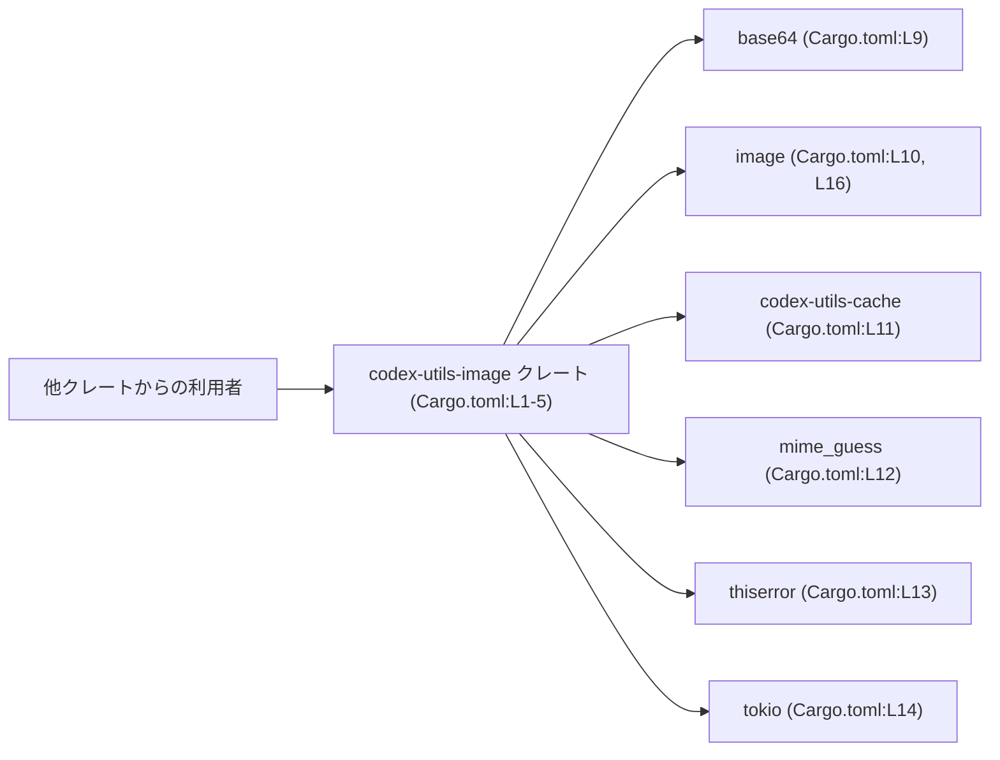
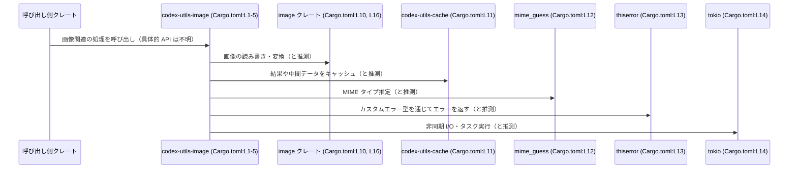

# utils/image/Cargo.toml

## 0. ざっくり一言

`codex-utils-image` クレートの Cargo マニフェストであり、画像処理・キャッシュ・MIME 判定・非同期実行などに関連する依存クレートを定義しているファイルです（Cargo.toml:L1-16）。

---

## 1. このモジュールの役割

### 1.1 概要

- このファイルは、Rust クレート `codex-utils-image` の **パッケージ情報と依存関係** を定義します（Cargo.toml:L1-5, L8-16）。
- 画像フォーマット対応（JPEG/PNG/GIF/WebP）や、非同期ランタイム（Tokio）、エラー型（thiserror）、キャッシュ機構など、このクレートが利用する外部コンポーネントを指定しています（Cargo.toml:L9-L14）。
- 実際の公開 API やコアロジックは Rust ソースファイル側にあり、このチャンクには現れていません。

### 1.2 アーキテクチャ内での位置づけ

この Cargo.toml から読み取れるのは、`codex-utils-image` クレートがどの外部クレートに依存するかという **静的な依存関係** です。



- 矢印は「どのクレートからどのクレートを利用すると想定されるか」を示しています。
- 実際にどの関数・型が呼ばれているかは、このチャンクには現れず、Rust ソースコード側を見ないと分かりません。

### 1.3 設計上のポイント

コード（＝Cargo.toml）から読み取れる設計上の特徴は次のとおりです。

- **ワークスペースを前提とした構成**
  - `version.workspace = true`, `edition.workspace = true`, `license.workspace = true` により、バージョン・edition・ライセンスをワークスペース全体で統一する設計です（Cargo.toml:L3-L5）。
  - lints 設定も `workspace = true` で共有されています（Cargo.toml:L6-L7）。
- **画像処理機能のための依存**
  - `image` クレートに対し、`jpeg`, `png`, `gif`, `webp` の feature を有効化しています（Cargo.toml:L10, L16）。
- **キャッシュ・MIME 判定・エラー処理の利用**
  - `codex-utils-cache`・`mime_guess`・`thiserror` に依存しており（Cargo.toml:L11-L13）、画像処理の周辺機能（キャッシュ、MIME タイプ推定、カスタムエラー型）を利用する構成になっています。
- **非同期・並行処理の前提**
  - `tokio` の `fs`, `rt`, `rt-multi-thread`, `macros` feature が有効であり、Tokio のマルチスレッドランタイム上で非同期 I/O 等を行うことを前提としたクレート構成です（Cargo.toml:L14）。
  - 実際にどのような async 関数やタスクがあるかは、このチャンクには現れません。

---

## 2. 主要な機能一覧（コンポーネントインベントリー的な観点）

このファイル自体は実行ロジックや関数を含みませんが、「このクレートが何を使えるようにしているか」という意味での主要機能を列挙します。

- パッケージ定義: クレート名 `codex-utils-image` とワークスペース共通設定の定義（Cargo.toml:L1-L5）。
- Lint 設定の共有: ワークスペース共通の lints 設定を適用（Cargo.toml:L6-L7）。
- 画像処理: `image` クレートを JPEG/PNG/GIF/WebP 対応で利用可能にする（Cargo.toml:L10, L16）。
- Base64 エンコード/デコード: `base64` クレートを利用可能にする（Cargo.toml:L9）。
- キャッシュ機構: 別クレート `codex-utils-cache` を利用可能にする（Cargo.toml:L11）。
- MIME タイプ推定: `mime_guess` クレートを利用可能にする（Cargo.toml:L12）。
- エラー定義: `thiserror` によるエラー型定義を利用可能にする（Cargo.toml:L13）。
- 非同期・並行処理: Tokio ランタイムと非同期ファイル I/O、マクロ（`#[tokio::main]` 等）を利用可能にする（Cargo.toml:L14）。

---

## 3. 公開 API と詳細解説

このチャンクは Cargo.toml のみであり、**公開 API（関数・構造体・列挙体などの Rust コード）は一切現れていません**。

### 3.1 型一覧（構造体・列挙体など）

このファイル自体は Rust コードを含まないため、**型定義は不明**です。  
ただし、クレートレベルおよび依存クレートを「コンポーネント」として一覧にまとめます。

| コンポーネント名 | 種別 | 役割 / 用途 | 根拠 |
|------------------|------|-------------|------|
| `codex-utils-image` | クレート | 画像ユーティリティを提供するクレート（詳細な API はこのチャンクには現れない） | Cargo.toml:L1-L5 |
| `base64` | 依存クレート | Base64 エンコード・デコード処理に利用される一般的なクレート | Cargo.toml:L9 |
| `image` | 依存クレート / dev-dependency | 画像デコード・エンコードを行うクレート。`jpeg`, `png`, `gif`, `webp` feature が有効（実際の使用箇所は不明） | Cargo.toml:L10, L16 |
| `codex-utils-cache` | 依存クレート | キャッシュ関連のユーティリティを提供すると推測される同一プロジェクト内クレート（詳細はこのチャンクには現れない） | Cargo.toml:L11 |
| `mime_guess` | 依存クレート | 拡張子などから MIME タイプを推定するクレートとして広く使われる | Cargo.toml:L12 |
| `thiserror` | 依存クレート | カスタムエラー型の実装を容易にする派生（derive）マクロ等を提供するクレート | Cargo.toml:L13 |
| `tokio` | 依存クレート | 非同期ランタイム。`fs`, `rt`, `rt-multi-thread`, `macros` feature が有効で、マルチスレッド非同期 I/O が可能な構成 | Cargo.toml:L14 |

> 備考: これら依存クレートの実際の利用方法（どの型・関数を使っているか）は、このチャンクには現れません。

### 3.2 関数詳細

- **このファイルには関数定義が存在しないため、関数詳細の説明は行えません。**
- `codex-utils-image` クレートの公開 API やコアロジックは、通常 `utils/image/src/lib.rs` などの Rust ソースファイルに記述されますが、その内容はこのチャンクには現れていません。

### 3.3 その他の関数

- 同上の理由により、補助関数やラッパー関数についても、このチャンクからは一切分かりません。

---

## 4. データフロー

このチャンクは設定ファイルのみで、実際のデータフロー（画像バイト列がどの関数に渡され、どのように変換されるか）は不明です。  
以下の図は、**依存関係から推測できる非常に高レベルな「呼び出し方向」イメージ**にとどまります。



- 「と推測」と付けた部分は、依存クレートの一般的な用途に基づく推測であり、このチャンクからは確定できません。
- 実際のデータ構造（バイト列、パス、MIME 文字列など）やエラー型の詳細は、このチャンクには現れません。

---

## 5. 使い方（How to Use）

### 5.1 基本的な使用方法

この Cargo.toml は **このクレート自身の設定** です。他のクレートから利用する場合の典型的な流れは次のようになります。

1. 同一ワークスペース内の別クレートの `Cargo.toml` で `codex-utils-image` を依存として追加する。
2. Rust コード側で、`codex_utils_image` クレートを `use` して公開 API を呼び出す。

```toml
# 例: 同じワークスペース内の別クレートの Cargo.toml
[dependencies]
codex-utils-image = { path = "utils/image" } # 実際のパスはプロジェクト構成に依存
```

```rust
// `codex-utils-image` クレートを依存に追加した後の Rust コード例
// クレート名のハイフンはアンダースコアに変換されるため、`codex_utils_image` となります。
use codex_utils_image; // 具体的な公開 API はこのチャンクには現れません

fn main() {
    // 実際には、公開されている関数や型をここで呼び出すことになります。
    // 例: codex_utils_image 内の画像読み込み・変換・キャッシュ機能など（詳細は不明）。
}
```

### 5.2 よくある使用パターン

- **画像フォーマット**  
  - `image` クレートの feature として `jpeg`, `png`, `gif`, `webp` が有効なため（Cargo.toml:L10, L16）、少なくともこれら 4 種類のフォーマットに関連する処理を行う用途が想定されます。
  - その他のフォーマット（BMP など）を扱うかどうかは、このチャンクからは分かりません。

- **非同期 I/O**  
  - `tokio` の `fs` feature と `rt-multi-thread` feature を有効にしているため（Cargo.toml:L14）、画像ファイルの読み書きなどを **非同期かつマルチスレッド** で行うパターンが想定されますが、具体的な実装は不明です。

### 5.3 よくある間違い（このファイルに関して想定されるもの）

このチャンクから推測できる範囲の「誤用例」と注意点です。

```toml
# 間違い例: image クレートの feature を削除してしまう
[dependencies]
image = { workspace = true }  # features を指定していない
```

```toml
# 正しい（現状の構成と一致する）例
[dependencies]
image = { workspace = true, features = ["jpeg", "png", "gif", "webp"] }
```

- 現状のコードが JPEG/PNG/GIF/WebP 用の API を利用している場合、  
  features を削除・変更するとコンパイルエラーになる可能性があります（コード側はこのチャンクには現れませんが、一般的な注意点です）。

### 5.4 使用上の注意点（まとめ）

この Cargo.toml に基づくクレート利用全体の注意点は次のとおりです。

- **Tokio ランタイム前提**  
  - `rt-multi-thread` を含む Tokio features が有効であるため（Cargo.toml:L14）、このクレートの非同期 API（存在すると仮定した場合）は Tokio ランタイム上で動かす必要がある可能性があります。
- **画像フォーマットの範囲**  
  - 有効化されているフォーマットは JPEG/PNG/GIF/WebP に限られているため（Cargo.toml:L10, L16）、それ以外のフォーマットを扱う場合は追加の feature 設定や別クレートが必要になる可能性があります。
- **エラー処理**  
  - `thiserror` に依存しているため（Cargo.toml:L13）、カスタムエラー型を `Result<_, Error>` などで返している可能性が高く、その型定義がライブラリの契約（contract）となっていると考えられますが、このチャンクには現れません。

---

## 6. 変更の仕方（How to Modify）

### 6.1 新しい機能を追加する場合（Cargo.toml の観点）

新しい機能を追加する際に、Cargo.toml に対して行う変更の入口は以下のとおりです。

1. **新しい外部クレートを使う場合**
   - `[dependencies]` セクションに依存クレートを追加します（Cargo.toml:L8 以降）。
2. **画像フォーマットを増やす場合**
   - `image` クレートに対応する feature を追加・変更します（Cargo.toml:L10, L16）。
3. **非同期機能の拡張・制限**
   - `tokio` の feature を追加・削除して、利用可能な機能（例: `time`, `net`）やランタイム形態を調整します（Cargo.toml:L14）。

### 6.2 既存の機能を変更する場合（契約・影響範囲の観点）

Cargo.toml の変更は、クレート全体のコンパイル条件や依存関係に影響します。

- **依存クレートの削除・差し替え**
  - 例: `mime_guess` を削除すると、MIME 判定に関するコードがコンパイルできなくなる可能性があります（Cargo.toml:L12 が根拠）。
- **Tokio 関連 feature の変更**
  - `rt-multi-thread` を外すと、マルチスレッドランタイム向けの API 利用部分に影響する可能性があります（Cargo.toml:L14）。
- **ワークスペース設定の変更**
  - `version.workspace = true` などをやめると、ワークスペース全体のバージョン整合性に影響します（Cargo.toml:L3-L5）。

> いずれの場合も、**変更前にソースコード側でその依存がどのように使われているかを確認する必要がありますが、そのコードはこのチャンクには現れません。**

---

## 7. 関連ファイル

この Cargo.toml は、`codex-utils-image` クレートのビルド設定・依存設定のみを表します。  
関連しうるファイル・ディレクトリについて、このチャンクから分かること／分からないことを整理します。

| パス | 役割 / 関係 |
|------|------------|
| `utils/image/Cargo.toml` | 現在解説しているファイル。`codex-utils-image` クレートのパッケージ情報と依存関係を定義（Cargo.toml:L1-L16）。 |
| `utils/image/src/lib.rs` など | 通常、このクレートの公開 API やコアロジックが記述されると考えられるファイルですが、このチャンクには存在せず、実際の有無・内容は不明です。 |
| `utils/cache` など（推測） | `codex-utils-cache` クレートのソースコードが存在すると推測されますが、このチャンクからは正確なパスは分かりません（Cargo.toml:L11）。 |

---

### このチャンクで分からない点の明示

- 公開 API（関数・構造体・列挙体など）の具体的なシグネチャや挙動
- エラー型の定義内容と、どの関数がどのエラーを返すか
- 実際の非同期処理（どの部分が `async fn` で、どのように Tokio ランタイムを利用しているか）
- キャッシュ戦略（キー設計、TTL、永続化の有無など）

これらはすべて **Rust ソースコード側に依存する情報であり、この Cargo.toml チャンクからは読み取れません**。
