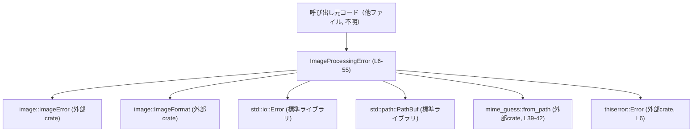
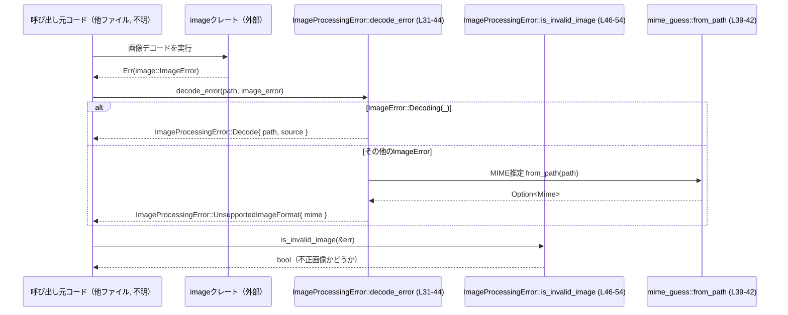

# utils/image/src/error.rs

## 0. ざっくり一言

- 画像処理時のエラーを表現・分類するための共通エラー型と、その補助メソッドを定義するモジュールです（`ImageProcessingError`、error.rs:L6-55）。
- 特にデコード失敗とサポートされない画像形式（推定MIME）を切り分けるロジックを提供します（error.rs:L31-44, L46-54）。

---

## 1. このモジュールの役割

### 1.1 概要

- このモジュールは、画像の読み込み・デコード・エンコード処理で発生するエラーを、一つの列挙型 `ImageProcessingError` に集約するために存在します（error.rs:L6-28）。
- `std::io::Error` や `image::ImageError` など、下位レイヤのエラーをラップし、人間向けのメッセージと原因チェーンを保持します（error.rs:L8-25）。
- デコードエラーを「画像データが不正な場合」と「そもそもサポート外の形式である場合」に分けて扱うための補助関数 `decode_error` と、エラーが不正画像かどうかを調べる `is_invalid_image` を提供します（error.rs:L31-44, L46-54）。

### 1.2 アーキテクチャ内での位置づけ

このモジュールは主に「画像処理ユーティリティのエラー層」に位置づけられます。呼び出し元は画像読み込みや変換を行う別モジュールであり、このファイル内には現れていません。

依存関係のイメージを Mermaid で示します（行番号付き）。



- 呼び出し側は、自身で発生した `std::io::Error` や `image::ImageError` を `ImageProcessingError` に変換して利用する形が想定されますが、このチャンクには呼び出しコードは存在しません（不明）。

### 1.3 設計上のポイント

- 列挙型によるエラー分類  
  - 読み込み（I/O）、デコード、エンコード、未サポート形式という 4 種類のエラーを列挙体のバリアントとして表現しています（error.rs:L8-27）。
- エラーのラップと原因チェーン  
  - `thiserror::Error` 派生により、`source` フィールドを下位エラーとして紐付け、エラー連鎖（cause chain）を保ちます（error.rs:L6, L11-12, L17-18, L23-24）。
- デコードエラーの判定ポリシー  
  - `ImageError::Decoding(_)` の場合だけを「デコードエラー」として `Decode` バリアントに保持し、それ以外の `ImageError` は MIME 推定結果だけを持つ `UnsupportedImageFormat` に正規化します（error.rs:L31-44）。
- 状態は持たない  
  - すべての情報は値として所有し、グローバル状態や可変状態は持っていません（列挙型と純粋関数のみ、error.rs:L6-55）。
- スレッド安全性  
  - `unsafe` ブロックやグローバル可変状態は一切なく、並行性に関する特別な制御は行っていません（error.rs 全体）。`Send`/`Sync` 実装可否はフィールド型（特に `image::ImageError`）に依存し、このチャンク単体からは断定できません。

---

## 2. 主要な機能一覧

- 画像処理エラー型の定義: `ImageProcessingError` で読み込み・デコード・エンコード・未対応形式のエラーを表現します（error.rs:L6-28）。
- デコードエラーの分類: `ImageProcessingError::decode_error` で `image::ImageError` をデコードエラーか未対応形式エラーのどちらかに変換します（error.rs:L31-44）。
- 不正画像の判定: `ImageProcessingError::is_invalid_image` で、エラーがデコードエラー（`ImageError::Decoding(_)`）に由来するかどうかを判定します（error.rs:L46-54）。

---

## 3. 公開 API と詳細解説

### 3.1 型一覧（構造体・列挙体など）

まず、このチャンクに現れる型・関数のインベントリーを示します。

#### コンポーネントインベントリー

| 名前 | 種別 | 公開 | 行範囲 | 根拠 |
|------|------|------|--------|------|
| `ImageProcessingError` | enum | `pub` | L6-28 | 列挙体定義（error.rs:L6-28） |
| `ImageProcessingError::Read` | enumバリアント | - | L8-13 | 読み込みエラー（I/O）バリアント（error.rs:L8-13） |
| `ImageProcessingError::Decode` | enumバリアント | - | L14-19 | デコードエラー・バリアント（error.rs:L14-19） |
| `ImageProcessingError::Encode` | enumバリアント | - | L20-25 | エンコードエラー・バリアント（error.rs:L20-25） |
| `ImageProcessingError::UnsupportedImageFormat` | enumバリアント | - | L26-27 | 未対応画像形式バリアント（error.rs:L26-27） |
| `ImageProcessingError::decode_error` | 関数（関連関数） | `pub` | L31-44 | impl 内の関連関数定義（error.rs:L31-44） |
| `ImageProcessingError::is_invalid_image` | 関数（メソッド） | `pub` | L46-54 | impl 内のメソッド定義（error.rs:L46-54） |

#### 型の概要

| 名前 | 種別 | 役割 / 用途 |
|------|------|-------------|
| `ImageProcessingError` | 列挙体 | 画像の読み込み・デコード・エンコード・未対応形式に関するエラーを表現し、元の I/O エラーや `image::ImageError` をラップします（error.rs:L6-28）。 |

各バリアントのフィールド：

- `Read { path: PathBuf, source: std::io::Error }`（error.rs:L8-13）  
  画像ファイル読み込み（ファイル I/O）に失敗した場合のエラー。

- `Decode { path: PathBuf, source: image::ImageError }`（error.rs:L14-19）  
  画像データのデコード中にエラーが発生した場合のエラー。`ImageError::Decoding(_)` を含みます（error.rs:L31-36）。

- `Encode { format: ImageFormat, source: image::ImageError }`（error.rs:L20-25）  
  画像を特定フォーマットへエンコードするときに失敗した場合のエラー。

- `UnsupportedImageFormat { mime: String }`（error.rs:L26-27）  
  MIME タイプ情報に基づき、サポートされない画像形式と判断された場合のエラー。`decode_error` から生成される場合、元の `ImageError` は保持されません（error.rs:L39-43）。

### 3.2 関数詳細

ここでは、重要な公開メソッド 2 つについて詳細に説明します。

---

#### `ImageProcessingError::decode_error(path: &std::path::Path, source: image::ImageError) -> Self`

**概要**

- `image::ImageError` を `ImageProcessingError` に変換する補助関数です（error.rs:L31-44）。
- `source` が `ImageError::Decoding(_)` の場合は `Decode` バリアントを生成し、それ以外の場合はファイルパスから推定した MIME タイプを用いて `UnsupportedImageFormat` バリアントを生成します（error.rs:L32-37, L39-43）。

**引数**

| 引数名 | 型 | 説明 |
|--------|----|------|
| `path` | `&std::path::Path` | デコード対象とした画像ファイルのパス。`Decode` バリアントに格納する `PathBuf` の元にもなり、MIME 推定にも使用します（error.rs:L31, L34, L39）。 |
| `source` | `image::ImageError` | 下位ライブラリから返された画像エラー。`ImageError::Decoding(_)` かどうかで処理が分岐します（error.rs:L31-32）。 |

**戻り値**

- `ImageProcessingError`  
  - `source` が `ImageError::Decoding(_)` の場合: `ImageProcessingError::Decode { path: path.to_path_buf(), source }`（error.rs:L32-36）。  
  - それ以外の場合: `ImageProcessingError::UnsupportedImageFormat { mime }`（error.rs:L39-43）。

**内部処理の流れ（アルゴリズム）**

1. `matches!(source, ImageError::Decoding(_))` で `source` がデコードエラーかどうかを判定します（error.rs:L32）。
2. デコードエラーであれば、`Decode` バリアントを作成して早期 `return` します。この際、`path` は `PathBuf` にコピーされます（`path.to_path_buf()`、error.rs:L33-35）。
3. デコードエラーでなかった場合、`mime_guess::from_path(path)` によりファイルパスから MIME 候補を取得します（error.rs:L39）。
4. `.first()` で最初の候補を取り出し（`Option`）、`map` で `essence_str().to_owned()` に変換して `String` を得ます（error.rs:L40-41）。
5. MIME 候補が一つも得られない場合は `"unknown".to_string()` を用いるため、常に `String` が得られます（error.rs:L42）。
6. 最後に `ImageProcessingError::UnsupportedImageFormat { mime }` を返します（error.rs:L43）。

**Examples（使用例）**

下記は、画像を読み込んでデコードするときに `image::ImageError` を `ImageProcessingError` に変換する例です。

```rust
use std::path::Path;                                      // Path 型を使うため
use image::io::Reader as ImageReader;                     // 画像読み込み用のリーダ（image crate側の型）
use utils::image::error::ImageProcessingError;            // このモジュールのエラー型（パスは仮の例）

fn load_image(path: &Path) -> Result<image::DynamicImage, ImageProcessingError> {
    // 画像を開いてデコードする
    let reader = ImageReader::open(path).map_err(|e| ImageProcessingError::Read {
        path: path.to_path_buf(),                         // 読み込みに失敗したパス
        source: e,                                        // std::io::Error
    })?;                                                  // ? で Result を伝播

    // デコード中に発生した image::ImageError を ImageProcessingError に変換する
    let image = reader.decode().map_err(|e| {
        ImageProcessingError::decode_error(path, e)       // error.rs:L31-44 のロジックを利用
    })?;

    Ok(image)                                            // 成功時は画像を返す
}
```

※ `utils::image::error` というモジュールパスは例であり、リポジトリ内で実際にどのように公開されているかはこのチャンクからは分かりません。

**Errors / Panics**

- この関数自身は `Result` ではなく `Self` を直接返すため、エラーとしては常に `ImageProcessingError` のどれかのバリアントを返すだけです（error.rs:L31-44）。
- `Option::unwrap_or_else` を使用しており、`unwrap`/`expect` は使っていないため、この関数内でパニックが発生するコードはありません（error.rs:L42）。
- `mime_guess::from_path` など外部ライブラリ内部でのパニックの可能性は、このチャンクからは判断できません。

**Edge cases（エッジケース）**

- 拡張子などから MIME が推定できないパス  
  - `mime_guess::from_path(path).first()` が `None` を返すと `"unknown"` という文字列が MIME として使われます（error.rs:L39-42）。  
    → ユーザーに表示されるエラーメッセージは「unsupported image `unknown`」になります。
- `ImageError::Decoding(_)` 以外の `ImageError`  
  - たとえば `ImageError::Unsupported(_)` や `ImageError::IoError(_)`（存在すると仮定した場合）に相当するものは、すべて `UnsupportedImageFormat` に正規化されます（error.rs:L32-37, L39-43）。  
  - この際、元の `ImageError` は `UnsupportedImageFormat` バリアントには保持されません。
- パスが実際のファイルパスでない場合  
  - `Path` の値が実在しないパスであっても、`mime_guess::from_path` は文字列ベースで MIME 推定を試みるため、「存在しないファイルだが拡張子に基づいて MIME 判定されたエラー」が生成される可能性があります（error.rs:L39-43）。

**使用上の注意点**

- `UnsupportedImageFormat` に変換された場合、元の `ImageError` の詳細情報は失われます。詳細な原因（メモリ制限・サイズ制限など）を保持したい場合は、別のバリアントを追加するか、この関数を変更する必要があります（error.rs:L26-27, L39-43）。
- `UnsupportedImageFormat` バリアントには `path` が含まれないため、エラーから直接パスを取得することはできません（error.rs:L26-27）。ログにパスを残したい場合は、呼び出し側でパスも別途ログに記録する設計が望ましいです。
- この関数は `ImageError::Decoding(_)` の検出に `matches!` マクロを使っており、`image` crate 側のバリアント構造が将来変更された場合の影響を受ける可能性があります（error.rs:L32）。

---

#### `ImageProcessingError::is_invalid_image(&self) -> bool`

**概要**

- このメソッドは、`self` が「画像データが不正なことに起因するデコードエラー」かどうかを判定します（error.rs:L46-54）。
- 具体的には、`ImageProcessingError::Decode { source: ImageError::Decoding(_), .. }` である場合に `true` を返します（error.rs:L47-53）。

**引数**

| 引数名 | 型 | 説明 |
|--------|----|------|
| `&self` | `&ImageProcessingError` | 判定対象となるエラー値の参照。所有権は移動しません（error.rs:L46）。 |

**戻り値**

- `bool`  
  - `true`: `Decode` バリアントかつ、その `source` が `ImageError::Decoding(_)` である場合（error.rs:L47-53）。  
  - `false`: 上記以外のバリアント、または `Decode` でも `ImageError::Decoding(_)` 以外のケース。

**内部処理の流れ**

1. `matches!` マクロで `self` をパターンマッチします（error.rs:L47）。
2. パターン `ImageProcessingError::Decode { source: ImageError::Decoding(_), .. }` にマッチするかどうかを評価します（error.rs:L48-52）。
3. マッチすれば `true`、しなければ `false` を返します（error.rs:L47-53）。

**Examples（使用例）**

エラー発生後に、「画像ファイルが不正だったのか、それとも別要因なのか」を条件分岐したい場合の例です。

```rust
fn handle_error(err: ImageProcessingError) {
    if err.is_invalid_image() {                          // error.rs:L46-54 で判定
        // 画像データが壊れている等、無効な画像ファイルと判断
        eprintln!("不正な画像ファイルです: {}", err);   // Display 実装は thiserror 由来（error.rs:L6-27）
    } else {
        // それ以外のエラー（I/O, エンコード, 未対応形式等）
        eprintln!("画像処理エラー: {}", err);
    }
}
```

**Errors / Panics**

- このメソッドは純粋なパターンマッチしか行っておらず、副作用やパニック要因はありません（error.rs:L46-54）。

**Edge cases（エッジケース）**

- `UnsupportedImageFormat` の場合は常に `false` です（パターンに含まれないため、error.rs:L47-53）。
- `Decode` バリアントでも、`source` が `ImageError::Decoding(_)` 以外である場合は `false` になります（パターンが `ImageError::Decoding(_)` に限定されているため、error.rs:L48-51）。  
  ※ 現状の `decode_error` 実装では、`Decode` は常に `ImageError::Decoding(_)` から生成されるので、通常の使い方では `Decode` なら `true` とみなせる設計になっています（error.rs:L31-37）。

**使用上の注意点**

- このメソッドは「不正な画像」を `Decode + ImageError::Decoding(_)` と定義しているため、「未対応形式（`UnsupportedImageFormat`）」や I/O エラーは `false` となります。エラーの種類に応じたハンドリングを設計する際は、この区別を明確に理解しておく必要があります（error.rs:L8-27, L47-53）。
- `ImageProcessingError` の新しいバリアントを追加する場合、必要に応じてこのメソッドの判定ロジックを更新する必要があります。

---

### 3.3 その他の関数

- このファイルには、上記 2 つ以外の公開関数・メソッドや補助的な非公開関数は定義されていません（error.rs:L30-55）。

---

## 4. データフロー

ここでは、「画像の読み込み → デコード → エラー変換 → エラー種別判定」という典型的なシナリオにおけるデータフローを示します。

### 4.1 処理の流れ（文章）

1. 呼び出し元が画像ファイルのパスを決定し、`image` crate を用いてファイルを開き・デコードしようとします（呼び出し側コード、別ファイル）。
2. デコード中に `image::ImageError` が発生します。
3. 呼び出し元はこの `ImageError` を `ImageProcessingError::decode_error(path, error)` に渡し、`Decode` または `UnsupportedImageFormat` に変換します（error.rs:L31-44）。
4. 必要に応じて `is_invalid_image` を呼び出し、画像データの不正とその他のエラーを区別します（error.rs:L46-54）。

### 4.2 シーケンス図（Mermaid）



- `decode_error` が `MimeGuess` に依存するのは「デコードエラーではない ImageError を未対応形式エラーにマッピングするための補助情報」が必要だからです（error.rs:L39-43）。
- `is_invalid_image` は変換後の `ImageProcessingError` を判定するだけで、外部依存はありません（error.rs:L46-54）。

---

## 5. 使い方（How to Use）

### 5.1 基本的な使用方法

典型的には、「I/O エラー」「デコードエラー」「未対応形式」「エンコードエラー」を一つの `Result<T, ImageProcessingError>` にまとめる形で利用できます。

```rust
use std::path::Path;
use image::{DynamicImage, ImageError};                    // image crate の型
use image::io::Reader as ImageReader;
use utils::image::error::ImageProcessingError;            // このファイルの型（モジュールパスは例）

fn load_and_process(path: &Path) -> Result<DynamicImage, ImageProcessingError> {
    // 読み込み時の I/O エラーを Read バリアントにマッピング
    let reader = ImageReader::open(path).map_err(|e| ImageProcessingError::Read {
        path: path.to_path_buf(),                         // error.rs:L10
        source: e,                                        // std::io::Error
    })?;

    // デコード時のエラーを decode_error で分類
    let image = reader.decode().map_err(|e: ImageError| {
        ImageProcessingError::decode_error(path, e)       // error.rs:L31-44
    })?;

    Ok(image)
}
```

このコードでは、呼び出し側は単に `Result<_, ImageProcessingError>` を扱えばよく、I/O・デコード・未対応形式の違いは `ImageProcessingError` にカプセル化されます。

### 5.2 よくある使用パターン

1. **エラー種別ごとのハンドリング**

```rust
fn handle(err: ImageProcessingError) {
    if err.is_invalid_image() {                           // error.rs:L46-54
        // 不正な画像データの場合のハンドリング
    } else {
        match err {
            ImageProcessingError::UnsupportedImageFormat { mime } => {
                eprintln!("未対応の画像形式: {}", mime); // error.rs:L26-27
            }
            ImageProcessingError::Read { .. } => {
                eprintln!("画像ファイルの読み込みに失敗しました");
            }
            ImageProcessingError::Encode { format, .. } => {
                eprintln!("画像のエンコードに失敗しました: {:?}", format);
            }
            _ => {
                eprintln!("その他の画像処理エラー: {}", err);
            }
        }
    }
}
```

1. **未対応形式だけを特別扱いする**

```rust
fn is_unsupported_format(err: &ImageProcessingError) -> bool {
    matches!(err, ImageProcessingError::UnsupportedImageFormat { .. }) // error.rs:L26-27
}
```

### 5.3 よくある間違い

```rust
// 間違い例: ImageError を直接判定し、ImageProcessingError の分類ロジックをバイパスしている
fn wrong_handle(e: image::ImageError) {
    // ImageError のバリアント構造に依存して判定してしまう
    // → ImageProcessingError::decode_error (L31-44) のポリシーとズレる可能性がある
}

// 正しい例: まず ImageProcessingError に変換し、その上で種別判定する
fn correct_handle(path: &std::path::Path, e: image::ImageError) {
    let err = ImageProcessingError::decode_error(path, e); // error.rs:L31-44
    if err.is_invalid_image() {                            // error.rs:L46-54
        // 不正な画像
    } else {
        // 未対応形式など
    }
}
```

**誤りのポイント**

- `ImageProcessingError` を経由せずに `image::ImageError` を直接扱うと、このモジュールが意図するエラー分類ポリシー（デコード vs 未対応形式）が統一されず、コードベース全体でエラーの解釈がばらつく可能性があります（error.rs:L31-44, L46-54）。

### 5.4 使用上の注意点（まとめ）

- **エラー情報の欠落**  
  - `UnsupportedImageFormat` バリアントには元の `ImageError` が含まれず、パスも持たないため、深い原因解析が必要な場面では別途ログやメトリクスを用意する必要があります（error.rs:L26-27, L39-43）。
- **判定ポリシーの依存**  
  - `is_invalid_image` の挙動は `decode_error` の実装に依存しており、片方を変更するともう片方の意味も変わります（error.rs:L31-44, L46-54）。変更時はセットで確認する必要があります。
- **セキュリティ/プライバシー**  
  - エラーメッセージにはファイルパス（`{path}`）や推定 MIME（`{mime}`）が含まれます（error.rs:L8, L14, L20, L26）。ログ出力先が外部に公開される場合、パスに含まれる機密情報が漏洩しないよう配慮が必要です。
- **並行性**  
  - このモジュールは純粋なデータ型とメソッドのみから成り、共有可変状態や `unsafe` を用いていません（error.rs 全体）。複数スレッドで同じエラー値を参照する場合は通常の Rust の所有権・借用ルールに従います。

---

## 6. 変更の仕方（How to Modify）

### 6.1 新しい機能を追加する場合

例: 新しいエラー種別（たとえば「サイズ制限超過」）を追加する場合を考えます。

1. **バリアントの追加**  
   - `ImageProcessingError` に新しいバリアントを追加します（error.rs:L6-28 に追記）。  
     例: `SizeLimitExceeded { limit: u64 }` など。
2. **関連メソッドの拡張**  
   - その新バリアントを生成する関連関数を `impl ImageProcessingError` に追加します（error.rs:L30-55 内に関数を追加）。
3. **既存メソッドとの整合性確認**  
   - 新バリアントが「不正な画像」に該当するのであれば `is_invalid_image` のパターンを拡張します（error.rs:L47-53）。
4. **呼び出し側の更新**  
   - 新しいバリアントを利用するよう、呼び出し側コードの `map_err` や `match` を更新します（呼び出し側ファイルはこのチャンクには存在しないため、別途検索が必要です）。
5. **テストの追加**  
   - このチャンクにはテストコードは含まれていませんが、新バリアント用の単体テストを追加することが推奨されます（ファイル位置は不明）。

### 6.2 既存の機能を変更する場合

特に `decode_error` と `is_invalid_image` の変更時の注意点です。

- **影響範囲の確認方法**
  - `ImageProcessingError::decode_error` と `is_invalid_image` がどこから呼ばれているかを、IDE や `rg` などで参照検索する必要があります（呼び出しはこのチャンクには現れません）。
- **契約（前提条件・返り値の意味）**
  - `decode_error` は「`ImageError::Decoding(_)` は `Decode` へ、それ以外は `UnsupportedImageFormat` へ」という契約を暗黙に持っています（error.rs:L32-37, L39-43）。これを変えると、呼び出し側のエラー解釈が変わります。
  - `is_invalid_image` は「`Decode` + `ImageError::Decoding(_)` を不正画像とみなす」という契約を持ちます（error.rs:L47-53）。
- **テスト・使用箇所の再確認**
  - エラー種別ごとに異なるハンドリングを行うコード（`match` 文や `if is_invalid_image()`）が壊れていないかを確認する必要があります。  
  - このチャンク内にはテストがないため、別の場所にあるテスト（存在する場合）や統合テストを確認する必要があります（場所は不明）。
- **パフォーマンス上の注意**
  - `decode_error` 内の `mime_guess::from_path` は文字列解析により MIME 推定を行うため、画像デコードエラーが大量に発生するようなパスでは多少のオーバーヘッドになります（error.rs:L39-42）。ただし、通常は I/O やデコード処理のコストに比べれば小さいと考えられます。

---

## 7. 関連ファイル

このチャンクには他ファイルへの参照（モジュール宣言や use など）はほとんどなく、主に外部クレートへの依存が示されています。

| パス / クレート | 役割 / 関係 |
|-----------------|------------|
| `image` crate（`image::ImageError`, `image::ImageFormat`） | 画像の読み込み・デコード・エンコード時に発生するエラーやフォーマット型を提供し、本モジュールでラップされます（error.rs:L1-2, L18, L24）。 |
| `std::io::Error` | ファイル読み込み時の I/O エラーを表し、`Read` バリアントにラップされます（error.rs:L12）。 |
| `std::path::PathBuf` / `std::path::Path` | エラー発生元のファイルパスを保持・受け渡しするために使われます（error.rs:L3, L10, L16, L31, L34）。 |
| `mime_guess` crate | ファイルパスから MIME タイプを推定し、`UnsupportedImageFormat` バリアントの `mime` フィールドに利用します（error.rs:L39-42）。 |
| `thiserror` crate | `#[derive(Debug, Error)]` により、人間向けのエラーメッセージと `source` チェーンを自動生成します（error.rs:L4, L6-27）。 |

リポジトリ内で `ImageProcessingError` を実際にどのファイルが利用しているかは、このチャンクからは分かりません。そのため、呼び出し元モジュールとの具体的な関係は「不明」となります。
