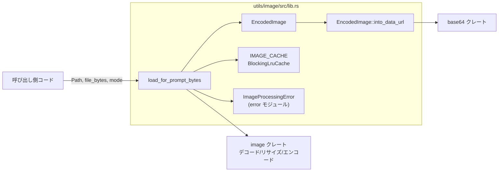
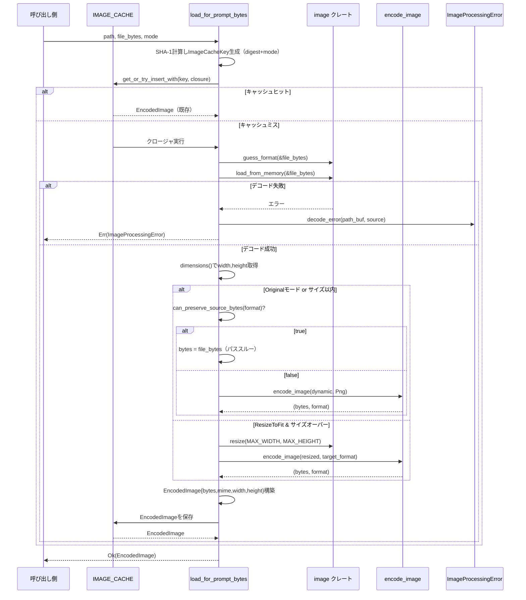

# utils/image/src/lib.rs コード解説

## 0. ざっくり一言

プロンプト入力向けに画像バイト列を受け取り、**フォーマット判定 → デコード → 必要ならリサイズ＆再エンコード → キャッシュ → data URL 変換**までを行うユーティリティです（`lib.rs:L18-40, L57-120`）。

---

## 1. このモジュールの役割

### 1.1 概要

- このモジュールは、**画像ファイル（バイト列）を安全に読み込み、プロンプトに渡しやすい形式に整形する**ために存在します。
- 具体的には、**最大サイズ制限内かどうかでリサイズの要否を判断し、PNG/JPEG/WebP のいずれかにエンコードした `EncodedImage` を返します**（`lib.rs:L18-21, L57-120, L131-187`）。
- 同じ内容の画像については、**SHA-1 ダイジェスト＋モードをキーに LRU キャッシュで再利用**します（`lib.rs:L48-55, L64-67, L69-70`）。

### 1.2 アーキテクチャ内での位置づけ

このモジュールは「画像前処理」の単位として、呼び出し側コードと外部クレート（`image`, `base64`, `codex_utils_cache`）の間に位置します。



- 呼び出し側は `load_for_prompt_bytes` に **ファイルパス・バイト列・処理モード** を渡します（`lib.rs:L57-61`）。
- 画像デコード・リサイズ・エンコードは `image` クレートに委譲しています（`lib.rs:L9-17, L70-79, L104-105, L145-152, L160-163, L169-177`）。
- エラーは `error` モジュールで定義された `ImageProcessingError` に集約されます（`lib.rs:L23-25, L78-79, L154-157, L163-166, L178-181`）。

### 1.3 設計上のポイント

- **サイズ制限の明示的な定数化**  
  - 最大幅・高さを `MAX_WIDTH` / `MAX_HEIGHT` として定数定義（`lib.rs:L18-21`）。
- **モード駆動の挙動切り替え**  
  - `PromptImageMode` により「リサイズして上限に収める」か「元画像サイズのまま扱うか」を切り替え（`lib.rs:L42-46`）。
- **バイト列＋モードをキーにした LRU キャッシュ**  
  - `ImageCacheKey{ digest, mode }` を `BlockingLruCache` のキーに使用（`lib.rs:L48-52, L64-67`）。
  - キャッシュは `LazyLock` な `static IMAGE_CACHE` として共有（`lib.rs:L54-55`）。
- **対応フォーマットの限定と再エンコードポリシー**  
  - 元バイト列をそのまま保持するのは PNG/JPEG/WebP のみ（`can_preserve_source_bytes` 内の `matches!`、`lib.rs:L122-128`）。
  - それ以外（例: GIF）は PNG として再エンコード（`lib.rs:L94-101, L104-108, L135-139`）。
  - コメントで「非アニメ GIF のみサポート」と明示（`lib.rs:L123-124`）。
- **エラーハンドリングの一元化**  
  - デコード失敗時は `ImageProcessingError::decode_error` 経由（`lib.rs:L78-79`）。
  - エンコード失敗時は `ImageProcessingError::Encode { format, source }` に変換（`lib.rs:L154-157, L163-166, L178-181`）。
- **スレッドセーフな初期化**  
  - キャッシュは `std::sync::LazyLock` によって遅延初期化され、初期化競合が防がれます（`lib.rs:L3, L54-55`）。
- このファイル内には `unsafe` ブロックは存在せず、すべて安全な Rust で記述されています（`lib.rs` 全体を確認）。

---

## 2. 主要な機能一覧

- `load_for_prompt_bytes`: 画像バイト列を読み込み、フォーマット判定・デコード・必要に応じたリサイズと再エンコードを行い、`EncodedImage` として返す（`lib.rs:L57-120`）。
- `EncodedImage::into_data_url`: `EncodedImage` を `data:<mime>;base64,....` 形式の data URL 文字列に変換する（`lib.rs:L35-39`）。
- 画像フォーマット判定とパススルー可否判定: `image::guess_format` と `can_preserve_source_bytes` により再エンコードの要否を決める（`lib.rs:L70-76, L122-128`）。
- 画像の再エンコード: `encode_image` が PNG/JPEG/WebP へのエンコードを行い、`format_to_mime` が MIME タイプを決定する（`lib.rs:L131-187, L189-195`）。
- 画像処理結果のキャッシュ: `IMAGE_CACHE.get_or_try_insert_with` により、同じバイト列＋モードの処理結果を再利用する設計になっています（`lib.rs:L54-55, L64-67, L69-70`）。

---

## 3. 公開 API と詳細解説

### 3.1 定数・型一覧

#### 3.1.1 定数

| 名前 | 型 | 公開 | 役割 / 用途 | 定義位置 |
|------|----|------|-------------|----------|
| `MAX_WIDTH`  | `u32` | `pub` | リサイズ時に許容される最大幅（ピクセル） | `lib.rs:L18-19` |
| `MAX_HEIGHT` | `u32` | `pub` | リサイズ時に許容される最大高さ（ピクセル） | `lib.rs:L20-21` |

#### 3.1.2 構造体・列挙体・静的値

| 名前 | 種別 | 公開 | 役割 / 用途 | 定義位置 |
|------|------|------|-------------|----------|
| `EncodedImage` | 構造体 | `pub` | エンコード済み画像（バイト列・MIME・幅・高さ）を保持するコンテナ | `lib.rs:L27-33` |
| `PromptImageMode` | 列挙体 | `pub` | 画像をリサイズするか、そのまま使うかを指定するモード | `lib.rs:L42-46` |
| `ImageCacheKey` | 構造体 | `pub(crate)`（デフォルト非公開） | `digest` と `mode` を組み合わせたキャッシュキー | `lib.rs:L48-52` |
| `IMAGE_CACHE` | `static` 値 | モジュール内から利用 | `BlockingLruCache<ImageCacheKey, EncodedImage>` によるグローバル LRU キャッシュ | `lib.rs:L54-55` |
| `ImageProcessingError` | 型（おそらく列挙体） | `pub`（re-export） | 画像処理時のエラー型。`Encode` などのバリアントを持つ | 宣言は `error.rs`（ここでは `pub use` のみ、`lib.rs:L23-25`） |

> `ImageProcessingError` 自体の定義は `utils/image/src/error.rs` にあると推測されますが、このチャンクには現れません。

### 3.2 関数詳細

#### EncodedImage::into_data_url(self) -> String

**概要**

- `EncodedImage` を、ブラウザや API に直接渡せる **data URL 形式** の文字列に変換します（`lib.rs:L35-39`）。

**引数**

| 引数名 | 型 | 説明 |
|--------|----|------|
| `self` | `EncodedImage` | 変換対象の画像。所有権ごと消費されます。 |

**戻り値**

- `String` — `data:<mime>;base64,<base64-encoded-bytes>` 形式の文字列（`lib.rs:L38-39`）。

**内部処理の流れ**

1. `self.bytes` を `BASE64_STANDARD.encode` で Base64 エンコード（`lib.rs:L37`）。
2. `self.mime` を使って `format!("data:{};base64,{encoded}", self.mime)` で data URL を組み立てる（`lib.rs:L38-39`）。

**Examples（使用例）**

```rust
use std::fs;
use std::path::Path;
use utils_image::{load_for_prompt_bytes, EncodedImage, PromptImageMode}; // モジュールパスは仮

fn main() -> Result<(), utils_image::ImageProcessingError> {
    let path = Path::new("example.png");                            // 読み込むファイルパス
    let bytes = fs::read(path)?;                                    // ファイルをバイト列として読み込む

    let encoded: EncodedImage = load_for_prompt_bytes(
        path,
        bytes,
        PromptImageMode::ResizeToFit,
    )?;                                                              // 画像を処理

    let data_url = encoded.into_data_url();                          // data URL へ変換
    println!("{}", data_url);                                        // 何らかの API に渡したりログ出力などに利用

    Ok(())
}
```

**Errors / Panics**

- このメソッド自体は `Result` ではなく、`panic!` も呼んでいないため、正常に動作する前提です（`lib.rs:L35-39`）。
- 内部で `unwrap` なども使用していません。

**Edge cases（エッジケース）**

- `bytes` が空（0 バイト）の場合でも Base64 エンコードは空文字列になり、`data:<mime>;base64,` という文字列が返ります。
- `mime` が空文字列でも、そのまま `data:;base64,...` になります。`mime` の妥当性チェックは行いません。

**使用上の注意点**

- 画像バイト列をコピーせず参照することはできないため、**大きな画像を多数 data URL に変換する場合はメモリ使用量に注意**が必要です。
- `EncodedImage` の所有権を消費するため、同じ `EncodedImage` を再利用する場合は先にクローンする必要があります（`EncodedImage: Clone`、`lib.rs:L27`）。

---

#### load_for_prompt_bytes(path: &Path, file_bytes: Vec<u8>, mode: PromptImageMode) -> Result<EncodedImage, ImageProcessingError>

**概要**

- 指定された画像バイト列を読み込み、**フォーマット判定 → デコード → リサイズ条件分岐 → 必要なら再エンコード → キャッシュ**して、`EncodedImage` として返します（`lib.rs:L57-120`）。
- 画像が既に処理済み（同じバイト列＋モード）であれば、**LRU キャッシュから結果を再利用**する設計になっています（`lib.rs:L64-70`）。

**引数**

| 引数名 | 型 | 説明 |
|--------|----|------|
| `path` | `&Path` | エラーメッセージ用などに使われるファイルパス情報（`lib.rs:L57-62`）。 |
| `file_bytes` | `Vec<u8>` | 入力画像の生バイト列。所有権ごと関数に渡されます（`lib.rs:L59`）。 |
| `mode` | `PromptImageMode` | リサイズの有無を決定するモード（`lib.rs:L60, L42-46`）。 |

**戻り値**

- `Ok(EncodedImage)` — エンコード済み画像。`bytes`, `mime`, `width`, `height` を含みます（`lib.rs:L27-33, L87-92, L96-101, L110-115`）。
- `Err(ImageProcessingError)` — デコード失敗やエンコード失敗などのエラー（`lib.rs:L78-79, L154-157, L163-166, L178-181`）。

**内部処理の流れ（アルゴリズム）**

1. `path` を `PathBuf` にコピー（`lib.rs:L62`）。これはデコードエラー時の `decode_error` に渡すために使用されます（`lib.rs:L78-79`）。
2. `file_bytes` の SHA-1 ダイジェストを計算し、`PromptImageMode` と組み合わせて `ImageCacheKey` を生成（`lib.rs:L64-67`）。
3. `IMAGE_CACHE.get_or_try_insert_with(key, move || { ... })` を呼び出し、キャッシュヒット時は既存の `EncodedImage` を、ミス時はクロージャを実行して新たな値を生成する設計です（`lib.rs:L69-70`）。
4. クロージャ内でフォーマット推定: `image::guess_format(&file_bytes)` を呼び、PNG/JPEG/GIF/WebP なら `Some`、それ以外や失敗時は `None` を返す形に変換（`lib.rs:L70-76`）。
5. `image::load_from_memory(&file_bytes)` で画像をデコードし、失敗した場合は `ImageProcessingError::decode_error(&path_buf, source)` に変換して返却（`lib.rs:L78-79`）。
6. `dynamic.dimensions()` で元画像の幅・高さを取得（`lib.rs:L81`）。
7. **モードとサイズによる分岐**（`lib.rs:L83-116`）  
   - `mode == PromptImageMode::Original` **または** `(width <= MAX_WIDTH && height <= MAX_HEIGHT)` の場合（`lib.rs:L83-84`）:
     - かつ `format` が `Some` であり `can_preserve_source_bytes` が `true` のとき、**元バイト列をそのまま使用**（`lib.rs:L85-92`）。
     - それ以外（フォーマット不明・非対応フォーマット）は PNG に再エンコードして `EncodedImage` を生成（`lib.rs:L93-101`）。
   - 条件を満たさない（大き過ぎる＆Original でない）場合:
     - `dynamic.resize(MAX_WIDTH, MAX_HEIGHT, FilterType::Triangle)` でリサイズ（`lib.rs:L103-104`）。
     - 元フォーマットが PNG/JPEG/WebP のいずれかならそれを尊重し、それ以外は PNG として `encode_image` を呼び出し（`lib.rs:L105-108`）。
     - リサイズ後の幅・高さを `EncodedImage` に格納（`lib.rs:L110-115`）。
8. 得られた `EncodedImage` を `Ok(encoded)` としてクロージャの戻り値とし、`get_or_try_insert_with` の結果として返します（`lib.rs:L118-119`）。

**Examples（使用例）**

通常のリサイズ付き読み込み例:

```rust
use std::fs;
use std::path::Path;
use utils_image::{load_for_prompt_bytes, PromptImageMode, ImageProcessingError};

fn load_for_prompt(path: &Path) -> Result<(), ImageProcessingError> {
    let bytes = fs::read(path)?;                                        // 画像ファイルを読み込む

    let encoded = load_for_prompt_bytes(
        path,
        bytes,
        PromptImageMode::ResizeToFit,                                   // 上限サイズに収まるようにリサイズ
    )?;

    println!(
        "width={} height={} mime={}",
        encoded.width, encoded.height, encoded.mime
    );

    Ok(())
}
```

オリジナルサイズを維持する例:

```rust
let encoded = load_for_prompt_bytes(
    Path::new("large.png"),
    fs::read("large.png")?,
    PromptImageMode::Original,                                          // リサイズせず出力
)?;
assert_eq!(encoded.mime, "image/png".to_string());
```

**Errors / Panics**

- 戻り値が `Result` であり、内部でデコード/エンコードエラーを `ImageProcessingError` にラップしています。
  - 画像デコード失敗時: `ImageProcessingError::decode_error(path_buf, source)` に変換されます（`lib.rs:L78-79`）。
  - エンコード失敗時: `ImageProcessingError::Encode { format, source }` に変換されます（`lib.rs:L154-157, L163-166, L178-181`）。
- `image::guess_format` の失敗は、`format` が `None` になるだけで、即エラーにはしません（`lib.rs:L70-76`）。
  - その後の `load_from_memory` でエラーになれば上記の `Decode` 系エラーになります。
- この関数内には `unwrap` / `expect` / `panic!` 等はありません（`lib.rs:L57-120`）。

**Edge cases（エッジケース）**

- **無効な画像データ**  
  - `b"not an image"` のようなバイト列では `load_from_memory` が失敗し、`ImageProcessingError::Decode` または `UnsupportedImageFormat` のいずれかとして扱われることがテストから確認できます（`lib.rs:L286-298`）。
- **大きな画像 + ResizeToFit モード**  
  - 幅・高さが `MAX_WIDTH` / `MAX_HEIGHT` を超えると、`ResizeToFit` の場合はリサイズされます（`lib.rs:L83-84, L103-115`）。
  - テストでは、4096x2048 の画像が `processed.width <= MAX_WIDTH` かつ `processed.height <= MAX_HEIGHT` となることを確認しています（`lib.rs:L239-256`）。
- **大きな画像 + Original モード**  
  - `PromptImageMode::Original` の場合はサイズチェックを無視し、元の幅・高さで `EncodedImage` を返します（`lib.rs:L83-84`）。
  - テストで 4096x2048 の画像がそのまま返ることが確認されています（`lib.rs:L268-284`）。
- **非対応フォーマット**  
  - `ImageFormat::Gif` は `can_preserve_source_bytes` に含まれないため、バイト列のままでは返されず、PNG として再エンコードされます（`lib.rs:L70-76, L122-128, L93-101, L104-108`）。
- **同じ内容の画像を繰り返し処理**  
  - 同じ `file_bytes` と `mode` で複数回呼び出すと、`ImageCacheKey` によるキャッシュが機能する設計です（`lib.rs:L64-67, L69-70`）。
- **内容が更新された画像**  
  - 画像内容の更新後は SHA-1 ダイジェストが変わるため、別エントリとして再処理されることをテストで確認しています（`lib.rs:L301-332`）。

**使用上の注意点**

- **入力バイト列は完全に読み込まれている必要**があります。ストリーミングや部分的なデータには対応していません（`Vec<u8>` を受け取るため、`lib.rs:L59`）。
- 非常に大きな画像（巨大な解像度）の場合、`image::load_from_memory` によるデコード時に **メモリ使用量や処理時間が大きくなる可能性**があります。この関数自体は入力サイズ制限を設けていません。
- キャッシュキーは **バイト列とモードのみ** で、パス名は含まれません（`lib.rs:L48-52, L64-67`）。  
  - 同じ画像データが別パスに存在する場合も同一として扱われます。
- この関数はスレッドセーフに利用できる設計です。
  - `IMAGE_CACHE` は `LazyLock` で初期化される `static` であり（`lib.rs:L3, L54-55`）、テストでも `#[tokio::test(flavor = "multi_thread")]` を用いてマルチスレッド環境で動作確認をしています（`lib.rs:L215, L238, L268, L286, L301`）。
  - ただし `BlockingLruCache` の内部実装の詳細はこのチャンクには現れず、ロック方式などは不明です。

**潜在的なバグ / セキュリティ観点**

- **ZIP 爆弾型の画像（極端に大きなデコード後サイズを持つ画像）に対する防御**は、この関数単体では実装されていません。  
  → デコード後にリサイズするため、デコード自体は元の巨大サイズで行われます（`lib.rs:L78-81, L103-104`）。
- `encode_image` 内の `unreachable!` は現行コードの分岐では到達しませんが、新しいフォーマットを追加する変更時には注意が必要です（`lib.rs:L183`）。

---

#### can_preserve_source_bytes(format: ImageFormat) -> bool

**概要**

- 元バイト列をそのまま出力に使ってよいフォーマットかどうかを判定します（`lib.rs:L122-128`）。

**引数**

| 引数名 | 型 | 説明 |
|--------|----|------|
| `format` | `ImageFormat` | `image::guess_format` で推定された入力画像フォーマット。 |

**戻り値**

- `true` — PNG/JPEG/WebP のいずれか。  
- `false` — 上記以外（例: GIF 等）。

**内部処理**

- `matches!(format, ImageFormat::Png | ImageFormat::Jpeg | ImageFormat::WebP)` で判定（`lib.rs:L125-128`）。

**Edge cases / 注意点**

- コメントに「公開 API ドキュメントは非アニメ GIF のみを明示的にサポート」と書かれており（`lib.rs:L123-124`）、GIF については「非アニメのみ」かつバイト列のままではなく PNG に再エンコードする方針と読み取れます。

---

#### encode_image(image: &DynamicImage, preferred_format: ImageFormat) -> Result<(Vec<u8>, ImageFormat), ImageProcessingError>

**概要**

- `DynamicImage` を PNG/JPEG/WebP のいずれかにエンコードし、結果のバイト列と実際に使用した `ImageFormat` を返します（`lib.rs:L131-187`）。

**引数**

| 引数名 | 型 | 説明 |
|--------|----|------|
| `image` | `&DynamicImage` | `image` クレートのデコード済み画像オブジェクト（`lib.rs:L131-133`）。 |
| `preferred_format` | `ImageFormat` | 希望する出力フォーマット。JPEG/WebP の場合は尊重され、それ以外は PNG にフォールバック（`lib.rs:L135-139`）。 |

**戻り値**

- `Ok((bytes, format))` — `bytes` はエンコードされた画像バイト列、`format` は実際に使用した `ImageFormat`（`lib.rs:L186-187`）。
- `Err(ImageProcessingError)` — エンコード失敗時に `ImageProcessingError::Encode { format, source }` が返ります（`lib.rs:L154-157, L163-166, L178-181`）。

**内部処理の流れ**

1. `preferred_format` に応じて `target_format` を決定（`lib.rs:L135-139`）。
   - `Jpeg` → `ImageFormat::Jpeg`
   - `WebP` → `ImageFormat::WebP`
   - それ以外 → `ImageFormat::Png`
2. 出力用の `Vec<u8>` バッファを作成（`lib.rs:L141`）。
3. `match target_format` でフォーマットごとのエンコード処理（`lib.rs:L143-183`）:
   - **PNG**:
     - `image.to_rgba8()` で RGBA8 バッファを取得（`lib.rs:L145`）。
     - `PngEncoder::new(&mut buffer)` でエンコーダを作成し、`write_image` を呼ぶ（`lib.rs:L146-153`）。
   - **JPEG**:
     - `JpegEncoder::new_with_quality(&mut buffer, 85)` で品質 85 のエンコーダを作成（`lib.rs:L160`）。
     - `encode_image(image)` を呼ぶ（`lib.rs:L161-166`）。
   - **WebP**:
     - `image.to_rgba8()` → `WebPEncoder::new_lossless(&mut buffer)` → `write_image`（`lib.rs:L169-177`）。
4. 各フォーマットのエンコード失敗時は `ImageProcessingError::Encode { format: target_format, source }` に変換（`lib.rs:L154-157, L163-166, L178-181`）。
5. 最終的に `(buffer, target_format)` を返す（`lib.rs:L186-187`）。

**Errors / Panics**

- エンコードエラーはすべて `ImageProcessingError::Encode` に変換されます（`lib.rs:L154-157, L163-166, L178-181`）。
- `match` における `_ => unreachable!()` は、`target_format` が PNG/JPEG/WebP 以外の値を持つことを想定していないためのガードです（`lib.rs:L183`）。
  - 現行コードでは `target_format` は 3 種類のいずれかに正規化されているため、ここに到達しない構造になっています（`lib.rs:L135-139, L143-183`）。

**Edge cases / 注意点**

- `preferred_format` に GIF などを渡しても、実際には PNG に変換されます（`lib.rs:L135-139`）。
- ロスレス出力:
  - PNG / WebP はロスレスエンコーダを利用しています（WebP は `new_lossless` を使用、`lib.rs:L170`）。
- JPEG は品質 85 固定であり、画質設定を変える API はこのファイルにはありません（`lib.rs:L160`）。

---

#### format_to_mime(format: ImageFormat) -> String

**概要**

- `ImageFormat` を HTTP や data URL で使用する MIME タイプ文字列に変換します（`lib.rs:L189-195`）。

**引数・戻り値**

| 引数名 | 型 | 説明 |
|--------|----|------|
| `format` | `ImageFormat` | 変換対象のフォーマット。 |

戻り値:

- `String` — 対応関係は次の通り（`lib.rs:L189-195`）。
  - `Jpeg` → `"image/jpeg"`
  - `Gif` → `"image/gif"`
  - `WebP` → `"image/webp"`
  - その他 → `"image/png"`（PNG をデフォルト扱い）

**Edge cases / 注意点**

- `encode_image` から返るフォーマットは PNG/JPEG/WebP のいずれかであり、いずれも上記マッピングに含まれます（`lib.rs:L135-139`）。
- `ImageFormat::Gif` が渡されるのは、主に入力フォーマット判定結果を MIME に反映させるケースです（`lib.rs:L70-76`）。

---

### 3.3 その他の関数（テスト・補助）

| 関数名 | 役割 | 定義位置 | 備考 |
|--------|------|----------|------|
| `image_bytes` | `ImageBuffer` を指定フォーマットにエンコードし、`Vec<u8>` を返すテスト用ユーティリティ | `lib.rs:L207-213` | テスト専用（`mod tests` 内） |
| `returns_original_image_when_within_bounds` | 小さな画像ではバイト列を変更せずに返すことの確認 | `lib.rs:L215-236` | `#[tokio::test]` |
| `downscales_large_image` | 大きな画像が `MAX_WIDTH`/`MAX_HEIGHT` に収まるようリサイズされることの確認 | `lib.rs:L238-266` | |
| `preserves_large_image_in_original_mode` | `Original` モード時に大きな画像でもリサイズされないことの確認 | `lib.rs:L268-284` | |
| `fails_cleanly_for_invalid_images` | 無効なバイト列に対して `ImageProcessingError` が返ることの確認 | `lib.rs:L286-298` | |
| `reprocesses_updated_file_contents` | 内容が変わった画像についてはキャッシュを無効化して再処理されることの確認 | `lib.rs:L301-332` | `IMAGE_CACHE.clear()` を使用 |

---

## 4. データフロー

### 4.1 典型シナリオ：画像バイト列から EncodedImage を得るまで

このセクションでは、`load_for_prompt_bytes` を呼び出した際のデータの流れを示します。



- キャッシュによって、同じ画像データ＋モードの組み合わせでは処理結果が再利用され、処理コスト削減が期待できます（`lib.rs:L64-70`）。
- 画像のディスク I/O はこの関数外（呼び出し側）で行う前提であり、このモジュールは**純粋にバイト列からの処理**に集中しています（`lib.rs:L59`）。

---

## 5. 使い方（How to Use）

### 5.1 基本的な使用方法

ファイルシステムから画像を読み込み、プロンプト用にリサイズして data URL を得る一連の流れの例です。

```rust
use std::fs;
use std::path::Path;
use utils_image::{load_for_prompt_bytes, PromptImageMode, ImageProcessingError};

fn main() -> Result<(), ImageProcessingError> {
    let path = Path::new("input.png");                                   // 入力画像のパス
    let bytes = fs::read(path)?;                                         // ファイルをバイト列として読み込む

    let encoded = load_for_prompt_bytes(
        path,
        bytes,
        PromptImageMode::ResizeToFit,                                    // サイズ上限内に収める
    )?;

    println!(
        "processed: {}x{}, mime={}",
        encoded.width, encoded.height, encoded.mime
    );

    let data_url = encoded.clone().into_data_url();                      // data URL へ変換
    // data_url を外部API（例: OpenAIのvision系API）に渡すなどの用途を想定

    Ok(())
}
```

### 5.2 よくある使用パターン

1. **プロンプト用の標準リサイズ**
   - `PromptImageMode::ResizeToFit` + `MAX_WIDTH`/`MAX_HEIGHT` で制限（`lib.rs:L18-21, L42-45`）。
   - 画像が小さければバイト列をそのまま再利用し、大きければリサイズして返却。

2. **正確なピクセルを要求する用途（オリジナル保持）**
   - 例: フル解像度での解析が必要なケースでは `PromptImageMode::Original` を使用（`lib.rs:L44-45, L83-84`）。
   - この場合もフォーマットが PNG/JPEG/WebP であればバイト列をそのまま返します（`lib.rs:L85-92`）。

3. **同じ画像を何度も使う場合**
   - 同一の `file_bytes` + `mode` で繰り返し `load_for_prompt_bytes` を呼び出すと、LRU キャッシュにより再処理が抑制される設計です（`lib.rs:L64-70`）。
   - テストではキャッシュクリア後に異なる内容の画像を処理することで、内容の変化が認識されることを確認しています（`lib.rs:L301-332`）。

### 5.3 よくある間違い

```rust
// 誤り例: エラーを無視してしまう
let encoded = load_for_prompt_bytes(path, bytes, PromptImageMode::ResizeToFit).unwrap(); // 無効な画像でpanicの可能性

// 正しい例: Resultを明示的に扱う
let encoded = match load_for_prompt_bytes(path, bytes, PromptImageMode::ResizeToFit) {
    Ok(img) => img,
    Err(err) => {
        eprintln!("画像処理エラー: {err:?}");
        return;
    }
};
```

```rust
// 誤り例: 毎回ファイルを読み直し、バイト列も毎回生成してしまう（キャッシュ効果を活かせない）
for _ in 0..100 {
    let bytes = fs::read(path)?;
    let _ = load_for_prompt_bytes(path, bytes, PromptImageMode::ResizeToFit)?;
}

// 望ましい例: 同じbytesを再利用（キャッシュヒットが期待できる）
let bytes = fs::read(path)?;
for _ in 0..100 {
    let _ = load_for_prompt_bytes(path, bytes.clone(), PromptImageMode::ResizeToFit)?;
}
```

### 5.4 使用上の注意点（まとめ）

- **入力の前提**
  - `file_bytes` は完全な画像データ（ヘッダ含む）である必要があります（`lib.rs:L59, L78-79`）。
- **サイズとリサイズ**
  - `ResizeToFit` モードでは `MAX_WIDTH`/`MAX_HEIGHT` を超える画像がリサイズされますが、**デコードは元サイズで行われる**ため、非常に大きな画像に対してはメモリ使用量に注意が必要です（`lib.rs:L18-21, L78-81, L103-104`）。
- **フォーマット対応**
  - PNG/JPEG/WebP はバイト列パススルーの対象（`lib.rs:L122-128`）。
  - GIF やその他フォーマットは PNG に変換されます。アニメ GIF については、このファイルのコメントから「非アニメのみサポート」と読み取れますが、実際の挙動は `error` モジュール側の実装も関わるため、このチャンクだけでは断定できません（`lib.rs:L123-124`）。
- **スレッドセーフティ**
  - グローバルキャッシュは `LazyLock` を用いており、複数スレッドからの同時呼び出しにも対応する設計です（`lib.rs:L3, L54-55`）。
  - テストはすべて `#[tokio::test(flavor = "multi_thread")]` で実行されており、マルチスレッド環境での動作が確認されています（`lib.rs:L215, L238, L268, L286, L301`）。
- **パフォーマンス関連**
  - 画像デコード・リサイズ・エンコードは CPU 負荷が高いため、**大量の画像を同期的に処理する場合は並列度やキャッシュ利用を考慮する必要**があります。
  - JPEG の品質は 85 固定であり、高画質または低品質での出力が必要な場合は `encode_image` の引数や実装の変更が必要になります（`lib.rs:L160`）。

---

## 6. 変更の仕方（How to Modify）

### 6.1 新しい機能を追加する場合

1. **対応フォーマットを増やす**
   - 例: BMP をサポートしたい場合
     - フォーマット判定に追加: `image::guess_format` の `match` に `ImageFormat::Bmp` の分岐を追加（`lib.rs:L70-76`）。
     - 必要なら `can_preserve_source_bytes` にも `ImageFormat::Bmp` を追加し、バイト列パススルーに含めるかどうかを決めます（`lib.rs:L122-128`）。
     - MIME タイプ対応が必要であれば `format_to_mime` に `"image/bmp"` を追加（`lib.rs:L189-195`）。
2. **サイズ上限を変更する**
   - `MAX_WIDTH` / `MAX_HEIGHT` の値を変更（`lib.rs:L18-21`）。
   - 関連テスト（`downscales_large_image` など）は期待値が変わるため合わせて修正する必要があります（`lib.rs:L239-266`）。
3. **JPEG 品質を外部設定にする**
   - 現在は `JpegEncoder::new_with_quality(&mut buffer, 85)` として固定値です（`lib.rs:L160`）。
   - 新しい設定用構造体や関数引数を追加し、`encode_image` に渡す形に拡張するのが自然です。

### 6.2 既存の機能を変更する場合

- **`load_for_prompt_bytes` の仕様変更**
  - 返却値 `EncodedImage` のフィールド意味（幅・高さ・MIME）は、多数のテストに依存しているため、変更すると影響範囲が大きくなります（`lib.rs:L215-266, L268-284`）。
  - サイズ条件 (`MAX_WIDTH` / `MAX_HEIGHT`) やモードの挙動を変える場合は、各テストのアサーションを確認・更新します。
- **エラーハンドリングの変更**
  - `ImageProcessingError` のバリアント追加・変更は `encode_image` や `load_for_prompt_bytes` の `map_err` 部分に直接影響します（`lib.rs:L78-79, L154-157, L163-166, L178-181`）。
  - `fails_cleanly_for_invalid_images` テストの `matches!` パターンを合わせて更新する必要があります（`lib.rs:L286-298`）。
- **キャッシュポリシーの変更**
  - キャッシュ容量の変更は `BlockingLruCache::new(NonZeroUsize::new(32)...` の `32` を変更します（`lib.rs:L54-55`）。
  - キャッシュキーにパス情報も含めたい場合は `ImageCacheKey` にパス関連フィールドを追加し、`load_for_prompt_bytes` で構築するキーを変更します（`lib.rs:L48-52, L64-67`）。
  - 変更後は `reprocesses_updated_file_contents` のようなテストを追加・修正して、意図したキャッシュ挙動を確認することが有用です（`lib.rs:L301-332`）。

---

## 7. 関連ファイル

| パス | 役割 / 関係 |
|------|------------|
| `utils/image/src/error.rs`（推定） | `pub mod error;` および `pub use crate::error::ImageProcessingError;` から分かる、本モジュール専用のエラー型定義を提供するモジュール（`lib.rs:L23-25`）。`decode_error` 関数や `Encode` / `UnsupportedImageFormat` バリアントなどが定義されていると考えられますが、このチャンクには実装は現れません。 |
| `codex_utils_cache` クレート | `BlockingLruCache` および `sha1_digest` を提供する外部クレート。画像処理結果の LRU キャッシュと SHA-1 キー生成に利用されています（`lib.rs:L7-8, L48-55, L64-67, L69-70`）。 |
| `image` クレート | 画像フォーマット判定・デコード・リサイズ・エンコードの主要機能を提供する外部クレート（`lib.rs:L9-17, L70-79, L104-105, L145-152, L160-163, L169-177`）。 |
| `base64` クレート | `EncodedImage::into_data_url` の Base64 エンコードに使用されます（`lib.rs:L5-6, L35-39`）。 |

このファイル単体で、画像前処理の主要なロジックが完結しており、エラー表現のみ `error` モジュールに依存する構造になっています。
