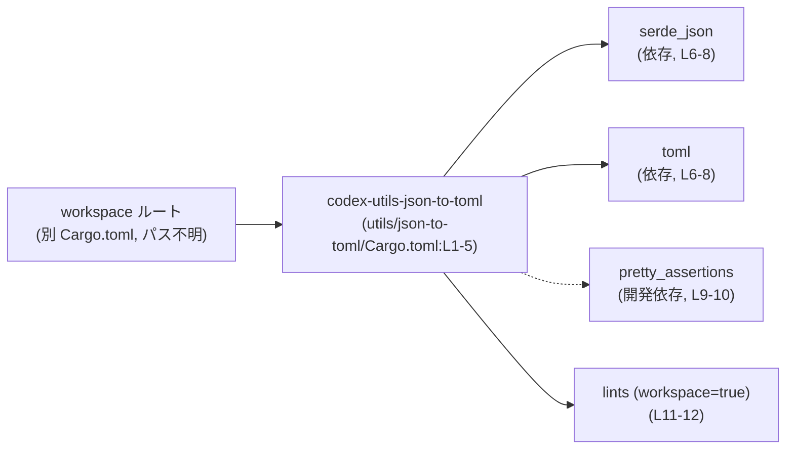
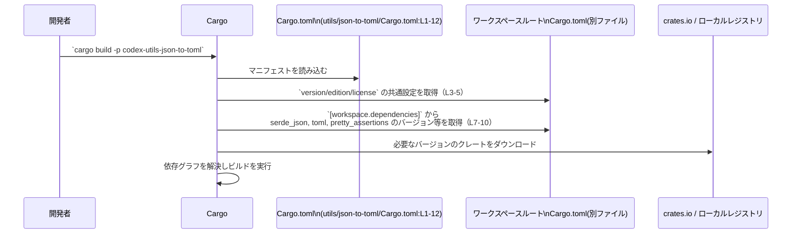

# utils/json-to-toml/Cargo.toml

## 0. ざっくり一言

Rust ワークスペース内のユーティリティクレート `codex-utils-json-to-toml` の Cargo マニフェストであり、クレート名とワークスペース共通のバージョン設定・依存クレート（`serde_json`, `toml` など）・リント設定を宣言するファイルです（utils/json-to-toml/Cargo.toml:L1-12）。

---

## 1. このモジュール（マニフェスト）の役割

### 1.1 概要

- `codex-utils-json-to-toml` クレートの基本メタデータ（名前）を定義し、バージョン・edition・ライセンスはワークスペース共通設定を用いるよう指定しています（L1-5）。
- 依存クレートとして `serde_json` と `toml` を、開発用依存として `pretty_assertions` を、それぞれワークスペース共通バージョンを使う形で宣言しています（L6-10）。
- コンパイラリント（警告設定）もワークスペースから継承するように指定しています（L11-12）。

このファイルには Rust の関数・構造体・モジュール定義は含まれておらず、公開 API やコアロジックの詳細は分かりません。

### 1.2 アーキテクチャ内での位置づけ

- `version.workspace = true` などの指定により、このクレートはワークスペースに所属していることが分かります（L3-5, L7-10, L12）。
- 実装コード（`src` 以下）はこのチャンクには現れず、ここではビルド時に Cargo が読むメタ情報のみが定義されています。
- ランタイムでの関数呼び出し関係は不明ですが、ビルド時の依存関係は次のように整理できます。



※ ルート Cargo.toml の具体的なパスは、このチャンクからは分かりません。

### 1.3 設計上のポイント

- **ワークスペース集中管理**  
  - `version.workspace = true`, `edition.workspace = true`, `license.workspace = true` により、バージョンや edition などをワークスペースで一元管理する設計になっています（L3-5）。
  - 依存クレートも `... = { workspace = true }` としており、バージョンや features をワークスペース側の `[workspace.dependencies]` で統一していると解釈できます（L7-10）。
- **依存の分類**  
  - 実装に必要な依存を `[dependencies]`、テストなど開発時のみ必要な依存を `[dev-dependencies]` に分けています（L6-10）。
- **リントポリシーの共有**  
  - `[lints] workspace = true` により、コンパイル警告や Clippy 設定などをワークスペース全体で共有する方針になっています（L11-12）。
- **言語固有の安全性・エラー・並行性**  
  - このファイルは設定のみであり、所有権・エラー処理・並行性（スレッド安全性など）の具体的な実装は一切含まれません。  
    これらの挙動は、別途存在するソースコードファイル（このチャンクには現れない）に依存します。

---

## 2. 主要な機能・コンポーネント一覧（インベントリー）

### 2.1 コンポーネントインベントリー

このファイルに現れる「コンポーネント」を一覧にします。

| コンポーネント名 | 種別 | 役割 / 用途 | 根拠 |
|------------------|------|------------|------|
| `codex-utils-json-to-toml` | クレート（パッケージ） | JSON と TOML に関するユーティリティであると名前から想定されるクレート。ただし API やロジックはこのファイルからは不明です。 | `name = "codex-utils-json-to-toml"`（L2） |
| `serde_json` | 依存クレート | JSON のシリアライズ / デシリアライズを提供する外部クレート。バージョン等はワークスペース側に定義されます。 | `[dependencies]` セクションと `serde_json = { workspace = true }`（L6-8） |
| `toml` | 依存クレート | TOML のパース / シリアライズを提供する外部クレート。バージョン等はワークスペース側に定義されます。 | `toml = { workspace = true }`（L6-8） |
| `pretty_assertions` | 開発用依存クレート | テスト失敗時の diff 表示を分かりやすくするためのアサーションクレート。テストや開発時にのみ使用されます。 | `[dev-dependencies]` と `pretty_assertions = { workspace = true }`（L9-10） |
| `lints.workspace` | リント設定 | コンパイラや Clippy の警告設定をワークスペース共通設定から継承します。 | `[lints]` と `workspace = true`（L11-12） |

### 2.2 このファイルが直接提供する「機能」

Cargo.toml 自体は実行時機能を提供せず、以下の点のみを担います。

- クレートをワークスペースに登録し、名前と共通設定を紐付ける。
- ビルド時に解決される依存クレートのセットを定義する。
- リント設定の継承方法を指定する。

公開 API やコアロジック（関数・型）は、このチャンクには一切現れません。

---

## 3. 公開 API と詳細解説

このファイルには Rust コードがなく、関数・型・モジュール定義が存在しないため、公開 API の具体的内容は不明です。

### 3.1 型一覧（構造体・列挙体など）

- Rust の構造体や列挙体は **一切定義されていません**。  
  型定義は別ファイル（例: `src/lib.rs` や `src/main.rs` など）にあると考えられますが、それらはこのチャンクには現れません。

### 3.2 関数詳細（該当なし）

- Cargo.toml には関数定義がないため、関数ごとの詳細解説は **該当なし** です。
- 当該クレートの公開関数（例: JSON → TOML 変換関数などがある可能性）は、ソースコード側を確認しないと特定できません。

### 3.3 その他の関数

- 補助関数・ラッパー関数を含め、**関数の存在自体がこのチャンクからは分かりません**。

---

## 4. データフロー（ビルド時のフロー）

実行時データフローは不明ですが、ビルド時に Cargo がこのファイルをどのように扱うかをシーケンス図で示します。



- このフローは、Cargo と workspace 機能の一般的な挙動に基づく説明です。
- 実際のソースコード内で JSON や TOML がどのように扱われるかは、このチャンクには現れません。

---

## 5. 使い方（How to Use）

### 5.1 基本的な使用方法（他クレートからの依存）

他のクレートからこのユーティリティクレートを利用する場合、通常はワークスペースのルート `Cargo.toml` でメンバーとして登録した上で、依存として指定します。

ワークスペースルート側（例、パスはこのチャンクからは不明）:

```toml
[workspace]
members = [
    "utils/json-to-toml", # 本クレートをワークスペースメンバーに含める
    # その他のクレート…
]

[workspace.dependencies]
serde_json = "…"          # 実際のバージョン指定
toml = "…"
pretty_assertions = "…"
```

別クレートからの依存例（ルートからの相対パスは環境に応じて調整が必要です）:

```toml
[dependencies]
codex-utils-json-to-toml = { path = "utils/json-to-toml" }
```

> このクレート内の具体的な関数呼び出し例（JSON → TOML 変換など）は、この Cargo.toml からは分かりません。

### 5.2 よくある使用パターン（ビルド・テスト）

このマニフェストを前提とした一般的なコマンド例です。

```bash
# このクレートだけをビルド
cargo build -p codex-utils-json-to-toml

# このクレートだけのテストを実行
cargo test -p codex-utils-json-to-toml
```

- テストコードが `pretty_assertions` を利用していれば、`cargo test` 時に開発用依存として自動的に解決されます（L9-10）。

### 5.3 よくある間違いと注意点（推測されるポイント）

Cargo と workspace の仕様から、次のような誤りが起こりえます。

```toml
# 誤りの例: workspace.dependencies に定義していないのに
# サブクレート側で workspace = true を使っている
[dependencies]
serde_json = { workspace = true } # ルートに定義がないとエラー
```

```toml
# 正しい構成の例（概念的なもの）
# ルート Cargo.toml
[workspace.dependencies]
serde_json = "1.0"

# サブクレート（本ファイル）
[dependencies]
serde_json = { workspace = true }
```

- `workspace = true` を利用する場合、対応するエントリがワークスペースルートの `[workspace.dependencies]` に存在しないと Cargo がエラーにします。この点に注意が必要です。

### 5.4 使用上の注意点（まとめ）

- **workspace = true の前提**  
  - `version`, `edition`, `license`, 各依存クレートはワークスペース側で定義されている必要があります（L3-5, L7-10, L12）。
- **依存バージョンの一元管理**  
  - 個別クレート側でバージョンを変更したい場合でも、このファイルではなくワークスペースルートの `Cargo.toml` を編集する必要があります。
- **安全性・エラー・並行性**  
  - これらは実装コード側の責務であり、このファイルだけでは確認できません。

---

## 6. 変更の仕方（How to Modify）

### 6.1 新しい機能（依存）を追加する場合

このマニフェストに新しいクレート依存を追加したい場合の一般的な手順です。

1. **ワークスペースルート Cargo.toml を編集**  
   - `[workspace.dependencies]` に新しい依存クレートとバージョンを追加します。  
   （ルートのパスはこのチャンクからは不明ですが、`[workspace]` を持つ Cargo.toml が存在します。）

2. **本ファイルにエントリを追加**

   ```toml
   [dependencies]
   serde_json = { workspace = true }
   toml = { workspace = true }
   new_crate = { workspace = true } # 新規依存の例
   ```

3. **必要に応じて dev-dependencies にも追加**

   ```toml
   [dev-dependencies]
   pretty_assertions = { workspace = true }
   new_test_crate = { workspace = true }
   ```

4. **ビルド・テストで確認**  
   - `cargo build -p codex-utils-json-to-toml`
   - `cargo test -p codex-utils-json-to-toml`

### 6.2 既存の設定を変更する場合

- **バージョンの変更**  
  - `serde_json` や `toml` のバージョンを変えたい場合は、本ファイルではなくワークスペースルートの `[workspace.dependencies]` を変更する必要があります（L7-8）。
- **ワークスペース継承をやめる場合**

  例として、`toml` だけ個別バージョンにしたい場合:

  ```toml
  [dependencies]
  serde_json = { workspace = true }
  toml = "0.8" # workspace = true をやめて個別指定
  ```

  このような変更を行うと、他のクレートとのバージョン差が生じる可能性があるため、ワークスペース全体での整合性を確認する必要があります。

- **リント設定の変更**  
  - `[lints] workspace = true` を解除し、クレート固有のリント設定を行うこともできますが、現在のファイルからはそのような変更は行われていません（L11-12）。
  - 変更時はワークスペース全体の方針との整合性に注意が必要です。

---

## 7. 関連ファイル

このマニフェストと密接に関係すると考えられるファイルを示します。  
※ 実在確認はこのチャンクからはできないものについては、その旨を明記します。

| パス / ファイル | 役割 / 関係 | 備考 |
|-----------------|------------|------|
| （ワークスペースルート）`Cargo.toml` | `[workspace]` と `[workspace.dependencies]`、共通の `version`, `edition`, `license`, `lints` などを定義するマニフェスト。`workspace = true` 設定の参照元です。 | ファイル自体やパスはこのチャンクには現れませんが、`*.workspace = true`（L3-5, L7-10, L12）から存在が前提とされています。 |
| `utils/json-to-toml/` 以下の `src` ディレクトリ | 実際の Rust 実装（ライブラリやバイナリ）を格納する場所であると一般的には想定されます。 | このチャンクにはパスやファイル名は現れないため、具体的な構造や API は不明です。 |

---

### Bugs / Security / Contracts / Edge Cases について

- **Bugs / Security**  
  - Cargo.toml の記述ミス（例えば `workspace = true` に対応する `[workspace.dependencies]` がない場合）によってビルドエラーは起こりえますが、実行時のバグや脆弱性はこのファイルだけからは判断できません。
- **Contracts / Edge Cases**  
  - API 契約（「この関数はこう振る舞う」など）はソースコード側に依存し、このチャンクには契約情報はありません。
- **Tests**  
  - `pretty_assertions` が dev-dependency として指定されていることから、テストコードでの利用が想定されますが、テスト内容・カバレッジは不明です（L9-10）。
- **Performance / Scalability / Concurrency**  
  - 依存クレートの選定から、JSON/TOML 変換処理を行うことが想定されるものの、性能特性や並行実行の扱いは実装コードなしには評価できません。

このファイルはあくまで「クレートのビルド・依存関係設定」を行うものであり、公開 API とコアロジックの詳細は、別途 `src` 以下の Rust コードを確認する必要があります。
