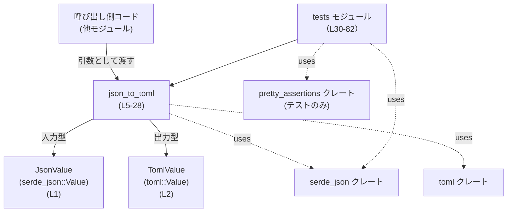
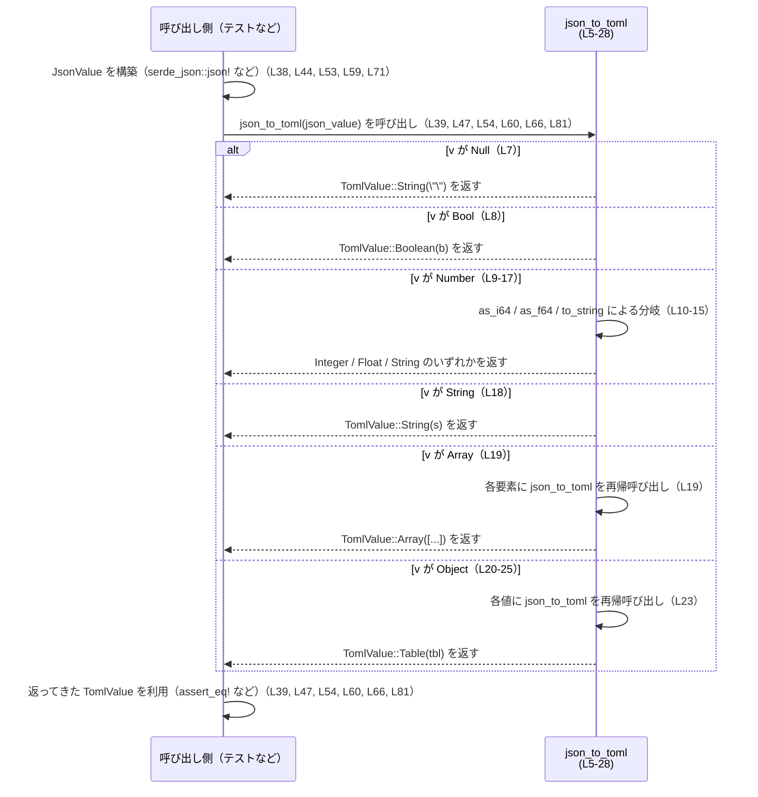

# utils/json-to-toml/src/lib.rs

## 0. ざっくり一言

`serde_json::Value` を、意味的に対応する `toml::Value` に再帰的に変換する単一の公開関数 `json_to_toml` を提供するモジュールです（utils/json-to-toml/src/lib.rs:L1-28）。

---

## 1. このモジュールの役割

### 1.1 概要

- このモジュールは **JSON の値表現**（`serde_json::Value`）を **TOML の値表現**（`toml::Value`）へ変換するために存在し、`json_to_toml` 関数を提供します（L1-5）。
- 配列・オブジェクトを含め、入れ子構造を再帰的に走査して TOML 側の `Array` / `Table` を構築します（L19-25）。
- JSON の `Null` や数値など、TOML に直接対応しない／しにくい型に対しても、文字列等へのフォールバックを行うようになっています（L7, L10-16）。

### 1.2 アーキテクチャ内での位置づけ

- 依存関係（このファイルから見える範囲）:
  - 入力型として `serde_json::Value`（`JsonValue` エイリアス）（L1）。
  - 出力型として `toml::Value`（`TomlValue` エイリアス）（L2）。
  - テストコード内で `serde_json::json!` マクロと `pretty_assertions::assert_eq` を使用（L32-34）。

呼び出し関係と依存ライブラリを簡略化した図です。



このチャンク以外のモジュールからの呼び出しはコードには現れませんが、`pub fn json_to_toml` で公開されているため、クレート外から呼び出されることを前提とした設計になっています（L5）。

### 1.3 設計上のポイント

- **純粋関数・ステートレス**
  - グローバル状態や外部 I/O には一切アクセスせず、引数 `v` の値のみに基づいて出力を決定する純粋関数です（L5-27）。
- **再帰的変換**
  - `JsonValue::Array` に対して `arr.into_iter().map(json_to_toml)` を適用し（L19）、`JsonValue::Object` に対しても値側に `json_to_toml` を再帰的に適用しています（L21-24）。
- **数値の取り扱い**
  - まず `as_i64` で整数として読み取り（L10-11）、ダメなら `as_f64` で浮動小数として読み取る（L12-13）、どちらもダメな場合は文字列化するフォールバックを持ちます（L14-15）。
- **Null の扱い**
  - JSON の `Null` は TOML には直接の対応型がないためか、空文字列 `TomlValue::String(String::new())` にマッピングされています（L7）。
- **エラーハンドリング**
  - 戻り値が `Result` ではなく `TomlValue` のみであり、すべての入力を必ず何らかの TOML 値にマッピングする設計です（L5）。
- **並行性の観点**
  - 関数は引数を所有し、それを再帰的に消費して新しい値を構築するだけで、共有可変状態を持ちません（L5-27）。このため、同じインスタンスを複数スレッドから共有しない限り、この関数内部ではデータ競合要因は見当たりません。

---

## 2. 主要な機能一覧（コンポーネントインベントリ）

このファイルに定義されている主なコンポーネントを一覧にします。

### 機能概要（箇条書き）

- JSON 値の TOML 値への変換: `json_to_toml`（L5-28）
- 変換ロジックのテスト:
  - 数値の変換確認: `json_number_to_toml`（L37-40）
  - 配列の変換確認: `json_array_to_toml`（L43-48）
  - 真偽値の変換確認: `json_bool_to_toml`（L52-55）
  - 浮動小数点数の変換確認: `json_float_to_toml`（L58-60）
  - Null の変換確認: `json_null_to_toml`（L64-66）
  - ネストしたオブジェクトの変換確認: `json_object_nested`（L70-82）

### コンポーネント一覧表

| 種別 | 名前 | 役割 / 用途 | 定義位置 |
|------|------|------------|----------|
| 型エイリアス | `JsonValue` | `serde_json::Value` の別名。`json_to_toml` の入力型として使用（L1, L5）。 | utils/json-to-toml/src/lib.rs:L1 |
| 型エイリアス | `TomlValue` | `toml::Value` の別名。`json_to_toml` の戻り値およびテストで使用（L2, L5, L39, L46 など）。 | utils/json-to-toml/src/lib.rs:L2 |
| 関数（公開） | `json_to_toml` | JSON 値を TOML 値へ再帰的に変換するコアロジック（L5-27）。 | utils/json-to-toml/src/lib.rs:L5-28 |
| モジュール（テスト） | `tests` | `json_to_toml` の変換結果を各種入力で検証するテスト群（L30-82）。 | utils/json-to-toml/src/lib.rs:L30-82 |

---

## 3. 公開 API と詳細解説

### 3.1 型一覧（構造体・列挙体など）

このファイル内で新たな構造体・列挙体は定義していません。外部クレートの型をエイリアスとして利用しています。

| 名前 | 種別 | 元の型 | 役割 / 用途 | 定義位置 |
|------|------|--------|-------------|----------|
| `JsonValue` | 型エイリアス | `serde_json::Value` | JSON データをメモリ上で表現する汎用値型。`json_to_toml` の入力として使用（L5, L19, L21）。 | utils/json-to-toml/src/lib.rs:L1 |
| `TomlValue` | 型エイリアス | `toml::Value` | TOML データをメモリ上で表現する汎用値型。`json_to_toml` の出力として使用（L5-7, L11, L13, L18-19, L25 など）。 | utils/json-to-toml/src/lib.rs:L2 |

### 3.2 関数詳細（コア API）

#### `json_to_toml(v: JsonValue) -> TomlValue`（utils/json-to-toml/src/lib.rs:L5-28）

**概要**

- `serde_json::Value` で表現された JSON 値 `v` を、対応する `toml::Value` に変換します（L5）。
- オブジェクト（JSON の map）や配列も含め、全体を再帰的にたどりながら TOML 側の構造を構築します（L19-25）。
- 変換に失敗するケースは定義しておらず、どの入力でも必ず何らかの `TomlValue` を返します（L5-27）。

**引数**

| 引数名 | 型 | 説明 |
|--------|----|------|
| `v` | `JsonValue` (`serde_json::Value`) | 変換対象の JSON 値。所有権ごと受け取り、そのまま消費します（L5）。 |

**戻り値**

- 型: `TomlValue` (`toml::Value`)（L5）。
- 意味: 入力 `v` を TOML の値として表現したものです。配列・オブジェクトを含めた全体構造が保持されます（L19, L25）。

**内部処理の流れ（アルゴリズム）**

マッチングにより JSON の各バリアントを TOML に対応づけています（L6-27）。

1. `match v` により JSON 値の種類ごとに分岐します（L6）。
2. `JsonValue::Null` の場合、空文字列 `TomlValue::String(String::new())` を返します（L7）。
3. `JsonValue::Bool(b)` の場合、`TomlValue::Boolean(b)` に変換します（L8）。
4. `JsonValue::Number(n)` の場合（L9-17）:
   - `n.as_i64()` で整数としての取得を試み、`Some(i)` なら `TomlValue::Integer(i)` を返します（L10-11）。
   - そうでなければ `n.as_f64()` を試み、`Some(f)` なら `TomlValue::Float(f)` を返します（L12-13）。
   - それも失敗した場合は、`n.to_string()` で文字列化して `TomlValue::String` として返します（L14-15）。
5. `JsonValue::String(s)` の場合、そのまま `TomlValue::String(s)` として渡します（L18）。
6. `JsonValue::Array(arr)` の場合（L19）:
   - `arr.into_iter().map(json_to_toml).collect()` で、各要素に再帰的に `json_to_toml` を適用し、`TomlValue::Array` にまとめます（L19）。
7. `JsonValue::Object(map)` の場合（L20-25）:
   - `map.into_iter()` で `(key, value)` のペアを列挙し（L21-22）、
   - `value` 側に再帰的に `json_to_toml` を適用して `(key, toml_value)` のペアに変換し（L23）、
   - `collect::<toml::value::Table>()` で TOML のテーブル型にまとめた上で（L24）、
   - `TomlValue::Table(tbl)` として返します（L25）。

処理フローのイメージ図です。

```mermaid
flowchart TD
    %% json_to_toml (utils/json-to-toml/src/lib.rs:L5-28)
    A["入力: JsonValue v"]
    B["match v（L6）"]
    C1["Null<br/>→ String(\"\")（L7）"]
    C2["Bool(b)<br/>→ Boolean(b)（L8）"]
    C3["Number(n)（L9-17）"]
    C4["String(s)<br/>→ String(s)（L18）"]
    C5["Array(arr)（L19）"]
    C6["Object(map)（L20-25）"]

    N1["as_i64() 成功<br/>→ Integer(i)（L10-11）"]
    N2["as_f64() 成功<br/>→ Float(f)（L12-13）"]
    N3["どちらも失敗<br/>→ String(n.to_string())（L14-15）"]

    A --> B
    B --> C1
    B --> C2
    B --> C3
    B --> C4
    B --> C5
    B --> C6

    C3 --> N1
    N1 --> E1["TomlValue::Integer"]
    C3 --> N2
    N2 --> E2["TomlValue::Float"]
    C3 --> N3
    N3 --> E3["TomlValue::String"]

    C5 --> E4["各要素に json_to_toml を再帰適用し Array 化（L19）"]
    C6 --> E5["各値に json_to_toml を再帰適用し Table 化（L21-25）"]
```

**Examples（使用例）**

1. **同じクレート内からの基本的な呼び出し例**

```rust
use serde_json::json;                 // JSON リテラルを作るマクロ（テストと同じく使用）（utils/json-to-toml/src/lib.rs:L34）

// 同じクレート内の別モジュールから呼び出すことを想定
fn example_basic() {
    // JSON のオブジェクトを構築する
    let json_value = json!({          // "outer" キーの下に "inner": 2 を持つオブジェクトを作成（L71 と同様）
        "outer": { "inner": 2 }
    });

    // json_to_toml で TOML 値へ変換する
    let toml_value = crate::json_to_toml(json_value);

    // ここで toml_value は TomlValue::Table(...) になっている
    // （tests::json_object_nested と同様の構造になります：L70-82）
}
```

1. **配列を含む JSON の変換例**

```rust
use serde_json::json;

// ブーリアンと整数からなる配列の変換例（tests::json_array_to_toml に対応：L43-48）
fn example_array() {
    let json_value = json!([true, 1]);               // JSON 配列 [true, 1] を作成（L44）
    let toml_value = crate::json_to_toml(json_value);

    // toml_value は TomlValue::Array([Boolean(true), Integer(1)]) になります（L46）
}
```

**Errors / Panics**

- この関数は戻り値に `Result` を用いず、`TomlValue` を直接返しているため、入力に応じて `Err` を返すことはありません（L5）。
- 関数内の処理はマッチ分岐と標準的なメソッド呼び出しのみであり（L6-27）、明示的な `panic!` 呼び出しはありません。
- ただし、再帰呼び出し（配列・オブジェクトの処理）により非常に深い入れ子構造を変換する場合、一般的な Rust プログラムと同様にスタックが深くなり得ます（L19, L23）。この点はコードから読み取れる再帰構造に基づく一般的な注意点です。

**Edge cases（エッジケース）**

- **JSON Null**:
  - `JsonValue::Null` は `TomlValue::String(String::new())`、つまり空文字列として扱われます（L7）。
- **配列・オブジェクト内に含まれる Null**:
  - 配列・オブジェクトの各要素にも再帰的に `json_to_toml` が適用されるため、要素が `Null` の場合も上記と同じく空文字列になります（L19, L23）。
- **数値の形式**:
  - 整数として取得できる場合は `Integer`（L10-11）、それ以外で `as_f64` が成功する場合は `Float`（L12-13）、どちらも失敗した場合は `String` となります（L14-15）。
  - どのような数値が `as_i64` / `as_f64` で失敗するかの詳細は、このファイルからは読み取れません。
- **空配列・空オブジェクト**:
  - `JsonValue::Array([])` は、要素なしの `TomlValue::Array(vec![])` になります（L19）。
  - `JsonValue::Object` についても、`map` が空の場合は空の `Table` が生成されると考えられますが、その具体的な挙動は `collect::<toml::value::Table>()` および `toml::value::Table::new()` の実装に依存し、このチャンク単体からは断定できません（L21-25）。
- **非常に深いネスト**:
  - 再帰呼び出しを行うため、極端なネスト深度の JSON を変換すると、コールスタックが深くなります（L19, L23）。

**使用上の注意点**

- **所有権（Ownership）**:
  - 引数 `v: JsonValue` を値として受け取るため、呼び出し後に元の `JsonValue` 変数は使えなくなります（L5）。同じ JSON 値を他でも利用したい場合は、呼び出し前にクローンするなどの工夫が必要です。
- **Null の意味づけ**:
  - JSON の `Null` が空文字列として扱われる点（L7）は、アプリケーションによっては意図した変換と異なる可能性があります。この挙動を前提にした処理かどうかを確認する必要があります。
- **数値の精度・型**:
  - 整数と浮動小数の扱いは `as_i64` / `as_f64` に依存しており（L10-13）、JSON 数値がどの TOML 型になるかは入力値と外部ライブラリの実装に影響されます。境界値が重要なアプリケーションでは、このマッピング方針を確認する必要があります。
- **並列実行**:
  - 関数自体はステートレスで、引数をコピー／ムーブして新しい値を生成するだけです（L5-27）。並列に同時呼び出ししても、この関数内部で共有可変状態が競合することはありません。

### 3.3 その他の関数（テスト）

テストモジュール `tests` 内の補助関数（ユニットテスト）です（L30-82）。

| 関数名 | 役割（1 行） | 定義位置 |
|--------|--------------|----------|
| `json_number_to_toml` | `json!(123)` が `TomlValue::Integer(123)` に変換されることを確認（L37-40）。 | utils/json-to-toml/src/lib.rs:L37-40 |
| `json_array_to_toml` | `json!([true, 1])` が `TomlValue::Array([Boolean(true), Integer(1)])` になることを検証（L43-48）。 | utils/json-to-toml/src/lib.rs:L43-48 |
| `json_bool_to_toml` | ブーリアン `json!(false)` が `TomlValue::Boolean(false)` になることを検証（L52-55）。 | utils/json-to-toml/src/lib.rs:L52-55 |
| `json_float_to_toml` | 浮動小数 `json!(1.25)` が `TomlValue::Float(1.25)` になることを検証（L58-60）。 | utils/json-to-toml/src/lib.rs:L58-60 |
| `json_null_to_toml` | `serde_json::Value::Null` が空文字列 `TomlValue::String(String::new())` になることを検証（L64-66）。 | utils/json-to-toml/src/lib.rs:L64-66 |
| `json_object_nested` | ネストしたオブジェクト `{ "outer": { "inner": 2 } }` が対応するネストした `TomlValue::Table` になることを検証（L70-82）。 | utils/json-to-toml/src/lib.rs:L70-82 |

---

## 4. データフロー

### 4.1 代表的な処理シナリオ

典型的なデータフローは次の通りです。

1. 呼び出し側で `JsonValue` を構築する（例: `serde_json::json!` マクロを利用）（L34, L38, L44, L53, L59, L71）。
2. その `JsonValue` の所有権を `json_to_toml` に渡す（L39, L47, L54, L60, L66, L81）。
3. `json_to_toml` がマッチ分岐と再帰を用いて `TomlValue` を構築する（L6-27）。
4. 戻り値の `TomlValue` を呼び出し側で利用する（テストでは `assert_eq!` で期待値と比較）（L39, L47, L54, L60, L66, L81）。

この流れを sequence diagram で表します。



---

## 5. 使い方（How to Use）

### 5.1 基本的な使用方法

同じクレート内の別モジュールから `json_to_toml` を利用する基本パターンです。

```rust
use serde_json::json;          // JSON リテラル作成用マクロ（utils/json-to-toml/src/lib.rs:L34）
use crate::json_to_toml;       // lib.rs に定義された公開関数（L5）

fn main() {
    // 1. JSON 値を構築する
    let json_value = json!({               // { "outer": { "inner": 2 } } を作成（L71 と同様）
        "outer": { "inner": 2 }
    });

    // 2. JSON → TOML への変換を行う
    let toml_value = json_to_toml(json_value);

    // 3. ここで toml_value は TomlValue::Table(...) のネストした構造になっている
    //    tests::json_object_nested の expected と同様の構造になります（L72-78）。
}
```

### 5.2 よくある使用パターン

1. **シンプルな値の変換（数値・ブーリアンなど）**

```rust
use serde_json::json;
use crate::json_to_toml;

fn convert_primitives() {
    let n = json!(123);              // 整数（L38）
    let b = json!(false);            // ブーリアン（L53）

    let toml_n = json_to_toml(n);    // TomlValue::Integer(123) に対応（L39, L11）
    let toml_b = json_to_toml(b);    // TomlValue::Boolean(false) に対応（L54, L8）

    // toml_n, toml_b を設定値として利用するなど
}
```

1. **配列やオブジェクトを含む構造データの変換**

```rust
use serde_json::json;
use crate::json_to_toml;

fn convert_complex() {
    let json_value = json!({
        "flags": [true, false, true],    // 配列（L44 と同様の形）
        "count": 10,
    });

    let toml_value = json_to_toml(json_value);
    // toml_value は "flags" → Array(Boolean...), "count" → Integer という Table になります。
}
```

### 5.3 よくある間違い

**所有権を意識せずに同じ JSON 値を再利用しようとする例**

```rust
use serde_json::json;
use crate::json_to_toml;

fn wrong_usage() {
    let json_value = json!({ "key": 1 });

    let _toml1 = json_to_toml(json_value);
    // let _toml2 = json_to_toml(json_value);
    // ↑ エラー例: json_value の所有権は最初の呼び出しで move されているため再利用できません。
}

fn correct_usage() {
    let json_value = json!({ "key": 1 });

    let _toml1 = json_to_toml(json_value.clone()); // clone して別の所有権を渡す
    let _toml2 = json_to_toml(json_value);         // 元の json_value も最後に一度利用できる
}
```

- 関数シグネチャが `v: JsonValue` であるため（L5）、引数は move されます。
- 同じ値で複数回変換したい場合は、上のように `clone` などで値を複製する必要があります。

### 5.4 使用上の注意点（まとめ）

- JSON `Null` は空文字列として扱われる（L7）。Null と「空文字列」を区別したい場合は、呼び出し前後で別のフラグを持つなどの対応が必要です。
- 数値は `as_i64` → `as_f64` → `to_string` の順で解釈される（L10-15）。どの TOML 型になるかは入力と外部ライブラリの仕様に依存します。
- 関数は引数を所有し、返り値として新しい値を構築するため（L5）、所有権の move によるコンパイルエラーに注意が必要です（5.3 節参照）。
- 再帰的に配列やオブジェクトをたどるため（L19, L23）、極端に深い入れ子構造ではコールスタックの深さに注意が必要です。
- 関数内部に共有可変状態はなく、I/O も行っていないため（L5-27）、並列呼び出し時のデータ競合や外部副作用はコード上には見当たりません。

---

## 6. 変更の仕方（How to Modify）

### 6.1 新しい機能を追加する場合

**例: Null の扱いを変更する機能を追加する**

1. `json_to_toml` の近く（lib.rs 内）に、新しいバリエーションのラッパー関数を追加するのが自然です。
   - 例: `pub fn json_to_toml_with_null(v: JsonValue, null_as: TomlValue) -> TomlValue` のように、Null の変換先を引数で指定する。
2. その中で `match v` を行うか、既存の `json_to_toml` を内部的に呼び出し、Null の場合だけ差し替えるなどの方針を取ることができます。
3. 新しい挙動に対するテストを、既存の `tests` モジュールと同様の形式で追加します（L30-82）。

このチャンクには他モジュールとのインターフェイス定義は現れないため、新規機能の公開方法（別モジュールに分けるかなど）は、クレート全体の構成に依存し、このファイル単体からは判断できません。

### 6.2 既存の機能を変更する場合

**`json_to_toml` の変換ポリシーを変えたい場合**

- 影響範囲:
  - `json_to_toml` 本体（L5-27）。
  - 本ファイル内の全テスト（L37-82）は、具体的な変換結果を `assert_eq!` しているため、仕様変更に合わせて期待値の更新が必要です。
- 注意すべき契約（暗黙の仕様）:
  - Null → 空文字列（L7）。
  - 数値の優先順位: Integer → Float → String（L10-15）。
  - 配列・オブジェクトの構造は再帰的に保たれる（L19-25）。
- 変更手順の一例:
  1. `json_to_toml` 内の該当マッチアームを修正する（例: Null を別の TOML 型にマッピングするなど）（L7）。
  2. テスト内の該当ケース（例: `json_null_to_toml`）の期待値を新仕様に合わせて更新する（L64-66）。
  3. クレート全体で `json_to_toml` を呼び出している箇所が他にもあれば、その前提条件を再チェックする（このチャンクにはそうした呼び出しは現れません）。

---

## 7. 関連ファイル・依存コンポーネント

このファイルと密接に関係する外部コンポーネントをまとめます。

| パス / コンポーネント | 役割 / 関係 |
|----------------------|------------|
| `serde_json::Value` / `serde_json::json!` | JSON 値の表現および JSON リテラル作成マクロ。`JsonValue` 型エイリアスの元になっており（L1）、テストで JSON 入力の構築に利用されています（L34, L38, L44, L53, L59, L71）。 |
| `toml::Value` / `toml::value::Table` | TOML 値の表現およびテーブル型。`TomlValue` 型エイリアスの元になっており（L2）、オブジェクト変換時に `collect::<toml::value::Table>()` で利用されます（L24, L72-78）。 |
| `pretty_assertions::assert_eq` | テストにおける等価比較用マクロ。`json_to_toml` の結果が期待した `TomlValue` と一致しているかを比較する際に使用されています（L33, L39, L45-47, L54, L60, L66, L81）。 |
| `utils/json-to-toml/src/lib.rs` 内 `tests` モジュール | このファイル内に定義されたテストモジュール。`json_to_toml` の仕様をコードレベルで文書化している位置づけです（L30-82）。 |

このチャンク以外のクレート内ファイルは提示されていないため、他モジュールとの依存関係については不明です。
