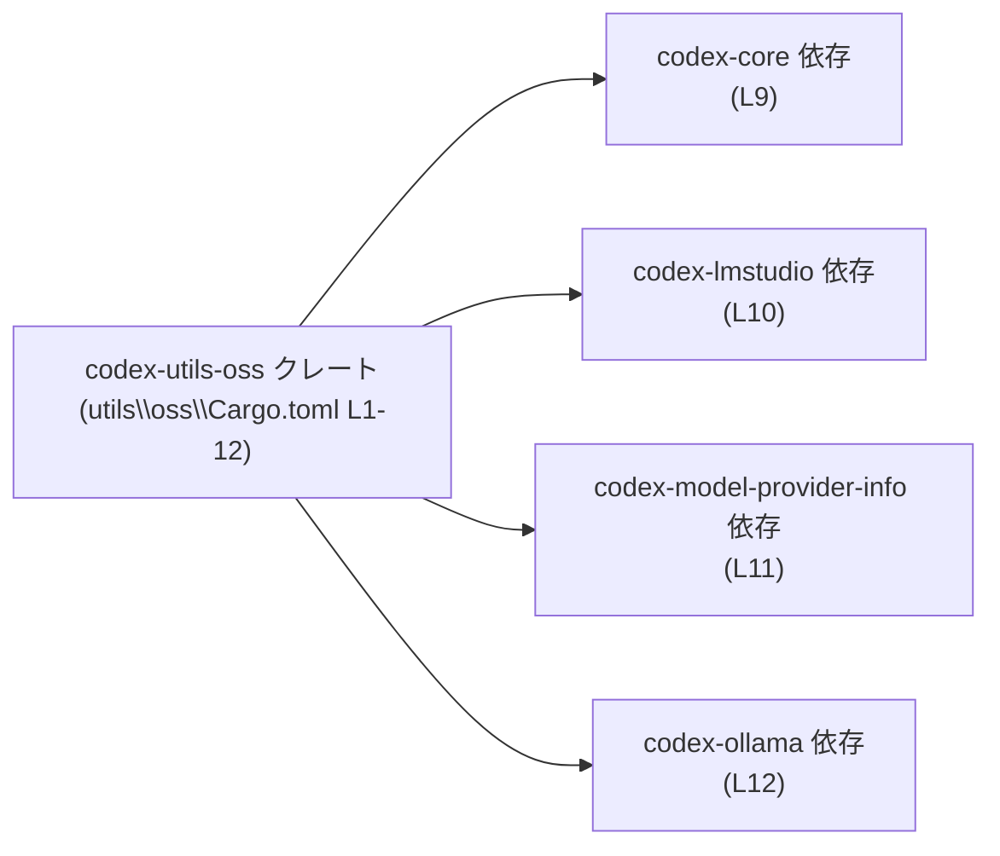
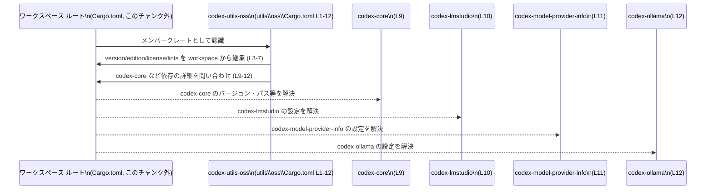

# utils\oss\Cargo.toml

## 0. ざっくり一言

`codex-utils-oss` という名前の Rust クレートをワークスペース内で定義し、  
バージョンや依存関係、リント設定をすべてワークスペース側から継承するための Cargo マニフェストです（utils\oss\Cargo.toml:L1-12）。

---

## 1. このモジュールの役割

### 1.1 概要

- このファイルは Rust のビルドツール Cargo 用のマニフェストで、クレート `codex-utils-oss` を定義します（L1-2）。
- バージョン・エディション・ライセンス・リント設定をワークスペースの設定から継承します（L3-5, L6-7）。
- 依存クレートとして `codex-core`, `codex-lmstudio`, `codex-model-provider-info`, `codex-ollama` をワークスペース経由で参照します（L8-12）。

このファイル自体には Rust の関数・構造体・ロジックは含まれていません（Meta: functions=0, exports=0）。

### 1.2 アーキテクチャ内での位置づけ

`codex-utils-oss` クレートが、同一ワークスペース内（または同一バージョンで管理される）他クレートに依存する構造になっています。



- 依存関係セクションは `[dependencies]` テーブルで定義されています（L8）。
- 各依存は `workspace = true` を指定しており、バージョンやパスなどの詳細はワークスペース側に委ねられています（L9-12）。

### 1.3 設計上のポイント

コードから読み取れる設計上の特徴は次のとおりです。

- **ワークスペース集中管理**
  - `version.workspace = true` により、バージョンはワークスペース共通設定から継承されます（L3）。
  - `edition.workspace = true` および `license.workspace = true` により、エディションとライセンスも共通化されています（L4-5）。
- **リント設定もワークスペース依存**
  - `[lints]` セクションで `workspace = true` が指定されており、コンパイル時の警告・エラーの方針もワークスペース側で一括管理されます（L6-7）。
- **依存クレート情報の継承**
  - すべての依存は `{ workspace = true }` 指定で、実際のバージョンや feature 設定はワークスペースの `[workspace.dependencies]` などに委譲されています（L9-12）。
- **状態やロジックを持たない**
  - このファイルはビルド設定のみを記述しており、実行時の状態・エラー処理・並行性などのロジックは含まれていません。  
    これらは同クレート内の Rust ソースコード側（例: `src/lib.rs` など）に存在すると考えられますが、このチャンクには現れません。

---

## 2. 主要な機能一覧

このファイル単体が提供する「機能」は、ビルド／依存管理上の設定です。

- クレート定義: `codex-utils-oss` クレートをワークスペースの一員として定義する（L1-2）。
- バージョン継承: バージョン番号をワークスペース設定から継承する（L3）。
- エディション継承: Rust エディション（例: 2021 など）をワークスペースから継承する（L4）。
- ライセンス継承: ライセンス表記をワークスペースから継承する（L5）。
- リント設定継承: コンパイル時のリント方針をワークスペースで一元管理する（L6-7）。
- 依存クレート定義: `codex-core`, `codex-lmstudio`, `codex-model-provider-info`, `codex-ollama` への依存をワークスペース設定経由で宣言する（L8-12）。

Rust の公開 API（関数・型・モジュール）自体はこのファイルには定義されていません。

---

## 3. 公開 API と詳細解説

このファイルは Cargo 設定のみを含み、Rust の型や関数は含みません。  
ここでは「コンポーネント（クレートや設定セクション）」のインベントリーとして整理します。

### 3.1 型一覧（構造体・列挙体など）／コンポーネント一覧

Rust の型定義は無いため、代わりにビルド上の主要コンポーネントを列挙します。

| 名前 | 種別 | 役割 / 用途 | 根拠行 |
|------|------|-------------|--------|
| `codex-utils-oss` | クレート（パッケージ） | ワークスペース内の一つのクレートとして定義される。 | utils\oss\Cargo.toml:L1-2 |
| `version.workspace` | パッケージ設定 | バージョンをワークスペース設定から継承する指定。 | utils\oss\Cargo.toml:L3 |
| `edition.workspace` | パッケージ設定 | Rust エディションをワークスペース設定から継承する指定。 | utils\oss\Cargo.toml:L4 |
| `license.workspace` | パッケージ設定 | ライセンス表記をワークスペース設定から継承する指定。 | utils\oss\Cargo.toml:L5 |
| `[lints]` + `workspace = true` | リント設定 | リント（コンパイル時警告・エラー）の詳細をワークスペースに委譲。 | utils\oss\Cargo.toml:L6-7 |
| `codex-core` | 依存クレート | コア機能を提供するクレートへの依存。詳細設定はワークスペース側。 | utils\oss\Cargo.toml:L9 |
| `codex-lmstudio` | 依存クレート | `codex-lmstudio` クレートへの依存。詳細はワークスペース側。 | utils\oss\Cargo.toml:L10 |
| `codex-model-provider-info` | 依存クレート | モデル提供者の情報を扱うクレートへの依存と推測されるが、用途はこのチャンクからは断定できない。 | utils\oss\Cargo.toml:L11 |
| `codex-ollama` | 依存クレート | `codex-ollama` クレートへの依存。用途はこのチャンクからは不明。 | utils\oss\Cargo.toml:L12 |

> 用途に関する詳しい振る舞い（API 内容、役割など）は、この `Cargo.toml` からは読み取れません。

### 3.2 関数詳細

- このファイルには Rust の関数・メソッド定義が存在しないため、本セクションで詳細解説できる関数は **ありません**。
- 公開 API・エラー処理・並行性などの具体的な挙動は、同クレート配下のソースコード（例: `utils/oss/src/lib.rs`）に依存しますが、このチャンクには現れません。

### 3.3 その他の関数

- 該当なし（関数・メソッド定義が存在しません）。

---

## 4. データフロー

このファイル自体は実行時のデータフローではなく、**ビルド時の依存関係の流れ** を定義します。

### 4.1 ビルド時の依存関係フロー

Cargo が `codex-utils-oss` をビルドする際の、おおまかな依存解決フローを示します。



要点:

- `workspace = true` 指定により、**このファイル単体ではバージョン・依存の詳細が完結していない** ことがわかります（L3-5, L9-12）。
- ワークスペースルート（このチャンクには現れない）が、各依存クレートのバージョンやソース位置を一元管理している前提です。

---

## 5. 使い方（How to Use）

このセクションでは、`codex-utils-oss` クレートと、この `Cargo.toml` の典型的な利用方法を説明します。

### 5.1 基本的な使用方法

#### 1. `codex-utils-oss` クレートをビルドする

ワークスペースルート（別ファイル）から、クレート名を指定してビルドするのが一般的です。

```bash
# ワークスペースルートのディレクトリで実行する例
cargo build -p codex-utils-oss
```

- `-p codex-utils-oss` のクレート名は、この `Cargo.toml` の `name` に対応します（utils\oss\Cargo.toml:L2）。

#### 2. 他クレートから依存として利用する

同じワークスペース内の別クレートから、このクレートを依存として利用する一例です（パスはファイルパスから推定した例です）。

```toml
# 例: 同じワークスペース内の別 Cargo.toml
[dependencies]
codex-utils-oss = { path = "utils/oss" }  # utils\oss\Cargo.toml を指す
```

- 実際のパス指定方法やバージョン指定はワークスペース構成に依存します。
- この例は、ファイルパス `utils\oss\Cargo.toml` から推定した典型パターンであり、実際のプロジェクトでの指定方法はこのチャンクからは断定できません。

### 5.2 よくある使用パターン

- **ワークスペース集中管理パターン**
  - バージョン・エディション・ライセンス・依存をすべてワークスペース側で定義し、各メンバークレートは `workspace = true` だけを持つパターンです（L3-5, L9-12）。
  - これにより、複数クレート間でのバージョン整合性が取りやすくなります。

- **リント共通化パターン**
  - `[lints]` セクションで `workspace = true` を使い、プロジェクト全体で同一のリントポリシーを適用するパターンです（L6-7）。

### 5.3 よくある間違い

このファイル構成から想定される典型的な間違いと、その結果を示します。

```toml
# 間違い例: ワークスペース定義が無い環境でそのままビルドしようとする
[package]
name = "codex-utils-oss"
version.workspace = true   # ルートの [workspace.package] などが無いと解決できない
edition.workspace = true
license.workspace = true

[dependencies]
codex-core = { workspace = true }  # ルートの [workspace.dependencies] にも定義が必要
```

- このような設定は **ワークスペースに所属していることが前提** です。
- 単独のプロジェクトとして `cargo build` しようとすると、Cargo が `workspace = true` の解決に失敗し、エラーになります。

正しい例（ワークスペース側で設定がある前提）:

```toml
# utils\oss\Cargo.toml（本ファイル）側
[package]
name = "codex-utils-oss"
version.workspace = true
edition.workspace = true
license.workspace = true

[dependencies]
codex-core = { workspace = true }

# ワークスペースルート Cargo.toml（このチャンクには現れない）
[workspace]
members = ["utils/oss", /* ... */]

[workspace.package]
version = "0.1.0"
edition = "2021"
license = "MIT"

[workspace.dependencies]
codex-core = "0.1.0"
```

- ここで示したルート側の設定は **一般的な Cargo の書き方の一例** であり、実際のプロジェクトの設定内容はこのチャンクからは不明です。

### 5.4 使用上の注意点（まとめ）

- **前提条件**
  - この `Cargo.toml` は、`workspace = true` を多用しているため、Cargo ワークスペースの一員であることが前提です（L3-7, L9-12）。
- **エッジケース**
  - ワークスペース外でこのディレクトリ単独をビルドしようとすると、継承先の設定が存在せずビルドに失敗します。
- **安全性・エラー・並行性**
  - このファイルには実行時の安全性やエラー処理・並行性に関する情報は含まれていません。
  - それらは Rust ソースコード側の設計に依存し、このチャンクからは分析できません。

---

## 6. 変更の仕方（How to Modify）

このファイルに対して考えられる変更方法を、Cargo マニフェストの観点から整理します。

### 6.1 新しい機能を追加する場合

ここでの「新しい機能」は、主に依存クレートの追加や設定の拡張を指します。

1. **新しい依存クレートを追加する**
   - ワークスペース全体で依存を一元管理している前提のため、通常は次の 2 箇所を変更する構造になります。
     1. ワークスペースルートの `Cargo.toml` に、新しい依存を `[workspace.dependencies]` などに追加する（このチャンクには現れません）。
     2. `utils\oss\Cargo.toml` の `[dependencies]` に `{ workspace = true }` 形式で依存名を追加する（L8-12 と同様の形式）。

2. **ワークスペース継承フィールドを増やす**
   - 例えば `repository` や `homepage` などのメタ情報をワークスペース側に移したい場合、Cargo がサポートするフィールドであれば `xxx.workspace = true` 形式で追記することができます。
   - 実際にどのフィールドが `workspace = true` をサポートするかは、Cargo のバージョンと公式仕様に依存します。

### 6.2 既存の機能を変更する場合

1. **バージョン・ライセンス・エディションを変更したい場合**
   - このファイルではそれらがワークスペースから継承されているため（L3-5）、変更はワークスペースルート側で行う必要があります。
   - この `Cargo.toml` には直接の数値や文字列は記載されていないため、ここだけを変更しても効果はありません。

2. **特定の依存だけワークスペース管理から外したい場合**
   - 例えば `codex-core` だけ別バージョンを使いたい場合、`codex-core = { workspace = true }` をやめて、通常の `codex-core = "x.y.z"` 形式に変更します（L9）。
   - この操作は、「ワークスペース内でバージョンを揃える」という前提を崩す可能性があるため、プロジェクト方針との整合性確認が必要になります。

3. **影響範囲の確認**
   - `name = "codex-utils-oss"` を変更すると、このクレートに依存する他クレートの `Cargo.toml` での依存名がすべて影響を受けます（L2）。
   - 依存リスト（L9-12）を変更すると、このクレートのビルドに必要なライブラリが変化し、コンパイルエラーが発生する可能性があります。

---

## 7. 関連ファイル

この `Cargo.toml` と密接に関係すると考えられるファイル・ディレクトリを整理します。

| パス | 役割 / 関係 |
|------|------------|
| `Cargo.toml`（ワークスペースルート） | `version.workspace = true` や `[lints] workspace = true`、依存の `{ workspace = true }` を解決する設定を持つと考えられます（L3-7, L9-12）。実際の内容はこのチャンクには現れません。 |
| `utils/oss/src/lib.rs` など | `codex-utils-oss` クレートの実装コードが置かれる典型的なパスですが、実在するかどうか、このチャンクからは不明です。 |
| `codex-core` クレートの Cargo.toml / ソースコード | `codex-utils-oss` が依存するクレートの一つです（L9）。具体的な API や役割はこのチャンクには現れません。 |
| `codex-lmstudio` クレート | 依存先クレート（L10）。どのような機能を提供するかは不明です。 |
| `codex-model-provider-info` クレート | 依存先クレート（L11）。名前から用途が推測できるものの、コードが無いため断定はできません。 |
| `codex-ollama` クレート | 依存先クレート（L12）。実装や API はこのチャンクには現れません。 |

---

### 安全性・エラー・並行性についての補足

- この `Cargo.toml` は設定ファイルであり、**実行時の安全性（スレッドセーフティ）、エラー処理、並行性制御** に関する情報は含まれていません。
- それらの性質は、依存クレートを含む Rust ソースコード側で決まり、このチャンクだけからは分析できません。
- したがって、「公開 API とコアロジック」「言語固有の安全性/エラー/並行性」に関する具体的な解説は、このファイル単体では提供できません。
