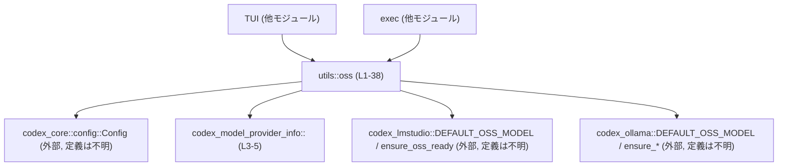
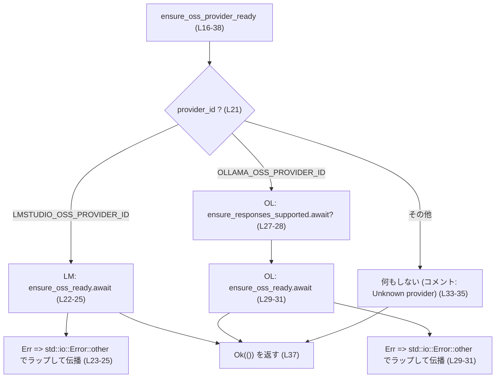
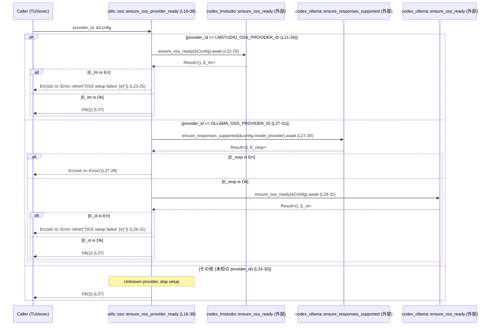

# utils/oss/src/lib.rs コード解説

## 0. ざっくり一言

TUI と exec から共通で使う「OSS モデルプロバイダ用ユーティリティ」です。  
プロバイダ ID からデフォルトモデル名を取得し、必要に応じて各プロバイダ固有のセットアップ処理を非同期で実行します（`LMStudio` / `Ollama` に対応、他はノーオペレーション）。

---

## 1. このモジュールの役割

### 1.1 概要

- このモジュールは **複数 OSS モデルプロバイダに共通する簡易ユーティリティ** を提供します。
- 主な機能は次の 2 点です。
  - プロバイダ ID から、利用すべきデフォルト OSS モデル名を返すこと  
    （`get_default_model_for_oss_provider`、`utils/oss/src/lib.rs:L7-14`）。
  - 指定されたプロバイダについて、モデルダウンロードや到達性チェックなどの準備を行うこと  
    （`ensure_oss_provider_ready`、`utils/oss/src/lib.rs:L16-38`）。

### 1.2 アーキテクチャ内での位置づけ

このモジュールは、TUI / exec などのフロントエンドと、各 OSS プロバイダ別クレート（`codex_lmstudio`, `codex_ollama`）の間に位置する薄いファサードのような役割です。



- `Config` 型とプロバイダ ID 定数を受け取り、内部でどのプロバイダ用クレートを呼ぶかを決定しています  
  （`use` と `match` より、`utils/oss/src/lib.rs:L3-5,L21-32`）。
- プロバイダ固有の処理の詳細は各クレート（`codex_lmstudio`, `codex_ollama`）に委ねられており、本ファイルには現れません。

### 1.3 設計上のポイント

コードから読み取れる設計上の特徴は次のとおりです。

- **完全にステートレス**
  - グローバル変数や構造体のフィールドは持たず、すべて関数引数に依存します。
  - 根拠: 関数定義のみで状態フィールドが存在しないため  
    (`utils/oss/src/lib.rs:L7-38`)。
- **プロバイダ選択は文字列 ID の `match`**
  - `LMSTUDIO_OSS_PROVIDER_ID` / `OLLAMA_OSS_PROVIDER_ID` 定数に基づいて分岐しています  
    (`utils/oss/src/lib.rs:L9-12,L21-33`)。
- **エラー型の統一**
  - 非同期セットアップ関数 `ensure_oss_provider_ready` の戻り値は `Result<(), std::io::Error>` に固定されており、  
    各プロバイダ側のエラーを `std::io::Error::other` でラップして統一しています  
    (`utils/oss/src/lib.rs:L16-20,L23-25,L29-31`)。
- **非同期 I/O を前提とした設計**
  - セットアップ処理は `async fn` で定義され、内部で `await` を用いています  
    (`utils/oss/src/lib.rs:L16-20,L23-25,L28-31`)。
  - これにより、呼び出し側は非同期ランタイム上でブロッキングせずに準備処理を実行できます。

---

## 2. 主要な機能・コンポーネント一覧

### 2.1 コンポーネント（関数・テスト）インベントリー

| 名前 | 種別 | 公開性 | 役割 / 概要 | 定義位置 |
|------|------|--------|------------|----------|
| `get_default_model_for_oss_provider` | 関数 | `pub` | プロバイダ ID からデフォルト OSS モデル名を返す | `utils/oss/src/lib.rs:L7-14` |
| `ensure_oss_provider_ready` | 関数 (`async`) | `pub` | 指定 OSS プロバイダのセットアップ（モデルダウンロード・到達性チェックなど）を実行 | `utils/oss/src/lib.rs:L16-38` |
| `test_get_default_model_for_provider_lmstudio` | テスト関数 | `#[test]` | LMStudio ID に対して正しいデフォルトモデルが返ることを確認 | `utils/oss/src/lib.rs:L44-48` |
| `test_get_default_model_for_provider_ollama` | テスト関数 | `#[test]` | Ollama ID に対して正しいデフォルトモデルが返ることを確認 | `utils/oss/src/lib.rs:L50-54` |
| `test_get_default_model_for_provider_unknown` | テスト関数 | `#[test]` | 未知のプロバイダ ID に対して `None` が返ることを確認 | `utils/oss/src/lib.rs:L56-60` |

外部から参照される型・定数（このファイルでは定義されていないが、依存関係として重要なもの）は以下のとおりです。

| 名前 | 種別 | 定義元 | 役割（推測含む） | 使用箇所 |
|------|------|--------|------------------|----------|
| `Config` | 構造体 | `codex_core::config` | モデルプロバイダ設定などを含む設定全体 | `utils/oss/src/lib.rs:L3,L17-20,L28` |
| `LMSTUDIO_OSS_PROVIDER_ID` | 定数 | `codex_model_provider_info` | LMStudio OSS プロバイダを識別する文字列 ID | `utils/oss/src/lib.rs:L4,L9,L21,L46` |
| `OLLAMA_OSS_PROVIDER_ID` | 定数 | `codex_model_provider_info` | Ollama OSS プロバイダを識別する文字列 ID | `utils/oss/src/lib.rs:L5,L11,L27,L52` |
| `codex_lmstudio::DEFAULT_OSS_MODEL` | 定数 | `codex_lmstudio` | LMStudio 用のデフォルト OSS モデル名 | `utils/oss/src/lib.rs:L10,L47` |
| `codex_ollama::DEFAULT_OSS_MODEL` | 定数 | `codex_ollama` | Ollama 用のデフォルト OSS モデル名 | `utils/oss/src/lib.rs:L11,L53` |
| `codex_lmstudio::ensure_oss_ready` | 関数 (`async` 推定) | `codex_lmstudio` | LMStudio OSS 環境の準備を行う関数（詳細はこのチャンクには現れない） | `utils/oss/src/lib.rs:L22-25` |
| `codex_ollama::ensure_responses_supported` | 関数 (`async` 推定) | `codex_ollama` | レスポンス形式のサポート確認を行う関数と推測される（定義はこのチャンクには現れない） | `utils/oss/src/lib.rs:L27-28` |
| `codex_ollama::ensure_oss_ready` | 関数 (`async` 推定) | `codex_ollama` | Ollama OSS 環境の準備を行う関数（詳細はこのチャンクには現れない） | `utils/oss/src/lib.rs:L29-31` |

### 2.2 主要な機能一覧

- デフォルトモデル解決:  
  プロバイダ ID (`&str`) を受け取り、対応するデフォルト OSS モデル名を `Option<&'static str>` として返す。  
  対応外の ID は `None` を返す（`utils/oss/src/lib.rs:L7-14`）。

- OSS プロバイダのセットアップ:  
  指定されたプロバイダ ID に応じて、
  - LMStudio の場合: `codex_lmstudio::ensure_oss_ready` を呼び出し、エラーを `std::io::Error` に変換。  
  - Ollama の場合: `ensure_responses_supported` → `ensure_oss_ready` の順に呼び出し、同様にエラーを `std::io::Error` に統一。  
  - 未知のプロバイダ ID の場合: 何も行わずに `Ok(())` を返す。  
  （`utils/oss/src/lib.rs:L16-38`）

---

## 3. 公開 API と詳細解説

### 3.1 型一覧（このファイルから利用しているもの）

| 名前 | 種別 | 役割 / 用途 | 備考 |
|------|------|-------------|------|
| `Config` | 構造体 | モデルプロバイダを含むアプリケーション設定全体 | 定義は `codex_core::config` にあり、本チャンクには現れません（`utils/oss/src/lib.rs:L3,L17-20,L28`）。 |

このファイル自体は新しい構造体や列挙体を定義していません。

### 3.2 関数詳細

#### `get_default_model_for_oss_provider(provider_id: &str) -> Option<&'static str>`

**概要**

指定した OSS プロバイダ ID に対応するデフォルト OSS モデル名を返す関数です。  
対応していないプロバイダ ID に対しては `None` を返します（`utils/oss/src/lib.rs:L7-14`）。

**引数**

| 引数名 | 型 | 説明 |
|--------|----|------|
| `provider_id` | `&str` | OSS プロバイダを識別する文字列 ID。`LMSTUDIO_OSS_PROVIDER_ID` または `OLLAMA_OSS_PROVIDER_ID` など。 |

**戻り値**

- 型: `Option<&'static str>`
  - `Some(model_name)`: 対応するプロバイダに紐づくデフォルト OSS モデル名。
  - `None`: 対応していないプロバイダ ID の場合（`_ => None` の分岐、`utils/oss/src/lib.rs:L12`）。

**内部処理の流れ**

`match` による単純な分岐です（`utils/oss/src/lib.rs:L9-13`）。

1. `provider_id` を `match` で分岐する。
2. `LMSTUDIO_OSS_PROVIDER_ID` と一致した場合、`codex_lmstudio::DEFAULT_OSS_MODEL` を返す（`Some` でラップ）。  
   （`utils/oss/src/lib.rs:L9-10`）
3. `OLLAMA_OSS_PROVIDER_ID` と一致した場合、`codex_ollama::DEFAULT_OSS_MODEL` を返す。  
   （`utils/oss/src/lib.rs:L11`）
4. 上記以外の文字列の場合は `None` を返す。  
   （`utils/oss/src/lib.rs:L12`）

**Examples（使用例）**

基本的な利用例です。設定などの文脈を持たず、単にデフォルトモデル名を問い合わせています。

```rust
// 必要な定数をインポートする
use codex_model_provider_info::{LMSTUDIO_OSS_PROVIDER_ID, OLLAMA_OSS_PROVIDER_ID};
// このユーティリティモジュールをインポートする
use utils::oss::get_default_model_for_oss_provider;

fn main() {
    // LMStudio のデフォルトモデル名を取得する
    let lm_model = get_default_model_for_oss_provider(LMSTUDIO_OSS_PROVIDER_ID);
    // Some(...) が返る想定で、中身を表示する
    println!("LMStudio default: {:?}", lm_model); // Debug 表示

    // Ollama のデフォルトモデル名を取得する
    let ollama_model = get_default_model_for_oss_provider(OLLAMA_OSS_PROVIDER_ID);
    println!("Ollama default: {:?}", ollama_model);

    // 未知のプロバイダ ID の場合は None
    let unknown_model = get_default_model_for_oss_provider("unknown-provider");
    println!("Unknown default: {:?}", unknown_model); // None が出力される
}
```

**Errors / Panics**

- この関数は `Option` を返すのみで、`Result` や `panic!` を利用していません。
- 想定外の ID に対しても `None` を返すだけであり、パニック条件はコードからは存在しません  
  （`utils/oss/src/lib.rs:L9-13`）。

**Edge cases（エッジケース）**

- 空文字列 `""` の `provider_id`:
  - `match` のどのアームにも一致しないため `None` が返ります（`_ => None`、`utils/oss/src/lib.rs:L12`）。
- 大文字・小文字の違い:
  - `provider_id` は単純な文字列比較で判定され、正確に定数と一致する必要があります。  
    文字大小が異なれば `None` になります（比較方法はコード上 `match` による等価比較のみ）。
- 未知の ID (`"unknown-provider"` など):
  - すべて `None` となることがテストで確認されています  
    （`test_get_default_model_for_provider_unknown`、`utils/oss/src/lib.rs:L56-60`）。

**使用上の注意点**

- 呼び出し側は `None` を明示的に扱う必要があります。  
  未知のプロバイダ ID の場合でも例外は発生しないため、呼び出し側のロジックで  
  「対応していないプロバイダ ID である」という事実を検出するかどうかを決める必要があります。
- 戻り値が `&'static str` であるため、ライフタイム管理は不要ですが、文字列を変更したい場合は `String` 等にコピーする必要があります。

---

#### `ensure_oss_provider_ready(provider_id: &str, config: &Config) -> Result<(), std::io::Error>`

**概要**

指定された OSS プロバイダについて、モデルのダウンロードやサービス到達性の確認など、  
「利用可能な状態」にするための準備処理を非同期に実行する関数です  
（`utils/oss/src/lib.rs:L16-38`）。

対応するプロバイダ:

- `LMSTUDIO_OSS_PROVIDER_ID`: LMStudio 用のセットアップ関数を呼ぶ。
- `OLLAMA_OSS_PROVIDER_ID`: Ollama 用のレスポンスサポート確認 → セットアップ関数の順に呼ぶ。
- それ以外の ID: 何もせず `Ok(())` を返す。

**引数**

| 引数名 | 型 | 説明 |
|--------|----|------|
| `provider_id` | `&str` | OSS プロバイダを識別する文字列 ID。`LMSTUDIO_OSS_PROVIDER_ID` / `OLLAMA_OSS_PROVIDER_ID` など。 |
| `config` | `&Config` | アプリケーション設定。少なくとも `config.model_provider` フィールドを持つことが分かります（`utils/oss/src/lib.rs:L28`）。 |

**戻り値**

- 型: `Result<(), std::io::Error>`
  - `Ok(())`: セットアップが正常に完了した場合、または未知のプロバイダ ID のため何も行っていない場合。
  - `Err(std::io::Error)`: いずれかのプロバイダ固有のセットアップ処理でエラーが発生し、`std::io::Error` としてラップされた場合。

**内部処理の流れ（アルゴリズム）**

`provider_id` による `match` で分岐し、それぞれ異なる非同期関数を呼び出します（`utils/oss/src/lib.rs:L21-36`）。



- **LMStudio 分岐**（`utils/oss/src/lib.rs:L22-26`）
  1. `codex_lmstudio::ensure_oss_ready(config).await` を実行。
  2. 戻り値の `Err(e)` を `std::io::Error::other(format!("OSS setup failed: {e}"))` に変換し、  
     `?` で呼び出し元に伝播。
- **Ollama 分岐**（`utils/oss/src/lib.rs:L27-31`）
  1. `codex_ollama::ensure_responses_supported(&config.model_provider).await?;` を実行。  
     この関数は `Result<_, _>` を返し、そのエラー型は `std::io::Error` か、  
     少なくとも `std::io::Error` へ変換可能である必要があります（`?` により推測）。
  2. 続けて `codex_ollama::ensure_oss_ready(config).await` を呼び出し、  
     LMStudio と同様にエラーを `std::io::Error::other("OSS setup failed: ...")` に変換して伝播。
- **その他の ID**（`utils/oss/src/lib.rs:L33-35`）
  1. コメントにある通り、未知のプロバイダ ID では「何もせずスキップ」します。
- いずれの場合も、エラーがなければ最後に `Ok(())` を返します（`utils/oss/src/lib.rs:L37`）。

**Examples（使用例）**

典型的な使用方法として、アプリケーション起動時にプロバイダを準備する例です。

```rust
// 非同期ランタイム（tokio 等）が必要
use codex_core::config::Config;                        // Config 型をインポート
use codex_model_provider_info::LMSTUDIO_OSS_PROVIDER_ID;
use utils::oss::ensure_oss_provider_ready;             // このモジュールの関数をインポート

#[tokio::main]                                         // tokio ランタイムを起動するマクロ
async fn main() -> Result<(), Box<dyn std::error::Error>> {
    // 何らかの方法で Config を読み込む（詳細はこのチャンクには現れない）
    let config: Config = load_config_somehow()?;       // 仮の関数。実装は別モジュール。

    // LMStudio OSS プロバイダの準備を行う
    ensure_oss_provider_ready(LMSTUDIO_OSS_PROVIDER_ID, &config).await?;

    // アプリケーションのメイン処理に進む
    println!("OSS provider is ready.");
    Ok(())
}
```

Ollama の場合も同様に `OLLAMA_OSS_PROVIDER_ID` を渡すだけです。

**Errors / Panics**

- **エラー (`Err(std::io::Error)`) が返る条件**
  - `codex_lmstudio::ensure_oss_ready(config)` がエラーを返した場合  
    → `std::io::Error::other("OSS setup failed: {e}")` に変換されて伝播  
      （`utils/oss/src/lib.rs:L22-25`）。
  - `codex_ollama::ensure_responses_supported(&config.model_provider)` がエラーを返し、  
    `?` によって `std::io::Error` 互換のエラーとして伝播する場合  
    （`utils/oss/src/lib.rs:L27-28`）。
  - `codex_ollama::ensure_oss_ready(config)` がエラーを返した場合  
    → LMStudio と同様に `std::io::Error::other` でラップされて伝播  
      （`utils/oss/src/lib.rs:L29-31`）。
- **パニック**
  - この関数内で `panic!` や `unwrap` 等は使用されていません。  
    ただし、呼び出している外部関数が内部でパニックする可能性については、このチャンクだけでは分かりません（`codex_lmstudio` / `codex_ollama` の実装は不明）。

**Edge cases（エッジケース）**

- 未知の `provider_id`
  - `match` の `_` アームに入り、「何もせずスキップ」した上で `Ok(())` を返します  
    （`utils/oss/src/lib.rs:L33-37`）。
  - これは「準備が不要なプロバイダ」または「未対応プロバイダ」を暗黙に許容する挙動です。
- `Config` の内容が不完全な場合
  - コード上は `config.model_provider` を `ensure_responses_supported` に渡しています（`utils/oss/src/lib.rs:L28`）。  
    `Config` の定義やバリデーションはこのチャンクには現れないため、  
    不完全・不正な設定に対する挙動は、`codex_ollama` 側の実装に依存します。
- 非同期ランタイム外からの呼び出し
  - `async fn` であるため、`ensure_oss_provider_ready(...).await` は  
    非同期ランタイム（tokio 等）のコンテキスト内で実行する必要があります。  
    これは Rust の言語仕様上の制約です。

**使用上の注意点**

- **非同期コンテキスト必要**
  - `async fn` のため、呼び出しには `.await` が必要であり、  
    非同期ランタイム内で実行する必要があります。
- **未知のプロバイダ ID の扱い**
  - 未知の ID に対してもエラーを返さず `Ok(())` となるため、  
    「未知 ID をエラー扱いにしたい」場合は、呼び出し前後で明示的なチェックが必要です。
- **エラー文言**
  - `std::io::Error::other(format!("OSS setup failed: {e}"))` により、  
    元のエラーは文字列化されて `message` として保存されますが、  
    元型の情報は失われます（`utils/oss/src/lib.rs:L23-25,L29-31`）。  
    呼び出し側でエラー型に応じた分岐を行うことはできません。

---

### 3.3 その他の関数（テスト）

| 関数名 | 役割（1 行） | 定義位置 |
|--------|--------------|----------|
| `test_get_default_model_for_provider_lmstudio` | LMStudio プロバイダ ID に対して `get_default_model_for_oss_provider` が期待どおりのモデル名を返すことを検証します。 | `utils/oss/src/lib.rs:L44-48` |
| `test_get_default_model_for_provider_ollama` | Ollama プロバイダ ID に対して同様の検証を行います。 | `utils/oss/src/lib.rs:L50-54` |
| `test_get_default_model_for_provider_unknown` | 未知のプロバイダ ID に対して `None` が返ることを検証します。 | `utils/oss/src/lib.rs:L56-60` |

いずれも `get_default_model_for_oss_provider` のみをテストしており、  
`ensure_oss_provider_ready` についてはこのファイル内でテストが定義されていません。

---

## 4. データフロー

ここでは、`ensure_oss_provider_ready` を呼び出す典型的なシナリオにおけるデータフローを示します。

### 4.1 セットアップ処理のシーケンス（LMStudio / Ollama / 未知 ID）



要点:

- 呼び出し側からは、単に `provider_id` と `&Config` を渡すだけでよく、個々のプロバイダ固有処理は隠蔽されています。
- LMStudio / Ollama の両方で、失敗時のエラーは最終的に `std::io::Error` として統一され、  
  メッセージに `"OSS setup failed: ..."` が付与されます（`utils/oss/src/lib.rs:L23-25,L29-31`）。
- 未知の ID の場合は、呼び出し側には「成功」として見える点に注意が必要です。

---

## 5. 使い方（How to Use）

### 5.1 基本的な使用方法

アプリケーション起動時に、設定からプロバイダ ID を取得し、デフォルトモデルを確認した上でセットアップを行う例です。

```rust
use codex_core::config::Config;                           // Config 型
use codex_model_provider_info::LMSTUDIO_OSS_PROVIDER_ID;  // プロバイダ ID 定数
use utils::oss::{                                         // このモジュールの関数
    get_default_model_for_oss_provider,
    ensure_oss_provider_ready,
};

#[tokio::main]                                           // tokio 非同期ランタイム
async fn main() -> Result<(), Box<dyn std::error::Error>> {
    // 設定をロードする（実際の実装は別モジュール。ここでは仮定）
    let config: Config = load_config_somehow()?;          // 設定を取得

    // 使用するプロバイダ ID を決定する（例として LMStudio 固定）
    let provider_id = LMSTUDIO_OSS_PROVIDER_ID;

    // デフォルトモデル名を取得する
    let default_model = get_default_model_for_oss_provider(provider_id);
    println!("Default model: {:?}", default_model);       // Some("...") か None

    // プロバイダのセットアップを行う（モデルダウンロード等）
    ensure_oss_provider_ready(provider_id, &config).await?; // エラーがあればここで Err

    // 以降、プロバイダが利用可能である前提で処理を行う
    Ok(())
}
```

### 5.2 よくある使用パターン

1. **プロバイダ ID を設定から取得して分岐**

```rust
use codex_core::config::Config;
use codex_model_provider_info::{LMSTUDIO_OSS_PROVIDER_ID, OLLAMA_OSS_PROVIDER_ID};
use utils::oss::{get_default_model_for_oss_provider, ensure_oss_provider_ready};

async fn setup_from_config(config: &Config) -> Result<(), std::io::Error> {
    // 仮に Config に provider_id フィールドがあるとする（定義はこのチャンクには現れない）
    let provider_id = config.model_provider.id.as_str(); // 仮のフィールド構造

    // デフォルトモデル名をログ出力するなど
    if let Some(model) = get_default_model_for_oss_provider(provider_id) {
        println!("Using default model: {model}");
    }

    // プロバイダのセットアップを実行
    ensure_oss_provider_ready(provider_id, config).await
}
```

1. **未知プロバイダ ID をエラーに変換するラッパー**

```rust
use utils::oss::{get_default_model_for_oss_provider, ensure_oss_provider_ready};

async fn ensure_known_provider_ready(
    provider_id: &str,
    config: &Config,
) -> Result<(), Box<dyn std::error::Error>> {
    // 未知の provider_id を事前に弾くことで、挙動を明示的にする
    if get_default_model_for_oss_provider(provider_id).is_none() {
        // この判定ロジックは一例。要件に合わせて定義する。
        return Err(format!("Unsupported provider_id: {provider_id}").into());
    }

    ensure_oss_provider_ready(provider_id, config).await?;
    Ok(())
}
```

### 5.3 よくある間違い（想定）

コードから推測される、起こりやすい誤用例を挙げます。

```rust
// 間違い例: 非同期ランタイム外で .await しようとする（コンパイルエラーになる）
// let config = ...;
// ensure_oss_provider_ready("some-id", &config).await;

// 正しい例: tokio などの非同期ランタイムの中で .await する
#[tokio::main]
async fn main() {
    let config = load_config_somehow().unwrap(); // 例示用
    ensure_oss_provider_ready("some-id", &config).await.unwrap();
}
```

```rust
// 間違い例: 未知の provider_id を許容していることに気づかずに利用する
async fn setup(config: &Config) {
    let provider_id = "typo-in-provider-id";      // スペルミス
    // ここで Ok(()) が返ってしまい、準備が行われない可能性がある
    let _ = ensure_oss_provider_ready(provider_id, config).await;
}

// 対策例: 既知の ID であることをチェックする
async fn setup_checked(config: &Config) -> Result<(), std::io::Error> {
    let provider_id = "typo-in-provider-id";
    if get_default_model_for_oss_provider(provider_id).is_none() {
        return Err(std::io::Error::other("Unknown provider_id"));
    }
    ensure_oss_provider_ready(provider_id, config).await
}
```

### 5.4 使用上の注意点（まとめ）

- **非同期ランタイム必須**:  
  `ensure_oss_provider_ready` は `async fn` であり、`tokio` などのランタイム上で `.await` する必要があります。
- **未知プロバイダ ID の扱い**:  
  未知 ID に対しても `Ok(())` を返す設計であるため、「必ず準備が実行される」ことを前提にしてはいけません。  
  必要であればラッパー関数などで未知 ID をエラー化することが考えられます（使用例参照）。
- **エラー型の喪失**:  
  `std::io::Error::other` でエラーをラップしているため、元のエラー型情報は失われます。  
  呼び出し側はエラーの種類よりもメッセージや文脈に基づいて処理を行うことになります。
- **観測性**:  
  このモジュール内にはログ出力等はなく、エラーを返すだけです。  
  セットアッププロセスの詳細な観測が必要な場合は、`codex_lmstudio` / `codex_ollama` 側のログや、  
  呼び出し側でのログ記録が重要になります。

---

## 6. 変更の仕方（How to Modify）

### 6.1 新しいプロバイダを追加する場合

新しい OSS プロバイダ（例: `NEWPROV`）をサポートしたい場合の一般的な手順です。

1. **プロバイダ ID 定数の追加**
   - `codex_model_provider_info` クレート側に `NEWPROV_OSS_PROVIDER_ID` のような定数を追加します。  
     （このファイルでは既に `LMSTUDIO_OSS_PROVIDER_ID` / `OLLAMA_OSS_PROVIDER_ID` を参照しているため、同様の形が想定されます。`utils/oss/src/lib.rs:L4-5`）
2. **プロバイダ固有クレートの用意**
   - `codex_newprov` のようなクレートを用意し、`DEFAULT_OSS_MODEL` や `ensure_oss_ready` 相当の API を実装します。  
     既存の `codex_lmstudio` / `codex_ollama` と類似のインターフェースにすると、このファイルの修正が容易になります。
3. **`get_default_model_for_oss_provider` の `match` にアームを追加**
   - 例:  

     ```rust
     NEWPROV_OSS_PROVIDER_ID => Some(codex_newprov::DEFAULT_OSS_MODEL),
     ```

     を `utils/oss/src/lib.rs:L9-12` の `match` 内に追加します。
4. **`ensure_oss_provider_ready` の `match` にアームを追加**
   - 例:  

     ```rust
     NEWPROV_OSS_PROVIDER_ID => {
         codex_newprov::ensure_oss_ready(config)
             .await
             .map_err(|e| std::io::Error::other(format!("OSS setup failed: {e}")))?;
     }
     ```

     を `utils/oss/src/lib.rs:L21-32` の間に追加します。
5. **テストの追加**
   - 既存テストに倣い、`get_default_model_for_oss_provider(NEWPROV_OSS_PROVIDER_ID)` の結果が期待通りであることを確認するテストを追加します。  
     (`tests` モジュールは `utils/oss/src/lib.rs:L40-61` に定義されています。)

### 6.2 既存の機能を変更する場合

- **エラー処理ポリシーの変更**
  - 例えば、未知のプロバイダ ID をエラーにしたい場合、`ensure_oss_provider_ready` の `_` アーム  
    （`utils/oss/src/lib.rs:L33-35`）で `Err(std::io::Error::other("Unknown provider"))` を返すように変更することが考えられます。
  - 影響範囲として、この関数を呼び出しているすべてのコードで、新たに `Err` を扱う必要が生じます。
- **エラー型の詳細化**
  - 現在はすべてのエラーを `std::io::Error` にまとめていますが、  
    より詳細なエラー区別が必要な場合は、独自のエラー型（`enum`）を定義し、  
    戻り値の型を `Result<(), MyError>` に変更する必要があります。  
    その場合、`map_err` 部分（`utils/oss/src/lib.rs:L23-25,L29-31`）の実装も変更が必要です。
- **テストの拡充**
  - `ensure_oss_provider_ready` の挙動は、このファイル内ではテストされていません。  
    プロバイダ側のモックやテスト用実装を用意し、エラー伝播や未知 ID の挙動を確認するテストを追加することが考えられます。

---

## 7. 関連ファイル・モジュール

| パス / モジュール | 役割 / 関係 |
|-------------------|------------|
| `codex_core::config::Config` | アプリケーション設定を表す型。少なくとも `model_provider` フィールドを持ち、`ensure_oss_provider_ready` から参照されています（`utils/oss/src/lib.rs:L3,L17-20,L28`）。定義はこのチャンクには現れません。 |
| `codex_model_provider_info::{LMSTUDIO_OSS_PROVIDER_ID, OLLAMA_OSS_PROVIDER_ID}` | 各 OSS プロバイダを識別する文字列 ID 定数を提供します（`utils/oss/src/lib.rs:L4-5`）。 |
| `codex_lmstudio` クレート | `DEFAULT_OSS_MODEL` 定数および `ensure_oss_ready` 関数を提供し、LMStudio OSS プロバイダの実処理を担当します（`utils/oss/src/lib.rs:L10,L22-25`）。実装はこのチャンクには現れません。 |
| `codex_ollama` クレート | `DEFAULT_OSS_MODEL` 定数、`ensure_responses_supported` 関数、`ensure_oss_ready` 関数を提供し、Ollama OSS プロバイダの実処理を担当します（`utils/oss/src/lib.rs:L11,L27-31`）。実装はこのチャンクには現れません。 |
| `utils/oss/src/lib.rs`（本ファイル） | TUI / exec から利用される、OSS プロバイダ共通のユーティリティを提供します。 |

---

## Bugs / Security / 契約・エッジケース（まとめ）

最後に、このファイルから読み取れる契約や注意点を簡潔に整理します。

- **潜在的なバグ/設計上の注意**
  - 未知の `provider_id` に対して `ensure_oss_provider_ready` が `Ok(())` を返す点  
    （`utils/oss/src/lib.rs:L33-37`）。  
    呼び出し側が「ID 指定さえすれば必ずセットアップが行われる」と誤解すると、  
    実際にはセットアップされていないのに成功扱いになる可能性があります。
- **セキュリティ観点**
  - このモジュール内では外部入力の直接的なパースやコマンド実行等は行っておらず、  
    主に他モジュールの関数を呼び出すだけです。  
    セキュリティ上の懸念があるとすれば、プロバイダ側クレートの実装に依存します。
- **契約（前提条件）**
  - `ensure_oss_provider_ready` を呼び出すには、`Config` が必要な設定を正しく含んでいることが前提です。  
    特に `config.model_provider` が有効である必要があります（`utils/oss/src/lib.rs:L28`）。
  - `provider_id` は `LMSTUDIO_OSS_PROVIDER_ID` / `OLLAMA_OSS_PROVIDER_ID` など、  
    想定された ID を使用することが前提ですが、コード上はそれを強制していません。
- **エッジケース**
  - `get_default_model_for_oss_provider` は未知 ID に対して `None`、  
    `ensure_oss_provider_ready` は `Ok(())` を返すという非対称な挙動をとります。  
    この違いを理解した上で組み合わせて利用することが重要です。

以上が、本チャンク（`utils/oss/src/lib.rs`）から読み取れる範囲での解説です。
