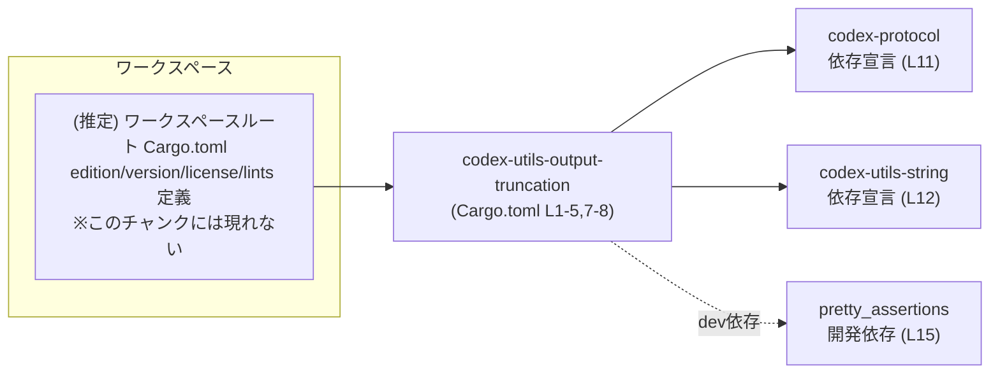
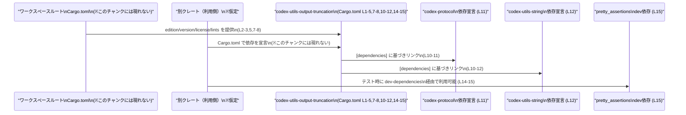

# utils/output-truncation/Cargo.toml

## 0. ざっくり一言

`codex-utils-output-truncation` クレートの Cargo マニフェストであり、クレート名とワークスペース共通の設定・依存関係・lint 設定を宣言するファイルです（`utils/output-truncation/Cargo.toml:L1-15`）。

---

## 1. このモジュールの役割

### 1.1 概要

- Rust クレート `codex-utils-output-truncation` の **メタ情報（名前・バージョン・ライセンス・edition）** を、ワークスペース共通設定として参照するように定義しています（`[package]` セクション, `utils/output-truncation/Cargo.toml:L1-5`）。
- このクレートが利用する **依存クレート**（`codex-protocol`, `codex-utils-string`）と、開発時専用の依存クレート `pretty_assertions` を宣言しています（`[dependencies]`, `[dev-dependencies]`, `utils/output-truncation/Cargo.toml:L10-12, L14-15`）。
- **lint 設定**についてもワークスペース共通のものを利用するように指定しています（`[lints]` セクション, `utils/output-truncation/Cargo.toml:L7-8`）。

このファイル自体には関数や型の定義は含まれず、ビルド設定と依存関係のみを扱います。

### 1.2 アーキテクチャ内での位置づけ

この Cargo.toml から読み取れる範囲での構造は次のとおりです。

- `codex-utils-output-truncation` はワークスペース内の 1 クレートであり、edition / license / version / lints をワークスペースルートの設定から継承します（`utils/output-truncation/Cargo.toml:L2-3, L5, L7-8`）。
- ビルド時に `codex-protocol` および `codex-utils-string` を通常依存としてリンクし（`utils/output-truncation/Cargo.toml:L10-12`）、テストや開発環境では `pretty_assertions` を追加で利用します（`utils/output-truncation/Cargo.toml:L14-15`）。

ワークスペース内のおおまかな依存関係は、次のように表せます（行番号はこの Cargo.toml 内の定義に対応します）。



> ここで `codex-protocol`, `codex-utils-string`, `pretty_assertions` の具体的な中身は、このチャンクには現れません。

### 1.3 設計上のポイント

コードから読み取れる設計上の特徴は次の通りです。

- **ワークスペース集中管理**  
  - edition / license / version / lints / 依存クレートのバージョンをすべて `workspace = true` で参照しており、ルートの Cargo.toml で集中管理する設計になっています（`utils/output-truncation/Cargo.toml:L2-3, L5, L7-8, L11-12, L15`）。
- **lint の共有**  
  - `[lints]` セクションで `workspace = true` を指定しており、Clippy などの lint レベルをワークスペース全体で統一する方針が読み取れます（`utils/output-truncation/Cargo.toml:L7-8`）。
- **通常依存と開発依存の分離**  
  - ランタイム依存は `[dependencies]`、テスト用途は `[dev-dependencies]` に分けており、ビルド成果物に不要な依存が混ざらない構成です（`utils/output-truncation/Cargo.toml:L10-12, L14-15`）。
- **安全性・エラー・並行性**  
  - これらは Rust のソースコード側で決まるため、この Cargo.toml からは具体的な挙動は分かりません。  
    ただし、ワークスペース共通の lint を適用していることから、静的解析によるエラー検出・安全性向上を意図していると解釈できます（`utils/output-truncation/Cargo.toml:L7-8`）。

---

## 2. 主要な機能一覧

このファイル自体はビルド設定のみを行い、実際の「出力トランケーション」のロジックは Rust ソースコード側（`src` ディレクトリなど）にあると考えられますが、このチャンクには現れません。

Cargo.toml としての「機能」は次のように整理できます。

- クレートメタ情報の定義: `codex-utils-output-truncation` というクレート名と、ワークスペース共通の edition / license / version を利用するよう指定（`utils/output-truncation/Cargo.toml:L1-5`）。
- lint 設定の共有: ワークスペース全体で共通の lint 設定を適用（`utils/output-truncation/Cargo.toml:L7-8`）。
- ランタイム依存の宣言: `codex-protocol`, `codex-utils-string` を通常依存として追加（`utils/output-truncation/Cargo.toml:L10-12`）。
- 開発時依存の宣言: `pretty_assertions` をテスト用の dev-dependency として追加（`utils/output-truncation/Cargo.toml:L14-15`）。

実際の公開 API（関数・構造体など）は、このファイルからは分かりません。

---

## 3. 公開 API と詳細解説

### 3.1 型一覧（構造体・列挙体など）

Cargo.toml は設定ファイルであり、Rust の型定義を含みません。このため、このチャンクからは公開型を特定できません。

| 名前 | 種別 | 役割 / 用途 | 根拠 |
|------|------|-------------|------|
| （このファイルには型定義がありません） | - | 型や列挙体は Rust ソースコード側（例: `src/lib.rs`）に定義されているはずですが、このチャンクには現れません。 | - |

> 実際の型一覧を得るには、`codex-utils-output-truncation` クレートの `src` 以下のコードが必要です。

### 3.2 関数詳細（最大 7 件）

Cargo.toml には関数定義は含まれません。そのため、このセクションで解説すべき公開関数を特定することはできません。

- 公開 API（関数・メソッド）は、通常 `src/lib.rs` や `src/*.rs` に記述されますが、これらはこのチャンクには含まれていません。
- よって、「どの関数をどう呼べば何が起きるか」「エラー型は何か」といった情報は、このファイルからは分かりません。

### 3.3 その他の関数

同様に、このファイルには補助関数やラッパー関数も存在しません。

| 関数名 | 役割（1 行） | 根拠 |
|--------|--------------|------|
| （なし） | Cargo.toml には関数定義が存在しません。 | - |

---

## 4. データフロー

このファイルからは実行時のデータフロー（どの関数からどの関数へデータが渡るか）は分かりませんが、**ビルド時・依存関係レベルのフロー**を示すことはできます。

### ビルド時の依存解決フロー（概念図）

下図は、他クレートが `codex-utils-output-truncation` に依存すると仮定したときの、ビルドおよびテストにおける依存関係の流れを示します。



- `Root`（ワークスペースルート）は `edition.workspace = true` 等により参照されますが、その定義自体はこのチャンクにはありません（`utils/output-truncation/Cargo.toml:L2-3, L5, L7-8`）。
- 実際にどの関数・型が `codex-protocol` や `codex-utils-string` を呼び出すかは、このファイルからは不明です。

---

## 5. 使い方（How to Use）

### 5.1 基本的な使用方法

このファイルは「`codex-utils-output-truncation` クレートを、ワークスペース内でビルド可能な形にする」ための設定です。  
他のクレートからこのクレートを利用する大まかな流れは、以下のようになります。

1. ワークスペースルートの Cargo.toml で、このクレートをメンバーとして登録（このチャンクには現れません）。
2. 利用側クレートの Cargo.toml に、`codex-utils-output-truncation` への依存を追加。
3. Rust ソースコードで `codex_utils_output_truncation` クレートを `use` して、公開 API を呼び出す。

2, 3 の例を、実際の API 名を伏せた形で示します。

```toml
# 別クレート側の Cargo.toml 例
[dependencies]
codex-utils-output-truncation = { workspace = true }  # 同一ワークスペース内の依存として追加
```

```rust
// 利用側クレートの src/lib.rs など

// クレートをインポートする（公開 API 名はこのチャンクからは不明）
use codex_utils_output_truncation; // 実際にはモジュールや関数を指定して use することになります

fn main() {
    // ここで codex_utils_output_truncation が提供する関数や型を呼び出す
    // 具体的な API は、この Cargo.toml からは分かりません
}
```

> 上記 Rust コードは、`codex-utils-output-truncation` クレートが同一ワークスペース内でビルド可能であることを前提としています。

### 5.2 よくある使用パターン

この Cargo.toml からは、クレート内部の API パターン（同期/非同期、設定差分など）は分かりません。

読み取れる範囲での「使用パターン」は、依存関係レベルに限られます。

- ワークスペース内の別クレートが `codex-utils-output-truncation` に依存し、その内部で `codex-protocol` と `codex-utils-string` を transitively（間接的に）利用する形になる点（`utils/output-truncation/Cargo.toml:L10-12`）。
- テストコードでは `pretty_assertions` を利用したアサーションスタイルが使われている可能性がある点（`utils/output-truncation/Cargo.toml:L14-15`）。  
  ただし、実際のテストコードはこのチャンクには含まれていません。

### 5.3 よくある間違い

Cargo.toml と依存関係まわりで起こりうる典型的なミスを、一般的な Rust の挙動に基づいて示します。

```toml
# 間違い例: 依存を追加せずにコードから参照してしまう
# [dependencies]
# codex-utils-output-truncation = { workspace = true }

# 正しい例: 依存関係を Cargo.toml に明示する
[dependencies]
codex-utils-output-truncation = { workspace = true }
```

- 間違い例の状態で Rust コードから `codex_utils_output_truncation` を参照すると、コンパイル時に「未解決の import」エラーになります。
- このファイル自体については、`workspace = true` としている依存がワークスペースルートで未定義の場合、ビルド時にエラーになります（`codex-protocol`, `codex-utils-string`, `pretty_assertions` の各行: `utils/output-truncation/Cargo.toml:L11-12, L15`）。

### 5.4 使用上の注意点（まとめ）

- **ワークスペース定義の前提**  
  - `edition.workspace = true`, `license.workspace = true`, `version.workspace = true` など、いずれもワークスペースルート側の設定が存在することが前提です（`utils/output-truncation/Cargo.toml:L2-3, L5`）。  
    ルートで未定義の場合はビルドエラーとなります。
- **依存クレートの定義が必要**  
  - `codex-protocol`, `codex-utils-string`, `pretty_assertions` も `workspace = true` で参照しているため、ルート Cargo.toml の `[dependencies]` / `[dev-dependencies]` 等に対応するエントリが必要です（`utils/output-truncation/Cargo.toml:L11-12, L15`）。
- **安全性・エラー・並行性の把握にはソースコードが必要**  
  - これらの振る舞いは Cargo.toml ではなく Rust ソースコードで決まります。このファイルだけでは、パニック条件やエラー型、スレッド安全性は判断できません。

---

## 6. 変更の仕方（How to Modify）

### 6.1 新しい機能を追加する場合

「機能追加」には Rust ソースコードの修正が伴いますが、このチャンクにはソースコードが含まれていません。ここでは **Cargo.toml 側で必要になり得る変更** に限定して整理します。

1. **新しい依存クレートが必要な場合**
   - ワークスペース全体で共有する場合は、ルート Cargo.toml に依存を追加し、このクレート側では `{ workspace = true }` で参照する、というパターンが想定されます（`utils/output-truncation/Cargo.toml:L10-12` を踏襲）。
   - このファイルに直接バージョン番号などを書くスタイルにはなっていないため、ここで個別バージョンを指定すると、方針が変わっていることになります。
2. **新規テスト用ライブラリが必要な場合**
   - テストコードで追加ライブラリを使う場合は、`[dev-dependencies]` にエントリを追加するのが自然です（`pretty_assertions` の扱い: `utils/output-truncation/Cargo.toml:L14-15` を参考）。
3. **lint 方針の変更**
   - このクレート固有の lint 設定を持たせたい場合、本来であれば `[lints]` セクションで個別設定を記述しますが、現在は `workspace = true` のみで統一されています（`utils/output-truncation/Cargo.toml:L7-8`）。
   - 個別設定を行うと、ワークスペース全体の一貫性が崩れる可能性があるため、チーム方針に依存します。

ソースコード側で新しい関数やモジュールを追加する場合、標準的な Rust プロジェクトでは `src/lib.rs` や `src/<module>.rs` に追記しますが、それらのファイルはこのチャンクには現れません。

### 6.2 既存の機能を変更する場合

Cargo.toml 側での変更が影響を与えうるポイントを整理します。

- **クレート名の変更 (`name`)**
  - `name = "codex-utils-output-truncation"` を変更すると（`utils/output-truncation/Cargo.toml:L4`）、他クレート側の依存指定や `use` パスもすべて変更する必要があります。
- **依存クレートの追加・削除・整理**
  - `codex-protocol` や `codex-utils-string` を削除・変更する場合（`utils/output-truncation/Cargo.toml:L11-12`）、ソースコード中でそれらを使用している箇所がないかを事前に確認する必要があります。
- **dev-dependencies の変更**
  - `pretty_assertions` を削除した場合（`utils/output-truncation/Cargo.toml:L15`）、テストコード内の `use pretty_assertions::...` がコンパイルエラーになるため、テストコードの修正が必要です。
- **ワークスペース設定の依存関係**
  - `edition.workspace`, `license.workspace`, `version.workspace`, `lints.workspace`, 依存の `workspace = true` はすべてワークスペースルートの設定に依存します（`utils/output-truncation/Cargo.toml:L2-3, L5, L7-8, L11-12, L15`）。  
    ルート側の変更がこのクレートに影響する点に注意が必要です。

---

## 7. 関連ファイル

この Cargo.toml と密接に関係するファイル・ディレクトリを、コードから分かる範囲で整理します。

| パス | 役割 / 関係 | 根拠 |
|------|------------|------|
| （推定）ワークスペースルートの `Cargo.toml` | `edition.workspace`, `license.workspace`, `version.workspace`, `lints.workspace`, および `codex-protocol`, `codex-utils-string`, `pretty_assertions` の実体を定義していると考えられます。このチャンクには内容は含まれません。 | `edition.workspace = true`, `license.workspace = true`, `version.workspace = true`, `[lints] workspace = true`, `[dependencies] codex-protocol = { workspace = true }`, `[dependencies] codex-utils-string = { workspace = true }`, `[dev-dependencies] pretty_assertions = { workspace = true }` から（`utils/output-truncation/Cargo.toml:L2-3, L5, L7-8, L11-12, L15`）。 |
| （推定）`utils/output-truncation/src/lib.rs` など | `codex-utils-output-truncation` クレートの実際のロジック（出力トランケーション処理など）が定義されるファイルと考えられますが、このチャンクには現れません。 | Cargo の標準的なディレクトリ構成と、`[package] name = "codex-utils-output-truncation"` の存在からの推定（`utils/output-truncation/Cargo.toml:L1-4`）。実際の中身は不明です。 |

---

### コンポーネントインベントリー（このチャンク分）

最後に、このチャンクから確実に分かるコンポーネントの一覧をまとめます。

| コンポーネント名 | 種別 | 説明 | 根拠 |
|------------------|------|------|------|
| `codex-utils-output-truncation` | クレート（パッケージ） | 出力トランケーション関連のユーティリティを提供すると考えられるクレート。Cargo.toml では名前とワークスペース参照設定のみ定義されている。実際のロジックはこのチャンクには現れない。 | `[package]` セクションと `name = "codex-utils-output-truncation"`（`utils/output-truncation/Cargo.toml:L1-5`）。 |
| `codex-protocol` | 通常依存クレート | このクレートが利用するプロトコル関連の機能を提供すると推測される依存クレート。バージョン等はワークスペースで管理。中身は不明。 | `[dependencies] codex-protocol = { workspace = true }`（`utils/output-truncation/Cargo.toml:L10-11`）。 |
| `codex-utils-string` | 通常依存クレート | 文字列ユーティリティを提供すると推測される依存クレート。バージョン等はワークスペースで管理。中身は不明。 | `[dependencies] codex-utils-string = { workspace = true }`（`utils/output-truncation/Cargo.toml:L10, L12`）。 |
| `pretty_assertions` | 開発依存クレート | テストコードでより読みやすい差分表示を行うためのライブラリとして利用されることが多い dev-dependency。ここではワークスペース管理。 | `[dev-dependencies] pretty_assertions = { workspace = true }`（`utils/output-truncation/Cargo.toml:L14-15`）。 |
| ワークスペース共通設定（edition, license, version, lints） | 設定コンポーネント | このクレートのビルド設定や lint ポリシーを決める共通設定。実体はルート Cargo.toml 等にあり、このチャンクには内容は含まれない。 | `edition.workspace = true`, `license.workspace = true`, `version.workspace = true`, `[lints] workspace = true`（`utils/output-truncation/Cargo.toml:L2-3, L5, L7-8`）。 |

このチャンクには関数や型の定義が一切現れないため、公開 API やコアロジックについては別チャンク（ソースコード側）の解析が必要です。
