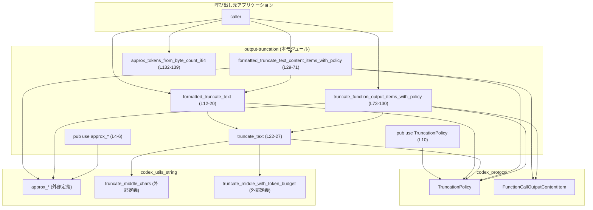
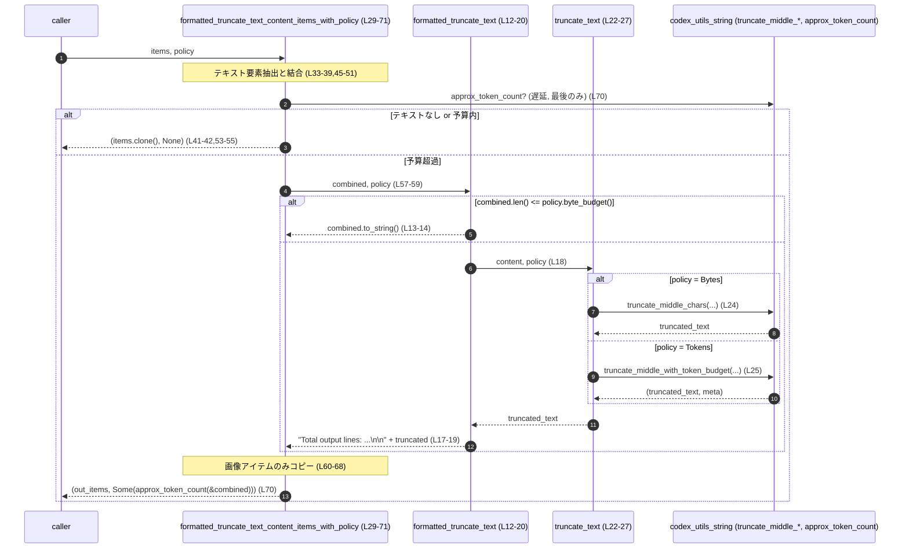

# utils/output-truncation/src/lib.rs コード解説

## 0. ざっくり一言

ツール実行結果や関数呼び出し結果のテキスト出力を、**バイト数またはトークン数の予算に合わせて中央部分を省略しつつトランケーション（切り詰め）するヘルパ関数群**です。画像付きの出力（`FunctionCallOutputContentItem`）に対する専用のトランケーション関数も提供します。

---

## 1. このモジュールの役割

### 1.1 概要

- このモジュールは、**LLM ツール／関数実行の出力が長くなりすぎる問題**を解決するために存在し、**[`TruncationPolicy`] に基づくテキスト・コンテンツのトランケーション機能**を提供します。
- 単一テキスト文字列向けの関数と、`FunctionCallOutputContentItem`（テキスト + 画像）の配列向けの関数の両方を公開しています（`utils/output-truncation/src/lib.rs:L12-20,L29-71,L73-130`）。
- 文字列長だけでなく、トークン数を概算するユーティリティ（`approx_*` 系）も同じモジュールから再エクスポートしており、呼び出し元で一括利用できるようになっています（`L4-6`）。

### 1.2 アーキテクチャ内での位置づけ

このモジュールは、次の外部コンポーネントに依存しています。

- `codex_protocol::protocol::TruncationPolicy`（トランケーションポリシーの列挙体）を再エクスポート（`L10`）。
- `codex_protocol::models::FunctionCallOutputContentItem`（テキスト／画像の出力アイテム型）を利用（`L3,L29-31,L73-75`）。
- `codex_utils_string` クレートのユーティリティを利用・再エクスポート（`L4-8`）。

依存関係の概要を Mermaid 図で示します（このファイル全体が対象：`utils/output-truncation/src/lib.rs:L1-142`）。



### 1.3 設計上のポイント

- **ステートレスな関数群**  
  - グローバル可変状態や内部キャッシュを持たず、すべての関数は入力から出力を計算する純粋な関数として定義されています（`L12-139`）。
- **ポリシーベースのトランケーション**
  - `TruncationPolicy` によって、バイト数・トークン数のどちらを基準にするかを切り替えます（`L22-26,L78-81,L92-95`）。
- **中央トランケーション**
  - 実際の切り詰めロジックは `truncate_middle_chars` / `truncate_middle_with_token_budget` に委譲しており、本モジュールはポリシー選択と出力整形に集中しています（`L24-25`）。
- **安全な整数処理**
  - 予算の減算には `saturating_sub` を利用し、オーバーフローを防いでいます（`L99`）。
  - `i64` から `usize` への変換やその逆で `try_from(...).unwrap_or(...)` を用い、変換失敗時には最大値に丸めることでパニックを回避しています（`L137-138`）。
- **並行性**
  - 共有ミュータブル状態がないため、このモジュールの関数は**複数スレッドから同時に呼び出してもデータ競合を起こさない構造**になっています（`L12-139` にグローバル可変変数が存在しないことから判定）。

---

## 2. 主要な機能一覧（コンポーネントインベントリー）

このモジュールで定義・再エクスポートされる主な関数・型の一覧です。行番号は `utils/output-truncation/src/lib.rs:L開始-終了` 形式で示します。

### 2.1 関数・メソッド一覧

| 名前 | 種別 | 公開 | 定義位置 | 役割（1 行） |
|------|------|------|----------|--------------|
| `formatted_truncate_text` | 関数 | `pub` | `lib.rs:L12-20` | テキスト全体をポリシーに基づきトランケーションし、元の総行数をヘッダとして付与する |
| `truncate_text` | 関数 | `pub` | `lib.rs:L22-27` | `TruncationPolicy` に従ってテキストを中央トランケーションする低レベル関数 |
| `formatted_truncate_text_content_items_with_policy` | 関数 | `pub` | `lib.rs:L29-71` | `FunctionCallOutputContentItem` の配列からテキストをまとめてトランケーションし、画像を残しつつ要約テキストを 1 本にまとめる |
| `truncate_function_output_items_with_policy` | 関数 | `pub` | `lib.rs:L73-130` | `FunctionCallOutputContentItem` 配列を順に処理し、予算が尽きた後のテキストアイテムを省略または部分トランケーションする |
| `approx_tokens_from_byte_count_i64` | 関数 | `pub` | `lib.rs:L132-139` | `i64` で与えられたバイト数から、トークン数の概算値を `i64` として返す |

### 2.2 再エクスポート関数・型

| 名前 | 種別 | 公開 | 宣言位置 | 役割（1 行） |
|------|------|------|----------|--------------|
| `approx_bytes_for_tokens` | 関数 | `pub use` | `lib.rs:L4` | トークン数から必要バイト数を概算する（実装は `codex_utils_string`） |
| `approx_token_count` | 関数 | `pub use` | `lib.rs:L5` | 文字列のトークン数を概算する（実装は `codex_utils_string`） |
| `approx_tokens_from_byte_count` | 関数 | `pub use` | `lib.rs:L6` | バイト数からトークン数を概算する（実装は `codex_utils_string`） |
| `TruncationPolicy` | 列挙体 | `pub use` | `lib.rs:L10` | バイト／トークンなどのトランケーションポリシーを表す型（定義は `codex_protocol`） |

### 2.3 外部型の利用

| 名前 | 種別 | 公開 API での利用 | 使用位置 | 役割 / 関係 |
|------|------|-------------------|----------|-------------|
| `FunctionCallOutputContentItem` | 列挙体（推定） | 引数・戻り値に現れる | `lib.rs:L3,L29-71,L73-130` | ツール実行結果のテキスト／画像アイテムを表す。ここでは `InputText` と `InputImage` バリアントが使用されている |

---

## 3. 公開 API と詳細解説

### 3.1 型一覧（構造体・列挙体など）

このファイル自身で新しい型定義は行っていませんが、公開 API に現れる重要な型を整理します。

| 名前 | 種別 | 役割 / 用途 | 根拠 |
|------|------|-------------|------|
| `TruncationPolicy` | 列挙体（外部） | トランケーションの単位（バイト／トークンなど）と予算を表すポリシー型。全てのトランケーション関数で利用される。 | 再エクスポートとマッチングの利用から（`lib.rs:L10,L22-26,L78-81,L92-95,L101-103`） |
| `FunctionCallOutputContentItem` | 列挙体（外部） | テキストと画像の出力要素を表す。ここでは `InputText { text }` と `InputImage { image_url, detail }` の 2 パターンが利用される。 | `use` と `match` のパターンから（`lib.rs:L3,L35-37,L60-68,L73-121`） |

---

### 3.2 関数詳細

#### `formatted_truncate_text(content: &str, policy: TruncationPolicy) -> String`

**概要**

- 単一のテキスト文字列を `policy` に基づいてトランケーションし、その前に**元の行数を示すヘッダ行**を付けた文字列を返します（必要な場合のみ）（`lib.rs:L12-20`）。

**引数**

| 引数名 | 型 | 説明 |
|--------|----|------|
| `content` | `&str` | トランケーション対象のテキスト |
| `policy` | `TruncationPolicy` | バイト／トークン予算などを含むトランケーションポリシー |

**戻り値**

- `String`  
  - `content` がポリシーのバイト予算以下なら、**元のテキストをそのまま**返します（`L13-14`）。
  - それ以上の場合は、`"Total output lines: {total_lines}\n\n{truncated}"` という形式の文字列を返します（`L17-19`）。

**内部処理の流れ**

1. `content.len()` と `policy.byte_budget()` を比較し、バイト数が予算以下ならそのまま `content.to_string()` を返す（`L13-14`）。
2. `content.lines().count()` により、元テキストの行数を計算する（`L17`）。
3. `truncate_text(content, policy)` を呼び出し、ポリシーに従ったトランケーション済み文字列を取得する（`L18`）。
4. フォーマット文字列 `"Total output lines: {total_lines}\n\n{result}"` で、行数ヘッダとトランケーション結果を結合して返す（`L19`）。

**Examples（使用例）**

元ログテキストをユーザー向けに短くして表示する例です。  
`TruncationPolicy` の具体的なコンストラクタはこのチャンクにはないため、ここでは仮の関数 `make_policy()` を使います（定義は別途とします）。

```rust
use utils_output_truncation::{formatted_truncate_text, TruncationPolicy}; // クレート名は利用側プロジェクトに依存

fn example() {
    // 元の長いテキスト（例として単純な複数行テキスト）
    let content = "line1\nline2\nline3\n... many more lines ..."; // トランケーション対象

    // 例: あるバイト数/トークン数を上限とするポリシーを用意する（詳細は TruncationPolicy の実装に依存）
    let policy: TruncationPolicy = make_policy(); // 仮のヘルパー

    // ヘッダ付きでトランケーションを実行
    let truncated = formatted_truncate_text(content, policy); // 予算に応じて中央部分が省略される可能性がある

    println!("{truncated}"); // "Total output lines: N" の行が先頭に付く場合がある
}

// ダミー実装（実際の TruncationPolicy の構築方法はこのファイルからは分かりません）
fn make_policy() -> TruncationPolicy {
    // ここで適切な TruncationPolicy を作成する
    unimplemented!()
}
```

**Errors / Panics**

- この関数自身はエラー型を返しておらず、`panic!` を行うコードも含みません（`L12-20`）。
- 内部で呼び出している `truncate_text` や `policy.byte_budget()` がパニックを起こすかどうかは、このファイルからは分かりません。

**Edge cases（エッジケース）**

- `content` が空文字列 (`""`) の場合  
  - `content.len()` は 0 となり、ほとんどのポリシーで予算以下とみなされると考えられます。コード上は単に `content.to_string()` を返します（`L13-14`）。
- `policy.byte_budget()` が 0 の場合  
  - `content.len() <= 0` が偽であれば、トランケーション処理に進みます。結果文字列がどうなるかは `truncate_text` / 下層ユーティリティの挙動に依存します。
- `content` に非常に多くの行がある場合  
  - `total_lines` は `usize` でカウントされ、`format!` で `String` に変換されます（`L17-19`）。`usize` のオーバーフローを防ぐ追加処理はありません。

**使用上の注意点**

- **行数情報は元テキストに対する値**  
  - 返されるヘッダの `Total output lines: ...` はトランケーション前の行数です（`L17-19`）。
- **ポリシーがトークンベースでも先頭の判定は `byte_budget`**  
  - 冒頭の長さチェックは常に `policy.byte_budget()` を用いて行われます（`L13`）。トークンベースポリシーでの `byte_budget` の意味は `TruncationPolicy` の実装に依存し、このファイルからは分かりません。
- スレッドセーフ性  
  - 引数以外に共有状態を持たないため、複数スレッドから同時に呼んでも関数自体はデータ競合を起こさない構造になっています。

**根拠**

- 処理ロジック全体: `utils/output-truncation/src/lib.rs:L12-20`

---

#### `truncate_text(content: &str, policy: TruncationPolicy) -> String`

**概要**

- `content` を `policy` に基づき中央トランケーションする**一番低レベルな共通関数**です（`lib.rs:L22-27`）。
- バイト単位のポリシーなら `truncate_middle_chars` を、トークン単位なら `truncate_middle_with_token_budget` を呼び出します。

**引数**

| 引数名 | 型 | 説明 |
|--------|----|------|
| `content` | `&str` | トランケーション対象のテキスト |
| `policy` | `TruncationPolicy` | バイト／トークン予算を含むポリシー |

**戻り値**

- `String`  
  - ポリシーに応じて中央部分が省略された（あるいはそのままの）文字列です。保持される先頭・末尾の長さや省略記号の形式は、下位ユーティリティの実装に依存します。

**内部処理の流れ**

1. `policy` をマッチング（`match policy`）し、バリアントによって処理を分岐（`L23-26`）。
2. `TruncationPolicy::Bytes(bytes)` の場合  
   - `truncate_middle_chars(content, bytes)` を呼び出し、そのまま返す（`L24`）。
3. `TruncationPolicy::Tokens(tokens)` の場合  
   - `truncate_middle_with_token_budget(content, tokens)` を呼び出し、その戻り値のタプルの第 1 要素（トランケーション後テキスト）だけを返す（`L25`）。

**Examples（使用例）**

```rust
use utils_output_truncation::{truncate_text, TruncationPolicy};

fn example_bytes_policy() {
    let long_text = "Very long text ...";                // トランケーション対象の長いテキスト
    let policy = TruncationPolicy::Bytes(1000);          // 仮: バイト数上限 1000 のポリシー（実際の定義は外部）

    let truncated = truncate_text(long_text, policy);    // 1000 バイトを超える場合は中央が省略される
    println!("{truncated}");
}

fn example_tokens_policy() {
    let long_text = "Another very long text ...";        // 別の長いテキスト
    let policy = TruncationPolicy::Tokens(500);          // 仮: トークン数上限 500 のポリシー

    let truncated = truncate_text(long_text, policy);    // トークン数ベースのトランケーションが行われる
    println!("{truncated}");
}
```

**Errors / Panics**

- この関数自身は `Result` を返さず、`panic!` を含みません（`L22-27`）。
- パニック発生可能性は `truncate_middle_chars` / `truncate_middle_with_token_budget` の実装に依存し、このファイルからは不明です。

**Edge cases**

- `content` が空文字列  
  - そのまま下位ユーティリティに渡されます。多くの場合空文字が返ると考えられますが、厳密な挙動は外部実装に依存します（`L24-25`）。
- 予算が 0 の場合  
  - `bytes == 0` または `tokens == 0` なら、ユーティリティ側でどのように処理されるかは不明ですが、極端に短い（あるいは空の）文字列が返る可能性があります。

**使用上の注意点**

- `truncate_text` はヘッダやメタ情報を付与しません。  
  - 生のトランケーションテキストだけが必要な場合に適しています。
- 後段でトランケーションが行われたかどうかを判定するには、呼び出し元で元の長さと比較するなど、別途のロジックが必要になります。

**根拠**

- 実装全体: `utils/output-truncation/src/lib.rs:L22-27`

---

#### `formatted_truncate_text_content_items_with_policy(

    items: &[FunctionCallOutputContentItem],
    policy: TruncationPolicy,
) -> (Vec<FunctionCallOutputContentItem>, Option<usize>)`

**概要**

- 複数の `FunctionCallOutputContentItem`（テキストと画像）を受け取り、**全テキストを一度結合してトランケーションした単一テキストアイテム**と、元の画像アイテムを返します（`lib.rs:L29-71`）。
- 予算以内であれば元の `items` をそのまま返し、トランケーションが行われた場合は**元テキスト全体のトークン数概算**を `Option<usize>` で返します。

**引数**

| 引数名 | 型 | 説明 |
|--------|----|------|
| `items` | `&[FunctionCallOutputContentItem]` | 元の出力アイテム配列（テキスト・画像を含み得る） |
| `policy` | `TruncationPolicy` | トランケーションポリシー |

**戻り値**

- `(Vec<FunctionCallOutputContentItem>, Option<usize>)`
  - 第 1 要素: 出力アイテム配列
    - テキストが予算内のとき: `items.to_vec()`（元の配列のコピー）をそのまま返す（`L41-42,L53-55`）。
    - 予算超過のとき:  
      - 先頭に **`InputText` の 1 要素**として `formatted_truncate_text(&combined, policy)` の結果を格納（`L57-59`）。
      - その後に、元の `items` から**画像アイテムのみ**を順にコピー（`L60-68`）。
  - 第 2 要素: `Option<usize>`
    - テキストが存在しない、または予算内のとき: `None`（`L41-42,L53-55`）。
    - トランケーションが行われたとき: `Some(approx_token_count(&combined))`（元テキスト全体の概算トークン数）（`L70`）。

**内部処理の流れ**

1. `items` から `InputText` のみを抽出して `text_segments` に格納（`L33-39`）。
2. `text_segments` が空なら、入力 `items` をそのままベクタにコピーし、トークン情報なしで返す（`(items.to_vec(), None)`）（`L41-42`）。
3. それ以外の場合、空の `String` に対して各テキストセグメントを改行区切りで連結し、`combined` を作る（`L45-51`）。
4. `combined.len()` が `policy.byte_budget()` 以下なら、`items` をそのまま返す（`L53-55`）。
5. 予算を超える場合:
   - `formatted_truncate_text(&combined, policy)` を使い、ヘッダ付きでトランケーションしたテキストを 1 つの `InputText` として `out` ベクタに追加（`L57-59`）。
   - `items` を再度走査し、`InputImage` のみを `image_url.clone()` と `*detail` でコピーして `out` に追加（`L60-68`）。
   - 最後に `(out, Some(approx_token_count(&combined)))` を返す（`L70`）。

**Examples（使用例）**

テキストのみを含む出力をトランケーションする例です（画像は省略）。

```rust
use codex_protocol::models::FunctionCallOutputContentItem;
use utils_output_truncation::{
    formatted_truncate_text_content_items_with_policy,
    TruncationPolicy,
};

fn example_items() {
    // 2 つのテキストアイテムを持つ出力
    let items = vec![
        FunctionCallOutputContentItem::InputText {
            text: "First long output ...".to_string(),   // 1つ目の出力テキスト
        },
        FunctionCallOutputContentItem::InputText {
            text: "Second long output ...".to_string(),  // 2つ目の出力テキスト
        },
    ];

    let policy = TruncationPolicy::Bytes(1024);          // 仮のバイト予算ポリシー

    let (truncated_items, original_token_count_opt) =
        formatted_truncate_text_content_items_with_policy(&items, policy);

    // truncated_items[0] がまとめてトランケーションされた 1 本のテキストになっている可能性がある
    // original_token_count_opt はトランケーションが行われた場合に Some(トークン数概算) になる
}
```

**Errors / Panics**

- 配列走査や文字列結合など、標準操作のみを行っており、この関数内には明示的な `panic!` 呼び出しはありません（`L29-71`）。
- 外部関数 `approx_token_count` も `usize` を返す通常の関数として呼び出されていますが、その内部でのパニック可能性はこのチャンクには現れません（`L70`）。

**Edge cases**

- `items` にテキストが 1 つも含まれない場合  
  - `text_segments.is_empty()` となり、元の `items` と `None` をそのまま返します（`L41-42`）。
- `items` にテキストがあるが、`combined.len() <= policy.byte_budget()` の場合  
  - トランケーションは行われず、元の `items` と `None` が返ります（`L53-55`）。
- 画像アイテムの扱い  
  - トランケーションが行われた場合でも、**元画像は全て保たれ**、順序を維持したまま新しいベクタ末尾にコピーされます（`L60-68`）。
  - 画像はバイト／トークン予算を消費しません（`remaining_budget` などの考慮はこの関数内にはありません）。
- テキストが非常に長い場合  
  - `combined` への結合で大きな一時 `String` が生成されます（`L45-51`）。メモリ使用量が増える可能性があります。

**使用上の注意点**

- テキストを**1 つの要約テキストとしてまとめたい場合に適した関数**です。
  - 元の個々のテキストアイテムは失われ、まとめられた 1 本のテキストに置き換えられます。
- 画像アイテムは常に保持されるため、テキストだけ制限したいユースケースに向いています。
- 第 2 戻り値の `Option<usize>` は**元テキスト全体のトークン数概算**であり、トランケーション後テキストのトークン数ではない点に注意が必要です（`L70`）。

**根拠**

- テキスト抽出〜結合〜条件分岐〜画像復元〜戻り値: `utils/output-truncation/src/lib.rs:L29-71`

---

#### `truncate_function_output_items_with_policy(

    items: &[FunctionCallOutputContentItem],
    policy: TruncationPolicy,
) -> Vec<FunctionCallOutputContentItem>`

**概要**

- `FunctionCallOutputContentItem` の配列を先頭から順に処理し、**テキストアイテムごとに予算を消費しながらトランケーションまたは省略を行う**関数です（`lib.rs:L73-130`）。
- 予算を超えたテキストアイテムは、部分的にトランケーションするか、完全に省略し、最後に **「[omitted N text items ...]」というサマリテキスト**を追加します。

**引数**

| 引数名 | 型 | 説明 |
|--------|----|------|
| `items` | `&[FunctionCallOutputContentItem]` | 元のテキスト・画像アイテム配列 |
| `policy` | `TruncationPolicy` | バイトまたはトークンベースの予算ポリシー |

**戻り値**

- `Vec<FunctionCallOutputContentItem>`
  - 各 `InputText` / `InputImage` アイテムが、予算に応じてそのまま・部分トランケーション・省略のいずれかで構成された新しい配列です。
  - 省略されたテキストアイテムが 1 つ以上ある場合、最後に `InputText` 型のメッセージ `"[omitted {omitted_text_items} text items ...]"` が追加されます（`L123-127`）。

**内部処理の流れ**

1. 出力ベクタ `out` を、入力 `items.len()` をキャパシティにして作成（`L77`）。
2. `remaining_budget` を、ポリシーに応じて `policy.byte_budget()` または `policy.token_budget()` から初期化（`L78-81`）。
3. `omitted_text_items` を 0 で初期化（`L82`）。
4. `items` を順に走査し、各 `item` に対して `match` で分岐（`L84-120`）:
   - `InputText { text }` の場合（`L86-113`）:
     1. `remaining_budget == 0` なら、このテキストアイテムをスキップし、`omitted_text_items` をインクリメントして次へ（`L87-90`）。
     2. `cost` を、ポリシーに応じて `text.len()` または `approx_token_count(text)` で計算（`L92-95`）。
     3. `cost <= remaining_budget` のとき:
        - テキストをそのまま `out` にコピー（`text.clone()`）し（`L97-99`）、`remaining_budget` を `saturating_sub(cost)` で減算（`L99`）。
     4. `cost > remaining_budget` のとき:
        - 残り予算だけを使うサブポリシー `snippet_policy` を構築（`L101-103`）。
        - `truncate_text(text, snippet_policy)` を呼び、部分トランケーションした `snippet` を得る（`L105`）。
        - `snippet` が空文字なら、このアイテムを完全省略としてカウントし、`omitted_text_items` をインクリメント（`L106-107`）。
        - 非空なら、`snippet` を `InputText` として `out` に追加（`L108-110`）。
        - いずれにせよ `remaining_budget` を 0 にする（`L111`）。
   - `InputImage { image_url, detail }` の場合（`L114-119`）:
     - 画像アイテムをそのまま `image_url.clone()` と `*detail` で `out` にコピー。**画像は予算を消費しません**。
5. ループ終了後、`omitted_text_items > 0` の場合は、`"[omitted {omitted_text_items} text items ...]"` というテキストアイテムを 1 つ追加（`L123-127`）。
6. `out` を返す（`L129`）。

**Examples（使用例）**

```rust
use codex_protocol::models::FunctionCallOutputContentItem;
use utils_output_truncation::{truncate_function_output_items_with_policy, TruncationPolicy};

fn example_stream_truncation() {
    // テキスト 3 つからなる出力
    let items = vec![
        FunctionCallOutputContentItem::InputText {
            text: "First output".to_string(),            // 1つ目
        },
        FunctionCallOutputContentItem::InputText {
            text: "Second, much longer output ...".to_string(), // 2つ目（長い）
        },
        FunctionCallOutputContentItem::InputText {
            text: "Third output".to_string(),            // 3つ目
        },
    ];

    let policy = TruncationPolicy::Bytes(50);            // 仮のバイト予算 50

    let truncated_items =
        truncate_function_output_items_with_policy(&items, policy);

    // truncated_items には、予算内のテキストと部分トランケーションされたテキスト、
    // そして必要なら "[omitted N text items ...]" が含まれる
}
```

**Errors / Panics**

- 関数内には `panic!` はなく、`unwrap` も使用していません（`L73-130`）。
- 予算計算で `saturating_sub` を使用しているため、`remaining_budget` が 0 の場合でもアンダーフローは発生しません（`L99`）。
- `approx_token_count` や `truncate_text` の内部挙動についてはこのファイルでは分かりませんが、この関数からの呼び出しに `unwrap` 等はありません（`L92-95,L105`）。

**Edge cases**

- 予算が 0 の場合  
  - 最初のテキストアイテムから即座に `remaining_budget == 0` が真となり、全テキストが省略され、`omitted_text_items` のカウントだけが増加します。最後に `"[omitted N text items ...]"` だけが追加されます（`L87-90,L123-127`）。
- テキストのコストが予算ちょうどのとき  
  - そのテキストは完全に保持され、`remaining_budget` は 0 になります（`L97-99`）。
- 非常に長いテキスト  
  - 残り予算より大きい `cost` の場合、`truncate_text` により部分トランケーションされます（`L101-111`）。  
  - トランケーション結果が空文字になった場合、そのアイテムは完全省略として扱われます（`L106-107`）。
- 画像アイテム多数  
  - 画像は予算を消費しないため、いくらあってもすべて `out` にコピーされます（`L114-119`）。

**使用上の注意点**

- **ストリーム的な処理**  
  - 元のアイテム順を維持しつつ、予算内で可能な限り多くのテキストを残したい場合に向いています。
- **画像は無制限に残る**  
  - 画像がトークンやバイト予算に換算されていないため、画像数が非常に多いケースでは、テキストを厳しく制限してもペイロードサイズが大きくなる可能性があります。
- 末尾の `[omitted N text items ...]` を UI で特別扱いしたい場合は、呼び出し側でこの特定文字列を検出するか、別途メタデータを持つラッパーを用意する必要があります。

**根拠**

- 実装全体・省略カウント・最終メッセージ: `utils/output-truncation/src/lib.rs:L73-130`

---

#### `approx_tokens_from_byte_count_i64(bytes: i64) -> i64`

**概要**

- `i64` 型のバイト数から、トークン数の概算値を `i64` で返すユーティリティです（`lib.rs:L132-139`）。
- 0 以下や極端に大きい値に対しても、**パニックを発生させずに安全な値に丸める**よう実装されています。

**引数**

| 引数名 | 型 | 説明 |
|--------|----|------|
| `bytes` | `i64` | バイト数（負の値や非常に大きな値も許容） |

**戻り値**

- `i64`
  - `bytes <= 0` のとき: `0` を返す（`L133-134`）。
  - 正の値のとき:  
    - `usize::try_from(bytes)` に成功した場合: その `usize` を使って `approx_tokens_from_byte_count` を呼び出し、その結果を `i64` に変換して返す（`L137-138`）。
    - 変換に失敗した場合（`bytes` が `usize::MAX` を超えるなど）: `usize::MAX` を使用し、トークン数が `i64` に収まらない場合には `i64::MAX` を返す（`L137-138`）。

**内部処理の流れ**

1. `bytes <= 0` の場合は即座に `0` を返す（`L133-134`）。
2. それ以外の場合:
   - `usize::try_from(bytes)` を試み、失敗したら代わりに `usize::MAX` を使う（`unwrap_or(usize::MAX)`）（`L137`）。
   - `approx_tokens_from_byte_count(bytes)` を呼び出し、`usize` のトークン数概算を得る（`L138`）。
   - それを `i64::try_from(...)` で `i64` に変換し、変換失敗時には `i64::MAX` に丸める（`unwrap_or(i64::MAX)`）（`L138`）。

**Examples（使用例）**

```rust
use utils_output_truncation::approx_tokens_from_byte_count_i64;

fn example_approx() {
    let bytes: i64 = 4096;                               // 4KB を想定
    let tokens = approx_tokens_from_byte_count_i64(bytes); // トークン数の概算を i64 で取得

    println!("approx tokens: {tokens}");
}
```

**Errors / Panics**

- `try_from(...).unwrap_or(...)` を使用しており、変換失敗時にはデフォルト値（最大値）を返すため、この関数自身が `panic` する条件はありません（`L132-139`）。
- 外部関数 `approx_tokens_from_byte_count` の内部パニック可能性については、このファイルからは分かりませんが、ここからは普通の関数として呼ばれており、`unwrap` 等は行っていません（`L138`）。

**Edge cases**

- `bytes <= 0`  
  - 無条件に `0` を返します（`L133-134`）。負の値は許容されますが、意味のあるトークン換算は行いません。
- `bytes` が `i64` の非常に大きな値  
  - `usize` に変換できない場合は `usize::MAX` として扱われ、その後 `i64::MAX` に切り詰められる可能性があります（`L137-138`）。
- `approx_tokens_from_byte_count` の戻り値が `i64::MAX` を超える場合  
  - `i64::try_from` が失敗し、`i64::MAX` が返されます（`L138`）。

**使用上の注意点**

- この関数は意図的に「概算 + 飽和（サチュレーション）」の挙動を取っており、**正確さよりも安全な範囲に収めることを優先**しています。
- 非現実的な大きさの `bytes` を渡した場合でも、パニックせずに最大値 `i64::MAX` に丸めて返るため、「上限付きメトリクス」に適した性質を持ちます。

**根拠**

- 実装全体: `utils/output-truncation/src/lib.rs:L132-139`

---

### 3.3 その他の関数

このファイル内には、上記以外の補助的な関数定義はありません。  
ユーティリティ関数 `approx_bytes_for_tokens`, `approx_token_count`, `approx_tokens_from_byte_count` は `pub use` による再エクスポートであり、実装は `codex_utils_string` クレート側に存在します（`lib.rs:L4-6`）。

---

## 4. データフロー

ここでは、`formatted_truncate_text_content_items_with_policy` を用いてツール出力をトランケーションする典型的なフローを説明します。

### 4.1 処理シナリオ概要

1. 呼び出し元は `FunctionCallOutputContentItem` の配列（テキスト + 画像）と `TruncationPolicy` を用意します。
2. `formatted_truncate_text_content_items_with_policy` が呼ばれ、全テキストを `combined` に結合します（改行区切り）（`L45-51`）。
3. 結合テキストが予算超過なら、`formatted_truncate_text` によってヘッダ付きトランケーションを行い、その結果を単一の `InputText` として返します（`L57-59`）。
4. 元の画像アイテムはすべて維持され、トークン数概算を併せて返します（`L60-68,L70`）。

### 4.2 シーケンス図



---

## 5. 使い方（How to Use）

### 5.1 基本的な使用方法

単純に「長いツール出力テキストをユーザーに表示する前に短くする」場合のフローです。

```rust
use codex_protocol::models::FunctionCallOutputContentItem;
use utils_output_truncation::{
    formatted_truncate_text_content_items_with_policy,
    truncate_function_output_items_with_policy,
    TruncationPolicy,
};

fn main() {
    // ツールから得られた出力テキストを FunctionCallOutputContentItem に詰める
    let items = vec![
        FunctionCallOutputContentItem::InputText {
            text: "very long tool output ...".to_string(), // ツールの標準出力など
        },
        // 画像アイテムがある場合もここに含まれる（型は別ファイル定義のため省略）
    ];

    // 例: バイト予算 4000 のポリシー（仮）
    let policy = TruncationPolicy::Bytes(4000);

    // 1. 出力を 1 本の要約テキスト + 画像にまとめたい場合
    let (summary_items, tokens_opt) =
        formatted_truncate_text_content_items_with_policy(&items, policy);

    // summary_items[0] がヘッダ付き要約テキスト
    // tokens_opt が Some の場合、元テキスト全体のトークン数概算が得られる

    // 2. ストリームとして個々のテキストアイテムを可能な限り残したい場合
    let truncated_items =
        truncate_function_output_items_with_policy(&items, policy);

    // truncated_items の末尾に "[omitted N text items ...]" が付く場合がある
}
```

### 5.2 よくある使用パターン

1. **要約テキスト + 画像ビュー**  
   - UI 上で「このツール出力は長いので要約（トランケーション）と画像だけ見せたい」場合に  
     `formatted_truncate_text_content_items_with_policy` を使用します。
2. **ストリームログビュー**  
   - ログビューアのように、各テキストイベントを順に表示しつつ、あまりに長いものは途中で切りたい場合に  
     `truncate_function_output_items_with_policy` を使用します。
3. **トークンコスト見積もり**  
   - モデルへの再投入前にトークンコストを概算したい場合、  
     `approx_token_count` や `approx_tokens_from_byte_count_i64` を使用します（`L4-6,L132-139`）。

### 5.3 よくある間違い

```rust
use utils_output_truncation::{
    truncate_function_output_items_with_policy,
    TruncationPolicy,
};
use codex_protocol::models::FunctionCallOutputContentItem;

fn wrong_example() {
    let items = vec![
        FunctionCallOutputContentItem::InputText {
            text: "some output".to_string(),
        },
    ];

    // 間違い例: トークンベースで制限したいのに Bytes を使ってしまう
    let policy = TruncationPolicy::Bytes(100);  // 本当は Tokens(100) を使いたかった

    let truncated_items =
        truncate_function_output_items_with_policy(&items, policy);

    // truncated_items が期待より長く/短くなる可能性がある
}

fn correct_example() {
    let items = vec![
        FunctionCallOutputContentItem::InputText {
            text: "some output".to_string(),
        },
    ];

    // 正しい例: トークン単位で制限する場合は Tokens を使用
    let policy = TruncationPolicy::Tokens(100);

    let truncated_items =
        truncate_function_output_items_with_policy(&items, policy);

    // モデルのトークン制限に近い形で出力を制限できる
}
```

### 5.4 使用上の注意点（まとめ）

- **ポリシーの単位に注意**  
  - モデルのトークン制限に合わせたい場合は `TruncationPolicy::Tokens(...)` を、単純なバイトサイズ制限に合わせたい場合は `TruncationPolicy::Bytes(...)` を選択する必要があります（`L22-26,L78-81,L92-95`）。
- **画像は予算の外**  
  - 画像アイテム (`InputImage`) はどの関数でも予算を消費せず、そのまま通過します（`L35-37,L60-68,L114-119`）。
- **テキストの結合 vs アイテムごとの保持**  
  - `formatted_truncate_text_content_items_with_policy` はテキストを 1 本にまとめるのに対し、  
    `truncate_function_output_items_with_policy` は個々のテキストアイテムを残す設計です。用途に応じて使い分けが必要です。
- **並行呼び出し**  
  - 関数はいずれもステートレスであり、共有可変状態を持たないため、複数スレッドから同時に呼び出してもこのモジュール側でのデータ競合は発生しません（`L12-139`）。

---

## 6. 変更の仕方（How to Modify）

### 6.1 新しい機能を追加する場合

- **新しい `FunctionCallOutputContentItem` バリアントに対応したい場合**
  1. `truncate_function_output_items_with_policy` の `match item`（`L85-120`）に新バリアントの分岐を追加します。
     - テキスト予算を消費すべきかどうかを設計したうえで、`remaining_budget` の扱いを決める必要があります。
  2. 同様に、`formatted_truncate_text_content_items_with_policy` の `filter_map`（`L35-37`）で、そのバリアントをテキストとして扱うかどうかを決めます。
- **トランケーションの戦略を変えたい場合**
  - `truncate_text` の実装を変更し、別の `truncate_*` ユーティリティに差し替えることができます（`L22-27`）。
  - 影響範囲は `formatted_truncate_text`, `truncate_function_output_items_with_policy` など、`truncate_text` を呼び出しているすべての関数です（`L18,L105`）。

### 6.2 既存の機能を変更する場合

- **契約の確認ポイント**
  - `formatted_truncate_text_content_items_with_policy` の戻り値の第 2 要素は「元テキスト全体のトークン数を返す」という契約になっています（`L70`）。  
    - トランケーション後のトークン数に変えたい場合、呼び出し側の期待との整合性確認が必要です。
  - `truncate_function_output_items_with_policy` は、テキスト省略が発生すると必ず `[omitted N text items ...]` というメッセージを追加します（`L123-127`）。  
    - このメッセージ形式を変更すると、呼び出し側がこの文字列を前提に実装している場合に影響します。
- **テストの確認**
  - ファイル末尾に `#[cfg(test)] mod truncate_tests;` があり（`L141-142`）、別モジュールにテストが存在することが示唆されています。  
    - 変更後は `truncate_tests` モジュール内のテストを実行し、期待する挙動が維持されているかを確認する必要があります（テスト内容はこのチャンクには現れません）。

---

## 7. 関連ファイル

| パス（推定） | 役割 / 関係 |
|--------------|------------|
| `utils/output-truncation/src/truncate_tests.rs` または `utils/output-truncation/src/lib.rs` 内のサブモジュール | `#[cfg(test)] mod truncate_tests;` に対応するテストモジュール。トランケーション関数群のユニットテストが含まれると推測されますが、このチャンクには内容は現れません（`lib.rs:L141-142`）。 |
| `codex_protocol::protocol` | `TruncationPolicy` を定義する外部モジュール。ポリシーの具体的な仕様はここで定義されています（`L10,L22-26,L78-81`）。 |
| `codex_protocol::models` | `FunctionCallOutputContentItem` を定義する外部モジュール。テキスト／画像アイテムの構造が定義されています（`L3,L35-37,L60-68,L73-121`）。 |
| `codex_utils_string` | `approx_*` 系ユーティリティと `truncate_middle_*` 系関数を提供する外部クレート。トークン数概算と中央トランケーションの実装が含まれます（`L4-8`）。 |

---

### Bugs / Security（補足）

- このチャンクから読み取れる範囲では、明白なバグやセキュリティ上の問題（パニック、未チェックのオーバーフロー、共有可変状態など）は見当たりません。
  - 整数変換は `try_from` + `unwrap_or` で保護され、予算減算には `saturating_sub` が使用されています（`L99,L137-138`）。
- 入力テキストはそのままトランケーションされるだけであり、新たな情報を生成しないため、情報漏洩の観点でも中立的な挙動です。

### Contracts / Edge Cases（まとめ）

- すべての関数は「**入力を変更せずに新しい `String` / `Vec` を返す**」方針で実装されており、引数の `&str` やスライスは変更されません（`L12-20,L29-71,L73-130`）。
- 負のバイト数をトークン数に変換した場合は `0` を返すという契約になっています（`L132-134`）。
- 画像アイテムが予算にカウントされないことは設計上の前提であり、トランケーションの「契約」の一部とみなせます（`L60-68,L114-119`）。

この範囲での説明は、すべて `utils/output-truncation/src/lib.rs` に現れているコードを根拠としており、それ以外の挙動や設計意図については「不明」となります。
