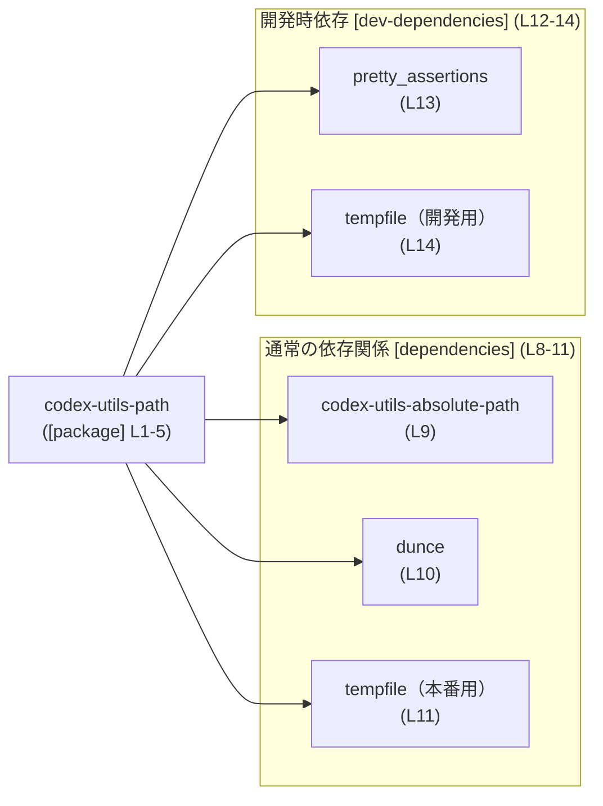
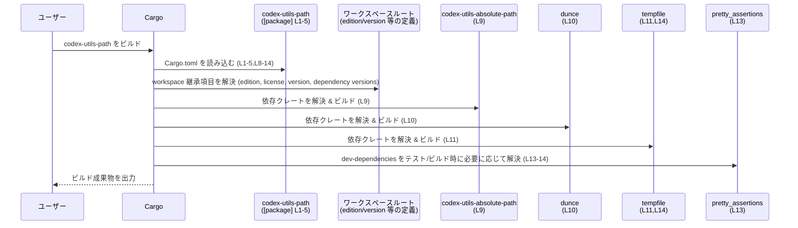

# utils/path-utils/Cargo.toml コード解説

## 0. ざっくり一言

- `codex-utils-path` クレートの Cargo マニフェストであり、パッケージ名などの基本情報と、ワークスペース共通設定・依存クレート・開発用依存クレートを定義するファイルです（`utils/path-utils/Cargo.toml:L1-5,L8-14`）。

---

## 1. このモジュール（ファイル）の役割

### 1.1 概要

- このファイルは、Rust クレート `codex-utils-path` の **パッケージメタデータ** と **依存関係** を記述する Cargo 設定ファイルです（`[package]` セクション `L1-5`）。
- `edition`, `license`, `version` などの値はワークスペースルートから **継承** する形になっており（`edition.workspace = true`, `license.workspace = true`, `version.workspace = true`、`L2-3,L5`）、このクレートが Cargo のワークスペースの一部であることが分かります。
- Lint 設定も `workspace = true` によってワークスペース共通設定を利用する構成になっています（`[lints]` セクション `L6-7`）。
- ランタイム依存として `codex-utils-absolute-path`, `dunce`, `tempfile`、開発時依存として `pretty_assertions`, `tempfile` が宣言されています（`[dependencies]` `L8-11`, `[dev-dependencies]` `L12-14`）。

> `codex-utils-path` クレートの中身（どんな関数や型を提供するか）は、この Cargo.toml からは分かりません。

### 1.2 アーキテクチャ内での位置づけ

このファイルから読み取れるのは、**クレート間の依存関係レベルの構造**です。

- 中心となるクレート: `codex-utils-path`（`name = "codex-utils-path"`、`L4`）
- ランタイム依存:
  - `codex-utils-absolute-path`（`L9`）
  - `dunce`（`L10`）
  - `tempfile`（`L11`）
- 開発時のみの依存:
  - `pretty_assertions`（`L13`）
  - `tempfile`（`L14`）

これをクレートレベルの依存関係図として表すと、次のようになります。



- `tempfile` が `[dependencies]` と `[dev-dependencies]` の両方に現れており、本番コードとテスト・開発コードの両方で使われる構成になっています（`L11,L14`）。

### 1.3 設計上のポイント

このファイルから読み取れる設計上の特徴は次のとおりです。

- **ワークスペース中心の管理**
  - `edition`, `license`, `version` がいずれも `workspace = true` で設定されており、バージョンやライセンスなどをワークスペース単位で一元管理する方針が見えます（`L2-3,L5`）。
  - 依存クレートもすべて `{ workspace = true }` 設定で、バージョンや features をワークスペースルート側に集約しています（`L9-11,L13-14`）。
- **Lint 設定の共通化**
  - `[lints]` セクションで `workspace = true` が指定されており（`L6-7`）、コンパイル時警告・Lint ポリシーをワークスペース内で統一する構造になっています。
- **実行コードはこのファイルには存在しない**
  - このファイルは Cargo 設定のみを含み、Rust の関数・構造体・モジュール定義は一切含まれていません（`L1-14` すべてが TOML セクションとキーで構成）。

---

## 2. 主要な「コンポーネント」一覧

このファイル自体に関数や型は定義されていないため、ここでは **クレートと依存クレート** を「コンポーネント」として整理します。

### 2.1 コンポーネントインベントリー

| コンポーネント名              | 種別            | 役割（このファイルから分かる範囲）                          | 定義・記述箇所 |
|------------------------------|-----------------|------------------------------------------------------------|----------------|
| `codex-utils-path`           | クレート        | 対象クレート本体。パス関連ユーティリティである可能性はあるが、Cargo.toml からは API 不明 | `[package]` セクション（`L1-5`） |
| `codex-utils-absolute-path`  | ランタイム依存  | このクレートが依存する内部/外部クレート。機能詳細は不明    | `[dependencies]`（`L9`） |
| `dunce`                      | ランタイム依存  | このクレートが依存する外部クレート。機能詳細は不明        | `[dependencies]`（`L10`） |
| `tempfile`（本番用）         | ランタイム依存  | 本番コードで利用される依存クレート。機能詳細は不明        | `[dependencies]`（`L11`） |
| `pretty_assertions`          | 開発時依存      | テストや開発用のみに使われる依存クレート。機能詳細は不明  | `[dev-dependencies]`（`L13`） |
| `tempfile`（開発用）         | 開発時依存      | テスト・開発コードで利用される `tempfile` 依存             | `[dev-dependencies]`（`L14`） |

> これら依存クレートが具体的にどんな API を提供しているか、また `codex-utils-path` がそれらをどう使うかは、この Cargo.toml だけからは分かりません。

### 2.2 このファイルから分かる「機能」

Cargo.toml として提供する「機能」は次のように整理できます。

- ワークスペース共通の
  - `edition` 設定（`L2`）
  - `license` 設定（`L3`）
  - `version` 設定（`L5`）
- ワークスペース共通の lint 設定の利用（`[lints]` セクション `L6-7`）
- ランタイム依存クレートの宣言（`[dependencies]` セクション `L8-11`）
- 開発時依存クレートの宣言（`[dev-dependencies]` セクション `L12-14`）

---

## 3. 公開 API と詳細解説

このファイルには Rust コードが含まれておらず、**関数・構造体・列挙体などの API 定義は確認できません**。

### 3.1 型一覧（構造体・列挙体など）

- 該当なし  
  - `utils/path-utils/Cargo.toml` には Rust の型定義は一切現れません（`L1-14` のいずれも TOML セクション／キーであるため）。

### 3.2 関数詳細（最大 7 件）

- このファイルには関数定義が存在しないため、**詳細解説の対象となる関数はありません**。
- `codex-utils-path` クレートがどのような関数・メソッドを公開しているかは、`src/` 配下の Rust ファイル（このチャンクには含まれない）を確認する必要があります。

### 3.3 その他の関数

- 該当なし

---

## 4. データフロー（依存解決の流れ）

実行時の「データフロー」はこのファイルからは分かりませんが、Cargo のビルド時の挙動として、**依存解決の流れ**を概念的なシーケンス図として示します。



- 上記は Cargo の一般的な挙動を整理したものであり、**実行時の関数呼び出しやデータ構造の流れは、このチャンクからは把握できません**。

---

## 5. 使い方（How to Use）

このセクションでは、**Cargo.toml としての使い方**を中心に説明します。`codex-utils-path` クレートの具体的な API 例は、このチャンクだけでは示せません。

### 5.1 基本的な利用方法（他クレートからの依存）

別のクレートから `codex-utils-path` を利用する場合の、典型的な `Cargo.toml` の記述例です。

```toml
[dependencies]
# crates.io などから取得する場合の例
codex-utils-path = "x.y.z" # 実際のバージョンはワークスペースや crates.io を参照

# 同一ワークスペース内の別クレートから参照する場合の一例
# codex-utils-path = { path = "utils/path-utils" }
```

- 実際のバージョン番号 `x.y.z` は、この Cargo.toml では `version.workspace = true` によりワークスペースルート側で定義されており（`L5`）、このチャンクからは値を特定できません。

Rust コード側では、クレート名を `use` して API を呼び出すことになりますが、どのシンボルが存在するかは不明です。

```rust
// 実際にどのモジュール・関数が存在するかは、このチャンクからは分かりません。
use codex_utils_path; // または use codex_utils_path::some_module;

fn main() {
    // codex_utils_path クレートの提供する API をここで利用する想定
}
```

### 5.2 依存関係の追加・変更

この `Cargo.toml` を編集して新しい依存を追加する、あるいは既存依存の扱いを変える場合の基本パターンです。

- **ランタイム依存を追加**する場合
  - `[dependencies]` セクション（`L8-11`）に新しいエントリを追加します。
  - ワークスペース全体で同じ依存を共有したい場合は、他と同様に `{ workspace = true }` を使います。

  ```toml
  [dependencies]
  codex-utils-absolute-path = { workspace = true }  # 既存 (L9)
  dunce = { workspace = true }                      # 既存 (L10)
  tempfile = { workspace = true }                   # 既存 (L11)
  new-crate = { workspace = true }                  # 追加の例
  ```

- **開発専用の依存**（テスト・ベンチマーク・例など）の場合
  - `[dev-dependencies]` セクション（`L12-14`）に追加します。

  ```toml
  [dev-dependencies]
  pretty_assertions = { workspace = true }  # 既存 (L13)
  tempfile = { workspace = true }           # 既存 (L14)
  new-dev-tool = { workspace = true }       # 開発時のみ使うツールの例
  ```

### 5.3 よくある間違い（この構成から想定される点）

一般的な Cargo プロジェクトにおける誤用例と、このファイルとの関係で注意すべき点です。

```toml
# 誤りの例: 同じ依存を workspace 継承とローカル指定で重複定義
[dependencies]
tempfile = { workspace = true }
tempfile = "3.9" # 同じキーを再度定義してしまう → TOML として無効
```

```toml
# 正しい例: どちらか一方に統一する
[dependencies]
tempfile = { workspace = true } # もしくは明示バージョンの片方だけにする
```

- `utils/path-utils/Cargo.toml` では、各依存は 1 回ずつしか定義されておらず、このような重複はありません（`L9-11,L13-14`）。

### 5.4 使用上の注意点（まとめ）

- **実行ロジックは含まれない**
  - このファイルを変更しても、直接的に関数の挙動は変わらず、「どの依存が使えるか」「どのバージョンか」が変わるだけです（`L1-14`）。
- **ワークスペース依存**
  - `edition.workspace = true` など workspace 継承を多用しているため（`L2-3,L5,L9-11,L13-14`）、設定の実体はワークスペースルート `Cargo.toml` にあります。ルート側との整合性が重要です。
- **バグ・セキュリティ観点**
  - このファイル自体には実行可能なロジックがないため、直接的なバグやメモリ安全性問題は発生しません。
  - ただし、依存クレートのバージョンや features の選択はセキュリティやバグの有無に影響し得るため、その管理はワークスペースルート側を含めて慎重に行う必要があります（バージョンはこのチャンクでは不明）。

---

## 6. 変更の仕方（How to Modify）

### 6.1 新しい機能を追加する場合（依存追加を伴うケース）

クレートに新しい機能を実装する際、追加の外部クレートに依存する場合の変更手順です。

1. **依存の種類を決める**
   - 本番コードから利用するなら `[dependencies]`（`L8-11`）。
   - テスト・ベンチマーク・例のみで使うなら `[dev-dependencies]`（`L12-14`）。

2. **ワークスペースと整合させる**
   - ワークスペース全体で同じ依存を共有する方針なら、ワークスペースルートの `Cargo.toml` にその依存を追加し、各クレートでは `{ workspace = true }` を指定します（このファイルの他の依存と同じパターン、`L9-11,L13-14`）。
   - 個別バージョンを使いたい場合は、`{ workspace = true }` ではなく、明示バージョンを書きます（ただし、この方針はこのチャンクでは採用されていません）。

3. **ソースコード側から利用**
   - 実際の Rust コード中で `use` し、新機能の実装に利用しますが、Rust 側のファイルはこのチャンクには含まれていません。

### 6.2 既存の機能を変更する場合（設定変更）

- **edition / license / version を変更したい場合**
  - このファイルではこれらはすべて `workspace = true` であり（`L2-3,L5`）、値はワークスペースルートにあります。  
    → 変更はルート `Cargo.toml` 側で行う必要があります。
- **lint ポリシーを変更したい場合**
  - `[lints]` セクションも `workspace = true` のみを指定しているため（`L6-7`）、詳細設定はワークスペースルート側を確認・変更します。
- **依存関係を切り替えたい場合**
  - たとえば `tempfile` を使わなくなった場合、 `[dependencies]` と `[dev-dependencies]` から該当行を削除する必要があります（`L11,L14`）。
  - 依存を削除する際は、ソースコードからそのクレートを参照していないかを合わせて確認する必要があります（ソースコードはこのチャンクには含まれません）。

---

## 7. 関連ファイル

この Cargo.toml と密接に関係するファイル・ディレクトリを、**このチャンクから分かる範囲**で整理します。

| パス / 場所                          | 役割 / 関係 |
|-------------------------------------|------------|
| ワークスペースルートの `Cargo.toml` | `edition.workspace = true`, `license.workspace = true`, `version.workspace = true`, 各依存 `{ workspace = true }` などの実体設定が存在するファイルです（`L2-3,L5,L9-11,L13-14`）。このチャンクには内容は含まれません。 |
| `utils/path-utils/` ディレクトリ    | この `Cargo.toml` が置かれているディレクトリであり、`codex-utils-path` クレートのルートディレクトリになります（ファイルパス情報より）。Rust ソースコード（例: `src/lib.rs` など）はこのチャンクには含まれていません。 |
| `utils/path-utils/src/...`          | 実際の公開 API やコアロジックが実装されていると推定される場所ですが、このチャンクにはファイル内容が含まれておらず、詳細は不明です。 |

> まとめると、このファイルは **クレートの構成と依存関係を定義するメタ情報**のみを提供しており、公開 API やコアロジックの内容は、別途ソースコードファイルを確認する必要があります。
