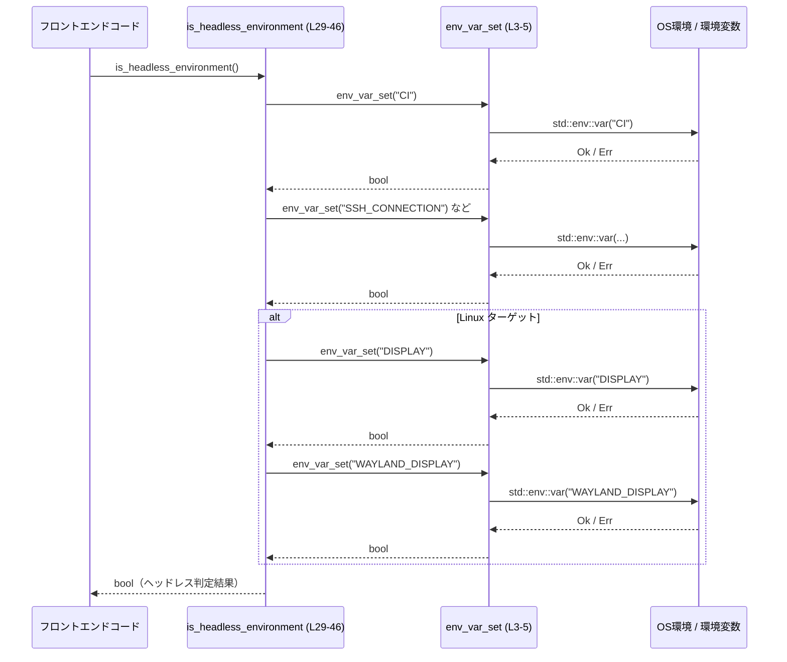

# utils/path-utils/src/env.rs

## 0. ざっくり一言

環境変数と `/proc` 情報を使って、  
「WSL（Windows Subsystem for Linux）上で動いているか」と「GUI が使えない（ヘッドレス）環境か」を判定するユーティリティ関数を提供するモジュールです。  
（根拠: utils/path-utils/src/env.rs:L1-2, L7-8, L25-29）

---

## 1. このモジュールの役割

### 1.1 概要

- このモジュールは **プロセスがどのような環境で実行されているか** を簡単に判定するために存在し、以下の機能を提供します。
  - Linux 上で実行されているプロセスが WSL 上かどうかの判定（`is_wsl`）  
    （根拠: L7-8）
  - CI / SSH / DISPLAY 変数などを使った、GUI が使えなさそうな「ヘッドレス環境」の判定（`is_headless_environment`）  
    （根拠: L25-29, L30-41）

### 1.2 アーキテクチャ内での位置づけ

- **呼び出し側**:
  - コメントより、Codex のフロントエンドが「ブラウザを開こうとするフローを避ける」ために `is_headless_environment` を利用していることが読み取れます。  
    （根拠: L25-28）
  - `is_wsl` は WSL 特有の挙動分岐などに使われることが想定されますが、呼び出し元はこのチャンクには現れません。

- **依存先**:
  - 標準ライブラリ `std::env` を用いた環境変数参照（`env_var_set`, `is_wsl`）  
    （根拠: L3-4, L11）
  - 標準ライブラリ `std::fs` を用いた `/proc/version` 読み取り（`is_wsl`、Linux のみ）  
    （根拠: L14-16）

- **内部構造**:
  - 非公開ヘルパー関数 `env_var_set` が環境変数の「非空チェック」を共通化し、公開関数がそれを利用する構造です。  
    （根拠: L3-5, L30-33, L40）

```mermaid
graph TD
  A["他クレート / フロントエンド（推定・このチャンクには未登場）"]
  B["env::is_headless_environment (L29-46)"]
  C["env::is_wsl (L8-23)"]
  D["env::env_var_set (L3-5)"]
  E["std::env::var / var_os"]
  F["std::fs::read_to_string(\"/proc/version\")"]

  A --> B
  A --> C
  B --> D
  D --> E
  C --> E
  C --> F
```

### 1.3 設計上のポイント

- **ステートレスな設計**  
  - いずれの関数も内部状態を持たず、毎回環境変数やファイルを読み取って判定します。  
    （根拠: 全関数が引数とローカル変数のみを使用していること: L3-5, L8-23, L29-46）

- **条件付きコンパイル（`#[cfg]`）による OS ごとの分岐**  
  - `is_wsl` は Linux ターゲットとそれ以外で完全に別の実装（Linux 以外は常に `false`）。  
    （根拠: L9-10, L18-22）
  - `is_headless_environment` は DISPLAY / WAYLAND_DISPLAY のチェックを Linux のみで行います。  
    （根拠: L38-43）

- **保守的（conservative）な判定ポリシー**  
  - `is_headless_environment` のドキュコメントに「intentionally conservative」とあり、「GUI ありでもヘッドレスと判定される可能性がある」側に倒す設計であると分かります。  
    （根拠: L25-28）

- **エラー耐性**  
  - 環境変数未設定・非 Unicode、および `/proc/version` 読み取り失敗はすべて「その条件には当てはまらない」と解釈して `false` に寄せています。  
    （根拠: L3-4 の `is_ok_and`, L14-16 の `Err(_) => false`）

---

## 2. 主要な機能一覧（コンポーネントインベントリー）

このファイルに定義されている関数の一覧です（行番号は本チャンク内の相対位置）。

| 名前 | 公開 | 役割 / 用途 | 定義位置（根拠） |
|------|------|-------------|------------------|
| `env_var_set` | 非公開 | 環境変数が「設定されており、トリム後も空文字列でない」かを判定するヘルパー関数 | `utils/path-utils/src/env.rs:L3-5` |
| `is_wsl` | 公開 | プロセスが WSL 上で実行されているかを判定する | `utils/path-utils/src/env.rs:L8-23` |
| `is_headless_environment` | 公開 | GUI が使えない／使うべきでない環境（ヘッドレス）かをヒューリスティックに判定する | `utils/path-utils/src/env.rs:L29-46` |

---

## 3. 公開 API と詳細解説

### 3.1 型一覧（構造体・列挙体など）

このファイルには構造体や列挙体などの型定義はありません。  
（根拠: チャンク全体が関数定義のみで構成されている: L1-46）

---

### 3.2 関数詳細

#### `env_var_set(key: &str) -> bool`

**概要**

- 指定した環境変数が「存在し」かつ「トリム後に空文字列でない」場合に `true` を返すユーティリティ関数です。  
  （根拠: L3-4）

**引数**

| 引数名 | 型 | 説明 |
|--------|----|------|
| `key`  | `&str` | 調べたい環境変数の名前（例: `"CI"`, `"DISPLAY"`） |

**戻り値**

- `bool`:
  - `true`: 環境変数が設定されており、値をトリムした結果が空文字列ではない。
  - `false`: 環境変数が未設定、値が非 Unicode（`VarError`）、またはトリム後に空文字列。  
    （根拠: L3-4, `is_ok_and(|v| !v.trim().is_empty())`）

**内部処理の流れ**

1. `std::env::var(key)` で環境変数を `Result<String, VarError>` として取得する。  
2. `Result::is_ok_and` を用いて、取得に成功した (`Ok`) 場合のみ `v.trim().is_empty()` が `false` かを確認し、その結果を返す。  
3. 取得に失敗した (`Err`) 場合は `false` を返す。  
   （根拠: L3-4）

**Examples（使用例）**

```rust
// CI 環境変数が非空で設定されているかを判定する例
fn main() {
    if utils::path_utils::env::env_var_set("CI") {       // "CI" が設定されており空でなければ true
        println!("CI 環境で動作しています");
    } else {
        println!("ローカル環境の可能性が高いです");
    }
}
```

> 注: 実際には `env_var_set` は非公開のため、このように直接呼び出すことはできません。  
> 上記は関数の挙動イメージを示す擬似例です。  
> （非公開であることの根拠: 関数に `pub` が付いていない: L3）

**Errors / Panics**

- `std::env::var` が返す `Err(VarError)` を `is_ok_and` により `false` として扱うため、エラーは呼び出し元には伝播せず、パニックも発生しません。  
  （根拠: L3-4）

**Edge cases（エッジケース）**

- 環境変数が存在しない場合: `false` を返す。  
- 環境変数値が空文字列または空白のみの場合（例: `"   "`）: `trim()` により空文字列とみなされ、`false` を返す。  
  （根拠: L4 の `!v.trim().is_empty()`）
- 環境変数値が非 Unicode（バイト列が UTF-8 でない）場合: `std::env::var` が `Err(VarError::NotUnicode)` を返し、`false`。  

**使用上の注意点**

- 「環境変数が設定されているかどうか」を判定するだけでなく、「空文字列は無視する」ポリシーになっています。空文字列も有効値として扱いたい場合には合わない可能性があります。
- 非公開関数のため、外部クレートから直接利用することはできません。公開 API である `is_headless_environment` などを通じて間接的に利用されます。

---

#### `pub fn is_wsl() -> bool`

**概要**

- 現在のプロセスが **Windows Subsystem for Linux (WSL)** 上で実行されていると推定される場合に `true` を返します。  
  （根拠: ドキュコメント L7, 関数定義 L8）

- Linux ターゲット以外（macOS, Windows ネイティブなど）では、常に `false` を返します。  
  （根拠: L19-22）

**引数**

- なし。

**戻り値**

- `bool`:
  - `true`: WSL 上で実行されていると推定される。
  - `false`: WSL ではない、または判定に必要な情報が得られない。

**内部処理の流れ（Linux ターゲットの場合）**

```mermaid
flowchart TD
  A["is_wsl (L8-23)"] --> B{"target_os == \"linux\" ?"}
  B -- いいえ --> G["false を返す（L19-22）"]
  B -- はい --> C["環境変数 WSL_DISTRO_NAME を取得（L11）"]
  C --> D{"WSL_DISTRO_NAME が Some ?"}
  D -- はい --> E["true を返す（L11-12）"]
  D -- いいえ --> F["/proc/version を read_to_string（L14）"]
  F --> H{"読み取り成功？"}
  H -- はい --> I["文字列を小文字化して \"microsoft\" を含むか確認（L15）"]
  H -- いいえ --> J["false を返す（L16）"]
```

1. `#[cfg(target_os = "linux")]` ブロックが有効な場合のみ、Linux 向けのロジックがコンパイルされる。  
   （根拠: L9-10）
2. まず `std::env::var_os("WSL_DISTRO_NAME")` を読み取り、`Some` であれば `true` を返す。  
   （根拠: L11-12）
3. それ以外の場合、`std::fs::read_to_string("/proc/version")` を実行する。  
   - `Ok(version)` のとき: `version.to_lowercase().contains("microsoft")` の結果を返す。  
     （根拠: L14-15）
   - `Err(_)` のとき: `false` を返す。  
     （根拠: L14-16）

**内部処理の流れ（Linux 以外のターゲット）**

- `#[cfg(not(target_os = "linux"))]` ブロックが有効になり、単に `false` を返します。  
  （根拠: L19-22）

**Examples（使用例）**

```rust
// WSL 上かどうかによってメッセージを変える例
fn main() {
    if utils::path_utils::env::is_wsl() {               // WSL 上なら true
        println!("WSL 上で実行されています");
    } else {
        println!("WSL ではありません");
    }
}
```

**Errors / Panics**

- 環境変数取得（`var_os`）は `Option` を返すだけで、パニックしません。  
  （根拠: L11）
- `/proc/version` の読み取りエラーは `Err(_) => false` として処理し、呼び出し元に `Result` を返しません。  
  （根拠: L14-16）
- 直接 `panic!` を呼び出している箇所はありません。  
  （根拠: L8-23 内に panic 実装が存在しない）

**Edge cases（エッジケース）**

- `/proc/version` が存在しない／読み取れない場合（コンテナ環境など）:
  - `Err(_) => false` により `false` を返す。  
    （根拠: L14-16）
- `WSL_DISTRO_NAME` が手動で設定されている（WSL でない環境）:
  - 環境変数だけで `true` と判定されるため、誤検知の可能性があります。
- `/proc/version` に `"microsoft"` を含む別の環境（将来の特殊なカーネルなど）:
  - `true` と判定される可能性があります。

**使用上の注意点**

- **ヒューリスティックであり、完全な判定ではない**  
  - WSL を判定するための手がかりとして環境変数と `/proc/version` の内容を使っているだけなので、悪意あるユーザが環境変数や `/proc` を操作できる場合、この判定結果は信用できません。  
  - セキュリティ上の境界（アクセス制御など）に用いるべきではありません。
- **ターゲット OS に依存**  
  - Linux ターゲット以外では常に `false` になるため、「WSL かどうか」ではなく「Linux 上の WSL かどうか」を判定します。
- **並行性**  
  - 共有状態は持たないため、複数スレッドから同時に呼び出してもロジック上の競合はありません。ただし、プロセス環境変数が他スレッドから動的に変更されると結果が変わる可能性があります（一般に環境変数は不変とみなすのが無難です）。

---

#### `pub fn is_headless_environment() -> bool`

**概要**

- Codex が **ブラウザを開くようなフロー** を避けるべき環境（GUI が利用できない or 避けるべき）かどうかを、いくつかの環境変数と Linux ディスプレイ環境の有無からヒューリスティックに判定します。  
  （根拠: ドキュコメント L25-28, 本体 L29-46）

**引数**

- なし。

**戻り値**

- `bool`:
  - `true`: 「ヘッドレス環境」である可能性が高い。
  - `false`: GUI が使える／使ってもよい可能性がある（ただし保証ではない）。

**内部処理の流れ**

```mermaid
flowchart TD
  A["is_headless_environment (L29-46)"] --> B["CI / SSH_* 変数チェック（L30-36）"]
  B --> C{"いずれかが true ?"}
  C -- はい --> D["true を返す（L35）"]
  C -- いいえ --> E{"target_os == \"linux\" ?（L38）"}
  E -- いいえ --> G["false を返す（L45）"]
  E -- はい --> F["DISPLAY / WAYLAND_DISPLAY 未設定チェック（L40）"]
  F --> H{"両方 unset or 空 ?"}
  H -- はい --> I["true を返す（L40-41）"]
  H -- いいえ --> G["false を返す（L45）"]
```

1. まず、以下の環境変数がいずれか「設定されていて非空か」を `env_var_set` で確認し、いずれかが `true` なら即座に `true` を返す。  
   （根拠: L30-36）
   - `"CI"`
   - `"SSH_CONNECTION"`
   - `"SSH_CLIENT"`
   - `"SSH_TTY"`
2. 上記に当てはまらない場合、Linux ターゲットのみ以下を追加で確認する。  
   （根拠: L38-39）
   - `"DISPLAY"` と `"WAYLAND_DISPLAY"` の両方が「設定されておらず、または空」であれば `true` を返す。  
     （根拠: L40-41）
3. 上記のいずれにも当てはまらない場合は `false` を返す。  
   （根拠: L45）

**Examples（使用例）**

```rust
// ヘッドレス環境ではブラウザを開かず、代わりに CLI ベースのフローに切り替える例
fn main() {
    if utils::path_utils::env::is_headless_environment() {  // ヘッドレスと判定された場合
        println!("ヘッドレス環境として処理します（ブラウザは開きません）");
        // 例: デバイスコード認証などの CLI フローを実行
    } else {
        println!("ブラウザを開くフローを使用します");
        // 例: ブラウザベースの OAuth 認証フローを実行
    }
}
```

**Errors / Panics**

- 内部で呼び出す `env_var_set` は環境変数読み取りエラーを `false` として扱うため、エラーは外に出ません。  
  （根拠: L3-4, L30-33, L40）
- Linux での部分も、`env_var_set` しか呼び出さないためファイル I/O などは行わず、直接的なパニック要因はありません。  
  （根拠: L38-43）

**Edge cases（エッジケース）**

- CI 変数が空文字列の場合:  
  - `env_var_set("CI")` は `false` となり、CI 環境とはみなさない。  
    （根拠: L3-4, L30）
- SSH_* 変数が設定されていないが、実際には SSH 経由のターミナルの場合:
  - `false` になる可能性があり、誤検知（false negative）となる。
- Linux で DISPLAY / WAYLAND_DISPLAY がどちらも設定されていないが、実際には別の手段で GUI が利用できる場合:
  - `true`（ヘッドレス）と判定されるため、GUI を利用しない動作に切り替わる。
- Linux 以外の OS で「DISPLAY がない」状況（例: Windows Server コア）:
  - DISPLAY / WAYLAND_DISPLAY はチェックされず、CI / SSH_* がなければ `false` となる。  

**使用上の注意点**

- **保守的な判定（false positive を許容）**  
  - コメントにある通り「intentionally conservative」であり、「本当は GUI が使えるのにヘッドレスと判定される」ケースを許容する設計です。  
    （根拠: L25-28）
  - そのため、「ヘッドレスなら絶対に GUI を使ってはいけない」ような厳密な制御ではなく、「なるべくブラウザを開かないようにする」程度の用途に向いています。
- **セキュリティ上の利用には不向き**  
  - CI / SSH / DISPLAY などの環境変数はユーザが自由に設定できるため、この判定結果をアクセス制御などの安全保障の根拠にするべきではありません。
- **環境変数の変更に影響される**  
  - プロセス起動後に環境変数を変更すると、呼び出すタイミングによって結果が変化する可能性があります。一般には「起動後に環境変数を変えない」前提で使うのが自然です。
- **並行性**  
  - ステートレスであり、複数スレッドから安全に呼び出せます（Rust のメモリ安全性の観点）。  
  - ただし OS レベルでは「環境変数はプロセス全体で共有される」ため、他スレッドが同時に `set_var` するような設計は避けるのが無難です。

---

### 3.3 その他の関数

- このファイルには、上記 3 関数以外の関数は定義されていません。  
  （根拠: L1-46 を通して関数定義が 3 つのみ）

---

## 4. データフロー

ここでは、`is_headless_environment` が呼び出されたときの代表的なデータフローを示します。

### シナリオ: フロントエンドからのヘッドレス判定

1. フロントエンドコードが `is_headless_environment()` を呼び出す。
2. `is_headless_environment` が `env_var_set` を複数回呼び出し、CI / SSH 関連の環境変数をチェックする。  
   （根拠: L30-33）
3. Linux でかつ CI / SSH のチェックでヘッドレスでないと判断された場合、DISPLAY / WAYLAND_DISPLAY をチェックする。  
   （根拠: L38-41）
4. 判定結果の `bool` が呼び出し元に返り、それに基づいてブラウザを開くかどうかを決定する。



---

## 5. 使い方（How to Use）

### 5.1 基本的な使用方法

典型的な利用フローは以下のようになります。

```rust
use utils::path_utils::env::{is_headless_environment, is_wsl};

fn main() {
    // 1. 実行環境の情報を取得する
    let headless = is_headless_environment();            // GUI が使えない／使わない方がよい環境か
    let running_on_wsl = is_wsl();                       // WSL 上かどうか

    // 2. 判定結果に応じて分岐する
    if headless {
        eprintln!("ヘッドレス環境と判定されたため、ブラウザを開くフローは避けます");
        // 例: CLI ベースの認証や設定フロー
    } else {
        println!("GUI を利用するフローを使用します");
        // 例: ブラウザを開いて OAuth 認証
    }

    if running_on_wsl {
        println!("WSL の既知の制約に応じて、パス処理やファイル I/O を調整します");
        // 例: Windows パスとの相互運用のための特殊処理
    }
}
```

### 5.2 よくある使用パターン

- **ブラウザベース認証と CLI ベース認証の切り替え**
  - `is_headless_environment()` の結果に応じて「ブラウザを開く」か「デバイスコード認証などの CLI フロー」に切り替える。  
    （根拠: ドキュコメントに "avoid flows that would try to open a browser" とある: L25-28）

- **WSL 向けの特殊ハンドリング**
  - `is_wsl()` が `true` の場合にのみ、ファイルパスやファイルシステムへのアクセス方法を変える、といったパターンが考えられます（このチャンクには具体的な使用例は現れません）。

### 5.3 よくある間違い（起こりうる誤用）

```rust
// 誤り例: is_wsl の結果だけで Linux / 非 Linux を判定しようとしている
if is_wsl() {
    println!("Linux 環境です");   // 誤り: is_wsl が false でも Linux の可能性はある
}

// 正しい例: is_wsl は「WSL かどうか」のヒントとしてのみ使う
if is_wsl() {
    println!("WSL 上で実行されています");
} else {
    println!("WSL ではありません（ネイティブ Linux や他 OS の可能性があります）");
}
```

```rust
// 誤り例: is_headless_environment が false だから必ず GUI があると決めつける
if !is_headless_environment() {
    // GUI がない環境でもここに来る可能性がある
    open_browser();  // 失敗するかもしれない
}

// より安全な例: 失敗時を考慮したハンドリングを用意する
if !is_headless_environment() {
    if let Err(e) = open_browser() {
        eprintln!("ブラウザ起動に失敗しました: {e}, CLI フローにフォールバックします");
        run_cli_flow();
    }
} else {
    run_cli_flow();
}
```

### 5.4 使用上の注意点（まとめ）

- 判定はすべて **ヒューリスティック** であり、「絶対に GUI がある／ない」「絶対に WSL である／ない」といった保証を与えるものではありません。
- セキュリティ目的（認証・認可）の判断材料として使うべきではなく、主に UX のための分岐に使用するのが適しています。
- 全関数は環境変数や `/proc/version` を毎回読み取るため、極端に高頻度のループ内で何度も呼ぶよりは、1 度だけ呼んで結果をキャッシュする設計が望ましいケースがあります。

---

## 6. 変更の仕方（How to Modify）

### 6.1 新しい機能を追加する場合

たとえば「CI 環境かどうか」を明示的に判定する `is_ci_environment` を追加する場合を考えます。

1. **このファイルに新しい関数を追加する**
   - `env_var_set("CI")` を活用して、`pub fn is_ci_environment() -> bool` のような関数を定義するのが自然です。  
     （根拠: 既存コードが CI 判定に `env_var_set("CI")` を使っている: L30）
2. **既存ロジックとの整合性を確認する**
   - `is_headless_environment` も CI 変数を参照しているため、「CI = ヘッドレスである」という前提を共有するかどうかを確認する必要があります。
3. **条件付きコンパイルの要否を検討する**
   - OS に依存する判定を追加する場合は、`is_wsl` や `is_headless_environment` と同様に `#[cfg]` を利用します。  
     （根拠: L9-10, L19-22, L38-39）

### 6.2 既存の機能を変更する場合

- **`is_headless_environment` の判定条件を変えるとき**
  - 影響範囲:
    - Codex のフロントエンドなど、ヘッドレス判定に依存するすべての UI フロー。  
      （呼び出し元はこのチャンクには現れませんが、コメントからフロントエンドが利用することが示唆されています: L25-28）
  - 注意点:
    - 「保守的な判定」という前提（ヘッドレス寄りの判定）を変えるかどうかを明確にする。
    - 既存の環境（CI/CD、SSH、X11/Wayland なしの Linux）での挙動が変わらないか、あるいは意図した方向に変わるかどうかをテストする。

- **`is_wsl` の検出ロジックを変えるとき**
  - `/proc/version` の内容や `WSL_DISTRO_NAME` の扱いを変更すると、WSL の特定バージョン・ディストリビューションでの挙動が変わりうるため、実環境での検証が必要です。
  - 誤検知（WSL でない環境を WSL と判定）と見逃し（WSL を WSL と判定できない）のトレードオフを意識する必要があります。

- **テスト観点（推奨）**
  - このチャンクにはテストコードは含まれていませんが、変更時には以下のような単体テストが有用です。
    - 環境変数をモックまたは一時的に設定して `is_headless_environment` の結果を確認する。
    - Linux 向けに `/proc/version` の内容をスタブ化できるように抽象化してから `is_wsl` をテストする（現状のコードだけでは直接テストしづらい構造です）。

---

## 7. 関連ファイル

このチャンクには、他のモジュールやファイルとの具体的な関連は書かれていません。

| パス | 役割 / 関係 |
|------|------------|
| （不明） | このファイルを再エクスポートする `lib.rs` や、実際に `is_wsl` / `is_headless_environment` を呼び出しているフロントエンドコードは、このチャンクには現れません。 |

> 以上は、`utils/path-utils/src/env.rs` のコード内容（L1-46）から読み取れる範囲の解説です。
