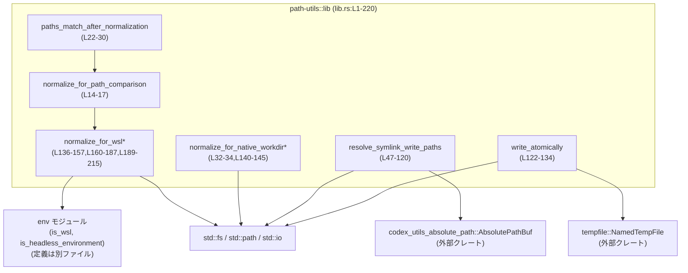
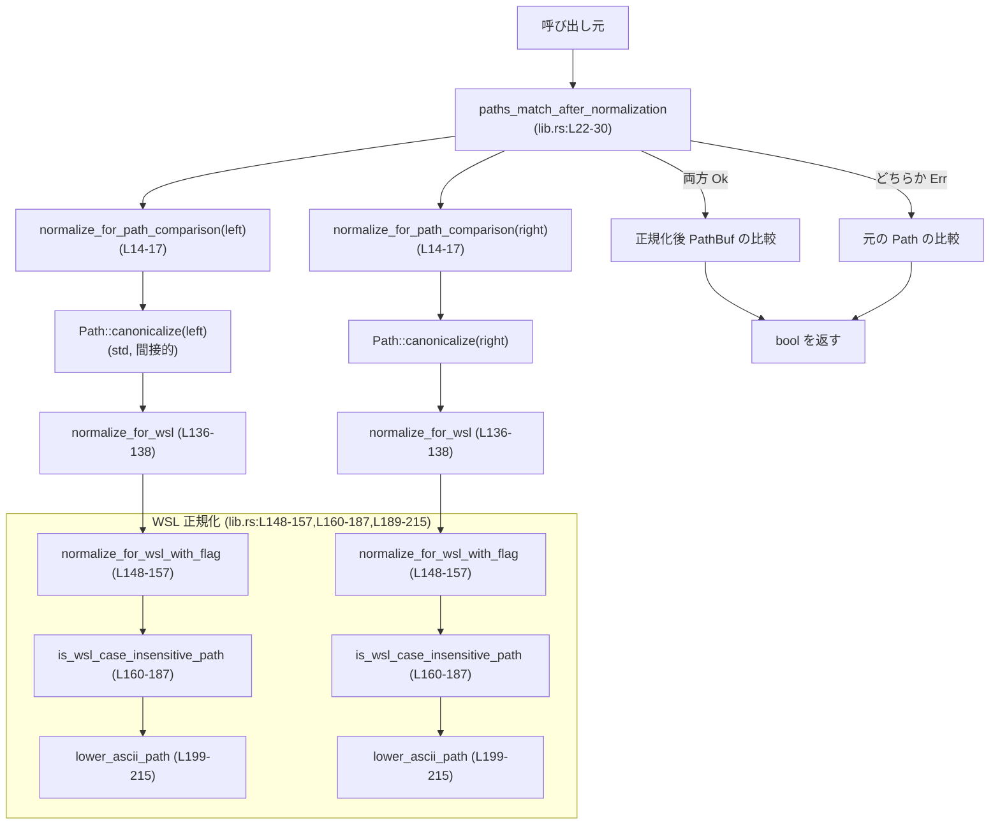

# utils/path-utils/src/lib.rs コード解説

## 0. ざっくり一言

Codex クレート群で共通利用する **パス正規化（WSL/Windows対応）・シンボリックリンク解決・アトミック書き込み** のユーティリティを提供するモジュールです（`lib.rs:L1-12`）。

---

## 1. このモジュールの役割

### 1.1 概要

このモジュールは **ファイルパス比較やファイル書き込みを、OS や WSL の違いを吸収しつつ安全に行う** ために存在し、次の機能を提供します。

- パス比較用の正規化（特に WSL 上の `/mnt/<drive>` を Windows と同等に扱う）  
  （`normalize_for_path_comparison`, `normalize_for_wsl*` 系、`lib.rs:L14-17,L136-157,L160-187,L189-215`）
- 正規化後にパス同士を比較するヘルパー  
  （`paths_match_after_normalization`, `lib.rs:L22-30`）
- ネイティブ環境（特に Windows）のワークディレクトリ向けパス正規化  
  （`normalize_for_native_workdir`, `lib.rs:L32-34,L140-145`）
- シンボリックリンクチェーンを解決しつつ、「読むパス」と「書くパス」を安全に決める  
  （`SymlinkWritePaths`, `resolve_symlink_write_paths`, `lib.rs:L36-39,L47-120`）
- 一時ファイルと rename を使ったアトミックなファイル書き込み  
  （`write_atomically`, `lib.rs:L122-134`）

### 1.2 アーキテクチャ内での位置づけ

このモジュールは他の Codex クレートから呼び出される **ユーティリティクレート** であり、自身は以下の依存先を利用します。

- 内部モジュール `env`（WSL やヘッドレス環境の判定）`lib.rs:L3-5,136-138`
- 外部クレート `codex_utils_absolute_path::AbsolutePathBuf`（絶対パスのラッパー）`lib.rs:L7,L48-50,L97-101`
- 外部クレート `tempfile::NamedTempFile`（一時ファイルと永続化）`lib.rs:L12,L130-132`
- 標準ライブラリ `std::fs`, `std::path`, `std::io` など（ファイルシステム操作／パス型）`lib.rs:L8-11,L56-70,L87-100,L122-133`

代表的な依存関係は次のようになります。



### 1.3 設計上のポイント

コードから読み取れる設計上の特徴は次のとおりです。

- **純粋な関数ユーティリティ + 小さなデータ構造**  
  - 状態を持つグローバル変数や構造体インスタンスはありません。  
    すべての関数は引数のみを入力として取り、副作用はファイルシステムへの IO に限られます（`lib.rs:L14-120,L122-157`）。
- **エラーハンドリングは `Result` / フォールバック優先**  
  - 正規化に失敗した場合でも、`paths_match_after_normalization` は「エラーを返す」のではなく「非正規化での比較にフォールバック」します（`lib.rs:L22-30`）。
  - シンボリックリンク解決でも、失敗時は `read_path: None` にしつつ「書き込みパス」は安全側に確保する設計になっています（`lib.rs:L47-120`）。
- **OS/環境ごとの挙動をフラグや `cfg` で切り替え**  
  - `cfg!(windows)` で Windows のみ `dunce::simplified` を適用（`lib.rs:L32-34,L140-145`）。
  - `#[cfg(target_os = "linux")]` で Linux のみ WSL 判定用のバイト列処理を有効化（`lib.rs:L160-181,L189-211`）。
  - WSL かどうかは外部の `env::is_wsl()` に委譲し、テストや環境依存ロジックを分離しています（`lib.rs:L136-138`）。
- **シンボリックリンク解決ではサイクル防止のための訪問済み集合を利用**  
  - `HashSet<PathBuf>` を使ってサイクルを検出し、無限ループを防いでいます（`lib.rs:L51-52,L79-85`）。

---

## 2. 主要な機能一覧

このモジュールが公開または実質的に提供している主な機能は次のとおりです。

- パス比較用正規化: `normalize_for_path_comparison` で `canonicalize`＋WSL 正規化を行う（`lib.rs:L14-17`）
- 正規化込みのパス比較: `paths_match_after_normalization` で「正規化後に等しいか」を判定し、失敗時は素のパス比較にフォールバック（`lib.rs:L22-30`）
- ネイティブワークディレクトリ向け正規化: `normalize_for_native_workdir` で Windows では冗長な要素を取り除いたパスに整形（`lib.rs:L32-34,L140-145`）
- シンボリックリンクの解決と安全な書き込みパス決定: `resolve_symlink_write_paths` と `SymlinkWritePaths` で、読み取りパスと書き込みパスを分離して管理（`lib.rs:L36-39,L47-120`）
- アトミックなファイル書き込み: `write_atomically` で一時ファイル＋rename を用いたアトミック更新（`lib.rs:L122-134`）
- WSL の大文字小文字無視パスの検出と正規化: `/mnt/<drive>` 配下パスを ASCII 小文字化して比較しやすくする内部ヘルパー群（`normalize_for_wsl*`, `is_wsl_case_insensitive_path`, `lower_ascii_path` など、`lib.rs:L136-157,L160-187,L189-215`）

---

## 3. 公開 API と詳細解説

### 3.0 コンポーネントインベントリー（関数・構造体）

このチャンクに定義されている主なコンポーネントの一覧です。

| 名称 | 種別 | 公開範囲 | 概要 | 定義位置 |
|------|------|----------|------|----------|
| `env` | モジュール | `pub(crate)` | 環境関連ユーティリティ（WSL 判定・ヘッドレス環境判定）。実体は別ファイル。 | `lib.rs:L3` |
| `is_headless_environment` | 関数（re-export） | `pub` | `env::is_headless_environment` をそのまま公開。内容はこのチャンクには現れません。 | `lib.rs:L4` |
| `is_wsl` | 関数（re-export） | `pub` | `env::is_wsl` をそのまま公開。WSL 実行環境かどうかの判定に利用。 | `lib.rs:L5` |
| `normalize_for_path_comparison` | 関数 | `pub` | パスを `canonicalize` し、WSL 向け正規化を適用して比較に使いやすくする。 | `lib.rs:L14-17` |
| `paths_match_after_normalization` | 関数 | `pub` | 2 つのパスを Codex 独自の正規化後に比較し、失敗時は素の比較にフォールバック。 | `lib.rs:L22-30` |
| `normalize_for_native_workdir` | 関数 | `pub` | Windows の場合に `dunce::simplified` を使ってワークディレクトリ向けにパスを簡略化。 | `lib.rs:L32-34` |
| `SymlinkWritePaths` | 構造体 | `pub` | シンボリックリンク解決の結果として「読み取り用パス」と「書き込み用パス」を保持。 | `lib.rs:L36-39` |
| `resolve_symlink_write_paths` | 関数 | `pub` | シンボリックリンクを辿って最終ターゲットを解決しつつ、安全な書き込みパスを決定。 | `lib.rs:L47-120` |
| `write_atomically` | 関数 | `pub` | 一時ファイルを使って、指定パスへの内容書き込みをほぼアトミックに行う。 | `lib.rs:L122-134` |
| `normalize_for_wsl` | 関数 | `fn` | 環境判定付きで WSL 正規化を行う内部ヘルパー。 | `lib.rs:L136-138` |
| `normalize_for_native_workdir_with_flag` | 関数 | `fn` | `is_windows` フラグに基づいて Windows 向け簡略化を行う内部ヘルパー。 | `lib.rs:L140-145` |
| `normalize_for_wsl_with_flag` | 関数 | `fn` | `is_wsl` フラグに基づき、WSL の case-insensitive なパスなら ASCII 小文字化する中核ロジック。 | `lib.rs:L148-157` |
| `is_wsl_case_insensitive_path` | 関数 | `fn` | `/mnt/<drive>` 形式かどうかを判定し、WSL 上の case-insensitive パスかどうかを判断。 | `lib.rs:L160-187` |
| `ascii_eq_ignore_case` | 関数（Linuxのみ） | `fn` | 2 つのバイト列を ASCII のみ大小無視で比較。 | `lib.rs:L189-196` |
| `lower_ascii_path` (Linux版) | 関数 | `fn` | パス全体を ASCII 小文字化する（WSL case-insensitive 領域用）。 | `lib.rs:L199-211` |
| `lower_ascii_path` (非Linux版) | 関数 | `fn` | 非 Linux では何も変更せずそのまま返すダミー実装。 | `lib.rs:L213-215` |
| `tests` | モジュール | `cfg(test)` | テスト用モジュール。本体は `path_utils_tests.rs` に存在。 | `lib.rs:L218-220` |

---

### 3.1 型一覧（構造体・列挙体など）

| 名前 | 種別 | 役割 / 用途 | フィールド概要 | 定義位置 |
|------|------|-------------|----------------|----------|
| `SymlinkWritePaths` | 構造体 | シンボリックリンク解決結果として、「実際に読むべきパス」と「安全に書き込むべきパス」を分離して保持する | `read_path: Option<PathBuf>`: 読み取り対象（解決に失敗した場合は `None`） / `write_path: PathBuf`: 実際に書き込むパス | `lib.rs:L36-39` |

---

### 3.2 関数詳細（主要 API）

以下では、特に重要な関数 6 個について詳細に解説します。

#### `normalize_for_path_comparison(path: impl AsRef<Path>) -> io::Result<PathBuf>`（定義: `lib.rs:L14-17`）

**概要**

- 引数のパスを `Path::canonicalize` で正規化し、その結果に対して WSL 向けの追加正規化（大文字小文字の扱いなど）を適用した `PathBuf` を返します。
- 主に `paths_match_after_normalization` の内部で利用され、パス比較の前処理を担います。

**引数**

| 引数名 | 型 | 説明 |
|--------|----|------|
| `path` | `impl AsRef<Path>` | 比較対象となるパス。相対パス・絶対パスいずれも可。 |

**戻り値**

- `Ok(PathBuf)`:  
  - `path.as_ref().canonicalize()` による絶対パス＋実ファイルシステムに基づいた正規化を行い、それに WSL 正規化（`normalize_for_wsl`）を適用した結果（`lib.rs:L15-16`）。
- `Err(io::Error)`:  
  - `canonicalize` に失敗した場合（例えばファイルが存在しない、権限不足など）に、そのエラーをそのまま返します（`lib.rs:L15`）。

**内部処理の流れ**

1. `path.as_ref().canonicalize()?` を呼び出して `canonical` を取得  
   - ここでファイルシステムアクセスが行われます（`lib.rs:L15`）。
2. `normalize_for_wsl(canonical)` を呼び出し、WSL 向けの正規化を追加（`lib.rs:L16`）。
3. 正規化済みの `PathBuf` を `Ok(...)` で返却。

**Examples（使用例）**

```rust
use std::path::Path;
use std::io;
use crate::normalize_for_path_comparison; // 同一クレート内からの呼び出し想定

// パスを比較用に正規化してみる例
fn example_normalize() -> io::Result<()> {
    // 相対パスを渡す（存在するファイルである必要がある）
    let raw = Path::new("./data/../data/file.txt"); // 一見冗長なパス
    let normalized = normalize_for_path_comparison(raw)?; // canonicalize + WSL 正規化

    println!("normalized path = {:?}", normalized); // 絶対パスで表示される
    Ok(())
}
```

**Errors / Panics**

- エラー (`Err(io::Error)`) になるケース（代表例）：
  - パスが存在しない、または途中のディレクトリが存在しない。
  - 権限不足などで `canonicalize` が失敗した場合。
- この関数自身は、明示的に `panic!` を起こすコードを含みません。

**Edge cases（エッジケース）**

- 存在しないパス:
  - `canonicalize` が `NotFound` を返し、そのまま `Err` として伝搬します（`lib.rs:L15`）。
- 相対パス:
  - 現在のカレントディレクトリを基準に絶対パスへ正規化されます（`canonicalize` の仕様）。
- シンボリックリンク:
  - `canonicalize` によりリンク先に解決されます。WSL 上では追加で ASCII 小文字化が行われる場合があります（`lib.rs:L136-157,L160-187,L199-211`）。

**使用上の注意点**

- ファイルシステムにアクセスするため、**ブロッキング IO** です。高頻度で呼ぶ場合はパフォーマンスに注意が必要です。
- 存在しないパスを与えるとエラーになるため、呼び出し側で `Result` を正しく処理する必要があります。
- WSL 上で `/mnt/<drive>/...` のパスを比較する場合、ASCII 小文字化されるため、元の大文字小文字情報は失われます（`lib.rs:L160-181,L199-211`）。

---

#### `paths_match_after_normalization(left: impl AsRef<Path>, right: impl AsRef<Path>) -> bool`（定義: `lib.rs:L22-30`）

**概要**

- 2 つのパス `left` と `right` を `normalize_for_path_comparison` で正規化して比較します。
- どちらか一方でも正規化に失敗した場合は、**素のパス同士の比較**（`Path` の `PartialEq`）にフォールバックします。

**引数**

| 引数名 | 型 | 説明 |
|--------|----|------|
| `left`  | `impl AsRef<Path>` | 左側のパス |
| `right` | `impl AsRef<Path>` | 右側のパス |

**戻り値**

- `true`:
  - 2 つのパスが、Codex の正規化ポリシーを適用したうえで等しいと判定された場合。
  - あるいは正規化に失敗したが、元の `Path` 同士の比較で等しいと判定された場合。
- `false`:
  - 上記以外のケース。

**内部処理の流れ**

1. `normalize_for_path_comparison(left.as_ref())` と `normalize_for_path_comparison(right.as_ref())` を同時に試みる（`lib.rs:L23-26`）。
2. 両方とも `Ok(...)` であれば、その `PathBuf` 同士を `==` で比較し、結果を返す（`lib.rs:L23-28`）。
3. どちらか一方でも `Err` だった場合は、`left.as_ref() == right.as_ref()` で素のパスを比較（`lib.rs:L29`）。

**Examples（使用例）**

```rust
use std::path::Path;
use crate::paths_match_after_normalization;

// 2 つのパスが同じファイルを指しているかどうかを判定する例
fn is_same_file_path() {
    let p1 = Path::new("./data/file.txt");       // 相対パス
    let p2 = Path::new("/project/data/file.txt"); // 絶対パス（仮）

    let same = paths_match_after_normalization(p1, p2); // 正規化付きで比較
    println!("same? {}", same);
}
```

**Errors / Panics**

- この関数自体は `bool` を返すだけで、エラーや panic は表に出しません。
- 内部で `normalize_for_path_comparison` を呼んでいますが、`Result` は `if let` でパターンマッチされ、失敗時は単にフォールバックに回るため、そこで `panic` することはありません（`lib.rs:L23-29`）。

**Edge cases（エッジケース）**

- 一方のパスが存在しない場合:
  - その側の `normalize_for_path_comparison` が失敗し、素のパス比較にフォールバックします（`lib.rs:L23-30`）。
- 両方のパスが文字列として同じだが、いずれも `canonicalize` できない場合:
  - フォールバックの `Path` 比較で `true` が返ります。
- WSL 上の `/mnt/C/...` と `/mnt/c/...`:
  - 正規化が成功すれば、ASCII 小文字化により同一と判定されます（`lib.rs:L136-157,L160-187,L199-211`）。

**使用上の注意点**

- ファイルシステムを触る正規化が入るため、**「存在しないパス」や「権限のないパス」でも比較処理自体は `bool` を返して続行**します。そのため、結果が `false` でも「確実に違う」とは限らず、「正規化できなかったため判定の信頼性が下がっている」可能性があります。
- 真に厳密な比較（常に「同じである」と断言できる結果を要求する）場合は、`normalize_for_path_comparison` の `Result` を個別に見てエラーを扱う必要があります。

---

#### `normalize_for_native_workdir(path: impl AsRef<Path>) -> PathBuf`（定義: `lib.rs:L32-34`）

**概要**

- ネイティブ（ビルドターゲット） OS のワークディレクトリ向けにパスを正規化します。
- Windows の場合のみ `dunce::simplified` を使って冗長な要素（`"."`, `".."` など）を取り除いたパスを返し、それ以外の OS では引数をそのまま返します（`lib.rs:L140-145`）。

**引数**

| 引数名 | 型 | 説明 |
|--------|----|------|
| `path` | `impl AsRef<Path>` | 簡略化したいパス |

**戻り値**

- Windows ターゲット時:
  - `dunce::simplified(&path).to_path_buf()` の結果（`lib.rs:L140-143`）。
- それ以外のターゲット時:
  - 引数の `PathBuf` をそのまま返却（`lib.rs:L144-145`）。

**内部処理の流れ**

1. `path.as_ref().to_path_buf()` で `PathBuf` に変換（`lib.rs:L33`）。
2. `cfg!(windows)` によりコンパイルターゲットが Windows かどうかを判定し、そのブール値を `normalize_for_native_workdir_with_flag` に渡す（`lib.rs:L33,L140-145`）。
3. Windows の場合は `dunce::simplified` によってパスを簡略化し、それ以外ではパスを変更せず返す。

**Examples（使用例）**

```rust
use std::path::PathBuf;
use crate::normalize_for_native_workdir;

// ワークディレクトリ向けにパスを簡略化する例（Windows では効果がある）
fn example_workdir() {
    let raw = PathBuf::from(r".\dir\..\dir\file.txt"); // Windows でありがちな冗長パス
    let simplified = normalize_for_native_workdir(&raw);

    println!("simplified path = {:?}", simplified);
}
```

**Errors / Panics**

- この関数は `PathBuf` を直接返すため、エラーや panic を発生させるコードは含まれていません。
- `dunce::simplified` がパニックするかどうかは外部クレート依存ですが、一般的な使用ではパニックしない前提で設計されていると考えられます（この点はこのチャンクからは断定できません）。

**Edge cases（エッジケース）**

- 非 Windows ターゲット:
  - `cfg!(windows)` がコンパイル時に `false` となるため、入力パスは変更されません（`lib.rs:L33,L140-145`）。
- 存在しないパス:
  - `dunce::simplified` はファイルシステムに依存せずパス文字列の変形を行うため、存在有無にかかわらず動作する（この挙動は `dunce` の一般的な仕様に基づく説明であり、このチャンクのコードだけからは詳細は分かりません）。

**使用上の注意点**

- **ファイルシステムの状態を見ない純粋な変形** であり、`canonicalize` のように実際の FS にアクセスした結果とは異なる可能性があります。
- すでに `canonicalize` 済みのパスに再度適用すると、Windows ではさらなる簡略化が行われる場合があります。

---

#### `resolve_symlink_write_paths(path: &Path) -> io::Result<SymlinkWritePaths>`（定義: `lib.rs:L47-120`）

**概要**

- 与えられたパスに対して、**シンボリックリンクチェーンを辿り、最終的なターゲットパス（非シンボリックリンク）を `read_path` として返しつつ、同時に安全な `write_path` を決定**します。
- 解決中にサイクルを検出した場合やメタデータ取得・リンク解決が失敗した場合は、`read_path: None` としつつ、安全側の `write_path`（最初の絶対パス）を返します。

**引数**

| 引数名 | 型 | 説明 |
|--------|----|------|
| `path` | `&Path` | シンボリックリンクを含む可能性のあるパス |

**戻り値**

- `Ok(SymlinkWritePaths)`:
  - `read_path: Some(PathBuf)` / `write_path: PathBuf`:
    - 正常に最終ターゲットまで解決できた場合、あるいは「まだ存在しないパス」に到達した場合（`NotFound`）など。詳細は下記参照。
  - `read_path: None` / `write_path: root`:
    - 解決中にエラー（`NotFound` 以外）やサイクルが見つかった場合。
- `Err(io::Error)`:
  - この関数内では `?` で早期リターンしている箇所がなく、`Ok(...)` でのみ返しているため、現状の実装では `Err` を返しません（`lib.rs:L47-120`）。  
    ※ 将来の変更で `?` が追加されれば変わる可能性があります。

**内部処理の流れ（アルゴリズム）**

1. `AbsolutePathBuf::from_absolute_path(path)` を試み、成功すれば絶対パスにラップした `root` を取得。失敗した場合は引数 `path` をそのまま `root` として利用（`lib.rs:L48-50`）。
2. `current = root.clone()`、`visited = HashSet::new()` として初期化（`lib.rs:L51-52`）。
3. 無限ループで次を繰り返す（`lib.rs:L55-119`）:
   1. `std::fs::symlink_metadata(&current)` を取得（`lib.rs:L56-70`）。
      - `Ok(meta)` の場合: 続行。
      - `Err(err)` かつ `err.kind() == NotFound` の場合:
        - まだ存在しないファイルに到達したとみなし、`read_path: Some(current.clone())`, `write_path: current` で返す（`lib.rs:L58-62`）。
      - その他の `Err(_)` の場合:
        - 解決不能とみなし、`read_path: None`, `write_path: root` で返す（`lib.rs:L64-68`）。
   2. `meta.file_type().is_symlink()` が `false` の場合:
      - 非シンボリックリンクに到達したとして `read_path: Some(current.clone())`, `write_path: current` で返す（`lib.rs:L72-76`）。
   3. `visited` に `current` を挿入。すでに存在していればサイクルと判定し、`read_path: None`, `write_path: root` で返す（`lib.rs:L79-85`）。
   4. `std::fs::read_link(&current)` でリンクターゲット `target` を取得。失敗した場合は `read_path: None`, `write_path: root` で返す（`lib.rs:L87-95`）。
   5. 次の `current` 候補 `next` を決定（`lib.rs:L97-106`）:
      - `target.is_absolute()` の場合: `AbsolutePathBuf::from_absolute_path(&target)` を呼ぶ。
      - それ以外で `current.parent()` が `Some(parent)` の場合: 相対リンクを `parent` に対して解決するため `AbsolutePathBuf::resolve_path_against_base(&target, parent)` を呼ぶ。
      - 上記どちらでもない場合: 解決不能として `read_path: None`, `write_path: root` で返す。
   6. `next` が `Ok(path)` なら `path.into_path_buf()` を `current` にセット。`Err(_)` なら解決不能として `read_path: None`, `write_path: root` で返す（`lib.rs:L108-116`）。
4. ループのどこかで `return Ok(SymlinkWritePaths { ... })` が必ず実行されます。

**Examples（使用例）**

```rust
use std::path::Path;
use std::io;
use crate::{resolve_symlink_write_paths, write_atomically};

// シンボリックリンクを安全に扱いながらファイルを書き込む例
fn write_via_symlink(path: &Path, contents: &str) -> io::Result<()> {
    // シンボリックリンクチェーンを解決しつつ書き込みパスを取得
    let paths = resolve_symlink_write_paths(path)?; // read_path / write_path を得る

    if let Some(read_path) = &paths.read_path {
        println!("reading from: {}", read_path.display());
        // 必要ならここで read_path から読み出し処理を行う
    } else {
        println!("read path unresolved; writing to original root");
    }

    // 書き込みは write_path に対してアトミックに行う
    write_atomically(&paths.write_path, contents)
}
```

**Errors / Panics**

- 現在の実装では `Err(io::Error)` を返す `return` は存在せず、すべて `Ok(SymlinkWritePaths { ... })` で終了します（`lib.rs:L59-62,L65-68,L73-76,L81-84,L90-93,L102-105,L111-114`）。
- `panic` を明示的に発生させるコードは含まれていません。
- ただし、内部で呼んでいる `AbsolutePathBuf::from_absolute_path` や `AbsolutePathBuf::resolve_path_against_base` が `panic` するかどうかは、このチャンクからは分かりません。

**Edge cases（エッジケース）**

- 入力パスがまだ存在しない場合:
  - `symlink_metadata` が `NotFound` を返すと、`read_path: Some(current.clone())`, `write_path: current` で返ります（`lib.rs:L58-62`）。
  - これは「まだ存在しない最終ターゲット」への書き込みを許容する設計と解釈できます。
- シンボリックリンクチェーンが循環している場合:
  - `visited` による検出で `read_path: None`, `write_path: root` が返されます（`lib.rs:L79-85`）。
- リンク先の解決に失敗した場合（`read_link` や `AbsolutePathBuf` 関連が失敗）:
  - 一律で `read_path: None`, `write_path: root` が返されます（`lib.rs:L87-95,L97-106,L108-116`）。

**使用上の注意点**

- 戻り値の `SymlinkWritePaths` では、**`read_path` が `None` の場合は「読み取りは諦め、安全な書き込みのみ行う」といった扱い**にするのが前提のような設計になっています。
- ドキュコメントでは「`metadata/link` 解決が失敗した場合は `read_path: None`」と書かれていますが（`lib.rs:L41-46`）、実装では `NotFound` は特別扱いされ `read_path: Some(...)` で返されます。そのため、ドキュメントと実装の細部が完全には一致していません。
- ファイルシステムは他プロセスからも変更されうるため、**TOCTOU（Time-of-check to time-of-use）問題**を完全には防げません。シンボリックリンクが解決されたあとに別プロセスがリンク先を変更する可能性があります。

---

#### `write_atomically(write_path: &Path, contents: &str) -> io::Result<()>`（定義: `lib.rs:L122-134`）

**概要**

- 指定された `write_path` に対し、親ディレクトリ内に一時ファイルを作成して内容を書き込み、最後に rename（`NamedTempFile::persist`）することで、**ほぼアトミックな形でファイルを更新**します。

**引数**

| 引数名 | 型 | 説明 |
|--------|----|------|
| `write_path` | `&Path` | 最終的に書き込みたいファイルパス |
| `contents`   | `&str`  | 書き込む文字列内容 |

**戻り値**

- `Ok(())`:
  - 一時ファイルの作成、ディレクトリ作成、内容の書き込み、`persist` による rename がすべて成功した場合。
- `Err(io::Error)`:
  - 親ディレクトリが存在しない場合の作成失敗や、一時ファイル作成失敗、書き込み失敗、`persist` 失敗など、いずれかの段階で発生したエラー。

**内部処理の流れ**

1. `write_path.parent()` で親ディレクトリを取得（`lib.rs:L123`）。
   - `None` の場合は `InvalidInput` エラーとして早期リターン（`lib.rs:L123-128`）。
2. `std::fs::create_dir_all(parent)?` で親ディレクトリを再帰的に作成（存在する場合は何もしない）（`lib.rs:L129`）。
3. `NamedTempFile::new_in(parent)?` で同一ディレクトリ内に一時ファイル `tmp` を作成（`lib.rs:L130`）。
4. `std::fs::write(tmp.path(), contents)?` で一時ファイルに内容を書き込む（`lib.rs:L131`）。
5. `tmp.persist(write_path)?` で一時ファイルを `write_path` へ rename する（`lib.rs:L132`）。
6. すべて成功したら `Ok(())` を返す（`lib.rs:L133`）。

**Examples（使用例）**

```rust
use std::io;
use std::path::Path;
use crate::write_atomically;

// 設定ファイルをアトミックに書き換える例
fn update_config(path: &Path, new_contents: &str) -> io::Result<()> {
    write_atomically(path, new_contents) // 途中失敗時は io::Error が返る
}
```

**Errors / Panics**

- `write_path.parent()` が `None` の場合:
  - ルート (`/config` など) に書き込もうとしたケースなどで、`InvalidInput` エラーが生成されます（`lib.rs:L123-128`）。
- ディレクトリ作成が失敗した場合（権限不足など）:
  - `create_dir_all` より `io::Error` として返ります（`lib.rs:L129`）。
- 一時ファイル作成・書き込み・`persist` での失敗:
  - それぞれ `?` により、その `io::Error` または `PersistError` から変換されたエラーが返ります（`lib.rs:L130-132`）。  
  - `PersistError` が `io::Error` にどう変換されるかは `tempfile` クレート側の実装に依存し、このチャンクだけでは詳細は分かりません。

**Edge cases（エッジケース）**

- 親ディレクトリが存在しない場合:
  - `create_dir_all` により自動的に作成されます（`lib.rs:L129`）。
- 既存ファイルの上書き:
  - `persist` による rename は、多くの OS で「既存ファイルを置き換える」形でアトミックに行われます（OS 依存の挙動であるため、このモジュール側では明言されていません）。
- 一時ファイルの削除:
  - `persist` が失敗した場合、一時ファイルは `tempfile` の設計に従ってクリーンアップされる想定ですが、詳細は外部クレート依存であり、このチャンクだけからは断定できません。

**使用上の注意点**

- 書き込み処理は同期的かつブロッキングです。大量のファイルを高頻度に書き換える用途では、パフォーマンスへの影響を考慮する必要があります。
- `write_atomically` は「アトミックな rename による一貫性」を主に提供しており、「ディスクへの強制フラッシュ（fsync）」までは行っていません。そのため、電源断などに対する耐性は OS とファイルシステムに依存します。
- 親ディレクトリがないパスを渡しても自動作成されるため、「ディレクトリがあればのみ書き込みたい」といった制約がある場合は呼び出し前に別途チェックが必要です。

---

#### `normalize_for_wsl_with_flag(path: PathBuf, is_wsl: bool) -> PathBuf`（定義: `lib.rs:L148-157`）

**概要**

- 内部専用のヘルパーで、**引数 `is_wsl` が `true` かつパスが WSL の `/mnt/<drive>` マウント配下（case-insensitive）である場合に、パス全体を ASCII 小文字化**します。
- それ以外の場合はパスをそのまま返します。

**引数**

| 引数名 | 型 | 説明 |
|--------|----|------|
| `path`   | `PathBuf` | 正規化対象のパス |
| `is_wsl` | `bool`    | 実行環境が WSL かどうか（通常は `env::is_wsl()` の結果） |

**戻り値**

- 必要に応じて ASCII 小文字化された `PathBuf`、または元の `path`。

**内部処理の流れ**

1. `if !is_wsl { return path; }` で WSL でない場合は即座に入力を返却（`lib.rs:L149-151`）。
2. `if !is_wsl_case_insensitive_path(&path) { return path; }` で、`/mnt/<drive>` 形式でない場合はパスを変更せず返す（`lib.rs:L153-155`）。
3. 上記両方を満たした場合のみ `lower_ascii_path(path)` を呼び出し、ASCII 小文字化したパスを返す（`lib.rs:L157`）。

**Examples（使用例）**

```rust
use std::path::PathBuf;
use crate::normalize_for_wsl_with_flag;

// テストコードなどから直接呼び出すことを想定した例
fn example_wsl_normalize() {
    let path = PathBuf::from("/mnt/C/Users/Example/file.txt");
    let normalized = normalize_for_wsl_with_flag(path, true); // WSL 環境を想定

    // 正規化後は "/mnt/c/users/example/file.txt" のように ASCII 小文字になる
    println!("WSL-normalized path = {:?}", normalized);
}
```

**Errors / Panics**

- この関数は `PathBuf` を直接返す純粋関数であり、`Result` も `panic` も扱っていません。
- 内部で呼ぶ `is_wsl_case_insensitive_path` や `lower_ascii_path` も、このファイル内の実装を見る限りエラーや panic を発生させていません（`lib.rs:L160-187,L189-215`）。

**Edge cases（エッジケース）**

- `is_wsl == false` の場合:
  - パスが `/mnt/...` であっても一切変換されません（`lib.rs:L149-151`）。
- `/mnt/c` のようにドライブレターはあるが、その下のパスがない場合:
  - `is_wsl_case_insensitive_path` は drive コンポーネントが 1 文字の英字であることのみを確認しているため、`true` となり小文字化されます（`lib.rs:L176-180`）。
- 非 Linux ターゲット:
  - `is_wsl_case_insensitive_path` が常に `false` を返し（`lib.rs:L182-186`）、`lower_ascii_path` も入力をそのまま返すため、最終的に `path` は変更されません。

**使用上の注意点**

- この関数は公開 API ではなく内部実装向けです。外部から利用する場合は通常 `normalize_for_wsl` や `normalize_for_path_comparison` を通じて使う想定です（`lib.rs:L136-138`）。
- パス全体を ASCII 小文字化するため、**大文字小文字で意味が変わる POSIX 領域のパスには適用されないように条件分岐**が入っています（`is_wsl_case_insensitive_path` 参照）。

---

### 3.3 その他の関数

上記で詳細説明しなかった補助的な関数の一覧です。

| 関数名 | 役割（1 行） | 定義位置 |
|--------|--------------|----------|
| `normalize_for_wsl(path: PathBuf) -> PathBuf` | `env::is_wsl()` の結果を使って `normalize_for_wsl_with_flag` を呼ぶ薄いラッパー。 | `lib.rs:L136-138` |
| `normalize_for_native_workdir_with_flag(path: PathBuf, is_windows: bool) -> PathBuf` | `is_windows` が真なら `dunce::simplified` を適用し、偽なら `path` をそのまま返す。 | `lib.rs:L140-145` |
| `is_wsl_case_insensitive_path(path: &Path) -> bool` | Linux ターゲット時、パスが `/mnt/<drive>` 形式かどうかを判定する。非 Linux では常に `false`。 | `lib.rs:L160-187` |
| `ascii_eq_ignore_case(left: &[u8], right: &[u8]) -> bool` | 2 つのバイト列の ASCII 大文字小文字を無視した比較（Linux のみコンパイル）。 | `lib.rs:L189-196` |
| `lower_ascii_path(path: PathBuf) -> PathBuf`（Linux版） | パスのバイト列を ASCII 小文字化した `PathBuf` を作る。 | `lib.rs:L199-211` |
| `lower_ascii_path(path: PathBuf) -> PathBuf`（非Linux版） | 非 Linux ターゲットでは何もせず `path` を返す。 | `lib.rs:L213-215` |

---

## 4. データフロー

ここでは、代表的なシナリオとして **パス比較処理** のデータフローを説明します。

### 4.1 正規化付きパス比較の流れ

`paths_match_after_normalization` を呼び出したときの処理は、概ね次のように流れます。

1. 呼び出し元が `paths_match_after_normalization(left, right)` を呼ぶ（`lib.rs:L22-30`）。
2. それぞれについて `normalize_for_path_comparison` が呼ばれ、内部で `canonicalize` と WSL 正規化が実行される（`lib.rs:L14-17,L136-157`）。
3. 両方の正規化が成功した場合は、その結果 `PathBuf` 同士を比較。
4. どちらか一方でも正規化に失敗した場合は、元の `Path` をそのまま比較する。

この流れを Mermaid のフローチャートで表すと次のようになります。



- この図は `lib.rs:L14-17,L22-30,L136-157,L160-187,L189-215` の範囲のコードに基づいています。
- 実際には `env::is_wsl()` が `normalize_for_wsl` 内で呼ばれていますが、その実装は別ファイルです（`lib.rs:L136-138`）。

---

## 5. 使い方（How to Use）

### 5.1 基本的な使用方法

#### パスを正規化して比較する

```rust
use std::path::Path;
use crate::paths_match_after_normalization; // 同一クレート内からの利用を想定

fn main() {
    // 同じファイルを指しているが、表記の異なる 2 つのパス
    let p1 = Path::new("./data/../data/config.toml"); // 相対・冗長
    let p2 = Path::new("/project/data/config.toml");  // 絶対（例）

    // Codex 独自の正規化込みで比較
    let equal = paths_match_after_normalization(p1, p2); // lib.rs:L22-30

    println!("paths equal? {}", equal);
}
```

- WSL 上では `/mnt/C/...` と `/mnt/c/...` のようなパスも、小文字化により等価と扱われます（`lib.rs:L148-157,L160-187,L199-211`）。

#### シンボリックリンクを踏まえて安全に書き込む

```rust
use std::path::Path;
use std::io;
use crate::{resolve_symlink_write_paths, write_atomically};

// あるパスに対して、シンボリックリンクを意識しながら安全に書き込む例
fn write_config_via_symlink(path: &Path, contents: &str) -> io::Result<()> {
    // シンボリックリンクチェーンを解決し、読み取り・書き込みパスを決定
    let paths = resolve_symlink_write_paths(path)?; // lib.rs:L47-120

    // 読み取りパスがある場合のみ読み取りを試みる
    if let Some(read_path) = &paths.read_path {
        println!("reading from: {}", read_path.display());
        // 必要であれば read_path から設定を読み込むなどの処理を挟める
    }

    // 書き込みは write_path に対してアトミックに実施
    write_atomically(&paths.write_path, contents) // lib.rs:L122-134
}
```

### 5.2 よくある使用パターン

1. **CLI ツールでの設定ファイル更新**

   - 設定ファイルへの書き込みに `write_atomically` を使用することで、中断時やエラー時にも「中途半端な内容のファイル」を残しにくくする。
   - シンボリックリンクをサポートしたい場合は、事前に `resolve_symlink_write_paths` で適切な `write_path` を取得する。

2. **IDE / LSP サーバでのファイル比較**

   - ユーザーが指定したパスと内部で保持しているパスが同じファイルかどうかを `paths_match_after_normalization` で判定する。
   - WSL などの環境差異を吸収した比較ができる。

3. **Windows と Unix で共通のワークスペースを扱うツール**

   - `normalize_for_native_workdir` を使って、Windows の冗長なパス表現を簡略化し、ログや設定ファイルに出力するパス表現を統一する。

### 5.3 よくある間違い

```rust
use std::path::Path;
use crate::{write_atomically, normalize_for_path_comparison};

// 間違い例: Result を無視している（エラー処理が抜けている）
fn bad_example(path: &Path) {
    let _ = normalize_for_path_comparison(path); // エラーを無視してしまう (lib.rs:L14-17)
    let _ = write_atomically(path, "data");      // エラーを無視してしまう (lib.rs:L122-134)
}

// 正しい例: Result をきちんと扱う
fn good_example(path: &Path) -> std::io::Result<()> {
    let _normalized = normalize_for_path_comparison(path)?; // エラーは上位に伝播
    write_atomically(path, "data")?;                        // 書き込み失敗も伝播
    Ok(())
}
```

- `normalize_for_path_comparison` と `write_atomically` はいずれも `Result` を返すため、**エラーを無視すると原因不明の不整合が発生する**可能性があります。

### 5.4 使用上の注意点（まとめ）

- **ブロッキング IO**:
  - すべてのファイルシステム操作は同期的に行われます。非同期コンテキスト（`async` 関数内など）で直接呼び出すと、スレッド全体をブロックする可能性があります。
- **TOCTOU 問題**:
  - `resolve_symlink_write_paths` でシンボリックリンクを解決した後、他プロセスがリンク先を変更することは防げません。**セキュリティ上重要な場面では、追加のチェックや OS の機能（O_NOFOLLOW など）を検討する必要**があります。
- **WSL 特有の挙動**:
  - `/mnt/<drive>` 配下のパスは ASCII 小文字化されるため、大文字小文字の違いを保持したい用途にはそのまま使うべきではありません。

---

## 6. 変更の仕方（How to Modify）

### 6.1 新しい機能を追加する場合

例: 新たな OS やファイルシステム向けのパス正規化ロジックを追加したい場合。

1. **正規化ロジックの追加先を決める**
   - WSL などの環境依存ロジックは `normalize_for_wsl*` や `is_wsl_case_insensitive_path` のように、専用の内部関数として切り出されています（`lib.rs:L136-157,L160-187`）。
   - 新しい環境向けのロジックも、同様に内部関数として追加し、`normalize_for_path_comparison` から呼ぶのが自然です（`lib.rs:L14-17`）。

2. **環境検出ロジック**
   - 既存の `env` モジュール（`is_wsl` や `is_headless_environment`）と同様に、新たな環境判定関数を `env` に追加することが考えられます（`lib.rs:L3-5`）。
   - このチャンクには `env` の実装がないため、実際どのファイルを変更するかはリポジトリ全体を確認する必要があります。

3. **公開 API への組み込み**
   - 必要であれば、新たな正規化関数を `pub fn` として追加し、他クレートから利用できるようにします。
   - 既存 API の挙動を変えたくない場合は、新しい関数名で公開するほうが安全です。

4. **テストの追加**
   - 既に `tests` モジュールが `path_utils_tests.rs` として存在するため（`lib.rs:L218-220`）、そこに新機能のテストを追加するのが自然です。

### 6.2 既存の機能を変更する場合

- **影響範囲の確認**
  - `normalize_for_path_comparison`, `paths_match_after_normalization`, `resolve_symlink_write_paths`, `write_atomically` はいずれも公開 API であり（`lib.rs:L14-17,L22-30,L47-120,L122-134`）、他クレートから直接呼ばれている可能性が高いです。
  - 戻り値の型やエラー発生条件を変更すると、呼び出し側のコードが破損する可能性があります。

- **注意すべき契約（前提条件・返り値の意味）**
  - `paths_match_after_normalization` が「失敗時にフォールバックして `bool` を返す」という設計（`lib.rs:L22-30`）を変える場合、エラー処理戦略をすべて見直す必要があります。
  - `resolve_symlink_write_paths` の `read_path: None` の意味（「読み取りを諦める」）や、`NotFound` の特別扱い（`read_path: Some`）を変更する場合は、ドキュメント（`lib.rs:L41-46`）も合わせて修正する必要があります。

- **テストと使用箇所の再確認**
  - 変更後は `path_utils_tests.rs` の既存テストが通るか確認し、必要に応じてテストケースを更新・追加します。
  - リポジトリ全体で `paths_match_after_normalization` などがどのように使われているかを検索し、呼び出し側の期待と乖離していないか確認することが推奨されます。

---

## 7. 関連ファイル

このモジュールと密接に関係するファイル・ディレクトリは次のとおりです。

| パス / クレート | 役割 / 関係 |
|----------------|------------|
| `env` モジュール（`mod env;` によりインクルード） | `is_wsl`, `is_headless_environment` などの環境判定関数を提供し、WSL 判定やヘッドレス環境判定に使われます（`lib.rs:L3-5,136-138`）。実際のファイルは Rust の規約上 `env.rs` または `env/mod.rs` が想定されますが、このチャンクだけからはどちらかは特定できません。 |
| `codex_utils_absolute_path` クレート | `AbsolutePathBuf` 型を提供し、絶対パスの扱いとシンボリックリンク解決で利用されています（`lib.rs:L7,L48-50,L97-101`）。 |
| `tempfile` クレート | `NamedTempFile` による一時ファイルの生成と `persist` によるアトミックな rename を提供します（`lib.rs:L12,L130-132`）。 |
| `path_utils_tests.rs` | `#[path = "path_utils_tests.rs"]` で指定されたテストモジュールの実体。`normalize_for_path_comparison`、`resolve_symlink_write_paths` などの振る舞いを検証するテストが含まれていると推測されますが、内容はこのチャンクには現れません（`lib.rs:L218-220`）。 |

以上が、このファイルに基づいて把握できる構造と振る舞いです。
