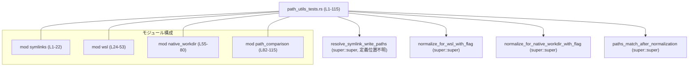
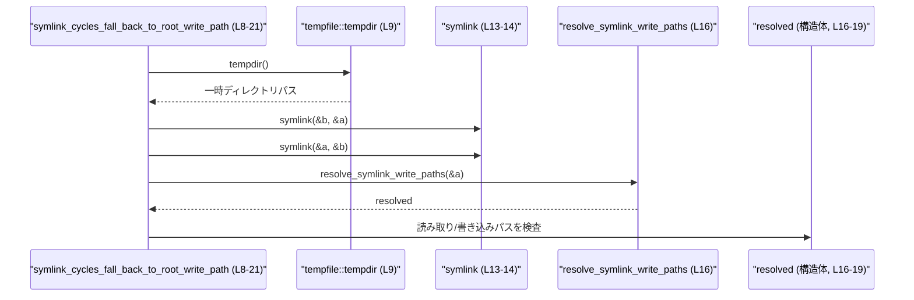
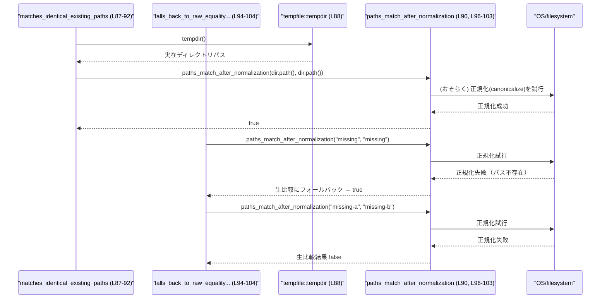

# utils/path-utils/src/path_utils_tests.rs コード解説

## 0. ざっくり一言

このファイルは、パス操作ユーティリティの **プラットフォーム依存の挙動** を検証するテスト群です。  
シンボリックリンクの循環、WSL での `/mnt` パス、Windows の verbatim パス、正規化後のパス比較などの振る舞いを確認しています。

---

## 1. このモジュールの役割

### 1.1 概要

- このモジュールは、上位モジュールに定義された以下の関数の期待動作をテストします。
  - `resolve_symlink_write_paths`（シンボリックリンク解決）【L3, L16-19】
  - `normalize_for_wsl_with_flag`（WSL 用のパス正規化）【L26, L32-35, L41-43, L49-51】
  - `normalize_for_native_workdir_with_flag`（ネイティブ作業ディレクトリ用のパス正規化）【L56, L63-69, L74-78】
  - `paths_match_after_normalization`（正規化後のパス比較）【L83, L90, L96-103, L112】
- OS ごとに `#[cfg(...)]` でテストを切り替え、Unix / Linux / Windows 特有のケースを検証しています【L1, L24, L60, L106】。

### 1.2 アーキテクチャ内での位置づけ

このファイルは **テスト専用モジュール** であり、外部から直接呼ばれる API は定義していません。  
上位モジュール（`super::super`）の関数群に対してブラックボックス的に挙動を検証します【L3, L26, L56, L83】。



### 1.3 設計上のポイント

コードから読み取れる設計上の特徴は次のとおりです。

- **プラットフォーム別テスト**  
  - `#[cfg(unix)]` / `#[cfg(target_os = "linux")]` / `#[cfg(target_os = "windows")]` により、対象 OS でのみコンパイル・実行されるテストを定義しています【L1, L24, L60, L106】。
- **副作用を持つ I/O テスト**  
  - 一時ディレクトリ (`tempfile::tempdir`) を使った実ファイルシステム操作（シンボリックリンク作成、実在ディレクトリ比較）を行います【L9, L88, L109】。
- **エラーハンドリング**  
  - ファイルシステム操作を行うテストは `std::io::Result<()>` を返し、`?` 演算子でエラーを早期リターンするスタイルです【L8, L87, L108】。
- **安全性検証のフォーカス**  
  - シンボリックリンクの循環時の挙動【L13-19】や、存在しないパス比較時のフォールバック挙動【L95-103】など、バグやセキュリティ事故の原因になりやすいケースを明示的にテストしています。

---

## 2. 主要な機能一覧

このファイル自体はテスト専用ですが、テストを通じて間接的に検証している「機能」を整理すると次のようになります。

- シンボリックリンク循環時の解決挙動: 循環検出時に安全な書き込みパスへフォールバックすることを確認【L8-21】。
- WSL `/mnt` ドライブパスの正規化: `/mnt/C/Users/Dev` を全て小文字に正規化することを確認【L31-36】。
- WSL での非ドライブ `/mnt` パスの保持: `/mnt/cc/...` のようなパスは変更しないことを確認【L39-44】。
- WSL で `/mnt` 以外のパスの保持: `/home/Dev` のようなパスは変更しないことを確認【L47-52】。
- Windows verbatim パスの正規化: `\\?\D:\...` が `D:\...` に簡約されることを確認【L62-69】。
- 非 Windows 環境での verbatim 風パスの保持: `is_windows=false` のときは変更しないことを確認【L72-79】。
- 正規化後のパス比較（存在するパス）: 同一ディレクトリを指すパスは一致と判定されることを確認【L87-92】。
- 正規化不能なパス比較時のフォールバック: 存在しないパスでは「生のパス文字列による比較」にフォールバックすることを確認【L95-103】。
- Windows verbatim パス同士/通常パスとの比較: 同じ場所を指す verbatim と通常パスが一致すると判定されることを確認【L108-113】。

### 2.1 コンポーネントインベントリー（本ファイル内）

| 名称 | 種別 | 役割 / 用途 | 行範囲 |
|------|------|-------------|--------|
| `mod symlinks` | モジュール | Unix 環境でのシンボリックリンク循環に関するテストをまとめる | L1-22 |
| `symlink_cycles_fall_back_to_root_write_path` | テスト関数 | symlink ループ時に `resolve_symlink_write_paths` が安全にフォールバックするか検証 | L8-21 |
| `mod wsl` | モジュール | Linux/WSL 環境のパス正規化テストをまとめる | L24-53 |
| `wsl_mnt_drive_paths_lowercase` | テスト関数 | `/mnt/<ドライブ文字>/...` のパスが小文字化されることを検証 | L31-36 |
| `wsl_non_drive_paths_unchanged` | テスト関数 | `/mnt/cc/...` のような非ドライブパスが変更されないことを検証 | L39-44 |
| `wsl_non_mnt_paths_unchanged` | テスト関数 | `/home/...` など `/mnt` でないパスが変更されないことを検証 | L47-52 |
| `mod native_workdir` | モジュール | ネイティブ作業ディレクトリのパス正規化テスト | L55-80 |
| `windows_verbatim_paths_are_simplified` | テスト関数 | Windows の verbatim パスが通常パスに簡約されることを検証 | L62-70 |
| `non_windows_paths_are_unchanged` | テスト関数 | `is_windows=false` のときはパスが変更されないことを検証 | L72-79 |
| `mod path_comparison` | モジュール | パス比較ロジックのテスト | L82-115 |
| `matches_identical_existing_paths` | テスト関数 | 実在する同一パスが一致と判定されるか検証 | L87-92 |
| `falls_back_to_raw_equality_when_paths_cannot_be_normalized` | テスト関数 | 正規化できないパスで生比較にフォールバックするか検証 | L94-104 |
| `matches_windows_verbatim_paths` | テスト関数 | Windows verbatim パスが通常パスと一致すると判定されるか検証 | L108-113 |

### 2.2 コンポーネントインベントリー（外部依存 API）

テストから見える外部 API（このファイルでは定義されていないもの）です。

| 名称 | 種別 | 役割 / 用途 | 使用箇所（行範囲） |
|------|------|-------------|---------------------|
| `resolve_symlink_write_paths` | 関数 | シンボリックリンクを解決し、読み取り/書き込みパスを返す。循環時の挙動をテストで確認 | L3, L16-19 |
| `normalize_for_wsl_with_flag` | 関数 | WSL 環境でのパスを正規化（主に `/mnt/<drive>/...` の扱い） | L26, L32-35, L41-42, L49-50 |
| `normalize_for_native_workdir_with_flag` | 関数 | ネイティブ OS のワークディレクトリ用にパスを正規化（Windows verbatim パス対応など） | L56, L63-69, L75-77 |
| `paths_match_after_normalization` | 関数 | パスを正規化したうえで同一性比較を行う | L83, L90, L96-103, L112 |
| `tempfile::tempdir` | 関数 | 一時ディレクトリを作成し、テスト用の実在パスを提供する | L9, L88, L109 |
| `std::os::unix::fs::symlink` | 関数 | Unix 上でシンボリックリンクを作成する | L5, L13-14 |
| `std::path::PathBuf` | 構造体 | 所有権付きのパス型。WSL/Windows テストで使用 | L28, L32, L35, L40-41, L43, L48-51, L63-64, L68-69, L74-78, L84, L96-103, L110-112 |

---

## 3. 公開 API と詳細解説

このファイル自体は公開 API を定義しませんが、テストを通じて外部関数の **契約（期待仕様）** が部分的に分かります。  
ここでは、代表的なテスト関数を入口にして、それぞれが検証している挙動を整理します。

### 3.1 型一覧（主に外部 API が返す型）

このファイル内で新たな構造体・列挙体は定義されていません。  
ただし、`resolve_symlink_write_paths` の戻り値はフィールドアクセスから次のような構造を持つことが分かります【L16-19】。

| 名前 | 種別 | 役割 / 用途 | 根拠 |
|------|------|-------------|------|
| （名称不明） | 構造体 | シンボリックリンク解決結果。`read_path` と `write_path` フィールドを持つ | `resolved.read_path` / `resolved.write_path` にアクセスしている【L18-19】 |
| `read_path` | フィールド（おそらく `Option<PathBuf>`） | 実際に読み込みに使うパス。循環検出時には `None` になる | `assert_eq!(resolved.read_path, None)` から、`None` と比較できる Option 型である必要がある【L18】 |
| `write_path` | フィールド（おそらく `PathBuf`） | 書き込みに使用するパス。循環時には「ルートのパス」（ここでは `a`）がそのまま入る | `assert_eq!(resolved.write_path, a)` から `a` と同じ型（`PathBuf`）であることが分かる【L19】 |

> フィールド名以外の構造体名や完全な型パラメータは、このチャンクからは分かりません。

### 3.2 関数詳細（テスト関数を通じて見える契約）

#### `symlink_cycles_fall_back_to_root_write_path() -> std::io::Result<()>`【L8-21】

**概要**

- Unix 環境において、`resolve_symlink_write_paths` が **シンボリックリンクの循環** を検出した場合に、
  - 読み取りパスが `None` になる
  - 書き込みパスが「解決開始地点のパス」にフォールバックする  
 ことを検証します【L13-19】。

**引数**

- このテスト関数は引数を取りません。内部で一時ディレクトリ・パスを生成しています【L9-11】。

**戻り値**

- `std::io::Result<()>`  
  - `tempfile::tempdir` や `symlink`、`resolve_symlink_write_paths` の呼び出しに失敗した場合、エラーを伝搬します【L8-9, L13-14, L16】。
  - テストのアサーションに失敗した場合は panic します（Rust のテストの通常挙動）。

**内部処理の流れ**

1. 一時ディレクトリを作成し【L9】、その下に `a` と `b` という 2 つのパスを組み立てます【L10-11】。
2. `a -> b`、`b -> a` の 2 本のシンボリックリンクを作成し、循環を形成します【L13-14】。
3. `resolve_symlink_write_paths(&a)` を呼び出し、その結果を `resolved` に格納します【L16】。
4. `resolved.read_path` が `None` であること（読み取りパスが設定されていないこと）を検証します【L18】。
5. `resolved.write_path` が元のパス `a` と等しいことを検証します【L19】。

**Examples（使用例）**

このテストと同様の状況を再現するサンプルです（Unix 前提）。

```rust
use std::os::unix::fs::symlink;
use std::path::Path;
use utils_path_utils::resolve_symlink_write_paths; // 実際のパスはこのチャンクからは不明

fn handle_symlink_cycle_example() -> std::io::Result<()> {
    let dir = tempfile::tempdir()?;                         // 一時ディレクトリを作成
    let a = dir.path().join("a");                           // a のパス
    let b = dir.path().join("b");                           // b のパス

    symlink(&b, &a)?;                                       // a -> b のリンク
    symlink(&a, &b)?;                                       // b -> a のリンク（循環）

    let resolved = resolve_symlink_write_paths(&a)?;        // 循環を含むパスを解決

    assert!(resolved.read_path.is_none());                  // 読み取りパスは None の想定
    assert_eq!(resolved.write_path, a);                     // 書き込みパスは a にフォールバック
    Ok(())
}
```

> `utils_path_utils` などのクレート名は仮置きであり、実際のクレート構成はこのチャンクからは分かりません。

**Errors / Panics**

- エラー条件（`Err`）  
  - 一時ディレクトリ作成に失敗した場合【L9】。
  - シンボリックリンク作成に失敗した場合【L13-14】。
  - `resolve_symlink_write_paths` が `io::Error` を返した場合【L16】。
- パニック条件  
  - `assert_eq!` によるアサーション失敗時【L18-19】。

**Edge cases（エッジケース）**

- 明示的にテストされているエッジケースは「2 ノード間の閉ループ（a↔b）」のみです【L10-14】。
- それ以外のケース（自己ループ `a->a`、より長い循環、分岐を含むグラフなど）の挙動は、このチャンクからは分かりません。

**使用上の注意点（契約）**

- `resolve_symlink_write_paths` を使うコードでは、戻り値の `read_path` が `None` の場合に備えた処理（例えば「読み取り先不明なので書き込み専用扱いにする」など）が必要になります【L18-19】。
- 循環時に `write_path` が「解決の起点パス」にフォールバックするという前提でテストされていますが、他のケースでの `write_path` の意味はこのチャンクからは分かりません。

---

#### `wsl_mnt_drive_paths_lowercase()`【L31-36】

**概要**

- Linux / WSL 環境で `is_wsl = true` のとき、`/mnt/C/Users/Dev` のようなパスが **完全に小文字化** されて `/mnt/c/users/dev` になることを確認します【L31-36】。

**引数**

- 引数なし。内部で `PathBuf::from("/mnt/C/Users/Dev")` を使っています【L32】。

**戻り値**

- `()`（テスト関数）。アサーション失敗時は panic します【L35】。

**テストから読み取れる `normalize_for_wsl_with_flag` の契約**

- シグネチャ（推定）  
  - 呼び出しから `normalize_for_wsl_with_flag` のシグネチャは概ね以下のようになります【L32】。

    ```rust
    fn normalize_for_wsl_with_flag(path: PathBuf, is_wsl: bool) -> PathBuf
    ```

- 挙動（`is_wsl = true` の場合のみ）  
  - `/mnt/C/Users/Dev` を渡すと `/mnt/c/users/dev` が返ることから、
    - `/mnt` プレフィックスは維持される
    - ドライブ文字 `C` は `c` に
    - サブディレクトリ `Users/Dev` も小文字化される  
    など、「パス全体を小文字化している」と読めます【L32-35】。

**Edge cases**

- `/mnt/cc/...` や `/home/...` など、同じ `is_wsl = true` でも小文字化されないケースが別テストで確認されています【L39-44, L47-52】。
- `is_wsl = false` のときの挙動は、このチャンクではテストされておらず不明です。

---

#### `wsl_non_drive_paths_unchanged()`【L39-44】

**概要**

- `/mnt/cc/Users/Dev` のようなパス（`/mnt/<単一ドライブ文字>/` ではない）を `is_wsl = true` で渡した場合、**パスがそのまま維持される**ことを確認します【L39-44】。

**ポイント**

- `normalize_for_wsl_with_flag` は、`/mnt/<1文字>/` 形式のパスにだけ特別な処理（小文字化など）を適用し、それ以外の `/mnt` パスには何もしないという契約が示唆されます【L39-43】。

---

#### `windows_verbatim_paths_are_simplified()`【L62-70】

**概要**

- `is_windows = true` のとき、Windows の verbatim パス  
  `\\?\D:\c\x\worktrees\2508\swift-base` を `normalize_for_native_workdir_with_flag` に渡すと、  
  プレフィックス `\\?\` が取り除かれて `D:\c\x\worktrees\2508\swift-base` になることを確認します【L62-69】。

**テストから読み取れる `normalize_for_native_workdir_with_flag` の契約**

- シグネチャ（推定）

  ```rust
  fn normalize_for_native_workdir_with_flag(path: PathBuf, is_windows: bool) -> PathBuf
  ```

  （呼び出しから直接分かる事項です【L63-64, L76-77】）

- 挙動（テストで確認できる範囲）

  - `is_windows = true` かつ `path` が `\\?\` で始まる場合、
    - `\\?\` プレフィックスを削除し、残りのパス部分を返します【L63-69】。
  - `is_windows = false` の場合は、同じパスを渡しても **一切変換を行わず** そのまま返します【L72-79】。

**Edge cases**

- `is_windows = true` かつ verbatim ではないパス (`D:\foo` など) の扱いは、このチャンクからは分かりません。
- ネットワークパス (`\\server\share`) の扱いも不明です。

---

#### `non_windows_paths_are_unchanged()`【L72-79】

**概要**

- Windows ではない環境（または `is_windows = false` と明示）で `normalize_for_native_workdir_with_flag` を呼ぶと、パスは変化しないことを確認します【L72-79】。

**ポイント**

- 正規化処理をプラットフォームフラグで明示的に制御していることが分かります（誤って非 Windows 環境で Windows 向け正規化を行ってしまうことを防止）。

---

#### `matches_identical_existing_paths() -> std::io::Result<()>`【L87-92】

**概要**

- 実際に存在する同一ディレクトリを指す 2 つのパスを `paths_match_after_normalization` に渡したときに、`true` が返ることを確認します【L87-92】。

**引数**

- テスト関数自体に引数はありません。
- 内部で `tempfile::tempdir` によって実際に存在するディレクトリを生成し、そのパスを 2 回渡しています【L88, L90】。

**テストから読み取れる `paths_match_after_normalization` の契約（部分）**

- 戻り値は `bool` であることが、`assert!(paths_match_after_normalization(...))` から分かります【L90】。
- `dir.path()` は `&Path` 型、`PathBuf::from("missing")` は `PathBuf` 型なので、少なくともこれら両方を受け取れるシグネチャ（例えば `impl AsRef<Path>`）になっていると考えられます【L90, L96-103】。
- 実在する同一パスを渡した場合は `true` が返るという仕様がテストにより保証されています【L90】。

**Edge cases**

- 実在しないパスの扱いは、別のテスト（`falls_back_to_raw_equality_when_paths_cannot_be_normalized`）で検証されています【L95-103】。

---

#### `falls_back_to_raw_equality_when_paths_cannot_be_normalized()`【L94-104】

**概要**

- 存在しないパスを `paths_match_after_normalization` に渡した場合、**パスの正規化に失敗し、最終的に「生のパス文字列の比較」にフォールバックする** ことを検証します【L95-103】。

**テスト内容**

1. `missing` と `missing` を比較すると `true` になる【L96-99】。
2. `missing-a` と `missing-b` を比較すると `false` になる【L100-103】。

**契約（テストから読み取れる範囲）**

- パスが存在しないため正規化（例えば `canonicalize`）に失敗した場合でも、関数自体はエラーを返さず、  
  「パス文字列の等価性」を使って判定を行うとみなせます【L96-103】。
- これにより、**「存在しなくても、全く同じ文字列であれば一致」と扱う** という仕様が成り立っています。

**安全性・セキュリティ上の含意**

- エラーにせず「生比較」にフォールバックする仕様は便利ですが、
  - シンボリックリンクやパスの正規化結果を前提としたセキュリティチェック（例: ディレクトリトラバーサル防止）では、この挙動が意図通りか慎重に検討する必要があります。
  - 少なくとも、このテストは「存在しないパスで生比較が行われること」を明文化しています。

---

### 3.3 その他の関数（概要のみ）

| 関数名 | 役割（1 行） | 行範囲 |
|--------|--------------|--------|
| `wsl_non_mnt_paths_unchanged` | `/mnt` 以外のパス (`/home/...`) は `normalize_for_wsl_with_flag` によって変更されないことを確認 | L47-52 |
| `matches_windows_verbatim_paths` | Windows で、verbatim パス（`\\?\...`）と通常パスが `paths_match_after_normalization` により一致と判定されることを検証 | L108-113 |

---

## 4. データフロー

ここでは代表的な 2 つの処理シナリオについて、データの流れと関数呼び出し関係を示します。

### 4.1 シンボリックリンク循環解決のデータフロー

`symlink_cycles_fall_back_to_root_write_path` 内での処理の流れです【L8-21】。



- このフローのポイントは、「実ファイルシステム上に循環を持つリンク構造を作った上で」「解決関数が安全にフォールバックするか」を検証している点です【L9-19】。
- 並行処理や非同期処理は一切行っておらず、単一スレッド・同期 I/O のみです。

### 4.2 パス比較のデータフロー（正規化 → 比較）

`matches_identical_existing_paths` および `falls_back_to_raw_equality_when_paths_cannot_be_normalized` から見える概略です【L87-104】。



> 正規化処理の具体的な実装（`canonicalize` 使用など）はこのチャンクには現れませんが、テスト名と「フォールバック」という文言から、上記のような流れが想定されていると考えられます【L95-103】。

---

## 5. 使い方（How to Use）

このファイルはテスト専用ですが、テストコードを元に、上位モジュールの関数をどのように使うかの具体例を整理します。

### 5.1 基本的な使用方法

#### 5.1.1 シンボリックリンク解決関数の利用例

```rust
use std::os::unix::fs::symlink;
use std::path::Path;
use utils_path_utils::resolve_symlink_write_paths; // 定義場所はこのチャンクからは不明

fn main() -> std::io::Result<()> {
    let dir = tempfile::tempdir()?;                      // 一時ディレクトリを作成
    let a = dir.path().join("a");
    let b = dir.path().join("b");

    symlink(&b, &a)?;                                    // a -> b のリンク
    symlink(&a, &b)?;                                    // b -> a のリンク（循環）

    let resolved = resolve_symlink_write_paths(&a)?;     // &Path 参照を渡す

    // 読み取りパスがない場合（循環など）は None になる可能性がある
    if let Some(read) = &resolved.read_path {
        println!("read from: {}", read.display());
    } else {
        println!("no readable target; writing to {}", resolved.write_path.display());
    }

    Ok(())
}
```

- Rust の所有権・借用の観点では、`resolve_symlink_write_paths` に `&a`（借用）を渡しており、`a` の所有権は維持されます【L16】。

#### 5.1.2 WSL 用パスの正規化

```rust
use std::path::PathBuf;
use utils_path_utils::normalize_for_wsl_with_flag;

fn normalize_wsl_path_example() {
    let raw = PathBuf::from("/mnt/C/Users/Dev");         // 大文字を含む WSL パス
    let normalized = normalize_for_wsl_with_flag(raw, true); // WSL 環境フラグを true にする

    assert_eq!(normalized, PathBuf::from("/mnt/c/users/dev"));
}
```

- `PathBuf` は所有権を持つパス型であり、関数にムーブしています【L32】。
- `is_wsl` フラグで変換有無を制御する設計になっています【L32-35, L39-44, L47-52】。

#### 5.1.3 Windows ネイティブ作業ディレクトリ向け正規化

```rust
use std::path::PathBuf;
use utils_path_utils::normalize_for_native_workdir_with_flag;

fn normalize_windows_workdir_example() {
    // Windows の verbatim パス
    let verbatim = PathBuf::from(r"\\?\D:\c\x\worktrees\2508\swift-base");
    let normalized = normalize_for_native_workdir_with_flag(verbatim, true); // Windows フラグ true

    assert_eq!(
        normalized,
        PathBuf::from(r"D:\c\x\worktrees\2508\swift-base")
    );
}
```

- 非 Windows 環境では `is_windows` を `false` にすることで「何もしない」動作にできます【L72-79】。

#### 5.1.4 正規化後のパス比較

```rust
use std::path::PathBuf;
use utils_path_utils::paths_match_after_normalization;

fn compare_paths_example() -> std::io::Result<()> {
    let dir = tempfile::tempdir()?;                      // 実在パス
    let p1 = dir.path();                                 // &Path
    let p2 = dir.path();                                 // 同じ &Path

    assert!(paths_match_after_normalization(p1, p2));    // 存在する同一パス → true

    // 存在しないパス: 文字列が同じなら true, 異なれば false
    assert!(paths_match_after_normalization(
        PathBuf::from("missing"),
        PathBuf::from("missing"),
    ));
    assert!(!paths_match_after_normalization(
        PathBuf::from("missing-a"),
        PathBuf::from("missing-b"),
    ));

    Ok(())
}
```

- 引数には `&Path` と `PathBuf` の両方を渡せていることから、`impl AsRef<Path>` などの抽象化が使われていると推定できます【L90, L96-103】。

### 5.2 よくある使用パターン

- **プラットフォームフラグで挙動を切り替える**  
  - WSL / Windows 正規化関数はいずれも `is_wsl` / `is_windows` ブールフラグを明示的に受け取り、テストでもこのフラグの違いを検証しています【L32, L41, L49, L64, L76】。
  - 実際のアプリケーションでは「起動時に環境を判定してフラグを決め、それを各関数に渡す」といったパターンが考えられます。

- **実在パスは正規化して比較、非実在パスは生比較**  
  - `paths_match_after_normalization` はこの方針をテストによって明文化しています【L87-92, L95-103】。
  - 設定ファイルのパス検証など、「存在すればより厳格に比較、存在しなければ文字列比較」という使い方に適合します。

### 5.3 よくある間違い（想定されるもの）

テストから推測できる、起こり得る誤用例と正しい使い方の対比です。

```rust
use std::path::PathBuf;
use utils_path_utils::{normalize_for_wsl_with_flag, normalize_for_native_workdir_with_flag};

// ❌ 誤り例: WSL 環境なのに is_wsl を false にしてしまう
let raw = PathBuf::from("/mnt/C/Users/Dev");
let normalized = normalize_for_wsl_with_flag(raw.clone(), false);
// 期待通りに小文字化されない可能性が高い

// ✅ 正しい例: 環境に応じてフラグを設定
let normalized = normalize_for_wsl_with_flag(raw, true);
```

```rust
// ❌ 誤り例: 非 Windows 環境なのに Windows 向け正規化を有効化
let verbatim = PathBuf::from(r"\\?\D:\c\x\worktrees\2508\swift-base");
let normalized = normalize_for_native_workdir_with_flag(verbatim.clone(), true);
// 非 Windows でこの変換を行うと意図せぬパス解釈になる可能性がある

// ✅ 正しい例: 非 Windows では is_windows = false
let normalized = normalize_for_native_workdir_with_flag(verbatim, false);
```

```rust
// ❌ 誤り例: paths_match_after_normalization が「必ず正規化に成功する」と仮定する
let equal = paths_match_after_normalization("missing-a", "missing-b");
// ここで equal == false となることを前提にセキュリティ判断を行うと、
// 正規化に失敗し生比較になっている事実を考慮し損ねる恐れがある

// ✅ 正しい例: 「存在しないパスでは生比較にフォールバックする」仕様を前提にする
// 必要なら別途 `std::fs::metadata` などで存在確認を行う
```

### 5.4 使用上の注意点（まとめ）

- **プラットフォームフラグの正しさが前提**  
  - `is_wsl` / `is_windows` は外部から渡す値であり、誤ったフラグ値を渡すと正規化が意図と異なります【L32, L41, L49, L64, L76】。
- **`paths_match_after_normalization` は存在しないパスで生比較を行う**  
  - セキュリティ用途（パス検証）では、この挙動を明示的に考慮する必要があります【L95-103】。
- **シンボリックリンク循環時に read_path が None となる可能性**  
  - `resolve_symlink_write_paths` の呼び出し側は `read_path` が `None` であるケースを必ず扱うべきです【L18】。
- **並行性**  
  - このテストは全て同期的に実行されており、関数のスレッド安全性や競合状態については何も検証していません。この点は別途ライブラリ実装側での確認が必要です（このチャンクには情報がありません）。

---

## 6. 変更の仕方（How to Modify）

このファイルはテストコードなので、「機能追加・変更」に対して **どうテストを拡張するか** という観点で説明します。

### 6.1 新しい機能を追加する場合（テスト側）

例えば、`normalize_for_wsl_with_flag` に新しいルール（例: `/mnt/d` を特別扱い）が追加されたとします。

1. **対象モジュールを選ぶ**  
   - WSL 関連であれば `mod wsl`（L24-53）に新しいテスト関数を追加するのが自然です。
2. **前提となる入力パスとフラグを決める**  
   - 例: `/mnt/d/projects` と `is_wsl = true`。
3. **期待される出力を定義する**  
   - 例: `/mnt/d/projects` が変更されない、など。
4. **テストを書く**  
   - 既存の `wsl_mnt_drive_paths_lowercase` や `wsl_non_drive_paths_unchanged` のスタイルを踏襲します【L31-36, L39-44】。

### 6.2 既存の機能を変更する場合（テスト更新の観点）

- **影響範囲の確認**
  - 例えば `paths_match_after_normalization` の振る舞いを変える場合、`mod path_comparison` 内の 3 つのテスト【L87-113】が影響を受けます。
- **契約の再確認**
  - 現在のテストは「存在しないパスでは生比較」という仕様を前提にしています【L95-103】。
  - この仕様を変更する（例えば、存在しないパスでは常に `false` を返す）なら、テスト名・内容を含めて更新する必要があります。
- **OS 依存の挙動**
  - `#[cfg(unix)]` / `#[cfg(target_os = "linux")]` / `#[cfg(target_os = "windows")]` の条件を変える場合は、ターゲット OS ごとのビルド・テストマトリクスへの影響を考慮する必要があります【L1, L24, L60, L106】。

---

## 7. 関連ファイル

このチャンクには他ファイルのパスは明示されていませんが、`super::super` の参照から、少なくとも次のような関連モジュールの存在が分かります。

| パス / シンボル | 役割 / 関係 |
|-----------------|------------|
| `super::super::resolve_symlink_write_paths` | シンボリックリンクを解決し、`read_path` / `write_path` を返す関数。`mod symlinks` からテストされています【L3, L16-19】。定義ファイルの場所はこのチャンクには現れません。 |
| `super::super::normalize_for_wsl_with_flag` | WSL 環境でのパス正規化関数。`mod wsl` の 3 つのテストがその振る舞いを検証しています【L26, L31-52】。 |
| `super::super::normalize_for_native_workdir_with_flag` | ネイティブ作業ディレクトリ用のパス正規化関数。Windows verbatim パスなどの扱いをテストしています【L56, L62-79】。 |
| `super::super::paths_match_after_normalization` | パスを正規化後に比較するユーティリティ関数。`mod path_comparison` からテストされています【L83, L87-113】。 |
| `tempfile` クレート | 一時ディレクトリ生成に使用されており、ファイルシステムに依存するテストの基盤となります【L9, L88, L109】。 |
| `pretty_assertions` クレート | `assert_eq!` を色付き・差分付きに拡張するマクロを提供し、テスト結果の可読性を向上させます【L4, L27, L57】。 |

---

## Bugs / Security（このテストが防ごうとしているもの）

- **シンボリックリンク循環による無限ループ / スタックオーバーフロー**  
  - 循環時に `read_path = None` / `write_path = 起点パス` となることを保証することで、安全なフォールバックパスを明確にしています【L13-19】。
- **WSL でのパス大文字・小文字不一致**  
  - `/mnt/C/...` と `/mnt/c/...` の不一致を避けるため、確実に小文字化されることをテストしています【L31-36】。
- **Windows verbatim パスの取り扱いミス**  
  - `\\?\` プレフィックスを認識せずに扱うと、同一パスなのに比較や正規化が失敗する可能性があります。これを防ぐテストです【L62-70, L108-113】。
- **存在しないパスの比較時の例外やクラッシュ**  
  - 正規化失敗時でもエラーを返さず、生比較にフォールバックすることを保証することで、呼び出し側の安定性を担保しています【L95-103】。

---

## Contracts / Edge Cases（まとめ）

このファイルから読み取れる各関数の「契約」と「エッジケース」を箇条書きで整理します。

- `resolve_symlink_write_paths`【L13-19】
  - 契約: 循環を含むパスを解決する際、読み取りパスを `None` にして、書き込みパスに起点パスを入れて返す。
  - エッジケース: 少なくとも `a -> b -> a` の 2 ノード循環はこの挙動になる。その他のグラフ構造は不明。
- `normalize_for_wsl_with_flag`【L31-52】
  - 契約（テスト範囲）:
    - `is_wsl = true` かつ `/mnt/<1文字>/...` 形式 → パス全体を小文字化。
    - `is_wsl = true` かつ `/mnt/cc/...` のような形式 → 変更しない。
    - `is_wsl = true` かつ `/home/...` のように `/mnt` 以外 → 変更しない。
  - エッジケース: `is_wsl = false`、その他の `/mnt` 以外の複雑なパスはこのチャンクからは不明。
- `normalize_for_native_workdir_with_flag`【L62-79】
  - 契約（テスト範囲）:
    - `is_windows = true` かつ `\\?\` で始まるパス → `\\?\` を削除。
    - `is_windows = false` かつ同じパス → 一切変更しない。
  - エッジケース: `is_windows = true` かつ通常パス (`D:\...`) の扱いは不明。
- `paths_match_after_normalization`【L87-104, L108-113】
  - 契約（テスト範囲）:
    - 実在する同一パス → true。
    - 存在しないパスかつ文字列同一 → true。
    - 存在しないパスかつ文字列が異なる → false。
    - Windows では、verbatim パスと通常パスも一致と判定される。
  - エッジケース: 片方だけ存在するパス、シンボリックリンクを介した比較などは、このチャンクからは不明。

---

## Performance / Scalability の観点（このテストから分かる範囲）

- テストは小規模な一時ディレクトリや短いパス文字列のみ扱っており、大量のパスを処理するケースはありません。
- `paths_match_after_normalization` が存在確認や正規化（おそらく `canonicalize`）を行っているとすれば、ファイルシステム I/O のコストが支配的になりますが、このファイルから具体的な実装コストは分かりません。
- 並列実行やスレッドセーフティは一切テストされていません（Rust のテストランナーはデフォルトでテストを並列実行し得ますが、このファイルは特に排他制御等を行っていません）。

---

以上が、`utils/path-utils/src/path_utils_tests.rs` に基づいて読み取れる仕様・データフロー・エッジケースの整理です。
