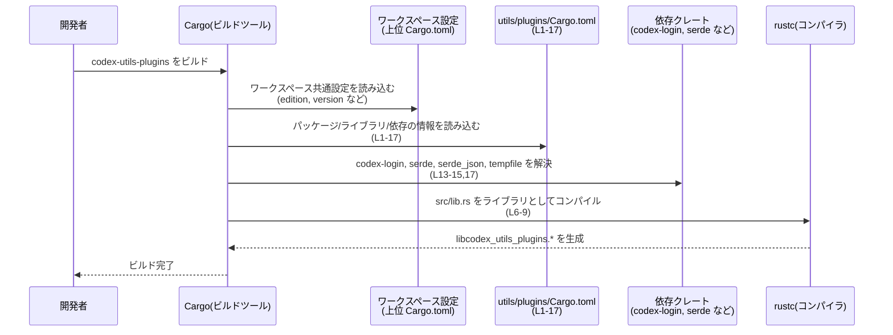

# utils/plugins/Cargo.toml コード解説

## 0. ざっくり一言

`utils/plugins/Cargo.toml` は、ライブラリクレート `codex-utils-plugins` の **ビルド設定と依存関係** を定義する Cargo マニフェストファイルです（`utils/plugins/Cargo.toml:L1-5,L6-9,L12-17`）。

---

## 1. このモジュールの役割

### 1.1 概要

このファイルは、Rust のビルドツール Cargo に対して次の情報を提供します。

- パッケージ名 `codex-utils-plugins` と、バージョン・ライセンス・edition をワークスペース共通設定から継承すること（`utils/plugins/Cargo.toml:L1-5`）
- ライブラリターゲット `codex_utils_plugins` の名前と、そのエントリポイント `src/lib.rs`（`utils/plugins/Cargo.toml:L6-9`）
- ワークスペース共通のリント（lint）設定を利用すること（`utils/plugins/Cargo.toml:L10-11`）
- 依存クレート `codex-login`, `serde`, `serde_json` と、開発用依存 `tempfile` をワークスペース設定経由で利用すること（`utils/plugins/Cargo.toml:L12-17`）
- doctest（ドキュメントテスト）を無効化していること（`utils/plugins/Cargo.toml:L7`）

このファイル自体には **関数・構造体などの Rust コードは含まれていません**。公開 API やコアロジックは `src/lib.rs` などのソースコード側にあります（`utils/plugins/Cargo.toml:L9`）。

### 1.2 アーキテクチャ内での位置づけ

このファイルが示すアーキテクチャ上の位置づけを、クレートレベルの依存関係として整理します。

- ライブラリクレート `codex-utils-plugins`（ビルドターゲット名 `codex_utils_plugins`）が中心（`utils/plugins/Cargo.toml:L4,L8`）
- 実行時・ライブラリ依存として `codex-login`, `serde`, `serde_json` を利用（`utils/plugins/Cargo.toml:L13-15`）
- テストや開発時のみ利用される開発用依存として `tempfile` を利用（`utils/plugins/Cargo.toml:L16-17`）
- 依存クレートのバージョンや詳細な設定はワークスペース側で一元管理（`workspace = true` フラグ、`utils/plugins/Cargo.toml:L2-3,L5,L11,L13-15,L17`）

これをクレートレベルの依存グラフとして図示します。

```mermaid
graph TD
    A["codex-utils-plugins<br/>(lib: codex_utils_plugins)<br/>Cargo.toml L1-9"]
    B["codex-login<br/>依存 (workspace=true)<br/>L13"]
    C["serde<br/>依存 (features=[\"derive\"])<br/>L14"]
    D["serde_json<br/>依存 (workspace=true)<br/>L15"]
    E["tempfile<br/>開発用依存 (dev-dep)<br/>L16-17"]

    A --> B
    A --> C
    A --> D
    A -.dev-dependency.-> E
```

> この図は、**クレート間の依存方向**のみを表しています。どの関数・型レベルで呼び出しているかは、このチャンク（Cargo.toml）の情報からは分かりません。

### 1.3 設計上のポイント

この Cargo マニフェストから読み取れる設計上の特徴を列挙します。

- **ワークスペース一元管理**
  - edition, license, version, lints, 依存クレートのバージョンなどを `workspace = true` でワークスペース共通設定に委ねています（`utils/plugins/Cargo.toml:L2-3,L5,L11,L13-15,L17`）。
  - これにより、複数クレート間での設定の一貫性を保つ構造になっています。
- **ライブラリ専用クレート**
  - `[lib]` セクションのみが存在し、バイナリターゲット（`[[bin]]`）は定義されていません（`utils/plugins/Cargo.toml:L6-9`）。  
    → このディレクトリ下のクレートは **ライブラリとして利用されることを前提**としています。
- **ドキュメントテスト無効化**
  - `doctest = false` により、ドキュメント内のコードブロックをテストとして実行しない設定になっています（`utils/plugins/Cargo.toml:L7`）。
- **開発・テスト用依存の分離**
  - `tempfile` が `[dev-dependencies]` にのみ定義されており、実行時にはリンクされないことが示されています（`utils/plugins/Cargo.toml:L16-17`）。

---

## 2. 主要な機能一覧

このファイル自体は実行時の「機能」を持たず、Cargo に対してビルド・依存のメタ情報を提供します。その観点での主要な役割は次のとおりです。

- パッケージメタデータの定義  
  - パッケージ名 `codex-utils-plugins` を定義し、版数・ライセンス・edition をワークスペースから取得します（`utils/plugins/Cargo.toml:L1-5`）。
- ライブラリターゲットの指定  
  - ライブラリ名 `codex_utils_plugins` と、そのルート `src/lib.rs` を指定します（`utils/plugins/Cargo.toml:L6-9`）。
- ワークスペース共通リントの適用  
  - `[lints] workspace = true` により、警告レベルなどのリント設定をワークスペースに委譲します（`utils/plugins/Cargo.toml:L10-11`）。
- ライブラリ依存の宣言  
  - `codex-login`, `serde`, `serde_json` を通常の依存として宣言します（`utils/plugins/Cargo.toml:L12-15`）。
- 開発用依存の宣言  
  - `tempfile` を開発・テスト専用の依存として宣言します（`utils/plugins/Cargo.toml:L16-17`）。

> どのような「プラグイン機能」や公開 API を提供しているかは、`src/lib.rs` などの Rust コードを確認しないと分かりません（`utils/plugins/Cargo.toml:L9`）。

---

## 3. 公開 API と詳細解説

### 3.1 型一覧（構造体・列挙体など）

このファイルには Rust の型定義は含まれていませんが、**ライブラリクレート自体**を 1 つのコンポーネントとして整理します。

| 名前 | 種別 | 役割 / 用途 | 根拠 |
|------|------|-------------|------|
| `codex_utils_plugins` | ライブラリクレート | `src/lib.rs` をルートとするライブラリターゲット。公開 API やコアロジックはこのクレート内部に実装されるが、この Cargo.toml からは詳細不明。 | `utils/plugins/Cargo.toml:L6-9` |

> このチャンクに **構造体・列挙体・関数などの具体的な定義は現れません**。  
> 型レベルの公開 API を把握するには、`utils/plugins/src/lib.rs` などのソースコードが必要です（`utils/plugins/Cargo.toml:L9`）。

### 3.2 関数詳細（最大 7 件）

この Cargo.toml には関数やメソッドの定義が存在しないため、**本セクションで詳細解説できる関数はありません**。

- Rust コードのエントリポイントは `src/lib.rs` に設定されていますが（`utils/plugins/Cargo.toml:L9`）、このチャンクにはその内容が含まれていません。
- 公開 API（関数・メソッド）の契約・エラーハンドリング・並行性などを評価するには、`src/lib.rs` および関連モジュールのコードが必要です。

### 3.3 その他の関数

- このチャンクには **補助的な関数やラッパー関数の定義も存在しません**。  
  → 関数一覧を作成することは、このチャンクだけからはできません。

---

## 4. データフロー

このファイル自体は実行時のデータを処理しませんが、**ビルド時の設定がどのように使われるか**という観点で、代表的なフローを説明します。

### 4.1 ビルド時の処理フロー（概念図）

開発者が `codex-utils-plugins` クレートをビルドする際の、Cargo の処理フローを表現します。



- `utils/plugins/Cargo.toml` の行番号に基づき、どの情報がどのステップで参照されるかを図中に記載しています。
- Cargo が実際にどのように依存を解決するかは、Cargo の一般的な仕様に基づく説明であり、このファイル単体に明示されているわけではありません。

> 実行時の**ビジネスロジックのデータフロー**（どの関数がどのデータをやり取りするか）は、このチャンクには現れません。

---

## 5. 使い方（How to Use）

### 5.1 基本的な使用方法

このファイルは、主に次の 2 つの場面で利用されます。

1. **クレート自身のビルド**
   - Cargo はこのファイルを読み取り、`src/lib.rs` を `codex_utils_plugins` という名前のライブラリとしてビルドします（`utils/plugins/Cargo.toml:L6-9`）。
2. **他クレートからの利用**
   - ワークスペース内の他のクレートから、このライブラリクレートを依存として利用します。

ワークスペース内の別クレートから利用する例（パスはあくまで一例であり、実際のワークスペース構成はこのチャンクからは分かりません）:

```toml
[dependencies]
codex-utils-plugins = { path = "utils/plugins" }  # codex-utils-plugins クレートをローカルパス依存として追加する例
```

> 上記の `path` は、このファイルの場所（`utils/plugins/Cargo.toml`）に基づく推測例です。  
> 実際の指定方法はワークスペースルートの構成によって異なり、このチャンクだけからは断定できません。

### 5.2 よくある使用パターン

この Cargo マニフェストから推測できる典型的な利用形態を整理します（事実と推測を分けて記載します）。

- **事実: ライブラリクレートとしての利用**
  - `[lib]` セクションのみが定義されているため、`codex-utils-plugins` はライブラリとして利用されます（`utils/plugins/Cargo.toml:L6-9`）。
- **推測: シリアライズ・プラグイン連携**
  - `serde` および `serde_json` が依存に含まれることから（`utils/plugins/Cargo.toml:L14-15`）、  
    このクレートが何らかの JSON シリアライズ／デシリアライズ処理を行う可能性があります。  
    ただし、これはクレート名に基づく一般的な推測であり、このチャンクだけからは機能内容を断定できません。
  - `codex-login` という依存名から、ログイン機能や認証に関連する機能との連携を行う可能性がありますが（`utils/plugins/Cargo.toml:L13`）、これもあくまで名称に基づく推測です。

### 5.3 よくある間違い

この種の Cargo マニフェストで起こりやすい誤用と、その観点からの注意点を示します。

```toml
# 誤りの例（推測的なシナリオ）:
[dependencies]
serde = "1.0"  # ← ローカルで直接バージョン指定してしまう

# このファイルでは、serde は workspace=true で管理されている（L14）ため、
# ここで直接バージョン指定すると、ワークスペース全体の方針とずれる可能性があります。
```

```toml
# 正しい一貫性のある例:
[dependencies]
serde = { workspace = true, features = ["derive"] }  # ワークスペース共通のバージョン管理を維持（L14 と同様）
```

**このチャンクから言える注意点**

- すべての主要設定が `workspace = true` になっているため（`utils/plugins/Cargo.toml:L2-3,L5,L11,L13-15,L17`）、  
  このファイル側で別バージョンや別設定を上書きすると、ワークスペースの方針と矛盾する可能性があります。

### 5.4 使用上の注意点（まとめ）

- **ワークスペース依存**  
  - edition, version, license, lints, 依存クレートのバージョンなどはワークスペース側に依存しています（`utils/plugins/Cargo.toml:L2-3,L5,L11,L13-15,L17`）。  
    このため、挙動の変更やアップグレードは主に「ワークスペースルートの Cargo.toml」で行われる可能性があります。
- **ドキュメントテストが走らない**  
  - `doctest = false` により、`///` コメント内のコード例がテストされません（`utils/plugins/Cargo.toml:L7`）。  
    文書中のサンプルコードの正しさを保証するには、別途ユニットテストや統合テストを書く必要があります。
- **開発用依存と本番依存の区別**  
  - `tempfile` は `[dev-dependencies]` にのみ定義されています（`utils/plugins/Cargo.toml:L16-17`）。  
    テストで `tempfile` に依存するコードを本番コードに流用すると、本番側で依存不足になる可能性があります。

---

## 6. 変更の仕方（How to Modify）

### 6.1 新しい機能を追加する場合

このクレートに新機能（プラグイン機能など）を追加する場合、Cargo.toml に関連する変更点の視点を整理します。

1. **Rust コードの追加**
   - 実際の機能追加は `src/lib.rs` などの Rust ソースファイルに実装されます（`utils/plugins/Cargo.toml:L9`）。
   - Cargo.toml からはソース内容は分かりませんが、ライブラリルートが `src/lib.rs` であることだけが分かります。
2. **新規依存クレートの追加が必要な場合**
   - 新しい機能に外部クレートが必要であれば、`[dependencies]` または `[dev-dependencies]` に追記します（`utils/plugins/Cargo.toml:L12-17`）。
   - 既存の依存が `workspace = true` を使っていることから、新しい依存もワークスペース管理に合わせるのが自然と考えられますが、この方針自体はワークスペース設計に依存します。
3. **検討事項**
   - 追加する依存を実行時に利用するのか、テストのみで利用するのかを区別し、適切なセクションに記述します。

### 6.2 既存の機能を変更する場合

既存機能の変更に伴い Cargo.toml に影響が出るケースと、注意点を箇条書きで示します。

- **ドキュメントテストを有効化したい場合**
  - `doctest = false` を削除するか `true` に変更すると、ドキュメント内コードブロックがテスト対象になります（`utils/plugins/Cargo.toml:L7`）。
- **依存クレートの変更**
  - 依存クレートの削除・追加・ features の変更は `[dependencies]` / `[dev-dependencies]` セクションで行います（`utils/plugins/Cargo.toml:L12-17`）。
  - `workspace = true` が指定されている依存を個別バージョン指定に変える場合、ワークスペース全体の整合性に注意が必要です。
- **影響範囲の確認**
  - 依存クレートを変更すると、`src/lib.rs` 内で使用している API がコンパイルエラーになる可能性があります（`utils/plugins/Cargo.toml:L9,L12-15`）。
  - 開発用依存を削除すると、テストコードがコンパイルできなくなる可能性があります（`utils/plugins/Cargo.toml:L16-17`）。

---

## 7. 関連ファイル

この Cargo マニフェストが参照している、あるいは密接に関係すると考えられるファイル・クレートを整理します。

| パス / クレート名 | 役割 / 関係 | 根拠 |
|------------------|------------|------|
| `utils/plugins/src/lib.rs` | `codex_utils_plugins` ライブラリターゲットのルートソースファイル。公開 API やコアロジックが実装される。 | `path = "src/lib.rs"`（`utils/plugins/Cargo.toml:L9`） |
| ワークスペースルートの `Cargo.toml` | edition, license, version, lints, および `workspace = true` な依存のバージョンを定義するファイル。 | `edition.workspace = true`, `license.workspace = true`, `version.workspace = true`, `lints.workspace = true`, 各依存の `workspace = true`（`utils/plugins/Cargo.toml:L2-3,L5,L11,L13-15,L17`） |
| `codex-login` クレート | このライブラリが依存するクレート。認証・ログイン関連の機能を提供している可能性があるが、このチャンクだけからは内容不明。 | `[dependencies] codex-login = { workspace = true }`（`utils/plugins/Cargo.toml:L13`） |
| `serde` クレート | このライブラリが依存するシリアライズ/デシリアライズ用クレート（一般的な知識）。`derive` feature が有効化されている。 | `serde = { workspace = true, features = ["derive"] }`（`utils/plugins/Cargo.toml:L14`） |
| `serde_json` クレート | JSON フォーマットのシリアライズ/デシリアライズ用クレートであると一般に知られているが、このチャンク自身には用途の記述はない。 | `serde_json = { workspace = true }`（`utils/plugins/Cargo.toml:L15`） |
| `tempfile` クレート | 開発・テスト専用で利用される依存クレート。一時ファイル操作に用いられることが多いが、実際の利用箇所はこのチャンクには現れない。 | `[dev-dependencies] tempfile = { workspace = true }`（`utils/plugins/Cargo.toml:L16-17`） |

---

## Bugs / Security / Contracts / Tests などの補足（このファイルに限定した観点）

- **潜在的な Bugs/Security 観点**
  - このファイルにはロジックはなく、直接的なバグや脆弱性は記述されていません。
  - ただし、依存クレートのバージョンや設定はワークスペースに委ねられているため（`workspace = true`）、ワークスペース側での依存アップグレードや設定変更が、このクレートに影響を及ぼす可能性があります（`utils/plugins/Cargo.toml:L2-3,L5,L11,L13-15,L17`）。
- **Contracts / Edge Cases**
  - 依存名 `codex-login`, `serde`, `serde_json`, `tempfile` がワークスペースルートで正しく定義されていない場合、ビルド時に解決エラーとなります（`utils/plugins/Cargo.toml:L13-15,L17`）。
  - edition や version がワークスペース側に存在しない場合も同様です（`utils/plugins/Cargo.toml:L2-3,L5`）。
- **Tests**
  - `doctest = false` により、ドキュメントテストは実行されません（`utils/plugins/Cargo.toml:L7`）。
  - `tempfile` の dev-dependency から、このクレートには一時ファイルを利用するテストコードがある可能性がありますが、内容はこのチャンクには現れません（`utils/plugins/Cargo.toml:L16-17`）。
- **Performance / Scalability / Observability**
  - Cargo.toml 自体は実行時性能やスケーラビリティに直接関与しません。
  - 依存ライブラリの選定（例: serde 系）が間接的に性能に影響する可能性はありますが、その具体的な使い方はコード側を見ないと判断できません。

このファイルに関しては、以上がコードから客観的に読み取れる範囲となります。
