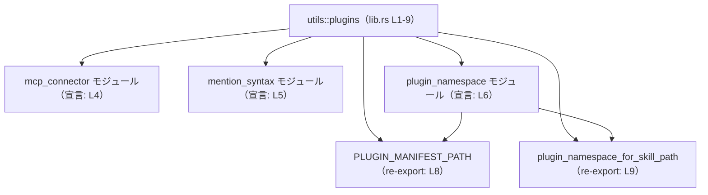

# utils/plugins/src/lib.rs（utils\plugins\src\lib.rs） コード解説

## 0. ざっくり一言

`utils/plugins/src/lib.rs` は、**プラグイン関連のサブモジュールをまとめ、いくつかの重要なシンボルを再エクスポートするクレートルート**です（根拠: `utils/plugins/src/lib.rs:L1-2, L4-6, L8-9`）。

---

## 1. このモジュールの役割

### 1.1 概要

- クレートレベルのドキュメントコメントにより、このクレートは  
  **プラグインパス解決・平文メンション用シジル・MCP コネクタヘルパー**を他の Codex クレートと共有する目的で存在していると記載されています（根拠: `utils/plugins/src/lib.rs:L1-2`）。
- 実装としては、このファイルは次の 3 つのサブモジュールを公開し（`pub mod`）、そのうち `plugin_namespace` から 2 つのシンボルを再エクスポートします（根拠: `utils/plugins/src/lib.rs:L4-6, L8-9`）。

### 1.2 アーキテクチャ内での位置づけ

このファイルは、`utils::plugins` クレート（もしくはモジュール）の「玄関口」として、サブモジュールと再エクスポートされたシンボルを外部に見せます。

- 外部クレート／モジュールからは、`utils::plugins` を経由して
  - `mcp_connector`
  - `mention_syntax`
  - `plugin_namespace`
  - `PLUGIN_MANIFEST_PATH`
  - `plugin_namespace_for_skill_path`
  にアクセスできるようになります（根拠: `utils/plugins/src/lib.rs:L4-6, L8-9`）。

#### 依存関係図（モジュールレベル）

次の図は、このファイルに現れるモジュール・再エクスポートの関係を表します。



※ `PLUGIN_MANIFEST_PATH` と `plugin_namespace_for_skill_path` は、`plugin_namespace` モジュール内で定義され、このファイルから `pub use` で再エクスポートされています（根拠: `utils/plugins/src/lib.rs:L6, L8-9`）。

### 1.3 設計上のポイント

このファイルから読み取れる設計上の特徴は次のとおりです。

- **ファサード（窓口）としての役割**  
  - サブモジュールを `pub mod` で公開しつつ、一部のシンボルを `pub use` で再エクスポートすることで、外部からの利用パスを簡略化しています（根拠: `utils/plugins/src/lib.rs:L4-6, L8-9`）。
- **状態を持たない**  
  - このファイル内には構造体・静的変数・関数定義は存在せず、実行時の状態は一切保持しません（根拠: `utils/plugins/src/lib.rs` 全体に `static` や関数定義が無い）。
- **エラーハンドリング・並行性コードは未登場**  
  - `async` / `await` や `unsafe`、スレッド関連 API の使用はなく、このファイル単体では安全性やエラーハンドリングに関するロジックは登場しません（根拠: `utils/plugins/src/lib.rs` 全体に該当キーワード無し）。
  - 実際の安全性・エラー処理・並行性はサブモジュール側に実装されていると考えられますが、このチャンクからは確認できません。

---

## 2. 主要な機能一覧

このファイルが直接提供する「ロジック」はありませんが、クレートレベルのドキュメントコメントとモジュール名から、次のような機能グループを公開していることが分かります。

- プラグインパス解決関連
  - `plugin_namespace` モジュールおよび `PLUGIN_MANIFEST_PATH` の再エクスポートが該当すると推測されます（根拠: `utils/plugins/src/lib.rs:L1-2, L6, L8`）。
- 平文メンションシジル関連
  - `mention_syntax` モジュールが担当していると考えられます（根拠: `utils/plugins/src/lib.rs:L1-2, L5`）。
- MCP コネクタヘルパー
  - `mcp_connector` モジュールが担当していると考えられます（根拠: `utils/plugins/src/lib.rs:L1-2, L4`）。

※ 具体的な関数・型の一覧や挙動は、このチャンクには現れていません。

---

## 3. 公開 API と詳細解説

### 3.1 型・モジュール・シンボル一覧（コンポーネントインベントリー）

このファイルに現れるコンポーネントの一覧です。

| 種別 | 名前 | 定義/宣言 | 役割 / 用途 | 根拠 |
|------|------|-----------|-------------|------|
| モジュール | `mcp_connector` | `pub mod mcp_connector;` | MCP コネクタ関連のヘルパー群を含むモジュールと想定されます。中身はこのチャンクには現れません。 | `utils/plugins/src/lib.rs:L4` |
| モジュール | `mention_syntax` | `pub mod mention_syntax;` | 「平文メンションシジル」に関する構文処理を行うモジュールと想定されます。中身は不明です。 | `utils/plugins/src/lib.rs:L1-2, L5` |
| モジュール | `plugin_namespace` | `pub mod plugin_namespace;` | プラグインの名前空間やパス解決に関する機能を持つモジュールと想定されます。 | `utils/plugins/src/lib.rs:L1-2, L6` |
| シンボル（定数/静的値の可能性） | `PLUGIN_MANIFEST_PATH` | `pub use plugin_namespace::PLUGIN_MANIFEST_PATH;` | プラグインマニフェストのパスまたはパス片を表す値と想定されます。型や具体的な値はこのチャンクには現れません。 | `utils/plugins/src/lib.rs:L8` |
| シンボル（関数/値のいずれか） | `plugin_namespace_for_skill_path` | `pub use plugin_namespace::plugin_namespace_for_skill_path;` | スキルのパスからプラグイン名前空間を求めるヘルパーのような名前ですが、シグネチャや型はこのチャンクには記載されていません。 | `utils/plugins/src/lib.rs:L8-9` |

> 「想定されます」と書いている箇所は、クレートレベルコメント（L1-2）とシンボル名からの推測であり、**実際の実装はこのチャンクからは確認できません**。

### 3.2 関数詳細（最大 7 件）

このファイル自身には関数定義が存在しません（`fn` キーワードが無いことから分かります）。  
ただし、`plugin_namespace` モジュール内の何らかのシンボル `plugin_namespace_for_skill_path` を **再エクスポート**していることが分かります（根拠: `utils/plugins/src/lib.rs:L6, L9`）。

このセクションでは、再エクスポートされた `plugin_namespace_for_skill_path` について、**このチャンクから確実に言えることだけ**をテンプレート形式で整理します。

#### `plugin_namespace_for_skill_path(...) -> ...`（再エクスポート）

**概要**

- `plugin_namespace` モジュール内で定義された `plugin_namespace_for_skill_path` を、このクレートのルートからそのまま公開するための再エクスポートです（根拠: `utils/plugins/src/lib.rs:L6, L9`）。
- 実際のシグネチャ（引数・戻り値）は、`plugin_namespace` モジュール側の定義を参照する必要があります。このチャンクには記載がありません。

**引数**

- 不明（このチャンクには関数定義が現れていません）。

**戻り値**

- 不明（このチャンクには関数定義が現れていません）。

**内部処理の流れ（アルゴリズム）**

- 実装は `plugin_namespace` モジュール内にあり、このファイルでは一切確認できません。

**Examples（使用例）**

このチャンク単体では正確な関数シグネチャが分からないため、**コンパイル可能な具体例を提示することはできません**。  
呼び出しコードの形だけを示すと、次のようなイメージになります。

```rust
// この例はあくまで「呼び出しパスの形」を示すものであり、
// 引数や戻り値の型・意味は plugin_namespace モジュールの定義に依存します。

use utils::plugins::plugin_namespace_for_skill_path; // 再エクスポート経由でインポート

fn example_usage() {
    // 実際の引数や使用方法は、このチャンクからは分かりません。
    // let ns = plugin_namespace_for_skill_path(/* skill path など */);
    // println!("namespace = {:?}", ns);
}
```

**Errors / Panics**

- このファイルにはエラー処理やパニック条件に関する情報はありません。
- 実際の `Result` / `Option` の有無やパニック条件は、`plugin_namespace` モジュール側の定義を確認する必要があります。

**Edge cases（エッジケース）**

- このチャンクからは、どのような入力がエッジケースになるか判断できません。

**使用上の注意点**

- **パスの取り方**  
  - 呼び出し側では、`utils::plugins::plugin_namespace_for_skill_path` というパスでインポートできるようになっています（根拠: `utils/plugins/src/lib.rs:L9`）。
- **詳細な契約は不明**  
  - 入力・出力・エラー契約は、このチャンクでは把握できないため、実際に利用する場合は `plugin_namespace` モジュールの定義・ドキュメントを参照する必要があります。

### 3.3 その他の関数

- このファイルには、その他の関数定義は存在しません（`fn` が出現しないことから判断できます）。

---

## 4. データフロー

このファイル自体はデータを直接処理しませんが、**シンボルの名前解決フロー**という観点での流れを示します。

1. 呼び出し元コードが `use utils::plugins::plugin_namespace_for_skill_path;` のようにインポートする。
2. Rust コンパイラは `utils::plugins` のクレートルート（この `lib.rs`）を読み込み、`pub use plugin_namespace::plugin_namespace_for_skill_path;` によって、そのシンボルが `plugin_namespace` モジュールから再エクスポートされていることを確認する（根拠: `utils/plugins/src/lib.rs:L6, L9`）。
3. 実際の関数本体は `plugin_namespace` モジュール内の定義が使われる。

### シーケンス図（名前解決の観点）

```mermaid
sequenceDiagram
    participant Caller as 呼び出し元クレート
    participant Plugins as utils::plugins<br/>lib.rs (L1-9)
    participant PluginNs as plugin_namespace<br/>モジュール

    Caller->>Plugins: use utils::plugins::plugin_namespace_for_skill_path
    Note right of Plugins: pub use plugin_namespace::plugin_namespace_for_skill_path;<br/>(L9)
    Plugins-->>Caller: シンボルの公開（再エクスポート）

    Caller->>PluginNs: plugin_namespace_for_skill_path(...) を呼び出し
    Note right of PluginNs: 実際の実装・データフローは<br/>このチャンクには現れない
```

この図から分かる通り、`lib.rs` は**コンパイル時の名前解決にのみ関与し、実行時のデータフローには直接登場しません。**

---

## 5. 使い方（How to Use）

### 5.1 基本的な使用方法

このクレートのルートを経由して、プラグイン関連のモジュールやシンボルをインポートするのが基本的な使い方です。

```rust
// プラグイン関連ユーティリティをまとめてインポートする例。
// 実際のクレート名（ここでは `utils` と仮定）は、プロジェクト設定によって異なります。

use utils::plugins::{
    PLUGIN_MANIFEST_PATH,          // plugin_namespace からの再エクスポート（L8）
    plugin_namespace_for_skill_path, // 同上（L9）
};
use utils::plugins::mcp_connector;    // サブモジュール自体をインポート（L4）
use utils::plugins::mention_syntax;   // メンション構文モジュール（L5）

fn main() {
    // PLUGIN_MANIFEST_PATH の具体的な型や値は、このチャンクからは分かりません。
    // println!("plugin manifest path = {:?}", PLUGIN_MANIFEST_PATH);

    // plugin_namespace_for_skill_path の具体的な使い方も、このチャンクからは不明です。
    // let ns = plugin_namespace_for_skill_path(/* 引数は plugin_namespace の定義に従う */);

    // mcp_connector や mention_syntax の中身も、別モジュールで定義されています。
}
```

> 上記コードは「インポートパスのパターン」を示す例であり、**具体的な引数や戻り値は別ファイルの定義に依存**します。

### 5.2 よくある使用パターン

このファイルから確実に読み取れる使用パターンは以下です。

- **再エクスポートされたシンボルの利用**
  - 呼び出し側は `utils::plugins::PLUGIN_MANIFEST_PATH` や `utils::plugins::plugin_namespace_for_skill_path` を直接インポートできます（根拠: `utils/plugins/src/lib.rs:L8-9`）。
- **サブモジュール単位での利用**
  - より詳細な API が必要な場合は `utils::plugins::mcp_connector` や `utils::plugins::mention_syntax` モジュールを `use` して、その内部の関数・型を利用します（根拠: `utils/plugins/src/lib.rs:L4-5`）。

### 5.3 よくある間違い

このファイルの構造から想定される典型的な誤りは、次のようなものです（一般的な Rust の再エクスポートパターンに基づく注意点です）。

```rust
// 誤解されがちな例（抽象的な例）
// plugin_namespace モジュール内の API を使いたいが、
// lib.rs 側の再エクスポートを見落として複雑なパスを使うケース。

// 例: より長いパスを使ってしまう（※実際にコンパイルエラーになるとは限りません）
// use utils::plugins::plugin_namespace::plugin_namespace_for_skill_path;

// シンプルな例（lib.rs の再エクスポートを利用）
use utils::plugins::plugin_namespace_for_skill_path;
```

- このクレートでは `plugin_namespace_for_skill_path` をルートから再エクスポートしているため、**より短いパスでインポートできる**ことに気づかず、冗長なパスを書く可能性があります（根拠: `utils/plugins/src/lib.rs:L6, L9`）。
- ただし、`plugin_namespace` モジュール自体も `pub mod` で公開されているため、長いパスがコンパイルエラーになるとは限りません。

### 5.4 使用上の注意点（まとめ）

- このファイルは**ロジックを持たず、モジュールとシンボルの公開を行うだけ**です（根拠: `utils/plugins/src/lib.rs` に関数や構造体が無い）。
- 実際の挙動・エラーハンドリング・並行性などは、`mcp_connector`・`mention_syntax`・`plugin_namespace` の各モジュール側で決まります。
- 再エクスポートされたシンボル（`PLUGIN_MANIFEST_PATH` など）の**契約（どういう値か、いつエラーになるか等）は、このファイルからは判断できない**ため、利用時には必ず元のモジュールの定義・ドキュメントを参照する必要があります。

---

## 6. 変更の仕方（How to Modify）

### 6.1 新しい機能を追加する場合

このファイルの役割は「モジュールの宣言と再エクスポート」です。新しいプラグイン関連機能を追加する場合の典型的な手順は次のようになります。

1. **サブモジュール側に実装を追加する**
   - 例: プラグイン名前空間関連であれば `plugin_namespace` モジュールに新しい関数・型を追加する。
   - このファイルからは、どのようなファイル構成で定義されているかは直接分かりませんが、`pub mod plugin_namespace;` で宣言されていることから、同一クレート内の別ファイルに実装があることだけは分かります（根拠: `utils/plugins/src/lib.rs:L6`）。

2. **外部から直接使わせたい API を再エクスポートする**
   - このファイルに `pub use plugin_namespace::新しいシンボル;` を追加します（`PLUGIN_MANIFEST_PATH` などと同じパターン）（根拠: `utils/plugins/src/lib.rs:L8-9`）。

3. **外部コードからの利用を確認する**
   - 呼び出し側が `utils::plugins::新しいシンボル` という短いパスで利用できることを確認します。

### 6.2 既存の機能を変更する場合

`lib.rs` 側を変更する場合に注意すべき点です。

- **再エクスポートの削除・名前変更**
  - `PLUGIN_MANIFEST_PATH` や `plugin_namespace_for_skill_path` の再エクスポートを削除または変更すると、それらを `utils::plugins` から直接参照しているすべての呼び出し元に影響します（根拠: `utils/plugins/src/lib.rs:L8-9`）。
- **サブモジュールの可視性**
  - `pub mod` を `mod` に変えると、外部クレートから該当モジュールが見えなくなります。逆に、新たに `pub mod` を追加すると公開 API が増えます（根拠: `utils/plugins/src/lib.rs:L4-6`）。
- **契約（前提条件・返り値の意味）**
  - このファイルでは契約は定義されず、**契約はすべてサブモジュール側の関数・型定義に依存**します。  
    そのため、仕様変更時は `lib.rs` だけでなく、サブモジュールの定義と、その利用箇所を必ず合わせて確認する必要があります。

---

## 7. 関連ファイル

このファイルと密接に関係すると分かるのは、ここで `pub mod` および `pub use` されているモジュールです。

| パス（推定/論理名） | 役割 / 関係 | 根拠 |
|---------------------|------------|------|
| `mcp_connector` モジュール（具体的なファイルパスはこのチャンクでは不明） | MCP コネクタヘルパーを提供するモジュールと考えられます。`lib.rs` から `pub mod mcp_connector;` で公開されています。 | `utils/plugins/src/lib.rs:L1-2, L4` |
| `mention_syntax` モジュール | 平文メンションシジル（mention sigils）に関する構文・パース等を扱うモジュールと考えられます。 | `utils/plugins/src/lib.rs:L1-2, L5` |
| `plugin_namespace` モジュール | プラグインの名前空間・マニフェストパスの扱いなどを提供するモジュールと考えられます。`PLUGIN_MANIFEST_PATH` と `plugin_namespace_for_skill_path` の定義元です。 | `utils/plugins/src/lib.rs:L1-2, L6, L8-9` |

> 具体的なファイル名（例: `utils/plugins/src/plugin_namespace.rs` など）は、Rust の標準的なモジュール規約から推測できますが、**このチャンクには明示されていないため断定できません**。

---

### Bugs / Security / Edge Cases について

- この `lib.rs` ファイル自体には**実行時ロジックが存在しないため、直接的なバグやセキュリティホール、エッジケースはほぼ発生しません**。
- 唯一注意が必要なのは、**再エクスポートのミス**（誤ったシンボルを `pub use` する、または削除する）による API 破壊であり、これはコンパイルエラーやリンクエラーとして顕在化することが多いと考えられます（根拠: `utils/plugins/src/lib.rs:L8-9`）。
- 実際のエラー処理・セキュリティ検証・エッジケース対応は、**サブモジュール側の責務**であり、このチャンクからは詳細を読み取れません。
