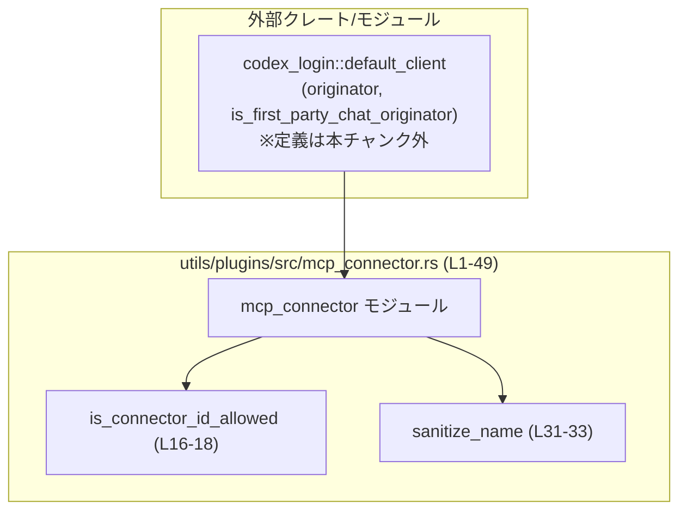
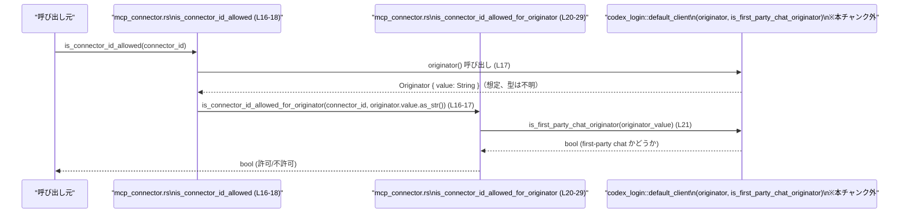
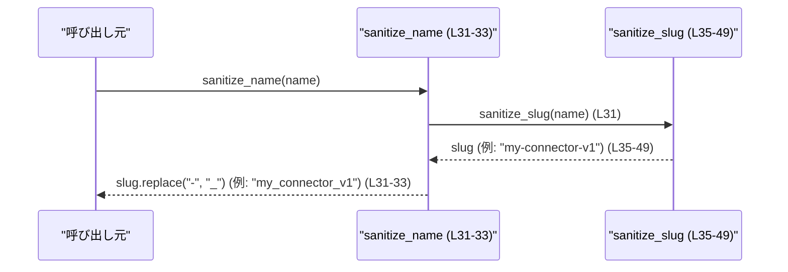

# utils/plugins/src/mcp_connector.rs コード解説

---

## 0. ざっくり一言

- コネクタ ID が利用可能かどうかを判定するフィルタ処理と、コネクタ名を安全な形式に正規化するユーティリティ関数群を提供するモジュールです（`mcp_connector.rs:L4-49`）。

---

## 1. このモジュールの役割

### 1.1 概要

- このモジュールは、外部サービス用の **コネクタ ID の許可判定** と、コネクタなどの **名前を安全なスラグ／識別子に変換する処理** を提供します。
- コネクタ ID の許可判定は、**発行元（originator）** に応じて使用禁止リストを切り替えます（`mcp_connector.rs:L16-29`）。
- 名前の正規化は、ASCII 英数字以外を記号に変換し、空文字列になった場合のデフォルト名を付与します（`mcp_connector.rs:L35-49`）。

### 1.2 アーキテクチャ内での位置づけ

このモジュールは、`codex_login::default_client` に依存し、現在の originator 情報に基づいて判定を行います（`mcp_connector.rs:L1-2, L16-24`）。呼び出し元はこのチャンクには現れません。



- `mcp_connector` は stateless な純粋関数群で構成され、状態保持は行っていません。
- originator の取得と種別判定のみ外部モジュールに依存します（`originator`, `is_first_party_chat_originator`）。

### 1.3 設計上のポイント

- **責務分離**  
  - ID 判定用関数群（`is_connector_id_allowed`, `is_connector_id_allowed_for_originator`）と、名前正規化関数群（`sanitize_name`, `sanitize_slug`）が明確に分かれています（`mcp_connector.rs:L16-33, L35-49`）。
- **定数によるポリシー定義**  
  - 使用禁止コネクタ ID とプレフィックスは定数として定義されており、コードとポリシーが直結しています（`mcp_connector.rs:L4-14`）。
- **外部依存のカプセル化**  
  - 呼び出し側は `is_connector_id_allowed` を使うだけで originator の詳細を意識せずに許可判定できます（`mcp_connector.rs:L16-18`）。
- **エラーハンドリング**  
  - すべての関数は常に成功する形で `bool` や `String` を返し、`Result` や `Option` は使っていません（`mcp_connector.rs:L16-18, L31-33, L35-49`）。
- **並行性**  
  - モジュール内では mutable なグローバル状態や `unsafe` は使用されておらず、純粋な文字列処理と定数参照のみです（`mcp_connector.rs:L4-49`）。
  - 外部の `originator()` などのスレッド安全性はこのチャンクには現れません（不明）。

---

## 2. 主要な機能一覧

- コネクタ ID 許可判定: 現在の originator に応じて、ID が使用禁止リストおよび禁止プレフィックスに一致しないかを判定する（`mcp_connector.rs:L16-29`）。
- 名前サニタイズ: 任意の文字列を ASCII 英数字とアンダースコアのみからなる安全な識別子に変換する（`mcp_connector.rs:L31-33, L35-49`）。

### 2.1 コンポーネント一覧（関数・定数インベントリー）

| 名称 | 種別 | 公開性 | 役割 / 用途 | 定義位置（根拠） |
|------|------|--------|-------------|-------------------|
| `DISALLOWED_CONNECTOR_IDS` | 定数スライス `&[&str]` | private | 一般 originator 用の使用禁止コネクタ ID リスト | `mcp_connector.rs:L4-11` |
| `FIRST_PARTY_CHAT_DISALLOWED_CONNECTOR_IDS` | 定数スライス `&[&str]` | private | first-party chat originator 用の使用禁止 ID リスト | `mcp_connector.rs:L12-13` |
| `DISALLOWED_CONNECTOR_PREFIX` | 定数 `&str` | private | 使用禁止コネクタ ID の共通プレフィックス | `mcp_connector.rs:L14` |
| `is_connector_id_allowed` | 関数 | `pub` | 現在の originator を取得し、コネクタ ID の使用可否を返すエントリポイント | `mcp_connector.rs:L16-18` |
| `is_connector_id_allowed_for_originator` | 関数 | private | originator の種別を明示的に受け取り、適切な禁止リストで判定を行うコアロジック | `mcp_connector.rs:L20-29` |
| `sanitize_name` | 関数 | `pub` | 名前をスラグ化した上で、`-` を `_` に変換した安全な識別子を返す | `mcp_connector.rs:L31-33` |
| `sanitize_slug` | 関数 | private | 名前を ASCII 英数字小文字と `-` のみからなるスラグに変換する内部関数 | `mcp_connector.rs:L35-49` |
| `is_first_party_chat_originator` | 関数（外部） | `pub`?（不明） | originator 文字列が first-party chat かどうかを判定する外部依存 | `mcp_connector.rs:L1, L21` |
| `originator` | 関数（外部） | `pub`?（不明） | 現在の originator を取得する外部依存 | `mcp_connector.rs:L2, L16-17` |

外部関数 `is_first_party_chat_originator` と `originator` の具体的な型や振る舞いは、このチャンクには現れません。

---

## 3. 公開 API と詳細解説

### 3.1 型一覧（構造体・列挙体など）

このモジュール内には、構造体や列挙体などの公開型は定義されていません（`mcp_connector.rs:L4-49`）。  
設定値やポリシーは、文字列スライスの定数として保持されています。

補助的なデータは以下の定数で表現されています：

| 名前 | 種別 | 役割 / 用途 | 定義位置 |
|------|------|-------------|----------|
| `DISALLOWED_CONNECTOR_IDS` | `&[&str]` | 一般 originator 用の禁止 ID 群 | `mcp_connector.rs:L4-11` |
| `FIRST_PARTY_CHAT_DISALLOWED_CONNECTOR_IDS` | `&[&str]` | first-party chat 用禁止 ID 群 | `mcp_connector.rs:L12-13` |
| `DISALLOWED_CONNECTOR_PREFIX` | `&str` | 一律禁止とする ID プレフィックス | `mcp_connector.rs:L14` |

### 3.2 関数詳細

#### `is_connector_id_allowed(connector_id: &str) -> bool`

**概要**

- コネクタ ID が利用可能かどうかを、**現在の originator に基づいて** 判定する公開関数です（`mcp_connector.rs:L16-18`）。
- 呼び出し元は originator を意識せずに、単に ID の可否だけを問い合わせることができます。

**引数**

| 引数名 | 型 | 説明 |
|--------|----|------|
| `connector_id` | `&str` | 判定対象のコネクタ ID 文字列 |

**戻り値**

- `bool`  
  - `true`: 許可されている ID（禁止プレフィックスで始まらず、禁止リストに含まれていない）。  
  - `false`: 禁止プレフィックスで始まる、または禁止リストに含まれている ID。

**内部処理の流れ**

1. 外部関数 `originator()` を呼び出して、現在の originator オブジェクトを取得します（`mcp_connector.rs:L17`）。
2. `originator().value.as_str()` で originator の文字列表現を取り出します（`mcp_connector.rs:L17`）。`value` の型はこのチャンクには現れません。
3. 内部関数 `is_connector_id_allowed_for_originator` に `connector_id` と `originator_value` を渡し、その結果（`bool`）をそのまま返します（`mcp_connector.rs:L16-18`）。

**Examples（使用例）**

```rust
// コネクタ ID が許可されているかを判定する例
let connector_id = "connector_1234567890abcdef"; // 判定したいコネクタID
let allowed = is_connector_id_allowed(connector_id); // bool が返る

if allowed {
    // 許可されている場合の処理
    // ここでコネクタを利用するなどの処理を行う
} else {
    // 禁止されている場合の処理
    // ログに出す、エラーメッセージを返すなど
}
```

**Errors / Panics**

- 関数シグネチャ上、`Result` などは返さず、常に `bool` を返します。
- 内部で呼び出しているのは文字列操作と外部関数呼び出しのみであり、このモジュール内には `panic!` や `unwrap` 等はありません（`mcp_connector.rs:L16-29`）。
- ただし、`originator()` および `is_first_party_chat_originator` の実装内容によるエラー・panic の可能性は、このチャンクからは不明です。

**Edge cases（エッジケース）**

- `connector_id` が空文字列 `""` の場合  
  - `starts_with(DISALLOWED_CONNECTOR_PREFIX)` は `false`（プレフィックスは `"connector_openai_"`）になり、禁止リストにも含まれないため `true` が返ります（`mcp_connector.rs:L27-28`）。
- `connector_id` が `DISALLOWED_CONNECTOR_PREFIX` で始まる場合  
  - `starts_with` が `true` となり、他の条件に関わらず `false` が返ります（`mcp_connector.rs:L27-28`）。
- `connector_id` が禁止リスト中のいずれかの ID と完全一致する場合  
  - `disallowed_connector_ids.contains(&connector_id)` が `true` となり、`false` が返ります（`mcp_connector.rs:L21-25, L28`）。

**使用上の注意点**

- originator に依存するため、同じ `connector_id` でも **originator が異なれば結果が変わる** 可能性があります（`mcp_connector.rs:L21-25`）。
- 空文字列やフォーマット不正な ID に対してもエラーにはならず、`bool` で結果が返るため、呼び出し側で入力チェックを別途行う必要があります。

---

#### `is_connector_id_allowed_for_originator(connector_id: &str, originator_value: &str) -> bool`

**概要**

- 指定された originator 文字列に対して、適切な禁止リストを選択し、コネクタ ID の使用可否を判定する内部関数です（`mcp_connector.rs:L20-29`）。
- `is_connector_id_allowed` の実質的なコアロジックを担います。

**引数**

| 引数名 | 型 | 説明 |
|--------|----|------|
| `connector_id` | `&str` | 判定対象のコネクタ ID |
| `originator_value` | `&str` | originator の文字列表現。外部から渡される情報で、このモジュールでは中身は解釈していません。 |

**戻り値**

- `bool`  
  - `true`: 許可されている ID。  
  - `false`: 禁止プレフィックスで始まる、または禁止リストに含まれている ID。

**内部処理の流れ**

1. `is_first_party_chat_originator(originator_value)` を呼び出し、originator が first-party chat かどうかを判定します（`mcp_connector.rs:L21`）。
2. 判定結果に応じて、使用する禁止 ID リストを切り替えます（`mcp_connector.rs:L21-25`）。
   - first-party chat の場合: `FIRST_PARTY_CHAT_DISALLOWED_CONNECTOR_IDS`（`mcp_connector.rs:L12-13`）
   - それ以外の場合: `DISALLOWED_CONNECTOR_IDS`（`mcp_connector.rs:L4-11`）
3. `connector_id.starts_with(DISALLOWED_CONNECTOR_PREFIX)` を評価し、禁止プレフィックスで始まるか確認します（`mcp_connector.rs:L27`）。
4. `disallowed_connector_ids.contains(&connector_id)` により、禁止 ID リストに含まれているか確認します（`mcp_connector.rs:L28`）。
5. 3, 4 のどちらでもなければ `true`、どちらか一方でも該当すれば `false` を返します（`mcp_connector.rs:L27-28`）。

**Examples（使用例）**

内部向け関数であり、このモジュール外からは直接呼び出されませんが、概念的な使用例を示します。

```rust
// originator が明示的にわかっている場合の利用イメージ
let originator_value = "first_party_chat";               // 例: 外部から渡されたoriginator文字列
let connector_id = "connector_2b0a9009c9c64bf9933a3dae3f2b1254";

let allowed = is_connector_id_allowed_for_originator(connector_id, originator_value);
// first-party chat originator かどうかに応じて、利用可否が決まる
```

※ 実際には `is_connector_id_allowed_for_originator` は `pub` ではないため、上記のような呼び出しは **このモジュール外では不可能** です（`mcp_connector.rs:L20`）。

**Errors / Panics**

- この関数自体は純粋な文字列比較しか行わず、`panic!` を発生させるコードは含まれていません（`mcp_connector.rs:L20-29`）。
- `is_first_party_chat_originator` の内部で何が起きるかは不明であり、このチャンクからはエラーや panic の有無を判断できません。

**Edge cases（エッジケース）**

- `originator_value` が空文字列や未知の値でも、`is_first_party_chat_originator` の返り値に従ってどちらかの禁止リストを使用します（`mcp_connector.rs:L21-25`）。
- `connector_id` が禁止リストに存在しなくても、禁止プレフィックスで始まる場合は `false` になります（`mcp_connector.rs:L27-28`）。
- 禁止リストに含まれる ID は **完全一致** 判定であり、部分一致は考慮していません（`contains(&connector_id)` 使用、`mcp_connector.rs:L28`）。

**使用上の注意点**

- 禁止リストは **静的な配列** であり、コードを変更しない限り実行時に動的に変更されません（`mcp_connector.rs:L4-13`）。
- originator の種別に応じて禁止リストが変わるため、「ある originator では禁止だが、別の originator では許可」という状況がありえます。この前提に依存したロジックを組む必要があります。

---

#### `sanitize_name(name: &str) -> String`

**概要**

- 任意の名前文字列を、安全に利用できる識別子（ASCII 英数字小文字とアンダースコア `_` のみ）に変換する公開関数です（`mcp_connector.rs:L31-33`）。
- 内部で `sanitize_slug` を呼び出し、`-` を `_` に置換します。

**引数**

| 引数名 | 型 | 説明 |
|--------|----|------|
| `name` | `&str` | 正規化対象の任意の名前文字列 |

**戻り値**

- `String`  
  - 変換後の安全な識別子。  
  - すべて小文字の ASCII 英数字または `_` のみで構成されます（`sanitize_slug` 内の処理と `replace` による、`mcp_connector.rs:L35-42, L31-33`）。

**内部処理の流れ**

1. `sanitize_slug(name)` を呼び出し、`name` を小文字の ASCII 英数字と `-` のみからなるスラグ文字列に変換します（`mcp_connector.rs:L31, L35-42`）。
2. 得られたスラグ文字列に対して `.replace("-", "_")` を適用し、`-` を `_` に置き換えます（`mcp_connector.rs:L31-33`）。
3. この結果を `String` として返します。

**Examples（使用例）**

```rust
// 英数字とスペースを含む名前のサニタイズ
let raw_name = "My Connector v1.0";
let safe_name = sanitize_name(raw_name);
// safe_name は "my_connector_v1_0" となる
```

```rust
// 日本語や記号だけの名前
let raw_name = "★テスト★";
let safe_name = sanitize_name(raw_name);
// sanitize_slug の結果が空になるため、safe_name は "app" となる
```

**Errors / Panics**

- 標準的な文字列操作のみで構成されており、`panic!` を呼び出すコードはありません（`mcp_connector.rs:L31-33, L35-49`）。
- メモリ不足によるアロケーション失敗など、標準ライブラリレベルのエラーは一般的な Rust プログラム同様にありえますが、このモジュール特有のものではありません。

**Edge cases（エッジケース）**

- `name` が空文字列 `""` の場合  
  - `sanitize_slug` 内で `normalized` は空になり、`trim_matches('-')` 後も空のため `"app"` が返されます（`mcp_connector.rs:L35-36, L44-47`）。最終的な戻り値も `"app"` です。
- `name` が ASCII 英数字のみの場合  
  - すべて小文字化され、`-` や `_` は追加されません。例: `"ABC123"` → `"abc123"`（`mcp_connector.rs:L37-40`）。
- `name` が非 ASCII 文字（日本語・絵文字など）のみの場合  
  - 各文字が `'-'` に変換され、両端の `'-'` が削除されるため中身が空になり、`"app"` が返されます（`mcp_connector.rs:L37-45`）。

**使用上の注意点**

- 生成される識別子は **一意性が保証されません**。異なる `name` から同じ `sanitize_name` 結果が得られる可能性があります（例: 全部非 ASCII の別名同士 → `"app"`）。
- 非 ASCII 文字を多用する環境では、多くの名前が `"app"` に潰れてしまう可能性があり、識別のためには元の名前も別途保持する必要があります。

---

#### `sanitize_slug(name: &str) -> String`

**概要**

- 内部向けの関数で、任意の名前をスラグ（URL 等で使われる簡易な識別子）形式に変換します（`mcp_connector.rs:L35-49`）。
- ASCII 英数字以外の文字を `'-'` に置き換え、小文字化し、両端の `'-'` を削除します。結果が空なら `"app"` を返します。

**引数**

| 引数名 | 型 | 説明 |
|--------|----|------|
| `name` | `&str` | スラグ化対象の文字列 |

**戻り値**

- `String`  
  - 小文字の ASCII 英数字と `-` のみからなるスラグ。  
  - 全て削除された場合は `"app"`。

**内部処理の流れ**

1. `String::with_capacity(name.len())` で `name` の長さ分の容量を持つ `normalized` を確保します（`mcp_connector.rs:L36`）。
2. `name.chars()` で文字ごとのループを行い（`mcp_connector.rs:L37`）:
   - `character.is_ascii_alphanumeric()` が `true` のとき: `character.to_ascii_lowercase()` を `normalized` に追加（`mcp_connector.rs:L38-40`）。
   - それ以外のとき: `'-'` を追加（`mcp_connector.rs:L41-42`）。
3. ループ終了後、`normalized.trim_matches('-')` で先頭と末尾の `'-'` を削除し、新しい `&str` を得てから再度 `normalized` という変数名で束縛しなおします（`mcp_connector.rs:L44`）。
4. `normalized.is_empty()` をチェックし、空なら `"app".to_string()` を返し、そうでなければ `normalized.to_string()` を返します（`mcp_connector.rs:L45-48`）。

**Examples（使用例）**

```rust
// 内部処理の挙動確認用の例（実際には sanitize_name を使う想定）
let slug = sanitize_slug("Hello, World!");
// "hello--world-" → trim で "hello--world" となる
// 戻り値は "hello--world"
```

**Errors / Panics**

- 通常の文字列処理のみで構成されており、この関数固有の panic はありません（`mcp_connector.rs:L35-49`）。

**Edge cases（エッジケース）**

- 連続する非 ASCII 文字や記号  
  - 連続する `'-'` がそのまま残る可能性があります（中間部分は `trim_matches` の対象外）。例: `"a$$b"` → `"a--b"`（`mcp_connector.rs:L37-42, L44`）。
- すべて非 ASCII or 記号の場合  
  - すべて `'-'` になり、`trim_matches('-')` で空文字となるため `"app"` を返します（`mcp_connector.rs:L44-47`）。

**使用上の注意点**

- この関数は `sanitize_name` からのみ利用されており（`mcp_connector.rs:L31`）、外部から直接利用できません。
- 生成されるスラグは `-` を含む形のままであり、最終的な識別子としては `sanitize_name` を通して `_` に置き換えるのが前提と考えられます（コード上の呼び出し関係からの解釈）。

### 3.3 その他の関数

- 上記 4 関数以外の関数は、このチャンクには存在しません。

---

## 4. データフロー

### 4.1 コネクタ ID 許可判定のフロー

`is_connector_id_allowed` を呼び出したときの主要なデータフローを示します。



- originator に依存した禁止リストの選択は `MCP2` 内で行われます（`mcp_connector.rs:L21-25`）。
- 禁止プレフィックス／ID による判定結果がそのまま呼び出し元に返されます（`mcp_connector.rs:L27-28`）。

### 4.2 名前サニタイズのフロー



- 実際の文字種チェックとデフォルト `"app"` の決定は `sanitize_slug` 側で行われます（`mcp_connector.rs:L35-49`）。
- `sanitize_name` は後処理として `-` → `_` 変換のみを担当します。

---

## 5. 使い方（How to Use）

### 5.1 基本的な使用方法

#### コネクタ ID の許可判定

```rust
use utils::plugins::mcp_connector::is_connector_id_allowed; // 実際のパスはプロジェクト構成に依存（このチャンクには不明）

fn use_connector(connector_id: &str) {
    // 現在のoriginatorに応じて、このIDが許可されるかを確認する
    if is_connector_id_allowed(connector_id) {
        // 許可されている場合の利用処理
        // 例: コネクタへの接続を開始する
    } else {
        // 禁止されている場合の処理
        // 例: ログ出力やユーザーへのエラー表示など
    }
}
```

#### 名前のサニタイズ

```rust
use utils::plugins::mcp_connector::sanitize_name; // 実際のパスはこのチャンクでは不明

fn create_connector(name: &str) {
    // 任意の表示名から、安全な内部名を生成する
    let internal_name = sanitize_name(name);

    // internal_name をキーやIDとして利用する
    // 例: データベースのカラム名やファイル名に使うなど
}
```

### 5.2 よくある使用パターン

- **UI から入力されたコネクタ名をサニタイズして内部 ID にする**  
  - `sanitize_name` で内部 ID を生成し、表示には元の `name` を使う。
- **コネクタ登録時に ID 許可判定を行う**  
  - 登録前に `is_connector_id_allowed` を呼び、禁止 ID であれば登録を拒否する。

### 5.3 よくある間違い

```rust
// 間違い例: sanitize_slug を直接使おうとする（private のためコンパイルエラー）
/*
let slug = sanitize_slug("My Connector");
*/

// 正しい例: 公開API sanitize_name を使用する
let safe_name = sanitize_name("My Connector");
// "my_connector" のような安全な識別子が得られる
```

```rust
// 間違い例: is_connector_id_allowed が "バリデーション" も兼ねていると想定する
let connector_id = ""; // 空文字でもエラーにはならない
let allowed = is_connector_id_allowed(connector_id);
// allowed は true になりうるため、「空文字は不正」というチェックは別途必要

// 正しい例: フォーマットチェックや空チェックは別で行う
fn is_valid_connector_id_format(id: &str) -> bool {
    !id.is_empty() // 例: 最低限のチェック
}

if is_valid_connector_id_format(connector_id) && is_connector_id_allowed(connector_id) {
    // フォーマットもポリシーもOK
}
```

### 5.4 使用上の注意点（まとめ）

- `is_connector_id_allowed` は **フォーマットの妥当性** はチェックせず、禁止リストとプレフィックスのみを見ています（`mcp_connector.rs:L27-28`）。
- `sanitize_name` は非 ASCII 名を `"app"` に潰す可能性があるため、ユーザーに見せる名称としては元の文字列を残しておく必要があります（`mcp_connector.rs:L35-47`）。
- 本モジュールはスレッドセーフと考えられます（不変な定数とローカル変数のみを使用、`mcp_connector.rs:L4-49`）。ただし、`originator()` のスレッド安全性はこのチャンクからは不明です。

---

## 6. 変更の仕方（How to Modify）

### 6.1 新しい機能を追加する場合

例: 新しい種類の originator 向けに別の禁止リストを導入したい場合。

1. 新しい禁止リスト用の定数スライスを追加する。  
   例: `const NEW_ORIGINATOR_DISALLOWED_CONNECTOR_IDS: &[&str] = &["connector_xxx", ...];`（追加位置は既存定数付近、`mcp_connector.rs:L4-14` 周辺）。
2. `is_connector_id_allowed_for_originator` 内で originator の種別を判定し、新たな禁止リストを選択する分岐を追加する（`mcp_connector.rs:L21-25` 付近を拡張）。
3. 必要に応じて、`is_first_party_chat_originator` と同様のヘルパーを外部から提供するか、この関数内で originator の値を直接比較する（後者を行う場合は、このモジュールの責務が増える点に注意）。

### 6.2 既存の機能を変更する場合

- **禁止 ID の追加・削除**  
  - `DISALLOWED_CONNECTOR_IDS` および `FIRST_PARTY_CHAT_DISALLOWED_CONNECTOR_IDS` の配列に対して行います（`mcp_connector.rs:L4-13`）。
  - 既存の ID を削除すると、過去に禁止していたコネクタが許可されるようになるため、利用箇所との整合性が必要です。
- **禁止プレフィックスの変更**  
  - `DISALLOWED_CONNECTOR_PREFIX` を変更すると、プレフィックスマッチによって禁止される ID 範囲が大きく変わります（`mcp_connector.rs:L14, L27`）。
- **識別子生成ルールの変更**  
  - 許可する文字種を増やしたい場合は `sanitize_slug` 内の `is_ascii_alphanumeric` 判定や、`-` を追加する部分を変更します（`mcp_connector.rs:L37-42`）。
  - `"app"` というデフォルト名を変更する場合は、`sanitize_slug` の `if normalized.is_empty()` ブロックを変更します（`mcp_connector.rs:L45-47`）。

変更時には、既存のコネクタ ID や生成済み識別子との互換性・移行戦略を別途検討する必要があります（このチャンクにはマイグレーション処理は現れません）。

---

## 7. 関連ファイル

このモジュールと密接に関係する外部モジュールは、インポートから次のように読み取れます。

| パス / モジュール | 役割 / 関係 | 根拠 |
|-------------------|-------------|------|
| `codex_login::default_client::originator` | 現在の originator 情報を取得するための外部依存。`is_connector_id_allowed` 内で使用される。型や詳細な挙動はこのチャンクには現れません。 | `mcp_connector.rs:L2, L16-17` |
| `codex_login::default_client::is_first_party_chat_originator` | originator が first-party chat かどうかを判定する外部関数。禁止 ID リストの選択に利用されます。 | `mcp_connector.rs:L1, L21` |

このチャンクにはテストコード（例: `tests` モジュールや別ファイルのテスト）は現れておらず、どのようにテストされているかは不明です。
