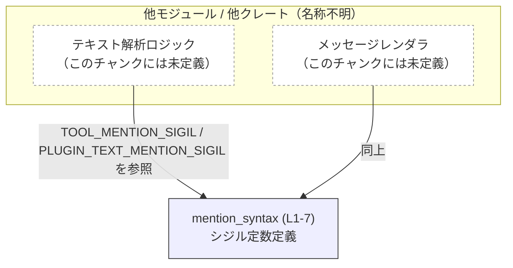
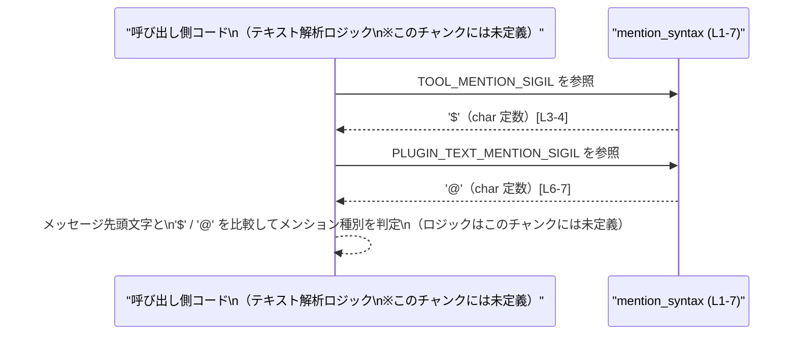

# utils/plugins/src/mention_syntax.rs

## 0. ざっくり一言

このモジュールは、プレーンテキスト中でツールおよびプラグインをメンションするときに使う「シジル（接頭記号）」を、`char` の公開定数として定義する役割を持ちます。[mention_syntax.rs:L1-7]

---

## 1. このモジュールの役割

### 1.1 概要

- モジュール先頭のドキュコメントに「Sigils for tool/plugin mentions in plaintext (shared across Codex crates).」とあり、ツールとプラグインのメンション用シジルを共通化するためのモジュールであると読み取れます。[mention_syntax.rs:L1]
- 具体的には、ツール用に `'$'`、プラグイン用に `'@'` という 2 つの `char` 定数を公開しています。[mention_syntax.rs:L3-4, L6-7]

### 1.2 アーキテクチャ内での位置づけ

このモジュール自身は他モジュールを参照せず、グローバルに利用される定数の定義のみを行う「下位ユーティリティ」として振る舞っています。[mention_syntax.rs:L3-4, L6-7]  
コメントから、複数の Codex 関連クレートから参照される想定であることだけが分かります。[mention_syntax.rs:L1]  

概念的な依存関係（※呼び出し元の具体名はこのチャンクには現れません）を Mermaid 図で示します。



> 注意: A/B は「参照していると推測しやすい典型的コンポーネント」を示す概念ノードであり、**このファイルのコードには現れません**。実際にどのモジュールが参照しているかは、このチャンクからは分かりません。

### 1.3 設計上のポイント

- **ステートレス**  
  - 2 つの `pub const` 定数のみで構成され、内部状態や可変データは持ちません。[mention_syntax.rs:L3-4, L6-7]
- **コンパイル時定数**  
  - `const` で定義されているため、参照側ではインライン展開され、ランタイムオーバーヘッドが発生しません。[mention_syntax.rs:L3-4, L6-7]
- **明示的な意味づけ付きコメント**  
  - 各定数には「ツール用のデフォルトのシジル」「TUI の外でリンクされたプレーンテキスト中のプラグインメンション用」という用途がコメントとして付いています。[mention_syntax.rs:L3, L6]
- **エラーや並行性の懸念がない構造**  
  - 読み出し専用のスカラー定数のみであり、エラーハンドリングやスレッド安全性を意識する必要はありません。[mention_syntax.rs:L3-4, L6-7]

---

## 2. 主要な機能一覧

このモジュールが提供する「機能」は、2 つの公開定数です。

- `TOOL_MENTION_SIGIL`: ツールをメンションする際のデフォルトのプレーンテキストシジル `'$'` を提供します。[mention_syntax.rs:L3-4]
- `PLUGIN_TEXT_MENTION_SIGIL`: TUI 外のリンク付きプレーンテキスト中でプラグインメンションに使用するシジル `'@'` を提供します。[mention_syntax.rs:L6-7]

---

## 3. 公開 API と詳細解説

### 3.1 コンポーネント一覧（定数）

このファイルには構造体・列挙体・関数は定義されておらず、2 つの公開定数のみが定義されています。[mention_syntax.rs:L1-7]

| 名前 | 種別 | 型 | 役割 / 用途 | 定義位置（根拠） |
|------|------|----|-------------|------------------|
| `TOOL_MENTION_SIGIL` | 定数 | `char` | ツールをメンションするときに先頭に付けるプレーンテキスト用シジル。デフォルトで `'$'` に設定されています。 | mention_syntax.rs:L3-4 |
| `PLUGIN_TEXT_MENTION_SIGIL` | 定数 | `char` | TUI 外のリンク付きプレーンテキスト中でプラグインメンションに使うシジル。`'@'` に設定されています。 | mention_syntax.rs:L6-7 |

#### 型・安全性・エラー・並行性の観点

- 型が `char` のため、「1 文字の Unicode スカラ値」を表します。[mention_syntax.rs:L3-4, L6-7]
- `pub const` の読み取りはスレッドセーフであり、データ競合やロックなどの並行性問題は発生しません。
- このモジュール内には関数呼び出しや I/O、パース処理などが含まれないため、エラーを返したり panic したりするコードは存在しません。[mention_syntax.rs:L1-7]

### 3.2 関数詳細

このファイルには関数定義は存在しません。[mention_syntax.rs:L1-7]

### 3.3 その他の関数

なし（関数自体が未定義です）。[mention_syntax.rs:L1-7]

---

## 4. データフロー

このモジュールは定数しか持たないため、モジュール内部でのデータの流れはありません。[mention_syntax.rs:L3-4, L6-7]  
代わりに、**典型的な利用シナリオ** におけるデータフロー（概念図）を示します。

### 4.1 典型シナリオの説明

想定されるシナリオの一例:

1. あるテキスト解析モジュールがユーザーからのメッセージを受け取る。
2. メッセージ先頭文字を確認し、`TOOL_MENTION_SIGIL` または `PLUGIN_TEXT_MENTION_SIGIL` と一致するかを比較する。
3. 一致した場合、その後続の文字列をツール名またはプラグイン名として解釈する。

このとき、mention_syntax モジュールは単に「定義済みのシジル値」を提供するだけで、処理ロジックは呼び出し側にあります（処理ロジックはこのチャンクには現れません）。

### 4.2 シーケンス図（概念）



> 図中の呼び出し側 `C` は概念上のコンポーネントであり、実際のモジュール名や関数名はこのファイルからは分かりません。

---

## 5. 使い方（How to Use）

### 5.1 基本的な使用方法

以下は、メッセージ先頭がツール or プラグインメンションかどうかを判定する例です。  
パスはプロジェクト構成に依存するため、`your_crate::mention_syntax` という仮のモジュールパスを用いています。

```rust
// 実際のクレート名・モジュールパスはプロジェクト構成に合わせて変更する
use your_crate::mention_syntax::{
    TOOL_MENTION_SIGIL,           // ツールメンション用のシジル '$'
    PLUGIN_TEXT_MENTION_SIGIL,    // プラグインメンション用のシジル '@'
};

fn classify_mention(message: &str) -> Option<&str> {
    // メッセージの先頭文字を取得する
    let mut chars = message.chars();               // 文字イテレータを作成
    let first = chars.next()?;                    // 先頭の char を取り出す。なければ None を返す

    if first == TOOL_MENTION_SIGIL {              // '$' で始まっているかどうかを判定
        // 残りをツール名として返す
        Some(chars.as_str())                      // 先頭以降のサブ文字列を返す
    } else if first == PLUGIN_TEXT_MENTION_SIGIL {// '@' で始まっているかどうかを判定
        // 残りをプラグイン名として返す
        Some(chars.as_str())
    } else {
        None                                      // シジルが付いていない場合はメンションではないとみなす
    }
}
```

この例では、定数は読み取り専用の `char` であり、所有権・借用など Rust 特有の所有権問題は発生しません。

### 5.2 よくある使用パターン

1. **パーサでのシジル判定**

   - テキストパーサやコマンドパーサ内で、先頭文字の判定に使用する。
   - 上記の `classify_mention` のように `chars().next()` との比較に利用されるケースが典型的です。

2. **表示ヘルプやドキュメント生成での利用**

   - ユーザー向けのヘルプテキストを生成する際に、メンション書式を示すために定数値を埋め込む。
   - 例: `format!("ツールメンションは '{}' に続けてツール名を記述します", TOOL_MENTION_SIGIL)` のような使い方。

### 5.3 よくある間違い（想定）

このモジュール自体に誤用を誘発する仕掛けはありませんが、典型的に起こりやすいミスとして以下が考えられます。

```rust
// 誤り例: 文字列リテラル（&str）と char の混同
if first == "$" {                    // "$" は &str 型
    /* ... */
}

// 正しい例: char リテラルを使うか、定数を使う
if first == TOOL_MENTION_SIGIL {     // 定数は char 型 [L3-4]
    /* ... */
}
```

- `TOOL_MENTION_SIGIL` / `PLUGIN_TEXT_MENTION_SIGIL` はいずれも `char` 型であり、`&str` との比較はコンパイルエラーになります。[mention_syntax.rs:L3-4, L6-7]

### 5.4 使用上の注意点（まとめ）

- **型整合性**:  
  - 定数は `char` 型のため、比較対象も `char` にする必要があります。`String` や `&str` と比較する場合は、先頭の `char` を取り出してから比較します。
- **定数値の変更の影響範囲**:  
  - `'$', '@'` のどちらかを変更すると、この定数を前提に実装されているすべてのロジックの挙動が変わります。このファイル単体では影響範囲を特定できないため、参照先のコード全体を検索して確認する必要があります（影響範囲はこのチャンクには現れません）。
- **エラー / パニック**:  
  - このモジュールの利用そのものがエラーや panic を直接引き起こすことはありません。[mention_syntax.rs:L1-7]

---

## 6. 変更の仕方（How to Modify）

### 6.1 新しい機能を追加する場合

たとえば、新たな種類のメンション（例: ユーザーメンション用シジル）を追加したい場合は、同様の `pub const` を追加する形になると考えられます。

1. **新しい定数の追加**（例: ユーザーメンション用）

   ```rust
   /// Users use `#` in plaintext.
   pub const USER_MENTION_SIGIL: char = '#';
   ```

   - 上記はあくまで記述パターンの例であり、実際にこの定数が存在するわけではありません。
   - 実際に追加する際は、用途を説明するコメントを付けると、このファイルの既存スタイルと揃います。

2. **呼び出し側での対応**  
   - 新しい定数を利用するロジック（パーサ、レンダラなど）を追加・変更します。
   - どのファイルを触るか、どのように利用するかはこのチャンクからは分かりません。

### 6.2 既存の機能を変更する場合

`'$'` や `'@'` を別の記号に変更したい場合の注意点:

- **影響範囲の確認**  
  - `TOOL_MENTION_SIGIL` / `PLUGIN_TEXT_MENTION_SIGIL` を参照しているすべての箇所（このチャンクには現れない）を検索し、仕様上問題がないか確認する必要があります。
- **プロトコル / ドキュメントとの整合性**  
  - 既に外部仕様・API・ドキュメントでシジルが公開されている場合、それらも更新する必要があります。
- **Tests**  
  - このファイル自体にはテストは含まれていませんが、呼び出し側のテストはシジルに依存している可能性があります。変更後にテストを再実行して挙動を確認する必要があります。

---

## 7. 関連ファイル

このチャンクには、`mention_syntax.rs` 以外のファイルパスやモジュール参照は一切現れません。[mention_syntax.rs:L1-7]  
したがって、「密接に関係する具体的なファイル」は特定できません。

| パス | 役割 / 関係 |
|------|------------|
| `utils/plugins/src/mention_syntax.rs` | ツールおよびプラグインメンション用のシジルを定義する共通モジュール。各種 Codex 関連クレートから参照される想定であることがコメントから読み取れます。[mention_syntax.rs:L1-7] |

---

### Bugs / Security / Contracts / Edge Cases / Tests / Performance / Observability まとめ

- **Bugs**:  
  - このファイルは単純な `pub const char` 定義のみであり、論理バグ・ランタイムバグにつながる処理は含まれていません。[mention_syntax.rs:L3-4, L6-7]
- **Security**:  
  - 入力処理や I/O、外部とのやり取りはなく、セキュリティ上のリスク要因は確認できません。
- **Contracts（契約）**:  
  - 「`TOOL_MENTION_SIGIL` はツール用のシジルである」「`PLUGIN_TEXT_MENTION_SIGIL` はプラグイン用である」という意味づけがコメントにより与えられています。[mention_syntax.rs:L3, L6]
- **Edge Cases**:  
  - 定数自体にはエッジケースはありませんが、利用側では「メッセージが空」「先頭がシジルでない」などのケースを明示的に扱う必要があります（これは呼び出し側の責務であり、このファイルには記述されていません）。
- **Tests**:  
  - このファイルにはテストコードは含まれていません。[mention_syntax.rs:L1-7]
- **Performance / Scalability**:  
  - コンパイル時定数の読み取りのみであり、パフォーマンスやスケーラビリティ上の懸念はありません。
- **Observability**:  
  - ログ出力やメトリクスなどの観測機構は含まれていません。[mention_syntax.rs:L1-7]
