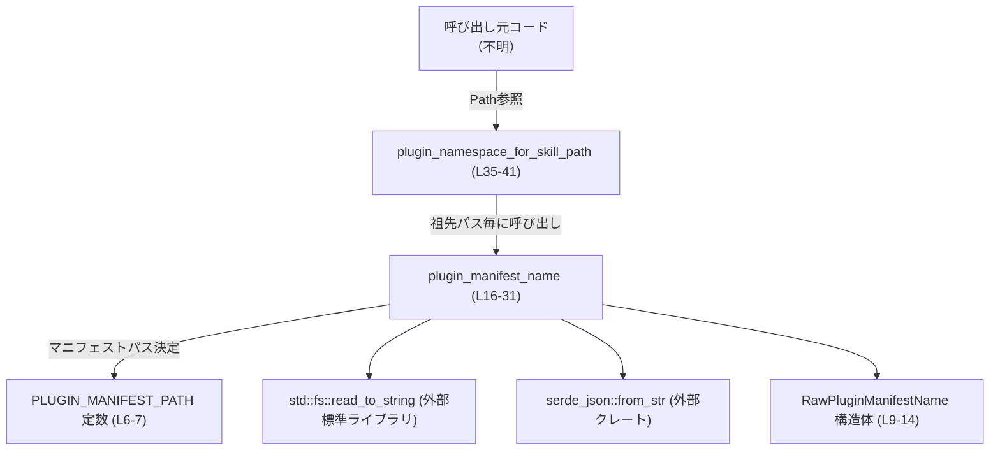
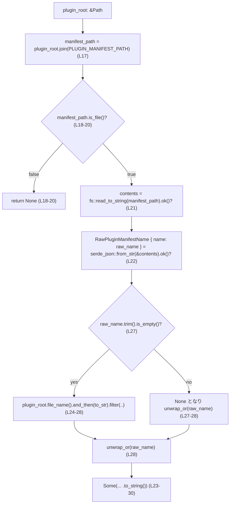

# utils/plugins/src/plugin_namespace.rs コード解説

## 0. ざっくり一言

プラグインのスキルファイルのパスから、祖先ディレクトリを遡って `.codex-plugin/plugin.json` を探索し、マニフェストに記載された `name`（またはディレクトリ名）を「プラグインのネームスペース」として解決するモジュールです（`plugin_namespace.rs:L1-7, L16-31, L33-41`）。

---

## 1. このモジュールの役割

### 1.1 概要

- このモジュールは、**任意のファイルパスが属するプラグインの論理名（ネームスペース）を知りたい**という問題を解決するために存在しています。
- プラグインのルートディレクトリ直下の `.codex-plugin/plugin.json` をマニフェストとみなし、その `name` フィールド（空の場合はディレクトリ名）をプラグイン名として返します（`plugin_namespace.rs:L6-7, L16-31`）。
- 公開 API は `plugin_namespace_for_skill_path` 1 つで、これはスキルファイルなどのパスから最寄りのプラグイン名を `Option<String>` で返します（`plugin_namespace.rs:L33-41`）。

### 1.2 アーキテクチャ内での位置づけ

このファイル内での依存関係と、外部との関係を簡略化した図です。



- 外部からは `plugin_namespace_for_skill_path` のみが呼び出されます（`pub fn`、`plugin_namespace.rs:L35`）。
- `plugin_namespace_for_skill_path` は内部関数 `plugin_manifest_name` を利用して、個々の祖先パスからプラグイン名を取得します（`plugin_namespace.rs:L36-38`）。
- ファイル I/O と JSON デシリアライズは `std::fs::read_to_string` と `serde_json::from_str` に委譲されています（`plugin_namespace.rs:L21-22`）。

### 1.3 設計上のポイント

- **状態を持たない純粋な関数群**  
  - グローバルな可変状態は保持しておらず、引数の `Path` とファイルシステムの状態のみから結果を導きます（`plugin_namespace.rs:L16-41`）。
- **エラーを `Option` で吸収**  
  - マニフェストファイルが存在しない・読み取れない・JSON が不正・`name` フィールドが欠落している、といったケースはすべて `None` として扱われます（`ok()?` と `Option` チェーン、`plugin_namespace.rs:L18, L21-22`）。
- **ネームスペース名の決定ルール**  
  - マニフェストの `name` が空文字または空白のみの場合は、プラグインルートディレクトリのベース名を使い、それ以外は `name` を優先します（`plugin_namespace.rs:L21-29`）。
- **階層探索**  
  - 与えられたパスからファイルシステムのルートまで `Path::ancestors` で遡りながら、最初に発見できた妥当なマニフェストのみを採用します（`plugin_namespace.rs:L35-41`）。
- **並行性**  
  - 関数内部に共有可変状態はなく、複数スレッドから同時に呼び出しても Rust の型システム上は安全です。ただしファイルシステムが同時に変更される場合の結果は OS 依存です（コードにロック等はありません）。

---

## 2. 主要な機能一覧（コンポーネントインベントリー）

このファイル内の主なコンポーネントをまとめます。

| 名前 | 種別 | 公開範囲 | 役割 / 用途 | 根拠 |
|------|------|----------|-------------|------|
| `PLUGIN_MANIFEST_PATH` | 定数 `&'static str` | `pub` | プラグインルートからマニフェストまでの相対パス `.codex-plugin/plugin.json` を表現します。 | `plugin_namespace.rs:L6-7` |
| `RawPluginManifestName` | 構造体 | モジュール内限定 (`struct`) | JSON マニフェストから `name` フィールドだけを取り出すための一時的な型です。`serde::Deserialize` を実装しています。 | `plugin_namespace.rs:L9-14` |
| `plugin_manifest_name` | 関数 | モジュール内限定 (`fn`) | 指定ディレクトリをプラグインルートとみなし、そのマニフェストを読み取ってプラグイン名を返します。 | `plugin_namespace.rs:L16-31` |
| `plugin_namespace_for_skill_path` | 関数 | 公開 (`pub fn`) | 任意のパスについて、最寄りの祖先ディレクトリのプラグイン名（ネームスペース）を返します。本モジュールのメイン公開 API です。 | `plugin_namespace.rs:L33-41` |
| `tests::uses_manifest_name` | テスト関数 | テストモジュール内 | 実ファイルを使って、マニフェストの `name` がそのままネームスペースとして使われることを検証します。 | `plugin_namespace.rs:L44-69` |

---

## 3. 公開 API と詳細解説

### 3.1 型一覧（構造体など）

| 名前 | 種別 | 役割 / 用途 | 主なフィールド | 根拠 |
|------|------|-------------|----------------|------|
| `RawPluginManifestName` | 構造体（`serde::Deserialize`） | プラグインマニフェスト JSON から `name` フィールドを読み出すための内部用型です。`name` が指定されない場合は空文字列になります。 | `name: String`（`#[serde(default)]` により JSON 欠落時は空文字） | `plugin_namespace.rs:L9-14` |

> JSON 側のフィールド名は `camelCase` に変換される設定ですが、この構造体では `name` しかないため、そのまま `name` を受け取ります（`#[serde(rename_all = "camelCase")]`、`plugin_namespace.rs:L10`）。

### 3.2 関数詳細

#### `plugin_namespace_for_skill_path(path: &Path) -> Option<String>`

**概要**

- 与えられたパス（スキルファイル・ディレクトリなど）の祖先ディレクトリをルートまで遡り、最初に見つかった有効なプラグインマニフェストの `name` を返します（`plugin_namespace.rs:L33-41`）。
- マニフェストが見つからない、あるいは読み取り・パースに失敗した場合は `None` を返します。

**引数**

| 引数名 | 型 | 説明 |
|--------|----|------|
| `path` | `&Path` | 起点となるファイルもしくはディレクトリのパス。絶対パス・相対パスどちらでも構いません（`Path::ancestors` を使用）。 |

**戻り値**

- `Option<String>`  
  - `Some(name)` : 祖先のいずれかに有効なマニフェストが存在し、そのルールに従って決定されたプラグイン名。  
  - `None` : 祖先のどこにも有効なマニフェストが存在しない、またはすべてのマニフェストが読み取り・パースに失敗した場合。

**内部処理の流れ**

1. `path.ancestors()` により、`path` 自身を含む祖先パスのイテレータを取得します（`plugin_namespace.rs:L36`）。
2. 各祖先 `ancestor` について、内部関数 `plugin_manifest_name(ancestor)` を呼び出します（`plugin_namespace.rs:L37`）。
3. `plugin_manifest_name` が `Some(name)` を返した最初の祖先で、その `name` をそのまま返して関数を終了します（`plugin_namespace.rs:L37-38`）。
4. すべての祖先で `None` だった場合、`None` を返します（`plugin_namespace.rs:L40-41`）。

```mermaid
flowchart TD
    A["path: &Path"] --> B["ancestors() で祖先列挙 (L36)"]
    B --> C{"各 ancestor に対し<br/>plugin_manifest_name(L37)"}
    C -->|Some(name)| D["name を返して終了 (L37-38)"]
    C -->|None (全て)| E["None を返す (L40-41)"]
```

**Examples（使用例）**

単純な利用例（テストコードを単純化）です。

```rust
use std::path::Path;
use utils::plugins::plugin_namespace::plugin_namespace_for_skill_path; // 実際のパスはプロジェクト構成による

fn main() {
    // プロジェクト内のスキルファイルへのパスを仮定
    let skill_path = Path::new("plugins/sample/skills/search/SKILL.md");

    // 祖先を辿って .codex-plugin/plugin.json を探し、プラグイン名を取得
    if let Some(namespace) = plugin_namespace_for_skill_path(skill_path) {
        println!("plugin namespace: {}", namespace);
    } else {
        println!("plugin manifest not found");
    }
}
```

- この例では、`plugins/sample/.codex-plugin/plugin.json` に有効なマニフェストが存在すれば、その `name`（または名称ルールに基づく名前）が表示されます。

**Errors / Panics**

- この関数自体は `Result` ではなく `Option` を返すため、ファイル I/O エラーや JSON パースエラーはすべて `None` として扱われます。  
  - エラーの詳細は呼び出し元からは取得できません（`plugin_manifest_name` 内で `ok()?` を用いているため、`plugin_namespace.rs:L21-22`）。
- パニックを起こしうるコードは含まれていません（`unwrap` などは利用していません。`plugin_namespace.rs:L35-41`）。

**Edge cases（エッジケース）**

- `path` が存在しないパスであっても：  
  - ファイルシステムへの問い合わせは `ancestors()` に対しては不要であり、各祖先に対して `join` と `is_file` を行うだけなので、存在しないパスでも正常に動作し、条件に合うマニフェストがなければ `None` になります（`plugin_namespace.rs:L16-20, L35-41`）。
- 祖先の一部にマニフェストはあるが、JSON が壊れている場合：  
  - その祖先では `plugin_manifest_name` が `None` を返し、さらに上位の祖先を探索し続けます（`plugin_namespace.rs:L21-22`）。
- 祖先パスに複数のマニフェストがある場合：  
  - 起点に近い側（最も深い祖先）のマニフェストが優先されます。`path.ancestors()` の順序に依存します（`plugin_namespace.rs:L36-38`）。

**使用上の注意点**

- **エラー区別不可**: 返り値が `None` の場合、「マニフェストが存在しない」「ファイルはあるが読み取り不能」「JSON が壊れている」などの区別はできません。エラー詳細が必要な場合は、この関数の外側で別途 I/O チェックを行う必要があります。
- **パスの信頼性**: 相対パスを渡した場合は、現在のカレントディレクトリに依存した結果になります。再現性を重視する場合は絶対パスを渡す設計が明確です。
- **並行性**: 他のプロセスやスレッドがマニフェストファイルを同時に書き換えている場合、読み取るタイミングにより結果が変化します（ロックやリトライなどは行っていません）。

---

#### `plugin_manifest_name(plugin_root: &Path) -> Option<String>`

**概要**

- 指定されたパスを「プラグインルート」とみなし、その直下の `.codex-plugin/plugin.json` を読み取ってプラグイン名を決定し、`Some(String)` として返します（`plugin_namespace.rs:L16-31`）。
- マニフェストが存在しない、通常ファイルでない、読み取りに失敗する、JSON パースに失敗する場合は `None` を返します。

**引数**

| 引数名 | 型 | 説明 |
|--------|----|------|
| `plugin_root` | `&Path` | プラグインルートディレクトリとみなすパス。ここから `PLUGIN_MANIFEST_PATH` を連結してマニフェストファイルを探します。 |

**戻り値**

- `Option<String>`  
  - `Some(name)` : 有効なマニフェストを読み取れ、そのルールに従ってプラグイン名が決定できた場合。  
  - `None` : マニフェストファイルが見つからないか、読み取り・パースに失敗した場合。

**内部処理の流れ**

1. `plugin_root.join(PLUGIN_MANIFEST_PATH)` により、マニフェストのパスを組み立てます（`plugin_namespace.rs:L17`）。
2. `is_file()` で、そのパスが通常ファイルでない場合は `None` を返します（`plugin_namespace.rs:L18-20`）。
3. `fs::read_to_string` でファイル内容を文字列として読み込みます。エラーが起きた場合は `ok()?` により `None` になります（`plugin_namespace.rs:L21`）。
4. `serde_json::from_str::<RawPluginManifestName>` で JSON を `RawPluginManifestName` にデシリアライズします。エラー時も `ok()?` により `None` になります（`plugin_namespace.rs:L22`）。
5. デシリアライズ結果から `raw_name: String` を取り出し、次のルールで最終的な名前を決めます（`plugin_namespace.rs:L22-29`）：  
   - `raw_name.trim().is_empty()` なら：  
     - `plugin_root.file_name()`（ディレクトリの末尾名）を UTF-8 文字列に変換したものを使用（`and_then(|entry| entry.to_str())`）。  
     - ただし `file_name()` が取得できない場合（ルートディレクトリなど）は、このチェーン全体が `None` になり、後の `unwrap_or` により再び `raw_name`（空文字）が使われます（`plugin_namespace.rs:L24-29`）。
   - `raw_name` が非空なら：  
     - `filter` で除外されるため `file_name` は使われず、そのまま `raw_name` を使用します。
6. 上記で決定した &str を `to_string()` して `Some(String)` として返します（`plugin_namespace.rs:L23-30`）。



**Examples（使用例／概念的）**

この関数は非公開ですが、動作イメージを示します。

```rust
use std::path::Path;

// 仮にこのモジュール内だとすると:
fn example() {
    let plugin_root = Path::new("plugins/sample");

    // 実際には同じモジュール内でのみ呼べる
    if let Some(name) = super::plugin_manifest_name(plugin_root) {
        // name はマニフェストの "name" または "sample"（ディレクトリ名）
        println!("plugin name: {}", name);
    }
}
```

**Errors / Panics**

- `fs::read_to_string` が失敗した場合（ファイルがない、権限がない等）は `ok()?` により `None` になります（`plugin_namespace.rs:L21`）。
- `serde_json::from_str` が失敗した場合（不正な JSON 等）も `ok()?` により `None` になります（`plugin_namespace.rs:L22`）。
- パニックを起こしうるコード（`unwrap` など）は使用されていません（`plugin_namespace.rs:L16-31`）。

**Edge cases（エッジケース）**

- マニフェストが存在しない：  
  - `is_file()` が `false` となり `None` を返します（`plugin_namespace.rs:L18-20`）。
- マニフェストに `name` フィールドがない：  
  - `#[serde(default)]` により `raw_name` は空文字列になります（`plugin_namespace.rs:L12-13`）。  
  - その場合、`plugin_root.file_name()` が取得できれば、その UTF-8 文字列が名前となります（`plugin_namespace.rs:L24-28`）。
- マニフェストの `name` が空白のみ：  
  - `trim().is_empty()` が `true` となるため、上と同様にディレクトリ名を利用します（`plugin_namespace.rs:L27`）。
- ルートディレクトリ（`/` やドライブ直下）を `plugin_root` とした場合：  
  - `file_name()` は `None` を返すため、フォールバックが効かず、結果として空文字列のまま `Some(String::new())` となります（`plugin_namespace.rs:L24-29`）。  
  - この挙動はコードから読み取れる事実であり、意図かどうかはこのチャンクからは不明です。
- ディレクトリ名が非 UTF-8 の場合：  
  - `entry.to_str()` が `None` を返し、結局 `raw_name` が使われます（`plugin_namespace.rs:L25-28`）。

**使用上の注意点**

- マニフェストの `name` を空にして「常にディレクトリ名を使いたい」場合、ルートディレクトリのように `file_name()` がないパスでは空文字列になる点に注意が必要です。
- 不正な JSON も含め、あらゆるエラーケースが `None` としてまとめて扱われるため、詳細なエラー処理が必要な場合は別途ロジックを追加することが前提になります。

### 3.3 その他の関数

| 関数名 | 役割（1 行） | 根拠 |
|--------|--------------|------|
| `tests::uses_manifest_name` | 一時ディレクトリにマニフェストとスキルファイルを作成し、`plugin_namespace_for_skill_path` がマニフェストの `name` を返すことを検証します。 | `plugin_namespace.rs:L44-69` |

---

## 4. データフロー

ここでは、代表的なシナリオ「スキルファイルパスからプラグインネームスペースを解決する」際のデータフローを示します。

```mermaid
sequenceDiagram
    participant Caller as 呼び出し元
    participant NS as plugin_namespace_for_skill_path<br/>(L35-41)
    participant PMN as plugin_manifest_name<br/>(L16-31)
    participant FS as std::fs
    participant JSON as serde_json

    Caller->>NS: path: &Path
    loop 各 ancestor in path.ancestors() (L36)
        NS->>PMN: plugin_manifest_name(ancestor)
        PMN->>FS: read_to_string(ancestor.join(PLUGIN_MANIFEST_PATH)) (L17, L21)
        FS-->>PMN: contents or error
        alt 読み取り成功
            PMN->>JSON: from_str::<RawPluginManifestName>(&contents) (L22)
            JSON-->>PMN: Ok(RawPluginManifestName) or Err
            alt JSON成功
                PMN-->>NS: Some(resolved_name) (L23-30)
                NS-->>Caller: Some(name) (L37-38)
                break
            else JSON失敗
                PMN-->>NS: None (L22)
            end
        else 読み取り失敗 or ファイル無し
            PMN-->>NS: None (L18-21)
        end
    end
    NS-->>Caller: None (全祖先で None の場合, L40-41)
```

要点：

- 呼び出し元は `Path` 1 つを渡すだけで、プラグインネームスペース解決のためのファイル探索と JSON パースをこのモジュールに委譲できます。
- 途中のすべての I/O エラー・JSON エラーは `Option` に畳み込まれ、成功した最初のマニフェストだけが返却されます。

---

## 5. 使い方（How to Use）

### 5.1 基本的な使用方法

公開 API `plugin_namespace_for_skill_path` を用いて、スキルファイルからプラグインネームスペースを取得する典型的な流れです。

```rust
use std::fs;
use std::path::PathBuf;
use utils::plugins::plugin_namespace::plugin_namespace_for_skill_path; // 実際のパスはプロジェクト構成による

fn main() -> std::io::Result<()> {
    // 仮のプラグイン構造を作る
    let plugin_root = PathBuf::from("plugins/sample");              // プラグインルート
    let manifest_dir = plugin_root.join(".codex-plugin");           // マニフェストディレクトリ
    let manifest_path = manifest_dir.join("plugin.json");           // マニフェストファイル
    let skill_path = plugin_root.join("skills/search/SKILL.md");    // スキルファイル

    // ディレクトリとファイルを準備（実運用では既存のものを使う）
    fs::create_dir_all(skill_path.parent().unwrap())?;
    fs::create_dir_all(&manifest_dir)?;
    fs::write(&manifest_path, r#"{"name":"sample"}"#)?;             // マニフェストに name を指定
    fs::write(&skill_path, "---\ndescription: search\n---\n")?;

    // スキルパスからプラグインネームスペースを解決
    match plugin_namespace_for_skill_path(&skill_path) {
        Some(ns) => println!("namespace = {}", ns),                 // "sample" が出力される
        None => println!("no plugin manifest found"),
    }

    Ok(())
}
```

- 上記はテストコード（`plugin_namespace.rs:L51-67`）をベースにした例です。
- 実際のアプリケーションでは、既存のディレクトリ構造とマニフェストファイルに対してこの関数を呼び出す形になると考えられます（具体的な呼び出し元はこのチャンクには現れません）。

### 5.2 よくある使用パターン

1. **スキルファイルからの名前解決**  
   - あるマークダウンや設定ファイル（例: `SKILL.md`）のパスから、そのファイルが属するプラグインの論理名を取得する用途（`tests::uses_manifest_name` のシナリオ、`plugin_namespace.rs:L51-67`）。

2. **ディレクトリからの名前解決（暗黙）**  
   - スキルファイルではなく、プラグイン配下の任意のディレクトリ・ファイルからネームスペースを決めたい場合にもそのまま利用できます。  
     - `path` がディレクトリであっても `ancestors()` は同様に扱えます（`plugin_namespace.rs:L35-36`）。

### 5.3 よくある間違い

```rust
use std::path::Path;
use utils::plugins::plugin_namespace::plugin_namespace_for_skill_path;

// 間違い例: 戻り値が None のケースを考慮していない
fn wrong() {
    let p = Path::new("plugins/sample/skills/search/SKILL.md");

    // unwrap すると、マニフェストが無い/壊れている場合にパニックする
    let ns = plugin_namespace_for_skill_path(p).unwrap();
    println!("{ns}");
}

// 正しい例: None を考慮した処理
fn correct() {
    let p = Path::new("plugins/sample/skills/search/SKILL.md");

    match plugin_namespace_for_skill_path(p) {
        Some(ns) => println!("namespace = {}", ns),
        None => eprintln!("plugin manifest not found or invalid"),
    }
}
```

- 戻り値が `Option<String>` であるため、`None` を適切に扱う必要があります。

### 5.4 使用上の注意点（まとめ） + Bugs / Security 観点

- **エラーを区別できない設計**  
  - このモジュールは、マニフェスト未検出・ファイル I/O エラー・JSON パースエラーをすべて `None` に畳み込んで返却します（`plugin_namespace.rs:L18, L21-22, L35-41`）。  
  - エラー種別ごとの分岐が必要なユースケースでは、そのままでは情報が不足します。
- **ファイルパスの扱い**  
  - `.ancestors()` はパス文字列の分解のみを行い、実際のファイルシステム上の存在有無とは無関係に動作します（`plugin_namespace.rs:L35-36`）。  
  - 実在しないパスを渡しても即座にエラーにならない点に注意が必要です。
- **セキュリティ**  
  - このモジュールは、与えられたパスとその祖先に対して `.codex-plugin/plugin.json` を読み取りますが、それ以上の操作（書き込み、実行）は行いません（`plugin_namespace.rs:L17-22`）。  
  - 入力パスが外部から与えられる場合、攻撃者が意図しないディレクトリ構造を用意してマニフェストを偽装する可能性はありますが、ここでは単に「名前を解決するだけ」であり、名前の利用方法に応じて別途バリデーションが必要かどうかが決まります。このファイルだけからは、その利用文脈は分かりません。
- **並行実行**  
  - 関数は内部状態を持たないため、複数スレッドから安全に呼び出せますが、ファイルシステムが同時に変更されていると結果が不安定になる可能性があります（ロック等は行っていません）。
- **観測性（ログなど）**  
  - ログ出力やメトリクスは一切行っておらず、マニフェスト読み取り失敗などの事象も外部には見えません。  
    - 問題の診断が必要な場合は、呼び出し元で追加のログを仕込むか、このモジュールにロギングを追加する変更が必要になります。

---

## 6. 変更の仕方（How to Modify）

### 6.1 新しい機能を追加する場合

#### 例: エラー詳細を知りたい `Result` 版 API の追加

1. **新規関数の追加場所**  
   - 同じファイル `plugin_namespace.rs` に、`pub fn plugin_namespace_for_skill_path_result(...) -> Result<Option<String>, ErrorType>` のような関数を追加するのが自然です。
2. **既存ロジックの再利用**  
   - 現在の `plugin_manifest_name` は `Option` ベースですが、内部処理（パス解決・ファイル読み込み・JSON パース）は再利用できます（`plugin_namespace.rs:L16-31`）。  
   - `fs::read_to_string` や `serde_json::from_str` の `Result` をそのまま呼び出し、エラーを呼び出し元に返すように変更したラッパーを作ることができます。
3. **公開 API からの呼び出し**  
   - 新しい Result 版 API は、現行の `plugin_namespace_for_skill_path` から内部的に呼び出し、`Result` を `Option` に落とす形にしてもよく、既存 API と後方互換性が保てます。

### 6.2 既存の機能を変更する場合

- **マニフェストパスを変更したい場合**  
  - `PLUGIN_MANIFEST_PATH` 定数を変更します（`plugin_namespace.rs:L6-7`）。  
  - 影響範囲としては、`plugin_manifest_name` およびそれを経由して `plugin_namespace_for_skill_path` の挙動が変わります。
- **名前決定のルールを変更したい場合**  
  - `plugin_manifest_name` の `Some(...)` 部分（`plugin_namespace.rs:L23-30`）を修正します。  
  - 例えば「`name` が空でも許容して、そのまま空文字を返す」ようにしたければ、`filter` と `unwrap_or` のロジックを調整します。
- **影響範囲の確認**  
  - このファイル内で `plugin_manifest_name` を参照しているのは `plugin_namespace_for_skill_path` のみです（`plugin_namespace.rs:L37`）。  
  - ただし、他モジュールからの呼び出しはこのチャンクには現れないため、プロジェクト全体検索で `plugin_namespace_for_skill_path` の利用箇所を確認する必要があります。
- **テストの更新**  
  - テストモジュール `tests` 内の `uses_manifest_name` は、マニフェストの `name` をそのまま返すことを前提としています（`plugin_namespace.rs:L51-67`）。  
  - 名前決定ルールを変える場合は、このテストを意図に合わせて変更・追加する必要があります。

---

## 7. 関連ファイル

このチャンク内から直接参照されている他ファイルやモジュールは以下の通りです。

| パス / モジュール名 | 役割 / 関係 | 根拠 |
|---------------------|------------|------|
| `std::fs` | ファイルの存在確認 (`is_file`) と内容読み取り (`read_to_string`) を提供します。 | `plugin_namespace.rs:L3, L21, L56-59, L63` |
| `std::path::Path` | パス操作（`join`, `ancestors`, `file_name` など）を提供します。 | `plugin_namespace.rs:L4, L16-18, L24-26, L35-37` |
| `serde::Deserialize` | `RawPluginManifestName` のデシリアライズ用トレイトです。 | `plugin_namespace.rs:L9-10` |
| `serde_json` | JSON マニフェストを `RawPluginManifestName` にパースします。 | `plugin_namespace.rs:L22` |
| `tempfile::tempdir` | テストで一時ディレクトリを作成するユーティリティです。プロダクションコードでは使用していません。 | `plugin_namespace.rs:L48, L51-53` |

- コメント中に「codex-core」との連携についての記述がありますが、具体的なファイルパスや API はこのチャンクには現れません（`plugin_namespace.rs:L33-34`）。  
  よって、このモジュールがプロジェクト全体のどの層（例: CLI、コアライブラリなど）から利用されているかは、このファイルだけからは分かりません。
