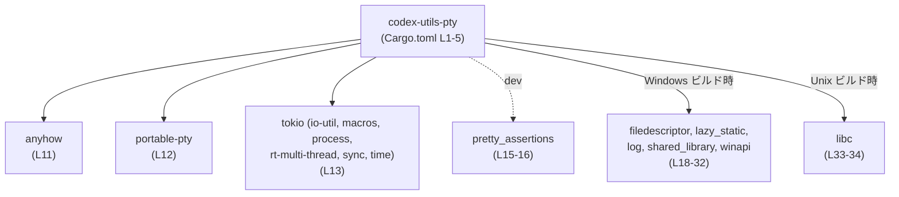
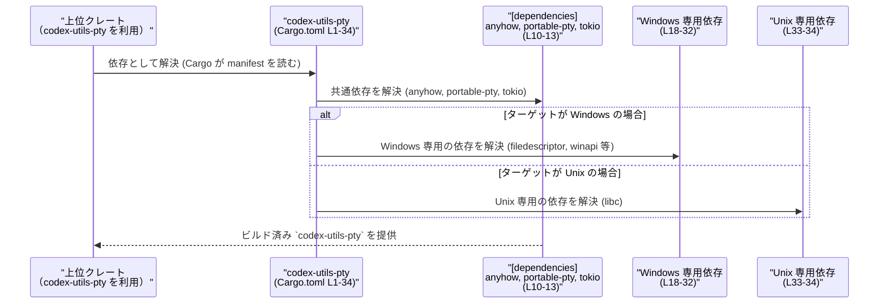

# utils/pty/Cargo.toml 解説レポート

## 0. ざっくり一言

`codex-utils-pty` クレートの Cargo マニフェストであり、ワークスペース共通設定と、PTY（擬似端末）周りと思われる処理のための依存クレート（`portable-pty`, `tokio` など）および OS ごとの低レベル依存を定義しています（`utils/pty/Cargo.toml:L1-5,L10-13,L18-34`）。

> このファイルはビルド設定のみを含み、公開 API やコアロジック（関数・構造体定義）はこのチャンクには現れません。

---

## 1. このモジュールの役割

### 1.1 概要

- このファイルは `codex-utils-pty` というパッケージのメタデータ（名前）と、ワークスペースから引き継ぐ `edition`・`license`・`version` を定義しています（`utils/pty/Cargo.toml:L1-5`）。
- 共通の lint 設定をワークスペースから継承します（`[lints]` セクション, `utils/pty/Cargo.toml:L7-8`）。
- ランタイム依存として `anyhow`, `portable-pty`, `tokio` を、開発時依存として `pretty_assertions` を宣言しています（`utils/pty/Cargo.toml:L10-16`）。
- Windows と Unix で異なる低レベル依存（`winapi` 系 / `libc` など）を条件付きで有効化することで、クロスプラットフォーム対応の実装を行う準備をしています（`utils/pty/Cargo.toml:L18-34`）。

### 1.2 アーキテクチャ内での位置づけ

この Cargo.toml によって、「`codex-utils-pty` クレートがどの外部クレートに依存してビルドされるか」が決まります。Rust コード側の公開 API や処理フローはこのファイルには出てこないため、ここでは依存関係レベルのアーキテクチャを図示します。



- A ノードがこのパッケージ自身（`codex-utils-pty`）です（`utils/pty/Cargo.toml:L1-5`）。
- B〜D は通常依存クレート（`[dependencies]`、`utils/pty/Cargo.toml:L10-13`）。
- E はテストなどでのみ使われる開発用依存（`[dev-dependencies]`, `utils/pty/Cargo.toml:L15-16`）。
- F/G は OS 条件付きの依存（`[target.'cfg(...)'.dependencies]`, `utils/pty/Cargo.toml:L18-34`）。

### 1.3 設計上のポイント

コード（Rust ファイル）は無いため、ここではビルド設定レベルで見える設計上の特徴を列挙します。

- **ワークスペース集中管理**
  - `edition`, `license`, `version`, lint 設定、いくつかの依存クレートはワークスペース側に一括定義され、ここから参照されています（`edition.workspace = true`, `license.workspace = true`, `version.workspace = true`, `lints.workspace = true`, `utils/pty/Cargo.toml:L2-5,L7-8,L10-11,L15-16,L20-21,L33-34`）。
- **エラーハンドリング統一**
  - 失敗を `anyhow` で扱う方針であることが依存から読み取れます（`utils/pty/Cargo.toml:L11`）。実際のエラー処理の詳細は Rust コード側にあり、このチャンクには現れません。
- **非同期・並行処理の前提**
  - `tokio` をマルチスレッドランタイム（`rt-multi-thread`）付きで利用する設定になっており（`utils/pty/Cargo.toml:L13`）、実装側は Tokio ベースの非同期 I/O とマルチスレッド実行を前提としていると解釈できます。ただし具体的なタスク / スレッドの使い方はこのチャンクからは不明です。
- **クロスプラットフォームな PTY 実装の準備**
  - `portable-pty` と OS 別の低レベル依存（Windows: `winapi` 群, Unix: `libc`）を組み合わせることで、プラットフォームごとの差異を隠蔽した PTY 機能を実装する意図が読み取れます（`utils/pty/Cargo.toml:L12,L18-34`）。ただし公開 API は別ファイルにあり、このチャンクには現れません。
- **テストの視認性向上**
  - `pretty_assertions` を dev-dependency として導入しており、テストの失敗時に読みやすい diff を表示することを意図していると考えられます（`utils/pty/Cargo.toml:L15-16`）。

---

## 2. 主要な機能一覧（この Cargo.toml が決めていること）

このファイル自体は実行時の「機能」を持つのではなく、「どのようなクレート構成でビルドされるか」を決めています。その観点での主要項目は次のとおりです。

- パッケージメタデータの定義: `name = "codex-utils-pty"` とワークスペース共有の `edition` / `license` / `version`（`utils/pty/Cargo.toml:L1-5`）。
- 共通 lint 設定の利用: `[lints] workspace = true` により、ワークスペースで定めた lint 方針を継承（`utils/pty/Cargo.toml:L7-8`）。
- ランタイム依存の指定: `anyhow`, `portable-pty`, `tokio` を通常依存として宣言（`utils/pty/Cargo.toml:L10-13`）。
- テスト用依存の指定: `pretty_assertions` を dev-dependency として宣言（`utils/pty/Cargo.toml:L15-16`）。
- Windows ターゲット専用の依存: `filedescriptor`, `lazy_static`, `log`, `shared_library`, `winapi` を Windows ビルド時のみ有効にする（`utils/pty/Cargo.toml:L18-32`）。
- Unix ターゲット専用の依存: `libc` を Unix ビルド時のみ有効にする（`utils/pty/Cargo.toml:L33-34`）。

---

## 3. 公開 API と詳細解説

このファイルには関数・構造体・列挙体などの Rust コードは含まれていません。そのため「公開 API」の具体的なシグネチャやコアロジックは、このチャンクからは一切分かりません。

ここでは代わりに、「依存クレート」という観点でコンポーネントのインベントリーを整理します。

### 3.1 依存クレート一覧（コンポーネントインベントリー）

| 名前 | 種別 | 役割 / 用途（一般的な説明） | 定義箇所 |
|------|------|-----------------------------|----------|
| `codex-utils-pty` | パッケージ | PTY 関連ユーティリティ用のクレートと考えられます（名前と依存からの推測であり、このチャンクから API は不明） | `utils/pty/Cargo.toml:L1-5` |
| `anyhow` | 依存クレート | 任意のエラー型を一つの型でラップし、エラー伝播を簡潔にするためのクレート | `utils/pty/Cargo.toml:L11` |
| `portable-pty` | 依存クレート | 複数 OS で利用可能な擬似端末（PTY） API を提供するクレートと解釈できます | `utils/pty/Cargo.toml:L12` |
| `tokio` | 依存クレート | 非同期ランタイム。`io-util`, `macros`, `process`, `rt-multi-thread`, `sync`, `time` 機能を有効化（I/O ユーティリティ、マクロ、プロセス操作、マルチスレッドランタイム、同期プリミティブ、時間関連機能を含む） | `utils/pty/Cargo.toml:L13` |
| `pretty_assertions` | 開発用依存 | テスト失敗時に見やすい差分表示を行う `assert_eq!` 互換マクロを提供するクレート | `utils/pty/Cargo.toml:L15-16` |
| `filedescriptor` | Windows 向け依存 | Windows でファイルディスクリプタライクな操作を行うためのラッパー（名称と一般的なクレート知識による） | `utils/pty/Cargo.toml:L18-19` |
| `lazy_static` | Windows 向け依存 | `static` な値を遅延初期化するためのマクロを提供。ここでは Windows ターゲットでのみ利用されます | `utils/pty/Cargo.toml:L18-20` |
| `log` | Windows 向け依存 | ロギング用の標準的な facade クレート。実際のログ出力先は別クレート（このチャンクには現れません） | `utils/pty/Cargo.toml:L18-21` |
| `shared_library` | Windows 向け依存 | 動的ライブラリ（DLL）のロード / シンボル取得のためのラッパーと解釈できます | `utils/pty/Cargo.toml:L18-22` |
| `winapi` | Windows 向け依存 | Windows API の FFI バインディング。`handleapi`, `minwinbase`, `processthreadsapi`, `synchapi`, `winbase`, `wincon`, `winerror`, `winnt` 機能セットを有効化 | `utils/pty/Cargo.toml:L23-31` |
| `libc` | Unix 向け依存 | Unix 系 OS の C 標準ライブラリやシステムコールへの FFI バインディング | `utils/pty/Cargo.toml:L33-34` |

> 備考: 上記の「役割 / 用途」は、クレートの一般的な機能に基づく説明です。`codex-utils-pty` がこれらを具体的にどう使っているかは、Rust ソースコードがこのチャンクには無いため不明です。

### 3.2 関数詳細（該当なし）

- このファイルは TOML の設定ファイルであり、関数やメソッドの定義は含まれていません。
- よって、公開 API（関数シグネチャ）やコアロジックの詳細解説は、このチャンクからは行えません。
- 実際の関数や構造体は、同パッケージ内の Rust ソースファイル（例えば `src/lib.rs` などが一般的ですが、このチャンクには現れません）に定義されているはずです。

### 3.3 その他の関数（該当なし）

- 補助的な関数やラッパー関数に関する情報も、この Cargo.toml には現れません。

---

## 4. データフロー（ビルド時の依存解決フロー）

実行時の「データフロー」はこのファイルからは分からないため、ここでは **ビルド時に Cargo が依存関係を解決するフロー** を概念的に示します。



- 上位クレート（U）が `codex-utils-pty` を依存に持っているとき、Cargo はまずこの `Cargo.toml`（C）を読みます（`utils/pty/Cargo.toml:L1-5`）。
- C から通常依存（D: `anyhow`, `portable-pty`, `tokio`）と開発用依存（テスト時のみ）を解決します（`utils/pty/Cargo.toml:L10-16`）。
- ターゲット OS に応じて、Windows 専用依存（W）または Unix 専用依存（X）を追加で解決します（`utils/pty/Cargo.toml:L18-34`）。
- 実際の関数呼び出しやデータの流れは Rust コード側に依存し、このチャンクからは不明です。

---

## 5. 使い方（How to Use）

### 5.1 基本的な使用方法（他クレートからの利用）

この Cargo.toml は「`codex-utils-pty` クレートの設定」なので、利用者の立場では **自分の Cargo.toml に `codex-utils-pty` を依存として追加する** ことになります。

例として、同じワークスペース内の別クレートから利用する場合の概念的な記述を示します（実際のパスやバージョン指定はワークスペース構成に依存し、このチャンクからは厳密には分かりません）。

```toml
# 別クレート側の Cargo.toml の例（概念的なもの）
[dependencies]
codex-utils-pty = { path = "../utils/pty" }  # パスは実際のディレクトリ構成に合わせて調整する
```

- `name = "codex-utils-pty"` で定義されているため（`utils/pty/Cargo.toml:L4`）、依存名として `codex-utils-pty` を指定することになります。
- バージョンは `version.workspace = true` のためワークスペース管理です（`utils/pty/Cargo.toml:L5`）。

Rust コードから実際にどのように API を呼び出すかは、このチャンクからは分かりません（`src/lib.rs` などの実装が必要です）。

### 5.2 よくある使用パターン（ビルド環境の観点）

この Cargo.toml から読み取れる「使い方のパターン」は主にビルド・実行環境に関するものです。

- **クロスプラットフォームビルド**
  - 同じソースコードを Windows と Unix でビルドしても、Cargo が自動的にその OS 向けの依存を解決します（`utils/pty/Cargo.toml:L18-34`）。
  - 利用者は特別な設定をしなくても `cargo build --target x86_64-pc-windows-msvc` や `cargo build --target x86_64-unknown-linux-gnu` などを実行できます。
- **Tokio ベースの非同期環境**
  - `tokio` に `rt-multi-thread` が含まれているので（`utils/pty/Cargo.toml:L13`）、実装側ではマルチスレッドランタイムを使用した非同期処理が行われている可能性があります。
  - 利用者側のコードでは、一般的には `#[tokio::main(flavor = "multi_thread")]` のように Tokio ランタイムを起動する必要がありますが、それが実際に要求されるかどうかはこのチャンクからは不明です。

### 5.3 よくある間違い（この設定に関わりそうな点）

Cargo.toml レベルで起こりうるミスと、この設定との関係を整理します。

- **ワークスペース外からバージョンだけで参照しようとする**
  - このファイルでは `version.workspace = true` になっているため（`utils/pty/Cargo.toml:L5`）、 crates.io に公開されていなければ、バージョン番号だけでは解決できません。
  - ワークスペース外から利用する場合は、`path` 指定や crates.io への公開（このチャンクからは公開状況不明）が必要になります。
- **ターゲット条件付き依存を前提にしないコード**
  - 実装側で「常に `winapi` が存在する」「常に `libc` が存在する」と仮定したコードを書くと、別 OS でビルドしたときにコンパイルエラーになります。
  - この Cargo.toml は OS ごとに依存を分けています（`utils/pty/Cargo.toml:L18-34`）が、その条件付きをコード側でも `cfg(windows)` / `cfg(unix)` で反映する必要があります。  
    ※ 実際にどう書かれているかはこのチャンクには現れません。

### 5.4 使用上の注意点（まとめ）

- **公開 API・エラー・並行性の詳細は別ファイル**
  - この Cargo.toml には関数や型の情報が無く、`anyhow` や `tokio` の利用が示されているだけです（`utils/pty/Cargo.toml:L11,L13`）。
  - エラーの返し方、非同期タスクの扱い方、スレッド安全性などは Rust ソースコード側を確認する必要があります。
- **ネイティブ依存による注意**
  - `winapi` や `libc` は OS ネイティブ API への FFI を提供するため、実装側では `unsafe` コードが関わる可能性があります（`utils/pty/Cargo.toml:L23-31,L33-34`）。
  - これは一般的にバグ・セキュリティリスクの原因となりやすい部分ですが、このチャンク単体から具体的な問題の有無は分かりません。
- **Tokio ランタイムの前提**
  - `rt-multi-thread` が有効な Tokio を依存としているため（`utils/pty/Cargo.toml:L13`）、利用者とライブラリ側の両方で Tokio ランタイムの構成を整合させる必要がある可能性があります。ただし具体的な要件はこのチャンクには現れません。

---

## 6. 変更の仕方（How to Modify）

### 6.1 新しい機能を追加する場合（依存の追加）

新機能を実装するために新しい依存クレートを追加する場合、次のようなステップになります。

1. **依存の種類を決める**
   - 実行時に必要であれば `[dependencies]` に追加（`utils/pty/Cargo.toml:L10-13` と同様）。
   - テスト専用であれば `[dev-dependencies]` に追加（`utils/pty/Cargo.toml:L15-16` と同様）。
2. **ターゲット依存かどうかを判断**
   - OS 固有の機能であれば、Windows 用は `[target.'cfg(windows)'.dependencies]`、Unix 用は `[target.'cfg(unix)'.dependencies]` などに追加する（`utils/pty/Cargo.toml:L18-34` 参照）。
3. **ワークスペース管理するか**
   - 既にワークスペース共通の依存として定義されているクレートであれば `workspace = true` と書けます（`anyhow`, `tokio`, `lazy_static`, `log`, `libc` などがこのパターンです。`utils/pty/Cargo.toml:L11,L13,L20-21,L33-34`）。
   - 新規クレートをワークスペース全体で共有したい場合、ワークスペースルートの Cargo.toml にも依存エントリを追加する必要があります（ルートファイル自体はこのチャンクには現れません）。

### 6.2 既存の機能を変更する場合（依存・設定の変更）

- **Tokio の機能セットを見直す**
  - 例えばマルチスレッドランタイムが不要であれば、`rt-multi-thread` を外すこともできますが（`utils/pty/Cargo.toml:L13`）、それに依存している実装がないか Rust コード側を確認する必要があります。
- **Windows / Unix 依存の整理**
  - Windows 固有 API を使う部分を減らしたい場合、`winapi` の features の見直し（`handleapi` などの機能セット）や、依存そのものの削減を検討できます（`utils/pty/Cargo.toml:L23-31`）。
  - Unix 側も同様に、`libc` に依存しているコードパスを確認し、不要であれば依存を削除できます（`utils/pty/Cargo.toml:L33-34`）。
- **影響範囲の確認**
  - 依存バージョンや features を変更すると、コンパイルエラーや挙動変化が起こる可能性があります。
  - 変更後はパッケージ全体のテスト（`pretty_assertions` を用いたテストが存在する可能性がありますが、このチャンクにはテストコードは現れません）を必ず実行する必要があります。

---

## 7. 関連ファイル

この Cargo.toml と密接に関係するであろうファイル・設定を整理します。

| パス / ファイル | 役割 / 関係 |
|----------------|------------|
| ワークスペースルートの `Cargo.toml`（パス名はこのチャンクからは不明） | `edition.workspace = true`, `license.workspace = true`, `version.workspace = true`, `lints.workspace = true` および `workspace = true` な依存の実体を定義しているファイルです（`utils/pty/Cargo.toml:L2-5,L7-8,L10-11,L13,L15-16,L20-21,L33-34`）。 |
| `codex-utils-pty` パッケージの Rust ソースコード（一般的には `src/lib.rs` や `src/main.rs` など） | 実際の公開 API（関数・構造体・モジュール）とコアロジックを実装しているファイル群ですが、このチャンクには現れません。そのため本レポートでは API の詳細は不明です。 |

---

### このチャンクから分からないこと（まとめ）

- `codex-utils-pty` が提供する具体的な関数・構造体・モジュールの一覧とシグネチャ
- エラー処理（`anyhow` をどう使うか）、並行・非同期処理（`tokio` のどの機能をどう使うか）の詳細
- 実行時のデータフロー・状態遷移・スレッド安全性
- テスト内容やカバレッジ

これらはすべて Rust ソースコード側に依存しており、`utils/pty/Cargo.toml` の内容だけからは判断できません。
