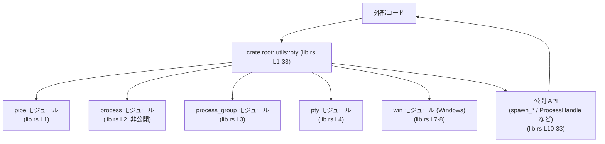
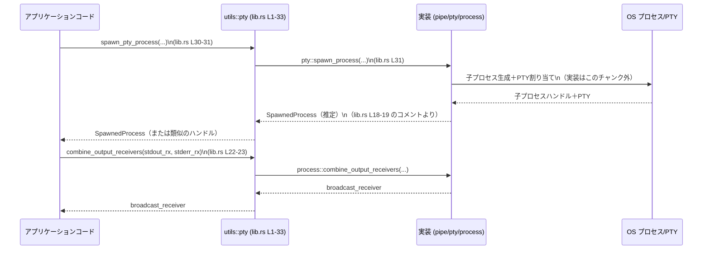

# utils/pty/src/lib.rs コード解説

## 0. ざっくり一言

- PTY（疑似端末）および通常のパイプを使って外部プロセスを起動・制御するための **公開 API を束ねるクレートルートモジュール**です（`lib.rs:L1-4,10-33`）。

---

## 1. このモジュールの役割

### 1.1 概要

- このモジュールは、外部コマンドを
  - 通常のパイプ（stdin/stdout/stderr）でつなぐ非対話モード
  - ターミナルと同等の振る舞いをする PTY に接続する対話モード  
  で起動するための API を一箇所に集約して公開しています（`lib.rs:L1-4,12-23,28-31`）。
- 実際の実装は `pipe`, `process`, `pty`, `win` などのサブモジュールにあり、本ファイルはそれらを再公開（re-export）して「使いやすい入口」を提供します（`lib.rs:L1-4,7-8,12-23,28-33`）。

### 1.2 アーキテクチャ内での位置づけ

- `lib.rs` はクレートのエントリーポイントであり、以下のモジュールを宣言しています（`lib.rs:L1-4,7-8`）。
  - `pipe`（公開）
  - `process`（非公開）
  - `process_group`（公開）
  - `pty`（公開）
  - `win`（Windows のみ、非公開）
- これらのモジュールから型や関数を再公開することで、「`utils::pty` クレートを使う側」はこの `lib.rs` 経由で主要な API にアクセスする設計です。



- 実際のプロセス起動ロジックは `pipe` / `pty` / `process` / `win` 等にあり、このチャンクでは中身は分かりません（モジュール宣言のみのため）。

### 1.3 設計上のポイント

コードから読み取れる範囲での設計上の特徴は次のとおりです。

- **責務の分割**
  - 通常のパイプを使う処理は `pipe` モジュール、PTY/ConPTY を扱う処理は `pty` / `win` モジュールに分離されています（`lib.rs:L1,4,7-8`）。
  - プロセスハンドルや出力受信など共通的な型は `process` モジュールにまとめられています（`lib.rs:L2,17-23`）。
- **公開 API の集約**
  - `spawn_*` 系関数や `ProcessHandle` 等の型は、この `lib.rs` から再公開されており、利用者はサブモジュールを意識せずに使えるようになっています（`lib.rs:L12-23,28-31`）。
- **OS 依存の切り替え**
  - Windows 固有の ConPTY 機能は `#[cfg(windows)]` で条件付きコンパイルされており、RawConPty 型も Windows のみで公開されます（`lib.rs:L7-8,32-33`）。
- **後方互換性の確保**
  - `ExecCommandSession` / `SpawnedPty` という type alias が用意され、「既存コードから新しい型名に移行しつつ、古い名前も動く」ようにしていることがコメントから分かります（`lib.rs:L24-27`）。
- **出力量の制限**
  - `DEFAULT_OUTPUT_BYTES_CAP` という定数で、出力バッファに使うデフォルト上限を 1 MiB に固定しています（`lib.rs:L10`）。具体的な使い方はこのチャンクには現れません。

---

## 2. 主要な機能一覧

このモジュール（クレートルート）が提供する主要な機能は、再公開されている関数・型の名前とコメントから次のように整理できます。

- `spawn_pipe_process`: パイプを使って非対話的なプロセスを起動する（`lib.rs:L12-13`）
- `spawn_pipe_process_no_stdin`: パイプを使って非対話的プロセスを起動し、stdin をすぐに閉じる（`lib.rs:L14-15`）
- `spawn_pty_process`: PTY に接続されたプロセスを起動し、対話的な利用を行う（`lib.rs:L30-31`）
- `conpty_supported`: Windows において ConPTY が利用可能かどうかを報告する（`lib.rs:L28-29`）
- `combine_output_receivers`: stdout/stderr の受信ストリームを 1 つのブロードキャスト受信にまとめる（`lib.rs:L22-23`）
- `ProcessHandle`: 起動したプロセス（PTY/pipe のどちらでも）の操作に使うハンドル（`lib.rs:L16-17`）
- `SpawnedProcess`: 「プロセスハンドル＋分離された出力/終了受信」をひとまとめにした構造体（コメントより）（`lib.rs:L18-19`）
- `TerminalSize`: PTY の行・列サイズ（文字セル単位）を表す型（`lib.rs:L20-21`）
- `ExecCommandSession`: `ProcessHandle` の後方互換エイリアス（`lib.rs:L24-25`）
- `SpawnedPty`: `SpawnedProcess` の後方互換エイリアス（`lib.rs:L26-27`）
- `RawConPty`（Windows のみ）: Windows ConPTY の低レベルハンドル（と推測される）型（`lib.rs:L32-33`）
- `DEFAULT_OUTPUT_BYTES_CAP`: 出力バッファのデフォルト上限（バイト数。ここでは 1 MiB）（`lib.rs:L10`）

---

## 3. 公開 API と詳細解説

### 3.1 型一覧（構造体・列挙体など）

このファイルで「このクレートの公開 API」として露出している主な型は次のとおりです。

| 名前 | 種別 | 役割 / 用途 | 定義位置（このファイル内） |
|------|------|-------------|----------------------------|
| `ProcessHandle` | 構造体（他モジュール定義・再公開） | 起動したプロセス（PTY または pipe）と対話するためのハンドル（コメントより） | `lib.rs:L16-17` |
| `SpawnedProcess` | 構造体（他モジュール定義・再公開） | プロセスハンドルと、分離された stdout/stderr/exit の受信を一括管理するバンドル（コメントより） | `lib.rs:L18-19` |
| `TerminalSize` | 構造体（他モジュール定義・再公開） | PTY の行数・列数など、文字セル単位のターミナルサイズを表現する型（コメントより） | `lib.rs:L20-21` |
| `ExecCommandSession` | 型エイリアス | `ProcessHandle` の後方互換名。既存コードのために残されている（コメントより） | `lib.rs:L24-25` |
| `SpawnedPty` | 型エイリアス | `SpawnedProcess` の後方互換名（コメントより） | `lib.rs:L26-27` |
| `RawConPty` | 構造体（他モジュール定義・再公開・Windowsのみ） | Windows の ConPTY を直接扱う低レベルハンドルと考えられますが、このチャンクから詳細は不明です | `lib.rs:L32-33` |

> 注: `ProcessHandle` / `SpawnedProcess` / `TerminalSize` / `RawConPty` の「中身（フィールド）」やメソッドは、`process`・`win` モジュール側の定義がこのチャンクに現れないため不明です。

加えて、定数も 1 つ公開されています。

| 名前 | 種別 | 役割 / 用途 | 定義位置 |
|------|------|-------------|----------|
| `DEFAULT_OUTPUT_BYTES_CAP` | `const usize` | 出力バッファに許可するデフォルトの最大バイト数。値は `1024 * 1024` で 1 MiB（`1024^2`）です | `lib.rs:L10` |

### 3.2 関数詳細（主要な関数）

関数本体やシグネチャはサブモジュール側にあり、このチャンクでは再公開のみですが、コメントで役割が明示されている関数を対象にテンプレートを適用します。

#### `spawn_pipe_process(...)`

**概要**

- 通常の Unix パイプ／Windows のパイプを使って、非対話的な外部プロセスを起動する関数です（`lib.rs:L12-13`）。
- stdin/stdout/stderr がそれぞれパイプで接続されることがコメントからわかります。

  > "Spawn a non-interactive process using regular pipes for stdin/stdout/stderr."（`lib.rs:L12`）

**引数**

- このファイルにはシグネチャが現れないため、引数名・型は不明です。
- 一般的には「コマンド」「引数」「作業ディレクトリ」「環境変数」等を受け取ることが多いですが、それ以上は推測になり、このチャンクからは断定できません。

| 引数名 | 型 | 説明 |
|--------|----|------|
| （不明） | （不明） | 関数シグネチャが `pipe` モジュールにあり、このチャンクには現れません |

**戻り値**

- 戻り値の型もこのファイルからは読み取れません。
- コメント `SpawnedProcess` の説明（`lib.rs:L18-19`）から、「spawn ヘルパーが `SpawnedProcess` を返す」設計であると記述されていますが、どの spawn 関数がそうなのか、このチャンクだけでは確定できません。
- よって「`SpawnedProcess` を返す可能性が高い」と推測されるものの、ここでは **不明** と記載します。

**内部処理の流れ（アルゴリズム）**

- 実装は `pipe::spawn_process` にあり、このチャンクには現れません（`lib.rs:L13`）。
- したがって、プロセス生成時のフラグ設定や OS ごとの分岐等は不明です。

**Examples（使用例）**

このチャンクのみからは正確なシグネチャが不明なため、以下は「概念的な」擬似コードです。実際の引数や戻り値の型は `pipe` モジュールの定義を確認する必要があります。

```rust
use utils::pty::spawn_pipe_process;
// 他にも ProcessHandle, SpawnedProcess などを use する可能性があります。

fn run_non_interactive() -> Result<(), Box<dyn std::error::Error>> {
    // ※ 引数リストはこのファイルからは分からないためコメントで表現します。
    // let spawned = spawn_pipe_process(command, args, options)?;

    // spawned から stdout/stderr/exit などを扱う具体的な方法は、
    // SpawnedProcess 型の定義に依存します（このチャンクには現れません）。

    Ok(())
}
```

**Errors / Panics**

- 外部プロセスを起動する関数であるため、
  - 実行ファイルが存在しない
  - パーミッションが不足している
  - OS のリソース制限に達している  
  といったケースでエラーを返すと考えられますが、**エラー型や条件はこのチャンクには記述がありません**。
- panic 条件についても、このファイルからは分かりません。

**Edge cases（エッジケース）**

- 空のコマンド、非常に長い引数列、巨大な出力などがエッジケースになり得ますが、本チャンクにはそれらの扱いは書かれていません。
- 出力量の上限に `DEFAULT_OUTPUT_BYTES_CAP` が関係している可能性はありますが、その具体的な関連も不明です（`lib.rs:L10`）。

**使用上の注意点**

- コマンドライン引数にユーザ入力をそのまま渡すと、一般的にはコマンドインジェクションのリスクがあります。  
  ただし、この関数がどのように引数を OS に渡すかは、このチャンクからは分かりません。
- 同期/非同期、スレッド安全性などの性質も、このファイル単体では判断できません。

---

#### `spawn_pipe_process_no_stdin(...)`

**概要**

- `spawn_pipe_process` と同様にパイプを使って外部プロセスを起動するが、stdin をすぐに閉じる（書き込みできない）設定で起動する関数です（`lib.rs:L14-15`）。

  > "Spawn a non-interactive process using regular pipes, but close stdin immediately."（`lib.rs:L14`）

**引数 / 戻り値**

- シグネチャがこのファイルにないため、引数・戻り値ともに不明です。
- `spawn_pipe_process` と同じ引数で、振る舞いのみ異なる設計である可能性はありますが、推測に留まります。

**内部処理・Examples・Errors・Edge cases・注意点**

- 上記 `spawn_pipe_process` と同様、このチャンクからは詳細不明です。
- 概念的には「標準入力を使わせたくない子プロセス（例: 完全に自動化されたコマンド）」に使う想定と考えられます。

---

#### `spawn_pty_process(...)`

**概要**

- PTY（疑似端末）に接続されたプロセスを起動し、対話的な利用（対話型シェル、REPL など）を可能にする関数です（`lib.rs:L30-31`）。

  > "Spawn a process attached to a PTY for interactive use."（`lib.rs:L30`）

**引数 / 戻り値**

- シグネチャはこのファイルに現れません（`lib.rs:L31`）。
- コメントに「Terminal size in character cells used for PTY spawn and resize operations」とある `TerminalSize`（`lib.rs:L20-21`）が PTY の spawn/resize に使われると書かれているので、`spawn_pty_process` でも `TerminalSize` を何らかの形で受け取るか、内部で利用していると推測できますが、確定情報ではありません。

**並行性・安全性の観点（一般論とこのファイルから分かること）**

- PTY を使う場合、ユーザ入力／プロセス出力の双方が非同期に発生するため、内部では何らかの並行処理（スレッドまたは非同期タスク）が使われることが一般的です。
- ただし、このチャンクだけからは同期/非同期 API（`std::process` ベースか tokio 等か）は特定できません。

**その他の項目**

- 内部処理、エラー条件、例などは、`pty` モジュールの実装がこのチャンクにないため不明です。

---

#### `conpty_supported() -> bool`（推定）

**概要**

- Windows 環境で ConPTY が利用可能かどうかを報告する関数です（`lib.rs:L28-29`）。

  > "Report whether ConPTY is available on this platform (Windows only)."（`lib.rs:L28`）

- 関数名およびコメントから、戻り値は `bool` が最も自然ですが、戻り値の型はこのチャンクからは断定できません。

**引数**

- おそらく引数なしの関数ですが、シグネチャがこのファイルにないため「不明」とします（`lib.rs:L29`）。

**戻り値**

- コメントから「ConPTY が有効かどうか（true/false）」を返すことが読み取れますが、型名は不明です。

**使用上の注意点**

- Windows 専用の機能であることがコメントから明示されています（`lib.rs:L28`）。
- ただしこの `pub use pty::conpty_supported;` には `#[cfg(windows)]` が付いていないため、この関数自体は **非 Windows でもシンボルとしては存在する可能性があります**。
  - 実際にどのように実装されているか（非 Windows で常に false を返すなど）は、このチャンクからは判断できません。

---

#### `combine_output_receivers(...)`

**概要**

- stdout と stderr の受信ストリーム（「receivers」）を 1 つのブロードキャスト受信にまとめるヘルパー関数です（`lib.rs:L22-23`）。

  > "Combine stdout/stderr receivers into a single broadcast receiver."（`lib.rs:L22`）

**引数 / 戻り値**

- 具体的な型（例: チャネルの `Receiver` 型など）は、このチャンクには現れません。
- 少なくとも、stdout 用と stderr 用の 2 つの受信オブジェクトを受け取り、統合された 1 つの受信オブジェクト（broadcast receiver）を返す設計であることがコメントから読み取れます。

**並行性の観点**

- 「receiver」「broadcast receiver」という用語から、内部でチャネル（メッセージキュー）を用いた並行処理が行われている可能性が高いですが、どのライブラリ（標準 or tokio など）かはこのチャンクでは分かりません。
- マルチスレッドや非同期タスク間で出力を共有する用途を想定していると解釈できます。

**その他の項目**

- エラー条件やエッジケース（片方のみ有効、片方が即座に終了するなど）の扱いは、`process::combine_output_receivers` の実装に依存しており、このチャンクからは不明です。

---

### 3.3 その他の関数・要素

このファイルには「定義された関数」はなく、すべて他モジュールの再公開です。補助的な API は次のとおりです。

| 名前 | 種別 | 役割（1行） | 定義位置 |
|------|------|-------------|----------|
| `spawn_pipe_process` | 関数（再公開） | 通常パイプで非対話プロセスを起動 | `lib.rs:L12-13` |
| `spawn_pipe_process_no_stdin` | 関数（再公開） | stdin を即時クローズする非対話プロセス起動 | `lib.rs:L14-15` |
| `spawn_pty_process` | 関数（再公開） | PTY に接続された対話プロセスを起動 | `lib.rs:L30-31` |
| `conpty_supported` | 関数（再公開） | ConPTY が利用可能かを報告（Windows 前提） | `lib.rs:L28-29` |
| `combine_output_receivers` | 関数（再公開） | stdout/stderr 受信を 1 つのブロードキャスト受信に統合 | `lib.rs:L22-23` |

---

## 4. データフロー

ここでは、公開 API から読み取れる範囲で、「プロセスを起動して出力を受信する」典型的な流れを概念的に説明します。

1. 外部コードが `spawn_*` 関数（`spawn_pipe_process` や `spawn_pty_process`）を呼び出す（`lib.rs:L12-15,30-31`）。
2. 実装側（`pipe` / `pty` モジュール）は OS のプロセス起動 API を使い、新しい子プロセスを生成する（実装はこのチャンク外）。
3. 子プロセスに対して `ProcessHandle` が作られ、出力用の受信（stdout/stderr）、終了コード用の受信などをひとまとめにした `SpawnedProcess` が生成される（`lib.rs:L16-19`）。
4. 必要に応じて、`combine_output_receivers` を使って stdout/stderr の受信を 1 つにまとめる（`lib.rs:L22-23`）。
5. 呼び出し側は `ProcessHandle` や出力受信を用いて、プロセスの入出力とライフサイクルを管理する。

この流れを sequence diagram として表現すると、次のようになります。



> 注: `SpawnedProcess` の具体的なフィールド名や戻り値の正確な型は、このチャンクからは分からないため、図では概念的な表現に留めています。

---

## 5. 使い方（How to Use）

### 5.1 基本的な使用方法（概念的な例）

このチャンクだけでは各関数の正確なシグネチャが不明なため、以下は「流れ」を理解するための概念的な例です。

```rust
use utils::pty::{
    spawn_pipe_process,
    spawn_pty_process,
    combine_output_receivers,
    ProcessHandle,
    SpawnedProcess,
    DEFAULT_OUTPUT_BYTES_CAP,
};

fn main() -> Result<(), Box<dyn std::error::Error>> {
    // --- 非対話的なコマンドをパイプ経由で起動する（spawn_pipe_process） ---
    // ※ 実際の引数はこのチャンクからは不明
    // let pipe_spawned: SpawnedProcess = spawn_pipe_process(/* command, args, options */)?;

    // --- 対話的なコマンドを PTY で起動する（spawn_pty_process） ---
    // let pty_spawned: SpawnedProcess = spawn_pty_process(/* command, args, terminal_size, options */)?;

    // --- stdout/stderr の受信を一つにまとめる（combine_output_receivers） ---
    // let combined = combine_output_receivers(/* stdout_rx, stderr_rx */);

    // SpawnedProcess や ProcessHandle の具体的な使い方（メソッド呼び出しなど）は、
    // process モジュール側の定義に依存し、このチャンクには現れません。

    println!("Default output cap: {} bytes", DEFAULT_OUTPUT_BYTES_CAP);

    Ok(())
}
```

### 5.2 よくある使用パターン

このモジュールから読み取れる「選択の軸」は次のようなものがあります。

1. **対話的かどうか**
   - 対話的でないバッチ処理: `spawn_pipe_process` or `spawn_pipe_process_no_stdin`
   - 対話的なシェル／REPL／フルスクリーンアプリ: `spawn_pty_process`
2. **stdin を使うかどうか**
   - 入力を送らない／直ちに EOF を送信したい: `spawn_pipe_process_no_stdin`
   - 標準入力からデータを送りたい: `spawn_pipe_process`
3. **出力の扱い**
   - stdout と stderr を別々に処理したい: `SpawnedProcess` に含まれる（とコメントされている）「分離された output receivers」をそのまま使う（`lib.rs:L18-19`）
   - 両者を一括で扱いたい: `combine_output_receivers` で統合（`lib.rs:L22-23`）

具体的なコードは、`SpawnedProcess` のフィールドやメソッドがこのチャンクに出てこないため、ここでは記述できません。

### 5.3 よくある間違い（起こりうる誤用の例）

このファイル自体には誤用例は書かれていませんが、API 形状から推測される注意点を挙げます（すべて一般的な注意であり、このクレート固有の仕様ではありません）。

```rust
// 誤りの可能性がある例（概念的）
use utils::pty::RawConPty;

// 非 Windows 環境で RawConPty を参照しようとするとコンパイルエラーになる可能性がある。
// lib.rs:L32-33 に #[cfg(windows)] が付いているため、非 Windows では RawConPty は公開されない。
```

```rust
// より安全な（クロスプラットフォーム）記述例（概念的）
#[cfg(windows)]
use utils::pty::RawConPty;

fn main() {
    #[cfg(windows)]
    {
        // Windows 専用の ConPTY ロジックを書く
        let _conpty: RawConPty = /* ... */;
    }
}
```

### 5.4 使用上の注意点（まとめ）

- **OS 依存**
  - `RawConPty` は `#[cfg(windows)]` 付きで再公開されているため、非 Windows ではシンボル自体が存在しません（`lib.rs:L32-33`）。
  - `conpty_supported` は Windows を前提とした関数ですが、このファイルでは `#[cfg(windows)]` が付いていないため、非 Windows をどう扱うかは実装依存です（`lib.rs:L28-29`）。
- **後方互換性**
  - `ExecCommandSession` と `SpawnedPty` はそれぞれ `ProcessHandle` / `SpawnedProcess` の別名です（`lib.rs:L24-27`）。新規コードでは新しい名前を使いつつ、既存コードではエイリアスが利用できます。
- **出力量の上限**
  - `DEFAULT_OUTPUT_BYTES_CAP` によって、デフォルトの出力バッファ上限が 1 MiB に設定されています（`lib.rs:L10`）。大きな出力を扱う場合、この上限がどのように適用されるかは `process` 等の実装を確認する必要があります。
- **セキュリティ**
  - 外部プロセスを起動する API であるため、一般論としてコマンドライン引数のサニタイズ、環境変数の扱いなどに注意が必要です。  
    このクレートがそれらをどこまで抽象化／安全化しているかは、このチャンクだけでは分かりません。

---

## 6. 変更の仕方（How to Modify）

### 6.1 新しい機能を追加する場合

この `lib.rs` は主に **モジュール宣言と再公開** だけを行っているため、新機能の追加は次のような流れになると考えられます。

1. **実装をサブモジュールに追加**
   - 例: 新しいプロセス起動オプションを `pipe` または `pty` モジュールに追加する。
2. **必要なら新しい型/関数を再公開**
   - `pub use` を `lib.rs` に追加して、クレートのトップレベル API として露出させる（`lib.rs:L12-23,28-31` の既存パターンに倣う）。
3. **後方互換性が必要なら type alias を定義**
   - 既存の名称を残すために `pub type OldName = NewName;` のようなエイリアスを定義する（`lib.rs:L24-27` を参考）。

### 6.2 既存の機能を変更する場合

- 影響範囲の確認
  - `spawn_*` 関数や `ProcessHandle` などはクレートの顔となる API なので、シグネチャ変更は下位互換性に大きく影響します。
  - `ExecCommandSession` / `SpawnedPty` というエイリアスがあるため、「どの名前で使われているか」を検索してから変更する必要があります（`lib.rs:L24-27`）。
- 条件付きコンパイル
  - `RawConPty` や `win` モジュールの `#[cfg(windows)]` は OS ごとのビルド可否に直結するため、誤って削除/変更すると非 Windows 環境でビルド失敗を起こす可能性があります（`lib.rs:L7-8,32-33`）。
- テスト
  - `#[cfg(test)] mod tests;` があるため（`lib.rs:L5-6`）、テストモジュール内で API がどう呼ばれているか確認し、変更後も整合性を保つ必要があります。

---

## 7. 関連ファイル

このモジュールと密接に関係するファイル・ディレクトリは、モジュール宣言から次のように読み取れます。

| パス / モジュール | 役割 / 関係（このチャンクから分かる範囲） | 根拠 |
|-------------------|-------------------------------------------|------|
| `utils/pty/src/pipe.rs`（または `pipe/mod.rs`） | パイプ（stdin/stdout/stderr）を使った非対話プロセス起動ロジックと、`spawn_process` / `spawn_process_no_stdin` の実装を持つモジュールと考えられます | `pub mod pipe;`（`lib.rs:L1`）、`pub use pipe::spawn_process as spawn_pipe_process;`（`lib.rs:L12-13`）など |
| `utils/pty/src/process.rs` | `ProcessHandle` / `SpawnedProcess` / `TerminalSize` / `combine_output_receivers` など、プロセス管理と出力受信に関する共通的な型と関数を定義するモジュール | `mod process;`（`lib.rs:L2`）、`pub use process::ProcessHandle;` ほか（`lib.rs:L16-23`） |
| `utils/pty/src/process_group.rs` | プロセスグループに関連する機能を提供する公開モジュールと推測されますが、このチャンクには中身がなく詳細不明です | `pub mod process_group;`（`lib.rs:L3`） |
| `utils/pty/src/pty.rs` | PTY に関するロジック（PTY ベースの spawn や ConPTY 判定など）を提供する公開モジュール | `pub mod pty;`（`lib.rs:L4`）、`pub use pty::conpty_supported;`、`pub use pty::spawn_process as spawn_pty_process;`（`lib.rs:L28-31`） |
| `utils/pty/src/win.rs` | Windows 特有の実装（特に ConPTY 周り）を提供するモジュール。`conpty` サブモジュールを通じて `RawConPty` を公開 | `#[cfg(windows)] mod win;`（`lib.rs:L7-8`）、`#[cfg(windows)] pub use win::conpty::RawConPty;`（`lib.rs:L32-33`） |
| `utils/pty/src/tests.rs`（または `tests/mod.rs`） | このクレート内のテストコード。公開 API の振る舞いを確認する用途と考えられますが、中身はこのチャンクには現れません | `#[cfg(test)] mod tests;`（`lib.rs:L5-6`） |

> 「役割」の欄のうち、`process_group` などについては名前からの推測を含みます。その場合は「〜と考えられます」「〜と推測されます」と表現し、断定を避けています。

---

このファイルはロジック自体を持たず、クレート全体の API 入口としての役割に特化しているため、実際の挙動やエラー・並行性などの詳細は各サブモジュール側のコードを参照する必要があります。ここでは、公開 API の一覧とその関連、そして概念的なデータフローを整理しました。
