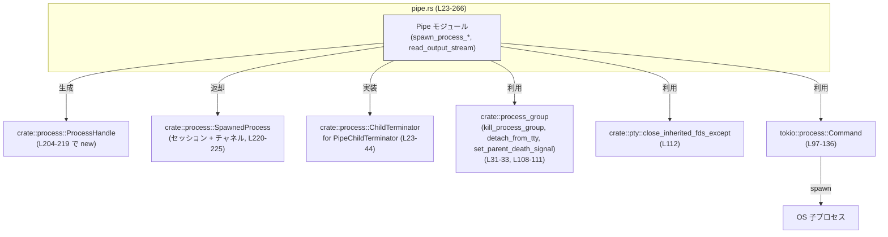
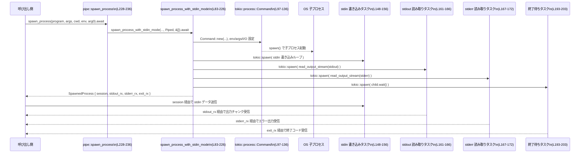

# utils/pty/src/pipe.rs

## 0. ざっくり一言

標準パイプ（PTY ではない）を使って外部プロセスを非同期に起動し、  
stdin への書き込み・stdout/stderr の分離受信・終了コードの取得を行うモジュールです（`tokio::process::Command` ベース, `utils/pty/src/pipe.rs:L83-226`）。

---

## 1. このモジュールの役割

### 1.1 概要

- このモジュールは **PTY を使わずに通常のパイプで子プロセスを起動・制御する** ために存在し、次の機能を提供します。
  - プロセスの起動と環境設定（カレントディレクトリ・環境変数・arg0 等, `L83-125`）
  - stdin をパイプか /dev/null（または Close）にするモード切替（`PipeStdinMode`, `L78-82`）
  - stdout/stderr を非同期に読み取り、チャネル経由で呼び出し側へ転送（`L145-147`, `L161-172`）
  - プロセス終了の待機と終了コードの通知（`L188-203`, `L220-225`）
  - OS ごとの安全な kill 実装（`PipeChildTerminator`, `L23-44`; `kill_process`, `L45-61`）

### 1.2 アーキテクチャ内での位置づけ

このファイルは「パイプ版プロセス起動」の実装であり、他モジュールと次のように連携します。



**位置づけの要点**

- プロセス制御の抽象層 `ProcessHandle` / `SpawnedProcess` は `crate::process` にあり、本モジュールは **その下位実装（pipes 版）** にあたります（`L204-225`）。
- PTY まわりの詳細やプロセスグループ管理は他モジュール（`crate::pty`, `crate::process_group`）に委譲されています（`L108-112`）。

### 1.3 設計上のポイント

- **責務分割**
  - 子プロセスの kill ロジックは `PipeChildTerminator`（`L23-44`）として `ChildTerminator` トレイト実装に分離されています。
  - 標準出力ストリームの読み取りは `read_output_stream` に共通化されています（`L62-77`）。
  - 公開 API はモード別ヘルパー `spawn_process*` に集約され、実装本体は `spawn_process_with_stdin_mode` にまとまっています（`L83-226`, `L228-266`）。
- **状態管理**
  - プロセスの終了済みフラグ：`AtomicBool`（`exit_status`, `L189`）
  - 終了コード：`StdMutex<Option<i32>>`（`exit_code`, `L191`）
  - stdin 書き込みは `tokio::sync::Mutex` で守られた `stdin` ハンドルを共有しつつ `mpsc` で非同期送信（`L145-156`）。
- **エラーハンドリング**
  - 主要関数の戻り値は `anyhow::Result<SpawnedProcess>`（`L91`, `L234`, `L244`, `L255`）。
  - プロセス起動失敗は `Command::spawn()?` による `?` 伝播（`L136`）。
  - `read_output_stream` や stdin 書き込みタスクでは I/O エラーを握り潰し、ループ終了のみ行います（`L71-74`, `L153-154`）。
- **並行性**
  - Tokio タスクを複数起動
    - stdin 書き込みタスク（`L148-156`）
    - stdout / stderr 読み取りタスク（`L161-172`）
    - それらをまとめて待機する reader タスク（`L180-187`）
    - プロセス終了待ちタスク（`L193-203`）
  - これらのタスクのハンドルと「abort handle」を `ProcessHandle` に渡して管理しています（`L173-178`, `L204-219`）。

---

## 2. コンポーネント一覧（インベントリー）

### 2.1 型・トレイト実装

| 名前 | 種別 | 公開範囲（このファイル内） | 役割 / 用途 | 定義位置 |
|------|------|---------------------------|------------|----------|
| `PipeChildTerminator` | 構造体 | 非公開 | プロセス終了時の kill 操作をカプセル化し、`ChildTerminator` トレイトを実装する（`L23-44`） | `utils/pty/src/pipe.rs:L23-28` |
| `PipeStdinMode` | enum | 非公開 | 子プロセスの stdin をパイプ接続するか `/dev/null` 相当にするかを指定するモード（`L78-82`） | `utils/pty/src/pipe.rs:L78-82` |
| `ChildTerminator for PipeChildTerminator` | トレイト実装 | 非公開実装 | OS ごとの手段を用いて子プロセス（群）を kill する（`L29-43`） | `utils/pty/src/pipe.rs:L29-43` |

※ `ProcessHandle`, `SpawnedProcess`, `ChildTerminator` トレイト自体は `crate::process` で定義されており、このチャンクには定義が現れません。  
`SpawnedProcess { session, stdout_rx, stderr_rx, exit_rx }` という初期化が行われることから、少なくともこれらのフィールドを持つ構造体であることは読み取れます（`utils/pty/src/pipe.rs:L220-225`）。

### 2.2 関数一覧

| 名前 | 種別 | 概要 | 定義位置 |
|------|------|------|----------|
| `PipeChildTerminator::kill` | メソッド | OS ごとに適切な方法で子プロセス（or プロセスグループ）を kill する | `utils/pty/src/pipe.rs:L29-43` |
| `kill_process`（cfg(windows)） | 関数 | WinAPI を使って指定 PID のプロセスを強制終了 | `utils/pty/src/pipe.rs:L45-61` |
| `read_output_stream` | async 関数 | 非同期リーダから読み取ったバイト列をチャネルに逐次送信 | `utils/pty/src/pipe.rs:L62-77` |
| `spawn_process_with_stdin_mode` | async 関数 | 実装本体。stdin モードや継承 FD を指定して子プロセスを起動し、`SpawnedProcess` を組み立てて返す | `utils/pty/src/pipe.rs:L83-226` |
| `spawn_process` | async 関数（公開） | stdin をパイプで接続する通常ケースのプロセス起動 API | `utils/pty/src/pipe.rs:L228-236` |
| `spawn_process_no_stdin` | async 関数（公開） | stdin をただちに閉じてプロセスを起動する簡易 API | `utils/pty/src/pipe.rs:L238-246` |
| `spawn_process_no_stdin_with_inherited_fds` | async 関数（公開） | stdin を閉じつつ、Unix で一部 FD を継承させるプロセス起動 API | `utils/pty/src/pipe.rs:L248-266` |

---

## 3. 公開 API と詳細解説

### 3.1 型一覧（補足）

公開型はこのファイルでは定義されていませんが、重要な内部型を整理します。

| 名前 | 種別 | 役割 / 用途 | 関連する関数 | 定義位置 |
|------|------|-------------|--------------|----------|
| `PipeChildTerminator` | 構造体 | `ChildTerminator` トレイトを実装し、プロセス kill 処理を担当 | `spawn_process_with_stdin_mode` 内で `ProcessHandle::new` に渡される | `utils/pty/src/pipe.rs:L23-28` |
| `PipeStdinMode` | enum | `Piped`/`Null` による stdin 振る舞いの切替 | `spawn_process_with_stdin_mode`, `spawn_process`, `spawn_process_no_stdin_*` | `utils/pty/src/pipe.rs:L78-82` |

---

### 3.2 関数詳細

#### `PipeChildTerminator::kill(&mut self) -> io::Result<()>`（utils/pty/src/pipe.rs:L29-43）

**概要**

- OS ごとの実装を切り替えつつ、子プロセス（Unix ではプロセスグループ）を終了させるメソッドです。
- `ChildTerminator` トレイトの実装として `ProcessHandle` から呼ばれる想定です（`L18-19`, `L204-211`）。

**引数**

| 引数名 | 型 | 説明 |
|--------|----|------|
| `&mut self` | `PipeChildTerminator` | 対象プロセスの PID またはプロセスグループ ID を保持するインスタンス |

**戻り値**

- `io::Result<()>`  
  - 成功時: `Ok(())`  
  - 失敗時: OS 由来の `io::Error` を返す（実際のエラー生成は `kill_process_group` / `kill_process` 内部, `L33`, `L37`）。

**内部処理の流れ**

- Unix (`cfg(unix)`) の場合（`L31-34`）:
  - `crate::process_group::kill_process_group(self.process_group_id)` を呼び出し。
- Windows (`cfg(windows)`) の場合（`L35-38`）:
  - `kill_process(self.pid)` を呼び出し。
- その他 OS (`cfg(not(any(unix, windows)))`) の場合（`L39-42`）:
  - 何もせず `Ok(())` を返す。

**Errors / Panics**

- `io::Error` は OS 依存で、`kill_process_group` / `kill_process` 内で生成されます（このチャンクには定義なし）。
- メソッド自体は panic を発生させるコードを含みません。

**Edge cases**

- 非 Unix / 非 Windows OS では **必ず成功扱い** になるため、実際にはプロセスが生きていても `Ok(())` が返ります（`L39-42`）。

**使用上の注意点**

- `self` が保持する PID / プロセスグループ ID が既に終了済み / 不正な場合、エラーになるか、OS の仕様により成功扱いになる可能性があります。
- 非 Unix / 非 Windows では kill が実装されていない点に注意が必要です。

---

#### `#[cfg(windows)] fn kill_process(pid: u32) -> io::Result<()>`（utils/pty/src/pipe.rs:L45-61）

**概要**

- Windows 上で PID を指定してプロセスを強制終了する内部ユーティリティです。

**引数**

| 引数名 | 型 | 説明 |
|--------|----|------|
| `pid` | `u32` | 終了したいプロセスの PID |

**戻り値**

- `io::Result<()>`  
  - `Ok(())`: `TerminateProcess` が成功した場合  
  - `Err(io::Error)`: `OpenProcess` が失敗した場合、または `TerminateProcess` が 0 を返した場合（`L53-54`, `L56-59`）。

**内部処理の流れ（主要部分）**

- `OpenProcess(PROCESS_TERMINATE, 0, pid)` でハンドル取得（`L48-51`）。
  - 取得に失敗したら `io::Error::last_os_error()` でエラーを返す（`L53-54`）。
- `TerminateProcess(handle, 1)` を呼び出し（`L56`）。
- 呼び出し直後に `last_os_error` を取得しておく（`L57`）。
- `CloseHandle(handle)` でハンドルを必ず閉じる（`L58`）。
- `success == 0` ならさきほどの `err` を返し、それ以外なら `Ok(())`（`L59`）。

**安全性（unsafe）**

- WinAPI 呼び出し全体を `unsafe` ブロックで囲んでいます（`L47`）。
  - 生のハンドルを扱うため、Rust の型安全の外側で OS リソースを管理している点が特徴です。

---

#### `async fn read_output_stream<R>(reader: R, output_tx: mpsc::Sender<Vec<u8>>)`（utils/pty/src/pipe.rs:L62-77）

**概要**

- 汎用の非同期リーダ（`AsyncRead`）からデータを読み、`Vec<u8>` のチャンクとして `mpsc::Sender` に送信し続けるループです。
- 子プロセスの stdout / stderr の読み取りに使用されます（`L161-172`）。

**引数**

| 引数名 | 型 | 説明 |
|--------|----|------|
| `reader` | `R` where `R: AsyncRead + Unpin` | 非同期で読み出せるストリーム（stdout / stderr 等） |
| `output_tx` | `mpsc::Sender<Vec<u8>>` | 読み取ったバイト列を送り出すチャネルの送信側 |

**戻り値**

- 戻り値はなく（`()`）、ストリームが EOF もしくはエラーを返すまでループします。

**内部処理の流れ**

1. 8KiB 固定サイズのバッファを確保（`L66`）。
2. 無限ループで `reader.read(&mut buf).await` を実行（`L67-68`）。
3. マッチで分岐（`L68-75`）:
   - `Ok(0)`: EOF とみなしてループ終了（`L69`）。
   - `Ok(n)`: `buf[..n].to_vec()` を `output_tx.send(...).await` で送信（`L70-71`）。
   - `Err(e)` かつ `e.kind() == ErrorKind::Interrupted`: 読み直して継続（`L73`）。
   - それ以外の `Err(_)`: ループを抜けて終了（`L74`）。

**Errors / Panics**

- `read`・`send` のエラーはすべて握り潰されています。
  - `output_tx.send(...).await` の結果も無視し、エラーでも panic しません（`L71`）。
- 関数自体は `Result` を返さないため、呼び出し元にはエラーは伝播しません。

**Edge cases**

- 受信側が先にドロップされて `send` がエラーになっても、単に無視されて読み取りだけ継続します。
- 読み取りエラー時（ネットワーク切断、パイプ破断など）は即座にループ終了し、以降データが来ない状態になります。

**使用上の注意点**

- 「いつ読み取りが終了したか」を知りたい場合は、`stdout_rx` / `stderr_rx` 側でチャネルクローズを検知する必要があります（この関数からは通知されません）。
- バッファサイズは固定 8KiB であり、非常に大きな出力を高速に読みたい場合は、負荷・メモリ使用量のバランスに留意する必要があります。

---

#### `async fn spawn_process_with_stdin_mode(...) -> Result<SpawnedProcess>`（utils/pty/src/pipe.rs:L83-226）

**概要**

- このモジュールの **中核的な実装関数** です。
- プログラム名・引数・カレントディレクトリ・環境変数・stdin モード・継承 FD を受け取り、`tokio::process::Command` で子プロセスを起動します。
- 起動したプロセスに対して:
  - stdin 書き込み用 `mpsc::Sender<Vec<u8>>`
  - stdout / stderr 受信用の `mpsc::Receiver<Vec<u8>>`
  - 終了コード通知用 `oneshot::Receiver<i32>`
  - プロセス制御用 `ProcessHandle`
  を組み合わせた `SpawnedProcess` を返します（`L204-225`）。

**引数**

| 引数名 | 型 | 説明 |
|--------|----|------|
| `program` | `&str` | 実行ファイル名またはパス。空文字列の場合はエラー（`L92-93`）。 |
| `args` | `&[String]` | コマンドライン引数リスト（`L85`, `L123-124`）。 |
| `cwd` | `&Path` | 子プロセスのカレントディレクトリ（`L86`, `L118`）。 |
| `env` | `&HashMap<String, String>` | 子プロセスに設定する環境変数セット。いったん `env_clear` した後、ここで渡したもののみ設定（`L119-121`）。 |
| `arg0` | `&Option<String>` | Unix のみ: 実際の `argv[0]` を上書きする場合に使用（`L98-101`）。 |
| `stdin_mode` | `PipeStdinMode` | `Piped`（パイプ接続）か `Null`（stdin を閉じる）かを指定（`L89`, `L126-132`）。 |
| `inherited_fds` | `&[i32]` | Unix で exec 時にクローズせず継承したい FD のリスト（`L90`, `L104-112`）。 非 Unix では未使用（`L95-96`）。 |

**戻り値**

- `Result<SpawnedProcess>` (`anyhow::Result` エイリアス, `L9`, `L91`):
  - 成功時: 起動したプロセスに対応する `SpawnedProcess` 構造体（`L220-225`）。
  - 失敗時: 文字列メッセージや `io::Error` を含む `anyhow::Error`。

**内部処理の流れ（アルゴリズム）**

1. **バリデーション**  
   - `program.is_empty()` なら `anyhow::bail!("missing program for pipe spawn")`（`L92-93`）。

2. **Command 構築と pre_exec（Unix）**
   - `Command::new(program)` でコマンド生成（`L97`）。
   - Unix では `arg0` が Some のとき `command.arg0(arg0)`（`L98-101`）。
   - Linux では親の PID を取得（`parent_pid = getpid()`, `L102-103`）。
   - `inherited_fds` を Vec にコピー（`L104-105`）。
   - `unsafe` な `pre_exec` クロージャで:
     - TTY からの切り離し `detach_from_tty()`（`L108-109`）
     - Linux で親死時シグナル設定 `set_parent_death_signal(parent_pid)`（`L110-111`）
     - 指定 FD 以外の継承を閉じる `close_inherited_fds_except(&inherited_fds)`（`L112`）
     - いずれかでエラーなら `Err` が返り、起動失敗となる（`L108-113`）。
   - 非 Unix では `arg0` と `inherited_fds` をダミーで束縛して未使用警告を避けるだけ（`L95-96`, `L116-117`）。

3. **作業ディレクトリと環境変数設定**
   - `current_dir(cwd)` でカレントディレクトリ設定（`L118`）。
   - `env_clear()` で既存の環境変数をすべて消去（`L119`）。
   - `env` の内容を `command.env(key, value)` で設定（`L120-121`）。

4. **引数と I/O 設定**
   - `args` をすべて `command.arg(arg)` で追加（`L123-125`）。
   - stdin は `PipeStdinMode` に応じて `Stdio::piped()` または `Stdio::null()`（`L126-132`）。
   - stdout/stderr は常に `Stdio::piped()`（`L134-135`）。

5. **プロセス起動と PID 取得**
   - `let mut child = command.spawn()?;` で起動（`L136`）。
   - `child.id()` で PID を取得し、`None` なら `io::Error::other("missing child pid")` でエラー（`L137-139`）。
   - Unix では `process_group_id = pid` としてグループ ID を保持（`L140-141`）。

6. **stdin/stdout/stderr の取り出しとチャネル作成**
   - `child.stdin.take()`, `stdout.take()`, `stderr.take()` でハンドルを取得（`L142-144`）。
   - 書き込みチャネル（stdin 用）`writer_tx`, `writer_rx` を作成（`L145`）。
   - stdout 用 `stdout_tx/stdout_rx`, stderr 用 `stderr_tx/stderr_rx` を作成（`L146-147`）。

7. **stdin 書き込みタスク**
   - stdin が存在する場合:
     - `tokio::sync::Mutex` で stdin をラップし共有（`L149`）。
     - `writer_rx.recv().await` で受け取ったバイト列を `write_all` → `flush`（`L151-154`）。
   - stdin がない場合:
     - `writer_rx` を drop し（`L158`）、空の async タスクを spawn（`L159`）して `writer_handle` を埋める。

8. **stdout/stderr 読み取りタスク**
   - `stdout.map(...)` で存在する場合のみタスクを spawn（`L161-166`）。
     - タスク内で `BufReader::new(stdout)` を `read_output_stream` に渡す（`L163-164`）。
   - 同様に stderr も処理（`L167-172`）。

9. **リーダタスクと abort handle**
   - `reader_abort_handles` に stdout/stderr タスクの abort handle を格納（`L173-178`）。
   - それらを順に `await` する `reader_handle` タスクを spawn（`L180-187`）。

10. **終了コード監視タスク**
    - `oneshot::channel::<i32>()` で exit 通知チャネル作成（`L188`）。
    - 共有状態 `exit_status: AtomicBool` と `exit_code: Mutex<Option<i32>>` を用意（`L189-192`）。
    - 別タスク `wait_handle` で `child.wait().await` を待機し（`L194`）:
      - 成功時は `status.code().unwrap_or(-1)`、エラー時は `-1` を終了コードとする（`L195-196`）。
      - `exit_status` を true に設定し（`L198`）、`exit_code` に格納（`L199-200`）。
      - `exit_tx.send(code)` で oneshot に終了コードを送る（`L202`）。

11. **ProcessHandle と SpawnedProcess の組み立て**
    - `ProcessHandle::new(...)` に:
      - `writer_tx`（stdin 送信側, `L205`）
      - `PipeChildTerminator`（`L206-211`）
      - リーダ／ライタ／wait タスクハンドル（`L212-215`）
      - 状態共有オブジェクト（`L216-217`）
      - PTY ハンドルは `None`（`L218`）
      を渡して `handle` を生成（`L204-219`）。
    - `SpawnedProcess { session: handle, stdout_rx, stderr_rx, exit_rx }` を返す（`L220-225`）。

**Examples（使用例）**

> `spawn_process` のラッパー越しに使うのが前提なので、ここではその使用例を 5.1 節にまとめます。

**Errors / Panics**

- `program` が空: `anyhow::bail!` により即座に `Err`（`L92-93`）。
- `pre_exec` 内の `detach_from_tty` / `set_parent_death_signal` / `close_inherited_fds_except` が失敗すると起動時に `Err`（`L108-113`）。
- `command.spawn()?` で OS / パスの問題等により `io::Error` が返ると、そのまま `Err`（`L136`）。
- `child.id()` が `None` の場合、自前で `io::Error::other("missing child pid")` を生成して `Err`（`L137-139`）。
- async タスク内部の I/O エラーは握り潰されるため、関数呼び出し結果としては成功扱いになります。

**Edge cases**

- `stdin_mode = Null` の場合、`writer_tx` に送信しても受信側は既に破棄されているため、`send` は `Err` を返します（`writer_rx` を drop, `L157-158`）。  
  これは `ProcessHandle` 側でどう扱うかに依存します（このチャンクには実装がありません）。
- プロセスがシグナルで終了し終了コードが取得できない場合、`status.code()` が `None` になり、`-1` がセットされます（`L195`）。
- `child.wait().await` 自体が失敗した場合も `-1` がセットされます（`L196`）。

**使用上の注意点**

- 直接呼び出すよりも、公開ラッパー `spawn_process*` 経由で利用することが想定されています。
- `.await` するには Tokio ランタイムが必要です（`tokio::process::Command`, `tokio::spawn` を使用しているため）。
- 渡す `env` は **完全な環境を自前で構築する必要**があります。`env_clear` により親プロセスの環境は引き継がれません（`L119-121`）。

---

#### `pub async fn spawn_process(...) -> Result<SpawnedProcess>`（utils/pty/src/pipe.rs:L228-236）

**概要**

- stdin をパイプで接続し、stdout / stderr を分離して取得できる **標準的なプロセス起動 API** です。
- 内部的には `spawn_process_with_stdin_mode` を `PipeStdinMode::Piped` で呼ぶだけの薄いラッパーです（`L235`）。

**引数**

`spawn_process_with_stdin_mode` の前半引数と同じです（`L229-233`）。

| 引数名 | 型 | 説明 |
|--------|----|------|
| `program` | `&str` | 実行プログラム名（空だとエラー）。 |
| `args` | `&[String]` | コマンドライン引数。 |
| `cwd` | `&Path` | カレントディレクトリ。 |
| `env` | `&HashMap<String, String>` | 環境変数セット。 |
| `arg0` | `&Option<String>` | Unix で argv[0] を上書きしたい場合に使用。 |

**戻り値**

- `Result<SpawnedProcess>`: stdin がパイプ接続された `SpawnedProcess`。

**内部処理**

- そのまま:

  ```rust
  spawn_process_with_stdin_mode(
      program, args, cwd, env, arg0,
      PipeStdinMode::Piped, &[]
  ).await
  ```

  を返します（`L235`）。

**使用上の注意点**

- stdin に書き込みたい前提の場合はこちらを使います。
- 継承したい FD がある場合は `spawn_process_no_stdin_with_inherited_fds` を使う必要があります（この関数は `inherited_fds` を空で固定, `L235`）。

---

#### `pub async fn spawn_process_no_stdin(...) -> Result<SpawnedProcess>`（utils/pty/src/pipe.rs:L238-246）

**概要**

- stdin をすぐに閉じた状態でプロセスを起動する API です。
- 内部的には `spawn_process_no_stdin_with_inherited_fds(..., &[])` のラッパーです（`L245`）。

**引数 / 戻り値**

- `program`, `args`, `cwd`, `env`, `arg0` は `spawn_process` と同じ（`L239-243`）。
- 戻り値も `Result<SpawnedProcess>`。

**内部処理**

- `spawn_process_no_stdin_with_inherited_fds(program, args, cwd, env, arg0, &[]).await` を返すだけです（`L245`）。

**使用上の注意点**

- stdin を使用しないバッチ処理や、入力を受け付けるべきでないユーティリティ起動に適しています。
- stdin がないため、`SpawnedProcess` のセッション（`ProcessHandle`）に対して書き込みを行うと、内部チャネルの送信でエラーになる可能性があります（stdin が None の場合 `writer_rx` は drop 済み, `L157-158`）。

---

#### `pub async fn spawn_process_no_stdin_with_inherited_fds(...) -> Result<SpawnedProcess>`（utils/pty/src/pipe.rs:L248-266）

**概要**

- stdin を閉じた状態でプロセスを起動しつつ、Unix では特定の FD を exec 後も継承させるための API です。
- 例えばソケットやログファイルなどを子プロセスに継承したい場合に利用されると考えられます（ただし実際の用途はこのチャンクからは断定できません）。

**引数**

`spawn_process` の引数に加え `inherited_fds` が増えます。

| 引数名 | 型 | 説明 |
|--------|----|------|
| `program` | `&str` | 実行プログラム名。 |
| `args` | `&[String]` | コマンドライン引数。 |
| `cwd` | `&Path` | カレントディレクトリ。 |
| `env` | `&HashMap<String, String>` | 環境変数セット。 |
| `arg0` | `&Option<String>` | argv[0] を上書きするかどうか（Unix のみ使用）。 |
| `inherited_fds` | `&[i32]` | Unix で exec 後も継承させたい FD の番号リスト（`L254`, `L104-112`）。 |

**戻り値**

- `Result<SpawnedProcess>`: stdin が閉じられ、指定 FD が継承されるよう設定された `SpawnedProcess`。

**内部処理**

- `spawn_process_with_stdin_mode` を `PipeStdinMode::Null` と `inherited_fds` 付きで呼び出します（`L256-263`）。

**使用上の注意点**

- 非 Unix では `inherited_fds` はコンパイル時に無視されます（`#[cfg(not(unix))] let _ = inherited_fds;`, `L95-96`）。
- 継承した FD のライフサイクル管理（どのタイミングで close するか）は呼び出し側や `crate::pty` の実装に依存します。

---

### 3.3 その他の関数

上記で主要な 7 関数をすべてカバーしているため、この節で新たに挙げる補助関数はありません。

---

## 4. データフロー

### 4.1 代表的な処理シナリオ

ここでは `spawn_process` を用いてプロセスを起動する場合のデータフローを示します。  
中心となる関数は `spawn_process_with_stdin_mode (L83-226)` です。

#### シーケンス図



**要点**

- 呼び出し側は `SpawnedProcess` を通じて:
  - `session`（`ProcessHandle`）を使い stdin への書き込みや kill を行い（`L204-211`）。
  - `stdout_rx`/`stderr_rx` から出力を読み取ります（`L146-147`, `L220-223`）。
  - `exit_rx` から最終的な終了コードを一度だけ受け取ります（`L188`, `L220-224`）。
- すべての I/O と終了待機は Tokio タスクとして並行に動作します。

---

## 5. 使い方（How to Use）

### 5.1 基本的な使用方法

`spawn_process` を使ってコマンドを起動し、stdin に書き込みつつ stdout/stderr を読み取る例です。  
`SpawnedProcess` のフィールドの公開範囲はこのチャンクには現れませんが、構造体初期化から少なくとも `session`, `stdout_rx`, `stderr_rx`, `exit_rx` フィールドが存在することが分かります（`L220-225`）。

```rust
use std::collections::HashMap;
use std::path::Path;
use tokio::sync::mpsc;
use your_crate::utils::pty::pipe::spawn_process; // モジュールパスはプロジェクト構成による

#[tokio::main]
async fn main() -> anyhow::Result<()> {
    let program = "bash";                                  // 実行したいプログラム
    let args = vec!["-c".to_string(), "echo hello".to_string()]; // 引数
    let cwd = Path::new(".");                              // カレントディレクトリ
    let mut env = HashMap::new();
    env.insert("PATH".into(), std::env::var("PATH")?);     // 必要な環境変数を設定

    let arg0 = None;                                       // Unix で argv[0] を変えない場合

    // プロセス起動
    let mut proc = spawn_process(program, &args, cwd, &env, &arg0).await?;

    // 以下は SpawnedProcess の具体的な API に依存する
    // （フィールドの公開範囲はこのチャンクからは不明）
    // 例として stdout を読む非同期タスクを起動するイメージ:

    // tokio::spawn(async move {
    //     while let Some(chunk) = proc.stdout_rx.recv().await {
    //         println!("STDOUT: {}", String::from_utf8_lossy(&chunk));
    //     }
    // });

    // 終了コードを待つ例:
    // let exit_code = proc.exit_rx.await?;
    // println!("Process exited with code: {}", exit_code);

    Ok(())
}
```

### 5.2 よくある使用パターン

1. **stdin を使う対話的コマンド**  
   - `spawn_process` を使い、`session` 経由でユーザ入力を送る。
   - `stdout_rx` / `stderr_rx` を別タスクでポーリングして UI に反映。

2. **一方向バッチ（stdin 不要）**
   - `spawn_process_no_stdin` を使用し、入力チャネルを気にしない。
   - 大量のログなどを安全に捨てず拾いたい場合は `stdout_rx`/`stderr_rx` を必ず読み続ける（チャネルが詰まると読み取りタスクがブロックする可能性があります）。

3. **FD 継承が必要なサーバ／ラッパー**
   - `spawn_process_no_stdin_with_inherited_fds` でソケットやログ FD を子プロセスに継承させる（Unix）。

### 5.3 よくある間違い

```rust
// 誤り例: env を空のまま渡し、PATH も未設定
let env = HashMap::new();
// これではプログラムが見つからない、あるいは必要な環境変数が無い可能性がある

// 正しい例: 親の PATH や必要な変数を明示的にコピー
let mut env = HashMap::new();
env.insert("PATH".into(), std::env::var("PATH")?);
```

```rust
// 誤り例: stdin が Null のプロセスに書き込みを試みる
let proc = spawn_process_no_stdin(...).await?;
// proc.session.write_stdin(b"data").await?; // 実装次第だが、内部で send エラーになる可能性

// 推奨: no_stdin 系 API を使う場合は stdin に書き込まない前提で扱う
```

### 5.4 使用上の注意点（まとめ）

- 環境変数は **引き継がれない**（`env_clear`, `L119`）。必要な値はすべて `env` に入れる必要があります。
- stdin を持たないプロセス（`PipeStdinMode::Null`）に対して stdin 書き込みを試みると、内部チャネルエラーになる可能性があります（`L157-158`）。
- 出力は `Vec<u8>` チャンク単位で届くため、テキストとして扱う場合は文字コード（通常 UTF-8）を前提に `String::from_utf8_lossy` 等で変換する必要があります。
- すべて Tokio ベースの非同期処理であるため、同期コンテキストから呼び出す場合は `tokio::runtime::Runtime` 等を明示的に用意する必要があります。

---

## 6. 変更の仕方（How to Modify）

### 6.1 新しい機能を追加する場合

例: プロセス起動時に追加のオプション（例: 優先度）を設定したい場合。

1. **引数の追加**
   - `spawn_process_with_stdin_mode` に新しい引数を追加（`L83-91`）。
   - それを内部の `Command` 設定部分で利用（`L97-136`）。
2. **公開 API への伝播**
   - `spawn_process` / `spawn_process_no_stdin*` にも対応する引数を追加し、`spawn_process_with_stdin_mode` への呼び出しに渡す（`L228-266`）。
3. **影響範囲の確認**
   - `SpawnedProcess` / `ProcessHandle` の生成部分（`L204-225`）に変更が必要かどうかを確認する。
   - 他ファイル（`crate::process`）で `spawn_process*` のシグネチャがどう使われているかを検索して調整する。

### 6.2 既存の機能を変更する場合

- **前提条件の変更**
  - 例えば「env を env_clear しない」ように仕様変更する場合は:
    - `command.env_clear();`（`L119`）の削除／条件付き実行を検討。
    - 呼び出し側が `env` の構築に依存している箇所の影響を調査。
- **終了コードの扱い**
  - `-1` を特別なエラー値として扱っているロジックが他にないか調べた上で、必要に応じて新しいエラー表現に変更。
- **I/O エラーの扱い**
  - 現状は `read_output_stream` や stdin 書き込みタスクでエラーが無視されているため（`L71-74`, `L153-154`）、エラー通知機構を追加する場合は:
    - `SpawnedProcess` や `ProcessHandle` にエラー用チャネルを追加する。
    - タスク内でエラー発生時にそのチャネルへ通知する。

---

## 7. 関連ファイル

このモジュールと密接に関係するファイル（推定を含む）を整理します。

| パス | 役割 / 関係 |
|------|------------|
| `crate::process`（具体的ファイル名はこのチャンクには現れない） | `ChildTerminator` トレイト、`ProcessHandle`、`SpawnedProcess` の定義元。`pipe.rs` からはこれらを利用してプロセス制御を抽象化している（`L18-20`, `L204-225`）。 |
| `crate::process_group` | Unix でのプロセスグループ管理（`kill_process_group`, `detach_from_tty`, `set_parent_death_signal`）を提供し、`PipeChildTerminator::kill` と `spawn_process_with_stdin_mode` の pre_exec から呼ばれる（`L31-33`, `L108-111`）。 |
| `crate::pty` | `close_inherited_fds_except` を提供し、Unix で継承 FD を制御するために使用される（`L112`）。 |
| `utils/pty/src/pty.rs` 等（名称は不明） | PTY ベースのプロセス起動を扱うモジュールが存在する可能性がありますが、このチャンクからは具体的なパスは分かりません。 |

---

### Bugs / Security まわりの補足（このモジュールに限定）

※ 見出しとしてはまとめませんが、重要な点をここで整理します。

- **Windows の kill 実装**  
  - ハンドルを必ず `CloseHandle` しているため、ハンドルリークはありません（`L58`）。
  - `TerminateProcess` 失敗時には `last_os_error` を返しており、エラー情報は保持されます（`L56-59`）。

- **Unix の FD 継承制御**  
  - `close_inherited_fds_except` により、明示的に許可した FD 以外は閉じる方針であり、意図しない FD 継承を抑制しています（`L104-112`）。

- **I/O エラーの握りつぶし**  
  - `read_output_stream` と stdin 書き込みタスクではエラーをログ等に残さず無視しているため、デバッグや障害時の原因追跡が難しくなる可能性があります（`L71-74`, `L153-154`）。  
    これは仕様かもしれませんが、運用上は別途ログやメトリクスを取ることが望ましいケースもあります。

- **スレッド・タスク安全性**  
  - 共有状態には `AtomicBool` と `Mutex<Option<i32>>` を使用し、Tokio タスク間で安全に共有しています（`L189-192`）。
  - stdin ハンドルは `tokio::sync::Mutex` でシリアライズしているため、同時書き込みによる破損を避けています（`L149-152`）。

このチャンクに現れる情報からは、明確なバグと断定できる挙動は見当たりませんが、上記のようなエラー通知の欠如や OS 依存の挙動は、利用時に意識する必要があります。
