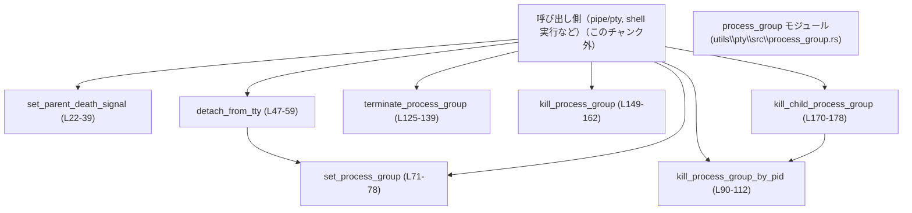
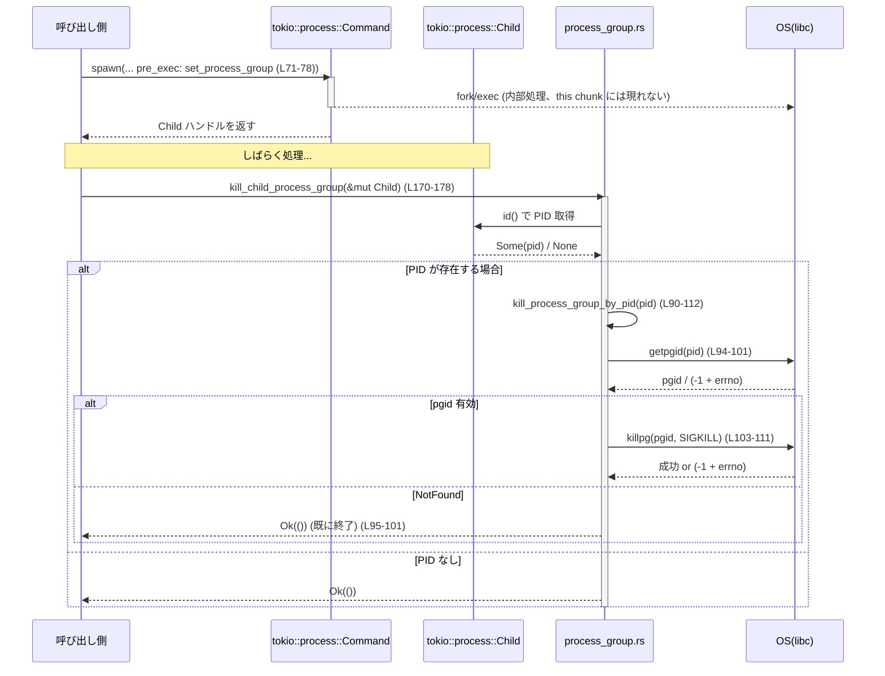

utils\pty\src\process_group.rs

---

## 0. ざっくり一言

Unix 系 OS 上でのプロセスグループ制御（セッション切り離し・PGID 設定・プロセスグループ kill など）と、Tokio 子プロセスに対する一括終了を提供するユーティリティモジュールです。  
非 Unix / 非 Linux では同じ API 名で「何もしない」実装を提供します（no-op）。  
（根拠: utils\pty\src\process_group.rs:L1-16, L41-45, L61-65 ほか）

---

## 1. このモジュールの役割

### 1.1 概要

- このモジュールは、**spawn した子プロセスやその子孫プロセスを確実にクリーンアップする**ための OS 依存処理をまとめています。（根拠: L1-16）
- 主な機能は:
  - 子プロセスを独立したプロセスグループに置く (`set_process_group`, `detach_from_tty`)（L5-8, L47-59, L71-78）
  - 親プロセス終了時に子へ SIGTERM を送る Linux 専用の設定 (`set_parent_death_signal`)（L22-39）
  - PGID ベースでプロセスグループ全体を終了 (`kill_process_group_by_pid`, `kill_process_group`, `terminate_process_group`)（L86-112, L147-162）
  - `tokio::process::Child` からそのプロセスグループを kill する (`kill_child_process_group`)（L170-178）
- 非対応 OS（非 Unix / 非 Linux）向けには同じ関数シグネチャを持つ no-op 実装を提供し、呼び出し側のコードを共通化できるようにしています。（L41-45, L61-65, L80-84, L114-118, L141-145, L164-168, L180-184）

### 1.2 アーキテクチャ内での位置づけ

コメントから、このモジュールは「pipe/pty 経由のコマンド実行」と「シェルコマンド実行」の両方から共有されるユーティリティであることが分かります。（根拠: L1-2）

主要な依存・呼び出し関係を Mermaid で表すと次のようになります。



- `detach_from_tty` は内部で `set_process_group` を呼びます（L53-55）。
- `kill_child_process_group` は `Child::id()` から PID を取得し、`kill_process_group_by_pid` を呼びます（L170-175）。

### 1.3 設計上のポイント

- **OS / プラットフォーム分岐を集約**  
  - Linux 専用: `set_parent_death_signal`（L22-39, L41-45）
  - Unix 専用: TTY・PGID・kill 系の実処理（L47-59, L71-78, L86-112, L120-139, L147-162, L170-178）
  - 非 Unix / 非 Linux: すべて no-op 実装（L41-45, L61-65, L80-84, L114-118, L141-145, L164-168, L180-184）
- **ベストエフォートな kill**  
  - 対象 PID / PGID がすでに存在しない場合は `ErrorKind::NotFound` を成功扱いとして握りつぶし、「終了済み」とみなす設計になっています（L95-101, L103-111, L152-159）。
- **`io::Result` ベースのエラーハンドリング**  
  - すべての関数が `io::Result` を返し、`libc` から取得したエラーをそのまま `io::Error::last_os_error()` として伝播しています（L27-30, L50-57, L71-77, L95-101, L103-111, L129-136, L153-159）。
- **`unsafe` を局所化**  
  - `libc` の FFI 呼び出しは `unsafe` ブロック内に閉じ込められ、それ以外は安全な Rust コードになっています（L27-28, L32-35, L50, L72, L94, L103, L129, L153）。
- **並行性**  
  - 関数自身は同期関数であり、`tokio` の非同期ランタイムには依存しません（`Child` を除く）。（L18-20）
  - OS のプロセスグループ・シグナルはプロセス全体で共有されるため、複数スレッドから同じ PGID を操作した場合のレース条件は OS のセマンティクスに従いますが、`ErrorKind::NotFound` を成功扱いにすることで、多重 kill 時のエラーを抑制しています（L95-101, L103-111, L152-159）。

---

## 2. 主要な機能一覧

（関数名はプラットフォーム共通の公開 API 名です）

- `set_parent_death_signal`: 親プロセス終了時に子プロセスへ SIGTERM を送る設定（Linux）。他 OS では no-op。（L22-39, L41-45）
- `detach_from_tty`: 新しいセッションを開始して制御 TTY から切り離し、必要に応じてプロセスグループを分離。（L47-59, L61-65）
- `set_process_group`: 呼び出しプロセスを新しいプロセスグループのリーダにする。（L67-78, L80-84）
- `kill_process_group_by_pid`: PID から PGID を解決し、そのプロセスグループ全体に SIGKILL を送る。（L86-112, L114-118）
- `terminate_process_group`: PGID に対して SIGTERM を送り、成功可否を bool で返す。（L120-139, L141-145）
- `kill_process_group`: PGID に対して SIGKILL を送り、グループ全体を終了させる。（L147-162, L164-168）
- `kill_child_process_group`: `tokio::process::Child` の PID からそのプロセスグループを kill する。（L170-178, L180-184）

---

## 3. 公開 API と詳細解説

### 3.1 型一覧（構造体・列挙体など）

このモジュール自身は構造体・列挙体などの新しい型を定義していません。

ただし、公開関数に現れる主要な外部型は次の通りです。

| 名前 | 種別 | 出典 | 役割 / 用途 | 根拠 |
|------|------|------|------------|------|
| `Child` | 構造体 | `tokio::process::Child` | 非同期に spawn された子プロセスを表すハンドル。`kill_child_process_group` の引数として使用。 | utils\pty\src\process_group.rs:L18-20, L170-178 |

### 3.2 関数詳細

以下では「API 名ごと」に詳細をまとめ、Linux/Unix/非 Unix での違いは本文中に明示します。

---

#### `set_parent_death_signal(parent_pid: libc::pid_t) -> io::Result<()>`

**概要**

- Linux では、親プロセスが終了した際にこのプロセスへ SIGTERM が自動的に送られるよう `prctl(PR_SET_PDEATHSIG, SIGTERM)` を設定します。（L27-30）
- さらに、フォーク後〜`exec` 前に親がすでに変わってしまっていないかを再確認し、違っていれば自発的に SIGTERM を送って即時終了します。（L32-36）
- 非 Linux では同名関数が no-op として定義されており、常に `Ok(())` を返します。（L41-45）

**引数**

| 引数名 | 型 | 説明 | 根拠 |
|--------|----|------|------|
| `parent_pid` | `libc::pid_t` (Linux) / `i32` (非 Linux) | `pre_exec` 前に取得した「元の親プロセスの PID」。現在の `getppid()` と比較するために使用。非 Linux では未使用。 | L22-27, L41-44 |

**戻り値**

- `Ok(())`: 設定が完了したか（Linux）、あるいは no-op が成功したこと（非 Linux）を表します。
- `Err(io::Error)`: `prctl` が `-1` を返した場合に OS エラーをラップして返します。（L27-30）

**内部処理の流れ（Linux）**

1. `libc::prctl(PR_SET_PDEATHSIG, SIGTERM)` を呼び出し、親死亡シグナルを SIGTERM に設定する（L27-30）。
2. `prctl` が `-1` を返した場合、`io::Error::last_os_error()` から生成したエラーで即 `Err` を返す（L27-30）。
3. 現在の親 PID を `libc::getppid()` で取得し、`parent_pid` と比較する（L32-33）。
4. 異なっていた場合、`libc::raise(SIGTERM)` で自プロセスに SIGTERM を送る（L32-36）。
5. それ以外の場合は `Ok(())` を返す（L38-39）。

**Examples（使用例）**

`tokio::process::Command` で子プロセスを spawn する際に、`pre_exec` で設定する例です（Linux 前提の例）。

```rust
use std::io;
use tokio::process::Command;
use utils::pty::process_group::set_parent_death_signal; // モジュールパスは実際の構成に応じて変更
use libc;

// 親プロセス終了時に子にも SIGTERM を伝播させるようにした上で spawn する例
async fn spawn_with_pdeathsig() -> io::Result<()> {
    let parent_pid = unsafe { libc::getpid() };                  // 親（現プロセス）の PID を取得

    let mut child = Command::new("sleep")                        // "sleep" コマンドを実行する子プロセスを作成
        .arg("60")                                               // 60秒スリープ
        .pre_exec(move || {                                      // fork 後 exec 前に呼ばれるフック
            set_parent_death_signal(parent_pid)?;                // 親死亡シグナルを設定
            Ok(())                                               // pre_exec の結果として Ok を返す
        })
        .spawn()?;                                               // 子プロセスを非同期で起動

    let _status = child.wait().await?;                           // 子プロセスの終了を待つ
    Ok(())
}
```

※ この例ではモジュールパス `utils::pty::process_group` は仮のものであり、このチャンクからは実際のクレート構成は分かりません。

**Errors / Panics**

- `prctl` 呼び出しが失敗した場合（例: カーネルがサポートしていないなど）、`io::Error::last_os_error()` による `Err` を返します（L27-30）。
- `getppid` / `raise` は戻り値をチェックしていないため、この関数自体はそれらの失敗を検知しません（L32-35）。
- Rust レベルでの `panic!` は発生しません。

**Edge cases（エッジケース）**

- `parent_pid` が実際の親 PID と異なる値だった場合、`getppid()` との比較で不一致となり `SIGTERM` を自プロセスに送るため、子プロセスは即座に終了します（L32-36）。
- `pre_exec` 中に親がすでに終了していて別のプロセスに PID が再利用されている場合など、親 PID が期待と異なれば同様に自殺します。この挙動はコメント上、「フォーク/exec 間のレースを避けるため」と説明されています（L25-26, L32-36）。

**使用上の注意点**

- この関数は **Linux 専用の意味を持つ** ので、他 OS では no-op になることを前提に設計する必要があります（L22-27, L41-45）。
- `pre_exec` で渡すクロージャ内から呼び出すことを前提とした設計である旨がコメントから分かります（L25-26）。
- `parent_pid` は必ず spawn 前（`fork` 前）に取得した PID を渡す必要があります。そうでないと子が誤って自殺する可能性があります。

---

#### `detach_from_tty() -> io::Result<()>`

**概要**

- Unix では `setsid()` を呼び出して新しいセッションを開始し、現在の制御 TTY から切り離します（L47-51）。
- `setsid()` が `EPERM` で失敗した場合はフォールバックとして `set_process_group()` を呼び、プロセスグループだけを分離します（L52-55）。
- 非 Unix では no-op 実装で常に `Ok(())` を返します（L61-65）。

**引数**

- 引数なし。

**戻り値**

- `Ok(())`: セッション開始 / プロセスグループ分離が成功、あるいは no-op 成功。
- `Err(io::Error)`: `setsid()` が `EPERM` 以外の理由で失敗した場合の OS エラー（L50-57）。

**内部処理の流れ（Unix）**

1. `libc::setsid()` を呼び、新しいセッションを開始（L50）。
2. 戻り値が `-1` の場合、`io::Error::last_os_error()` を取得（L50-52）。
3. エラーコードが `EPERM`（すでにセッションリーダであるなど）なら、`set_process_group()` を呼び出してプロセスグループのみを分離し、その結果を返す（L52-55）。
4. `EPERM` 以外のエラーなら、そのエラーで `Err` を返す（L52-57）。
5. `setsid()` が成功した場合は `Ok(())` を返す（L58-59）。

**Examples（使用例）**

非インタラクティブな子プロセスを TTY から切り離したい場合の例です（Unix 前提）。

```rust
use std::io;
use tokio::process::Command;
use utils::pty::process_group::detach_from_tty;

// 非インタラクティブなコマンドを制御TTYから切り離して起動する例
async fn spawn_detached() -> io::Result<()> {
    let mut child = Command::new("some-daemon")        // デーモン的なコマンドを起動
        .pre_exec(|| {                                // fork 後 exec 前
            detach_from_tty()?;                       // セッションを開始し、TTY から切り離す
            Ok(())
        })
        .spawn()?;                                    // 子プロセスを起動

    let _status = child.wait().await?;
    Ok(())
}
```

**Errors / Panics**

- `setsid()` が `-1` を返し、その原因が `EPERM` 以外なら `Err(io::Error)` を返します（L50-57）。
- `EPERM` の場合は `set_process_group()` を呼び、その結果の `Err` がそのまま返ります（L52-55, L71-77）。
- `panic!` は使用していません。

**Edge cases**

- すでにセッションリーダで `setsid()` が `EPERM` となるケースでは、セッション分離は行われず、プロセスグループのみが分離されます（L52-55）。
- `set_process_group()` が失敗した場合（例: 権限不足など）は、そのエラーが呼び出し元へ返ります（L71-77）。

**使用上の注意点**

- `detach_from_tty` を `pre_exec` で呼び、子プロセスのコンテキストで実行することが想定されています（コメントより。ただし、コメントには直接は書かれておらず、モジュール概要からの推測となるため、厳密には「pre_exec を含む文脈で使われる」程度に留まります）。
- セッション分離はプロセスに広い影響を与えるため、**親プロセスではなく子プロセス側でのみ呼ぶ**設計が望ましいと考えられます。

---

#### `set_process_group() -> io::Result<()>`

**概要**

- Unix では `setpgid(0, 0)` を呼び出し、自プロセスを新しいプロセスグループのリーダとします（L71-72）。
- 非 Unix では no-op 実装で常に `Ok(())` を返します（L80-84）。
- コメント上、「`pre_exec` で使うことを意図している」と明記されています（L69-71）。

**引数**

- 引数なし。

**戻り値**

- `Ok(())`: プロセスグループ設定が成功、または no-op 成功。
- `Err(io::Error)`: `setpgid` が `-1` を返した場合に OS エラーをラップして返します（L72-77）。

**内部処理の流れ（Unix）**

1. `libc::setpgid(0, 0)` を呼び、自プロセスの PGID を自身の PID に設定（L72）。
2. 戻り値が `-1` の場合、`io::Error::last_os_error()` を返す（L72-75）。
3. それ以外の場合は `Ok(())` を返す（L75-77）。

**Examples（使用例）**

`pre_exec` で単純にプロセスグループだけを分離したい場合:

```rust
use std::io;
use tokio::process::Command;
use utils::pty::process_group::set_process_group;

// 子プロセスを独立したプロセスグループに入れて起動する例
async fn spawn_in_own_pgid() -> io::Result<()> {
    let mut child = Command::new("long_running_task")  // 長時間動作するタスク
        .pre_exec(|| {
            set_process_group()?;                     // 子を新しいプロセスグループのリーダにする
            Ok(())
        })
        .spawn()?;                                    // 子プロセスを起動

    let _status = child.wait().await?;
    Ok(())
}
```

**Errors / Panics**

- `setpgid` が失敗した場合（例: 権限がない、プロセス状態が不正など）、`io::Error::last_os_error()` による `Err` を返します（L72-77）。
- `panic!` は発生しません。

**Edge cases**

- 呼び出しタイミングやプロセス状態によっては `setpgid` が失敗することがあります。Unix の `setpgid` の仕様に依存するため、このモジュールのコードだけから具体的な条件までは読み取れません。

**使用上の注意点**

- コメントにある通り、**`pre_exec` で子プロセス側から呼ぶことを意図した API** です（L69-71）。
- これを呼ばずに後述の `kill_process_group_by_pid` 等で PGID を kill すると、親と同じプロセスグループが kill 対象になるなど、意図しない影響を与える可能性があります（この点は POSIX の仕様から推測されるものであり、コードから直接は分かりません）。

---

#### `kill_process_group_by_pid(pid: u32) -> io::Result<()>`

**概要**

- Unix では、指定された PID が属するプロセスグループ ID (PGID) を `getpgid(pid)` で取得し、その PGID に対して `killpg(SIGKILL)` を送ってグループ全体を kill します（L90-103）。
- PID や PGID が存在しない場合は `ErrorKind::NotFound` を成功扱いとして握りつぶし、`Ok(())` を返します（L95-101, L103-111）。
- 非 Unix では no-op で常に `Ok(())` を返します（L114-118）。

**引数**

| 引数名 | 型 | 説明 | 根拠 |
|--------|----|------|------|
| `pid` | `u32` | 対象プロセスの PID。PGID を解決するために使用される。 | L90-95 |

**戻り値**

- `Ok(())`: 指定 PID の PGID に SIGKILL を送信できた、あるいはすでに存在していない（NotFound）ため kill の必要がなかったことを意味します（L95-101, L103-111）。
- `Err(io::Error)`: `getpgid` や `killpg` が `NotFound` 以外のエラーで失敗した場合（L95-101, L103-111）。

**内部処理の流れ（Unix）**

1. `pid` を `libc::pid_t` にキャスト（L93）。
2. `libc::getpgid(pid)` を呼び、PGID を取得（L94）。
3. `pgid == -1` の場合、`io::Error::last_os_error()` を取得し、`ErrorKind::NotFound` 以外なら `Err` を返し、NotFound なら `Ok(())` を返す（L95-101）。
4. `libc::killpg(pgid, SIGKILL)` を実行してプロセスグループに SIGKILL を送信（L103）。
5. `killpg` が `-1` の場合、同様に `ErrorKind::NotFound` 以外なら `Err`、NotFound なら成功扱い（L104-109）。
6. 最終的に `Ok(())` を返す（L111-112）。

**Examples（使用例）**

`tokio::process::Child` の PID を使わず、既知の PID から直接プロセスグループを kill する例:

```rust
use std::io;
use utils::pty::process_group::kill_process_group_by_pid;

// 既知の PID を持つプロセス（とそのグループ）を強制終了する例
fn kill_by_pid_example(target_pid: u32) -> io::Result<()> {
    // target_pid の属するプロセスグループ全体に SIGKILL を送る
    kill_process_group_by_pid(target_pid)
}
```

**Errors / Panics**

- `getpgid` / `killpg` の失敗で `ErrorKind::NotFound` 以外のエラーが発生した場合に `Err(io::Error)` を返します（L95-101, L103-111）。
- 対象 PID / PGID が存在しない場合は `NotFound` を握りつぶして `Ok(())` を返すので、呼び出し側では「すでに終了している」ケースと区別できません。
- panic はありません。

**Edge cases**

- `pid` が既に終了している、あるいは存在しない場合: `getpgid` が `ESRCH`（`ErrorKind::NotFound`）となり、`Ok(())` を返します（L95-101）。
- PGID が存在しない場合: `killpg` が NotFound を返し、これも成功扱いです（L104-109）。
- `pid` が別ユーザのプロセスなどで権限がない場合: OS が `EPERM` などを返し、`Err(io::Error)` になります（具体的な errno 値はコード上では判別していません）。

**使用上の注意点**

- **「必ず kill できた」かどうかは、この API だけからは分かりません**。NotFound を成功扱いにするため、「元からいなかった」のか「今 kill に成功した」のかを区別しません。
- すでに自前で PGID を管理している場合には、後述の `kill_process_group` / `terminate_process_group` の方が単純です。

---

#### `terminate_process_group(process_group_id: u32) -> io::Result<bool>`

**概要**

- Unix では、指定された PGID に対して `killpg(SIGTERM)` を送り、プロセスグループ全体にソフトな終了要求（SIGTERM）を出します（L125-130）。
- 戻り値 `Ok(true)` は「PGID が存在し SIGTERM を送れた」、`Ok(false)` は「PGID が存在しなかった（NotFound）」を意味します（L123-125, L131-138）。
- 非 Unix では no-op で `Ok(false)` を返します（L141-145）。

**引数**

| 引数名 | 型 | 説明 | 根拠 |
|--------|----|------|------|
| `process_group_id` | `u32` | 対象プロセスグループの PGID。 | L125, L128 |

**戻り値**

- `Ok(true)`: `killpg` により SIGTERM が送信されたと解釈できるケース（L129-130, L138-139）。
- `Ok(false)`: PGID が存在せず、`ErrorKind::NotFound` が返されたケース（L131-134）。
- `Err(io::Error)`: `killpg` が NotFound 以外のエラーで失敗した場合（L131-136）。

**内部処理の流れ（Unix）**

1. `process_group_id` を `libc::pid_t` にキャスト（L128）。
2. `libc::killpg(pgid, SIGTERM)` を呼び出す（L129）。
3. 戻り値が `-1` の場合、`io::Error::last_os_error()` を取得（L130-132）。
4. エラー種別が `ErrorKind::NotFound` なら `Ok(false)` を返し、それ以外なら `Err(err)` を返す（L131-136）。
5. `killpg` が成功した場合は `Ok(true)` を返す（L138-139）。

**Examples（使用例）**

SIGTERM を送ってから少し待ち、まだ終了していなければ SIGKILL を送るパターンの一部として:

```rust
use std::io;
use std::time::Duration;
use std::thread;
use utils::pty::process_group::{terminate_process_group, kill_process_group};

// PGID に対して「まず SIGTERM、その後必要に応じて SIGKILL」を行う例
fn graceful_then_force_kill(pgid: u32) -> io::Result<()> {
    match terminate_process_group(pgid)? {               // まず SIGTERM を送信
        true => {
            // 一定時間待ってから、まだ生きている場合に備えて後続処理を入れる想定
            thread::sleep(Duration::from_secs(5));       // 単純な同期 sleep（tokio であれば sleep を使う）
            // ここで状態を確認する処理は、このチャンクには現れません
        }
        false => {
            // PGID がすでに存在しない場合
        }
    }

    // 最後に念のため SIGKILL を送る
    kill_process_group(pgid)?;                           // NotFound は成功扱い
    Ok(())
}
```

**Errors / Panics**

- `killpg` が `ErrorKind::NotFound` 以外のエラーを返した場合に `Err(io::Error)` を返します（L131-136）。
- panic はありません。

**Edge cases**

- PGID がすでに存在しない場合でも `Ok(false)` として返るため、「終了している」ことを呼び出し側は知ることができます（L131-134）。
- 権限不足などで SIGTERM を送れない場合は `Err` になり、強制 kill に切り替えるなどの処理は呼び出し側で実装する必要があります。

**使用上の注意点**

- `Ok(true)` であっても、**すぐにプロセスが終了した保証はありません**。SIGTERM を受け取ったプロセスがクリーンアップをしている間は生存している可能性があります。
- 必要に応じて `kill_process_group` と組み合わせて、「優先的に SIGTERM、それでも完了しなければ SIGKILL」といった 2 段階終了戦略を取ることが想定されます（この組合せ自体はコードから明示されているわけではなく、設計上自然な使用例です）。

---

#### `kill_process_group(process_group_id: u32) -> io::Result<()>`

**概要**

- Unix では、指定 PGID に対して `killpg(SIGKILL)` を送り、プロセスグループ全体を強制終了します（L149-153）。
- PGID が存在しない場合（NotFound）は成功扱いで `Ok(())` を返します（L154-159）。
- 非 Unix では no-op で常に `Ok(())` を返します（L164-168）。

**引数**

| 引数名 | 型 | 説明 | 根拠 |
|--------|----|------|------|
| `process_group_id` | `u32` | 対象 PGID。 | L149-153 |

**戻り値**

- `Ok(())`: SIGKILL を送れた、または PGID が存在しない（NotFound）ケース。
- `Err(io::Error)`: `killpg` が NotFound 以外のエラーで失敗した場合（L154-159）。

**内部処理の流れ（Unix）**

1. `process_group_id` を `libc::pid_t` にキャスト（L152）。
2. `libc::killpg(pgid, SIGKILL)` を呼び出す（L153）。
3. 戻り値が `-1` なら `io::Error::last_os_error()` を取得し、`ErrorKind::NotFound` 以外なら `Err(err)`、NotFound なら成功扱い（L154-159）。
4. それ以外の場合は `Ok(())` を返す（L161-162）。

**Examples（使用例）**

後述の `terminate_process_group` と組み合わせた例を参照してください。単独利用例:

```rust
use std::io;
use utils::pty::process_group::kill_process_group;

// PGID が分かっているプロセスグループを強制終了する例
fn force_kill_group(pgid: u32) -> io::Result<()> {
    kill_process_group(pgid)  // NotFound でも Ok(())
}
```

**Errors / Panics**

- `killpg` が NotFound 以外のエラーを返したケースでのみ `Err(io::Error)` を返します（L154-159）。
- panic は発生しません。

**Edge cases**

- PGID がすでに存在しない場合でも `Ok(())` が返るため、「既に終了済み」と「今 kill した」を区別できません。
- 同じ PGID に対して複数回この関数を呼んでも、NotFound が成功扱いになるため、多重 kill でエラーになることはありません。

**使用上の注意点**

- SIGKILL はプロセスにクリーンアップの機会を与えないため、ファイル破損や一部リソースリークのリスクがあります。可能であれば `terminate_process_group` を先に試す設計が望まれます（設計上の一般論であり、このモジュールに特有のものではありません）。

---

#### `kill_child_process_group(child: &mut Child) -> io::Result<()>`

**概要**

- Unix では `tokio::process::Child` から PID を取得し、その PID が属するプロセスグループ全体を `kill_process_group_by_pid` で kill します（L170-175）。
- 子プロセスの PID がすでに存在しない場合や不明な場合（`id()` が `None` を返す）は何も行わず `Ok(())` を返します（L172-177）。
- 非 Unix では no-op 実装で常に `Ok(())` を返します（L180-184）。

**引数**

| 引数名 | 型 | 説明 | 根拠 |
|--------|----|------|------|
| `child` | `&mut Child` | Tokio が管理する子プロセスハンドル。`id()` を通じて PID を取得します。 | L18-20, L170-175 |

**戻り値**

- `Ok(())`: kill が成功した、PID が存在しなかった/不明だった、あるいは非 Unix で no-op が成功したことを示します。
- `Err(io::Error)`: 内部で呼び出している `kill_process_group_by_pid` がエラーを返した場合（L172-175, L90-112）。

**内部処理の流れ（Unix）**

1. `child.id()` を呼び、`Option<u32>` の PID を取得（L172-173）。
2. `Some(pid)` であれば `kill_process_group_by_pid(pid)` を呼び、その結果を返す（L172-175）。
3. `None` の場合は何もせず `Ok(())` を返す（L177-178）。

**Examples（使用例）**

Tokio で spawn した子プロセスをキャンセルする際に、プロセスグループごと kill する例:

```rust
use std::io;
use tokio::process::Command;
use utils::pty::process_group::{set_process_group, kill_child_process_group};

// tokio で spawn した子プロセスとその子孫をまとめて kill する例
async fn run_and_maybe_cancel() -> io::Result<()> {
    let mut child = Command::new("long_running_task")
        .pre_exec(|| {
            set_process_group()?;                 // 子プロセスを独立した PGID に入れる
            Ok(())
        })
        .spawn()?;                               // 子プロセスを起動

    // ... 何らかの条件でキャンセルしたくなったとする
    kill_child_process_group(&mut child)?;       // PGID 全体を SIGKILL

    Ok(())
}
```

**Errors / Panics**

- `child.id()` が `Some` で、内部の `kill_process_group_by_pid` が `Err(io::Error)` を返した場合、そのエラーがそのまま返ります（L172-175）。
- PID が取得できない (`None`) 場合はエラーになりません（L172-178）。
- panic はありません。

**Edge cases**

- `child.id()` が `None` の場合: 何もせず `Ok(())` を返すため、「PID が分からないので kill できなかった」として扱われます（L172-178）。
- 子プロセスがすでに終了して PID が再利用された場合など、`kill_process_group_by_pid` 側の挙動（NotFound の扱い）に依存します（L90-112）。

**使用上の注意点**

- この関数は `Child` を `&mut` 借用しますが、内部では `Child` 自体の状態を変更しません（`id()` の呼び出しのみ）。`&mut` は `Child::id()` のシグネチャの都合によるものと考えられます（関数シグネチャからの推測）。
- kill が成功したかどうかをより詳しく知りたい場合は、`kill_process_group_by_pid` を直接呼び出し、エラーを精査する必要があります。

---

### 3.3 その他の関数

このモジュールには上記 7 つの API 名以外の公開関数は存在しません。  
各 API 名ごとに Unix / 非 Unix / Linux / 非 Linux のバリアントがありますが、名前とシグネチャは共通であり、コンパイル時にいずれか一方のみが有効になります（L22-45, L47-65, L67-84, L86-118, L120-145, L147-168, L170-184）。

#### コンポーネント（関数）インベントリー

要求のあった全 14 定義を一覧化します。

| 関数名 (バリアント) | プラットフォーム条件 | シグネチャ | 役割 | 根拠 |
|---------------------|----------------------|------------|------|------|
| `set_parent_death_signal` | `target_os = "linux"` | `fn(parent_pid: libc::pid_t) -> io::Result<()>` | 親死亡シグナル設定 + 親 PID 再確認 | utils\pty\src\process_group.rs:L22-39 |
| `set_parent_death_signal` | `not(target_os = "linux")` | `fn(_parent_pid: i32) -> io::Result<()>` | no-op 実装 | utils\pty\src\process_group.rs:L41-45 |
| `detach_from_tty` | `unix` | `fn() -> io::Result<()>` | `setsid()` によるセッション開始 + 必要なら PGID 分離 | L47-59 |
| `detach_from_tty` | `not(unix)` | `fn() -> io::Result<()>` | no-op 実装 | L61-65 |
| `set_process_group` | `unix` | `fn() -> io::Result<()>` | `setpgid(0, 0)` による PGID 設定 | L67-78 |
| `set_process_group` | `not(unix)` | `fn() -> io::Result<()>` | no-op 実装 | L80-84 |
| `kill_process_group_by_pid` | `unix` | `fn(pid: u32) -> io::Result<()>` | PID から PGID を解決し SIGKILL | L86-112 |
| `kill_process_group_by_pid` | `not(unix)` | `fn(_pid: u32) -> io::Result<()>` | no-op 実装 | L114-118 |
| `terminate_process_group` | `unix` | `fn(process_group_id: u32) -> io::Result<bool>` | PGID に SIGTERM を送り成功可否を返す | L120-139 |
| `terminate_process_group` | `not(unix)` | `fn(_process_group_id: u32) -> io::Result<bool>` | no-op 実装（常に false） | L141-145 |
| `kill_process_group` | `unix` | `fn(process_group_id: u32) -> io::Result<()>` | PGID に SIGKILL を送る | L147-162 |
| `kill_process_group` | `not(unix)` | `fn(_process_group_id: u32) -> io::Result<()>` | no-op 実装 | L164-168 |
| `kill_child_process_group` | `unix` | `fn(child: &mut Child) -> io::Result<()>` | `Child::id()` から PGID を解決し SIGKILL | L170-178 |
| `kill_child_process_group` | `not(unix)` | `fn(_child: &mut Child) -> io::Result<()>` | no-op 実装 | L180-184 |

---

## 4. データフロー

ここでは代表的なシナリオとして、「Tokio で spawn した子プロセスを自前のプロセスグループに入れ、後からプロセスグループごと kill する」流れを整理します。

### シナリオの概要

1. 呼び出し側が `tokio::process::Command` を使って子プロセスを spawn する。
2. `pre_exec` フック内で `set_process_group()` や `detach_from_tty()` を呼び、子プロセスを独立した PGID やセッションにする（L47-59, L71-78）。
3. 何らかの理由で子プロセスをキャンセルしたくなったときに、`kill_child_process_group()` を呼ぶ（L170-178）。
4. `kill_child_process_group` は `Child::id()` から PID を取得し、`kill_process_group_by_pid()` を呼ぶ（L170-175, L90-112）。
5. `kill_process_group_by_pid` は `getpgid` → `killpg(SIGKILL)` という流れでプロセスグループ全体を kill する（L93-103）。

### シーケンス図



- 図中の行番号は対応する関数の定義箇所です。

---

## 5. 使い方（How to Use）

### 5.1 基本的な使用方法

代表的な流れを 1 つにまとめると、次のようになります（Unix + tokio 前提の擬似コードです）。

```rust
use std::io;
use tokio::process::Command;
use utils::pty::process_group::{
    set_parent_death_signal,
    detach_from_tty,
    set_process_group,
    kill_child_process_group,
};
use libc;

// 子プロセスを独立した PGID / セッションにし、親死亡シグナルも設定して起動し、必要なら PGID ごと kill する例
async fn run_child_with_cleanup() -> io::Result<()> {
    let parent_pid = unsafe { libc::getpid() };          // （Linux）親 PID を取得

    let mut child = Command::new("some_command")         // 実行したいコマンドを指定
        .arg("arg1")
        .pre_exec(move || {                              // fork 後 exec 前
            // 親死亡シグナル設定（Linux のみ有効）
            let _ = set_parent_death_signal(parent_pid); // 失敗しても致命的でないなら無視も可

            // 制御 TTY から切り離し、必要なら PGID 分離
            detach_from_tty()?;                          // あるいは set_process_group() のみを呼ぶ設計もあり

            Ok(())
        })
        .spawn()?;                                       // 子プロセスを非同期で起動

    // ... 何らかの処理 ...

    // キャンセルしたい場合、子プロセスとその子孫を PGID ごと kill
    kill_child_process_group(&mut child)?;               // NotFound も Ok(()) になる

    Ok(())
}
```

### 5.2 よくある使用パターン

1. **「まず SIGTERM、その後 SIGKILL」の二段階終了**

   - `terminate_process_group(pgid)` で SIGTERM を送り、少し待ってから `kill_process_group(pgid)` で SIGKILL を送る。
   - クリーンな終了を優先しつつ、ハングしているプロセスに対しては強制終了も行える。

2. **PID ベースの後追い kill**

   - 何らかの理由で PGID を保持していない場合に、`kill_process_group_by_pid(pid)` を使って PGID を解決しつつ kill。
   - `kill_child_process_group(&mut Child)` はこのパターンの `Child` ラッパです（L170-175）。

### 5.3 よくある間違い

コードから推測できる範囲で、起こり得る誤用パターンを挙げます。

```rust
// 誤用例: set_process_group を呼ばずに kill_process_group_by_pid を使う（推測ベース）
//
// 親と同じ PGID のまま子プロセスを起動すると、親も含むプロセスグループ全体が kill 対象になる可能性があります。
// ※この挙動は POSIX の仕様に基づく一般論であり、このリポジトリ特有のバグとして確認されたものではありません。

// 正しい例: pre_exec で PGID を分離してから kill する
/*
.pre_exec(|| {
    set_process_group()?;      // 子を独自の PGID にする
    Ok(())
})

// 後で
kill_child_process_group(&mut child)?;   // 子の PGID のみが kill 対象になる
*/
```

```rust
// 誤用例: 非 Unix / 非 Linux でも kill 系関数が動作すると期待する
//
// 非 Unix ではすべての関数が no-op になっており、プロセスの終了は行われません（L61-65 など）。

// 正しい例: OS によって kill の実効性が異なることを前提に設計する
/*
if cfg!(unix) {
    kill_child_process_group(&mut child)?;
} else {
    // Windows 等では別の終了ロジックを用意する必要がある
}
*/
```

### 5.4 使用上の注意点（まとめ）

- **プラットフォーム差異**  
  - Unix / Linux 以外ではすべての関数が no-op であり、プロセスグループ操作は実際には行われません（L41-45, L61-65, L80-84, L114-118, L141-145, L164-168, L180-184）。
- **プロセスグループ設計**  
  - `set_process_group` や `detach_from_tty` を使って、意図した単位ごとに PGID を分離しておかないと、`kill_process_group*` 系が想定外のプロセスを巻き込む可能性があります（一般論）。
- **エラー処理と NotFound の扱い**  
  - `kill_*` 系は `ErrorKind::NotFound` を成功扱いにしているため、「すでに終了した」ケースと「今 kill に成功した」ケースを区別しません（L95-101, L103-111, L131-134, L154-159）。
- **並行性**  
  - これらの関数はスレッドセーフに設計されていますが、プロセスグループや PID の状態は OS 全体で共有されるため、他スレッド・他プロセスからの操作とレースし得ます。NotFound を握りつぶす設計により、多重 kill 時のエラーは抑えられています。

---

## 6. 変更の仕方（How to Modify）

### 6.1 新しい機能を追加する場合

このモジュールに新しいプロセスグループ関連機能を追加する際の一般的な手順です。

1. **どのファイルに書くか**  
   - OS 依存のプロセスグループ操作を行いたい場合は、この `utils\pty\src\process_group.rs` に追加するのが自然です。
2. **プラットフォームごとのバリアントを用意する**  
   - 既存の関数と同様に、`#[cfg(unix)]` と `#[cfg(not(unix))]`、あるいは `#[cfg(target_os = "linux")]` / `#[cfg(not(target_os = "linux"))]` で実装と no-op を分ける設計が踏襲されています（L22-45, L47-65 など）。
3. **既存の関数・型への依存**  
   - 例えば「PGID に別のシグナルを送る」関数を追加したい場合、`kill_process_group` や `terminate_process_group` の実装を参考に、`killpg` 呼び出しと `ErrorKind::NotFound` の扱いを合わせることができます（L129-136, L153-159）。
4. **呼び出される場所**  
   - コメントによると、pipe/pty や shell 実行系から呼ばれる設計のため、その呼び出し側モジュールに新 API を export する必要があるかどうかを確認する必要があります。このチャンクにはそのファイルは現れないため、実際の経路は不明です。

### 6.2 既存の機能を変更する場合

- **影響範囲の確認**
  - プロセスグループやシグナルの扱いはプロセス全体に影響するため、呼び出し箇所（pipe/pty, shell 実行など）を洗い出してから変更する必要があります。  
    このチャンクには呼び出し元のパスは現れないため、リポジトリ全体での検索が必要です。
- **契約（前提条件・戻り値の意味）の維持**
  - `kill_*` 系が `ErrorKind::NotFound` を成功扱いにしている挙動や、`terminate_process_group` が `bool` で存在有無を返す挙動は、既存コードが前提としている可能性があります（L95-101, L103-111, L131-139, L154-159）。
  - これらの仕様を変える場合は、呼び出し側のエラー処理コードも同時に見直す必要があります。
- **Linux / Unix 以外での挙動**
  - 現状は no-op でコンパイルは通るが何もしない、という仕様です。ここを変更して実際に kill 動作を追加する場合（例: Windows 向けの実装など）は、呼び出し側が「今まで動いていなかったが、急に kill されるようになる」ことに注意が必要です。
- **テスト・検証**
  - このファイルにテストコードは含まれていません（L1-184）。OS 依存のコードであるため、統合テストや手動検証が重要になります。

---

## 7. 関連ファイル

このチャンク内には他の自前ファイルへの具体的な参照は登場しませんが、コメントから次のような関係が推測できます。

| パス / モジュール | 役割 / 関係 | 根拠 |
|------------------|------------|------|
| pipe/pty 関連モジュール | この `process_group` モジュールを共有して使う呼び出し側。具体的なパスは不明。 | `"Process-group helpers shared by pipe/pty and shell command execution."`（L1-2） |
| シェルコマンド実行モジュール | 同上。spawn したコマンドのクリーンアップに本モジュールの API を利用していると考えられます。 | L1-2 |
| `tokio::process` | `Child` 型を提供し、非同期プロセス実行を行う外部クレート。`kill_child_process_group` で利用。 | L18-20, L170-178 |
| `libc` クレート | `prctl`, `setsid`, `setpgid`, `getpgid`, `killpg`, `getpid`, `getppid`, `raise` などの低レベル OS API を提供。 | L27-28, L32-35, L50, L72, L94, L103, L129, L153 |

このチャンクだけからは、具体的な crate 名やモジュールツリーは分からないため、`utils::pty::process_group` といったパスはサンプルにおける仮の表記であることに注意が必要です。
