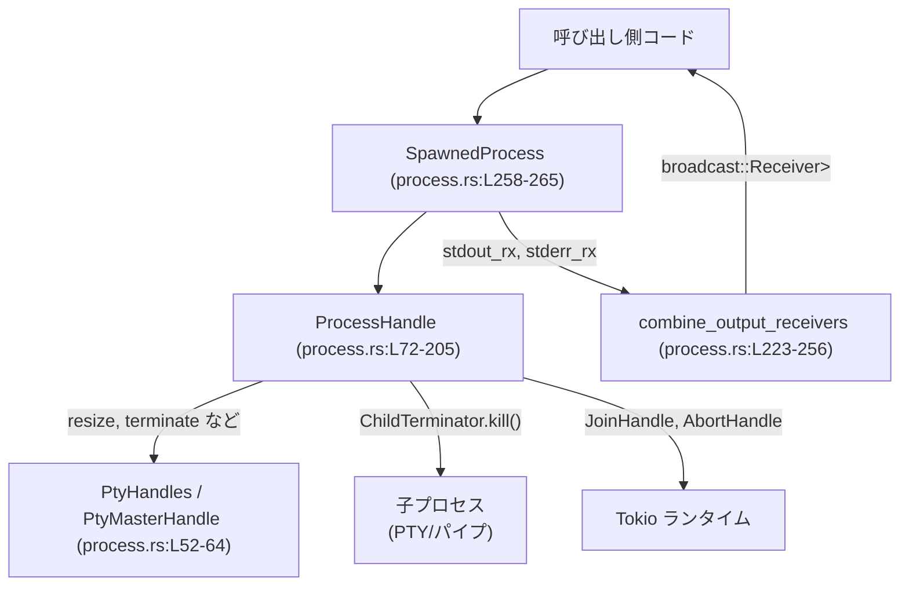
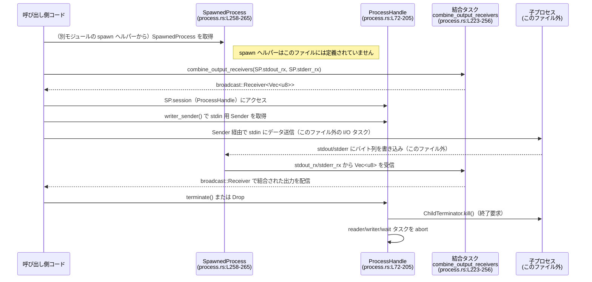

# utils/pty/src/process.rs コード解説

## 0. ざっくり一言

PTY（擬似端末）またはパイプで起動した **子プロセスの制御ハンドル** と、  
その標準出力／標準エラーのチャネルをまとめるユーティリティを提供するモジュールです（process.rs:L72-L85, L223-L265）。

---

## 1. このモジュールの役割

### 1.1 概要

- このモジュールは、**非同期環境（Tokio）で起動した対話的な子プロセス**を安全に扱うためのハンドルとユーティリティを提供します。
- 子プロセスの
  - 標準入力の書き込み（`ProcessHandle::writer_sender`）
  - 終了状態の確認（`has_exited`, `exit_code`）
  - 終了要求と強制終了（`request_terminate`, `terminate`）
  - PTY サイズ変更（`resize`）
  をカプセル化しています（process.rs:L72-L200）。
- また、`stdout` / `stderr` を別々のチャネルで受けている場合に、**1本の broadcast チャネルに結合する**関数を提供します（process.rs:L223-L256）。

### 1.2 アーキテクチャ内での位置づけ

このファイルだけから読み取れる範囲での依存関係を示します。



- `SpawnedProcess` は「spawn ヘルパー」の戻り値として設計されていますが、そのヘルパー関数自体はこのファイルにはありません（process.rs:L258-L265）。
- `ProcessHandle` は、子プロセスのライフサイクルをまとめて管理する中心的な型です（process.rs:L72-L85）。
- `PtyHandles` / `PtyMasterHandle` は、PTY の master/slave ハンドルを保持し、特にウィンドウサイズ変更のために使われます（process.rs:L52-L64, L142-L155）。
- `combine_output_receivers` は、`SpawnedProcess` が持つ `stdout_rx` / `stderr_rx` を 1 本の `broadcast::Receiver<Vec<u8>>` にまとめる役割です（process.rs:L223-L256）。

### 1.3 設計上のポイント

- **責務の分割**
  - `ProcessHandle`: 子プロセスの I/O タスクと終了処理のハンドル管理（process.rs:L72-L85）。
  - `PtyHandles` / `PtyMasterHandle`: PTY のリソースとサイズ変更処理のための抽象（process.rs:L52-L64, L142-L155）。
  - `SpawnedProcess`: 呼び出し側が使う「まとめて返すパッケージ」（ハンドル＋チャネル）（process.rs:L258-L265）。
  - `combine_output_receivers`: 出力チャネル結合専用の純粋なユーティリティ（process.rs:L223-L256）。
- **状態管理**
  - `ProcessHandle` は、`StdMutex`（std::sync::Mutex）と `Arc` を使って、複数スレッドから安全にアクセス可能な構造になっています（process.rs:L74-L81）。
  - プロセス終了有無は `AtomicBool`（`exit_status`）で保持し、終了コードは `Mutex<Option<i32>>` で保持します（process.rs:L80-L81）。
- **エラーハンドリング方針**
  - PTY サイズ変更は `anyhow::Result<()>` を返し、`Mutex` ロック失敗や「PTY でない場合」をエラーとして返します（process.rs:L142-L155）。
  - `exit_code()` では `Mutex` のポイズン（異常終了）を `None`（不明）として扱い、エラー型を外に出しません（process.rs:L138-L140）。
  - 出力結合時の `broadcast::Sender::send` の失敗は黙って無視し、一部の購読者がいなくても処理を止めません（process.rs:L236-L237, L244-L245）。
- **並行性**
  - 子プロセス I/O や wait 処理は `tokio::task::JoinHandle` / `AbortHandle` を通じて管理され、`terminate()` で一括 abort されます（process.rs:L72-L79, L176-L199）。
  - `combine_output_receivers` は `tokio::spawn` と `tokio::select!` を使い、2 本の mpsc チャネルを非同期に同時監視します（process.rs:L223-L253）。
- **リソース解放**
  - `ProcessHandle` の `Drop` 実装で必ず `terminate()` が呼ばれるため、ハンドルがスコープから外れた時点で子プロセスへ終了要求が行われ、補助タスクも abort されます（process.rs:L202-L205）。

---

## 2. 主要な機能一覧（コンポーネントインベントリー付き）

### 2.1 主な機能

- 子プロセス制御ハンドル `ProcessHandle` の提供（標準入力書き込み・終了管理・PTY サイズ変更）（process.rs:L72-L200）。
- PTY の master/slave ハンドルを保持する `PtyHandles` と、そのサイズ変更の抽象 `PtyMasterHandle`（process.rs:L52-L64, L142-L155）。
- `stdout` と `stderr` の 2 本の `mpsc::Receiver<Vec<u8>>` を 1 本の `broadcast::Receiver<Vec<u8>>` に結合する `combine_output_receivers`（process.rs:L223-L256）。
- spawn ヘルパーからの戻り値として使う `SpawnedProcess`（process.rs:L258-L265）。
- 端末サイズを表す `TerminalSize` と、それを `portable_pty::PtySize` に変換する機能（process.rs:L23-L44）。

### 2.2 型・関数インベントリー（概観）

#### 型（構造体・列挙体・トレイト）

| 名前 | 種別 | 公開範囲 | 役割 / 用途 | 定義位置 |
|------|------|----------|-------------|----------|
| `ChildTerminator` | トレイト | `pub(crate)` | 子プロセスに対する `kill()` 操作を抽象化 | process.rs:L19-L21 |
| `TerminalSize` | 構造体 | `pub` | 文字セル単位の端末サイズ（rows/cols）を表す | process.rs:L23-L27 |
| `PtyHandleKeepAlive` | トレイト（unixのみ） | `pub(crate)` | 生の FD と一緒に保持し、ライフタイムを延命するためのマーカー | process.rs:L46-L50 |
| `PtyMasterHandle` | 列挙体 | `pub(crate)` | PTY の master 側ハンドル（リサイズ可能／Opaque FD）を抽象化 | process.rs:L52-L59 |
| `PtyHandles` | 構造体 | `pub`（一部フィールド `pub(crate)`） | PTY の slave/master 両方のハンドルをまとめて保持 | process.rs:L61-L64 |
| `ProcessHandle` | 構造体 | `pub` | 子プロセス（PTY/パイプ）の I/O タスクと終了を管理するメインハンドル | process.rs:L72-L85 |
| `SpawnedProcess` | 構造体 | `pub` | spawn ヘルパーの戻り値として、`ProcessHandle` と I/O チャネル群をまとめる | process.rs:L258-L265 |

#### 自由関数

| 名前 | 公開範囲 | 役割 / 用途 | 定義位置 |
|------|----------|-------------|----------|
| `resize_raw_pty` | `cfg(unix)` private | 生 FD に対して `ioctl(TIOCSWINSZ)` を発行し、PTY のサイズを変更 | process.rs:L208-L221 |
| `combine_output_receivers` | `pub` | `stdout` / `stderr` の `mpsc::Receiver<Vec<u8>>` を 1 本の `broadcast::Receiver<Vec<u8>>` に結合 | process.rs:L223-L256 |

`ProcessHandle` のメソッドは後述の「3. 公開 API と詳細解説」で整理します。

---

## 3. 公開 API と詳細解説

### 3.1 型一覧（詳細）

| 名前 | 種別 | 主要フィールド / メソッド | 説明 | 定義位置 |
|------|------|--------------------------|------|----------|
| `TerminalSize` | 構造体 | `rows: u16`, `cols: u16`; `Default`, `From<TerminalSize> for PtySize` | 端末の行数・列数を保持し、`portable_pty::PtySize` への変換も担う | process.rs:L23-L44 |
| `PtyMasterHandle` | 列挙体 | `Resizable(Box<dyn MasterPty + Send>)`, `Opaque { raw_fd, _handle }` | PTY master の具象値を抽象化し、リサイズ方法を切り替え | process.rs:L52-L59 |
| `PtyHandles` | 構造体 | `_slave: Option<Box<dyn SlavePty + Send>>`, `_master: PtyMasterHandle` | PTY master/slave ハンドルをまとめて保持（Drop 時に閉じないよう保持） | process.rs:L61-L64 |
| `ProcessHandle` | 構造体 | `writer_tx`, `killer`, `reader_handle`, `reader_abort_handles`, `writer_handle`, `wait_handle`, `exit_status`, `exit_code`, `_pty_handles` | 子プロセス I/O タスクと終了状態を管理する中心的なハンドル | process.rs:L72-L85 |
| `SpawnedProcess` | 構造体 | `session: ProcessHandle`, `stdout_rx`, `stderr_rx`, `exit_rx` | `ProcessHandle` と I/O チャネルをまとめ、呼び出し側に返すためのコンテナ | process.rs:L258-L265 |

### 3.2 関数詳細（7件）

#### `ProcessHandle::writer_sender(&self) -> mpsc::Sender<Vec<u8>>`

**概要**

- 子プロセスの標準入力へバイト列を書き込むための **`mpsc::Sender<Vec<u8>>`** を返します（process.rs:L119-L130）。
- 内部で `Mutex` をロックし、既存の sender があればクローン、なければ「すぐに閉じられたダミーの sender」を返します。

**定義位置**

- process.rs:L119-L130

**引数**

| 引数名 | 型 | 説明 |
|--------|----|------|
| `&self` | `&ProcessHandle` | ハンドルインスタンス |

**戻り値**

- `mpsc::Sender<Vec<u8>>`  
  - 有効な sender が残っている場合: 子プロセス stdin に接続されている sender のクローン。
  - それ以外: 受信側がすでに drop 済みの、送信すると常にエラーを返す sender。

**内部処理の流れ**

1. `self.writer_tx` の `Mutex` をロックし、`Option<mpsc::Sender<Vec<u8>>>` への参照を取得（process.rs:L121-L122）。
2. `Some` の場合は sender をクローンして返す（process.rs:L123-L125）。
3. `Mutex` ロックが失敗した、または `None` の場合は、新しいチャネル（バッファ 1）を生成（process.rs:L127）。
4. 直後に受信側 `writer_rx` を drop し、チャネルを即座にクローズ状態にする（process.rs:L127-L128）。
5. この sender を返す（process.rs:L129）。

**Examples（使用例）**

```rust
use tokio::sync::mpsc;
use utils::pty::process::ProcessHandle; // 実際のパスはプロジェクト構成に依存します

// ダミーの ProcessHandle を得る方法はこのファイルにはないため、ここでは仮の変数とします。
fn use_writer_sender(handle: &ProcessHandle) {
    // 子プロセス stdin 用の Sender を取得
    let tx: mpsc::Sender<Vec<u8>> = handle.writer_sender();

    // 非同期コンテキスト内で使用する例
    // tokio::spawn(async move {
    //     if let Err(e) = tx.send(b"hello\n".to_vec()).await {
    //         eprintln!("stdin への送信に失敗: {e}");
    //     }
    // });
}
```

**Errors / Panics**

- 関数自体は `Result` を返さず panic もしません。
- 返された `Sender` を使って `send().await` したときに:
  - 受信側が生きていれば成功。
  - 受信側が drop 済み（`close_stdin()` 済み、またはプロセス終了後など）の場合 `SendError<Vec<u8>>` になります。
- `Mutex` ロックがポイズンしている場合でも、ダミー sender を返すため、この場ではエラーを表面化させません（process.rs:L121-L122, L127-L129）。

**Edge cases（エッジケース）**

- `close_stdin()` 呼び出し後:
  - `writer_tx` は `None` になっており（process.rs:L158-L162）、`writer_sender()` はダミー sender を返す。
  - 送信処理は必ずエラーになるため、「書けているように見えるが届かない」といった挙動にはなりません。
- `ProcessHandle` 内部の `Mutex` がポイズン済み:
  - ロックに失敗した場合もダミー sender を返します（`if let Ok(...)` により失敗時は新規チャネルを生成）（process.rs:L121-L122, L127-L129）。

**使用上の注意点**

- `writer_sender()` は常に何らかの `Sender` を返しますが、**必ずしも有効なチャネルとは限らない** ため、`send().await` の戻り値でエラーを確認する必要があります。
- `close_stdin()` 呼び出し後に再度 `writer_sender()` を使っても、stdin は再度開きません。
- `StdMutex` を使用しているため、async コンテキストから頻繁に呼び出すとスレッドブロックを引き起こす可能性があります。クリティカルセクションは短いですが、高頻度に呼ぶコードでは注意が必要です。

---

#### `ProcessHandle::exit_code(&self) -> Option<i32>`

**概要**

- 子プロセスの **終了コード** を返します。まだ終了していない、または情報が取得できない場合は `None` を返します（process.rs:L137-L140）。

**定義位置**

- process.rs:L137-L140

**引数**

| 引数名 | 型 | 説明 |
|--------|----|------|
| `&self` | `&ProcessHandle` | ハンドル |

**戻り値**

- `Option<i32>`  
  - `Some(code)`: 子プロセスの終了コード。
  - `None`: 未終了、または `Mutex` ポイズンなどで取得不能。

**内部処理の流れ**

1. `exit_code: Arc<StdMutex<Option<i32>>>` をロックしようとする（process.rs:L139）。
2. ロックに成功した場合、`MutexGuard<Option<i32>>` を取得し、その中身（`Option<i32>`）をコピーして返す（`and_then(|guard| *guard)`）（process.rs:L139-L140）。
3. ロックに失敗した場合（ポイズンなど）は `None` を返す。

**Examples（使用例）**

```rust
fn check_exit(handle: &ProcessHandle) {
    if let Some(code) = handle.exit_code() {
        println!("子プロセスは終了コード {code} で終了しました");
    } else {
        println!("子プロセスはまだ終了していないか、終了コードが取得できません");
    }
}
```

**Errors / Panics**

- 関数自体は panic せず、`Mutex` ロック失敗時も `None` を返すだけです。
- 終了コードの取得に失敗した理由（ポイズンなど）は呼び出し側からは区別できません。

**Edge cases**

- `wait_handle` のタスクがまだ `exit_code` を設定していない段階で呼び出すと `None` になります（wait タスク自体はこのファイルには定義されていません）。
- `Mutex` ポイズン（他スレッドで panic）時も `None` になり、本来の終了コードが失われる可能性があります。

**使用上の注意点**

- 正確な終了コードが必要な場合、`SpawnedProcess.exit_rx`（oneshot チャンネル）を優先し、`exit_code()` は補助的に使うほうが、エラー原因の切り分けがしやすい設計です（`exit_rx` は process.rs:L264 に定義されていますが利用例はこのファイルにはありません）。
- `has_exited()` が `true` でも、`exit_code()` が `None` のケースが理論上ありえます（ポイズンなど）。

---

#### `ProcessHandle::resize(&self, size: TerminalSize) -> anyhow::Result<()>`

**概要**

- 子プロセスが接続されている PTY（擬似端末）の **文字セル単位サイズ** を変更します（process.rs:L142-L156）。
- PTY に接続されていないプロセスの場合はエラーを返します。

**定義位置**

- process.rs:L142-L155

**引数**

| 引数名 | 型 | 説明 |
|--------|----|------|
| `&self` | `&ProcessHandle` | ハンドル |
| `size` | `TerminalSize` | 行数と列数 |

**戻り値**

- `anyhow::Result<()>`  
  - `Ok(())`: サイズ変更成功。
  - `Err`: `Mutex` ロック失敗、PTY 非接続、`ioctl` 失敗等。

**内部処理の流れ**

1. `_pty_handles: StdMutex<Option<PtyHandles>>` をロック（process.rs:L144-L147）。  
   - ロック失敗時は `"failed to lock PTY handles"` で `Err` を返す（process.rs:L147）。
2. ロックが成功したら `Option<PtyHandles>` を参照し、`Some` でなければ `"process is not attached to a PTY"` エラー（process.rs:L148-L150）。
3. `handles._master` の種類に応じて処理を分岐（process.rs:L151-L155）。
   - `PtyMasterHandle::Resizable(master)`: `master.resize(size.into())` を呼び出し（process.rs:L152）。
   - `PtyMasterHandle::Opaque { raw_fd, .. }`（unix）: `resize_raw_pty(*raw_fd, size)` を呼ぶ（process.rs:L153-L155）。

**Examples（使用例）**

```rust
use utils::pty::process::{ProcessHandle, TerminalSize}; // 実際のパスはプロジェクト構成に依存します

fn resize_pty(handle: &ProcessHandle) -> anyhow::Result<()> {
    // 80x24 の端末サイズに変更
    let size = TerminalSize { rows: 24, cols: 80 };
    handle.resize(size)?;
    Ok(())
}
```

**Errors / Panics**

- `Mutex` ロック失敗: `anyhow!("failed to lock PTY handles")`（process.rs:L147）。
- PTY に接続されていない: `anyhow!("process is not attached to a PTY")`（process.rs:L148-L150）。
- `PtyMasterHandle::Resizable(master)` 経由のエラー: `MasterPty::resize` の戻り値に依存し、このファイルからは詳細不明（process.rs:L152）。
- unix かつ `Opaque` の場合: `resize_raw_pty` 内で `ioctl` が `-1` を返すと `std::io::Error::last_os_error().into()` が返されます（process.rs:L209-L221）。

**Edge cases**

- `_pty_handles` が `None` の場合（パイプ経由で起動したプロセスなど）には必ずエラーになります。
- `TerminalSize` の `rows`/`cols` が 0 の場合の挙動は、バックエンド（`portable_pty` / OS）の実装に依存し、このファイルからは読み取れません。

**使用上の注意点**

- パイプ経由のプロセスでは `resize` は使えず、エラーになる設計です。
- 非 PTY なプロセスに対して頻繁に `resize()` を呼ぶと、毎回エラーが発生するため、呼び出し前に「PTY かどうか」の区別ができる構造にしておくのが望ましいです（この区別ロジックは本ファイルにはありません）。
- `resize_raw_pty` は `unsafe` な `libc::ioctl` を内部で呼ぶため、渡す FD が必ず有効な PTY であることが前提です。この前提は `PtyHandles` の構築側に依存しており、このファイルからは検証できません。

---

#### `ProcessHandle::request_terminate(&self)`

**概要**

- 子プロセスの **終了を要求** しますが、I/O 読み取り／書き込みタスクはそのまま存続させ、EOF まで出力を取り続ける意図のメソッドです（process.rs:L165-L173）。

**定義位置**

- process.rs:L165-L173

**引数**

| 引数名 | 型 | 説明 |
|--------|----|------|
| `&self` | `&ProcessHandle` | ハンドル |

**戻り値**

- なし（戻り値型 `()`）。

**内部処理の流れ**

1. `killer: StdMutex<Option<Box<dyn ChildTerminator>>>` をロック（process.rs:L168）。
2. `Some(killer)` であれば `take()` で内部から取り出し（再実行防止）、`killer.kill()` を呼び出す（process.rs:L169-L171）。
3. `kill()` の戻り値は無視し、失敗してもログ等は出しません（process.rs:L171）。

**Examples（使用例）**

```rust
fn gentle_terminate(handle: &ProcessHandle) {
    // 子プロセスに終了を依頼（大抵は SIGTERM / CTRL-C 相当と想定されますが、このファイルからは詳細不明）
    handle.request_terminate();
    // ここでは I/O タスクは生きているため、引き続き stdout/stderr を読める設計です。
}
```

**Errors / Panics**

- `Mutex` ロック失敗時は何も行われません（`if let Ok(...)` でガード）（process.rs:L168）。
- `ChildTerminator::kill()` の失敗は無視され、外部からは検知できません。

**Edge cases**

- 2回以上呼び出した場合:
  - 最初の呼び出しで `killer` が `take()` されるため、2回目以降は何も起きません（process.rs:L168-L171）。
- `ChildTerminator` の実装がブロッキングな場合:
  - `kill()` 呼び出し中はこのメソッドを呼んだスレッドがブロックされます（実装はこのファイルにはありません）。

**使用上の注意点**

- `kill()` の結果が利用できないため、**終了要求が成功したかどうかは別手段（`exit_rx` や `has_exited()`）で確認する必要があります**。
- 「出力を取り切った上でプロセスを落としたい」場合は、このメソッドの後に stdout/stderr を読み切ってから `terminate()` する、といったパターンが想定されます（ただしそのパターン自体はこのファイルには定義されていません）。

---

#### `ProcessHandle::terminate(&self)`

**概要**

- 子プロセスに終了要求を出し（`request_terminate()`）、さらに **補助タスク（reader/writer/wait）をすべて abort する** 強制終了メソッドです（process.rs:L175-L199）。
- `Drop` からも必ず呼ばれるため、`ProcessHandle` の破棄時に自動で実行されます（process.rs:L202-L205）。

**定義位置**

- process.rs:L175-L199

**引数**

| 引数名 | 型 | 説明 |
|--------|----|------|
| `&self` | `&ProcessHandle` | ハンドル |

**戻り値**

- なし（`()`）。

**内部処理の流れ**

1. `self.request_terminate()` を呼び、子プロセスの終了を依頼（process.rs:L177）。
2. `reader_handle: StdMutex<Option<JoinHandle<()>>>` をロックし、`Some` であれば `abort()` を呼ぶ（process.rs:L179-L183）。
3. `reader_abort_handles: StdMutex<Vec<AbortHandle>>` をロックし、`drain(..)` しながら全 `AbortHandle` で `abort()` を呼ぶ（process.rs:L184-L187）。
4. `writer_handle` についても同様に `abort()`（process.rs:L189-L193）。
5. `wait_handle` に対しても `abort()`（process.rs:L194-L197）。

**Examples（使用例）**

```rust
fn force_terminate(handle: &ProcessHandle) {
    // 子プロセスと関連タスクをすべて終了
    handle.terminate();
    // Drop でも同じことが行われるので、明示呼び出しと二重になっても副作用は minimal です。
}
```

**Errors / Panics**

- 各 `Mutex` ロック失敗時はそのセクションはスキップされるだけで、エラーは外に出ません（`if let Ok(...)`）（process.rs:L179-L180, L184, L189-L190, L194-L195）。
- `JoinHandle::abort()` / `AbortHandle::abort()` は `panic` しない設計です（Tokio の仕様）。

**Edge cases**

- 2回以上呼び出した場合:
  - `Option<JoinHandle<()>>` は最初の呼び出しで `take()` され、2回目以降は何も行われません（process.rs:L179-L183, L189-L193, L194-L197）。
- 一部のタスクがすでに終了している場合:
  - そのタスクの `JoinHandle` が `None` になっていれば単にスキップされます。
- `Drop` 実行時:
  - `drop()` からも `terminate()` が呼ばれるため、呼び出し側が明示的に `terminate()` を呼ばなくても、スコープを抜ければ同じ処理が走ります（process.rs:L202-L205）。

**使用上の注意点**

- 非同期タスクを `abort()` するため、タスク側の実装が **キャンセルセーフ** であることが前提です。ファイル I/O やバッファ書き込みの途中でキャンセルされた場合の整合性は、このファイルからは分かりません。
- `terminate()` は **ブロッキングではなく非同期キャンセル** を行うだけであり、呼び出し後にすぐ `exit_code()` が取得できるとは限りません（`wait_handle` のタスクが abort されるため）。

---

#### `resize_raw_pty(raw_fd: RawFd, size: TerminalSize) -> anyhow::Result<()>`（unix 限定）

**概要**

- 生のファイルディスクリプタ `raw_fd` に対して `ioctl(TIOCSWINSZ)` を発行し、PTY のウィンドウサイズを変更します（process.rs:L208-L221）。
- `ProcessHandle::resize` から `PtyMasterHandle::Opaque` パスで利用されます（process.rs:L153-L155）。

**定義位置**

- process.rs:L208-L221（`#[cfg(unix)]`）

**引数**

| 引数名 | 型 | 説明 |
|--------|----|------|
| `raw_fd` | `RawFd` | PTY のファイルディスクリプタ |
| `size` | `TerminalSize` | 行数・列数 |

**戻り値**

- `anyhow::Result<()>`  
  - `Ok(())`: `ioctl` 成功。
  - `Err`: `ioctl` が `-1` を返し、`last_os_error()` を起点とする `std::io::Error` を `anyhow::Error` に変換したもの。

**内部処理の流れ**

1. `libc::winsize` 構造体を組み立て（`ws_row`/`ws_col` に `size.rows/cols`、ピクセルは 0）（process.rs:L210-L215）。
2. `unsafe` ブロック内で `libc::ioctl(raw_fd, libc::TIOCSWINSZ, &mut winsize)` を呼び出す（process.rs:L216）。
3. 戻り値が `-1` であれば `std::io::Error::last_os_error()` を取得し、`Err` で返す（process.rs:L217-L219）。
4. それ以外は `Ok(())` を返す（process.rs:L220）。

**Examples（使用例）**

通常は直接呼び出さず、`ProcessHandle::resize` 経由で使用されます。

**Errors / Panics**

- `ioctl` が失敗した場合のみ `Err` を返します。
- `unsafe` 呼び出し自体は、引数の妥当性が前提です。このファイルからは `raw_fd` の妥当性チェックは行っていません。

**Edge cases**

- `raw_fd` が無効な FD の場合: `ioctl` は `-1` を返し、`EBADF` などの OS エラーが返されます。
- 非 PTY FD に対して呼び出した場合の挙動は OS に依存し、このファイルからは詳細不明です。

**使用上の注意点**

- `unsafe` な FFI 呼び出しのため、**`raw_fd` のライフタイム管理は `PtyHandles` 側に委ねられています**（`_handle: Box<dyn PtyHandleKeepAlive>` を一緒に保持しているのは、そのための設計と解釈できます; process.rs:L55-L58）。
- 直接使うよりも、`ProcessHandle::resize` 経由で使うことで、`Mutex` や `Option` チェックを通す安全な API になります。

---

#### `combine_output_receivers(stdout_rx: mpsc::Receiver<Vec<u8>>, stderr_rx: mpsc::Receiver<Vec<u8>>) -> broadcast::Receiver<Vec<u8>>`

**概要**

- `stdout` と `stderr` を別々の `mpsc::Receiver<Vec<u8>>` で受け取っている場合に、それらを 1 本の `broadcast::Receiver<Vec<u8>>` に統合します（process.rs:L223-L256）。
- 内部でバックグラウンドタスクを `tokio::spawn` し、2 本の入力チャネルから届いたバイト列を `broadcast::Sender` に流します。

**定義位置**

- process.rs:L223-L256

**引数**

| 引数名 | 型 | 説明 |
|--------|----|------|
| `stdout_rx` | `mpsc::Receiver<Vec<u8>>` | 標準出力を受け取るチャネル（所有権移動） |
| `stderr_rx` | `mpsc::Receiver<Vec<u8>>` | 標準エラーを受け取るチャネル（所有権移動） |

**戻り値**

- `broadcast::Receiver<Vec<u8>>`  
  - 統合された出力を購読するための受信者。複数のクライアントが `resubscribe()` などで受信可能です。

**内部処理の流れ**

1. `broadcast::channel(256)` で `(combined_tx, combined_rx)` を作成（process.rs:L228）。
2. `tokio::spawn` で非同期タスクを起動し、引数の `stdout_rx` / `stderr_rx` をムーブ（process.rs:L229-L231）。
3. ループ内で `tokio::select!` を使い、2 本の mpsc からの受信を同時待ち（process.rs:L233-L251）。
   - `stdout_rx.recv()`:
     - `Some(chunk)` なら `combined_tx.send(chunk)` を試み、結果は捨てる（process.rs:L235-L238）。
     - `None` なら `stdout_open = false` として以降監視しない（process.rs:L235, L239-L241）。
   - `stderr_rx.recv()` も同様（process.rs:L243-L250）。
   - 両方 `open == false` になると `else => break` でループを抜ける（process.rs:L251-L252）。
4. `combined_rx` を呼び出し元に返す（process.rs:L255）。

**Examples（使用例）**

```rust
use tokio::sync::{broadcast, mpsc};
use utils::pty::process::{SpawnedProcess, combine_output_receivers}; // 実際のパスは構成に依存

async fn consume_output(proc: SpawnedProcess) {
    let SpawnedProcess { session, stdout_rx, stderr_rx, exit_rx } = proc;

    // stdout/stderr を統合した Receiver を作る
    let mut rx: broadcast::Receiver<Vec<u8>> =
        combine_output_receivers(stdout_rx, stderr_rx);

    // 出力を非同期に読み続ける
    tokio::spawn(async move {
        while let Ok(chunk) = rx.recv().await {
            // chunk は stdout/stderr いずれかのバイト列
            println!("chunk: {:?}", String::from_utf8_lossy(&chunk));
        }
    });

    // exit_rx 等の処理はこのファイルには書かれていませんが、別途行う想定です。
}
```

**Errors / Panics**

- `broadcast::Sender::send` の戻り値（購読者がいない、バッファオーバーフローなど）は `let _ = ...` で無視されます（process.rs:L236-L237, L244-L245）。
- mpsc の `recv()` が `None` を返した場合（送信側 drop）は、そのチャネルを閉じたと見なしてフラグを落とすだけで、エラーは発生しません。
- `tokio::spawn` は `JoinHandle<()>` を返しますが、このハンドルはどこにも保持されません（process.rs:L229）。タスクの失敗（panic）検知は行いません。

**Edge cases**

- 購読者が 1 人もいない場合:
  - `send()` は失敗しますが、無視されるため、出力は破棄されます。
- 出力量が多く、`broadcast` バッファ（256 メッセージ）を超えた場合:
  - 古いメッセージがドロップされ、受信側で `Lagged` エラーなどが出る可能性があります（`broadcast` の仕様）。このファイルでは送信側でそれを検知していません。
- 片方のチャネルのみ終了した場合:
  - 終了した側の `*_open` フラグは落ちるが、もう片方は引き続き監視される（process.rs:L239-L241, L247-L249）。

**使用上の注意点**

- 出力を取りこぼしたくない用途では、`broadcast` のバッファサイズ（256）は不足する可能性があります。必要ならこの値の変更が候補になります（process.rs:L228）。
- タスクが `tokio::spawn` されたまま `JoinHandle` を保持しないため、結合タスクが panic しても検知できません。堅牢性が必要な場合は、`combine_output_receivers` をラップして `JoinHandle` を外側で管理する設計も考えられます（このファイルにはそのような実装はありません）。

---

### 3.3 その他の関数・メソッド

| 関数名 | 所属 | 公開範囲 | 役割（1行） | 定義位置 |
|--------|------|----------|-------------|----------|
| `ProcessHandle::new` | `ProcessHandle` impl | `pub(crate)` | spawn ヘルパーから呼ばれ、すべてのタスクハンドルとチャネルを構造体に詰めるコンストラクタ | process.rs:L95-L117 |
| `ProcessHandle::has_exited` | `ProcessHandle` impl | `pub` | `AtomicBool` を読み、子プロセスが終了しているかどうかのフラグを返す | process.rs:L132-L135 |
| `ProcessHandle::close_stdin` | `ProcessHandle` impl | `pub` | `writer_tx` を `None` にし、以後 stdin へは書き込めないようにする | process.rs:L158-L163 |
| `Drop::drop`（`ProcessHandle` 用） | `impl Drop for ProcessHandle` | - | `ProcessHandle` の Drop 時に `terminate()` を自動実行 | process.rs:L202-L205 |
| `ChildTerminator::kill` | トレイトメソッド | `pub(crate)` | 実際の子プロセスに対して終了シグナル等を送る抽象メソッド（実装は別ファイル） | process.rs:L19-L21 |

---

## 4. データフロー

ここでは、「spawn 済みのプロセスの出力を統合して消費し、最後にハンドルを破棄する」典型パターンを、読み取れる範囲で示します。



- 実際の spawn 関数名や、stdout/stderr をどのように `mpsc::Receiver<Vec<u8>>` に流し込んでいるかは、このファイルには現れません。
- ただし、`SpawnedProcess` のフィールド構成と `ProcessHandle` のフィールド構成から、上記のようなフローが意図されていると解釈できます（process.rs:L72-L81, L258-L265）。

---

## 5. 使い方（How to Use）

### 5.1 基本的な使用方法

このファイルだけでは実際の spawn 関数は分からないため、**ダミーの spawn ヘルパー** を仮定した例を示します。関数名や引数はプロジェクト固有です。

```rust
use tokio::sync::{broadcast, mpsc, oneshot};
use utils::pty::process::{SpawnedProcess, ProcessHandle, TerminalSize, combine_output_receivers};
// ↑ 実際のモジュールパスはプロジェクト構成に依存します。このチャンクからは不明です。

// 仮の spawn ヘルパー（実際の実装は別ファイルにある想定で、このコードはダミーです）
async fn spawn_my_process() -> SpawnedProcess {
    unimplemented!("実際の spawn 関数は process.rs には定義されていません");
}

async fn run_session() -> anyhow::Result<()> {
    // 子プロセスを起動（実際には別モジュールのヘルパーを呼び出す）
    let SpawnedProcess {
        session,
        stdout_rx,
        stderr_rx,
        exit_rx,
    } = spawn_my_process().await;

    // stdout/stderr を結合
    let mut combined_rx = combine_output_receivers(stdout_rx, stderr_rx);

    // stdin 用 Sender を取得
    let stdin_tx = session.writer_sender();

    // 端末サイズを変更（PTY の場合のみ有効）
    session.resize(TerminalSize { rows: 30, cols: 100 })?;

    // 出力を消費するタスク
    tokio::spawn(async move {
        while let Ok(chunk) = combined_rx.recv().await {
            println!("OUT> {}", String::from_utf8_lossy(&chunk));
        }
    });

    // 入力を送信（例）
    if let Err(e) = stdin_tx.send(b"echo hello\n".to_vec()).await {
        eprintln!("stdin 送信エラー: {e}");
    }

    // exit_rx で終了コードを待つ（実際の受信処理はこのファイルにはないが、フィールドとして存在）
    let code = exit_rx.await?;
    println!("プロセス終了コード: {code}");

    Ok(())
}
```

### 5.2 よくある使用パターン

1. **まとめて出力を扱うパターン**

   - `stdout` と `stderr` を区別せず、「とにかく全部の出力を一箇所でログしたい」場合に `combine_output_receivers` を使用。
   - `broadcast::Receiver` なので、ログ用と UI 表示用など、複数のコンシューマをぶら下げることができます。

2. **ソフトな終了 → 出力を取り切る → 強制終了**

   - `ProcessHandle::request_terminate()` で終了要求。
   - 出力を EOF まで読み取り。
   - 最終的に `terminate()` あるいはスコープから外れることで Drop による abort を行う。
   - ただし、この具体的なシーケンスはこのファイルには書かれておらず、設計上そう使えるようになっていると解釈できます（process.rs:L165-L199）。

3. **終了状態ポーリング**

   - 軽量なチェックとして `has_exited()` を利用し、詳細なコードは `exit_rx` または `exit_code()` で確認する、という組み合わせが考えられます（`has_exited` は process.rs:L132-L135）。

### 5.3 よくある間違い

```rust
// 間違い例: close_stdin() の後も writer_sender() で書けると思ってしまう
fn wrong_usage(handle: &ProcessHandle) {
    handle.close_stdin();                      // stdin を閉じる（実際には writer_tx を None にする）

    let tx = handle.writer_sender();          // ダミーの Sender が返る
    // ↓ ここで send() しても必ずエラーになる
    // tokio::spawn(async move {
    //     let _ = tx.send(b"data\n".to_vec()).await;
    // });
}

// 正しい例: close_stdin() を呼んだ後は stdin へ送らない
fn correct_usage(handle: &ProcessHandle) {
    let tx = handle.writer_sender();
    // ... 必要な入力をすべて送信 ...
    // 最後に閉じる
    handle.close_stdin();
}
```

```rust
// 間違い例: パイプ経由のプロセスに対して resize() を呼び続ける
async fn wrong_resize(handle: &ProcessHandle) {
    // PTY ではない場合、毎回エラーになる
    if let Err(e) = handle.resize(TerminalSize { rows: 24, cols: 80 }) {
        eprintln!("resize エラー: {e}");  // 常にここに来る可能性
    }
}

// 正しい例: PTY に接続されている場合のみ resize() を呼ぶ
async fn maybe_resize(handle: &ProcessHandle, is_pty: bool) {
    if is_pty {
        if let Err(e) = handle.resize(TerminalSize { rows: 24, cols: 80 }) {
            eprintln!("resize エラー: {e}");
        }
    }
}
```

### 5.4 使用上の注意点（まとめ）

- **前提条件**
  - `ProcessHandle::resize` は PTY に接続されたプロセスのみ有効です。それ以外ではエラーになります（process.rs:L148-L150）。
  - `combine_output_receivers` は `tokio` ランタイム上で動作することが前提です（`tokio::spawn` を使用; process.rs:L229）。

- **並行性に関する注意**
  - `ProcessHandle` は `StdMutex` と `AtomicBool` を用いてスレッドセーフに実装されていますが、`StdMutex` は async ランタイムをブロックします。高頻度で呼ばれるメソッド（例: `writer_sender` 連続呼び出し）は設計段階で頻度を意識する必要があります。
  - `terminate()` は非同期タスクを `abort()` するだけであり、即座に全リソースが解放されるわけではありません。

- **出力ロスの可能性**
  - `combine_output_receivers` の `broadcast::channel(256)` は固定バッファであり、急激な大量出力がある場合、古いメッセージがドロップされる可能性があります（process.rs:L228）。
  - `send()` の失敗を無視しているため、送信側では出力ロスを検知できません（process.rs:L236-L237, L244-L245）。

- **エラーハンドリング**
  - `request_terminate()` および `terminate()` は内部の失敗（`kill()` エラー、`Mutex` ポイズン）を外部に伝播しません。確実な監視には `exit_rx` やログなど、他の情報源が必要です。
  - このファイル内にはテストコードが存在せず（process.rs:L1-L265 全体）、テストがどこまでカバーしているかはこのチャンクからは分かりません。

---

## 6. 変更の仕方（How to Modify）

### 6.1 新しい機能を追加する場合

1. **新しい制御操作を追加したい場合**
   - 例: 「一時停止」「再開」といった制御を `ProcessHandle` に追加する。
   - 変更箇所:
     - `ProcessHandle` の `impl` ブロックに新メソッドを追加（process.rs:L93-L200）。
     - 必要なら `ChildTerminator` トレイトにメソッドを追加し、実装側で対応（トレイト定義: process.rs:L19-L21）。
   - 影響範囲:
     - `pub` メソッドとして公開する場合、外部 API となるため、バージョン互換性に注意。

2. **結合出力チャネルの挙動を変えたい場合**
   - 例: バッファサイズを変更、stdout/stderr の区別情報を付加したい。
   - 変更箇所:
     - `combine_output_receivers` 内の `broadcast::channel(256)` のバッファ値（process.rs:L228）。
     - `send(chunk)` の部分を `enum OutputKind { Stdout, Stderr }` などに変換する処理を追加（この enum 自体は新規追加になります）。
   - 影響範囲:
     - `broadcast::Receiver<Vec<u8>>` の型を変える場合、呼び出し元全体に影響します。

3. **PTY サイズ変更の詳細制御をしたい場合**
   - ピクセル単位のサイズ指定などをサポートしたいときは、`TerminalSize` と `resize_raw_pty` のシグネチャ／実装を拡張します（process.rs:L23-L44, L208-L221）。

### 6.2 既存の機能を変更する場合

- **`terminate()` の挙動を変える**
  - 影響範囲:
    - `Drop` 実装が `terminate()` を呼ぶため（process.rs:L202-L205）、`ProcessHandle` をどのように破棄しているコードにも影響します。
  - 注意すべき契約:
    - 現状、`terminate()` は idempotent（複数回呼んでも問題ない）な設計になっています（`Option::take()` と `drain(..)`）。この性質を保つかどうかを決める必要があります。

- **`combine_output_receivers` のエラーハンドリングを強化する**
  - 送信失敗時のログ出力やメトリクス送信を入れる場合、`let _ = combined_tx.send(chunk);` 部分に手を入れます（process.rs:L236-L237, L244-L245）。
  - この変更は外部 API には影響しませんが、ログ出力量やパフォーマンスに影響します。

- **スレッドブロッキングを減らす**
  - `StdMutex` を `tokio::sync::Mutex` に変更したい場合、すべてのメソッドシグネチャを async にする必要はありませんが、ロック部分を async コンテキストで扱えるように設計変更が必要です。
  - このチャンクだけでは外部呼び出し箇所が不明のため、影響範囲はプロジェクト全体の参照先を確認する必要があります。

---

## 7. 関連ファイル

このチャンクには、同一クレート内の具体的なファイルパスは現れませんが、外部クレートとの関係は以下のとおりです。

| パス / クレート | 役割 / 関係 |
|-----------------|------------|
| `portable_pty` | `MasterPty`, `SlavePty`, `PtySize` を提供し、`PtyMasterHandle` や `TerminalSize` の実装に利用されます（process.rs:L10-L12, L35-L44, L52-L53, L61-L63）。 |
| `tokio` | `mpsc`, `broadcast`, `oneshot`, `JoinHandle`, `AbortHandle`, `tokio::spawn` など、非同期 I/O とタスク管理の基盤を提供します（process.rs:L13-L17, L223-L256）。 |
| `anyhow` | `anyhow::Result` とエラーラッピングを提供し、`resize` や `resize_raw_pty` のエラー型に使われています（process.rs:L9, L142-L155, L208-L221）。 |
| `libc`（unix） | `winsize` 構造体と `ioctl` システムコールにより、PTY のサイズ変更を行います（process.rs:L210-L216）。 |

`SpawnedProcess` を返す spawn ヘルパーや、`ChildTerminator` の具体実装は **このファイルには登場せず**、どのファイルにあるかもこのチャンクからは分かりません。
