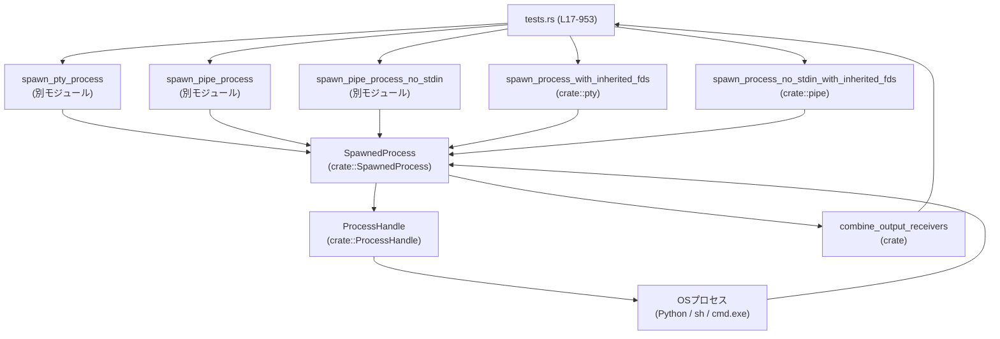
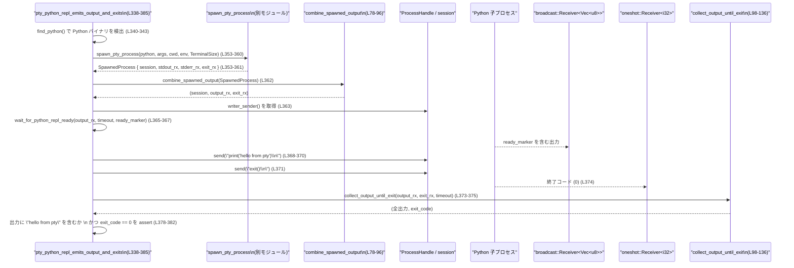
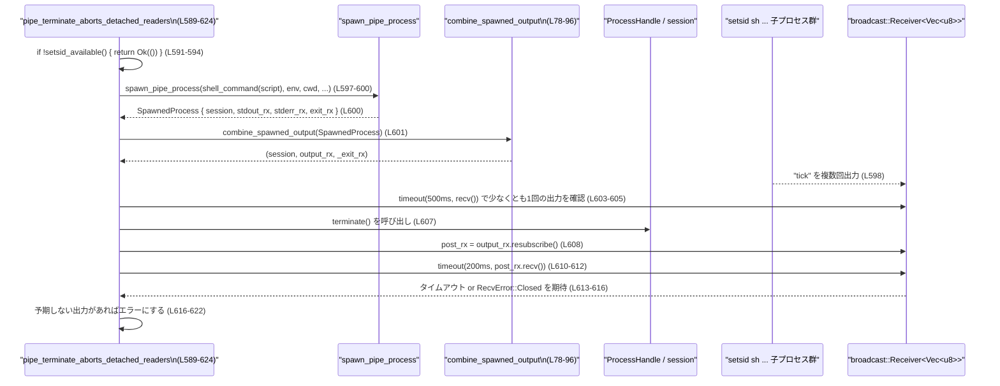

utils/pty/src/tests.rs コード解説
==================================================

## 0. ざっくり一言

PTY / パイプ経由で外部プロセスを起動するユーティリティ（`spawn_pty_process` など）の **振る舞い・契約を検証する非同期テスト群** と、そのための **出力収集・プロセス監視ヘルパー関数** をまとめたモジュールです（tests.rs:L17-28, L78-136, L338-953）。

---

## 1. このモジュールの役割

### 1.1 概要

- このモジュールは、`spawn_pty_process` / `spawn_pipe_process` などのプロセス起動 API が **期待どおりにプロセスを生成・制御・終了** できるかを検証するためのテストコードです（tests.rs:L6-15, L338-953）。
- 非同期ランタイムとして Tokio を用い、**標準出力/標準エラーの読み取り、終了コードの取得、端末サイズ変更、FD 継承、プロセス終了検出** などをテストしています（tests.rs:L78-96, L98-136, L324-336, L846-907）。
- OS 差異（Windows / Unix）を `cfg!(windows)` や `#[cfg(unix)]` で切り替え、プラットフォームごとの挙動も考慮しています（tests.rs:L30-35, L41-47, L61-67, L138, L210, L261 など）。

### 1.2 アーキテクチャ内での位置づけ

このファイルは crate のテスト側に位置し、実装側の API を呼び出して検証する構成になっています。



- すべてのテストは `spawn_*` 系関数から返る `SpawnedProcess` を `combine_spawned_output` を通して `(ProcessHandle, 出力受信, 終了通知)` に分解して利用します（tests.rs:L78-96）。
- `ProcessHandle` 経由で stdin 書き込み・終了・resize などの操作を行い（例: tests.rs:L363-371, L607, L884-889）、`broadcast::Receiver` と `oneshot::Receiver` を通じて非同期に出力と終了コードを取得します（tests.rs:L98-136, L362-375）。

### 1.3 設計上のポイント

- **非同期・並行性**
  - すべてのテストは `#[tokio::test(flavor = "multi_thread", worker_threads = 2)]` で実行され、Tokio のマルチスレッドランタイム上で動作します（tests.rs:L338, L387, L439, L481 など）。
  - 出力は `broadcast::Receiver<Vec<u8>>`、終了コードは `oneshot::Receiver<i32>` で受け取り、`tokio::select!` や `tokio::time::timeout` により **出力読み取りと終了待ちを競合させつつタイムアウトを設ける** 実装です（tests.rs:L98-136）。
- **OS 依存の分岐**
  - Windows / Unix で異なるシェル・改行コード・コマンドを使い分けています（`shell_command`, `echo_sleep_command`, `split_stdout_stderr_command` など、tests.rs:L41-51, L53-59, L61-68）。
  - 一部のテストやヘルパーは Unix 専用（`#[cfg(unix)]`）で、プロセスグループや FD 継承、`libc::kill`, `getsid` など Unix API を利用します（tests.rs:L138, L261, L438, L626 など）。
- **安全性・エラーハンドリング**
  - `anyhow::Result` と `?` / `anyhow::bail!` により、I/O エラー、タイムアウト、チャネルエラーなどを明示的に伝播します（tests.rs:L139-171, L174-207, L277-322）。
  - タイムアウトやチャネルクローズ時には、テスト失敗につながる明示的なエラーメッセージを生成しています。
- **テスト再利用性**
  - 出力待ちや Python REPL 準備待ち、PID 抽出、プロセス存在確認など、複数テストで使うロジックをヘルパー関数に切り出し、テストコードの重複を減らしています（tests.rs:L70-76, L98-136, L174-207, L210-259, L277-336）。

---

## 2. 主要な機能一覧

### 2.1 機能グループ

- **プロセス起動ヘルパー**
  - `shell_command`: OS ごとに適切なシェルと引数を選択してコマンドを組み立てる（tests.rs:L41-51）。
  - `echo_sleep_command`, `split_stdout_stderr_command`: 簡易的なシェルスクリプト文字列を生成し、出力タイミングや stdout/stderr 分離をテストに提供（tests.rs:L53-59, L61-68）。
- **出力収集と終了待ち**
  - `combine_spawned_output`: `SpawnedProcess` から session・統合出力・終了通知を取り出す（tests.rs:L78-96）。
  - `collect_output_until_exit`: 出力チャネルと終了通知を監視し、**静穏期間のドレインも含めて** 出力全体と終了コードを集約（tests.rs:L98-136）。
  - `collect_split_output`: mpsc チャネルからバイト列をすべて読み出す（tests.rs:L70-76）。
- **Python REPL 準備待ち**
  - `find_python`: `python3` / `python` が利用可能か検出（tests.rs:L17-28）。
  - `wait_for_python_repl_ready`: 出力に特定のマーカーが現れるまで待機（tests.rs:L174-207）。
  - `wait_for_python_repl_ready_via_probe`（Unix）: `print(marker)` を繰り返し送信して REPL 準備完了を判定（tests.rs:L210-259）。
- **プロセス存在確認・PID 抽出**
  - `process_exists`（Unix）: `kill(pid, 0)` を用いてプロセスの存在を確認（tests.rs:L261-274）。
  - `wait_for_marker_pid`（Unix）: 出力から `__codex_bg_pid:1234` のようなプレフィックス付き PID を抽出（tests.rs:L277-322）。
  - `wait_for_process_exit`（Unix）: 一定時間内にプロセスが終了するかポーリング（tests.rs:L324-336）。
- **統合テストケース**
  - Python REPL が出力を返し正常終了することの検証（`pty_python_repl_emits_output_and_exits`、tests.rs:L338-385）。
  - pipe/pty の stdin ラウンドトリップ、インターフェース共通性、stderr ドレインなどの検証（tests.rs:L387-436, L481-520, L522-541）。
  - セッション分離・terminate 振る舞い・背景プロセスの kill・FD 継承・端末サイズ変更・exec 失敗時のエラー報告などの検証（tests.rs:L438-479, L589-624, L626-669, L671-907, L909-953）。

### 2.2 コンポーネント一覧（関数）

| 名前 | 種別 | 役割 / 用途 | 行範囲 |
|------|------|-------------|--------|
| `find_python` | ヘルパー | 利用可能な Python バイナリ名 (`python3` or `python`) を検出し、見つからない場合は `None` を返す | tests.rs:L17-28 |
| `setsid_available` | ヘルパー | Unix 上で `setsid` コマンドが利用可能かどうかをチェックする（Windows では常に false） | tests.rs:L30-39 |
| `shell_command` | ヘルパー | 渡されたシェルスクリプトを OS ごとに適切なシェル (`cmd.exe` / `/bin/sh`) で実行するための `(program, args)` を構築 | tests.rs:L41-51 |
| `echo_sleep_command` | ヘルパー | マーカー文字列を出力し、短時間スリープするシェルコマンド文字列を生成（OS ごとに実装差） | tests.rs:L53-59 |
| `split_stdout_stderr_command` | ヘルパー | stdout と stderr に別々の行を出力するシェルコマンド文字列を生成 | tests.rs:L61-68 |
| `collect_split_output` | ヘルパー (async) | mpsc チャネルからすべてのメッセージを受け取り、バイト列に連結する | tests.rs:L70-76 |
| `combine_spawned_output` | ヘルパー | `SpawnedProcess` から `(ProcessHandle, 統合出力 Receiver, exit Receiver)` を組み立てる | tests.rs:L78-96 |
| `collect_output_until_exit` | ヘルパー (async) | broadcast 出力と oneshot 終了通知を監視し、出力全体と終了コードを収集（静穏期間ドレイン・タイムアウト付き） | tests.rs:L98-136 |
| `wait_for_output_contains` | ヘルパー (async, Unix) | 出力の中に特定の文字列が現れるまで待機し、出力を返す（タイムアウト・チャネルクローズをエラーとして扱う） | tests.rs:L138-172 |
| `wait_for_python_repl_ready` | ヘルパー (async) | 出力に Python REPL 準備完了マーカーが現れるまで待機 | tests.rs:L174-207 |
| `wait_for_python_repl_ready_via_probe` | ヘルパー (async, Unix) | `print(marker)` を一定間隔で送りつつ、出力にマーカーが現れるかを監視する | tests.rs:L210-259 |
| `process_exists` | ヘルパー (Unix) | `libc::kill(pid, 0)` を使って PID の存在を判定 | tests.rs:L261-274 |
| `wait_for_marker_pid` | ヘルパー (async, Unix) | 出力ストリームからマーカーに続く数字を PID として抽出し返す | tests.rs:L277-322 |
| `wait_for_process_exit` | ヘルパー (async, Unix) | `process_exists` をポーリングし、指定時間内にプロセスが終了するかどうかを判定 | tests.rs:L324-336 |
| `pty_python_repl_emits_output_and_exits` | テスト (async) | PTY 上で Python REPL を起動し、出力が取得でき正常終了することを検証 | tests.rs:L338-385 |
| `pipe_process_round_trips_stdin` | テスト (async) | pipe ベースのプロセスが stdin をそのまま stdout に返す（ラウンドトリップ）ことを検証 | tests.rs:L387-436 |
| `pipe_process_detaches_from_parent_session` | テスト (async, Unix) | pipe プロセスが親セッションから分離され、新しいセッションリーダーになっていることを検証 | tests.rs:L438-479 |
| `pipe_and_pty_share_interface` | テスト (async) | pipe と pty の両 API が同じインターフェースで使用でき、同様に動作することを検証 | tests.rs:L481-520 |
| `pipe_drains_stderr_without_stdout_activity` | テスト (async) | stdout が空でも stderr が大量に出るケースで、stderr がきちんとドレインされることを検証 | tests.rs:L522-541 |
| `pipe_process_can_expose_split_stdout_and_stderr` | テスト (async) | stdin なしのプロセスで stdout と stderr を別々の mpsc チャネルで受け取れることを検証 | tests.rs:L543-587 |
| `pipe_terminate_aborts_detached_readers` | テスト (async) | `terminate()` 呼び出し後に broadcast チャネルから新しい出力が来ないことを検証 (`setsid` 利用) | tests.rs:L589-624 |
| `pty_terminate_kills_background_children_in_same_process_group` | テスト (async, Unix) | PTY セッション上の背景プロセスが `terminate()` により同一プロセスグループごと終了することを検証 | tests.rs:L626-669 |
| `pty_spawn_can_preserve_inherited_fds` | テスト (async, Unix) | PTY 経由で起動された子プロセスが指定された FD を継承し、その FD 宛てに出力できることを検証 | tests.rs:L671-716 |
| `pty_preserving_inherited_fds_keeps_python_repl_running` | テスト (async, Unix) | 継承 FD を持つ Python REPL が、プロンプト出力後も生存し続けることを検証 | tests.rs:L718-794 |
| `pty_spawn_with_inherited_fds_reports_exec_failures` | テスト (async, Unix) | 不存在の実行ファイル指定時に、spawn が適切なエラーを返すことを検証 | tests.rs:L796-842 |
| `pty_spawn_with_inherited_fds_supports_resize` | テスト (async, Unix) | PTY 経由の子プロセスで、`resize` による端末サイズ変更が `stty size` に反映されることを検証 | tests.rs:L844-907 |
| `pipe_spawn_no_stdin_can_preserve_inherited_fds` | テスト (async, Unix) | stdin を持たない pipe プロセスでも FD 継承が行えることを検証 | tests.rs:L909-953 |

---

## 3. 公開 API と詳細解説

このファイル自身はテストモジュールであり、crate の公開 API は定義していませんが、**テストにおけるコアロジックとなるヘルパー関数** を「公開 API」とみなして詳細を整理します。

### 3.1 型一覧

このファイル内で新たに定義されている構造体・列挙体はありません。

外部モジュールから利用している主な型（定義は他ファイル）:

| 名前 | 種別 | 役割 / 用途 | 根拠 |
|------|------|-------------|------|
| `SpawnedProcess` | 構造体（crate 内） | `session`, `stdout_rx`, `stderr_rx`, `exit_rx` を持つプロセス起動結果 | tests.rs:L6, L78-95, L549-554 |
| `ProcessHandle` | 型（crate 内） | `session` として受け取り、`writer_sender`, `close_stdin`, `terminate`, `resize` などを提供 | tests.rs:L81-83, L362-364, L424, L607, L884-889 |
| `TerminalSize` | 構造体（crate 内） | PTY の行数・列数を指定するための型 | tests.rs:L7, L359-360, L639-640, L867-870 |

> これらの型の具体的な定義はこのチャンクには現れないため不明です。

### 3.2 関数詳細（7 件）

#### 3.2.1 `combine_spawned_output(spawned: SpawnedProcess) -> (ProcessHandle, broadcast::Receiver<Vec<u8>>, oneshot::Receiver<i32>)`（tests.rs:L78-96）

**概要**

- プロセス起動 API から返却される `SpawnedProcess` を分解し、**セッションハンドル**・**統合された出力 Receiver**・**終了コード Receiver** の 3 つにまとめて返すヘルパーです（tests.rs:L78-96）。
- `stdout_rx` と `stderr_rx` を `combine_output_receivers` で統合し、テスト側からは「1 本の出力ストリーム」として扱えるようにします（tests.rs:L92-94）。

**引数**

| 引数名 | 型 | 説明 |
|--------|----|------|
| `spawned` | `SpawnedProcess` | `spawn_pty_process` などから返されたプロセス起動結果。`session`, `stdout_rx`, `stderr_rx`, `exit_rx` を含む（tests.rs:L85-90）。 |

**戻り値**

- `(ProcessHandle, tokio::sync::broadcast::Receiver<Vec<u8>>, tokio::sync::oneshot::Receiver<i32>)`
  - `ProcessHandle`: 子プロセスへ書き込み・終了・リサイズなどを行うためのハンドル（tests.rs:L85-87, L92）。
  - `broadcast::Receiver<Vec<u8>>`: stdout/stderr を統合したバイト列ストリーム（tests.rs:L92-94）。
  - `oneshot::Receiver<i32>`: プロセス終了時に一度だけ終了コードが送られるチャネル（tests.rs:L93-94）。

**内部処理の流れ**

1. `SpawnedProcess { session, stdout_rx, stderr_rx, exit_rx }` をパターンマッチで分解（tests.rs:L85-90）。
2. `combine_output_receivers(stdout_rx, stderr_rx)` を呼び出して、2 本の `broadcast::Receiver<Vec<u8>>` を 1 本に統合（tests.rs:L92-94）。
3. `(session, 統合 output_rx, exit_rx)` の 3 タプルをそのまま返却（tests.rs:L91-95）。

**Examples（使用例）**

`pty_python_repl_emits_output_and_exits` 内での使用例（簡略版、tests.rs:L353-375）:

```rust
// プロセスを起動し SpawnedProcess を取得
let spawned = spawn_pty_process(
    &python,
    &args,
    Path::new("."),
    &env_map,
    &None,
    TerminalSize::default(),
).await?;

// SpawnedProcess から (session, 統合 output_rx, exit_rx) に分解
let (session, mut output_rx, exit_rx) = combine_spawned_output(spawned);

// session から writer を取得して子プロセスに入力
let writer = session.writer_sender();

// 出力を待ったり、終了コードを collect_output_until_exit で待つ
```

**Errors / Panics**

- この関数自体は `Result` を返さず、`unwrap` なども使用していないため、**この関数単体でエラーや panic は発生しません**。
- ただし、`combine_output_receivers` の実装は別モジュールにあり、このチャンクには現れないため内部でどのようなエラーが起こりうるかは不明です。

**Edge cases（エッジケース）**

- `SpawnedProcess` に含まれるチャネルがすでにクローズしている場合でも、この関数は単に所有権を移動するだけでエラーにはなりません。以降の読み取り時に `RecvError::Closed` などとして顕在化します（例: tests.rs:L123-126）。
- `stdout_rx` / `stderr_rx` のどちらか片方だけがクローズしている場合の挙動は `combine_output_receivers` 側の実装依存です（このチャンクには不明）。

**使用上の注意点**

- この関数は **SpawnedProcess の所有権を丸ごと消費** するため、呼び出し後に元の `spawned` にはアクセスできません（所有権移動）。
- テストでは基本的にすべての `spawn_*` 結果に対してこのヘルパーを通しており、直接 `stdout_rx` / `stderr_rx` を扱うのは `spawn_pipe_process_no_stdin` を使うテストのみです（tests.rs:L548-555）。

---

#### 3.2.2 `collect_output_until_exit(mut output_rx, exit_rx, timeout_ms) -> (Vec<u8>, i32)`（tests.rs:L98-136）

**概要**

- 統合された出力 `broadcast::Receiver<Vec<u8>>` と `oneshot::Receiver<i32>` を受け取り、**プロセス終了またはタイムアウトまで出力を集める** 非同期関数です。
- Windows では PTY の特性から「終了通知の後にも出力が届きうる」ため、終了通知受信後に短い静穏期間（quiet window）だけ出力をドレインするロジックがあります（tests.rs:L115-128）。

**引数**

| 引数名 | 型 | 説明 |
|--------|----|------|
| `output_rx` | `tokio::sync::broadcast::Receiver<Vec<u8>>` | stdout/stderr を統合した出力ストリーム。複数タスクで購読可能（tests.rs:L99）。 |
| `exit_rx` | `tokio::sync::oneshot::Receiver<i32>` | 子プロセスの終了コードが一度だけ送信されるチャネル（tests.rs:L100）。 |
| `timeout_ms` | `u64` | 全体としてのタイムアウト（ミリ秒）。指定時間経過後は終了コード `-1` で返す（tests.rs:L101, L131-133）。 |

**戻り値**

- `(Vec<u8>, i32)`
  - `Vec<u8>`: 終了までに受信したすべての出力バイト列（tests.rs:L103-104, L111-112, L123-123）。
  - `i32`: 実際の終了コード、もしくはタイムアウトや oneshot エラー時は `-1`（tests.rs:L115, L131-133）。

**内部処理の流れ**

1. `deadline` として `timeout_ms` ミリ秒後の `Instant` を計算（tests.rs:L104）。
2. `exit_rx` を `tokio::pin!` し、`select!` 内でムーブせず再利用可能にする（tests.rs:L105）。
3. ループ内で `tokio::select!` により 3 つのイベントを待機（tests.rs:L107-134）:
   - `output_rx.recv()` が成功した場合:
     - `Vec<u8>` を `collected` に `extend_from_slice` で追加（tests.rs:L109-112）。
     - エラー（Lagged / Closed）はここでは `select!` 内のこの分岐ではまだ扱っておらず、Closed 等は他の分岐に現れます。
   - `&mut exit_rx` が完了した場合:
     - `unwrap_or(-1)` により、`Ok(code)` ならその値、それ以外（チャネル切断など）は `-1` を採用（tests.rs:L115）。
     - Windows とそれ以外で異なる `quiet_ms` / `max_ms` を設定（tests.rs:L117-120）。
     - `max_deadline` までの間、`timeout(quiet, output_rx.recv())` で「短い静穏期間」監視を繰り返し、出力が来なくなるまで／チャネルクローズまで読み続けて `collected` に追加（tests.rs:L121-128）。
     - その後 `(collected, code)` を返却（tests.rs:L129）。
   - `sleep_until(deadline)` が完了した場合:
     - タイムアウトとみなし、現時点までの `collected` と終了コード `-1` を返却（tests.rs:L131-133）。

**Examples（使用例）**

`pipe_process_round_trips_stdin` 内での使用例（tests.rs:L416-427）:

```rust
let spawned = spawn_pipe_process(&program, &args, Path::new("."), &env_map, &None).await?;
let (session, output_rx, exit_rx) = combine_spawned_output(spawned);

let writer = session.writer_sender();
writer.send(b"roundtrip\n".to_vec()).await?;
drop(writer);
session.close_stdin();

// 5秒以内に終了しなければ timeout として (-1) が返る
let (output, code) =
    collect_output_until_exit(output_rx, exit_rx, /*timeout_ms*/ 5_000).await;
```

**Errors / Panics**

- この関数自体は `Result` を返さず、内部で `unwrap` を利用する箇所は `exit_rx` の `unwrap_or(-1)` のみであり、panic しません（tests.rs:L115）。
- `broadcast::Receiver::recv()` が `Lagged` や `Closed` を返した場合でも、終了通知前の分岐では単に `Err` として破棄され、終了通知後のドレインでは `Lagged` は `continue`、`Closed` はループ終了トリガーとして扱われます（tests.rs:L123-126）。
- `tokio::time::timeout` がタイムアウトすると `Err(_)` になり、quiet ドレインループを抜けるだけです（tests.rs:L126-127）。

**Edge cases（エッジケース）**

- **子プロセスが終了しない**:
  - `exit_rx` が届かず `timeout_ms` を超えた場合、`(collected, -1)` で戻ります（tests.rs:L131-133）。
- **終了通知が先に来て、その後も出力が続く（特に Windows の PTY）**:
  - quiet ドレインループで `quiet_ms` ごとに追加の出力を読み続け、一定期間出力が来なければ終了します（tests.rs:L117-128）。
- **broadcast の Lagged**:
  - quiet ドレイン中に `Lagged` が発生した場合は無視してループ継続します（tests.rs:L123-124）。これにより、少量のロスは許容しながらテストを継続します。

**使用上の注意点**

- `timeout_ms` は **子プロセスの最大実行時間** より十分大きくする必要があります。そうでないと正常終了でもコード `-1` となり、テスト側のアサーションに失敗します。
- quiet ドレインは単純な best effort であり、極端に遅延した出力は取りこぼす可能性がありますが、テストの目的（決定的な出力検証）には十分と想定されています（コメントより、tests.rs:L116-120）。
- `output_rx` は値渡しで受け取るため、この関数呼び出し後に同じ Receiver を再利用することはできません。

---

#### 3.2.3 `wait_for_output_contains(output_rx, needle, timeout_ms) -> Result<Vec<u8>>`（tests.rs:L138-172、Unix）

**概要**

- Unix 専用のヘルパーで、**指定した文字列 `needle` が出力に現れるまで** `broadcast::Receiver<Vec<u8>>` から読み続けます。
- 一定時間内に見つからなければ `anyhow::Error` を返してテストを失敗させます。

**引数**

| 引数名 | 型 | 説明 |
|--------|----|------|
| `output_rx` | `&mut broadcast::Receiver<Vec<u8>>` | 出力ストリームの Receiver への可変参照（tests.rs:L140）。 |
| `needle` | `&str` | 探索するサブ文字列（tests.rs:L141）。 |
| `timeout_ms` | `u64` | 準備完了を待つ最大時間（tests.rs:L142-145）。 |

**戻り値**

- `anyhow::Result<Vec<u8>>`
  - 成功時: `needle` が現れるまでに受信した全出力。
  - 失敗時: `timeout` または `RecvError::Closed` 等を含むエラー。

**内部処理**

1. `deadline` を計算し（tests.rs:L145）、現在時刻がそれを超えるまでループ（tests.rs:L147）。
2. 残り時間 `remaining` を計算し、その時間内の `output_rx.recv()` を `tokio::time::timeout` で待機（tests.rs:L148-150）。
3. 受信結果に応じて分岐（tests.rs:L151-165）:
   - `Ok(Ok(chunk))`: `collected` に追加し、`String::from_utf8_lossy(&collected)` に `needle` が含まれていれば `Ok(collected)` で返却（tests.rs:L151-155）。
   - `Ok(Err(Lagged))`: スキップしてループ継続（tests.rs:L157）。
   - `Ok(Err(Closed))`: `anyhow::bail!` でエラー。既に集めた出力をメッセージに含める（tests.rs:L158-163）。
   - `Err(_)`: `timeout(remaining, ...)` がタイムアウトした場合。外側の `while` で再評価され、期限超過なら最終的に `bail!` に到達（tests.rs:L164-168）。
4. 期限を過ぎても見つからなければ `timed out waiting for ...` で失敗（tests.rs:L168-171）。

**Examples（使用例）**

PTY サイズの初期値検証で使用（tests.rs:L875-882）:

```rust
let mut output = wait_for_output_contains(
    &mut output_rx,
    "start:31 101\r\n",
    /*timeout_ms*/ 5_000,
).await?;
```

**Errors / Panics**

- 失敗時は `anyhow::Error` で `bail!` されます（tests.rs:L158-163, L168-171）。
- panic は使用していません。

**Edge cases**

- **`needle` が出力のチャンク境界をまたぐ場合**:
  - `collected` に累積してから `contains` を行うため、問題なく検出可能です（tests.rs:L151-155）。
- **チャネルクローズ**:
  - `Closed` の場合は明示的にエラーとして扱うため、「途中で子プロセスが終了してしまった」などの状況を検出できます（tests.rs:L158-163）。

**使用上の注意点**

- この関数は `&mut` 参照を取り、内部で `recv()` を繰り返し呼ぶため、同じ Receiver を他所でも同時に受信に使うと順序や結果が不定になります。
- `timeout_ms` は、子プロセスが `needle` を出力するまでの最大時間をカバーする必要があります。

---

#### 3.2.4 `wait_for_python_repl_ready(output_rx, timeout_ms, ready_marker) -> Result<Vec<u8>>`（tests.rs:L174-207）

**概要**

- Python REPL が起動した際に、出力に `ready_marker` が現れるまで待つヘルパーです。
- 実装は `wait_for_output_contains` に似ていますが、条件文言やエラーメッセージが Python 向けに特化しています。

**引数**

| 引数名 | 型 | 説明 |
|--------|----|------|
| `output_rx` | `&mut broadcast::Receiver<Vec<u8>>` | REPL 出力ストリーム（tests.rs:L175）。 |
| `timeout_ms` | `u64` | 準備完了を待つ時間（tests.rs:L176-180）。 |
| `ready_marker` | `&str` | `print()` で出力される REPL 準備完了マーカー文字列（tests.rs:L177, L345-351）。 |

**戻り値**

- `anyhow::Result<Vec<u8>>`: 準備完了マーカーが見つかるまでに受信した出力。

**内部処理**

- `wait_for_output_contains` とほぼ同様のループ構造:
  - `timeout(remaining, output_rx.recv())` でチャンクを取得し、累積バッファに追加（tests.rs:L185-188）。
  - `String::from_utf8_lossy(&collected).contains(ready_marker)` でマーカーを探索（tests.rs:L186-189）。
  - `Lagged` は無視、`Closed` は `bail!`、最終的なタイムアウトも `bail!` でエラー化（tests.rs:L192-207）。

**Examples（使用例）**

`pty_python_repl_emits_output_and_exits`（tests.rs:L345-367）:

```rust
let ready_marker = "__codex_pty_ready__";
let args = vec![
    "-i".to_string(),
    "-q".to_string(),
    "-c".to_string(),
    format!("print('{ready_marker}')"),
];

let spawned = spawn_pty_process(/* ... */).await?;
let (session, mut output_rx, exit_rx) = combine_spawned_output(spawned);

// REPL が ready_marker を出すまで待機
let startup_timeout_ms = if cfg!(windows) { 10_000 } else { 5_000 };
let mut output =
    wait_for_python_repl_ready(&mut output_rx, startup_timeout_ms, ready_marker).await?;
```

**Errors / Panics**

- Python がマーカーを出力する前に終了した場合や、出力チャネルがクローズした場合に `anyhow::Error` を返します（tests.rs:L193-198）。
- panic はありません。

**Edge cases**

- Python 実行ファイルが見つからない場合は、そもそもテスト本体に入る前に `find_python` で早期 return します（tests.rs:L340-343）。この関数は呼ばれません。
- 出力が大量・断続的に届いても、累積バッファと `contains` により最終的にマーカーを検出します。

**使用上の注意点**

- REPL に `ready_marker` を出力させるコード（`print(ready_marker)`）を先に渡しておく必要があります（tests.rs:L346-351）。
- `output_rx` を別のタスクでも消費している場合、こちらでマーカーを取り逃す可能性があります。

---

#### 3.2.5 `wait_for_python_repl_ready_via_probe(writer, output_rx, timeout_ms, newline) -> Result<Vec<u8>>`（tests.rs:L210-259、Unix）

**概要**

- Python REPL の準備完了を **ポーリング的に確認** するヘルパーです。
- REPL がまだプロンプト状態でない場合でも、`print(marker)` を周期的に送り、出力にそのマーカーが現れたかどうかで準備完了を判定します（tests.rs:L221-243）。

**引数**

| 引数名 | 型 | 説明 |
|--------|----|------|
| `writer` | `&tokio::sync::mpsc::Sender<Vec<u8>>` | REPL へ文字列を書き込む送信側。`ProcessHandle::writer_sender()` が返すものと同等（tests.rs:L211, L763-771）。 |
| `output_rx` | `&mut broadcast::Receiver<Vec<u8>>` | REPL 出力ストリーム（tests.rs:L212）。 |
| `timeout_ms` | `u64` | 全体のタイムアウト（tests.rs:L213, L218）。 |
| `newline` | `&str` | OS に応じた改行文字列（tests.rs:L214, L761-767）。 |

**戻り値**

- `anyhow::Result<Vec<u8>>`: マーカーが現れるまでに受信した出力。

**内部処理**

1. `marker` と `deadline`、および各プローブ用の `probe_window` を設定（tests.rs:L217-220）。
2. `deadline` までの間、外側ループを繰り返す（tests.rs:L221-253）:
   - `writer.send(format!("print('{marker}'){newline}").into_bytes()).await?` で REPL に `print(marker)` を送信（tests.rs:L222-224）。
   - `probe_deadline = now + probe_window` を設定し、その間 `timeout(remaining, output_rx.recv())` で出力を監視する内側ループに入る（tests.rs:L226-235）。
   - 出力チャンクを受信するたびに `collected` に追加し、`contains(marker)` でマーカー検出（tests.rs:L237-241）。
   - `Lagged` は無視し、`Closed` は `bail!` でエラー化（tests.rs:L243-249）。
3. 外側ループの期限を過ぎてもマーカーが見つからなければ `timed out waiting for Python REPL readiness in PTY` エラーで終了（tests.rs:L255-258）。

**Examples（使用例）**

`pty_preserving_inherited_fds_keeps_python_repl_running` で使用（tests.rs:L762-768）:

```rust
let (session, mut output_rx, exit_rx) = combine_spawned_output(spawned);
let writer = session.writer_sender();
let newline = "\n";

// マーカーを使って REPL 準備完了を検出
let mut output = wait_for_python_repl_ready_via_probe(
    &writer,
    &mut output_rx,
    /*timeout_ms*/ 5_000,
    newline,
).await?;
```

**Errors / Panics**

- 書き込み側 `writer.send(...).await` が失敗した場合（チャネルクローズなど）や、出力チャネルが `Closed` になった場合は `anyhow::Error` を返します（tests.rs:L222-224, L243-249）。
- panic はありません。

**Edge cases**

- REPL が標準入力を無視する/ブロックしている場合も、`probe_window` ごとに出力を確認し、最終的にタイムアウトで検出します（tests.rs:L221-220, L255-258）。
- **マーカー文字列が通常の出力にも含まれてしまう** と誤検出になる可能性がありますが、ここではかなりユニークな `__codex_pty_ready__` を使用しており、テストの前提として衝突しないことを期待しています（tests.rs:L217）。

**使用上の注意点**

- `writer` と `output_rx` は同じ REPL セッションに対応している必要があります。別セッションに混在すると検出に失敗します。
- 過度に短い `probe_window` や `timeout_ms` を設定すると、REPL が少し遅いだけでタイムアウトになるため注意が必要です。

---

#### 3.2.6 `wait_for_marker_pid(output_rx, marker, timeout_ms) -> Result<i32>`（tests.rs:L277-322、Unix）

**概要**

- PTY 出力などから `marker` に続く数字列を **プロセス ID（PID）として抽出** するヘルパーです。
- 例: `__codex_bg_pid:12345` のようなフォーマットを想定しています（tests.rs:L630-632, L644-650）。

**引数**

| 引数名 | 型 | 説明 |
|--------|----|------|
| `output_rx` | `&mut broadcast::Receiver<Vec<u8>>` | 出力ストリーム（tests.rs:L278）。 |
| `marker` | `&str` | PID プレフィックスとなるマーカー（例: `"__codex_bg_pid:"`、tests.rs:L630-631, L644）。 |
| `timeout_ms` | `u64` | PID を検出するまでの最大待ち時間（tests.rs:L280-283）。 |

**戻り値**

- `anyhow::Result<i32>`: 抽出された PID。失敗時はエラー。

**内部処理**

1. `deadline` を計算し、期限までのループを開始（tests.rs:L283-291）。
2. 各ループで:
   - 現在時刻を確認し、期限超過なら `timed out waiting for marker ...` で `bail!`（tests.rs:L285-291）。
   - 残り時間 `remaining` を計算し、その間の `output_rx.recv()` を `timeout` で待機（tests.rs:L293-297）。
   - 成功したチャンクを `collected` に追加（tests.rs:L297）。
3. `String::from_utf8_lossy(&collected)` でテキスト化し、`marker` を探す（tests.rs:L299-301）。
4. 見つかった位置ごとに:
   - `suffix` として `marker` 直後以降の文字列を取り出す（tests.rs:L302-303）。
   - `take_while(char::is_ascii_digit)` で連続する数字のバイト長を計算（tests.rs:L304-308）。
   - 数字が 0 文字なら `offset` を進めて次の候補を探索（tests.rs:L309-312）。
   - 数字部分 `pid_str` とその後の `trailing` を分割し、`trailing` が空でないことを確認したら `pid_str.parse()?` を `Ok(...)` で返す（tests.rs:L314-319）。
   - `trailing.is_empty()` の場合は `break` し、外側ループで追加の出力を待つ（tests.rs:L316-317）。

**Examples（使用例）**

背景子プロセスの PID を取得（tests.rs:L630-644）:

```rust
let marker = "__codex_bg_pid:";
let script = format!("sleep 1000 & bg=$!; echo {marker}$bg; wait");
let (program, args) = shell_command(&script);
let spawned = spawn_pty_process(/* ... */).await?;
let (session, mut output_rx, _exit_rx) = combine_spawned_output(spawned);

let bg_pid = match wait_for_marker_pid(&mut output_rx, marker, /*timeout_ms*/ 2_000).await {
    Ok(pid) => pid,
    Err(err) => { session.terminate(); return Err(err); }
};
```

**Errors / Panics**

- タイムアウト・`timeout(...).await` のタイムアウト・`pid_str.parse()` の失敗などは、すべて `anyhow::Error` として返されます（tests.rs:L287-291, L293-297, L319-320）。
- panic はありません。

**Edge cases**

- **マーカーが複数回現れる場合**:
  - `offset` を用いてテキストを前方から順にスキャンするため、最初に「マーカー + 数字列 + 追加文字」がそろった部分で PID を返します（tests.rs:L300-312, L314-319）。
- **出力が途中で途切れる場合**:
  - `trailing.is_empty()` の場合は完全なトークンとみなさず、追加の出力を待ちます（tests.rs:L316-317）。

**使用上の注意点**

- マーカーの直後に **半角数字以外** が来ると PID として認識されません。
- 想定されるフォーマット（`"{marker}{pid}\n"` など）を出力するスクリプトとペアで使用する前提です（例: tests.rs:L631-632）。

---

#### 3.2.7 `wait_for_process_exit(pid, timeout_ms) -> Result<bool>`（tests.rs:L324-336、Unix）

**概要**

- `process_exists(pid)` を利用して指定 PID のプロセスが **一定時間内に終了するかどうか** をポーリングするヘルパーです。
- 戻り値は終了したかどうかの `bool` であり、テストによっては終了しなかった場合に SIGKILL を送るなどのフォローが行われます（tests.rs:L658-661）。

**引数**

| 引数名 | 型 | 説明 |
|--------|----|------|
| `pid` | `i32` | 監視対象プロセスの PID（tests.rs:L325）。 |
| `timeout_ms` | `u64` | 終了を待つ最大時間（tests.rs:L325-326）。 |

**戻り値**

- `anyhow::Result<bool>`
  - `Ok(true)`: 指定時間内にプロセスが消滅した。
  - `Ok(false)`: 指定時間内にプロセスが生存し続けた。
  - `Err(_)`: `process_exists` 内部で `EPERM/ESRCH` 以外のエラーが発生した場合など。

**内部処理**

1. `deadline` を計算（tests.rs:L326）。
2. 無限ループで:
   - `process_exists(pid)?` を呼び、存在しなければ `Ok(true)` で返却（tests.rs:L328-330）。
   - 現在時刻が `deadline` を超えていれば `Ok(false)` で返却（tests.rs:L331-333）。
   - まだなら 20ms スリープして再度確認（tests.rs:L334-335）。

**Examples（使用例）**

背景プロセスが terminate 後に終了するか確認（tests.rs:L656-661）:

```rust
session.terminate();

let exited = wait_for_process_exit(bg_pid, /*timeout_ms*/ 3_000).await?;
if !exited {
    let _ = unsafe { libc::kill(bg_pid, libc::SIGKILL) };
}
assert!(exited, "background child pid {bg_pid} survived PTY terminate()");
```

**Errors / Panics**

- `process_exists` が `EPERM` / `ESRCH` 以外の OS エラーを返した場合、`Err(err.into())` として伝播します（tests.rs:L268-273, L325-329）。
- panic はありません。

**Edge cases**

- **権限不足 (EPERM)**:
  - `process_exists` はこの場合も `Ok(true)`（存在しているとみなす）を返すため、結果的に `wait_for_process_exit` は「終了したかどうか」を判断できず、タイムアウトまで待つ可能性があります（tests.rs:L270-272）。
- **非常に短命なプロセス**:
  - すでに終了している PID に対して呼ぶと、最初の `process_exists` が `false` を返し、即座に `Ok(true)` となります。

**使用上の注意点**

- PID がすでに別プロセスに再割り当てされているケースは考慮していません。テスト環境では PID 衝突確率が低い前提です。
- 20ms のポーリング間隔は固定であり、非常に短い検出遅延が許容される前提です。

---

### 3.3 その他の関数（概要のみ）

| 関数名 | 役割（1 行） | 行範囲 |
|--------|--------------|--------|
| `find_python` | `python3` または `python` を `--version` 実行で検出し、見つからなければテストをスキップ可能にする（tests.rs:L17-28）。 | tests.rs:L17-28 |
| `setsid_available` | Unix で `setsid` コマンドが利用可能かどうかを確認し、利用不可なら関連テストをスキップする（tests.rs:L30-39）。 | tests.rs:L30-39 |
| `shell_command` | 渡されたコマンド文字列を Windows / Unix 向けのシェル呼び出し `(program, args)` に変換する（tests.rs:L41-51）。 | tests.rs:L41-51 |
| `echo_sleep_command` | `echo {marker}` の後に短時間 sleep するシェルスクリプトを作る（tests.rs:L53-59）。 | tests.rs:L53-59 |
| `split_stdout_stderr_command` | stdout / stderr それぞれに固定文字列を出力するシェルスクリプト文字列を生成する（tests.rs:L61-68）。 | tests.rs:L61-68 |
| `collect_split_output` | mpsc Receiver から全バイト列を連結して返す単純なドレイン関数（tests.rs:L70-76）。 | tests.rs:L70-76 |
| `process_exists` | `kill(pid, 0)` に基づき PID の存在を判定する Unix ヘルパー（tests.rs:L261-274）。 | tests.rs:L261-274 |

---

## 4. データフロー

ここでは代表的な処理シナリオとして、**PTY 上の Python REPL を起動して出力を読み、正常終了を確認するパス** を取り上げます（tests.rs:L338-385）。

### 4.1 シーケンス図: PTY Python REPL の起動と終了



**ポイント**

- 起動 → セッション・チャネル分解 → REPL 準備待ち → コマンド送信 → 終了待ち → アサートという流れが明確に分割されています。
- 出力待ち (`wait_for_python_repl_ready`) と終了待ち (`collect_output_until_exit`) を明確に分けることで、**起動フェーズの判定** と **終了フェーズの判定** を独立に検証できます。

### 4.2 シーケンス図: terminate 後の出力抑止（pipe_terminate_aborts_detached_readers）



**ポイント**

- `terminate()` 呼び出し後に `resubscribe()` した Receiver を用い、**その後新しいメッセージが配信されないこと** を 200ms 観測する設計になっています。
- これにより、terminate がバックグラウンドで動作しているプロセス群に実際に作用しているかどうかを間接的に検証しています。

---

## 5. 使い方（How to Use）

このファイルはテストコードですが、**実装側の API の利用例** として有用です。ここでは、`spawn_pty_process` / `spawn_pipe_process` とヘルパーを組み合わせた典型的な使い方を整理します。

### 5.1 基本的な使用方法（PTY で対話的プロセスを扱う）

```rust
use std::collections::HashMap;
use std::path::Path;
use utils::pty::{spawn_pty_process, TerminalSize, SpawnedProcess}; // 実際のパスは crate に依存します

#[tokio::main]
async fn main() -> anyhow::Result<()> {
    // 環境変数をマップにコピーする (tests.rs:L352-353 と同様)
    let env_map: HashMap<String, String> = std::env::vars().collect();

    // 例としてシェルを PTY 上で起動する
    let script = "echo hello; sleep 0.1";
    let (program, args) = shell_command(script); // tests.rs:L41-51
    let spawned = spawn_pty_process(
        &program,
        &args,
        Path::new("."),
        &env_map,
        &None,
        TerminalSize::default(),
    ).await?;

    // SpawnedProcess から session, output_rx, exit_rx を組み立てる
    let (session, output_rx, exit_rx) = combine_spawned_output(spawned); // tests.rs:L78-96

    // 必要なら入力を書く (今回は不要)
    // let writer = session.writer_sender();
    // writer.send(b"some input\n".to_vec()).await?;

    // 出力と終了コードをまとめて取得 (timeout 付き)
    let (output, code) = collect_output_until_exit(output_rx, exit_rx, 5_000).await; // tests.rs:L98-136

    println!("exit code = {code}, output = {:?}", String::from_utf8_lossy(&output));
    Ok(())
}
```

### 5.2 よくある使用パターン

1. **stdin ラウンドトリップ（pipe）**  
   - `spawn_pipe_process` で起動 → `writer_sender` で1行送信 → `close_stdin` で EOF を送る → `collect_output_until_exit` で echo 出力と終了コードを検証（tests.rs:L387-436）。

2. **stdout/stderr を別チャネルで扱う（stdin なし）**  
   - `spawn_pipe_process_no_stdin` で起動し、`SpawnedProcess` から `stdout_rx`, `stderr_rx` を直接取り出す（tests.rs:L543-555）。
   - それぞれ `collect_split_output` を使って mpsc チャネルを最後まで読み切る（tests.rs:L558-569）。

3. **TTY サイズ変更の検証**  
   - `spawn_process_with_inherited_fds` で `/bin/sh` を PTY 上で起動し、`stty size` 出力を読み取る（tests.rs:L860-873, L875-882）。
   - `session.resize(TerminalSize { ... })` を呼び、その後の `stty size` で変更が反映されたか確認する（tests.rs:L884-899）。

### 5.3 よくある間違いと正しいパターン

**例1: stdin を閉じ忘れてプロセスが終了しない**

```rust
// 間違い例: writer を drop せず、close_stdin もしない
let (session, output_rx, exit_rx) = combine_spawned_output(spawned);
let writer = session.writer_sender();
writer.send(b"roundtrip\n".to_vec()).await?;
// ここで何も閉じないと、子プロセスが EOF を受け取らず待ち続ける可能性がある

let (output, code) = collect_output_until_exit(output_rx, exit_rx, 5_000).await;
// timeout_ms に達して code == -1 になるかもしれない
```

```rust
// 正しい例: writer を drop し、必要に応じて close_stdin を呼ぶ (tests.rs:L421-425)
let (session, output_rx, exit_rx) = combine_spawned_output(spawned);
let writer = session.writer_sender();
writer.send(b"roundtrip\n".to_vec()).await?;

// 書き込み完了後に writer を drop し、stdin を明示的に閉じる
drop(writer);
session.close_stdin();

let (output, code) = collect_output_until_exit(output_rx, exit_rx, 5_000).await;
assert_eq!(code, 0);
```

**例2: terminate 後に古い Receiver を使い続ける**

```rust
// 間違い例: terminate 後も同じ output_rx を使って出力を読み続ける
session.terminate();
// output_rx.recv().await? の結果を使って「まだ出力がある」と誤解する恐れがある
```

```rust
// 正しい例: terminate 後は resubscribe した新しい Receiver で後続出力の有無を確認する (tests.rs:L607-612)
session.terminate();
let mut post_rx = output_rx.resubscribe();
let post_terminate =
    tokio::time::timeout(tokio::time::Duration::from_millis(200), post_rx.recv()).await;

match post_terminate {
    Err(_) => Ok(()), // タイムアウト = 新しい出力なし
    Ok(Err(tokio::sync::broadcast::error::RecvError::Closed)) => Ok(()),
    // その他はテスト失敗
    _ => anyhow::bail!("unexpected output after terminate"),
}
```

### 5.4 使用上の注意点（まとめ）

- **非同期ランタイム前提**  
  すべてのヘルパー (`collect_output_until_exit`, `wait_for_*`) は `async fn` であり、Tokio のランタイム上で実行する必要があります（tests.rs:L338, L387 など）。
- **タイムアウト値の設定**  
  OS や処理内容に応じて `timeout_ms` を調整しており、Windows ではより長めに設定されています（tests.rs:L365, L373, L556-557）。実装側で真似るときも同様の余裕が必要です。
- **unsafe な libc 呼び出し**  
  `pipe`, `kill`, `getsid` などを unsafe ブロックで利用していますが、テスト内ではすべて結果をチェックし、エラー時には早期に `Err` を返しています（tests.rs:L679-682, L261-274, L441-444）。実装側ではより慎重なエラーハンドリングが必要です。

---

## 6. 変更の仕方（How to Modify）

### 6.1 新しい機能（テスト）を追加する場合

1. **対象 API の確認**
   - `spawn_pty_process`, `spawn_pipe_process`, `spawn_process_with_inherited_fds` など、どの API の契約を検証したいかを決めます（tests.rs:L13-15, L12）。
2. **既存ヘルパーの利用**
   - 出力の収集・終了待ちには原則として `combine_spawned_output` と `collect_output_until_exit` を使うとテストコードが簡潔になります（tests.rs:L78-96, L98-136）。
   - REPL 系のテストなら `wait_for_python_repl_ready` / `..._via_probe` を流用できます（tests.rs:L174-207, L210-259）。
3. **OS 依存の考慮**
   - プロセスグループ・FD 継承・`libc` 呼び出しが関係するテストは `#[cfg(unix)]` を付け、Windows ではコンパイルされないようにします（tests.rs:L438, L626, L671, L718, L796, L844, L909）。
4. **タイムアウトとアサーション**
   - テストで許容する最大待機時間を決め、`collect_output_until_exit` や `wait_for_*` の `timeout_ms` に反映します。
   - Windows と Unix で異なる実行時間が予想される場合には、既存テストのように `if cfg!(windows)` で分岐します（tests.rs:L365, L373, L556-557）。

### 6.2 既存の機能（テスト・ヘルパー）を変更する場合の注意点

- **契約（前提条件 / 返り値）の維持**
  - たとえば `collect_output_until_exit` は「タイムアウト時は code == -1」といった事実に依存してテストを書いている箇所があります。この契約を変える場合、すべての呼び出し側テストを見直す必要があります（tests.rs:L131-133, L535-538）。
  - `wait_for_marker_pid` は「marker + 数字列 + 追加文字」というフォーマットを前提にしているため、スクリプト側の出力仕様と常に整合させる必要があります（tests.rs:L631-632, L301-319）。
- **並行性・チャネルの扱い**
  - broadcast Receiver を `&mut` で渡すヘルパー（`wait_for_*`）は、同じ Receiver を他でも使うと出力競合・取りこぼしが発生します。API のシグネチャを変える場合は、その点を明示するべきです（tests.rs:L175, L212, L278）。
- **バグ / セキュリティ観点**
  - `unsafe` な `libc` 呼び出しは、戻り値のチェックを削ると未定義動作やリソースリークの原因になりえます（tests.rs:L679-682, L803-806）。既存コードではエラー時に `Err` を返す前提があるため、この振る舞いを崩さないことが重要です。
  - シェルコマンド文字列を組み立てる部分（`shell_command` や `echo_sleep_command`）は、テスト内では固定文字列のみ扱っていますが、外部入力を渡すように拡張する場合はシェルインジェクションのリスクを考慮する必要があります。

---

## 7. 関連ファイル

このモジュールが依存している主な実装ファイル／モジュール（正確なファイルパスはこのチャンクからは不明です）:

| パス / モジュール | 役割 / 関係 |
|-------------------|------------|
| `crate::spawn_pty_process` | PTY 上で外部プロセスを起動し、`SpawnedProcess` を返す API。テストの多くがこれを直接検証しています（tests.rs:L15, L353-361, L490-498, L633-641）。 |
| `crate::spawn_pipe_process` | pipe ベースで外部プロセスを起動する API。stdin 付きのプロセス起動をテストします（tests.rs:L13, L416-417, L449-450, L488-489, L532-533, L600-601）。 |
| `crate::spawn_pipe_process_no_stdin` | stdin を持たないプロセスを起動し、stdout/stderr を別々の mpsc チャネルで提供する API（tests.rs:L14, L547-548）。 |
| `crate::pty::spawn_process_with_inherited_fds` | 特定の FD を継承した PTY 子プロセスを起動する API。FD 継承と resize のテストに使用（tests.rs:L10, L694-702, L746-754, L812-820, L861-872）。 |
| `crate::pipe::spawn_process_no_stdin_with_inherited_fds` | stdin なしで FD 継承を行う pipe ベースの子プロセス起動 API（tests.rs:L9, L932-939）。 |
| `crate::combine_output_receivers` | stdout と stderr の `broadcast::Receiver<Vec<u8>>` を統合するヘルパー。`combine_spawned_output` から利用（tests.rs:L8, L92-94）。 |
| `crate::SpawnedProcess` | `session`, `stdout_rx`, `stderr_rx`, `exit_rx` をフィールドに持つ構造体。すべての spawn API の共通戻り値（tests.rs:L6, L78-90, L549-554）。 |
| `crate::ProcessHandle` | `session` 型。`writer_sender`, `close_stdin`, `terminate`, `resize` など操作 API を提供（tests.rs:L81-83, L362-364, L424, L607, L884-889）。 |
| `crate::TerminalSize` | PTY の行数・列数を表す構造体。初期サイズおよび `resize` で使用（tests.rs:L7, L359-360, L639-640, L867-870, L884-887）。 |

> これらの型や関数の具体的な実装はこのチャンクには含まれていないため、詳細な挙動は不明ですが、本テストモジュールにより期待される契約（出力・終了コード・FD 継承・プロセスグループの扱いなど）が明示されています。
