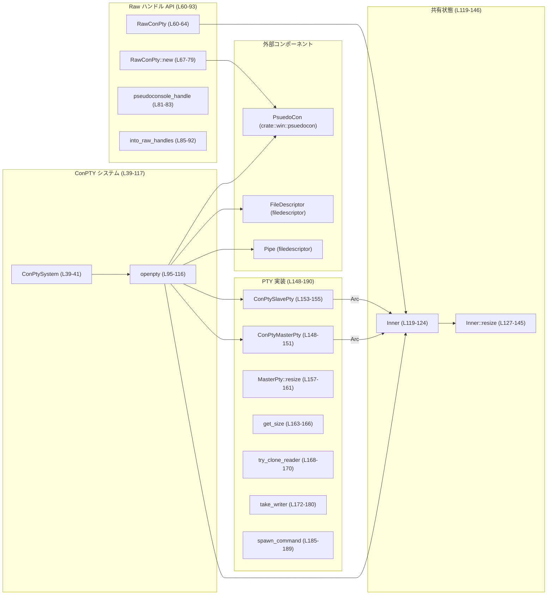
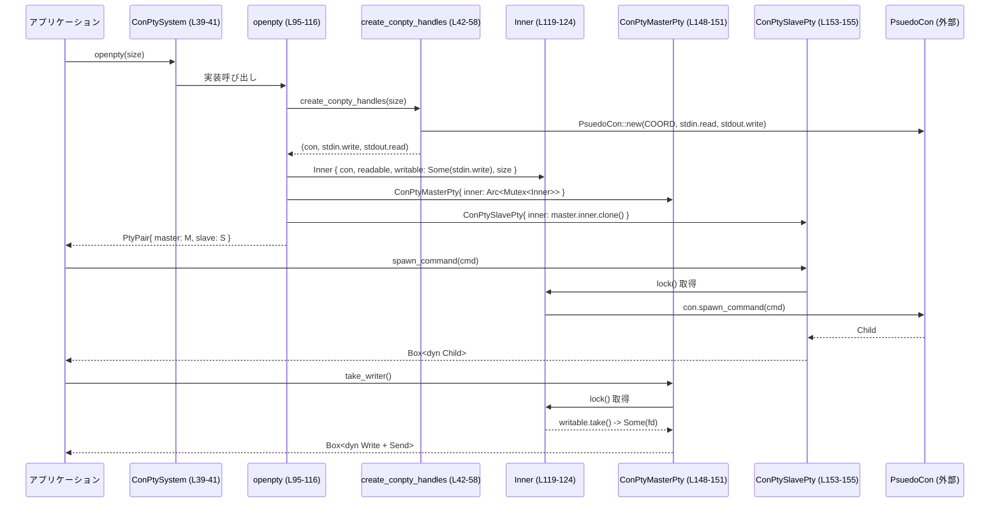

# utils\pty\src\win\conpty.rs コード解説

## 0. ざっくり一言

Windows の ConPTY（Pseudo Console）API を使って、`portable_pty` クレート向けの `PtySystem` 実装と、RawHandle ベースのラッパー型を提供するモジュールです。  
疑似コンソールの生成・サイズ変更・プロセス起動・入出力パイプの取得を行います。

---

## 1. このモジュールの役割

### 1.1 概要

- このモジュールは **Windows の Pseudo Console (ConPTY)** をラップし、`portable_pty` の `PtySystem` / `MasterPty` / `SlavePty` として扱えるようにするために存在します。
- また、ConPTY の **生の Windows ハンドル** を扱いたい用途向けに `RawConPty` という薄いラッパーも提供します。
- 入出力は `Pipe` / `FileDescriptor` で構成され、`Arc<Mutex<Inner>>` で master/slave 間の共有状態を管理します。

根拠: `ConPtySystem`・`RawConPty`・`ConPtyMasterPty`・`ConPtySlavePty` の定義と `PtySystem` / `MasterPty` / `SlavePty` 実装  
`utils\pty\src\win\conpty.rs:L39-41`, `L60-64`, `L95-117`, `L148-155`, `L157-182`, `L184-190`

### 1.2 アーキテクチャ内での位置づけ

主なコンポーネント間の関係を簡略化すると次のようになります。



- `ConPtySystem::openpty` が ConPTY とパイプを生成し、`ConPtyMasterPty`／`ConPtySlavePty` と共有する `Inner` を構築します。
- `ConPtyMasterPty` と `ConPtySlavePty` は `Arc<Mutex<Inner>>` を共有し、ConPTY ハンドルやリサイズ情報、入出力パイプを共用します。
- `PsuedoCon` 型自体の実装はこのファイルには含まれません（`crate::win::psuedocon::PsuedoCon`）。  
  根拠: `utils\pty\src\win\conpty.rs:L21`, `L95-106`, `L119-124`

### 1.3 設計上のポイント

- **責務分割**
  - `ConPtySystem`: `portable_pty::PtySystem` として「ペアを開く」ことだけを担当します。`L39-41`, `L95-117`
  - `ConPtyMasterPty` / `ConPtySlavePty`: それぞれ master / slave の `portable_pty` トレイト実装を提供します。`L148-155`, `L157-182`, `L184-190`
  - `Inner`: 実際の ConPTY ハンドル (`PsuedoCon`) と I/O パイプ、サイズ情報をまとめた共有状態です。`L119-124`
  - `RawConPty`: `portable_pty` を介さずに、ConPTY の生ハンドルと I/O ハンドルを直接扱う用途向けラッパーです。`L60-93`
- **状態管理**
  - `Arc<Mutex<Inner>>` により master/slave 間で状態を安全に共有する設計です。`L100-105`, `L148-155`
- **エラーハンドリング**
  - 外部呼び出し（`Pipe::new`, `PsuedoCon::new`, `PsuedoCon::resize`, `spawn_command`, `try_clone` など）はすべて `anyhow::Result` または `Result<_, Error>` によってエラーを上位に伝播します。`L42-58`, `L67-79`, `L127-145`, `L157-161`, `L168-170`, `L172-180`, `L185-189`
  - `Mutex::lock().unwrap()` を使用しており、ロックが poison された場合は panic します。`L159`, `L164`, `L169`, `L175`
- **並行性**
  - `Arc<Mutex<Inner>>` によりスレッド間で `Inner` を共有できますが、`Mutex` を利用しているため **同時に 1 スレッドのみがアクセス** します。
  - `Child` や I/O ハンドル自体のスレッド安全性は、このチャンクには現れません（外部型のため不明）。

---

## 2. 主要な機能一覧

このモジュールが提供する主な機能は次の通りです。

- ConPTY の生成と I/O パイプの確立（`create_conpty_handles` / `ConPtySystem::openpty`）
- `portable_pty::PtySystem` としての Windows ConPTY 実装 (`ConPtySystem`, `ConPtyMasterPty`, `ConPtySlavePty`)
- ConPTY のサイズ変更と現在サイズの取得 (`Inner::resize`, `ConPtyMasterPty::resize`, `get_size`)
- Master 側の読み取りハンドル複製・書き込みハンドルの取得 (`try_clone_reader`, `take_writer`)
- Slave 側からのコマンド起動（ConPTY 上で外部プロセスを実行） (`spawn_command`)
- ConPTY とその I/O の **生ハンドル** を直接取得する API (`RawConPty`)

### 2.1 構造体・関数インベントリ（行番号付き）

| 名前 | 種別 | 公開 | 役割 / 用途 | 根拠 |
|------|------|------|-------------|------|
| `ConPtySystem` | 構造体 | pub | `portable_pty::PtySystem` の Windows 実装 | `utils\pty\src\win\conpty.rs:L39-41`, `L95-117` |
| `RawConPty` | 構造体 | pub | ConPTY と入出力の RawHandle を直接扱うためのラッパー | `L60-64`, `L66-93` |
| `Inner` | 構造体 | 非公開 | ConPTY ハンドル・入出力・サイズ情報の共有状態 | `L119-124` |
| `ConPtyMasterPty` | 構造体 | pub | master 側 `portable_pty::MasterPty` 実装 | `L148-151`, `L157-182` |
| `ConPtySlavePty` | 構造体 | pub | slave 側 `portable_pty::SlavePty` 実装 | `L153-155`, `L184-190` |
| `create_conpty_handles` | 関数（自由関数） | 非公開 | ConPTY と、標準入出力パイプをまとめて生成 | `L42-58` |
| `RawConPty::new` | メソッド | pub | 行数・列数から新しい `RawConPty` を生成 | `L66-79` |
| `RawConPty::pseudoconsole_handle` | メソッド | pub | ConPTY 本体の `RawHandle` を返却 | `L81-83` |
| `RawConPty::into_raw_handles` | メソッド | pub | `self` を消費し、ConPTY と I/O の 3 つの `RawHandle` を返却 | `L85-92` |
| `ConPtySystem::openpty` | メソッド（トレイト impl） | pub（トレイト経由） | 指定サイズで ConPTY を開き、`PtyPair` を返却 | `L95-117` |
| `Inner::resize` | メソッド | 非公開 | ConPTY のサイズと `PtySize` 情報を更新 | `L126-145` |
| `ConPtyMasterPty::resize` | メソッド | pub（トレイト経由） | `PtySize` から `Inner::resize` を呼び出し ConPTY をリサイズ | `L157-161` |
| `ConPtyMasterPty::get_size` | メソッド | pub（トレイト経由） | 現在保持している `PtySize` を返却 | `L163-166` |
| `ConPtyMasterPty::try_clone_reader` | メソッド | pub（トレイト経由） | 読み取り側 `FileDescriptor` を複製し、`Read+Send` として返す | `L168-170` |
| `ConPtyMasterPty::take_writer` | メソッド | pub（トレイト経由） | 書き込み側 `FileDescriptor` を一度だけ取得し、`Write+Send` として返す | `L172-180` |
| `ConPtySlavePty::spawn_command` | メソッド | pub（トレイト経由） | ConPTY 上でコマンド（プロセス）を起動 | `L184-189` |

---

## 3. 公開 API と詳細解説

### 3.1 型一覧（構造体・列挙体など）

| 名前 | 種別 | 役割 / 用途 | フィールド概要 | 根拠 |
|------|------|-------------|----------------|------|
| `ConPtySystem` | 構造体 | `portable_pty::PtySystem` として ConPTY ベースの pty ペアを生成するエントリポイント | フィールドなし（空 struct） | `L39-41`, `L95-117` |
| `RawConPty` | 構造体 | ConPTY と I/O ハンドルを直接扱うためのラッパー。Windows API などに渡す用途が想定されるが、このチャンクからは確定できません。 | `con: PsuedoCon`, `input_write: FileDescriptor`, `output_read: FileDescriptor` | `L60-64` |
| `Inner` | 構造体 | ConPTY の内部状態（ハンドル・I/O・サイズ）をまとめ、`Arc<Mutex<Inner>>` 経由で master/slave から共有される | `con: PsuedoCon`, `readable: FileDescriptor`, `writable: Option<FileDescriptor>`, `size: PtySize` | `L119-124` |
| `ConPtyMasterPty` | 構造体 | `MasterPty` 実装。リサイズ・サイズ取得・I/O ハンドル提供を行う | `inner: Arc<Mutex<Inner>>` | `L148-151` |
| `ConPtySlavePty` | 構造体 | `SlavePty` 実装。コマンド起動を行う | `inner: Arc<Mutex<Inner>>` | `L153-155` |

### 3.2 関数詳細（7 件）

#### 1. `create_conpty_handles(size: PtySize) -> anyhow::Result<(PsuedoCon, FileDescriptor, FileDescriptor)>`

**概要**

指定された `PtySize` に基づいて Windows ConPTY (`PsuedoCon`) と、入出力用の `Pipe` を生成し、  
ConPTY と「書き込み側 stdin」「読み取り側 stdout」の 3 つをまとめて返します。  
根拠: `utils\pty\src\win\conpty.rs:L42-58`

**引数**

| 引数名 | 型 | 説明 |
|--------|----|------|
| `size` | `PtySize` | 行数・列数・ピクセルサイズを含む仮想端末のサイズ情報 |

**戻り値**

- `Ok((con, stdin_write, stdout_read))`:
  - `con: PsuedoCon` – ConPTY ハンドル
  - `stdin_write: FileDescriptor` – 子プロセスに入力を書き込むためのハンドル
  - `stdout_read: FileDescriptor` – 子プロセスの出力を読み取るためのハンドル  
- `Err(_)`: `Pipe::new` または `PsuedoCon::new` の失敗をラップした `anyhow::Error`

**内部処理の流れ**

1. `Pipe::new()` を 2 回呼び、`stdin` 用と `stdout` 用の 2 つのパイプを作成します。`L45-46`
2. `PsuedoCon::new(...)` に対して:
   - `COORD { X: size.cols as i16, Y: size.rows as i16 }` を渡し、コンソールサイズを指定します。`L48-52`
   - `stdin.read`, `stdout.write` を渡し、ConPTY の標準入出力としてパイプを接続します。`L53-55`
3. ConPTY の生成に成功したら、`Ok((con, stdin.write, stdout.read))` として、クライアントが利用する向きのハンドルを返します。`L57`

**Examples（使用例）**

```rust
use portable_pty::PtySize;
use crate::win::conpty::create_conpty_handles; // 実際には非公開関数なので、本モジュール内からのみ利用されます

fn example() -> anyhow::Result<()> {
    let size = PtySize {
        rows: 24,
        cols: 80,
        pixel_width: 0,
        pixel_height: 0,
    };

    // ConPTY と I/O ハンドルを生成する
    let (con, stdin_write, stdout_read) = create_conpty_handles(size)?;

    // stdin_write に書き込むと ConPTY 内のプロセスに入力される
    // stdout_read から読み取ると ConPTY 内のプロセスの出力が取得できる
    Ok(())
}
```

**Errors / Panics**

- エラー条件:
  - `Pipe::new()` が失敗した場合（OS のリソース不足など）`Err` を返します。`L45-46`
  - `PsuedoCon::new(...)` が失敗した場合（ConPTY 初期化失敗など）`Err` を返します。`L48-55`
- panic 条件:
  - この関数内で `unwrap` や `panic!` は使用されていません。このチャンクからは panic は発生しないと判断できます。

**Edge cases（エッジケース）**

- `size.rows == 0` または `size.cols == 0` の場合:
  - `COORD` に 0 が渡されます。ConPTY 側で許容されるかどうかは `PsuedoCon::new` の実装次第であり、このチャンクには現れません。
- `pixel_width` / `pixel_height`:
  - `PsuedoCon::new` には渡していないため、この関数では無視されます。`PtySize` に保持されていても ConPTY には反映されません。

**使用上の注意点**

- 直接公開されていないため、通常は `ConPtySystem::openpty` 経由で間接的に使用されます。
- 生成された `FileDescriptor` は RAII により自動でクローズされます（`FileDescriptor` の Drop 実装に依存するが、少なくともこの関数内では raw handle の直接操作はしていません）。

---

#### 2. `RawConPty::new(cols: i16, rows: i16) -> anyhow::Result<Self>`

**概要**

行数・列数を整数で指定して、`RawConPty`（ConPTY と I/O ハンドルのラッパー）を生成します。  
内部では `create_conpty_handles` によって ConPTY を作成します。  
根拠: `utils\pty\src\win\conpty.rs:L66-79`

**引数**

| 引数名 | 型 | 説明 |
|--------|----|------|
| `cols` | `i16` | 端末の列数（列数は `u16` にキャストされます） |
| `rows` | `i16` | 端末の行数（行数は `u16` にキャストされます） |

**戻り値**

- `Ok(RawConPty { con, input_write, output_read })`: 初期化された `RawConPty` を返します。
- `Err(_)`: ConPTY 生成やパイプ生成に失敗した場合の `anyhow::Error`。

**内部処理の流れ**

1. 渡された `rows` / `cols` を `u16` にキャストし、`PtySize` を構築します。`L68-73`
2. `create_conpty_handles(size)` を呼び出し、`PsuedoCon` と I/O ハンドルを取得します。`L68-73`
3. それらをフィールドに設定した `RawConPty` インスタンスを `Ok(Self { ... })` で返します。`L74-78`

**Examples（使用例）**

```rust
use crate::win::conpty::RawConPty;

fn example() -> anyhow::Result<()> {
    // 80x24 の ConPTY を生成
    let raw = RawConPty::new(80, 24)?;

    // Windows API などに渡すために RawHandle を取り出す
    let handle = raw.pseudoconsole_handle();
    // handle を CreateProcess などに指定する用途が想定されます（詳細はこのチャンクからは不明）

    Ok(())
}
```

**Errors / Panics**

- エラー条件:
  - `create_conpty_handles` が `Err` を返す場合、そのエラーがそのまま返されます。`L68-73`
- panic 条件:
  - このメソッド内で `unwrap` や `panic!` は使用されていません。

**Edge cases**

- `rows` / `cols` が負の値の場合:
  - `rows as u16` / `cols as u16` でキャストされるため、ビットパターンがそのまま `u16` として解釈されます。  
    例えば `-1i16` は `65535u16` になります。ConPTY 側でどう扱われるかは `PsuedoCon::new` に依存し、このチャンクからは不明です。
- 非常に大きな値（`i16::MAX` など）を指定した場合も同様に、ConPTY API の制約に依存します。

**使用上の注意点**

- 行数・列数は通常は正の値かつ適切な範囲（例えば 0 ではない）を渡す必要があります。  
  そうでない場合の挙動は `PsuedoCon::new` 依存であり、このチャンクには現れません。
- `RawConPty` は `Drop` 時に `PsuedoCon` や `FileDescriptor` をクローズすると考えられますが、詳細は他ファイルに依存します（このチャンクには実装が現れません）。

---

#### 3. `RawConPty::into_raw_handles(self) -> (RawHandle, RawHandle, RawHandle)`

**概要**

`RawConPty` を消費して、ConPTY 本体と I/O の Windows `RawHandle` を 3 つ返します。  
`ManuallyDrop` を用いて `Drop` 時のクローズを抑制し、呼び出し元に管理を移譲します。  
根拠: `utils\pty\src\win\conpty.rs:L85-92`

**引数**

- なし（`self` を by-value で消費します）。

**戻り値**

- `(pseudoconsole_handle, input_write_handle, output_read_handle)` の 3 つの `RawHandle`。

**内部処理の流れ**

1. `let me = ManuallyDrop::new(self);` により、`self` の自動 `Drop` を抑制したラッパーを作成します。`L86`
2. `me.con.raw_handle()` により ConPTY の `RawHandle` を取得します。`L88`
3. `me.input_write.as_raw_handle()` で入力パイプのハンドルを取得します。`L89`
4. `me.output_read.as_raw_handle()` で出力パイプのハンドルを取得します。`L90`
5. 3 つのハンドルをタプルで返します。`L87-91`

**Examples（使用例）**

```rust
use crate::win::conpty::RawConPty;
use std::os::windows::io::RawHandle;

fn example() -> anyhow::Result<()> {
    let raw = RawConPty::new(80, 24)?;
    let (con, input, output): (RawHandle, RawHandle, RawHandle) = raw.into_raw_handles();

    // ここからは con/input/output のクローズ責任は呼び出し側にあります。
    // 具体的には CloseHandle を直接呼ぶか、別の RAII ラッパーに包む必要があります。

    Ok(())
}
```

**Errors / Panics**

- エラーを返さない関数です。
- panic も発生しません（`unwrap` などは使用していません）。

**Edge cases**

- `into_raw_handles` 呼び出し後、もともとの `RawConPty` は再利用できません（by-value で消費されています）。
- `ManuallyDrop` により、`RawConPty` に紐づく RAII によるクローズ処理は **実行されません**。  
  ハンドルを適切にクローズしないと、ハンドルリークが発生します。

**使用上の注意点**

- 取得した `RawHandle` をどのように扱うか（どこで Close するか）は完全に利用者の責任になります。
- セキュリティ上、意図しないプロセスにこれらのハンドルを渡すと、ConPTY への入出力を盗聴または改変される可能性があります。  
  本モジュールはその制御を行いません。

---

#### 4. `ConPtySystem::openpty(&self, size: PtySize) -> anyhow::Result<PtyPair>`

**概要**

`PtySystem` トレイトの実装として、指定されたサイズの ConPTY を開き、`MasterPty` と `SlavePty` のペアを返します。  
根拠: `utils\pty\src\win\conpty.rs:L95-117`

**引数**

| 引数名 | 型 | 説明 |
|--------|----|------|
| `size` | `PtySize` | 行数・列数・ピクセルサイズを含む仮想端末のサイズ情報 |

**戻り値**

- `Ok(PtyPair { master, slave })`:
  - `master`: `ConPtyMasterPty` を `Box<dyn MasterPty>` として返却
  - `slave`: `ConPtySlavePty` を `Box<dyn SlavePty>` として返却
- `Err(_)`: ConPTY 生成やパイプ生成に失敗した場合の `anyhow::Error`

**内部処理の流れ**

1. `create_conpty_handles(size)` を呼び出し、ConPTY と I/O ハンドルを取得します。`L96-97`
2. `Inner { con, readable, writable: Some(writable), size }` を生成し、`Arc<Mutex<Inner>>` で包みます。`L99-105`
3. `ConPtyMasterPty { inner: ... }` を構築します。`L99-106`
4. `ConPtySlavePty { inner: master.inner.clone() }` として、同じ `Arc` を共有する slave を構築します。`L108-110`
5. `PtyPair { master: Box::new(master), slave: Box::new(slave) }` を `Ok(..)` で返します。`L112-115`

**Examples（使用例）**

```rust
use portable_pty::{PtySystem, PtySize};
use crate::win::conpty::ConPtySystem;

fn example() -> anyhow::Result<()> {
    let system = ConPtySystem::default();

    let size = PtySize {
        rows: 24,
        cols: 80,
        pixel_width: 0,
        pixel_height: 0,
    };

    // ConPTY ベースの pty ペアを開く
    let pair = system.openpty(size)?;
    let mut master = pair.master; // Box<dyn MasterPty>
    let mut slave = pair.slave;   // Box<dyn SlavePty>

    // slave.spawn_command(...) などでプロセスを起動し、
    // master から入出力を行うことができます。

    Ok(())
}
```

**Errors / Panics**

- エラー条件:
  - `create_conpty_handles(size)` が失敗した場合、そのエラーがそのまま返されます。`L96-97`
- panic 条件:
  - この関数内では `unwrap` は使用していません。

**Edge cases**

- `size.rows` / `size.cols` が 0 や極端に大きい場合の挙動は `create_conpty_handles` / `PsuedoCon::new` に依存し、このチャンクからは不明です。
- `pixel_width` / `pixel_height` は `Inner::size` に格納されますが、ConPTY に直接渡されるのは `rows` / `cols` のみです。`L100-105`, `L48-52`

**使用上の注意点**

- `master` と `slave` は同じ `Arc<Mutex<Inner>>` を共有するため、同じ ConPTY を操作します。
- `take_writer` は一度しか呼べないため（後述）、`openpty` から得た master をどのように共有するかに注意が必要です。

---

#### 5. `Inner::resize(&mut self, num_rows: u16, num_cols: u16, pixel_width: u16, pixel_height: u16) -> Result<(), Error>`

**概要**

ConPTY (`PsuedoCon`) のサイズを変更し、内部に保持している `PtySize` を更新します。  
根拠: `utils\pty\src\win\conpty.rs:L126-145`

**引数**

| 引数名 | 型 | 説明 |
|--------|----|------|
| `num_rows` | `u16` | 新しい行数 |
| `num_cols` | `u16` | 新しい列数 |
| `pixel_width` | `u16` | 新しいピクセル幅（情報として `PtySize` に保持） |
| `pixel_height` | `u16` | 新しいピクセル高さ（情報として `PtySize` に保持） |

**戻り値**

- `Ok(())`: サイズ変更に成功。
- `Err(Error)`: `self.con.resize` によるリサイズが失敗した場合のエラー。

**内部処理の流れ**

1. `self.con.resize(COORD { X: num_cols as i16, Y: num_rows as i16 })?;` を呼び出して、ConPTY のサイズを変更します。`L134-137`
2. `self.size` を新しい `PtySize` 構造体に置き換えます。`L138-143`
3. `Ok(())` を返します。`L144`

**Examples（使用例）**

通常は `ConPtyMasterPty::resize` 経由で呼ばれるため、直接使うことはありませんが、イメージは以下です。

```rust
// inner: &mut Inner があると仮定
inner.resize(40, 120, 0, 0)?;
// ConPTY の行数・列数が 40x120 に変更され、inner.size も更新される
```

**Errors / Panics**

- エラー条件:
  - `self.con.resize(...)` が失敗した場合、エラーをそのまま返します。`L134-137`
- panic 条件:
  - この関数内には `unwrap` や `panic!` はありません。

**Edge cases**

- `num_rows == 0` や `num_cols == 0` の場合:
  - `COORD` に 0 が渡されます。許容されるかどうかは `PsuedoCon::resize`（および Windows API）に依存し、このチャンクからは不明です。
- 非常に大きな行数・列数を指定した場合:
  - `i16` にキャストしているため、`u16` の最大値は `i16` の範囲外です。  
    例えば `num_cols = 65535` の場合、`num_cols as i16` は符号付き整数に変換され、値が変わります。  
    実際にそのような値を渡すかどうかは呼び出し側の責任です。

**使用上の注意点**

- `Inner` は `Mutex<Inner>` 経由で共有されているため、通常は `ConPtyMasterPty::resize` を経由して呼び出されます。
- 表示上のピクセルサイズ情報（`pixel_width`, `pixel_height`）は ConPTY には直接渡されず、`Inner.size` に保持されるだけです。

---

#### 6. `ConPtyMasterPty::take_writer(&self) -> anyhow::Result<Box<dyn std::io::Write + Send>>`

**概要**

ConPTY への標準入力に対応する書き込みハンドルを **一度だけ** 取得し、`Write + Send` な trait オブジェクトとして返します。  
以降は `None` になるため、2 回目以降はエラーになります。  
根拠: `utils\pty\src\win\conpty.rs:L172-180`

**引数**

- なし（`&self`）。

**戻り値**

- `Ok(Box<dyn Write + Send>)`: 書き込みハンドルをラップした trait オブジェクト。
- `Err(_)`: すでに書き込みハンドルが取得済みの場合、`anyhow!("writer already taken")` を返します。

**内部処理の流れ**

1. `self.inner.lock().unwrap()` で `Mutex` をロックし、`Inner` への可変参照を取得します。`L175-176`
2. `inner.writable.take()` を実行します。`Option<FileDescriptor>` から中身を取り出し、`None` を残します。`L177-178`
3. `take()` が `None` なら、`anyhow::anyhow!("writer already taken")` を生成して `Err` とします。`L179`
4. `Some(fd)` の場合、`Box::new(fd)` で `Write + Send` trait オブジェクトとして包み `Ok(...)` で返します。`L173-180`

**Examples（使用例）**

```rust
use portable_pty::{PtySystem, PtySize};
use crate::win::conpty::ConPtySystem;
use std::io::Write;

fn example() -> anyhow::Result<()> {
    let system = ConPtySystem::default();
    let size = PtySize {
        rows: 24,
        cols: 80,
        pixel_width: 0,
        pixel_height: 0,
    };
    let pair = system.openpty(size)?;
    let master = pair.master;

    // writer を取得（1回しか成功しない）
    let mut writer = master.take_writer()?;
    writer.write_all(b"echo hello\r\n")?;

    // 2回目はエラー
    assert!(master.take_writer().is_err());

    Ok(())
}
```

**Errors / Panics**

- エラー条件:
  - `writable` がすでに `None` になっている場合（= すでに取得済み）、`anyhow!("writer already taken")` を返します。`L177-180`
- panic 条件:
  - `self.inner.lock().unwrap()` が **poisoned** な `Mutex` に対して呼ばれた場合、`unwrap()` により panic します。`L175-176`  
    Poison は、別スレッドが `Mutex` をロックしたまま panic した場合に発生します。

**Edge cases**

- 別スレッドで `take_writer` を呼び出す場合:
  - `Mutex` により排他制御はされていますが、正しい順序で呼び出さないと、意図せず `None` になっている可能性があります。
- 同じスレッドで複数回呼ぶ場合:
  - 2 回目以降は `Err("writer already taken")` になります。

**使用上の注意点**

- `take_writer` は **一度だけ呼び出す** ことを前提とした設計です。必要なら、自分で `Arc<Mutex<dyn Write>>` などに包んで再配布する必要があります。
- `Mutex::lock().unwrap()` による panic の可能性があるため、ライブラリとして panic させたくない場合は、上位レイヤーで panic を捕捉するなどの対策が必要になることがあります。
- スレッド安全性:
  - 返される `Write + Send` は `Send` を満たすため、別スレッドに送って使用することができます。ただし、同時に複数スレッドから書き込む場合は別途同期が必要です。

---

#### 7. `ConPtySlavePty::spawn_command(&self, cmd: CommandBuilder) -> anyhow::Result<Box<dyn Child + Send + Sync>>`

**概要**

ConPTY 上で指定されたコマンドを起動し、`portable_pty::Child` トレイトオブジェクトとして返します。  
内部では `Inner` が保持する `PsuedoCon` に処理を委譲しています。  
根拠: `utils\pty\src\win\conpty.rs:L184-189`

**引数**

| 引数名 | 型 | 説明 |
|--------|----|------|
| `cmd` | `CommandBuilder` | 起動するコマンドと引数・環境変数などをカプセル化した構造体 |

**戻り値**

- `Ok(Box<dyn Child + Send + Sync>)`: 起動された子プロセスを表す trait オブジェクト。
- `Err(anyhow::Error)`: `PsuedoCon::spawn_command(cmd)` が返したエラー。

**内部処理の流れ**

1. `self.inner.lock().unwrap()` で `Mutex` をロックし、`Inner` への参照を得ます。`L186`
2. `inner.con.spawn_command(cmd)?` を呼び出し、ConPTY 上でコマンドを実行する子プロセスを生成します。`L187`
3. 生成された `child` を `Box::new(child)` で trait オブジェクトに包み、`Ok(..)` で返します。`L188`

**Examples（使用例）**

```rust
use portable_pty::{PtySystem, PtySize};
use portable_pty::cmdbuilder::CommandBuilder;
use crate::win::conpty::ConPtySystem;

fn example() -> anyhow::Result<()> {
    let system = ConPtySystem::default();
    let size = PtySize {
        rows: 24,
        cols: 80,
        pixel_width: 0,
        pixel_height: 0,
    };
    let pair = system.openpty(size)?;
    let mut master = pair.master;
    let slave = pair.slave;

    // コマンドを組み立てる
    let cmd = CommandBuilder::new("cmd.exe"); // 例: Windows の cmd.exe
    let child = slave.spawn_command(cmd)?; // ConPTY 上で cmd.exe を起動

    // master 側から入出力を行うことで、cmd.exe と対話できます
    let mut writer = master.take_writer()?;
    // ...

    Ok(())
}
```

**Errors / Panics**

- エラー条件:
  - `inner.con.spawn_command(cmd)` が失敗した場合、そのエラーを `?` で上位に返します。`L187`
- panic 条件:
  - `self.inner.lock().unwrap()` で `Mutex` が poisoned の場合に panic します。`L186`

**Edge cases**

- コマンドのパスが存在しない、または起動権限がない場合:
  - `PsuedoCon::spawn_command` がエラーを返し、そのまま `Err` となります。具体的なエラー内容は `PsuedoCon` および OS に依存し、このチャンクからは不明です。
- 同じ `ConPtySlavePty` から複数回 `spawn_command` を呼ぶことが許容されるかどうかは `PsuedoCon` の仕様に依存します（このチャンクには現れません）。

**使用上の注意点**

- `Child + Send + Sync` の trait オブジェクトとして返されるため、呼び出し側でスレッド間共有が可能です。ただし、子プロセスオブジェクトのメソッド自体のスレッド安全性は `Child` 実装に依存します。
- `Mutex::lock().unwrap()` による panic の可能性がある点は、他のメソッドと同様です。

---

### 3.3 その他の関数・メソッド

上記で詳細解説していない補助的メソッドの一覧です。

| 関数名 / メソッド | 役割（1 行） | 根拠 |
|-------------------|--------------|------|
| `RawConPty::pseudoconsole_handle(&self) -> RawHandle` | 内部の `PsuedoCon` の生ハンドルを返す | `L81-83` |
| `ConPtyMasterPty::resize(&self, size: PtySize) -> anyhow::Result<()>` | 外部からのリサイズ要求を `Inner::resize` に転送する | `L157-161` |
| `ConPtyMasterPty::get_size(&self) -> Result<PtySize, Error>` | `Inner` に保持されている現在サイズを返す | `L163-166` |
| `ConPtyMasterPty::try_clone_reader(&self) -> anyhow::Result<Box<dyn std::io::Read + Send>>` | 読み取りハンドルを複製し、`Read + Send` として返す | `L168-170` |

---

## 4. データフロー

### 4.1 代表的な処理シナリオ: pty ペア生成〜コマンド起動〜入出力

ここでは `ConPtySystem::openpty` から `ConPtySlavePty::spawn_command`、`ConPtyMasterPty::take_writer` までの流れを示します。



このフローから分かる要点:

- ConPTY とパイプの生成はすべて `create_conpty_handles` を通して行われます。`L42-58`
- master/slave は **同じ `Inner` を共有** し、ConPTY に対する操作（リサイズ、プロセス起動）はすべて `Inner` 経由で行われます。
- 書き込みハンドルは `take_writer` で一度だけ外に出され、それ以降は `Inner.writable` は `None` になります。`L119-124`, `L172-180`

---

## 5. 使い方（How to Use）

### 5.1 基本的な使用方法

`portable_pty` 視点での基本的な利用フローです。

```rust
use portable_pty::{PtySystem, PtySize};
use portable_pty::cmdbuilder::CommandBuilder;
use std::io::{Read, Write};
use crate::win::conpty::ConPtySystem; // 本ファイルの ConPtySystem

fn main() -> anyhow::Result<()> {
    // 1. PtySystem を構築する（空 struct なので Default で十分）
    let system = ConPtySystem::default(); // L39-41

    // 2. 端末サイズを指定して pty ペアを開く
    let size = PtySize {
        rows: 24,
        cols: 80,
        pixel_width: 0,
        pixel_height: 0,
    };

    let pair = system.openpty(size)?; // L95-117
    let mut master = pair.master;     // Box<dyn MasterPty>
    let slave = pair.slave;           // Box<dyn SlavePty>

    // 3. slave 側からコマンドを起動する
    let cmd = CommandBuilder::new("cmd.exe");
    let _child = slave.spawn_command(cmd)?; // L184-189

    // 4. master 側から書き込みハンドルを取得して入力を送る
    let mut writer = master.take_writer()?; // L172-180
    writer.write_all(b"echo hello\r\n")?;

    // 5. master 側から読み取りハンドルを複製して出力を読む
    let mut reader = master.try_clone_reader()?; // L168-170
    let mut buf = [0u8; 1024];
    let n = reader.read(&mut buf)?;
    println!("output: {}", String::from_utf8_lossy(&buf[..n]));

    Ok(())
}
```

### 5.2 よくある使用パターン

1. **ConPTY を直接扱いたい場合の RawConPty 利用**

```rust
use crate::win::conpty::RawConPty;
use std::os::windows::io::RawHandle;

fn use_raw_handles() -> anyhow::Result<()> {
    let raw = RawConPty::new(80, 24)?;      // L66-79
    let (con, input, output): (RawHandle, RawHandle, RawHandle) =
        raw.into_raw_handles();            // L85-92

    // con/input/output を Windows API に渡すなどの用途が考えられます。
    // ハンドルのクローズ責任は呼び出し側に移ります。

    Ok(())
}
```

1. **サイズ変更**

```rust
use portable_pty::PtySize;

// master は openpty から得られた Box<dyn MasterPty> とする
fn resize_example(master: &mut Box<dyn portable_pty::MasterPty>) -> anyhow::Result<()> {
    let new_size = PtySize {
        rows: 40,
        cols: 120,
        pixel_width: 0,
        pixel_height: 0,
    };

    master.resize(new_size)?;         // L157-161
    let current = master.get_size()?; // L163-166
    assert_eq!(current.rows, 40);
    assert_eq!(current.cols, 120);

    Ok(())
}
```

### 5.3 よくある間違い

```rust
use crate::win::conpty::ConPtySystem;
use portable_pty::{PtySize, PtySystem};

// 間違い例: take_writer を複数回呼び出してしまう
fn wrong_usage() -> anyhow::Result<()> {
    let system = ConPtySystem::default();
    let size = PtySize {
        rows: 24,
        cols: 80,
        pixel_width: 0,
        pixel_height: 0,
    };
    let pair = system.openpty(size)?;
    let master = pair.master;

    let _writer1 = master.take_writer()?;  // 1回目は成功
    let _writer2 = master.take_writer()?;  // 2回目は Err("writer already taken")
    // ↑ ここで anyhow::Error が返る

    Ok(())
}

// 正しい例: 取得した writer を共有したい場合は自分で包む
use std::sync::{Arc, Mutex};
use std::io::Write;

fn correct_usage() -> anyhow::Result<()> {
    let system = ConPtySystem::default();
    let size = PtySize {
        rows: 24,
        cols: 80,
        pixel_width: 0,
        pixel_height: 0,
    };
    let pair = system.openpty(size)?;
    let master = pair.master;

    let writer = master.take_writer()?; // 1回だけ取得
    let writer = Arc::new(Mutex::new(writer)); // 必要なら自分で共有用に包む

    // 以降、writer を別スレッドに渡して使うなどが可能
    Ok(())
}
```

### 5.4 使用上の注意点（まとめ）

- **前提条件**
  - `take_writer` は一度だけ呼び出す設計です。2 回目以降はエラーになります。`L172-180`
  - `ConPtyMasterPty` / `ConPtySlavePty` のメソッドは、内部で `Mutex::lock().unwrap()` を使用するため、  
    `Mutex` が poison されている場合には panic が発生します。`L159`, `L164`, `L169`, `L175`, `L186`
- **スレッド安全性**
  - `Arc<Mutex<Inner>>` により master/slave が共有され、メソッド内では必ず `Mutex` を通じて状態にアクセスするため、データレースは防がれています。
  - ただし `Mutex` は同時アクセスを直列化するため、高頻度のリサイズや I/O ハンドル取得処理がボトルネックになりうる可能性があります。
- **ハンドル管理**
  - `RawConPty::into_raw_handles` を使う場合はハンドルリークに注意が必要です（`ManuallyDrop` により RAII 破棄が抑制されています）。`L85-92`
- **テスト**
  - このチャンクにはテストコードは現れません。動作確認方法は他ファイルまたは上位クレートに依存します。

---

## 6. 変更の仕方（How to Modify）

### 6.1 新しい機能を追加する場合

例: コンソールのタイトル変更 API を追加したい場合（仮想的な例）

1. `PsuedoCon` にタイトル変更用のメソッドがある前提で説明します（実際にあるかどうかはこのチャンクからは不明）。
2. `Inner` に対してメソッド（例: `set_title(&mut self, title: &str)`) を追加し、`self.con` に対して委譲します。`L119-124` に追記。
3. `ConPtyMasterPty` または `ConPtySlavePty` の `impl` ブロック内に、`MasterPty` / `SlavePty` とは別の固有メソッドとして公開するか、  
   あるいは上位インターフェース側（`portable_pty` 側）でトレイトを拡張する必要があります。

このように、**共通状態は `Inner` に集約されているため、機能追加は `Inner` → master/slave という経路で行うのが自然な構造**になっています。

### 6.2 既存の機能を変更する場合

- **影響範囲の確認**
  - サイズ関連の変更: `Inner::resize` と `ConPtyMasterPty::resize` / `get_size` が主な入口です。`L126-145`, `L157-166`
  - I/O ハンドル関連の変更: `Inner` の `readable` / `writable` と、それを触る `try_clone_reader` / `take_writer` を確認します。`L119-124`, `L168-180`
  - プロセス起動関連: `spawn_command` と `PsuedoCon` の実装を確認する必要があります。`L184-189`
- **契約（前提条件・返り値の意味）に注意**
  - `take_writer` が「一度だけ成功する」という契約は `writable: Option<FileDescriptor>` と `take()` により実現されています。`L119-124`, `L177-178`  
    これを変更すると上位コードの期待を破る可能性があります。
  - `resize` のエラー処理は `?` により上位に透過的に伝播します。ここに独自のリトライやデフォルト値フォールバックを入れる場合、その設計を明確にする必要があります。
- **関連するテスト・使用箇所の再確認**
  - このファイル単体にはテストコードがないため、上位クレートのテストや、`portable_pty` 経由での利用箇所を検索して影響範囲を特定することが重要です。

---

## 7. 関連ファイル

このモジュールと密接に関係するファイルは、コードから次のように推測できます。

| パス | 役割 / 関係 |
|------|------------|
| `crate::win::psuedocon`（具体的なファイル名はこのチャンクには現れない） | `PsuedoCon` 型を提供し、ConPTY の生成 (`new`)、サイズ変更 (`resize`)、コマンド起動 (`spawn_command`) を実装していると考えられます。`L21`, `L48-55`, `L134-137`, `L187` |
| `filedescriptor` クレート内の `Pipe` / `FileDescriptor` 実装 | Windows のパイプとファイルハンドルを安全にラップするユーティリティ。`create_conpty_handles` で使用されています。`L23-24`, `L45-46`, `L57`, `L119-124` |
| `portable_pty` クレート | `PtySystem`, `MasterPty`, `SlavePty`, `Child`, `PtyPair`, `PtySize`, `cmdbuilder::CommandBuilder` などのインターフェースを提供し、本モジュールから実装が与えられています。`L25-31`, `L95-117`, `L157-182`, `L184-189` |

このチャンクには他の具体的なファイルパスは現れないため、それ以上の関連ファイルについては不明です。
