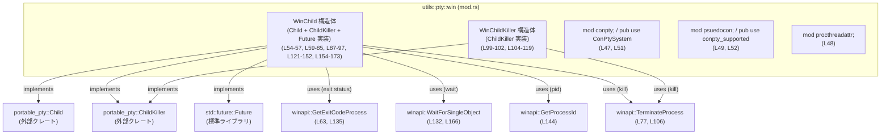
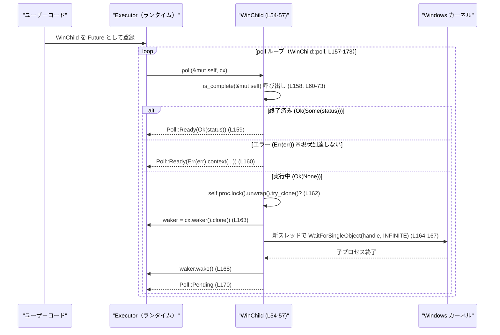

# utils/pty/src/win/mod.rs コード解説

## 0. ざっくり一言

Windows 上の子プロセス（PTY の子）の **プロセスハンドル管理と終了待ち** を行うモジュールです。  
`portable_pty` クレートの `Child` / `ChildKiller` を Windows API によって実装し、同期・非同期の両方でプロセス終了を待てる `WinChild` 型を提供しています（mod.rs:L29-33, L54-57, L121-152, L154-173）。

---

## 1. このモジュールの役割

### 1.1 概要

- このモジュールは **Windows のプロセスハンドル（`HANDLE`）をラップした子プロセス表現** を提供し、`portable_pty` の `Child` / `ChildKiller` インターフェースに適合させています（mod.rs:L29-33, L54-57, L121-152）。
- プロセスの終了状態を問い合わせる `try_wait` / `wait` と、プロセスを強制終了する `kill` を Windows API (`GetExitCodeProcess`, `TerminateProcess`, `WaitForSingleObject`, `GetProcessId`) 経由で実装しています（mod.rs:L41-45, L60-73, L75-84, L105-112, L126-141, L143-145）。
- `WinChild` 自体は `Future` も実装しており、`async/await` で子プロセスの終了待ちができます（mod.rs:L154-173）。

### 1.2 アーキテクチャ内での位置づけ

このモジュールは `utils::pty::win` 名前空間のエントリポイントで、Windows 用 PTY 実装の一部として、外部からは `ConPtySystem` と `conpty_supported` を再エクスポートしています（mod.rs:L47-52）。



※ `conpty` / `psuedocon` / `procthreadattr` の具体的な内容は、このチャンクには現れません。

### 1.3 設計上のポイント

- **プロセスハンドルの所有と共有**  
  - `WinChild` は `Mutex<OwnedHandle>` をフィールドに持ち、内部で Windows のプロセスハンドルを所有します（mod.rs:L54-57）。  
  - 複数スレッドから使用できるよう、必要に応じて `OwnedHandle::try_clone` で OS ハンドルを複製して使います（mod.rs:L62, L76, L94, L116, L130, L162）。

- **同期・非同期の二重インターフェース**  
  - `Child` トレイト経由の `wait` / `try_wait` による同期 API（mod.rs:L121-141）。  
  - `Future` 実装による `async/await` ベースの非同期待機 API（mod.rs:L154-173）。  
  - 非同期待機は内部で `std::thread::spawn` でブロッキングな `WaitForSingleObject` を別スレッドで実行する方式です（mod.rs:L164-167）。

- **終了判定とエラーハンドリングの方針**  
  - 終了チェック `is_complete` は、`GetExitCodeProcess` が失敗しても `Ok(None)` を返してエラーを表に出しません（mod.rs:L60-73）。  
  - 一方 `wait` は `GetExitCodeProcess` の失敗を `Err(IoError::last_os_error())` として返します（mod.rs:L134-140）。  
  - プロセス殺害 `do_kill` / `WinChildKiller::kill` は `TerminateProcess` の戻り値を **非 0 が成功, 0 がエラー** として扱うよう明示的に修正されています（mod.rs:L75-84, L105-112, L78-80, L107-109）。

- **パニック許容 (`unwrap` 使用)**  
  - `#![allow(clippy::unwrap_used)]` が指定されており（mod.rs:L1）、`Mutex::lock()` や `try_clone()` の結果に対して多数の `unwrap()` を使用しています（例: mod.rs:L62, L76, L94, L130, L144, L149）。  
  - Mutex のポイズニングやハンドル複製失敗などは **パニックとして処理される設計** になっています。

---

## 2. 主要な機能一覧

### コンポーネント一覧（インベントリ）

| コンポーネント | 種別 | 役割 | 定義位置 / 根拠 |
|---------------|------|------|------------------|
| `WinChild` | 構造体 | Windows プロセスハンドルをラップし、`Child` / `ChildKiller` / `Future` を実装する子プロセス表現 | 定義: mod.rs:L54-57 / 実装: L59-85, L87-97, L121-152, L154-173 |
| `WinChildKiller` | 構造体 | プロセスを kill するためだけの軽量オブジェクト。`ChildKiller` を実装 | 定義: mod.rs:L99-102 / 実装: L104-119 |
| `ConPtySystem` | 不明（別モジュール） | `pub use conpty::ConPtySystem;` で再エクスポートされる Windows ConPTY 関連の型と推測されるが、種別はこのチャンクからは不明 | 再エクスポート宣言: mod.rs:L51 |
| `conpty_supported` | 不明（別モジュール） | `pub use psuedocon::conpty_supported;` で再エクスポート。ConPTY 対応可否を表すシンボル名だが、関数か定数かは不明 | 再エクスポート宣言: mod.rs:L52 |

### 機能一覧

- プロセス終了状態のポーリング（`WinChild::is_complete` / `try_wait`）  
  （mod.rs:L60-73, L121-124）
- プロセス終了の同期待機（`WinChild::wait`）  
  （mod.rs:L126-141）
- プロセスの強制終了（`WinChild::do_kill`, `WinChild`/`WinChildKiller` の `kill`）  
  （mod.rs:L75-84, L87-91, L104-112）
- プロセス ID の取得（`WinChild::process_id`）  
  （mod.rs:L143-145）
- プロセスハンドルの取得（`WinChild::as_raw_handle`）  
  （mod.rs:L148-150）
- 子プロセス終了を Future として非同期に待機（`impl Future for WinChild` の `poll`）  
  （mod.rs:L154-173）
- `ChildKiller` のクローン生成（`clone_killer` 実装）  
  （mod.rs:L93-96, L115-118）

---

## 3. 公開 API と詳細解説

### 3.1 型一覧（構造体など）

| 名前 | 種別 | 役割 / 用途 | 定義位置 |
|------|------|-------------|----------|
| `WinChild` | 構造体 | `Mutex<OwnedHandle>` を保持し、Windows 子プロセスを表す。`portable_pty::Child` / `ChildKiller` / `Future` を実装 | mod.rs:L54-57 |
| `WinChildKiller` | 構造体 | `OwnedHandle` を直接保持し、`ChildKiller` 実装としてプロセス kill のみを担当 | mod.rs:L99-102 |
| `ConPtySystem` | 不明（別モジュール） | `conpty` モジュールから再エクスポートされる型。ConPTY サブシステムを表すと推測できるが、種別は不明 | 再エクスポート: mod.rs:L51 |
| `conpty_supported` | 不明（別モジュールのシンボル） | ConPTY 対応可否を示すシンボル名だが、関数か定数かはこのチャンクからは判別できない | 再エクスポート: mod.rs:L52 |

### 3.2 関数詳細（主要 7 件）

#### 1. `WinChild::is_complete(&mut self) -> IoResult<Option<ExitStatus>>`（mod.rs:L60-73）

**概要**

- Windows API `GetExitCodeProcess` を使って、子プロセスが終了しているかどうかを確認します（mod.rs:L61-63）。
- 終了していなければ `Ok(None)`、終了していれば `Ok(Some(ExitStatus))` を返します（mod.rs:L64-69）。
- `GetExitCodeProcess` が失敗した場合も `Ok(None)` を返し、エラーは表面化しません（mod.rs:L70-72）。

**引数**

| 引数名 | 型 | 説明 |
|--------|----|------|
| `&mut self` | `&mut WinChild` | チェック対象の子プロセス。内部で一時的にハンドルを複製するため `&mut` になっています |

**戻り値**

- `IoResult<Option<ExitStatus>>`  
  - `Ok(Some(status))`: プロセス終了済みで、終了コード `status` が得られた（mod.rs:L64-69）。  
  - `Ok(None)`: まだ実行中、または `GetExitCodeProcess` が失敗した（mod.rs:L65-67, L70-72）。  
  - `Err(...)`: 現在の実装では到達しません（`Err` を返す経路が存在しない）。

**内部処理の流れ**

1. `status: DWORD` を 0 で初期化（mod.rs:L61）。
2. `self.proc` のロックを取り、`OwnedHandle::try_clone().unwrap()` で OS ハンドルを複製（mod.rs:L62）。  
   → 複製失敗や Mutex ポイズンはパニックになります。
3. `GetExitCodeProcess` を呼び出し、結果コードを `status` に格納（mod.rs:L63）。
4. `res != 0`（WinAPI 成功）かをチェック（mod.rs:L64）。  
   - 成功かつ `status == STILL_ACTIVE`（実行中）なら `Ok(None)`（mod.rs:L65-66）。  
   - 成功かつそれ以外なら `Ok(Some(ExitStatus::with_exit_code(status)))`（mod.rs:L67-69）。  
5. `res == 0`（WinAPI 失敗）の場合も、`Ok(None)` を返す（mod.rs:L70-72）。

**Examples（使用例）**

`WinChild` の生成方法はこのファイルには無いため、ここでは「すでに `WinChild` を持っている」という前提の擬似コードです。

```rust
use portable_pty::ExitStatus;
use std::io::Result;

// child: どこか別の処理で作成された WinChild とする
fn poll_child(child: &mut WinChild) -> Result<Option<ExitStatus>> {
    // is_complete は try_wait からも呼ばれる内部関数
    child.try_wait() // try_wait は is_complete() をそのまま呼ぶ（mod.rs:L121-124）
}
```

**Errors / Panics**

- `Err(...)` は返しません（`IoResult` ですが、コード上 `Err` を生成していません）。
- 以下の場合はパニックになります：
  - `self.proc.lock()` が Mutex ポイズン等で失敗し `unwrap()` がパニック（mod.rs:L62）。
  - `try_clone()` が失敗し `unwrap()` がパニック（mod.rs:L62）。

**Edge cases（エッジケース）**

- **プロセス実行中**: `status == STILL_ACTIVE` のとき `Ok(None)`（mod.rs:L65-66）。
- **プロセス終了済み**: `status != STILL_ACTIVE` のとき `Ok(Some(...))`（mod.rs:L67-69）。
- **`GetExitCodeProcess` 失敗**: `res == 0` のときも `Ok(None)` と扱われ、エラー情報は失われます（mod.rs:L70-72）。
- **無効なハンドル**: `GetExitCodeProcess` は失敗する可能性がありますが、その場合も `Ok(None)` になります（一般的な WinAPI の挙動に基づく推測であり、具体的なエラー内容はコードからは取得していません）。

**使用上の注意点**

- `try_wait()` の結果が `Ok(None)` のとき、**必ずしも「実行中」とは限らず、「状態取得に失敗した」可能性もある** 点に注意が必要です（mod.rs:L70-72）。
- エラーを明示的に扱いたい場合は、この関数ではなく `wait()` のエラー処理に依存するか、別途 `GetExitCodeProcess` の結果を直接扱う変更が必要になります。

---

#### 2. `WinChild::do_kill(&mut self) -> IoResult<()>`（mod.rs:L75-84）

**概要**

- Windows API `TerminateProcess` を呼び出し、対象プロセスを強制終了します（mod.rs:L76-77）。
- `TerminateProcess` の戻り値を **非 0 = 成功, 0 = 失敗** として扱うよう修正されています（mod.rs:L78-80）。

**引数**

| 引数名 | 型 | 説明 |
|--------|----|------|
| `&mut self` | `&mut WinChild` | kill 対象の子プロセス |

**戻り値**

- `Ok(())`: `TerminateProcess` が成功した場合（`res != 0`）（mod.rs:L77, L81-83）。
- `Err(IoError)`: `TerminateProcess` が 0 を返した場合、`last_os_error()` を付与して返す（mod.rs:L78-80）。

**内部処理の流れ**

1. `self.proc` をロックし、`OwnedHandle::try_clone().unwrap()` でハンドルを複製（mod.rs:L76）。
2. `TerminateProcess(proc.as_raw_handle() as _, 1)` を呼び出し（mod.rs:L77）。第二引数 `1` はプロセス終了コードとして渡されます。
3. 戻り値 `res` が 0 なら `Err(IoError::last_os_error())` を返し（mod.rs:L78-80）、非 0 なら `Ok(())`（mod.rs:L81-83）。

**Examples（使用例）**

```rust
use std::io::Result;

// WinChild の kill ロジックを直接呼ぶ（通常は ChildKiller 経由で呼ばれる）
fn force_terminate(child: &mut WinChild) -> Result<()> {
    // do_kill は内部メソッドだが、この関数内からなら呼び出し可能という想定の例
    child.do_kill()
}
```

**Errors / Panics**

- `TerminateProcess` が失敗した場合は `Err(IoError::last_os_error())`（mod.rs:L78-80）。
- `Mutex::lock()` や `try_clone().unwrap()` の失敗でパニックする可能性があります（mod.rs:L76）。

**Edge cases**

- **既に終了しているプロセス**: `TerminateProcess` の挙動は OS 依存ですが、失敗した場合 `Err` になります（mod.rs:L78-80）。成功すれば `Ok(())`。
- **無効なハンドル**: `TerminateProcess` が失敗し `Err` となります（mod.rs:L78-80）。

**使用上の注意点**

- エラーを確実に扱いたい場合は、`ChildKiller for WinChild` の `kill` ではなく、この `do_kill` を直接使うロジックが必要ですが、`do_kill` は現在モジュール内プライベートです（mod.rs:L75）。
- コメントで、もともと `TerminateProcess` の戻り値解釈が逆だったバグ（Codex bug #13945）が修正されていることが明示されています（mod.rs:L21-27, L78）。同様のコードを書く場合は **WinAPI の戻り値仕様** に注意する必要があります。

---

#### 3. `impl ChildKiller for WinChild::kill(&mut self) -> IoResult<()>`（mod.rs:L87-91）

**概要**

- `ChildKiller` トレイトの実装として、`WinChild::do_kill()` を呼び出してプロセスを終了させます（mod.rs:L88-89）。
- ただし `do_kill()` の戻り値は `ok()` によって **常に無視され、`kill()` 自体は常に `Ok(())` を返します**（mod.rs:L88-91）。

**引数**

| 引数名 | 型 | 説明 |
|--------|----|------|
| `&mut self` | `&mut WinChild` | kill 対象の子プロセス |

**戻り値**

- 常に `Ok(())`（mod.rs:L88-91）。  
  `TerminateProcess` が失敗していても `Err` は返しません。

**内部処理の流れ**

1. `self.do_kill().ok();` を呼び出し、`do_kill` の `Result` を `Option` に変換して無視（mod.rs:L88-89）。
2. 最終的に `Ok(())` を返す（mod.rs:L90）。

**Examples（使用例）**

```rust
use portable_pty::ChildKiller;
use std::io::Result;

fn kill_via_trait(child: &mut WinChild) -> Result<()> {
    // ChildKiller トレイトとして呼び出す例
    ChildKiller::kill(child)
    // ここでは常に Ok(()) が返る設計（mod.rs:L88-91）
}
```

**Errors / Panics**

- `kill()` 自体は `Err` を返しません。
- 内部で `do_kill()` が呼ばれ、その中で `Mutex::lock()` や `try_clone().unwrap()` がパニックする可能性はあります（mod.rs:L76）。

**Edge cases**

- **TerminateProcess が失敗**: `do_kill()` は `Err` を返しますが、`ok()` により捨てられ、`kill()` は `Ok(())` を返します（mod.rs:L88-90）。

**使用上の注意点**

- `ChildKiller` インターフェース経由で kill 結果／エラーを検知したい場合、この実装では不可能です。  
  → `WinChildKiller` のほうの `kill()` は `Err` を返す点と挙動が異なります（mod.rs:L105-112）。
- ライブラリ利用側が「`kill()` の返り値で成否を判定する」前提だと、実際の終了失敗を見逃す可能性があります。

---

#### 4. `impl ChildKiller for WinChildKiller::kill(&mut self) -> IoResult<()>`（mod.rs:L104-112）

**概要**

- `WinChildKiller` に保持された `OwnedHandle` を対象に `TerminateProcess` を呼び出し、プロセスを kill します（mod.rs:L105-106）。
- `res == 0` の場合にのみ `Err(IoError::last_os_error())` を返す、`do_kill()` と同様のロジックです（mod.rs:L107-112）。

**引数**

| 引数名 | 型 | 説明 |
|--------|----|------|
| `&mut self` | `&mut WinChildKiller` | kill 対象のプロセスハンドル保持オブジェクト |

**戻り値**

- `Ok(())`: `TerminateProcess` 成功時（mod.rs:L106, L111-112）。
- `Err(IoError)`: `TerminateProcess` が失敗し `res == 0` の場合（mod.rs:L107-110）。

**内部処理の流れ**

1. `TerminateProcess(self.proc.as_raw_handle() as _, 1)` を呼び出し（mod.rs:L106）。
2. 戻り値 `res` をチェックし、0 なら `Err(last_os_error())`、非 0 なら `Ok(())`（mod.rs:L107-112）。

**Examples（使用例）**

```rust
use portable_pty::ChildKiller;
use std::io::Result;

// どこかで WinChildKiller が渡される想定の例
fn kill_and_report(killer: &mut WinChildKiller) -> Result<()> {
    killer.kill()?; // エラーはそのまま呼び出し元に伝播
    Ok(())
}
```

**Errors / Panics**

- `TerminateProcess` が失敗した場合 `Err(IoError::last_os_error())`（mod.rs:L107-110）。
- この関数内では `unwrap()` は使用されておらず、パニックは想定されていません（mod.rs:L105-112）。

**Edge cases**

- **既に終了済みのプロセス** や **無効ハンドル** に対する `TerminateProcess` の挙動は OS に依存しますが、失敗した場合は `Err` として検出されます（mod.rs:L107-110）。

**使用上の注意点**

- `WinChild` 側の `kill()` と異なり、本実装は `Err` を返すため、成否を判定する用途にはこちらの killer オブジェクトを使うのが適しています（mod.rs:L88-91 と比較）。
- `clone_killer()` により複製して複数箇所で kill を呼ぶこともできますが、どの呼び出しが成功したかは OS 依存であり、同じプロセスに対する複数回の `TerminateProcess` 呼び出しの結果について、このファイルからは詳細は分かりません。

---

#### 5. `impl Child for WinChild::try_wait(&mut self) -> IoResult<Option<ExitStatus>>`（mod.rs:L121-124）

**概要**

- `portable_pty::Child` トレイトの一部として、プロセスの終了状態をノンブロッキングで確認します。
- 単に `self.is_complete()` を呼ぶ薄いラッパーです（mod.rs:L122-124）。

**引数**

| 引数名 | 型 | 説明 |
|--------|----|------|
| `&mut self` | `&mut WinChild` | チェック対象の子プロセス |

**戻り値**

- `is_complete()` の戻り値をそのまま返します（mod.rs:L122-124）。

**内部処理の流れ**

1. `self.is_complete()` を呼び、その結果を返すだけです（mod.rs:L122-124）。

**Examples（使用例）**

```rust
use portable_pty::Child;
use std::io::Result;

fn nonblocking_check(child: &mut WinChild) -> Result<Option<portable_pty::ExitStatus>> {
    child.try_wait()
}
```

**Errors / Panics / Edge cases / 注意点**

- `is_complete()` と同一です。詳細は上記「WinChild::is_complete」を参照してください。

---

#### 6. `impl Child for WinChild::wait(&mut self) -> IoResult<ExitStatus>`（mod.rs:L126-141）

**概要**

- 子プロセスが終了するまで **ブロックして待機** し、終了コードを返します。
- まず `try_wait()` で終了済みかを確認し、まだなら `WaitForSingleObject(INFINITE)` で OS によるブロッキング待機を行います（mod.rs:L126-133）。

**引数**

| 引数名 | 型 | 説明 |
|--------|----|------|
| `&mut self` | `&mut WinChild` | 対象の子プロセス |

**戻り値**

- `Ok(ExitStatus)`: プロセス終了時のコードをラップして返す（mod.rs:L134-139）。
- `Err(IoError)`: `GetExitCodeProcess` が失敗した場合（mod.rs:L135-140）。

**内部処理の流れ**

1. `try_wait()` を呼び、`Ok(Some(status))` なら早期に `Ok(status)` を返す（mod.rs:L126-128）。
2. まだ終了していない場合、`self.proc` をロックしてハンドルを複製（mod.rs:L130）。
3. `WaitForSingleObject(proc.as_raw_handle() as _, INFINITE)` でプロセスの終了まで待機（mod.rs:L131-133）。
4. 待機完了後、`GetExitCodeProcess` で終了コードを取得し（mod.rs:L134-135）、  
   - 成功 (`res != 0`) なら `ExitStatus::with_exit_code(status)` を `Ok` で返す（mod.rs:L136-137）。  
   - 失敗 (`res == 0`) なら `Err(IoError::last_os_error())`（mod.rs:L138-140）。

**Examples（使用例）**

```rust
use portable_pty::{Child, ExitStatus};
use std::io::Result;

fn wait_child_blocking(child: &mut WinChild) -> Result<ExitStatus> {
    // 終了までブロックして待機する
    let status = child.wait()?;
    Ok(status)
}
```

**Errors / Panics**

- `GetExitCodeProcess` が失敗した場合 `Err(IoError::last_os_error())` が返ります（mod.rs:L135-140）。
- `Mutex::lock()` や `try_clone().unwrap()` の失敗はパニックになります（mod.rs:L130）。

**Edge cases**

- **プロセスが既に終了している**: `try_wait()` の時点で `Ok(Some(status))` が返され、`WaitForSingleObject` は呼ばれません（mod.rs:L126-128）。
- **`WaitForSingleObject` の失敗**: 戻り値のチェックは行っていないため、`GetExitCodeProcess` が失敗した時点で `Err` になります（mod.rs:L131-140）。

**使用上の注意点**

- 完全にブロッキングするため、多数の子プロセスを同一スレッドで待機するとスレッドが詰まる可能性があります。非同期に待機する場合は `Future` 実装（`await`）を使う設計になっています（mod.rs:L154-173）。

---

#### 7. `impl Future for WinChild::poll(self: Pin<&mut Self>, cx: &mut Context) -> Poll<anyhow::Result<ExitStatus>>`（mod.rs:L157-173）

**概要**

- `WinChild` を `Future` として扱えるようにするための `poll` 実装です（mod.rs:L154-157）。
- まだ終了していない場合、**新しいスレッドを起動して `WaitForSingleObject` をブロッキングで実行し、完了時に waker を起こす** 方式を取ります（mod.rs:L162-168）。

**引数**

| 引数名 | 型 | 説明 |
|--------|----|------|
| `self` | `Pin<&mut WinChild>` | ポーリング対象の `WinChild` |
| `cx` | `&mut std::task::Context` | Executor が提供する waker などを含む文脈 |

**戻り値**

- `Poll::Ready(Ok(status))`: プロセス終了済みで、取得に成功した場合（mod.rs:L158-160）。
- `Poll::Ready(Err(e))`: 終了状態の取得で I/O エラーが発生した場合（mod.rs:L160）。
- `Poll::Pending`: まだ終了しておらず、終了待ちスレッドを起動した後（mod.rs:L161-171）。

**内部処理の流れ**

1. `self.is_complete()` を呼び出し（mod.rs:L158）、結果に応じて `match`（mod.rs:L158-162）。
2. `Ok(Some(status))` → `Poll::Ready(Ok(status))` を返す（mod.rs:L159）。
3. `Err(err)` → `anyhow::Context` でメッセージを付与し `Poll::Ready(Err(...))`（mod.rs:L160）。
   - ただし現状の `is_complete` 実装では `Err` は返しません。
4. `Ok(None)` の場合：
   1. `self.proc` をロックし、`try_clone()?` でハンドルを複製（mod.rs:L162）。  
      ※ ここは `?` なので、複製エラーは `anyhow::Error` として呼び出し側に伝播します。
   2. `cx.waker().clone()` で waker を取得（mod.rs:L163）。
   3. `std::thread::spawn` で新しいスレッドを起動し、その中で `WaitForSingleObject` によりプロセス終了待ち（mod.rs:L164-167）。
   4. 終了後、`waker.wake()` を呼んで executor に再度 `poll` させる（mod.rs:L168）。
   5. 呼び出し元には `Poll::Pending` を返す（mod.rs:L170）。

**Examples（使用例）**

```rust
use portable_pty::ExitStatus;
use anyhow::Result;

// async コンテキスト内で WinChild を待機する例（生成方法は省略）
async fn wait_child_async(child: WinChild) -> Result<ExitStatus> {
    // WinChild は Future を実装しているので、そのまま await 可能（mod.rs:L154-173）
    child.await
}
```

**Errors / Panics**

- `self.proc.lock().unwrap()` がパニックする可能性（mod.rs:L162）。
- `try_clone()?` は I/O エラーを `anyhow::Error` として `Poll::Ready(Err(...))` 経由で呼び出し元に伝播します（mod.rs:L155-157, L162）。
- スレッド起動（`std::thread::spawn`）が失敗した場合の処理は明示的には書かれておらず、このコードからは挙動は分かりません（標準ライブラリ側の仕様による）。

**Edge cases**

- **`is_complete()` が常に `Ok` を返す現状**: `Err(err)` 分岐は事実上使用されていません（mod.rs:L60-73, L158-160）。
- **何度も `poll` される場合**: `Ok(None)` が返るたびに新しいスレッドが起動されるため、同一 `WinChild` に対して複数の待機スレッドが存在しうる設計です（mod.rs:L161-170）。
- **キャンセル**: `Future` をドロップしても、すでに起動済みの待機スレッドは `WaitForSingleObject` が返るまで生き続けることが想定されますが、このファイルからはスレッドのキャンセルメカニズムは提供されていません。

**使用上の注意点**

- 多数の `WinChild` を同時に `await` する場合、プロセスごとに最低 1 スレッドが起動されるため、**スレッド数が増えやすい** 構造になっています（mod.rs:L164-167）。
- `await` を行うには、通常の Rust と同様に何らかの `Future` 実行ランタイム（Tokio など）が必要ですが、本コード自体は特定のランタイムには依存していません。

---

### 3.3 その他の関数

| 関数名 / メソッド名 | 所属 | 定義位置 | 役割（1 行） |
|---------------------|------|----------|--------------|
| `WinChildKiller::clone_killer(&self)` | `impl ChildKiller for WinChildKiller` | mod.rs:L115-118 | `OwnedHandle::try_clone().unwrap()` でハンドルを複製し、新しい `WinChildKiller` を作成する。エラーはパニックとなる |
| `WinChild::clone_killer(&self)` | `impl ChildKiller for WinChild` | mod.rs:L93-96 | `self.proc` のハンドルを複製して `WinChildKiller` を生成し、`Box<dyn ChildKiller + Send + Sync>` として返す |
| `WinChild::process_id(&self)` | `impl Child for WinChild` | mod.rs:L143-145 | `GetProcessId` によりプロセス ID を取得し、0 の場合は `None` を返す |
| `WinChild::as_raw_handle(&self)` | `impl Child for WinChild` | mod.rs:L148-150 | `Mutex` で保護された `OwnedHandle` から素の `RawHandle` を取り出して返す |
| `conpty_supported`（種別不明） | `psuedocon` モジュールからの再エクスポート | mod.rs:L52 | ConPTY 対応可否を返す関数または定数名だが、具体的な型・挙動はこのチャンクには現れない |

---

## 4. データフロー

ここでは、`Future` 実装による **非同期終了待ち** のデータフローを示します。

### 非同期終了待ちのフロー（`WinChild::poll` / `WaitForSingleObject`）（mod.rs:L157-173）



要点:

- `WinChild` の内部状態は `Mutex<OwnedHandle>` に隠蔽されており、`poll` ごとに一時的なハンドル複製を行います（mod.rs:L54-57, L162）。
- 実際のブロッキング待機は、`std::thread::spawn` によって生成された OS スレッドが担当し、完了時に waker を呼び出します（mod.rs:L164-168）。
- Executor は waker によって再度 `poll` を呼び出し、その時点で `is_complete()` が `Ok(Some(status))` となって `Poll::Ready` が返る想定です（mod.rs:L158-159）。

---

## 5. 使い方（How to Use）

### 5.1 基本的な使用方法

このファイルには `WinChild` の生成ロジック（プロセス起動）は含まれていません。  
そのため、以下の例では「どこか別の API から `WinChild` を受け取る」という前提の擬似コードになります。

#### 同期的に終了を待つ

```rust
use portable_pty::{Child, ExitStatus};
use std::io::Result;

// どこかで WinChild を取得する。具体的な生成方法はこのモジュールには定義されていない。
fn obtain_win_child_somehow() -> WinChild {
    unimplemented!() // プレースホルダ
}

fn example_blocking_wait() -> Result<()> {
    let mut child = obtain_win_child_somehow();       // WinChild を取得

    // 子プロセスが終了するまでブロックして待機する（mod.rs:L126-141）
    let status: ExitStatus = child.wait()?;

    println!("child exited with: {:?}", status);
    Ok(())
}
```

#### 非同期に終了を待つ (`async/await`)

```rust
use portable_pty::ExitStatus;
use anyhow::Result;

// async 関数内で WinChild を待つ例
async fn example_async_wait(child: WinChild) -> Result<ExitStatus> {
    // WinChild は Future を実装しているため、直接 await できる（mod.rs:L154-173）
    child.await
}
```

### 5.2 よくある使用パターン

1. **ポーリングによる終了確認 (`try_wait`)**  
   UI ループやイベントループ内で、子プロセスの終了を非ブロッキングにチェックする用途。

   ```rust
   use portable_pty::{Child, ExitStatus};
   use std::io::Result;

   fn poll_until_exit(child: &mut WinChild) -> Result<Option<ExitStatus>> {
       // is_complete() のラッパーとして try_wait() を使用（mod.rs:L121-124）
       child.try_wait()
   }
   ```

2. **`ChildKiller` トレイトオブジェクト経由で kill**  
   抽象化されたインターフェース越しにプロセスを終了させる用途。

   ```rust
   use portable_pty::ChildKiller;
   use std::io::Result;

   fn kill_via_dyn(killer: &mut dyn ChildKiller) -> Result<()> {
       killer.kill() // WinChild と WinChildKiller で挙動が異なる点に注意
   }
   ```

3. **`process_id` を用いた情報表示**

   ```rust
   use portable_pty::Child;

   fn print_pid(child: &WinChild) {
       if let Some(pid) = child.process_id() {  // GetProcessId を利用（mod.rs:L143-145）
           println!("child pid: {}", pid);
       } else {
           println!("pid not available");
       }
   }
   ```

### 5.3 よくある間違い（起こりうる誤解）

```rust
use portable_pty::ChildKiller;
use std::io::Result;

// 誤解されがちな例：WinChild の kill() の返り値に依存する
fn wrong_assumption(child: &mut WinChild) -> Result<()> {
    // NG: TerminateProcess が失敗しても Err にはならない（mod.rs:L88-91）
    child.kill()?; 
    // ここで「必ず kill に成功した」と仮定するのは危険
    Ok(())
}

// より明示的な例：WinChildKiller を使ってエラーを検知する
fn correct_assumption(killer: &mut WinChildKiller) -> Result<()> {
    // OK: 失敗した場合は Err が返る（mod.rs:L105-112）
    killer.kill()?;
    Ok(())
}
```

その他の典型的な誤解・注意点:

- `try_wait()` の `Ok(None)` を「必ず実行中」とみなすと、`GetExitCodeProcess` 失敗ケースを見逃します（mod.rs:L70-72）。
- `as_raw_handle()` で取得した `RawHandle` を外部でクローズすると、`OwnedHandle` がどのように振る舞うかはこのファイルからは分かりません。二重クローズなどの危険があり得るため、一般的には **生ハンドルの所有権を外に渡さない** のが安全です（一般的な慣習に基づく注意）。

### 5.4 使用上の注意点（まとめ）

- **エラー伝播の差異**  
  - `WinChild::kill()`（`ChildKiller` 実装）は `Err` を返さず、失敗しても `Ok(())` になります（mod.rs:L88-91）。  
  - `WinChildKiller::kill()` は `Err` を返すため、エラー検知が必要ならこちらを使う必要があります（mod.rs:L105-112）。

- **`try_wait()` / `is_complete()` のエラー隠蔽**  
  - `GetExitCodeProcess` 失敗時に `Ok(None)` を返しているため、エラーと「まだ終了していない」状態が区別できません（mod.rs:L70-72）。

- **スレッド数とスケーラビリティ**  
  - `Future` 実装は、終了していないごとに新しいスレッドを起動して `WaitForSingleObject` を実行するため、多数の子プロセスや頻繁な `poll` 呼び出しがある環境では、待機スレッドが多くなる可能性があります（mod.rs:L161-170）。

- **パニックの可能性**  
  - Mutex ロックやハンドル複製に `unwrap()` を使用している箇所が多く、異常系は panic によるクラッシュとなります（例: mod.rs:L62, L76, L94, L130, L144, L149）。

- **安全性（FFI）**  
  - Windows API 呼び出しはすべて `unsafe` ブロック内で行われており（mod.rs:L63, L77, L106, L131-132, L135, L144, L166）、渡すハンドルの有効性は呼び出し側・生成側の責務です。このモジュール単体ではハンドルの妥当性検証は行っていません。

---

## 6. 変更の仕方（How to Modify）

### 6.1 新しい機能を追加する場合

例として、「kill の結果をロギングしたい」「タイムアウト付き wait を追加したい」といった拡張を考える場合です。

1. **kill 関連の拡張**

   - コアロジックは `WinChild::do_kill` と `WinChildKiller::kill` に集中しているため（mod.rs:L75-84, L104-112）、ここにログ出力や追加のエラー分類を挿入するのが自然です。
   - `ChildKiller for WinChild::kill` は結果を無視しているため（mod.rs:L88-91）、挙動変更（例: 失敗時に `Err` を返す）を行う場合は、このメソッドの実装を直接変更する必要があります。

2. **タイムアウト付き wait の追加**

   - 現在は `WaitForSingleObject(INFINITE)` で無期限待機しているので（mod.rs:L132, L166）、タイムアウト付き版を作る場合は新しいメソッド（例: `wait_timeout`) を `impl WinChild` に追加し、`INFINITE` の代わりにミリ秒指定を渡す実装を追加するのが考えられます。
   - 既存の `Child` / `Future` の契約を壊さないよう、デフォルトの `wait()` / `poll()` の挙動は変えずに、新しい API として提供する形が安全です。

3. **追加のメタ情報取得**

   - `process_id()` のように Windows API を通じて情報を取得するパターンは既に存在するため（mod.rs:L143-145）、同様の構造で他の情報取得メソッドを追加できます。

### 6.2 既存の機能を変更する場合の注意点

- **`Child` / `ChildKiller` / `Future` の契約**

  - `Child::wait` は「ブロックして終了を待つ」ことを前提としたインターフェースであり、この契約を保つ必要があります（mod.rs:L126-141）。
  - `Future` の `poll` は **非同期ランタイムの契約** に従い、「`Poll::Pending` を返したら waker を後で呼ぶ」ことが要求されます。`std::thread::spawn` と `waker.wake()` による現在の実装はこの契約に沿っています（mod.rs:L163-168）。挙動を変える場合は、waker 呼び出しのタイミングを壊さないよう注意が必要です。

- **TerminateProcess の戻り値解釈**

  - コメントにあるように、以前は戻り値解釈が逆だったバグがあり（mod.rs:L21-27）、現在は「非 0 = 成功, 0 = 失敗」と正しく扱われています（mod.rs:L78-80, L107-109）。  
    変更時にこの仕様を再び誤解すると、kill 成否が逆転する危険があります。

- **エラーの扱いを変更する場合**

  - `is_complete()` / `try_wait()` が `GetExitCodeProcess` のエラーを隠している点を修正したい場合、`IoResult<Option<ExitStatus>>` の意味が変わることになります。例えば「`Err` は「状態取得エラー」、`Ok(None)` は「実行中」」といった契約に変更する場合は、この関数の利用箇所（`wait()`、`poll()`）すべてで挙動確認が必要です（mod.rs:L126-128, L158-160）。

- **テスト**

  - このチャンクにはテストコードは含まれておらず、テストの所在は分かりません。  
    機能変更時は、リポジトリ内の `portable_pty` 用テストや Windows PTY 関連の統合テストが存在するかを確認し、kill や wait の挙動が期待どおりか検証する必要があります（テストファイルの場所はこのチャンクには現れません）。

---

## 7. 関連ファイル

このモジュールと密接に関係するファイル・モジュールは、`mod` 宣言および `pub use` から以下が読み取れます。

| パス / モジュール | 役割 / 関係 |
|-------------------|------------|
| `utils::pty::win::conpty` | `pub(crate) mod conpty;` としてインポートされ、`ConPtySystem` を `pub use` で外部公開しています（mod.rs:L47, L51）。Windows の ConPTY を使った PTY 実装の中核モジュールと推測されますが、具体的な実装はこのチャンクには現れません。 |
| `utils::pty::win::psuedocon` | `mod psuedocon;` としてインポートされ、`conpty_supported` を `pub use` しています（mod.rs:L49, L52）。ConPTY 対応可否の判定機能を提供していると推測されます。 |
| `utils::pty::win::procthreadattr` | `mod procthreadattr;` としてインポートされていますが、直接の `pub use` はありません（mod.rs:L48）。プロセス起動時の属性設定（`PROC_THREAD_ATTRIBUTE_LIST` など）に関連するモジュール名ですが、詳細はこのチャンクには現れません。 |
| 外部クレート `portable_pty` | `Child`, `ChildKiller`, `ExitStatus` のトレイト・型を提供し、本モジュールの公開インターフェースを規定します（mod.rs:L31-33）。 |
| 外部クレート `winapi` | `GetExitCodeProcess`, `TerminateProcess`, `WaitForSingleObject`, `GetProcessId` など Windows プロセス管理 API を提供します（mod.rs:L41-45, L63, L77, L106, L131-132, L135, L144, L166）。 |
| 外部クレート `filedescriptor::OwnedHandle` | Windows ハンドルの所有権ラッパー。`WinChild` / `WinChildKiller` の中心的なフィールドとして使用されます（mod.rs:L30, L54-57, L99-102）。 |

以上が、`utils/pty/src/win/mod.rs` に基づいて読み取れる構造と挙動です。このチャンクに現れない機能（`ConPtySystem` の具体的な API やプロセス生成部分など）については、該当モジュールのコードを参照する必要があります。
