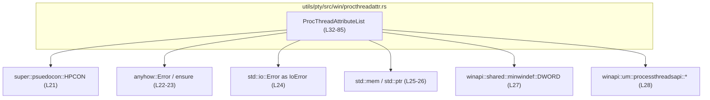
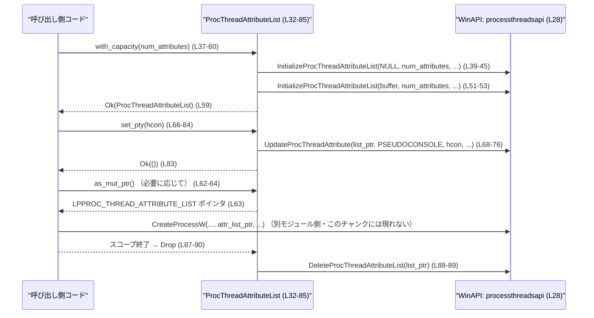

# utils/pty/src/win/procthreadattr.rs コード解説

## 0. ざっくり一言

Windows の `PROC_THREAD_ATTRIBUTE_LIST` を安全な Rust のラッパー構造体として提供し、疑似コンソール用ハンドル（`HPCON`）を子プロセス属性に設定するためのユーティリティです（定数名と引数名からの解釈。根拠: `PROC_THREAD_ATTRIBUTE_PSEUDOCONSOLE`, `HPCON` 利用箇所 `utils/pty/src/win/procthreadattr.rs:L30,L66`）。

---

## 1. このモジュールの役割

### 1.1 概要

- Windows API `InitializeProcThreadAttributeList` / `UpdateProcThreadAttribute` / `DeleteProcThreadAttributeList` をラップし、`PROC_THREAD_ATTRIBUTE_LIST` を Rust 側で管理するための型 `ProcThreadAttributeList` を提供します（`utils/pty/src/win/procthreadattr.rs:L32-34,L37-60,L66-84,L87-90`）。
- 疑似コンソールハンドル `HPCON` を属性リストに設定するメソッド `set_pty` を提供します（`utils/pty/src/win/procthreadattr.rs:L21,L66-84`）。
- Drop 実装により、属性リストの寿命終了時に `DeleteProcThreadAttributeList` を自動で呼び出します（`utils/pty/src/win/procthreadattr.rs:L87-90`）。

### 1.2 アーキテクチャ内での位置づけ

このモジュールは「Windows 側のプロセス属性リスト」を表現する低レベルラッパーで、他モジュール（例えば擬似コンソール管理モジュールやプロセス生成モジュール）から利用される位置づけです。

主要な依存関係を図にすると次のようになります。



※ `super::psuedocon` や実際のプロセス生成コードは、このチャンクには現れません。

### 1.3 設計上のポイント

- **リソース管理のカプセル化**  
  - Windows の `PROC_THREAD_ATTRIBUTE_LIST` を生のポインタではなく `ProcThreadAttributeList` 構造体としてまとめ、Drop で後始末を行う RAII パターンになっています（`utils/pty/src/win/procthreadattr.rs:L32-34,L87-90`）。
- **FFI と安全な API の分離**  
  - 外部に公開されているメソッドはすべて safe Rust で、内部でのみ `unsafe` ブロックを用いて WinAPI を呼び出しています（`with_capacity`, `set_pty`, `drop` それぞれの関数本体; `utils/pty/src/win/procthreadattr.rs:L39-53,L67-77,L88`）。
- **エラー処理の一元化**  
  - WinAPI 呼び出しの戻り値を `anyhow::ensure!` マクロで検証し、失敗時には `anyhow::Error` を返します（`utils/pty/src/win/procthreadattr.rs:L54-58,L78-82`）。
- **所有権と並行性**  
  - 属性リストポインタにアクセスするメソッド `as_mut_ptr` は `&mut self` を要求し、可変な別名参照が発生しないようになっています（`utils/pty/src/win/procthreadattr.rs:L62-64`）。  
  - 構造体内部は `Vec<u8>` だけなので、`Send` / `Sync` は自動導出されますが、可変操作は `&mut self` 経由に限定されます。

---

## 2. 主要な機能一覧

- Windows の `PROC_THREAD_ATTRIBUTE_LIST` を確保して初期化する（`with_capacity`）（`utils/pty/src/win/procthreadattr.rs:L37-60`）。
- 属性リストへの生ポインタを取得する（`as_mut_ptr`）（`utils/pty/src/win/procthreadattr.rs:L62-64`）。
- 疑似コンソールハンドル `HPCON` を属性リストに登録する（`set_pty`）（`utils/pty/src/win/procthreadattr.rs:L66-84`）。
- `PROC_THREAD_ATTRIBUTE_LIST` の破棄を Drop 実装で自動化する（`Drop for ProcThreadAttributeList`）（`utils/pty/src/win/procthreadattr.rs:L87-90`）。

---

## 3. 公開 API と詳細解説

### 3.1 型・定数一覧

| 名前 | 種別 | 役割 / 用途 | 定義位置 |
|------|------|-------------|----------|
| `PROC_THREAD_ATTRIBUTE_PSEUDOCONSOLE` | `const usize` | 疑似コンソール用プロセス属性を表す定数値。`UpdateProcThreadAttribute` 呼び出し時の `Attribute` 引数に使用されます。 | `utils/pty/src/win/procthreadattr.rs:L30` |
| `ProcThreadAttributeList` | `struct` | Windows の `PROC_THREAD_ATTRIBUTE_LIST` を格納するためのバイトバッファ。WinAPI を通じて初期化・更新されます。 | `utils/pty/src/win/procthreadattr.rs:L32-34` |

外部依存の主な型:

| 名前 | 種別 | 役割 / 用途 | 出典 / 位置 |
|------|------|-------------|-------------|
| `HPCON` | 型エイリアスまたは構造体（詳細不明） | 疑似コンソールハンドルと推測されます。`set_pty` の引数として渡され、WinAPI にそのまま渡されます。 | `super::psuedocon::HPCON` の `use`（`utils/pty/src/win/procthreadattr.rs:L21`）。具体的な定義はこのチャンクには現れません。 |
| `DWORD` | 型エイリアス | WinAPI で広く使われる 32bit 整数型。ここでは属性数 `num_attributes` を表現するのに使われます。 | `winapi::shared::minwindef::DWORD`（`utils/pty/src/win/procthreadattr.rs:L27`） |
| `LPPROC_THREAD_ATTRIBUTE_LIST` | ポインタ型 | `PROC_THREAD_ATTRIBUTE_LIST` へのポインタ型。`as_mut_ptr` の戻り値です。 | `winapi::um::processthreadsapi::*` の一部（`utils/pty/src/win/procthreadattr.rs:L28`） |

### 3.2 関数詳細

#### `ProcThreadAttributeList::with_capacity(num_attributes: DWORD) -> Result<Self, Error>`

**概要**

プロセス／スレッド属性の数を指定して、対応する `PROC_THREAD_ATTRIBUTE_LIST` を保持する `ProcThreadAttributeList` を確保・初期化します（`utils/pty/src/win/procthreadattr.rs:L37-60`）。

**引数**

| 引数名 | 型 | 説明 |
|--------|----|------|
| `num_attributes` | `DWORD` | 属性リストに格納する属性の個数。WinAPI の `InitializeProcThreadAttributeList` にそのまま渡されます（`utils/pty/src/win/procthreadattr.rs:L40-43`）。 |

**戻り値**

- `Ok(ProcThreadAttributeList)`  
  - WinAPI の初期化が成功した場合に、内部に適切に初期化された属性リストバッファを持つインスタンスを返します（`utils/pty/src/win/procthreadattr.rs:L51-53,L59`）。
- `Err(anyhow::Error)`  
  - WinAPI 呼び出しが失敗した場合に、`IoError::last_os_error()` を含むエラーメッセージ付きで返します（`utils/pty/src/win/procthreadattr.rs:L54-58`）。

**内部処理の流れ**

1. `bytes_required` を 0 に初期化します（`utils/pty/src/win/procthreadattr.rs:L38`）。
2. `InitializeProcThreadAttributeList` を `lpAttributeList = NULL` で呼び出し、必要なバッファサイズを `bytes_required` に書き込ませます（`utils/pty/src/win/procthreadattr.rs:L39-45`）。戻り値は無視されます。
3. `bytes_required` 分の容量を持つ `Vec<u8>` を確保し（`Vec::with_capacity`）、`set_len(bytes_required)` で長さを設定します（`utils/pty/src/win/procthreadattr.rs:L47-48`）。  
   - この時点でバッファ内容は未初期化ですが、Rust 側では読み出さず WinAPI に渡すだけです。
4. バッファの先頭ポインタを `attr_ptr` として取得します（`utils/pty/src/win/procthreadattr.rs:L50`）。
5. 再度 `InitializeProcThreadAttributeList` を、今度は `attr_ptr` とともに呼び出して実際に属性リストを初期化します（`utils/pty/src/win/procthreadattr.rs:L51-53`）。
6. 戻り値 `res` が 0（失敗）なら `ensure!` により `Err(anyhow::Error)` を返します（`utils/pty/src/win/procthreadattr.rs:L54-58`）。
7. 成功した場合は `Ok(Self { data })` として構造体を返します（`utils/pty/src/win/procthreadattr.rs:L59`）。

**Examples（使用例）**

`num_attributes` 個の属性を格納するリストを作成する例です。ここでは 1 個の属性（疑似コンソール）を想定します。

```rust
use anyhow::Error;                                            // anyhow::Error 型をインポート
use utils::pty::win::procthreadattr::ProcThreadAttributeList; // この構造体をインポート（モジュールパスは例）
use winapi::shared::minwindef::DWORD;                         // DWORD 型

fn create_attr_list() -> Result<ProcThreadAttributeList, Error> {
    let num_attributes: DWORD = 1;                            // 属性は1個だけ設定する想定
    let list = ProcThreadAttributeList::with_capacity(num_attributes)?; // WinAPIで初期化された属性リストを取得
    Ok(list)                                                  // 呼び出し元に返す
}
```

このコードでは、WinAPI が失敗した場合 `with_capacity` から `Err(Error)` が返り、そのまま伝播します。

**Errors / Panics**

- **Errors**
  - 2 回目の `InitializeProcThreadAttributeList(attr_ptr, ...)` が 0 を返した場合、`ensure!(res != 0, ...)` により `Err(anyhow::Error)` を返します（`utils/pty/src/win/procthreadattr.rs:L51-58`）。
  - エラーメッセージには `IoError::last_os_error()` の内容が含まれます。
- **Panics**
  - `Vec::with_capacity(bytes_required)` がメモリ不足の場合などに panic を起こす可能性があります（標準ライブラリの仕様）。このファイル内では特別な対処は行っていません（`utils/pty/src/win/procthreadattr.rs:L47`）。
  - `set_len(bytes_required)` 自体は panic しませんが、不適切な長さを設定すると以降のコードで未定義動作の原因になり得ます。ただしここでは、直後に WinAPI がそのバッファ全体を初期化する前提でのみ使用されています（`utils/pty/src/win/procthreadattr.rs:L48`）。

**Edge cases（エッジケース）**

- `num_attributes = 0`  
  - 最初の `InitializeProcThreadAttributeList` が `bytes_required` をどう扱うかはこのコードからは分かりませんが（OS 依存）、もし `bytes_required` が 0 のままなら、容量 0 の `Vec` が生成されます（`utils/pty/src/win/procthreadattr.rs:L38-48`）。  
  - その場合、2 回目の `InitializeProcThreadAttributeList` が失敗する可能性があり、`Err` が返るだけで UB は発生しません（`utils/pty/src/win/procthreadattr.rs:L51-58`）。
- `num_attributes` が非常に大きい場合  
  - `bytes_required` が大きくなり、`Vec::with_capacity` がメモリ不足で panic する可能性があります（`utils/pty/src/win/procthreadattr.rs:L47`）。
- 最初の `InitializeProcThreadAttributeList(NULL, ...)` が失敗する場合  
  - 戻り値は無視され、`bytes_required` に意味のある値が入らない可能性があります（`utils/pty/src/win/procthreadattr.rs:L39-46`）。  
  - その結果 2 回目の呼び出しも失敗し、`Err` が返されるため、呼び出し側は「初期化失敗」として扱えます。

**使用上の注意点**

- この関数を呼び出した後、`ProcThreadAttributeList` は Drop による解放まで有効と見なされます。WinAPI に渡したポインタを Drop 後も使用すると未定義動作になる可能性があり、これは呼び出し側で避ける必要があります（ポインタの利用は必然的に `unsafe` コードになるため）。
- `num_attributes` は実際に設定する属性数以上を指定する必要があると考えられますが、具体的な上限・要件はこのコードからは読み取れません。

---

#### `ProcThreadAttributeList::as_mut_ptr(&mut self) -> LPPROC_THREAD_ATTRIBUTE_LIST`

**概要**

内部バッファを `LPPROC_THREAD_ATTRIBUTE_LIST`（属性リストへのポインタ）として返します。WinAPI に渡すためのヘルパです（`utils/pty/src/win/procthreadattr.rs:L62-64`）。

**引数**

| 引数名 | 型 | 説明 |
|--------|----|------|
| `&mut self` | `&mut ProcThreadAttributeList` | 内部バッファへの可変アクセスを要求します。 |

**戻り値**

- `LPPROC_THREAD_ATTRIBUTE_LIST`  
  - `PROC_THREAD_ATTRIBUTE_LIST` を表す生ポインタ。`CreateProcessW` 等の WinAPI に渡す用途を想定したものと解釈できます（名前からの推測。ポインタ自体は `self.data` の先頭アドレスです）。

**内部処理の流れ**

1. `self.data` を可変スライスに変換し（`as_mut_slice()`）、その生ポインタを取得します（`as_mut_ptr()`）（`utils/pty/src/win/procthreadattr.rs:L63`）。
2. それを `LPPROC_THREAD_ATTRIBUTE_LIST` 型にキャストして返します（`utils/pty/src/win/procthreadattr.rs:L63`）。

**Examples（使用例）**

典型的には WinAPI に渡す直前に呼び出される形になります。

```rust
use utils::pty::win::procthreadattr::ProcThreadAttributeList; // 構造体のインポート

fn use_attr_list_in_winapi(mut list: ProcThreadAttributeList) {
    let raw_list = list.as_mut_ptr();                         // WinAPI 用のポインタを取得

    // ここで raw_list を FFI 経由で CreateProcessW 等に渡すことを想定
    // （実際の呼び出しはこのチャンクには定義されていません）
}
```

**Errors / Panics**

- `as_mut_ptr` 自体はエラーも panic も発生させません（`utils/pty/src/win/procthreadattr.rs:L62-64`）。
- 戻り値のポインタをどのように使うかは呼び出し側（通常 `unsafe` な FFI コード）の責任です。

**Edge cases**

- `self.data` の長さが 0 の場合でも、`as_mut_slice().as_mut_ptr()` は何らかのポインタを返しますが、そのポインタを WinAPI に渡してよいかは OS の仕様次第であり、このコードだけからは判断できません（`utils/pty/src/win/procthreadattr.rs:L47-48,L63`）。
- Drop 後にこのポインタを使用すると未定義動作となり得ますが、そのような使用は必ず `unsafe` を介するため、呼び出し側が注意すべき点です。

**使用上の注意点**

- 安全な Rust コードからは、このポインタを直接解釈して読み書きすべきではありません。専ら WinAPI に渡すためのハンドルと捉えるのが妥当です。
- 可変参照 `&mut self` を要求するため、同時に複数のスレッドから `as_mut_ptr` を呼ぶことはコンパイル時に防がれます（所有権・借用規則による）。

---

#### `ProcThreadAttributeList::set_pty(&mut self, con: HPCON) -> Result<(), Error>`

**概要**

WinAPI の `UpdateProcThreadAttribute` を用いて、`PROC_THREAD_ATTRIBUTE_PSEUDOCONSOLE` 属性をリストに追加・設定します（`utils/pty/src/win/procthreadattr.rs:L66-84`）。

**引数**

| 引数名 | 型 | 説明 |
|--------|----|------|
| `&mut self` | `&mut ProcThreadAttributeList` | 属性リストを更新するための可変参照です。 |
| `con` | `HPCON` | 疑似コンソールと推測されるハンドル。WinAPI にポインタとして渡されます（`utils/pty/src/win/procthreadattr.rs:L66-73`）。 |

**戻り値**

- `Ok(())`  
  - `UpdateProcThreadAttribute` が成功した場合。
- `Err(anyhow::Error)`  
  - `UpdateProcThreadAttribute` が 0 を返した場合。`IoError::last_os_error()` を含むメッセージ付きで返されます（`utils/pty/src/win/procthreadattr.rs:L78-82`）。

**内部処理の流れ**

1. `self.as_mut_ptr()` を呼び出して属性リストのポインタを取得します（`utils/pty/src/win/procthreadattr.rs:L69`）。
2. `UpdateProcThreadAttribute` を以下のパラメータで `unsafe` に呼び出します（`utils/pty/src/win/procthreadattr.rs:L68-76`）。
   - `lpAttributeList`: 1 で取得したポインタ。
   - `dwFlags`: `0`。
   - `Attribute`: `PROC_THREAD_ATTRIBUTE_PSEUDOCONSOLE`（`utils/pty/src/win/procthreadattr.rs:L71`）。
   - `lpValue`: `con`（`HPCON`）をそのまま引数として渡します（`utils/pty/src/win/procthreadattr.rs:L72`）。
   - `cbSize`: `mem::size_of::<HPCON>()`（`utils/pty/src/win/procthreadattr.rs:L73`）。
   - `lpPreviousValue`, `lpReturnSize`: `NULL`（`ptr::null_mut()`）（`utils/pty/src/win/procthreadattr.rs:L74-75`）。
3. 戻り値 `res` を `ensure!(res != 0, ...)` で検証し、0 の場合は `Err(anyhow::Error)` を返します（`utils/pty/src/win/procthreadattr.rs:L78-82`）。
4. 成功時は `Ok(())` を返します（`utils/pty/src/win/procthreadattr.rs:L83`）。

**Examples（使用例）**

疑似コンソールハンドルを持っている前提で、属性リストに設定する例です。

```rust
use anyhow::Error;                                            // anyhow::Error 型
use utils::pty::win::procthreadattr::ProcThreadAttributeList; // 本ファイルの構造体
use super::psuedocon::HPCON;                                  // HPCON 型（同じ win モジュール配下と仮定）

fn attach_pty_to_attr_list(con: HPCON) -> Result<ProcThreadAttributeList, Error> {
    let mut list = ProcThreadAttributeList::with_capacity(1)?; // 属性1個分のリストを作る
    list.set_pty(con)?;                                       // 疑似コンソール属性を設定
    Ok(list)                                                  // 呼び出し元はこの list を WinAPI に渡して使う
}
```

**Errors / Panics**

- **Errors**
  - `UpdateProcThreadAttribute` が失敗して 0 を返すと `Err(anyhow::Error)` になります（`utils/pty/src/win/procthreadattr.rs:L68-82`）。
  - おそらく `HPCON` が無効な場合や属性リスト状態が不適切な場合などに発生しますが、具体的な条件は WinAPI 側の仕様であり、このコードからは分かりません。
- **Panics**
  - このメソッド内には `panic!` を発生させるコードはありません（`utils/pty/src/win/procthreadattr.rs:L66-84`）。
  - `mem::size_of::<HPCON>()` はコンパイル時定数計算であり panic しません（`utils/pty/src/win/procthreadattr.rs:L73`）。

**Edge cases**

- 未初期化または `with_capacity` の失敗後のインスタンスに対して呼び出される可能性はありません。`ProcThreadAttributeList` は `with_capacity` の `Ok` 結果としてのみ生成されるためです（`utils/pty/src/win/procthreadattr.rs:L59`）。
- `HPCON` が無効な値である場合、`UpdateProcThreadAttribute` がエラーを返し `Err` となる可能性がありますが、ハンドルの正当性はこのコードでは検証していません。

**使用上の注意点**

- `set_pty` は属性リストの状態を変更するため、必ず `with_capacity` で初期化済みのインスタンスに対して呼び出す必要があります（このファイルの外でインスタンスを直接構築する手段はないため、通常は満たされます）。
- 引数の `HPCON` は構造体内には保持されません。WinAPI に渡されるだけなので、`set_pty` 呼び出し後の `HPCON` の寿命管理は呼び出し側に委ねられます（`utils/pty/src/win/procthreadattr.rs:L72-73`）。

---

#### `Drop for ProcThreadAttributeList::drop(&mut self)`

**概要**

`ProcThreadAttributeList` がスコープを抜けたときに、自動的に `DeleteProcThreadAttributeList` を呼び出して属性リストを解放します（`utils/pty/src/win/procthreadattr.rs:L87-90`）。

**引数**

- `&mut self`（暗黙）: Drop 実装のレシーバ。Rust コンパイラが自動的に呼び出します。

**戻り値**

- 戻り値はありません（`()`）。Drop 実装として副作用のみです。

**内部処理の流れ**

1. `self.as_mut_ptr()` を呼び出して属性リストのポインタを取得します（`utils/pty/src/win/procthreadattr.rs:L88-89`）。
2. それを `DeleteProcThreadAttributeList` に渡します（`utils/pty/src/win/procthreadattr.rs:L88-89`）。
3. 戻り値は無視されます。エラーが起きても Rust 側では検知しません（戻り値を代入・チェックするコードがないことから分かります）。

**Examples（使用例）**

明示的に呼び出すことはなく、以下のようにスコープから外れると自動で実行されます。

```rust
fn use_and_drop_attr_list(list: ProcThreadAttributeList) {
    // ここで list をWinAPIに渡して使う（詳細は別モジュール）
}   // ここで list がスコープを抜け、Dropが呼ばれ DeleteProcThreadAttributeList が実行される
```

**Errors / Panics**

- 戻り値を確認していないため、`DeleteProcThreadAttributeList` の失敗は無視されます（`utils/pty/src/win/procthreadattr.rs:L88-90`）。
- `drop` 内には panic を起こすコードはありません。

**Edge cases**

- `with_capacity` が失敗した場合、`ProcThreadAttributeList` 自体が生成されないため、Drop は呼ばれません（`utils/pty/src/win/procthreadattr.rs:L59`）。
- `data` が空の `Vec` であっても `as_mut_ptr()` は何らかのポインタを返しますが、そのポインタを `DeleteProcThreadAttributeList` に渡すことの可否は WinAPI の仕様に依存し、このコードからは分かりません（`utils/pty/src/win/procthreadattr.rs:L47-48,L88-89`）。

**使用上の注意点**

- `ProcThreadAttributeList` を `mem::forget` などで明示的に Drop させないと、`DeleteProcThreadAttributeList` が呼ばれません。通常は RAII パターンに従い、そのような操作は避けるのが安全です。

---

### 3.3 その他の関数

このファイルには、上記以外の補助関数やラッパー関数は存在しません（`with_capacity`, `as_mut_ptr`, `set_pty`, `drop` 以外の `fn` が定義されていないため。根拠: `utils/pty/src/win/procthreadattr.rs` 全体）。

---

## 4. データフロー

代表的なシナリオとして、「疑似コンソール付きの子プロセスを生成するために属性リストを準備し、最後に解放する」ケースを想定したデータフローを示します。

1. 呼び出し側が `ProcThreadAttributeList::with_capacity(1)` を呼び出し、属性リストを初期化します（`utils/pty/src/win/procthreadattr.rs:L37-60`）。
2. 取得したインスタンスに対して `set_pty(hcon)` を呼び出し、疑似コンソール属性を追加します（`utils/pty/src/win/procthreadattr.rs:L66-84`）。
3. 別モジュールから WinAPI の `CreateProcessW` 等を呼び出す際に `as_mut_ptr()` でポインタを取得し、引数として渡します（`utils/pty/src/win/procthreadattr.rs:L62-64`）。
4. `ProcThreadAttributeList` がスコープを抜けると Drop により `DeleteProcThreadAttributeList` が呼び出され、リストが解放されます（`utils/pty/src/win/procthreadattr.rs:L87-90`）。

これを sequence diagram で表します。



---

## 5. 使い方（How to Use）

### 5.1 基本的な使用方法

疑似コンソール `HPCON` をすでに取得済みで、それを子プロセスの属性に設定したいケースの簡略例です。

```rust
use anyhow::Error;                                            // エラー型
use utils::pty::win::procthreadattr::ProcThreadAttributeList; // 本モジュールの型
use utils::pty::win::psuedocon::HPCON;                        // 疑似コンソールハンドル（実際のパスは構成に依存）

fn prepare_pty_attributes(hcon: HPCON) -> Result<ProcThreadAttributeList, Error> {
    // 1. 属性リストを生成（ここでは属性1つ分の容量を確保）
    let mut attrs = ProcThreadAttributeList::with_capacity(1)?;   // L37-60

    // 2. 疑似コンソール属性を設定
    attrs.set_pty(hcon)?;                                         // L66-84

    // 3. 呼び出し元は attrs.as_mut_ptr() を使って WinAPI に渡す
    Ok(attrs)                                                     // Drop が DeleteProcThreadAttributeList を呼ぶ
}
```

上位のプロセス生成コードでは、この `attrs` を適切なタイミングで Drop させることで、属性リストのクリーンアップを自動化できます。

### 5.2 よくある使用パターン

- **複数属性を扱う場合**  
  - 将来的に他の属性も設定したい場合でも、`with_capacity(num_attributes)` の `num_attributes` を増やし、別メソッド（例: `set_XXX`）を追加するだけで拡張できる構造になっています（パターンは `set_pty` と同様。`utils/pty/src/win/procthreadattr.rs:L66-84`）。
- **属性リストの寿命管理**  
  - 通常は「属性を設定 → プロセス生成 API 呼び出し → すぐに Drop」という短いライフタイムで利用されることが想定されます（RAII パターンと Drop 実装からの推測）。

### 5.3 よくある間違い（起こり得る誤用）

このファイルのコードパターンから推測される誤用例と、正しい例です。

```rust
use utils::pty::win::procthreadattr::ProcThreadAttributeList;
use utils::pty::win::psuedocon::HPCON;

// 誤り例（ポインタの寿命を無視した場合）
fn wrong_usage(hcon: HPCON) {
    let raw_ptr = {
        let mut attrs = ProcThreadAttributeList::with_capacity(1).unwrap();
        attrs.set_pty(hcon).unwrap();
        attrs.as_mut_ptr()                    // ← 生ポインタを取り出している
    };                                        // ← ここで attrs が Drop され DeleteProcThreadAttributeList が呼ばれる

    // raw_ptr をここで WinAPI に渡すと、既に解放済みのリストを指している可能性がある
    // → 未定義動作の原因となり得る（このファイルはそれを防げない）
}

// 正しい例（attrs の寿命を呼び出しと揃える）
fn correct_usage(hcon: HPCON) {
    let mut attrs = ProcThreadAttributeList::with_capacity(1).unwrap();
    attrs.set_pty(hcon).unwrap();

    let raw_ptr = attrs.as_mut_ptr();
    // このスコープ内ですぐに WinAPI を呼ぶ
    // unsafe { CreateProcessW(..., raw_ptr, ...) };

}   // ここで attrs が Drop され、属性リストが解放される
```

### 5.4 使用上の注意点（まとめ）

- **寿命管理**
  - `as_mut_ptr` で取得したポインタは、`ProcThreadAttributeList` が生存している間だけ有効です。Drop 後に利用すると未定義動作になり得ます。
- **エラー処理**
  - `with_capacity` と `set_pty` は `anyhow::Error` を返すため、`?` 演算子などで適切に伝播またはハンドリングする必要があります（`utils/pty/src/win/procthreadattr.rs:L37-60,L66-84`）。
- **並行性**
  - `set_pty` や `as_mut_ptr` は `&mut self` を必要とするため、同一インスタンスに対する同時書き込みはコンパイル時に防がれます。  
    ただしインスタンス自体は `Send` / `Sync` になり得るため、複数スレッドで共有する場合は所有権の移動や同期のしくみ（例: `Mutex`）を適切に利用する必要があります。
- **セキュリティ上の観点**
  - 未初期化バッファ（`Vec<u8>` を確保して `set_len` する）が OS に渡されますが、Rust 側ではその内容を読み出していません（`utils/pty/src/win/procthreadattr.rs:L47-48,L51-53`）。  
    情報漏えいが起きるかどうかは WinAPI の実装に依存し、このファイルだけからは判定できません。

---

## 6. 変更の仕方（How to Modify）

### 6.1 新しい機能を追加する場合

例として「別の属性（たとえば環境変数など）を属性リストに追加する」機能を考えます。

1. **新しい属性用の定数を追加**  
   - `PROC_THREAD_ATTRIBUTE_PSEUDOCONSOLE` と同様に、対応する `PROC_THREAD_ATTRIBUTE_XXX` 定数を追加します（`utils/pty/src/win/procthreadattr.rs:L30` のパターン参照）。
2. **新メソッドの追加**  
   - `set_pty` を参考に、新しい `set_xxx` メソッドを `impl ProcThreadAttributeList` に追加します（`utils/pty/src/win/procthreadattr.rs:L66-84`）。  
   - `UpdateProcThreadAttribute` の `Attribute` と `lpValue`、`cbSize` を変更するだけで済む構造になっています。
3. **`with_capacity` の呼び出し側を調整**  
   - 追加する属性数に応じて `num_attributes` を増やす必要があります（`utils/pty/src/win/procthreadattr.rs:L37-43`）。

### 6.2 既存の機能を変更する場合

- **影響範囲の確認**
  - `ProcThreadAttributeList` の利用箇所（`with_capacity`, `set_pty`, `as_mut_ptr` の呼び出し元）を IDE 等で検索し、寿命管理やエラー処理がどうなっているかを確認します。
- **契約（前提条件・返り値の意味）**
  - `with_capacity` は「初期化済みの属性リストを返す／失敗したら `Err`」という契約を持っています（`utils/pty/src/win/procthreadattr.rs:L37-60`）。
  - `set_pty` は「疑似コンソール属性が設定できれば `Ok(())`／失敗したら `Err`」という契約です（`utils/pty/src/win/procthreadattr.rs:L66-84`）。
  - `Drop` は「常に `DeleteProcThreadAttributeList` を呼ぶが、エラーは無視する」という振る舞いです（`utils/pty/src/win/procthreadattr.rs:L87-90`）。ここを変えると、呼び出し側の期待が変わる可能性があります。
- **テスト**
  - このチャンクにはテストコードは含まれていません（`mod tests` や `#[test]` が存在しないことからの事実）。  
    変更時には、WinAPI 呼び出しが成功・失敗するケースをカバーする統合テストを別ファイルで用意するのが望ましいです。

---

## 7. 関連ファイル

このモジュールと密接に関係すると考えられるファイル／モジュールをまとめます。

| パス / モジュール | 役割 / 関係 |
|------------------|------------|
| `super::psuedocon` | `HPCON` 型を定義するモジュールです（`utils/pty/src/win/procthreadattr.rs:L21`）。擬似コンソールの生成・破棄などを担当していると考えられますが、このチャンクには詳細は現れません。 |
| `winapi::um::processthreadsapi` | `InitializeProcThreadAttributeList`, `UpdateProcThreadAttribute`, `DeleteProcThreadAttributeList`, `LPPROC_THREAD_ATTRIBUTE_LIST` などの WinAPI 型・関数を提供します（`utils/pty/src/win/procthreadattr.rs:L28`）。 |
| （不明: プロセス生成モジュール） | `ProcThreadAttributeList::as_mut_ptr()` から得たポインタを `CreateProcessW` 等に渡すコードは、このチャンクには現れません。別モジュールで実装されていると考えられます。 |

以上が、このファイルに現れる情報に基づいた解説です。このチャンクに現れない設計意図や利用側コードについては、追加のソースコードやドキュメントを参照しない限り分かりません。
