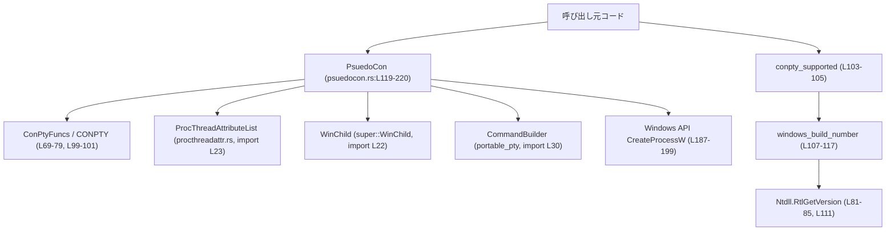
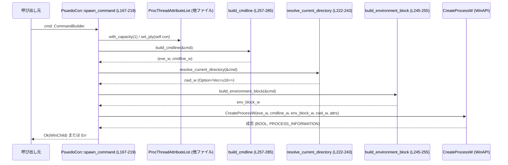

utils/pty/src/win/psuedocon.rs コード解説
====================================

## 0. ざっくり一言

Windows 10 以降の ConPTY API（擬似コンソール）を動的にロードし、  
`CommandBuilder` から組み立てたコマンドを ConPTY 環境下で `CreateProcessW` を用いて起動するためのユーティリティです。

---

## 1. このモジュールの役割

### 1.1 概要

このモジュールは **Windows の pseudo console (ConPTY)** 機能を利用して、  
PTY 互換のコンソールプロセスを作成・管理するためのラッパーを提供します。

- ConPTY API (`CreatePseudoConsole` など) を動的にロードして利用可能か判定する（`conpty_supported`）  
- ConPTY ハンドルをラップする `PsuedoCon` 型と、その生成・リサイズ・子プロセス起動機能を提供する  
- `portable_pty::cmdbuilder::CommandBuilder` から Windows 用のコマンドライン、環境ブロック、カレントディレクトリを構築し `CreateProcessW` に渡す

### 1.2 アーキテクチャ内での位置づけ

このモジュールが依存する主なコンポーネントの関係を示します。



- `PsuedoCon` は ConPTY ハンドルを表す軽量ラッパーで、FFI 経由で `CreatePseudoConsole` などを呼び出します（`CONPTY` 静的変数, psuedocon.rs:L99-101, L137-147）。
- 子プロセスの起動には `ProcThreadAttributeList` を使って ConPTY ハンドルをスレッド属性に設定し（L175-177）、`CreateProcessW` でプロセス生成します（L187-199）。
- プロセスハンドルを `WinChild` にラップして返し、後続のプロセス管理を `WinChild` に委ねます（L213-218）。

### 1.3 設計上のポイント

- **動的ロードによる後方互換性**  
  - ConPTY 関数は `kernel32.dll` またはサイドロードされた `conpty.dll` から動的に解決されます（`load_conpty`, L87-97）。
  - OS ビルド番号で ConPTY 対応の可否を判定するユーティリティ（`conpty_supported`, `windows_build_number`, L103-117）。
- **状態管理**  
  - `PsuedoCon` は `HPCON` ハンドルのみを保持する薄い構造体です（L119-121）。
  - `Drop` 実装で ConPTY を確実に `ClosePseudoConsole` することでリソースリークを防ぎます（L126-130）。
- **スレッド安全性（Send/Sync）**  
  - `PsuedoCon` は `unsafe impl Send` / `Sync` としてマークされ、スレッド跨ぎで共有可能とされています（L123-124）。  
    これは **Windows の ConPTY ハンドルがスレッドセーフである** という前提に依存しており、FFI まわりの設計上の重要なポイントです。
- **エラーハンドリング**  
  - 外向きの API は主に `anyhow::Error` / `anyhow::Result` を返し、`ensure!` / `bail!` で失敗条件を明示しています（例: `PsuedoCon::new`, L148-151; `PsuedoCon::resize`, L157-163; `spawn_command`, L201-211）。
  - Windows API 呼び出し失敗時には `IoError::last_os_error()` を用いて詳細な OS エラーをメッセージに含めます（L202-208）。
- **Windows 固有のコマンドライン構築**  
  - `build_cmdline`, `append_quoted` が Windows の `CreateProcessW` に適した quoting / escaping ルールを実装します（L257-285, L312-355）。
  - 引数に NUL (`\0`) を含めないことを `ensure!` で検査しており（L274-276）、安全性と予測可能な動作を担保しています。
- **環境とカレントディレクトリの解決**  
  - `resolve_current_directory` は `CommandBuilder` の `cwd` か `USERPROFILE` を使って開始ディレクトリを Wide 文字列として組み立てます（L222-243）。
  - `build_environment_block` は `CreateProcessW` 形式の 2 重 NUL 終端環境ブロックを構築します（L245-255）。

---

## 2. 主要な機能一覧

- ConPTY サポート確認: `conpty_supported` で Windows ビルド番号から ConPTY が利用可能か判定する。
- ConPTY ハンドル管理: `PsuedoCon` 構造体で ConPTY を生成・破棄・リサイズする。
- 擬似コンソールでのプロセス起動: `PsuedoCon::spawn_command` で `CommandBuilder` に基づき子プロセスを ConPTY 上で起動し、`WinChild` として返す。
- カレントディレクトリ解決: `resolve_current_directory` で `cwd` / `USERPROFILE` から Wide 文字列パスを生成する。
- 環境ブロック構築: `build_environment_block` で `CreateProcessW` に渡す環境ブロックを作る。
- コマンドライン生成: `build_cmdline` / `search_path` / `append_quoted` で Windows 仕様のコマンドライン文字列を生成する。

### 2.1 コンポーネント一覧（関数・型インベントリ）

| 名前 | 種別 | 公開 | 役割 / 説明 | 定義位置 |
|------|------|------|-------------|----------|
| `HPCON` | 型エイリアス (`HANDLE`) | 公開 | Windows ConPTY ハンドル型のエイリアス | `psuedocon.rs:L59-59` |
| `PSEUDOCONSOLE_RESIZE_QUIRK` | 定数 (`DWORD`) | 公開 | `CreatePseudoConsole` の flags に渡すためのフラグ（リサイズ互換用） | `psuedocon.rs:L61-61` |
| `PSEUDOCONSOLE_PASSTHROUGH_MODE` | 定数 (`DWORD`) | 公開 | ConPTY のパススルーモード用フラグ（未使用、将来用） | `psuedocon.rs:L62-63` |
| `MIN_CONPTY_BUILD` | 定数 (`u32`) | 非公開 | ConPTY をサポートする最小 Windows ビルド番号 | `psuedocon.rs:L65-67` |
| `ConPtyFuncs` | マクロ生成型 | 非公開 | `CreatePseudoConsole` など ConPTY 関数群を動的ロードするためのハンドル | `psuedocon.rs:L69-79` |
| `Ntdll` | マクロ生成型 | 非公開 | `RtlGetVersion` を動的ロードするためのハンドル | `psuedocon.rs:L81-85` |
| `load_conpty` | 関数 | 非公開 | `kernel32.dll` / `conpty.dll` から ConPTY 関数群をロードする | `psuedocon.rs:L87-97` |
| `CONPTY` | `lazy_static` 変数 | 非公開 | ロード済み ConPTY 関数群のシングルトンインスタンス | `psuedocon.rs:L99-101` |
| `conpty_supported` | 関数 | 公開 | OS ビルド番号から ConPTY が利用可能か判定する | `psuedocon.rs:L103-105` |
| `windows_build_number` | 関数 | 非公開 | `RtlGetVersion` を通じて Windows ビルド番号を取得する | `psuedocon.rs:L107-117` |
| `PsuedoCon` | 構造体 | 公開 | ConPTY ハンドル `HPCON` の所有と操作を行うラッパー | `psuedocon.rs:L119-121` |
| `impl Send/Sync for PsuedoCon` | `unsafe impl` | - | `PsuedoCon` をスレッド間で共有可能にする | `psuedocon.rs:L123-124` |
| `impl Drop for PsuedoCon` | Drop 実装 | - | 破棄時に `ClosePseudoConsole` を呼び出す | `psuedocon.rs:L126-130` |
| `PsuedoCon::raw_handle` | メソッド | 公開 | 内部の `HPCON` 生ハンドルを取得する | `psuedocon.rs:L132-135` |
| `PsuedoCon::new` | 関数（関連関数） | 公開 | `CreatePseudoConsole` を呼び出して新しい ConPTY を生成する | `psuedocon.rs:L137-153` |
| `PsuedoCon::resize` | メソッド | 公開 | 既存 ConPTY の画面サイズを変更する | `psuedocon.rs:L155-165` |
| `PsuedoCon::spawn_command` | メソッド | 公開 | ConPTY 上でコマンドを起動し `WinChild` を返す | `psuedocon.rs:L167-219` |
| `resolve_current_directory` | 関数 | 非公開 | `CommandBuilder` から開始ディレクトリを決定し Wide 文字ベクタを作る | `psuedocon.rs:L222-243` |
| `build_environment_block` | 関数 | 非公開 | Windows 用環境ブロック（2 重 NUL 終端）を生成する | `psuedocon.rs:L245-255` |
| `build_cmdline` | 関数 | 非公開 | 実行ファイルパスとコマンドライン Wide 文字列を生成する | `psuedocon.rs:L257-285` |
| `search_path` | 関数 | 非公開 | `PATH` / `PATHEXT` を使って実行ファイルのフルパスを解決する | `psuedocon.rs:L288-309` |
| `append_quoted` | 関数 | 非公開 | Windows 仕様に沿ってコマンドライン引数を引用符付きでエスケープして追加する | `psuedocon.rs:L312-355` |
| `tests::windows_build_number_returns_value` | テスト関数 | 非公開 | CI 環境でビルド番号の取得としきい値比較を行うテスト | `psuedocon.rs:L362-367` |

---

## 3. 公開 API と詳細解説

### 3.1 型一覧（構造体・エイリアスなど）

| 名前 | 種別 | 役割 / 用途 | 定義位置 |
|------|------|-------------|----------|
| `HPCON` | 型エイリアス (`HANDLE`) | Windows ConPTY のハンドル型を表す。WinAPI の `HPCON` 相当であり、ConPTY インスタンスを識別するのに使います。 | `psuedocon.rs:L59-59` |
| `PsuedoCon` | 構造体 | 1 つの ConPTY インスタンスを表すラッパー。内部に `HPCON` を保持し、生成・リサイズ・子プロセス起動を行います。`Drop` で ConPTY をクローズします。 | `psuedocon.rs:L119-121` |

---

### 3.2 関数詳細（主要 7 件）

#### `conpty_supported() -> bool`

**概要**

- 現在の Windows 環境が ConPTY をサポートしているかどうかを判定します（`psuedocon.rs:L103-105`）。
- ビルド番号が `MIN_CONPTY_BUILD` 以上であれば `true` を返します。

**引数**

- なし

**戻り値**

- `bool`  
  - `true`: ConPTY が利用可能なビルド番号（`>= 17763`）  
  - `false`: ビルド番号取得に失敗した場合、またはビルド番号がしきい値未満

**内部処理の流れ**

1. `windows_build_number()` を呼び出して `Option<u32>` を取得（L103）。
2. `Some(build)` かつ `build >= MIN_CONPTY_BUILD` なら `true`、それ以外は `false` を返す（L103-105）。

**Examples（使用例）**

```rust
// ConPTY を利用する前に対応 OS か確認する例
if !conpty_supported() {
    // ここで従来のコンソール実装にフォールバックするなどの処理を行う
    eprintln!("ConPTY is not supported on this system");
    // ...
}
```

**Errors / Panics**

- エラー型は返さず、内部で `windows_build_number()` が失敗した場合は `false` を返します。
- panic しうるコードは含まれていません。

**Edge cases（エッジケース）**

- `RtlGetVersion` が失敗した場合: `windows_build_number()` が `None` を返し、その結果 `conpty_supported()` は `false` を返します（L107-117, L103-105）。
- 非 Windows 環境での動作はこのファイルからは不明ですが、WinAPI への依存から Windows 専用と想定できます（推測であり、コードからはクロスコンパイル条件は不明）。

**使用上の注意点**

- ConPTY を前提とした処理を行う前に、この関数でサポート可否を確認することが前提条件となります。
- 実際に ConPTY 関数がロードできるかどうかは `load_conpty` に依存していますが、`conpty_supported` はビルド番号のみを見ています（`kernel32.dll` が存在しないなどの極端な状況は考慮していません）。

---

#### `PsuedoCon::new(size: COORD, input: FileDescriptor, output: FileDescriptor) -> Result<PsuedoCon, Error>`

**概要**

- 指定したサイズと I/O ハンドルで新しい ConPTY インスタンスを作成します（L137-153）。
- 成功すると、その `HPCON` を保持する `PsuedoCon` を返します。

**引数**

| 引数名 | 型 | 説明 |
|--------|----|------|
| `size` | `COORD` | コンソールの行列サイズ。`X` が列数、`Y` が行数（WinAPI の `COORD`）。 |
| `input` | `FileDescriptor` | ConPTY の入力用ハンドル（通常はパイプの一端など）。`as_raw_handle` で Windows ハンドルに変換されます（L142）。 |
| `output` | `FileDescriptor` | ConPTY の出力用ハンドル（L143）。 |

**戻り値**

- `Result<PsuedoCon, anyhow::Error>`  
  - `Ok(PsuedoCon { con })`: `CreatePseudoConsole` が成功した場合（L152-153）。  
  - `Err(Error)`: HRESULT が `S_OK` 以外の場合に `ensure!` によりエラーを返します（L148-151）。

**内部処理の流れ**

1. `con` を `INVALID_HANDLE_VALUE` で初期化（L138）。
2. `CONPTY.CreatePseudoConsole` を `unsafe` ブロックで呼び出し、`size`, `input` / `output` の raw ハンドル、フラグ `PSEUDOCONSOLE_RESIZE_QUIRK` を渡す（L139-146）。
3. 戻り値 `result` が `S_OK` であることを `ensure!` でチェック（L148-151）。
4. 成功時は `PsuedoCon { con }` を返す（L152-153）。

**Examples（使用例）**

```rust
// 前提: すでに ConPTY がサポートされており、
//       入出力用の FileDescriptor (pipe やソケットなど) が用意されているとする。

use winapi::um::wincon::COORD;

// 仮のサイズ。80x24 のコンソールを作成する。
let size = COORD { X: 80, Y: 24 };

// `input_fd`, `output_fd` は他のモジュールで作成済みの FileDescriptor とする。
// let input_fd: FileDescriptor = ...;
// let output_fd: FileDescriptor = ...;

let pty = PsuedoCon::new(size, input_fd, output_fd)?;
// ここで `pty` を使って子プロセスを起動できるようになる
```

**Errors / Panics**

- `CreatePseudoConsole` が `S_OK` を返さない場合、`anyhow::ensure!` により `Err(Error)` が返ります（L148-151）。
- `CONPTY` そのものが正しくロードされていることが前提であり、`load_conpty` 内の `.expect` が失敗するとプロセスが panic になります（`load_conpty`, L87-90）。

**Edge cases（エッジケース）**

- `size` が不正（0 など）の場合の挙動は `CreatePseudoConsole` に依存し、このコードからは明示されていません。
- `input` / `output` の raw ハンドルが無効な場合、`CreatePseudoConsole` が失敗し、`Err` が返されます（L139-147, L148-151）。
- `PSEUDOCONSOLE_RESIZE_QUIRK` は常に指定されており、このフラグの意味や必要性は外部の ConPTY ドキュメントに依存します。

**使用上の注意点**

- `FileDescriptor` の所有権: `as_raw_handle()` はハンドルの所有権を移動しない参照であり、ConPTY と呼び出し側がハンドルを共有する形になります。ハンドルのクローズタイミングには注意が必要です。
- `PsuedoCon` は Drop 時に `ClosePseudoConsole` のみを呼びます（L126-130）。`input` / `output` ハンドルは呼び出し側で適切に管理する必要があります。

---

#### `PsuedoCon::resize(&self, size: COORD) -> Result<(), Error>`

**概要**

- 既存の ConPTY インスタンスの画面サイズを変更します（L155-165）。

**引数**

| 引数名 | 型 | 説明 |
|--------|----|------|
| `size` | `COORD` | 新しいコンソールサイズ。 |

**戻り値**

- `Result<(), anyhow::Error>`  
  - `Ok(())`: `ResizePseudoConsole` が `S_OK` を返した場合。  
  - `Err(Error)`: それ以外の HRESULT の場合。

**内部処理の流れ**

1. `CONPTY.ResizePseudoConsole(self.con, size)` を `unsafe` ブロックで呼び出す（L155-156）。
2. 戻り値 `result` が `S_OK` であることを `ensure!` でチェック（L157-163）。
3. 成功時は `Ok(())` を返す（L164-165）。

**Examples（使用例）**

```rust
// すでに `pty: PsuedoCon` があるとする
let new_size = COORD { X: 120, Y: 30 };
pty.resize(new_size)?;
```

**Errors / Panics**

- `ResizePseudoConsole` が `S_OK` 以外を返した場合、`ensure!` により `Err(Error)` が返ります（L157-163）。
- panic を発生させるコードはこのメソッド内にはありません。

**Edge cases（エッジケース）**

- 非常に小さいサイズ（例: 0x0）や異常値を渡した場合の挙動は ConPTY 実装依存であり、このコードからは分かりません。
- `self.con` が既に閉じられている／無効になっている場合の挙動は WinAPI 依存です。

**使用上の注意点**

- 画面リサイズは頻繁に発生しうるため、エラー時のリトライやフォールバック方針を呼び出し側で決める必要があります。
- 呼び出し自体は軽量ですが、ConPTY 内部ではバッファ再配置などが行われる可能性があります。

---

#### `PsuedoCon::spawn_command(&self, cmd: CommandBuilder) -> anyhow::Result<WinChild>`

**概要**

- `CommandBuilder` で構成されたコマンドを ConPTY 環境下で `CreateProcessW` を使って起動します（L167-219）。
- 起動したプロセスをラップする `WinChild` を返します。

**引数**

| 引数名 | 型 | 説明 |
|--------|----|------|
| `cmd` | `CommandBuilder` | 実行ファイル、引数、環境変数、カレントディレクトリなどを含むコマンド設定。 |

**戻り値**

- `anyhow::Result<WinChild>`  
  - `Ok(WinChild { proc })`: プロセス作成が成功し、`PROCESS_INFORMATION.hProcess` が `OwnedHandle` にラップされた場合（L213-218）。
  - `Err(Error)`: プロセス作成失敗、属性設定失敗、コマンドライン構築失敗などでエラー。

**内部処理の流れ**

1. `STARTUPINFOEXW` をゼロ初期化し、サイズ・フラグ・標準ハンドルを設定（L167-173）。
2. `ProcThreadAttributeList::with_capacity(1)` で属性リストを作り、`attrs.set_pty(self.con)` で ConPTY ハンドルを関連付け（L175-177）。`si.lpAttributeList` にポインタを設定。
3. `PROCESS_INFORMATION` をゼロ初期化（L179）。
4. `build_cmdline(&cmd)` で実行ファイルパス（`exe`）とコマンドライン文字列（`cmdline`）を生成（L181-182）。
5. `resolve_current_directory(&cmd)` で開始ディレクトリを Wide 文字列として準備（L184）。
6. `build_environment_block(&cmd)` で環境ブロックを生成（L185）。
7. `CreateProcessW` を `EXTENDED_STARTUPINFO_PRESENT | CREATE_UNICODE_ENVIRONMENT` フラグ付きで呼び出し（L187-199）。
   - `lpAttributeList` 経由で ConPTY が有効になる。
   - `lpEnvironment` に `env_block`、`lpCurrentDirectory` に `cwd` を渡す。
8. `CreateProcessW` が 0 を返した場合はエラー:
   - `IoError::last_os_error()` で詳細エラーを取得（L202）。
   - `cmd_os`（Wide から `OsString` にしたコマンドライン）と `cwd` を含むメッセージを作成・ログに出力し（L203-207, L209）、`bail!` で `Err` を返す（L210-211）。
9. 成功時:
   - `PROCESS_INFORMATION.hThread` を `OwnedHandle` に変換し、ローカル変数 `_main_thread` に保持（L213）。  
     （未使用だが Drop によるクローズが行われる。）
   - `hProcess` を `OwnedHandle` に変換し、`WinChild { proc: Mutex::new(proc) }` としてラップして `Ok` を返す（L214-218）。

**Examples（使用例）**

```rust
use portable_pty::cmdbuilder::CommandBuilder;

// 仮に PsuedoCon インスタンスが `pty` として存在するものとする。
// let pty: PsuedoCon = ...;

// "cmd.exe /C dir" を実行する CommandBuilder を構築
let mut cmd = CommandBuilder::new("cmd.exe");
cmd.arg("/C");
cmd.arg("dir");

// 必要に応じて環境変数や cwd を設定
cmd.env("MY_VAR", "123");
// cmd.cwd("C:\\path\\to\\start");

let child: WinChild = pty.spawn_command(cmd)?;
// この時点で子プロセスは ConPTY 上で実行中
```

**Errors / Panics**

- `ProcThreadAttributeList::with_capacity` / `attrs.set_pty` が失敗すると `Err` を返します（L175-177）。
- `build_cmdline` 内の `anyhow::bail!`（プログラム名が無い場合など）により `Err` が返る可能性があります（L264-266）。
- `CreateProcessW` が 0（失敗）を返した場合、`bail!` により `Err` を返します（L201-211）。
- panic を直接発生させるコードはこのメソッド内にはありません。

**Edge cases（エッジケース）**

- `cmd` にプログラム名が設定されていない場合: `build_cmdline` 内で `"missing program name"` エラーとなり、`spawn_command` はエラー伝播します（L263-266, L181）。
- 引数に NUL 文字を含む場合: `build_cmdline` の `ensure!` により `"invalid encoding for command line argument ..."` エラーとなります（L274-276）。
- `cwd` が設定されていない場合: `resolve_current_directory` は `None` を返し、`CreateProcessW` 呼び出し時に `lpCurrentDirectory` は `NULL` になります（L184, L196-197）。

**使用上の注意点**

- `CommandBuilder` の設定が Windows 仕様に合うこと（パス区切りなど）は呼び出し側の責任です。
- 引数にバイナリデータや NUL を含めることはできません（L274-276）。
- `WinChild` は `proc: Mutex<OwnedHandle>` を持つため（L217-218）、プロセスハンドルへのアクセスはロックを通じて行われます。並行アクセス時のロック獲得順などには注意が必要です（`WinChild` の実装はこのチャンクには現れません）。

---

#### `build_cmdline(cmd: &CommandBuilder) -> anyhow::Result<(Vec<u16>, Vec<u16>)>`

**概要**

- Windows の `CreateProcessW` 用に、実行ファイルパス（`exe`）とコマンドライン文字列（`cmdline`）を Wide 文字列で生成します（L257-285）。
- `cmd` の設定（デフォルトプログラムかどうか、`PATH`/`PATHEXT`）に基づき実行ファイルを解決します。

**引数**

| 引数名 | 型 | 説明 |
|--------|----|------|
| `cmd` | `&CommandBuilder` | 実行ファイル名・引数・環境変数を含むビルダー。 |

**戻り値**

- `anyhow::Result<(Vec<u16>, Vec<u16>)>`  
  - `Ok((exe, cmdline))`: `exe` は NUL 終端付き Wide 文字列の実行ファイルパス、`cmdline` は NUL 終端付き Wide コマンドライン文字列。  
  - `Err(Error)`: プログラム名が無い場合や、引数に NUL が含まれている場合など。

**内部処理の流れ**

1. 実行ファイル `exe_os` を決定（L258-268）:
   - `cmd.is_default_prog()` が `true` なら `ComSpec` 環境変数（なければ `"cmd.exe"`）を用いる（L258-262）。
   - それ以外の場合は `cmd.get_argv()` の先頭要素（プログラム名）を取り出し、`search_path(cmd, first)` で `PATH`/`PATHEXT` を使って解決する（L263-268）。
   - `argv` の先頭が無い場合は `anyhow::bail!("missing program name")`（L263-266）。
2. コマンドライン文字列 `cmdline` を作成（L270-280）:
   - まず `append_quoted(&exe_os, &mut cmdline)` で実行ファイルを適切に quoting して追加（L270-271）。
   - その後、残りの引数を `cmd.get_argv().iter().skip(1)` で走査し、スペースとともに追記（L272-279）。
   - 各引数ごとに `ensure!(!arg.encode_wide().any(|c| c == 0))` で NUL 文字を含まないことを確認（L274-276）。
   - 最後に NUL 終端の `0` を追加（L280）。
3. `exe_os` を Wide 文字列 `exe` にエンコードし、NUL 終端を追加（L282-283）。
4. `(exe, cmdline)` を返す（L285）。

**Examples（使用例）**

```rust
// CommandBuilder の内容から Wide 文字列を生成する例
let mut cmd = CommandBuilder::new("ping");
cmd.arg("127.0.0.1");

let (exe_w, cmdline_w) = build_cmdline(&cmd)?;
// exe_w / cmdline_w は CreateProcessW にそのまま渡せる形式
```

**Errors / Panics**

- プログラム名が指定されていない場合: `anyhow::bail!("missing program name")` でエラー（L263-266）。
- いずれかの引数に NUL 文字が含まれている場合: `ensure!` により `"invalid encoding for command line argument ..."` エラー（L274-276）。
- panic を起こすコードは含まれていません。

**Edge cases（エッジケース）**

- `is_default_prog()` の場合、`ComSpec` が未設定でも `"cmd.exe"` にフォールバックします（L258-262）。
- `PATH` や `PATHEXT` が設定されていない場合、`search_path` はそのまま `exe` を返し、パス検索は行われません（L288-309）。
- 引数が 1 つ（プログラム名のみ）の場合、`cmdline` には `exe_os` のみが引用符付き / なしで入ります。

**使用上の注意点**

- Windows の `CreateProcessW` は「`lpApplicationName` と `lpCommandLine` の関係」が複雑なため、この関数で生成した `exe` / `cmdline` の組をセットで利用することが重要です（L188-190）。
- `CommandBuilder` の `argv` を直接自前で変換すると quoting 規則を誤る可能性があるため、この関数の利用が前提とされています。

---

#### `search_path(cmd: &CommandBuilder, exe: &OsStr) -> OsString`

**概要**

- `PATH` / `PATHEXT` 環境変数を使って、実行ファイル名からフルパスを解決します（L288-309）。
- 見つからなければ元の `exe` をそのまま返します。

**引数**

| 引数名 | 型 | 説明 |
|--------|----|------|
| `cmd` | `&CommandBuilder` | 環境変数（`PATH` / `PATHEXT`）を提供するビルダー。 |
| `exe` | `&OsStr` | 探索対象の実行ファイル名。 |

**戻り値**

- `OsString`  
  - 存在する実行ファイルのフルパスまたは、見つからなかった場合は元の `exe` のコピー（L309）。

**内部処理の流れ**

1. `cmd.get_env("PATH")` で PATH があるか確認（L289）。
2. あれば `cmd.get_env("PATHEXT").unwrap_or(".EXE")` で拡張子リストを取得（L290）。
3. `env::split_paths(path)` で PATH を分解し、各ディレクトリに対して:
   - `path.join(exe)` を作り、存在すればそれを返す（L291-295）。
   - 存在しなければ、`extensions` を `env::split_paths` で分解し、各拡張子を付けた候補をチェック（L297-305）。
4. どの候補も存在しなければ、`exe.to_os_string()` を返す（L309）。

**Examples（使用例）**

```rust
let cmd = CommandBuilder::new("myprog");
let exe = OsStr::new("myprog");
let resolved = search_path(&cmd, exe);
// resolved は PATH 上の myprog(.exe 等) に解決されるか、見つからなければ "myprog" のまま
```

**Errors / Panics**

- ファイル存在チェック (`candidate.exists()`) などは失敗時にもエラーは返さず、単に `false` となるため、この関数はエラーを返しません（L293, L302）。
- `extensions` の処理で `ext.to_str().unwrap_or("")` を使っており、無効な UTF-8 を含む場合は空文字列となります（L298）。panic ではありません。
- `env::split_paths(extensions)` は `PATHEXT` の形式が PATH と同じであることを前提としていますが、形式が異なる場合の挙動はコードからは不明です。

**Edge cases（エッジケース）**

- `PATH` 未設定: 何も探索せず `exe` をそのまま返します（L289-307, L309）。
- `PATHEXT` 未設定: `.EXE` のみを拡張子として使用します（L290）。
- ファイルシステムアクセスエラー: `exists()` が単に `false` になるため、誤って「存在しない」と判断される可能性がありますが、エラーは表面化しません。

**使用上の注意点**

- 実行ファイルの探索は I/O を伴うため、多数のプロセスを頻繁に起動する場面では PATH の長さに応じてオーバーヘッドが増えます。
- 実行ファイルの解決ロジックを変更したい場合は、この関数を中心に検討することになります。

---

#### `append_quoted(arg: &OsStr, cmdline: &mut Vec<u16>)`

**概要**

- Windows のコマンドライン解析規則に合わせて、引数 `arg` を引用符付きで `cmdline` に追加します（L312-355）。
- スペースやタブ、改行、二重引用符などを含む場合に適切なエスケープ処理を行います。

**引数**

| 引数名 | 型 | 説明 |
|--------|----|------|
| `arg` | `&OsStr` | 追加する 1 つの引数。 |
| `cmdline` | `&mut Vec<u16>` | Wide 文字列で構成されるコマンドラインバッファ。 |

**戻り値**

- なし（結果は `cmdline` に書き込まれます）。

**内部処理の流れ**

1. 引数が空でなく、空白・タブ・改行・垂直タブ・二重引用符を含まない場合は、そのまま `encode_wide()` した結果を `cmdline` に追加して終了（L312-323）。
2. 上記条件を満たさない場合:
   - 先頭に `"` を追加（L325）。
   - `arg.encode_wide().collect()` で Wide ベクタを得て、インデックス `i` で走査（L327-329）。
   - バックスラッシュが連続する部分をカウント（`num_backslashes`）（L330-334）。
   - 次の文字に応じて処理を分岐（L336-351）:
     - 文字終端 (`i == arg.len()`): バックスラッシュの数を 2 倍にして追加（L336-340）。
     - 次の文字が `"` の場合: バックスラッシュを 2 * `num_backslashes` + 1 回追加し、その後 `"` を追加（L341-346）。
     - その他の文字: バックスラッシュをそのまま追加し、続けて文字を追加（L347-351）。
   - ループ終了後に閉じる `"` を追加（L354-354）。

**Examples（使用例）**

```rust
use std::ffi::OsStr;

let mut buf: Vec<u16> = Vec::new();
append_quoted(OsStr::new(r#"C:\Program Files\My App\app.exe"#), &mut buf);
// buf には適切に引用符とエスケープが施された Wide 文字列が入る
```

**Errors / Panics**

- エラー型や `Result` は返しません。
- `arg.encode_wide()` によるパニックは通常は発生しません（標準的な `OsStr` 想定）。

**Edge cases（エッジケース）**

- 空文字列: 条件分岐により必ず `"` で囲まれます（L312-323, L325-355）。
- バックスラッシュと二重引用符が絡むケース:  
  Windows の仕様に従い、末尾のバックスラッシュや `\"` の組み合わせに対して適切な数のバックスラッシュを挿入します（L330-351）。
- 改行やタブを含む引数: 引用符で囲まれ、内部は上記ルールでエスケープされます。

**使用上の注意点**

- Windows のコマンドライン解析仕様に依存するエスケープロジックのため、Unix 系シェルに渡すコマンドラインには適しません。
- 直接使用するより、通常は `build_cmdline` 経由で利用されます。

---

#### `resolve_current_directory(cmd: &CommandBuilder) -> Option<Vec<u16>>`

**概要**

- `CommandBuilder` に設定された `cwd` または `USERPROFILE` 環境変数から、開始ディレクトリを決定し、`CreateProcessW` 用に Wide 文字ベクタ（NUL 終端）を返します（L222-243）。

**引数**

| 引数名 | 型 | 説明 |
|--------|----|------|
| `cmd` | `&CommandBuilder` | カレントディレクトリ (`cwd`) と環境変数を保持するビルダー。 |

**戻り値**

- `Option<Vec<u16>>`  
  - `Some(wide_path)`: NUL 終端 Wide 文字列のディレクトリパス。  
  - `None`: `cwd` も `USERPROFILE` も条件を満たさない場合。

**内部処理の流れ**

1. `cmd.get_env("USERPROFILE")` から `home` 候補を取得し、存在するディレクトリのみ採用（L223-225）。
2. `cmd.get_cwd()` から `cwd` を取得し、存在するディレクトリのみ採用（L226-228）。
3. `cwd.or(home)` により `cwd` 優先でディレクトリを選択し、なければ `None`（L229）。
4. `Path::new(&dir).is_relative()` で相対パスかどうか判定（L232）。
   - 相対パスの場合: `env::current_dir()` と結合して絶対パスに変換（L233-235）。
   - 失敗時は `dir` をそのまま Wide 文字列に変換（L235-237）。
   - 絶対パスの場合: `dir.encode_wide()` をそのまま使用（L239-240）。
5. 最後に NUL 終端の `0` を追加し、`Some(wide)` を返す（L241-242）。

**Examples（使用例）**

```rust
let mut cmd = CommandBuilder::new("cmd.exe");
cmd.cwd(r"subdir");

if let Some(cwd_w) = resolve_current_directory(&cmd) {
    // CreateProcessW の lpCurrentDirectory に渡せる Wide 文字列
}
```

**Errors / Panics**

- エラー型は返さず、ディレクトリが存在しないなどの条件では `None` を返します（L229）。
- `env::current_dir()` が失敗した場合もエラーを返さず、単に `dir` を用いる動作になります（L233-237）。

**Edge cases（エッジケース）**

- `cwd` が存在しないパス: 無視され `USERPROFILE` にフォールバック、両方無効なら `None`（L223-229）。
- 相対パスかつ `current_dir` が取得できない場合: その相対パスをそのまま使用します（L233-237）。
- 文字列に NUL を含むかどうかのチェックは行っていません。

**使用上の注意点**

- `CreateProcessW` は `lpCurrentDirectory` に渡されたパスが無効な場合、プロセス作成に失敗する可能性があります。この関数は「存在チェック」を行っているため、その点で呼び出し側の負担を軽減しています。
- `cwd` と `USERPROFILE` のどちらを使うかの優先順位は `cwd` が優先です（L229）。

---

### 3.3 その他の関数

| 関数名 | 役割（1 行） | 定義位置 |
|--------|--------------|----------|
| `load_conpty()` | `kernel32.dll` / `conpty.dll` から ConPTY 関数を動的ロードし、`ConPtyFuncs` を返す。サイドロードされた `conpty.dll` が優先。 | `psuedocon.rs:L87-97` |
| `windows_build_number()` | `Ntdll.RtlGetVersion` を通じて OS のビルド番号を取得し、`STATUS_SUCCESS` なら `Some(build)` を返す。 | `psuedocon.rs:L107-117` |
| `build_environment_block(cmd)` | `cmd.iter_full_env_as_str()` から得た環境変数を `KEY=VALUE\0...\0\0` 形式の Wide 文字ブロックに変換する。 | `psuedocon.rs:L245-255` |

---

## 4. データフロー

### 4.1 代表的なシナリオ: ConPTY 上でコマンドを起動する

`PsuedoCon::spawn_command` を起点にしたデータフローです。



要点:

- `CommandBuilder` が保持する **引数・環境・カレントディレクトリ情報** が、それぞれ `build_cmdline`, `build_environment_block`, `resolve_current_directory` を通じて Windows API 互換の形式（Wide 文字列）に変換されます。
- ConPTY ハンドルは `ProcThreadAttributeList::set_pty` 経由でプロセスのスレッド属性に渡され、`EXTENDED_STARTUPINFO_PRESENT` フラグを使って `CreateProcessW` に有効化されます（L175-177, L194）。
- プロセス作成結果は `PROCESS_INFORMATION` 経由で受け取られ、`WinChild` の内部に `OwnedHandle` として格納されます（L179, L213-218）。

---

## 5. 使い方（How to Use）

### 5.1 基本的な使用方法

ConPTY がサポートされている環境で、`PsuedoCon` を用いてコマンドを起動する最小限のフロー例です。

```rust
use portable_pty::cmdbuilder::CommandBuilder;
use winapi::um::wincon::COORD;
// use filedescriptor::FileDescriptor;
// use crate 内の psuedocon モジュールから PsuedoCon, conpty_supported を use する。

// 1. ConPTY 対応を確認
if !conpty_supported() {
    // フォールバック処理など
    eprintln!("ConPTY not supported");
    return;
}

// 2. ConPTY 入出力のための FileDescriptor を用意する
// ここでは詳細は省略し、適切に作られているものとする。
// let input_fd: FileDescriptor = ...;
// let output_fd: FileDescriptor = ...;

// 3. PsuedoCon を生成
let size = COORD { X: 80, Y: 24 };
let pty = PsuedoCon::new(size, input_fd, output_fd)?;

// 4. 実行したいコマンドを CommandBuilder で構築
let mut cmd = CommandBuilder::new("cmd.exe");
cmd.arg("/C");
cmd.arg("dir");

// 5. ConPTY 上でプロセスを起動
let child = pty.spawn_command(cmd)?;

// 6. child を通じてプロセス状態を管理（詳細は WinChild の実装次第）
```

### 5.2 よくある使用パターン

1. **デフォルトシェルを起動する**

```rust
let mut cmd = CommandBuilder::default(); // is_default_prog() が true になるようなビルダー想定
// ComSpec (未設定なら cmd.exe) が自動的に選択される
let child = pty.spawn_command(cmd)?;
```

1. **特定のディレクトリでコマンドを起動する**

```rust
let mut cmd = CommandBuilder::new("powershell.exe");
cmd.cwd(r"C:\Projects");
cmd.arg("-NoExit");
cmd.arg("-Command");
cmd.arg("Get-ChildItem");

let child = pty.spawn_command(cmd)?;
// resolve_current_directory により "C:\\Projects" が lpCurrentDirectory に渡される
```

1. **環境変数をカスタマイズする**

```rust
let mut cmd = CommandBuilder::new("myapp.exe");
cmd.env("RUST_LOG", "debug");
cmd.env("MYAPP_MODE", "test");

let child = pty.spawn_command(cmd)?;
// build_environment_block がこれらの KEY=VALUE を環境ブロックに含める
```

### 5.3 よくある間違い

```rust
// 間違い例: ConPTY 非対応環境で PsuedoCon::new を無条件に呼び出す
// 旧バージョンの Windows では ConPTY 関数が存在しない可能性がある。
// let pty = PsuedoCon::new(size, input_fd, output_fd)?;

// 正しい例: 事前に conpty_supported を確認する
if conpty_supported() {
    let pty = PsuedoCon::new(size, input_fd, output_fd)?;
    // ...
} else {
    // 従来のコンソール/PTY 実装にフォールバック
}
```

```rust
// 間違い例: CommandBuilder の argv から自前でコマンドライン文字列を作る
// これだと Windows 独自の quoting ルールを満たさず、
// CreateProcessW が意図しない分割を行う可能性がある。
// let cmdline = format!("{} {}", prog, args.join(" "));
// CreateProcessW(..., cmdline_ptr, ...);

// 正しい例: build_cmdline / PsuedoCon::spawn_command に任せる
let child = pty.spawn_command(cmd)?;
```

### 5.4 使用上の注意点（まとめ）

- **ConPTY サポートの前提**: `conpty_supported()` を使って OS 側のサポートを確認した上で `PsuedoCon::new` / `spawn_command` を利用するのが前提です（L103-105）。
- **スレッド安全性**: `PsuedoCon` は `unsafe impl Send/Sync` でマークされています（L123-124）。  
  実際に複数スレッドから同時に `resize` / `spawn_command` を呼び出す場合、WinAPI のスレッド安全性に依存するため、必要に応じて外側で同期を取ることが推奨されます。
- **ハンドルのライフサイクル**: `PsuedoCon` は ConPTY ハンドルのみを Drop で閉じます（L126-130）。入出力ハンドルや `WinChild` 内のプロセスハンドルは別途管理が必要です。
- **引数の制約**: コマンドライン引数に NUL 文字を含めることはできません（L274-276）。  
  また、Windows のコマンドライン解析仕様を踏まえた quoting ルールに従う必要があるため、自前で文字列を組み立てるのではなく `build_cmdline` / `spawn_command` を利用することが重要です。
- **テスト依存関係**: テスト `windows_build_number_returns_value` はビルド番号が `MIN_CONPTY_BUILD` より大きいことを前提としており（L362-367）、古い Windows の CI 環境では失敗する可能性があります。

---

## 6. 変更の仕方（How to Modify）

### 6.1 新しい機能を追加する場合

例: **`spawn_command` に追加のプロセス属性（例えばコンソールタイトルなど）を設定したい場合**

1. **どのファイルを触るか**  
   - 追加したい属性が ConPTY に関するものであれば、本ファイル `psuedocon.rs` の `PsuedoCon::spawn_command` 付近（L167-219）。  
   - プロセス/スレッド属性そのものの拡張は `crate::win::procthreadattr` （このチャンクには実装は現れませんが import から推定, L23）側を変更する可能性があります。
2. **既存のどの関数・型に依存すべきか**  
   - `ProcThreadAttributeList::with_capacity` / `set_pty` の呼び出しに倣い、新たな属性 setter を `ProcThreadAttributeList` に追加するのが自然です（L175-177）。
3. **呼び出し元への露出**  
   - 呼び出し元に新しい設定項目を追加したい場合は、`CommandBuilder` への拡張や、`spawn_command` の引数にオプションを追加する必要があります（`CommandBuilder` は外部クレートなので注意）。

### 6.2 既存の機能を変更する場合

変更時に注意すべきポイント:

- **コマンドライン構築 (`build_cmdline` / `append_quoted`)**  
  - Windows の quoting 仕様を壊さないことが重要です（L312-355）。  
  - 仕様変更は子プロセスの引数解釈に直結するため、回帰テストが必須です。
- **パス解決 (`search_path`)**  
  - `PATH` / `PATHEXT` の扱いを変えると、既存の設定で異なる実行ファイルが起動される可能性があります（L288-309）。
- **OS バージョン判定 (`conpty_supported` / `windows_build_number`)**  
  - `MIN_CONPTY_BUILD` を変更する場合、テスト `windows_build_number_returns_value` も同時に見直す必要があります（L362-367）。
- **FFI と unsafe ブロック**  
  - `load_conpty`, `PsuedoCon::new`, `resize`, `spawn_command`, `windows_build_number` などの `unsafe` ブロックでは、  
    ポインタやハンドルのライフタイム/所有権を崩さないことが重要です（L107-112, L139-147, L155-156, L167-173, L187-199）。
- **契約（前提条件）**  
  - `spawn_command` は `CommandBuilder` が有効なプログラム名を含むことを前提としています（L263-266）。  
    呼び出し者向けの API 仕様変更（例: 引数のデフォルト化）を行う場合はこの前提条件との整合性を確認する必要があります。

---

## 7. 関連ファイル

| パス / コンポーネント | 役割 / 関係 |
|-----------------------|------------|
| `crate::win::procthreadattr` | このモジュールで利用している `ProcThreadAttributeList` 型の定義があると推定されます（import: `psuedocon.rs:L23`）。ConPTY ハンドルをプロセス属性として設定するために使用。 |
| `super::WinChild` | 親モジュール `win` に定義されている `WinChild` 構造体で、起動した子プロセスのハンドルを管理します（import: `psuedocon.rs:L22`）。 |
| 外部クレート `portable_pty::cmdbuilder::CommandBuilder` | このモジュールの主要な入力となるコマンド設定オブジェクトです（import: `psuedocon.rs:L30`）。 |
| 外部クレート `filedescriptor` | Windows ハンドルを Rust の RAII で扱うための `FileDescriptor` / `OwnedHandle` を提供します（import: `psuedocon.rs:L27-28`）。 |
| 外部クレート `shared_library` | `kernel32.dll` / `ntdll.dll` から ConPTY 関数や `RtlGetVersion` を動的ロードするために使用されます（import: `psuedocon.rs:L31`, マクロ利用 L69-79, L81-85）。 |

---

### セキュリティ／バグ観点（補足）

- **DLL ロードの安全性**  
  - `ConPtyFuncs::open(Path::new("kernel32.dll"))` / `"conpty.dll"` は PATH 解決ではなく、カレントディレクトリやシステムディレクトリの検索順に依存します（L87-92）。  
    これは標準的な Windows の DLL ロード挙動であり、追加の検証やサンドボックスは行っていません。
- **OS バージョン取得の前提**  
  - `windows_build_number_returns_value` テストが `version > MIN_CONPTY_BUILD` を仮定しているため（L364-367）、古い Windows を CI 環境に使用するとテストが落ちる可能性があります。
- **ハンドルの二重クローズ回避**  
  - `OwnedHandle::from_raw_handle` を使って `hThread` / `hProcess` を RAII 管理しており（L213-214）、`CreateProcessW` 以外のコード経路でこれらが閉じられることはないため、二重クローズは避けられています。  
    一方で、`PsuedoCon` のスレッド安全性は `unsafe impl` に依存しており、WinAPI の契約に変更があると不具合の原因となりえます（L123-124）。
