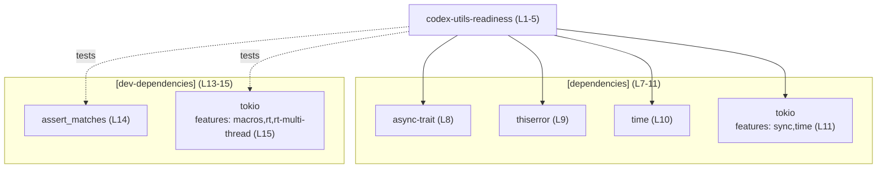
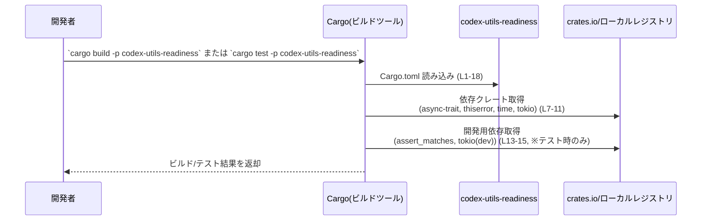

# utils/readiness/Cargo.toml コード解説

## 0. ざっくり一言

- `utils/readiness/Cargo.toml` は、`codex-utils-readiness` クレートの Cargo マニフェストであり、クレート名・ワークスペース共通のバージョン/エディション/ライセンス、依存クレート、開発用依存クレート、lint 設定を定義しています。[utils/readiness/Cargo.toml:L1-5][utils/readiness/Cargo.toml:L7-15][utils/readiness/Cargo.toml:L17-18]
- このファイル自体には Rust の関数・構造体・公開 API は含まれておらず、実際のロジックは別のソースファイルに存在します。[utils/readiness/Cargo.toml:L1-18]

---

## 1. このモジュールの役割

### 1.1 概要

- `codex-utils-readiness` というクレートをワークスペースの一員として定義し、バージョン・エディション・ライセンスをワークスペース共通設定から継承しています。[utils/readiness/Cargo.toml:L1-5]
- 実行時に使用可能な依存クレートとして `async-trait`, `thiserror`, `time`, `tokio` を、開発時/テスト時専用の依存クレートとして `assert_matches` と別設定の `tokio` を宣言しています。[utils/readiness/Cargo.toml:L7-11][utils/readiness/Cargo.toml:L13-15]
- lint 設定もワークスペース共通設定に委譲されています。[utils/readiness/Cargo.toml:L17-18]

このファイルは「どの外部コンポーネントに依存しうるか」を定めるものであり、具体的なコアロジックやエラーハンドリング、並行処理の実装内容はこのファイルからは分かりません。

### 1.2 アーキテクチャ内での位置づけ

`codex-utils-readiness` クレートは、以下の依存関係を持つことが分かります。[utils/readiness/Cargo.toml:L2][utils/readiness/Cargo.toml:L7-15]

- 実行時依存:
  - `async-trait`
  - `thiserror`
  - `time`
  - `tokio`（`sync`, `time` 機能を有効化）
- 開発/テスト時のみの依存:
  - `assert_matches`
  - `tokio`（`macros`, `rt`, `rt-multi-thread` 機能を有効化）

ワークスペース内の他クレートがこのクレートをどのように利用しているか、またこのクレート自身の内部モジュール構成は、本チャンクの情報からは分かりません。

#### 依存関係の概要（Mermaid 図）

以下は、この Cargo.toml に現れる依存関係のみを示したアーキテクチャ図です。



※ この図は Cargo.toml に書かれた **依存関係の宣言のみ** を表します。クレート間の呼び出し関係やデータの流れは、このファイルからは分かりません。

### 1.3 設計上のポイント

コード（Cargo 設定）から読み取れる設計上の特徴は次の通りです。

- **ワークスペース共通設定の活用**  
  バージョン・エディション・ライセンスが `*.workspace = true` によりワークスペース共通設定から供給されます。これにより、複数クレート間でバージョンの整合性をとる設計になっています。[utils/readiness/Cargo.toml:L3-5]
- **依存クレートのバージョンもワークスペース側で一元管理**  
  すべての依存と開発用依存が `workspace = true` で宣言されており、バージョン指定はワークスペース側に集約されています。[utils/readiness/Cargo.toml:L8-11][utils/readiness/Cargo.toml:L14-15]
- **非同期処理・エラー表現・時刻操作に関する機能が利用可能な構成**（一般的な説明）  
  一般的な用途として、
  - `async-trait`: `async fn` を含む trait 定義/実装を支援するマクロを提供
  - `thiserror`: カスタムエラー型の定義を簡潔にするマクロを提供
  - `time`: 日時・時間の型と演算を提供
  - `tokio`: 非同期ランタイムおよび同期プリミティブ・タイマー機能を提供  
  などがあり、これらの機能をこのクレートから利用できる構成になっています。[utils/readiness/Cargo.toml:L8-11]  
  （これは各クレートの一般的な役割に基づく説明であり、実際にどの機能を使っているかはこのファイルからは分かりません。）
- **テスト用ランタイムの明示**  
  開発用 `tokio` 依存では `macros`, `rt`, `rt-multi-thread` が有効化されており、非同期テスト等でマルチスレッドの Tokio ランタイムを利用できる構成です。[utils/readiness/Cargo.toml:L15]
- **lint 設定の一元化**  
  `[lints]` セクションで `workspace = true` が指定されており、lint 設定がワークスペース全体で統一されます。[utils/readiness/Cargo.toml:L17-18]

---

## 2. 主要な機能一覧（このファイルが担う役割）

Cargo.toml 自体は実行時の「機能」を直接提供しませんが、このファイルを通じてクレートには次のような役割が与えられます。

- パッケージ基本情報の宣言: クレート名・バージョン・エディション・ライセンスをワークスペース共通設定から参照します。[utils/readiness/Cargo.toml:L1-5]
- 実行時依存クレートの宣言: 非同期処理・エラー定義・時刻操作・非同期ランタイムに関するクレートを依存として登録します。[utils/readiness/Cargo.toml:L7-11]
- 開発/テスト用依存クレートの宣言: マッチング用アサートユーティリティと非同期テスト用の Tokio ランタイムを利用可能にします。[utils/readiness/Cargo.toml:L13-15]
- lint 設定の適用: ワークスペース共通の lint ポリシーをこのクレートにも適用します。[utils/readiness/Cargo.toml:L17-18]

### コンポーネントインベントリー（このファイルに現れる要素）

| コンポーネント名 | 種別 | 用途（一般的な説明 / 本ファイル外の知識を含む） | 根拠 |
|------------------|------|--------------------------------------------------|------|
| `codex-utils-readiness` | クレート（パッケージ） | ワークスペース内の 1 クレートとして定義される。実際のロジックは `src/` 以下の Rust コード（このチャンクには未掲載）に存在する。 | [utils/readiness/Cargo.toml:L1-2] |
| `async-trait` | 実行時依存クレート | 一般に、`async fn` を含む trait の定義/実装を可能にするためのマクロを提供するクレート。 | [utils/readiness/Cargo.toml:L7-8] |
| `thiserror` | 実行時依存クレート | 一般に、エラー型を簡潔に定義するための derive マクロを提供するクレート。 | [utils/readiness/Cargo.toml:L7-9] |
| `time` | 実行時依存クレート | 一般に、日付・時刻・期間などの型と演算・フォーマット機能を提供するクレート。 | [utils/readiness/Cargo.toml:L7-10] |
| `tokio`（runtime 用） | 実行時依存クレート | 一般に、非同期 I/O ランタイムと同期プリミティブ・タイマーを提供するクレート。ここでは `sync`, `time` 機能が有効になっている。 | [utils/readiness/Cargo.toml:L7-11] |
| `assert_matches` | 開発/テスト用依存クレート | 一般に、値が特定のパターンにマッチすることをアサートするマクロを提供するクレート。テストコードで利用される。 | [utils/readiness/Cargo.toml:L13-14] |
| `tokio`（dev 用） | 開発/テスト用依存クレート | テストなどの開発用途で利用する Tokio。`macros`, `rt`, `rt-multi-thread` 機能が有効になっており、`#[tokio::test]` などのマクロとマルチスレッドランタイムが利用可能な構成。 | [utils/readiness/Cargo.toml:L13-15] |
| ワークスペース lint 設定 | lint 設定 | ワークスペース全体で共通の lint ポリシーを提供する設定。具体的な内容はワークスペースルート側の設定ファイルにあり、このチャンクからは詳細不明。 | [utils/readiness/Cargo.toml:L17-18] |

※ 用途欄の多くは「各クレートの一般的な役割」に基づく説明であり、**このリポジトリ内で実際にどの API を使用しているかは Cargo.toml からは分かりません**。

---

## 3. 公開 API と詳細解説

このファイルは Rust のソースコードではなく **設定ファイル** であるため、型・関数・メソッドなどの公開 API は定義されていません。[utils/readiness/Cargo.toml:L1-18]

### 3.1 型一覧（構造体・列挙体など）

Rust の型定義は存在しないため、一覧は次の通りです。

| 名前 | 種別 | 役割 / 用途 |
|------|------|-------------|
| （なし） | - | `Cargo.toml` には構造体・列挙体などの Rust 型定義は含まれていません。 |

### 3.2 関数詳細（最大 7 件）

このファイルには関数・メソッドの定義が存在しないため、関数レベルの API や内部アルゴリズムを説明することはできません。[utils/readiness/Cargo.toml:L1-18]

#### （該当する関数定義は Cargo.toml には存在しません）

- Cargo.toml はビルド設定ファイルであり、プログラムの挙動を記述する関数やメソッドを含まない形式です。

### 3.3 その他の関数

- なし（設定ファイルのため）。

---

## 4. データフロー

このファイルから読み取れるのは **ビルド時の依存解決フロー** までであり、実行時にどのデータがどの関数間を流れるかは分かりません。

ここでは、`codex-utils-readiness` クレートをビルド/テストする際に Cargo がどのようにこのファイルを利用するかを示します。

### ビルド・テスト時のフロー（一般的な Cargo の動作）

1. 開発者が `cargo build -p codex-utils-readiness` または `cargo test -p codex-utils-readiness` を実行する。
2. Cargo はワークスペースルートの `Cargo.toml` と、この `utils/readiness/Cargo.toml` を読み込む。[utils/readiness/Cargo.toml:L1-5]
3. `[dependencies]` と `[dev-dependencies]` セクションに基づき、必要なクレートとそのバージョンをワークスペース設定から解決する。[utils/readiness/Cargo.toml:L7-11][utils/readiness/Cargo.toml:L13-15]
4. 解決した依存クレートを crates.io あるいはローカルキャッシュから取得し、コンパイルを行う。
5. テストコマンドの場合は、`dev-dependencies` も含めてコンパイルし、テストを実行する。

#### シーケンス図（ビルド時の Cargo と本ファイルの関係）



※ 実行時のデータフロー（どの関数がどのデータを処理するか）は、この Cargo.toml には一切現れません。その分析には対応する Rust ソースコードが必要です。

---

## 5. 使い方（How to Use）

### 5.1 基本的な使用方法

このセクションでは、**クレート単位の使い方**（他クレートから依存する方法、およびビルド/テストの呼び出し）を説明します。

#### 他クレートからの依存（同一ワークスペース内の例）

同じワークスペース内の別クレートが `codex-utils-readiness` を利用する場合、一般的にはそのクレートの `Cargo.toml` に次のような依存を追加します（例）。このリポジトリで実際にどう定義されているかは、このチャンクだけからは分かりません。

```toml
[dependencies]
codex-utils-readiness = { workspace = true }
```

これにより、ワークスペースルートの `Cargo.toml` にある `codex-utils-readiness` のバージョンなどの設定が利用されます。

#### ビルドとテストの実行

開発者は通常、ルートディレクトリで以下のようにコマンドを実行します（一般的な Cargo の使い方）。

```bash
# クレート単体のビルド
cargo build -p codex-utils-readiness

# クレート単体のテスト
cargo test -p codex-utils-readiness
```

これらのコマンド実行時に、ここで解説した `utils/readiness/Cargo.toml` が参照されます。[utils/readiness/Cargo.toml:L1-18]

### 5.2 よくある使用パターン

このファイルから直接 API の呼び出しパターンを読み取ることはできませんが、依存関係から一般的に想定されるパターンを挙げます（あくまで一般論です）。

- **非同期処理 + Tokio ランタイム**  
  `tokio` と `async-trait` を組み合わせ、非同期の trait 実装を `Tokio` ランタイム上で動かす構成にできる状態です。[utils/readiness/Cargo.toml:L8][utils/readiness/Cargo.toml:L11]  
  実際にそうなっているか、どのような並行性モデルかはソースコード側の確認が必要です。
- **カスタムエラー型の利用**  
  `thiserror` 依存から、専用のエラー型を定義し、`Result<_, E>` で戻すパターンを採用しやすい構成です。[utils/readiness/Cargo.toml:L9]
- **時間に依存するロジック**  
  `time` 依存から、現在時刻や期間を扱う処理を行う余地があります。[utils/readiness/Cargo.toml:L10]  
  どの程度時間依存のロジックがあるかは不明です。

### 5.3 よくある間違い（Cargo.toml 編集時）

Cargo.toml の編集に関して、一般的に起こりやすい誤りと、このファイルに即した注意点を挙げます。

```toml
# （誤り例）ワークスペースで管理している依存に対して
# 個別にバージョンを指定してしまう
[dependencies]
tokio = "1.40"  # ← workspace = true を外してしまう
```

```toml
# （望ましい例）ワークスペースでバージョンを一元管理する
[dependencies]
tokio = { workspace = true, features = ["sync", "time"] }  # L11 と同様の指定
```

- **ワークスペース一致性の崩壊**  
  `workspace = true` を外して各クレートが独自のバージョンを指定すると、ワークスペース内で依存バージョンが分裂し、ビルドトラブルの原因になります。このファイルではすべて `workspace = true` になっているため、一元管理の方針と整合しています。[utils/readiness/Cargo.toml:L8-11][utils/readiness/Cargo.toml:L14-15]
- **Tokio の機能セット不整合**  
  実行時 `tokio` と開発用 `tokio` で有効化する feature が異なっていることに注意が必要です。[utils/readiness/Cargo.toml:L11][utils/readiness/Cargo.toml:L15]  
  これ自体は問題ではありませんが、テストコードで利用できる機能と本番コードで利用できる機能が異なる可能性があるため、feature を変更する際は両者の整合性を意識する必要があります。

### 5.4 使用上の注意点（まとめ）

- **公開 API/コアロジックは別ファイル**  
  このファイルだけでは関数・メソッド・エラー型・並行性モデルなどは一切分かりません。安全性やエラーハンドリングを評価する場合は、対応する Rust ソースコード（`src/` 以下）を確認する必要があります。[utils/readiness/Cargo.toml:L1-18]
- **依存クレートの安全性/脆弱性**  
  依存クレートのバージョンはワークスペース側で管理されているため、このファイルから個別バージョンは分かりません。[utils/readiness/Cargo.toml:L8-11][utils/readiness/Cargo.toml:L14-15]  
  既知の脆弱性の有無を確認するには、`Cargo.lock` やワークスペースルートの `Cargo.toml` と合わせて `cargo audit` などを利用する必要があります（一般論）。
- **並行性と Tokio**  
  開発用 `tokio` に `rt-multi-thread` が有効になっているため、テストがマルチスレッドランタイムで動作する可能性があります。[utils/readiness/Cargo.toml:L15]  
  一般論として、Tokio のマルチスレッドランタイムでは共有状態に `Send + Sync` 制約が課され、ブロッキング I/O をそのまま実行すると性能・デッドロック問題を引き起こす可能性がありますが、このクレートが実際にどう書かれているかは本チャンクでは不明です。
- **エッジケース（ワークスペース設定依存）**  
  `*.workspace = true` によりほぼすべてがワークスペースに委譲されているため、ワークスペースルートの設定が不完全な場合、このクレートもビルドできません。例えばワークスペース側に `async-trait` の entries がない場合などです。[utils/readiness/Cargo.toml:L3-5][utils/readiness/Cargo.toml:L8-11][utils/readiness/Cargo.toml:L14-15][utils/readiness/Cargo.toml:L17-18]

---

## 6. 変更の仕方（How to Modify）

### 6.1 新しい機能を追加する場合（依存クレートの追加）

このファイルから分かる範囲の「変更の入口」は主に依存関係です。新しい機能を実装するために、追加の依存クレートが必要になるケースを想定します。

1. **ワークスペース側で依存クレートを定義**  
   このファイルではすべて `workspace = true` を用いているため、新規依存クレートも通常はワークスペースルートの `Cargo.toml` の `[workspace.dependencies]` 等に追加する必要があります（パスはこのチャンクからは不明ですが、Cargo の一般仕様による前提です）。
2. **このクレートの Cargo.toml に参照を追加**  
   新しい依存を利用するには、`[dependencies]` または `[dev-dependencies]` に  
   `new-crate = { workspace = true }` のように追記します。[utils/readiness/Cargo.toml:L7-11][utils/readiness/Cargo.toml:L13-15]
3. **機能フラグの検討**  
   `tokio` のように feature を個別指定している例があるため（`["sync", "time"]` や `["macros", "rt", "rt-multi-thread"]`）、追加する依存についても必要な feature を明示するかどうかを検討します。[utils/readiness/Cargo.toml:L11][utils/readiness/Cargo.toml:L15]
4. **Rust ソースコード側での利用実装**  
   実際の利用コードは `src/` 以下の Rust ファイルに記述します。このチャンクにはその内容がないため、どこに書くかはソースツリーを別途確認する必要があります。

### 6.2 既存の機能を変更する場合（依存や設定の変更）

依存構成や設定を変更する際の注意点を、契約（前提条件）という観点で整理します。

- **Tokio の feature 変更**  
  - 実行時 `tokio` の feature（`sync`, `time`）を変更すると、既存コードが利用している API がコンパイルできなくなる可能性があります。[utils/readiness/Cargo.toml:L11]
  - 開発用 `tokio` の feature（`macros`, `rt`, `rt-multi-thread`）を外すと、テストコードで `#[tokio::test]` などを使っている場合にコンパイルエラーになる可能性があります。[utils/readiness/Cargo.toml:L15]
- **依存削除時の影響範囲**  
  `async-trait`, `thiserror`, `time` などを削除または無効化すると、それらに依存しているコードがコンパイル不可になります。[utils/readiness/Cargo.toml:L8-10]  
  削除前に `rg "async_trait"` や `rg "thiserror"` のように、実際の使用箇所を検索する必要があります（一般論）。
- **ワークスペースとの契約**  
  `*.workspace = true` に依存しているため、ワークスペースルート側の設定を変更した場合、このクレートにも直接影響が及びます。[utils/readiness/Cargo.toml:L3-5][utils/readiness/Cargo.toml:L8-11][utils/readiness/Cargo.toml:L14-15][utils/readiness/Cargo.toml:L17-18]  
  例として、ワークスペース側で `tokio` のバージョンを上げると、このクレートの挙動も変化しうるため、テストの再実行が必要です。

---

## 7. 関連ファイル

この Cargo.toml から明示的に読み取れる他ファイルとの関係は、主に「ワークスペース共通設定」との関係です。

| パス | 役割 / 関係 |
|------|------------|
| （ワークスペースルートの `Cargo.toml`、パス不明） | `version.workspace = true`, `edition.workspace = true`, `license.workspace = true`、および `workspace = true` 指定の依存・lint 設定の実体を定義するファイル。Cargo の仕様上、これらの値はワークスペースルート側に存在すると解釈できます。[utils/readiness/Cargo.toml:L3-5][utils/readiness/Cargo.toml:L8-11][utils/readiness/Cargo.toml:L14-15][utils/readiness/Cargo.toml:L17-18] |
| （Rust ソースコードファイル群、パス不明） | `codex-utils-readiness` クレートの公開 API・コアロジック・エラー処理・並行処理の実装が含まれるファイル群ですが、このチャンクには一切現れません。通常は同ディレクトリ配下の `src/` 以下に置かれますが、具体的な構成は不明です。[utils/readiness/Cargo.toml:L1-2] |

このチャンクにはテストコードや補助ユーティリティなどのファイルパス情報は出てこないため、テストの内容やカバレッジ、ロギング/メトリクスなどのオブザーバビリティについては、このファイルからは評価できません。

---

### まとめ（安全性・エラー・並行性・テスト等について）

- **安全性 / セキュリティ**  
  - このファイル単体から、バッファオーバーフロー等のローレベルな安全性問題は評価できません。
  - 依存クレートのバージョン情報もワークスペース側にあるため、既知の脆弱性の有無を判断するには追加情報が必要です。
- **エラー処理**  
  - `thiserror` 依存により、カスタムエラー型を使ったエラー処理を構成しやすい状況であることだけが分かります。[utils/readiness/Cargo.toml:L9]  
    実際のエラー設計（どの条件でどんなエラーを返すか）は、ソースコードに依存します。
- **並行性**  
  - `tokio` と `rt-multi-thread` feature（開発用）により、マルチスレッド非同期ランタイムを利用する余地があります。[utils/readiness/Cargo.toml:L11][utils/readiness/Cargo.toml:L15]  
    ただし、このクレートがどのようにスレッドやタスクを扱っているかは本チャンクからは不明です。
- **テスト**  
  - `assert_matches` と `tokio`（開発用）から、パターンマッチベースのアサーションや非同期テストが書かれている可能性がありますが、具体的なテスト内容・エッジケース・カバレッジは不明です。[utils/readiness/Cargo.toml:L13-15]

以上が、`utils/readiness/Cargo.toml` の内容から客観的に読み取れる範囲の解説です。クレートの公開 API とコアロジックを分析するには、対応する Rust ソースコード（このチャンクには含まれていない）をあわせて確認する必要があります。
