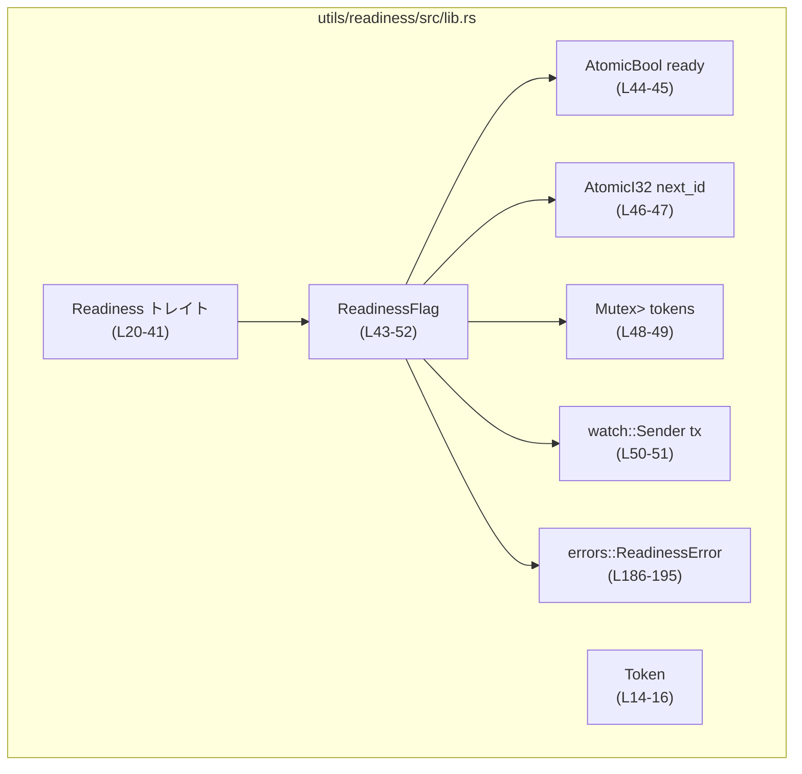
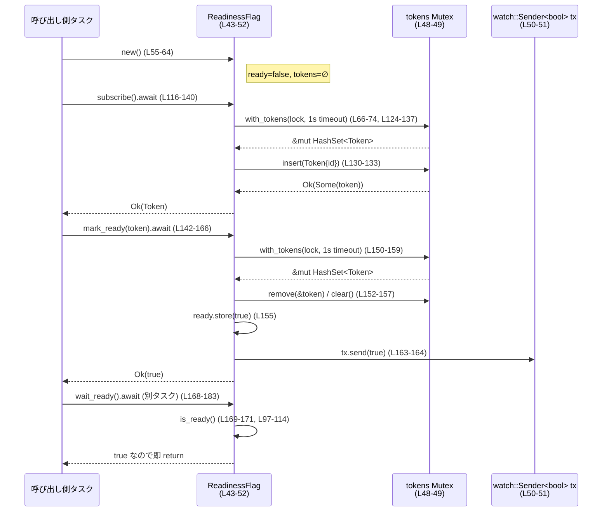
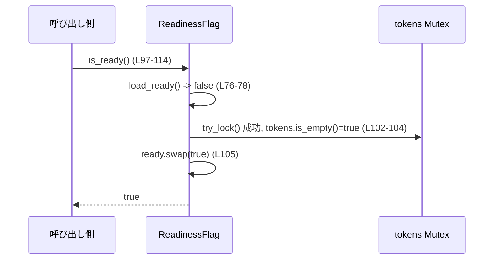

# utils/readiness/src/lib.rs

## 0. ざっくり一言

トークンベースの「レディネスフラグ」を提供するモジュールです。  
非同期（Tokio）環境で、トークン発行 → 認可された `mark_ready` → `wait_ready` による待機、に対応したスレッドセーフなフラグ管理を行います。

---

## 1. このモジュールの役割

### 1.1 概要

このモジュールは **「ある条件が満たされてシステムが ready になったか」** を管理するための仕組みを提供します。

- 複数タスクが readiness フラグに対して **購読用トークン (`Token`)** を取得し
- 適切なトークンを持つタスクだけが **一度だけ `mark_ready` でフラグを立てる** ことができ
- 他のタスクは **非同期に `wait_ready` して ready になるのを待つ** ことができます  
（Tokio の `watch` チャンネルで通知）

さらに、購読者が一人もいない場合には、`is_ready` が呼ばれたタイミングで自動的に ready になります（後述、L97-114）。

### 1.2 アーキテクチャ内での位置づけ

このモジュール内部の主な依存関係を示します。



- 外部から主に利用されるのは `Token`、`Readiness` トレイト、`ReadinessFlag` です（L14-16, L20-41, L43-52）。
- 内部状態は
  - `ready: AtomicBool`（高速な読み取り用、L44-45）
  - `next_id: AtomicI32`（トークン ID 生成用、L46-47）
  - `tokens: Mutex<HashSet<Token>>`（有効なトークン集合、L48-49）
  - `tx: watch::Sender<bool>`（非同期待機用の通知チャンネル、L50-51）
  で構成されています。
- エラーは `errors::ReadinessError`（L186-195）で表現されます。

### 1.3 設計上のポイント

コードから読み取れる設計上の特徴です。

- **トークンベースの権限制御**  
  - `subscribe` で `Token` を発行し、`mark_ready` は有効なトークンのみを受け付けます（L116-140, L142-158）。
  - トークンは一回きりで、成功した `mark_ready` の後はトークン集合をクリアします（L155-157）。

- **購読者ゼロ時の自動 ready**  
  - `is_ready` 中で `tokens` が空かつロック取得に成功した場合、自動的に `ready` を `true` にして通知します（L97-114）。

- **非同期・並行性に配慮**  
  - 読み取りは `AtomicBool`＋Acquire/Release で軽量に実装（L76-78, L105, L155）。
  - 書き込み時やトークン操作は `tokio::sync::Mutex`＋`tokio::time::timeout`（1 秒）を使用（L66-74）。

- **非ブロッキングの待機**  
  - `wait_ready` は `watch::Sender<bool>` からの `Receiver` による pub/sub モデルで非同期に通知を受けます（L168-183）。

- **エラー設計**  
  - ロック取得失敗 (`TokenLockFailed`) と、既に ready な状態での `subscribe` (`FlagAlreadyReady`) を明確に区別しています（L186-195, L116-119, L139）。

---

## 2. 主要な機能一覧

このモジュールが提供する主な機能です。

- **Token の発行**: `subscribe` による購読トークンの発行（L116-140）
- **レディネスの判定**: `is_ready` による現在の ready 状態の確認と、購読者ゼロ時の自動 ready（L97-114）
- **認可付きの ready 設定**: `mark_ready` による、トークンを使った一度きりの ready 設定（L142-166）
- **非同期待機**: `wait_ready` による ready になるまでの非同期ブロック（L168-183）
- **エラー報告**: `ReadinessError` によるロック失敗・二重購読の明示的なエラー通知（L186-195）

---

## 3. 公開 API と詳細解説

### 3.1 型一覧（構造体・列挙体など）

| 名前 | 種別 | 公開性 | 行範囲 | 役割 / 用途 |
|------|------|--------|--------|-------------|
| `Token` | タプル構造体 `struct Token(i32)` | `pub` | `lib.rs:L14-16` | `subscribe` で返される購読トークン。`mark_ready` の認可に使用。中身の `i32` は外側からは意識しない想定。 |
| `Readiness` | トレイト | `pub` | `lib.rs:L20-41` | readiness フラグの標準インターフェース。`is_ready` / `subscribe` / `mark_ready` / `wait_ready` を定義。 |
| `ReadinessFlag` | 構造体 | `pub` | `lib.rs:L43-52` | `Readiness` を実装する具体的な実装。トークン集合・ready フラグ・watch チャンネルを内部に保持。 |
| `ReadinessError` | 列挙体 | `pub`（ただし `mod errors` 内） | `lib.rs:L186-195` | トークンロック取得失敗と ready 済みでの `subscribe` の 2 種類のエラーを表す。モジュール `errors` は `pub mod` ではないため、外部からの可視性はこのファイルだけでは不明。 |

> 可視性に関する注意（事実ベース）  
> `Readiness` トレイトのメソッドは `errors::ReadinessError` を返します（L30, L37）。  
> 一方で `mod errors` は `pub` ではなく（L186）、`ReadinessError` はその中で `pub enum` として定義されています（L190）。  
> このファイル単体からは、`ReadinessError` が crate の外から参照できるように再公開されているかどうかは分かりません。

---

### 3.2 重要な関数・メソッドの詳細

#### `ReadinessFlag::new() -> ReadinessFlag`

**定義**

- `lib.rs:L55-64`

**概要**

- 初期状態が「not ready」の `ReadinessFlag` を生成します。
- `ready = false`、`next_id = 1`、空のトークン集合、新しい `watch` チャンネルを初期化します。

**引数**

| 引数名 | 型 | 説明 |
|--------|----|------|
| なし | - | なし |

**戻り値**

- `ReadinessFlag`  
  未準備状態（`is_ready()` がまだ `false` になりうる）で、トークンも 0 件のフラグ。

**内部処理の流れ**

1. `watch::channel(false)` で、初期値 `false` の watch チャンネルを生成（L57）。
2. `ready` を `AtomicBool::new(false)` で初期化（L59）。
3. `next_id` を `AtomicI32::new(1)` で初期化（0 は予約値として使用しない、L60）。
4. `tokens` を空の `HashSet<Token>` で初期化（L61）。
5. これらを含む `ReadinessFlag` を返却（L58-63）。

**Examples（使用例）**

```rust
use utils::readiness::ReadinessFlag; // 実際のパスは上位モジュール構成による

// 新しい readiness フラグを生成する
let flag = ReadinessFlag::new();

// まだ mark_ready していないので is_ready は通常 false になり得る
let ready_now = flag.is_ready(); // 購読者ゼロの場合はここで true になる可能性あり
println!("ready? {}", ready_now);
```

**Errors / Panics**

- エラーを返さず、panic も行いません。

**Edge cases（エッジケース）**

- 特になし（初期化専用関数）。

**使用上の注意点**

- `ReadinessFlag` は `Send + Sync` なフィールドで構成されているため、複数タスク／スレッドで共有する前提の作りになっています。
  - 共有する場合は `Arc<ReadinessFlag>` の利用が一般的です（テストでも `Arc` が使われています、L239-248）。

---

#### `Readiness::is_ready(&self) -> bool` （`ReadinessFlag` 実装）

**定義**

- トレイト宣言: `lib.rs:L22-25`
- `ReadinessFlag` に対する実装: `lib.rs:L97-114`

**概要**

- readiness フラグが現在 ready かどうかを返します。
- 追加の挙動として、「トークン購読者が 0 の場合は、このメソッド自身が readiness を `true` に更新」します。

**引数**

| 引数名 | 型 | 説明 |
|--------|----|------|
| `self` | `&self` | `Readiness` を実装したインスタンスへの共有参照。 |

**戻り値**

- `bool`  
  - `true`: readiness が確定的に ready。少なくとも一度 `ready` が `true` にセットされたか、購読者がゼロの状態でこの関数が呼ばれた。
  - `false`: まだ ready と判断されていない。

**内部処理の流れ**

1. `self.load_ready()` で `ready` を `Ordering::Acquire` で読み取る（L97-101, L76-78）。
   - `true` なら即 `true` を返す。
2. `self.tokens.try_lock()` でロックの非ブロッキング取得を試み、成功かつ `tokens.is_empty()` のとき（L102-104）:
   1. `ready.swap(true, Ordering::AcqRel)` で、以前の値を `was_ready` に保存しつつ `true` に更新（L105）。
   2. ロックガードを drop（L106）。
   3. `was_ready` が `false` の場合だけ `tx.send(true)` で待機者へ通知（L107-109）。
   4. `true` を返す（L110）。
3. 上記の条件に当てはまらない場合、`self.load_ready()` の結果を返す（L113-114）。

**Examples（使用例）**

```rust
use std::sync::Arc;
use utils::readiness::{ReadinessFlag, Readiness};

let flag = Arc::new(ReadinessFlag::new());

// 誰も subscribe していない状態で is_ready を呼ぶと、
// 内部で ready が true に更新される（L102-110）。
let r1 = flag.is_ready();
let r2 = flag.is_ready();
assert!(r1 && r2);
```

**Errors / Panics**

- エラーや panic は発生しません。
- `try_lock` に失敗した場合は、何も副作用を起こさず `self.load_ready()` の結果を返します（L102-104, L113-114）。

**Edge cases（エッジケース）**

- **購読者が 0 のとき**  
  - `tokens` が空でロック取得に成功すると、このメソッドが readiness を `true` に変更します（L102-110）。
- **ロックが競合しているとき**  
  - `try_lock` が失敗した場合はロック待ちをせず、単に `ready` の現在値を返します（L102-104, L113-114）。

**使用上の注意点**

- 「単なる状態確認」のつもりで `is_ready` を呼ぶと、購読者がいなければ **状態を変化させる副作用** がある点に注意が必要です。
- これにより、「誰もトークンを持っていないのであれば ready と見なす」というポリシーが実装されています（テスト `is_ready_without_subscribers_marks_flag_ready`, L266-276）。

---

#### `Readiness::subscribe(&self) -> Result<Token, ReadinessError>` （`ReadinessFlag` 実装）

**定義**

- トレイト宣言: `lib.rs:L27-30`
- 実装: `lib.rs:L116-140`

**概要**

- readiness フラグに対する購読トークンを 1 つ発行します。
- フラグがすでに ready の場合は、新しいトークンを発行せずに `FlagAlreadyReady` エラーを返します。

**引数**

| 引数名 | 型 | 説明 |
|--------|----|------|
| `self` | `&self` | `Readiness` 実装への共有参照。 |

**戻り値**

- `Result<Token, ReadinessError>`  
  - `Ok(Token)`: 新しく発行された購読トークン。
  - `Err(ReadinessError::FlagAlreadyReady)`: 既に ready だったため購読できない。
  - `Err(ReadinessError::TokenLockFailed)`: 内部トークン集合のロック取得に失敗した。

**内部処理の流れ**

1. `self.load_ready()` が `true` の場合、即座に `FlagAlreadyReady` エラーを返す（L117-119）。
2. ロック取得とトークン発行を `with_tokens` ヘルパー内で行う（L124-137）。
   - `with_tokens` 自体は `LOCK_TIMEOUT`（1 秒）付きの `time::timeout` で `self.tokens.lock()` を呼び出し、タイムアウトしたら `TokenLockFailed` を返す（L66-74, L18）。
3. ロック取得後のクロージャ（L125-136）:
   1. 再度 `self.load_ready()` を確認し、ready なら `None` を返す（L126-128）。
   2. そうでない場合、ループで `self.next_id.fetch_add(1, Ordering::Relaxed)` により新しい ID を生成し（L130-131）、
      - `token.0 != 0`（0 は禁止, L132）
      - `tokens.insert(token)` が成功する（重複トークンを避ける, L132-133）
      まで繰り返す。
   3. 条件を満たしたトークンを `Some(token)` で返す（L133-134）。
4. クロージャが返した `Option<Token>` を受け取り、`Some` なら `Ok(token)`、`None` なら `FlagAlreadyReady` エラーに変換する（L138-139）。

**Examples（使用例）**

```rust
use utils::readiness::{Readiness, ReadinessFlag};
use std::sync::Arc;

let flag = Arc::new(ReadinessFlag::new());

// 正常にトークンが取得できる
let token = flag.subscribe().await?;

// ready にした後は subscribe がエラーになる
assert!(flag.mark_ready(token).await?);
assert!(flag.subscribe().await.is_err());
```

（テスト `subscribe_after_ready_returns_none` が同様のケースを検証, L219-227）

**Errors / Panics**

- `ReadinessError::FlagAlreadyReady`
  - `ready` がすでに `true` の場合、またはロック中に再確認した際に `true` だった場合（L117-119, L126-128, L139）。
- `ReadinessError::TokenLockFailed`
  - `tokens.lock()` の取得が `LOCK_TIMEOUT` 内に完了しなかった場合（L70-73）。  
    テスト `subscribe_returns_error_when_lock_is_held` で検証されています（L279-291）。
- panic は発生しません（`expect` 等はテストのみ）。

**Edge cases（エッジケース）**

- **トークン ID の wrap-around**  
  - `next_id` は `i32` であり、`fetch_add` は `Ordering::Relaxed` で単調増加しますが、`i32` がオーバーフローしても、`tokens.insert(token)` が `false` になる（すでに存在するトークン）まではループし続けます（L130-135）。
  - さらに、0 は明示的にスキップされます（`token.0 != 0`, L132）。テスト `subscribe_skips_zero_token` で検証（L294-301）。

- **ロック競合**  
  - 別タスクが `tokens` ロックを保持し続けた場合、1 秒で `TokenLockFailed` を返します（L66-74, L279-291）。

**使用上の注意点**

- トークンは後で `mark_ready` に渡すために保持しておく必要があります。失うと ready にできません。
- `ReadinessFlag` を長く使い回す場合でも、トークンの数は「現在の購読者数」程度に限られます（ready 時にクリアされるため, L155-157）。

---

#### `Readiness::mark_ready(&self, token: Token) -> Result<bool, ReadinessError>` （`ReadinessFlag` 実装）

**定義**

- トレイト宣言: `lib.rs:L32-37`
- 実装: `lib.rs:L142-166`

**概要**

- 与えられたトークンが有効であれば readiness フラグを `true` に設定し、watch チャンネルに通知します。
- 成功すると `Ok(true)` を返し、以後はすべてのトークンが無効になります。
- トークンが無効（未登録・再利用・0）またはすでに ready の場合、`Ok(false)` を返します。

**引数**

| 引数名 | 型 | 説明 |
|--------|----|------|
| `self` | `&self` | `Readiness` 実装への共有参照。 |
| `token` | `Token` | 事前に `subscribe` で取得した購読トークン。 |

**戻り値**

- `Result<bool, ReadinessError>`  
  - `Ok(true)`: トークンが有効であり、ready を初めて `true` にセットした。
  - `Ok(false)`: ready 済み、無効トークン、または再利用されたトークンのいずれか。
  - `Err(ReadinessError::TokenLockFailed)`: 内部ロックの取得に失敗した。

**内部処理の流れ**

1. すでに `ready` が `true` の場合は即 `Ok(false)` を返す（L143-145）。
2. `token.0 == 0` の場合も `Ok(false)` を返す（0 は認可されない特別な値, L146-148）。
3. `with_tokens` で `tokens` ロックを取得し、以下のクロージャを実行（L150-158）:
   1. `set.remove(&token)` が成功しなければ `false` を返す（無効または再利用トークン, L152-153）。
   2. `ready.store(true, Ordering::Release)` で ready を `true` に設定（L155）。
   3. `set.clear()` で残りのトークンをすべて破棄（L156）。
   4. `true` を返す（L157）。
4. `with_tokens` の結果が `false` なら `Ok(false)` を返す（L160-162）。
5. `true` の場合、`tx.send(true)` で watch チャンネルに通知し（エラーは無視, L163-164）、`Ok(true)` を返す（L165）。

**Examples（使用例）**

```rust
use utils::readiness::{ReadinessFlag, Readiness};

let flag = ReadinessFlag::new();
let token = flag.subscribe().await?;

// 最初の mark_ready は成功する
assert!(flag.mark_ready(token).await?);
assert!(flag.is_ready());

// 同じトークンの再利用は false を返す
assert!(!flag.mark_ready(token).await?);
```

（テスト `subscribe_and_mark_ready_roundtrip`, `mark_ready_twice_uses_single_token` を参照, L209-217, L255-262）

**Errors / Panics**

- `ReadinessError::TokenLockFailed`
  - `with_tokens` 内で `tokens.lock()` のタイムアウトが発生した場合（L66-74, L150-159）。
- panic はありません。

**Edge cases（エッジケース）**

- **未知のトークン**  
  - `set.remove(&token)` が失敗し、`Ok(false)` を返し readiness も変更しません（L152-153, L160-162）。
  - テスト `mark_ready_rejects_unknown_token` で、`Token(42)` を与えた場合に `ready` が変化しないことが確認されています（L229-236）。

- **トークン 0**  
  - `token.0 == 0` の場合は早期に `Ok(false)`（L146-148）。`subscribe` はそもそも 0 を返さないため、これは「手書きの不正トークン」に対する防御になります（L130-133, L294-301）。

- **ready 済み**  
  - すでに ready な状態では常に `Ok(false)` となり、副作用はありません（L143-145）。

**使用上の注意点**

- 一度成功したトークンは再利用できません（トークンセットから削除されるため, L150-157）。
- `Ok(false)` は「エラー」ではなく、「ready の変更が行われなかった」ことを示す状態コードとして使われます。
- watch チャンネルへの通知は「ベストエフォート」であり、`send` のエラー（受信者ゼロ）は無視されます（L163-164）。

---

#### `Readiness::wait_ready(&self)` （`ReadinessFlag` 実装）

**定義**

- トレイト宣言: `lib.rs:L39-40`
- 実装: `lib.rs:L168-183`

**概要**

- readiness フラグが ready になるまで非同期に待機します。
- すでに ready の場合は即座に return します。

**引数**

| 引数名 | 型 | 説明 |
|--------|----|------|
| `self` | `&self` | `Readiness` 実装への共有参照。 |

**戻り値**

- `()`（`async fn`）  
  `await` した後は、`is_ready()` が必ず `true` になることが期待されます。

**内部処理の流れ**

1. `self.is_ready()` を呼び、すでに ready であれば即 return（L169-171）。
2. `self.tx.subscribe()` で新しい `watch::Receiver<bool>` を取得（L172）。
3. 取得直後に `*rx.borrow()` をチェックし、`true` なら return（L174-175）。
4. `while rx.changed().await.is_ok()` ループで値の変化を待ち続け（L178-182）、
   - 各イテレーションで `*rx.borrow()` が `true` になったら `break`（L179-180）。
5. ループ終了時に関数を抜ける。

**Examples（使用例）**

```rust
use std::sync::Arc;
use utils::readiness::{ReadinessFlag, Readiness};

let flag = Arc::new(ReadinessFlag::new());
let token = flag.subscribe().await?;

// 別タスクで wait_ready する
let waiter = {
    let flag = Arc::clone(&flag);
    tokio::spawn(async move {
        flag.wait_ready().await;
        // ここに到達した時点で ready
    })
};

// 後から ready にする
flag.mark_ready(token).await?;
waiter.await.unwrap();
```

（テスト `wait_ready_unblocks_after_mark_ready` で同等のパターンが検証されています, L238-252）

**Errors / Panics**

- エラーを返しません。
- `watch::Receiver::changed().await` の `Result` は `is_ok()` でチェックされ、エラー（`Sender` 側がクローズ）はループ脱出として扱います（L178-182）。

**Edge cases（エッジケース）**

- **すでに ready な場合**  
  - `is_ready` が true を返せば即時 return のため、不要な待機は発生しません（L169-171）。
- **通知前に subscribe された場合**  
  - `rx` の初期値は `false`（`watch::channel(false)` 由来, L57）なので、`changed().await` を通じて `true` になるまで待機します。
- **送信側のドロップ**  
  - `tx` がドロップされた場合、`changed().await` はエラーとなり、`is_ok()` が `false` になった時点でループを抜けます（L178-182）。その後の `is_ready()` の値は、送信前に設定された `ready` に依存します。

**使用上の注意点**

- 非同期コンテキスト（Tokio ランタイム上）でのみ利用できます（`async fn` であり、テストも `#[tokio::test]` を使用, L209, L219, ...）。
- 内部で `is_ready` を呼ぶため、購読者ゼロ時に `wait_ready` 自身が readiness を `true` にする可能性があります（L169-171, L97-114）。

---

#### `ReadinessFlag::with_tokens<R>(&self, f: impl FnOnce(&mut HashSet<Token>) -> R) -> Result<R, ReadinessError>`

**定義**

- `lib.rs:L66-74`

**概要**

- `tokens: Mutex<HashSet<Token>>` へのロック取得とタイムアウト処理をカプセル化した内部ヘルパーです。
- 呼び出し側が渡したクロージャ `f` を、ロックされたトークン集合に対して実行します。

**引数**

| 引数名 | 型 | 説明 |
|--------|----|------|
| `self` | `&self` | `ReadinessFlag` インスタンス。 |
| `f` | `impl FnOnce(&mut HashSet<Token>) -> R` | ロックされたトークン集合に対して実行する処理。 |

**戻り値**

- `Result<R, ReadinessError>`  
  - `Ok(R)`: ロック取得に成功し、クロージャの処理が完了した結果。
  - `Err(ReadinessError::TokenLockFailed)`: ロック取得が `LOCK_TIMEOUT` 内に完了しなかった。

**内部処理の流れ**

1. `time::timeout(LOCK_TIMEOUT, self.tokens.lock())` を実行し、ロック取得を 1 秒に制限（L70-72）。
2. タイムアウトした場合、`ReadinessError::TokenLockFailed` に変換（L71-72）。
3. 成功した場合、ガードを `guard` として受け取り（L70-73）、`f(&mut guard)` を呼び、その結果を `Ok` で返す（L73-74）。

**Examples（使用例）**

この関数は外部には公開されていませんが、`subscribe` や `mark_ready` から次のように使われています。

```rust
// subscribe 内 (L124-137)
let token = self.with_tokens(|tokens| {
    // tokens に対する排他操作 ...
}).await?;

// mark_ready 内 (L150-159)
let marked = self.with_tokens(|set| {
    // set からトークン削除 & ready フラグ更新 ...
}).await?;
```

**Errors / Panics**

- `ReadinessError::TokenLockFailed` のみ発生します。
- panic はありません。

**Edge cases（エッジケース）**

- 呼び出し側がロックを長時間保持するクロージャを渡すと、他のタスクの `with_tokens` 呼び出しがすべてタイムアウトしやすくなります。

**使用上の注意点**

- クロージャの中では、**できるだけ短時間での処理終了** が望まれます。
- I/O や await をクロージャ内部で行うと、ロック保持時間が長くなり、`TokenLockFailed` が増える可能性があります（ただし、現状の実装では await を含むクロージャは使用していません）。

---

#### `ReadinessFlag::load_ready(&self) -> bool`

**定義**

- `lib.rs:L76-78`

**概要**

- `ready: AtomicBool` を `Ordering::Acquire` で読み取るラッパーです。
- `is_ready` や `subscribe` から繰り返し使われる内部ヘルパーです。

**引数**

| 引数名 | 型 | 説明 |
|--------|----|------|
| `self` | `&self` | `ReadinessFlag` |

**戻り値**

- `bool`  
  現在の `ready` フラグの値。

**内部処理の流れ**

1. `self.ready.load(Ordering::Acquire)` を返すのみ（L77）。

**使用上の注意点**

- 外部 API から直接は呼ばれませんが、`Acquire` ロードにより、対応する `Release` / `AcqRel` の書き込み（`mark_ready`・`is_ready` 内の更新）との間でメモリ可視性が保証されます（L105, L155）。

---

### 3.3 その他の関数・メソッド一覧

| 関数 / メソッド | 定義行 | 役割（1 行） |
|----------------|--------|--------------|
| `impl Default for ReadinessFlag::default` | `lib.rs:L81-84` | `ReadinessFlag::new()` を呼ぶだけのデフォルト実装。 |
| `impl fmt::Debug for ReadinessFlag::fmt` | `lib.rs:L87-92` | `ReadinessFlag { ready: <現在値> }` としてデバッグ表示を行う。 |
| `Readiness::is_ready`（トレイト宣言のみ） | `lib.rs:L22-25` | 状態確認メソッドのシグネチャ定義。 |
| `Readiness::subscribe`（宣言） | `lib.rs:L27-30` | トークン発行メソッドのシグネチャ定義。 |
| `Readiness::mark_ready`（宣言） | `lib.rs:L32-37` | 認可付き ready 設定メソッドのシグネチャ定義。 |
| `Readiness::wait_ready`（宣言） | `lib.rs:L39-40` | ready まで非同期待機するメソッドのシグネチャ定義。 |
| テスト関数群 | `lib.rs:L209-313` | 各 API の正常系・異常系・エッジケースを検証。 |

---

## 4. データフロー

### 4.1 代表的なシナリオ

典型的なシナリオとして、「トークンを取得→ready をセット→別タスクが wait する」流れを示します。



別のシナリオとして、購読者ゼロで `is_ready` が ready にするパターン：



---

## 5. 使い方（How to Use）

### 5.1 基本的な使用方法

最も基本的なフローは「フラグの初期化→購読→ready に設定→結果の利用」です。

```rust
use std::sync::Arc;
use utils::readiness::{ReadinessFlag, Readiness}; // 実際のパスはモジュール構成に依存

#[tokio::main]
async fn main() -> Result<(), Box<dyn std::error::Error>> {
    // フラグを共有可能な形で用意する
    let flag = Arc::new(ReadinessFlag::new());

    // どこかのタスクが readiness を待つ
    let waiter = {
        let flag = Arc::clone(&flag);
        tokio::spawn(async move {
            flag.wait_ready().await;
            println!("ready!");
        })
    };

    // 別の場所で購読トークンを取得
    let token = flag.subscribe().await?;

    // 準備が整ったタイミングで mark_ready
    assert!(flag.mark_ready(token).await?);

    // 待っていたタスクが完了するのを確認
    waiter.await.unwrap();

    Ok(())
}
```

### 5.2 よくある使用パターン

1. **購読者がいない場合の「お手軽レディネス」**

```rust
let flag = ReadinessFlag::new();

// 誰も subscribe していない場合、最初の is_ready() が自動的に ready にする
assert!(flag.is_ready());
assert!(flag.is_ready()); // 2 回目以降も true
```

- テスト `is_ready_without_subscribers_marks_flag_ready` と同じ動きです（L266-276）。

1. **複数タスクが wait するパターン**

```rust
let flag = Arc::new(ReadinessFlag::new());
let token = flag.subscribe().await?;

let mut handles = Vec::new();
for _ in 0..10 {
    let f = Arc::clone(&flag);
    handles.push(tokio::spawn(async move {
        f.wait_ready().await;
        // ready 後の処理
    }));
}

// 一度だけ ready にする
flag.mark_ready(token).await?;

// すべての wait_ready が解除される
for h in handles {
    h.await.unwrap();
}
```

### 5.3 よくある間違い

```rust
use utils::readiness::{ReadinessFlag, Readiness};

// 間違い例: トークンを無視して手書きで Token(0) を使う
let flag = ReadinessFlag::new();
// let token = Token(0); // 仮に構築できたとしても
// assert!(flag.mark_ready(token).await?); // これは常に false になる (L146-148)

// 正しい例: 必ず subscribe でトークンを取得する
let token = flag.subscribe().await?;
assert!(flag.mark_ready(token).await?);
```

```rust
// 間違い例: readiness を変えずに状態確認だけのつもりで is_ready を呼ぶ
let flag = ReadinessFlag::new();
let r = flag.is_ready(); // 購読者ゼロの場合、ここで ready が true に変わる (L102-110)

// 「まだ未準備のはず」と思ってこの後に subscribe しようとするとエラー
assert!(flag.subscribe().await.is_err()); // FlagAlreadyReady (L117-119, L139)

// 正しい例: 「誰も使わないなら ready でよい」という前提を明示した上で is_ready を使う
```

### 5.4 使用上の注意点（まとめ）

- **スレッド／タスク安全性**
  - 内部状態は `AtomicBool` と `tokio::Mutex` によって保護されており、`ReadinessFlag` は複数タスクから同時に利用する前提で設計されています（L43-52, L66-74, L76-78）。
  - トレイト `Readiness` 自体に `Send + Sync + 'static` 制約が付与されています（L20）。

- **エラー条件**
  - トークンロックのタイムアウト (`TokenLockFailed`) は、ロック保持時間が長すぎる場合に発生します（L66-74, L279-291）。
  - すでに ready な状態での `subscribe` は `FlagAlreadyReady` エラーになります（L117-119, L139, L219-227）。

- **パフォーマンス面**
  - `is_ready` の fast-path は `AtomicBool` の読み取りのみで軽量です（L97-101）。
  - トークン操作は `Mutex` ロック＋`timeout` を伴うため、高頻度で大量に呼ぶと競合しやすくなります（L66-74）。

- **設計上のトレードオフ（事実の説明）**
  - 「購読者ゼロなら `is_ready` が ready にする」という仕様により、  
    明示的に `mark_ready` しなくても「誰も興味がないなら ready とみなす」ことができますが、  
    同時に `is_ready` が状態を変える副作用を持つことになります（L97-114, L266-276）。

- **セキュリティ／認可の観点**
  - `Token` はただの `i32` をラップした公開構造体ですが、`mark_ready` は
    - 0 のトークンを拒否（L146-148, L294-301）
    - 未登録トークンを拒否（L152-153, L229-236）
    するため、「正しく `subscribe` されたトークンのみが ready を設定できる」という契約になっています。

---

## 6. 変更の仕方（How to Modify）

### 6.1 新しい機能を追加する場合

例として、「ready を一度 false に戻すリセット機能」を考える場合を、あくまで構造上どう関係しそうかという観点で整理します（実装案ではなく、影響範囲の把握です）。

- 関連するファイル・箇所
  - `Readiness` トレイトにメソッドを追加する場合は `lib.rs:L20-41` を変更する必要があります。
  - `ReadinessFlag` の実装は `impl Readiness for ReadinessFlag`（L95-184）に追加されます。
  - 状態を変更する以上、`ready: AtomicBool`（L44-45）と `tx: watch::Sender<bool>`（L50-51）の扱いを検討する必要があります。

- 依存の利用
  - `load_ready` / `with_tokens` など既存のヘルパー（L66-78）を利用することで、ロックやメモリ順序の扱いを一元化できます。
  - `ReadinessError` を拡張する場合は `mod errors`（L186-195）も変更対象になります。

- 呼び出し元への影響
  - トレイトにメソッドを追加すると、`Readiness` を実装する他の型があれば、すべてで実装追加が必要になります（このファイルには `ReadinessFlag` 以外の実装は現れていません）。

### 6.2 既存の機能を変更する場合

- **影響範囲の確認**
  - `subscribe` / `mark_ready` / `wait_ready` / `is_ready` はテストで直接検証されているため、挙動変更時には対応するテスト（L209-313）も確認が必要です。
  - エラー型を変更する場合は、`ReadinessError`（L186-195）およびエラーを利用しているテスト（L219-227, L279-291）への影響があります。

- **契約（前提条件・返り値の意味）**
  - `mark_ready` の返り値 `bool` は「ready が変更されたかどうか」を表しており、`Err` は「ロック取得の失敗」に限定されていること（L142-166）。
  - `subscribe` が ready 済みの場合に `Err(FlagAlreadyReady)` を返す契約（L116-119, L139）。

- **変更時の注意点**
  - `AtomicBool` の `Ordering`（Acquire/Release/AcqRel, L76-78, L105, L155）を変える場合、並行性の正しさに影響するため、意図と根拠を明確にする必要があります。
  - `LOCK_TIMEOUT`（L18）を変更すると、`TokenLockFailed` 発生頻度や待ち時間の特性が変化します。

---

## 7. 関連ファイル

このチャンクには他ファイルの情報が含まれていないため、外部モジュールとの関係は不明です。ただし、同一ファイル内にテストモジュールが存在します。

| パス | 役割 / 関係 |
|------|------------|
| `utils/readiness/src/lib.rs`（本ファイル） | `Token`、`Readiness` トレイト、`ReadinessFlag` 実装、および `ReadinessError` を定義。 |
| `utils/readiness/src/lib.rs` 内 `mod tests` | `ReadinessFlag` と `Readiness` の動作テスト（正常系・エラー系・エッジケース）を提供（L198-313）。 |

---

### テストのカバレッジ（補足）

テストモジュール（L198-313）では、以下のケースが検証されています。

- 正常な subscribe → mark_ready → is_ready の流れ（L209-217）。
- ready 後の subscribe がエラーになること（L219-227）。
- 未知トークンを `mark_ready` に渡した場合に ready が変わらないこと（L229-236）。
- `wait_ready` が mark_ready 後に解除されること（L238-252）。
- 同じトークンでの二重 mark_ready が 1 回しか成功しないこと（L255-262）。
- 購読者ゼロで `is_ready` を呼ぶと ready になること（L266-276）。
- `tokens` ロック競合時に `TokenLockFailed` が返ること（L279-291）。
- `subscribe` がトークン 0 をスキップすること（L294-301）。
- `subscribe` が重複トークンを避けること（L305-312）。

これにより、API の契約とエッジケースの多くがコードレベルで確認されています。
