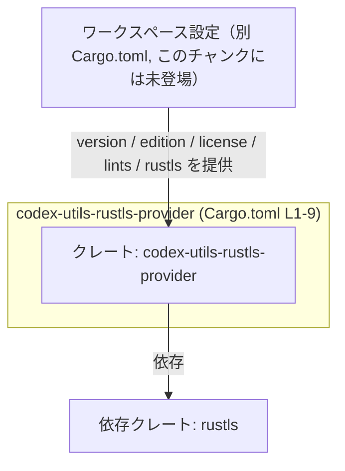
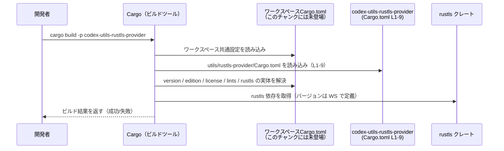

# utils/rustls-provider/Cargo.toml コード解説

## 0. ざっくり一言

`utils/rustls-provider/Cargo.toml` は、クレート `codex-utils-rustls-provider` の **パッケージメタデータと依存関係を定義する Cargo マニフェスト**です。ワークスペース共通設定（バージョン・エディション・ライセンス・リント設定・`rustls` 依存）を参照する構成になっています（`Cargo.toml:L1-9`）。

---

## 1. このモジュールの役割

### 1.1 概要

- このファイルは Cargo の設定ファイルであり、Rust コード（関数・構造体）は含みません。
- `codex-utils-rustls-provider` というクレート名を定義し（`Cargo.toml:L1-2`）、  
  バージョン・エディション・ライセンスはワークスペース側で一元管理されるよう設定されています（`Cargo.toml:L3-5`）。
- また、リント設定と `rustls` 依存もワークスペース定義をそのまま利用する構成になっています（`Cargo.toml:L6-9`）。

### 1.2 アーキテクチャ内での位置づけ

- このクレートは Cargo ワークスペースに参加しており、メタデータや依存の多くをワークスペースに委譲しています（`*.workspace = true` の指定から分かります。`Cargo.toml:L3-5,L7,L9`）。
- 自身は `rustls` クレートに依存するユーティリティクレート（名称からの推測）として位置づけられますが、具体的な API やロジックはこのファイルからは分かりません（Rust コードがこのチャンクには存在しないため）。

次の Mermaid 図は、このチャンク（`Cargo.toml:L1-9`）から読み取れるレベルでの依存関係を表します。



### 1.3 設計上のポイント

この Cargo 設定から読み取れる設計上の特徴は次のとおりです。

- **ワークスペース一元管理**
  - バージョン・エディション・ライセンスを `*.workspace = true` で委譲しています（`Cargo.toml:L3-5`）。  
    → 全クレートでこれらを統一しやすい構成です。
- **リント設定の集約**
  - `[lints]` セクションで `workspace = true` を指定しており（`Cargo.toml:L6-7`）、警告レベルや Clippy 設定などをワークスペースで一括管理する方針が示されています。
- **依存関係の集中管理**
  - `rustls` 依存を `{ workspace = true }` で参照しており（`Cargo.toml:L8-9`）、`rustls` のバージョンもワークスペース側で統一されます。
- **状態・並行性**
  - このファイルは純粋な設定ファイルであり、状態を持つオブジェクトや並行処理（スレッド・非同期）に関する実装は含まれていません。

---

## 2. 主要な機能一覧（設定内容の概要）

このファイル自体は実行ロジックを持ちませんが、「どのような設定を提供しているか」を機能として整理します。

### 2.1 コンポーネントインベントリー（このファイルで確認できるもの）

| 名称                           | 種別                 | 定義位置             | 説明 |
|--------------------------------|----------------------|----------------------|------|
| `codex-utils-rustls-provider`  | パッケージ / クレート | `Cargo.toml:L1-2`    | ワークスペース内の 1 クレートとして登録されているパッケージ名です。 |
| `version.workspace = true`     | パッケージ設定       | `Cargo.toml:L3`      | バージョン番号をワークスペース共通設定から継承します。 |
| `edition.workspace = true`     | パッケージ設定       | `Cargo.toml:L4`      | Rust エディションをワークスペース共通設定から継承します。 |
| `license.workspace = true`     | パッケージ設定       | `Cargo.toml:L5`      | ライセンス表記をワークスペース共通設定から継承します。 |
| `[lints] workspace = true`     | リント設定           | `Cargo.toml:L6-7`    | コンパイラ/Clippy のリント設定をワークスペースから継承します。 |
| `rustls = { workspace = true }`| 依存関係             | `Cargo.toml:L8-9`    | `rustls` クレートへの依存をワークスペース共通設定から継承します。 |

### 2.2 機能の箇条書き

- **パッケージメタデータの定義**  
  クレート名と、ワークスペース継承のバージョン・エディション・ライセンスを指定します（`Cargo.toml:L1-5`）。
- **ワークスペース共通のリント設定の利用**  
  `[lints]` セクションで `workspace = true` とし、リントポリシーを共有します（`Cargo.toml:L6-7`）。
- **`rustls` 依存の宣言**  
  `rustls` への依存を宣言し、そのバージョン情報をワークスペースで管理します（`Cargo.toml:L8-9`）。

---

## 3. 公開 API と詳細解説

### 3.1 型一覧（構造体・列挙体など）

このファイルは Cargo の設定ファイルであり、Rust の型定義（構造体・列挙体・トレイトなど）は含まれていません。  
したがって、このチャンクから説明できる「公開型」は存在しません。

### 3.2 関数詳細（最大 7 件）

同様に、関数やメソッド定義も一切含まれていません。Cargo.toml はビルドシステムが解釈するメタデータであり、このファイルに対して「関数詳細テンプレート」を適用できる対象はありません。

- 関数数: 0（Rust コードが存在しないため。`Cargo.toml:L1-9` 内はすべて TOML 設定行です）

### 3.3 その他の関数

- 該当なし（このファイルには関数やメソッドは存在しません）。

---

## 4. データフロー

ここでは、「この Cargo.toml がビルド時にどのように利用されるか」という観点で、抽象的なデータフローを示します。これは Cargo の一般的な挙動に基づく説明であり、本チャンクに他ファイルは含まれていません。

### 4.1 ビルド時のフロー（概念図）

1. 開発者がワークスペースルートで `cargo build -p codex-utils-rustls-provider` を実行する。
2. Cargo はワークスペースルートの `Cargo.toml`（このチャンクには未登場）を読み、共通設定（version / edition / license / lints / `rustls` 依存）を解決する。
3. Cargo はこのクレートの `utils/rustls-provider/Cargo.toml`（`Cargo.toml:L1-9`）を読み、`name` と `*.workspace = true` 指定を元に最終的なパッケージ設定を構築する。
4. Cargo は `rustls` 依存のバージョンなどをワークスペース設定から決定し、依存解決グラフを構築する（`Cargo.toml:L8-9`）。
5. その後、`rustc` に対してこのクレートと `rustls` を含む依存グラフを渡してビルドを行う。

これを sequence diagram で表すと次のようになります。



※ `WS`（ワークスペースルートの `Cargo.toml`）と `Rustls` の具体的な定義内容は、このチャンクには現れません。

---

## 5. 使い方（How to Use）

### 5.1 基本的な使用方法

このファイル自体を直接操作することは少なく、多くの場合は Cargo コマンドを通じて利用されます。

#### ビルド・テストの例

```bash
# ワークスペース全体をビルド
cargo build

# このクレートだけをビルド（name は Cargo.toml:L2 に対応）
cargo build -p codex-utils-rustls-provider

# テストを実行
cargo test -p codex-utils-rustls-provider
```

- `-p codex-utils-rustls-provider` の部分は `name = "codex-utils-rustls-provider"` に対応します（`Cargo.toml:L2`）。

#### このクレート内で `rustls` を使うコード例（一般的な例）

以下は、「この Cargo.toml で `rustls` が依存に入っている場合に、クレート内の Rust コードから `rustls` を利用する典型例」のイメージです。  
この具体的な関数がリポジトリ内に存在するかどうかは、このチャンクからは分かりません。

```rust
use rustls::{ClientConfig, RootCertStore}; // rustls 依存は Cargo.toml:L8-9 で宣言されている想定

// クライアント用 TLS 設定を構築する例
fn build_client_config() -> ClientConfig {
    let mut root_store = RootCertStore::empty();                // ルート証明書ストアを初期化
    // （証明書の読み込みなどをここで行う想定）

    ClientConfig::builder()                                    // Builder パターンで ClientConfig を構築
        .with_root_certificates(root_store)
        .with_no_client_auth()
}
```

### 5.2 よくある使用パターン（ワークスペース設定との連携）

このファイルから推測できる「使われ方」のパターンは次のとおりです。

- **複数クレート間での設定共有**  
  - 同一ワークスペース内の他クレートと、バージョン・エディション・ライセンス・リント設定・`rustls` バージョンを揃えるために、`*.workspace = true` を利用する（`Cargo.toml:L3-5,L7,L9`）。
- **rustls ユーティリティとしての利用（名称からの推測）**  
  - 他クレートが `codex-utils-rustls-provider` に依存し、その内部で `rustls` をラップした機能を提供している可能性がありますが、これは Cargo.toml のみからは断定できません。

### 5.3 よくある間違い

この種の設定で起こり得る典型的な問題を示します（このリポジトリ固有ではなく、一般論です）。

```toml
# 間違い例: rustls を workspace 参照にしているが、
# ワークスペース側で rustls が定義されていない場合
[dependencies]
rustls = { workspace = true }
```

- 上記のように `workspace = true` を指定しているのに、ワークスペースルートの `Cargo.toml` で `rustls` が定義されていないと、  
  Cargo は依存を解決できずビルドエラーになります。

```toml
# 正しい例（一般的な構成イメージ）
[workspace.dependencies]
rustls = "0.21" # バージョンは例

# メンバー側（本ファイル側）
[dependencies]
rustls = { workspace = true }
```

### 5.4 使用上の注意点（まとめ）

- **ワークスペース設定の前提**  
  - `version.workspace`, `edition.workspace`, `license.workspace`, `lints.workspace`, `rustls.workspace` を利用しているため（`Cargo.toml:L3-5,L7,L9`）、  
    ワークスペースルートの `Cargo.toml` に対応する設定が存在することが前提です。存在しない場合、ビルドエラーになります。
- **言語固有の安全性・並行性について**  
  - このファイルは設定のみであり、メモリ安全性・スレッド安全性・並行処理などのロジックは含まれていません。  
    それらは実際の Rust コード側（`src/*.rs` など、このチャンクには未登場）で検討する必要があります。
- **セキュリティ上の注意**  
  - `rustls` の具体的なバージョンや設定はワークスペース側に委譲されているため（`Cargo.toml:L8-9`）、  
    セキュリティ観点では「ワークスペースでどのバージョンの `rustls` を採用しているか」が重要になります。  
    本チャンクだけからはそのバージョンは分かりません。

---

## 6. 変更の仕方（How to Modify）

### 6.1 新しい機能（設定）を追加する場合

Cargo.toml に対して行う代表的な変更パターンを示します。

1. **新しい依存クレートを追加する**
   - このクレートで別のライブラリを使いたい場合、`[dependencies]` セクションに追記します。
   - ワークスペースで依存を一元管理したい場合は、ワークスペースルートの `Cargo.toml` にも `workspace.dependencies` として追加し、  
     このファイル側では `{ workspace = true }` を使うパターンが一般的です（一般論であり、本チャンクにはワークスペース定義はありません）。

2. **機能フラグ（features）を追加する**
   - 追加のオプション機能を提供したい場合は、このファイルに `[features]` セクションを新設し、必要な依存を feature 経由で有効化することができます。
   - `features` セクションは現在このファイルには存在しません（`Cargo.toml:L1-9` に見当たらないため）。

### 6.2 既存の機能（設定）を変更する場合

変更時に確認すべきポイントです。

- **クレート名の変更**（`Cargo.toml:L2`）
  - `name` を変更すると、`cargo build -p <name>` などで指定する名前が変わります。  
    他クレートが `codex-utils-rustls-provider` を依存として指定している場合、その依存指定も合わせて変更する必要がありますが、  
    そうした依存元はこのチャンクには現れません。

- **ワークスペース継承の解除**（`Cargo.toml:L3-5,L7,L9`）
  - 例えば `version.workspace = true` をやめて個別に `version = "0.x.y"` と書くことも可能です。  
    その場合、このクレートだけバージョンやライセンス、`rustls` バージョンが他と異なる可能性が出るため、  
    ワークスペース全体の整合性を意識する必要があります。

- **エラー条件**
  - ワークスペース側で `version` や `rustls` などが未定義なのに `*.workspace = true` を指定すると、Cargo の解決時にエラーになります。  
    このエラーはビルド時に検出され、実行時エラーにはなりません。

---

## 7. 関連ファイル

このファイルと密接に関係すると考えられるファイルを、Cargo の仕様に基づく範囲で挙げます。

| パス                              | 役割 / 関係 |
|-----------------------------------|------------|
| （ワークスペースルートの）`Cargo.toml` | `version.workspace`, `edition.workspace`, `license.workspace`, `lints.workspace`、および `rustls = { workspace = true }` の実体（具体的な値やバージョン）を定義していると考えられます（Cargo のワークスペース機能の仕様による推定）。このファイル自体は本チャンクには含まれていません。 |
| `utils/rustls-provider/src/*.rs`  | `codex-utils-rustls-provider` クレートの実際の公開 API・コアロジック・安全性・並行性の実装は通常ここに置かれますが、このチャンクにはソースコードが含まれておらず、具体的な内容は不明です。 |

---

### まとめ

- `utils/rustls-provider/Cargo.toml` は、**ワークスペース主導でメタデータと依存を管理する rustls 関連クレートのマニフェスト**です（`Cargo.toml:L1-9`）。
- Rust の公開 API・関数・並行処理ロジックはこのファイルには存在せず、このチャンクだけからはそれらの詳細は分かりません。
- 安全性・エラー・並行性・パフォーマンスの検討は、`rustls` のバージョン（ワークスペースで定義）と、このクレートの Rust ソースコード（このチャンクには未登場）を合わせて確認する必要があります。
