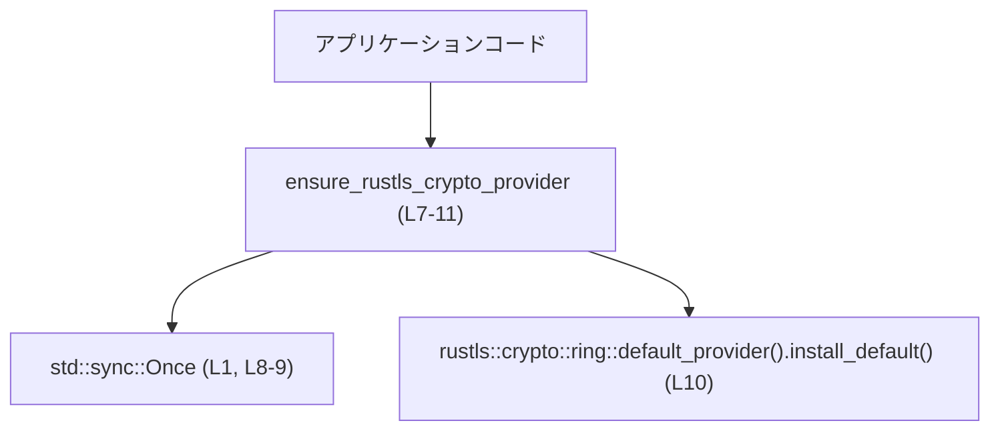
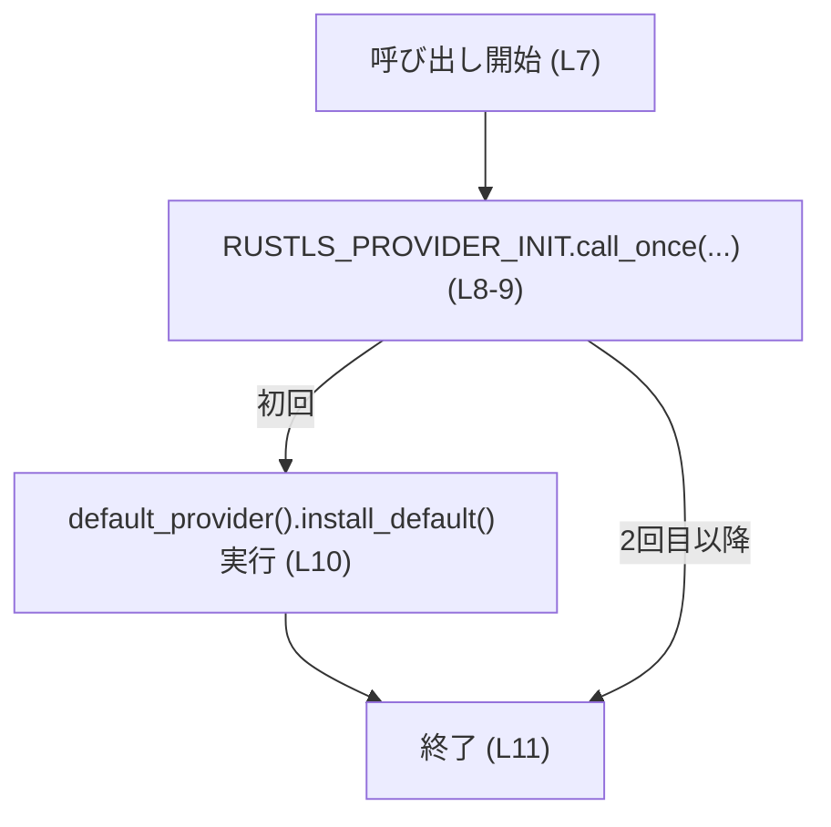
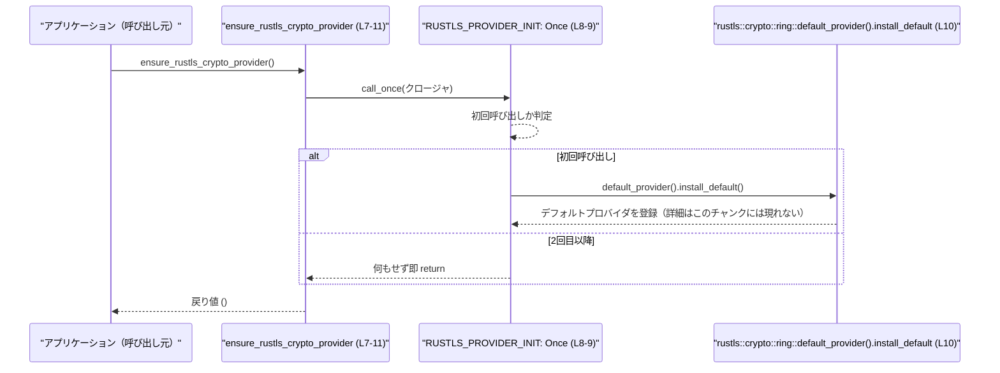

# `utils/rustls-provider/src/lib.rs` コード解説

---

## 0. ざっくり一言

`rustls` の「暗号プロバイダ（crypto provider）」を **プロセス全体で一度だけ** `ring` 実装に固定してインストールするための小さなユーティリティ関数を提供するモジュールです（根拠: `utils/rustls-provider/src/lib.rs:L3-10`）。

---

## 1. このモジュールの役割

### 1.1 概要

- このモジュールは、`rustls` 利用時に **どの暗号ライブラリを使うか選べない状況**（`ring` と `aws-lc-rs` の両方が依存に入っている）を解決するために存在しています（根拠: コメント `utils/rustls-provider/src/lib.rs:L3-6`）。
- `ensure_rustls_crypto_provider` 関数を通じて、`rustls::crypto::ring::default_provider().install_default()` を **プロセス内で一度だけ呼び出す** ことで、`ring` ベースのプロバイダをデフォルトとして登録します（根拠: `utils/rustls-provider/src/lib.rs:L7-10`）。

### 1.2 アーキテクチャ内での位置づけ

このモジュールは、アプリケーションコードと `rustls` の暗号プロバイダ選択の間に挟まる「初期化ユーティリティ」として位置づけられます。



- アプリケーションは TLS を使う前に `ensure_rustls_crypto_provider` を呼び出します。
- 関数内では `std::sync::Once` を使い、`install_default` の呼び出しが **並行環境でも一度だけ** 実行されるようにしています（根拠: `utils/rustls-provider/src/lib.rs:L1, L7-9`）。
- 実際の暗号処理や TLS ハンドシェイクは `rustls` 側で行われ、このモジュールからは見えません（このチャンクには現れない）。

### 1.3 設計上のポイント

- **責務の分割**
  - このファイルは「プロセスワイドな暗号プロバイダ選択と初期化」に責務を限定しています（根拠: コメントと単一関数構成 `utils/rustls-provider/src/lib.rs:L3-10`）。
- **状態管理**
  - グローバル状態は `std::sync::Once` の静的インスタンスのみで、プロセス全体で共有されます（根拠: `static RUSTLS_PROVIDER_INIT: Once = Once::new();` `utils/rustls-provider/src/lib.rs:L8`）。
  - Once により、**一度だけ初期化を行う** ことが保証されます（Once の仕様）。
- **エラーハンドリング**
  - `install_default` の戻り値は `_` に束縛され、その後使われていないため、成功・失敗にかかわらず呼び出し元からは判別できません（根拠: `let _ = ...install_default();` `utils/rustls-provider/src/lib.rs:L10`）。
- **並行性**
  - `std::sync::Once` を使うことで、複数スレッドから同時に `ensure_rustls_crypto_provider` が呼ばれても、初期化処理が相互排他かつ一度だけ実行されるようになっています（根拠: `utils/rustls-provider/src/lib.rs:L1, L8-9`）。

---

## 2. 主要な機能一覧（＋コンポーネントインベントリー）

### 2.1 機能一覧

- `ensure_rustls_crypto_provider`: プロセスワイドな `rustls` の暗号プロバイダを `ring` 実装に設定する初期化関数。

### 2.2 コンポーネントインベントリー（このチャンク）

| 種別 | 名前 | 公開性 | 位置 | 説明 |
|------|------|--------|------|------|
| 関数 | `ensure_rustls_crypto_provider` | `pub` | `utils/rustls-provider/src/lib.rs:L7-11` | `rustls` の暗号プロバイダを `ring` に設定する初期化関数 |
| 関数内 static | `RUSTLS_PROVIDER_INIT` | 関数内スコープ（外部非公開） | `utils/rustls-provider/src/lib.rs:L8-9` | 初期化コードを一度だけ実行するための `std::sync::Once` インスタンス |
| 外部型 | `std::sync::Once` | 外部ライブラリ（標準ライブラリ） | `utils/rustls-provider/src/lib.rs:L1, L8` | 一度だけ実行される初期化を提供する同期プリミティブ |
| 外部関数/メソッド | `rustls::crypto::ring::default_provider().install_default()` | 外部ライブラリ (`rustls`) | `utils/rustls-provider/src/lib.rs:L10` | `ring` ベースの暗号プロバイダを `rustls` のデフォルトとして登録する処理（詳細はこのチャンクには現れない） |

---

## 3. 公開 API と詳細解説

### 3.1 型一覧（構造体・列挙体など）

このファイル内で **新たに定義されている公開型（構造体・列挙体など）はありません**。

- 利用している型は標準ライブラリの `std::sync::Once` と、`rustls` クレート内の型（`crypto::ring` 系）だけです（根拠: `utils/rustls-provider/src/lib.rs:L1, L10`）。

### 3.2 関数詳細

#### `ensure_rustls_crypto_provider() -> ()`

**概要**

- プロセス全体で一度だけ、`rustls` の暗号プロバイダを `rustls::crypto::ring` のデフォルトプロバイダに設定する関数です（根拠: コメントと本体 `utils/rustls-provider/src/lib.rs:L3-10`）。
- 複数回・複数スレッドから呼び出されても、実際の `install_default()` 呼び出しは一度きりになるように制御されています（根拠: `std::sync::Once` 利用 `utils/rustls-provider/src/lib.rs:L1, L8-9`）。

**引数**

引数はありません。

| 引数名 | 型 | 説明 |
|--------|----|------|
| （なし） | - | - |

**戻り値**

- 戻り値は `()`（ユニット型）です（暗黙的な戻り値）。関数シグネチャには明示されていませんが、何も返していないため `()` と解釈されます（根拠: 戻り値型未指定の `pub fn` `utils/rustls-provider/src/lib.rs:L7-11`）。
- 初期化の成功・失敗を返さないため、呼び出し側は結果を直接知ることはできません（根拠: `let _ = ...install_default();` `utils/rustls-provider/src/lib.rs:L10`）。

**内部処理の流れ（アルゴリズム）**

1. 関数スコープ内に `static RUSTLS_PROVIDER_INIT: Once = Once::new();` を宣言します（根拠: `utils/rustls-provider/src/lib.rs:L8`）。
   - これにより、この関数全体で共有される `Once` インスタンスが 1 つだけ生成されます（関数が何回呼ばれても同じインスタンス）。
2. `RUSTLS_PROVIDER_INIT.call_once(|| { ... })` を呼び出します（根拠: `utils/rustls-provider/src/lib.rs:L9`）。
   - `call_once` は、渡されたクロージャを **一度だけ実行する** 標準ライブラリのメソッドです。
3. 初回の `call_once` 呼び出し時のみ、クロージャ内の処理が実行されます。
4. クロージャ内で `rustls::crypto::ring::default_provider().install_default()` を呼び出し、その戻り値を `_` に束縛した上で何もせずに破棄します（根拠: `utils/rustls-provider/src/lib.rs:L10`）。
   - これにより、`ring` ベースの暗号プロバイダが `rustls` のデフォルトにインストールされます（この挙動は `rustls` の API 仕様による）。
5. 2 回目以降に `ensure_rustls_crypto_provider` が呼ばれた場合、`call_once` はクロージャを実行せずに即座に復帰し、何も行いません（Once の仕様）。

簡易フローチャート:



**Examples（使用例）**

1. アプリケーション起動時に一度だけ呼ぶ例（同一ファイル内の想定コード）

```rust
// TLS を使う前に、暗号プロバイダを確実に設定する
fn init_tls() {
    // プロセスワイドに `ring` プロバイダをインストール
    ensure_rustls_crypto_provider();

    // ここで rustls のクライアント / サーバ設定を構築する
    // （このチャンクには具体的な設定コードは現れません）
}
```

- このように、TLS 設定や接続を行う「前段」で一度呼び出しておくのが典型的な使い方です。

1. 任意の場所で安全に何度呼んでも良い例

```rust
fn handle_request() {
    // 万一まだ初期化されていなくても、一度だけ実行されるので安全
    ensure_rustls_crypto_provider();

    // 以降の処理で rustls を利用する
}
```

- `Once` により、並行なリクエスト処理内でこの関数を複数回呼んでも、初期化は一度きりです。

**Errors / Panics**

- この関数自身は `Result` や `Option` を返さないため、**エラーとしては何も通知しません**（根拠: 戻り値型が `()` `utils/rustls-provider/src/lib.rs:L7-11`）。
- `install_default` の戻り値は `_` に束縛して捨てているため、仮に `Result` などでエラーを返していたとしても、それを検出・伝播していません（根拠: `let _ = ...install_default();` `utils/rustls-provider/src/lib.rs:L10`）。
- パニックについて:
  - `call_once` に渡したクロージャ中でパニックが発生した場合、そのパニックは呼び出し元まで伝播します（Once はパニックを捕捉して握りつぶしません）。
  - このクロージャ内でパニックが起こりうるかどうかは `default_provider()` と `install_default()` の実装に依存し、このチャンクからは分かりません（このチャンクには現れない）。

**Edge cases（エッジケース）**

- **複数回呼び出し**
  - 何度呼び出しても、`default_provider().install_default()` が実行されるのは最初の一回だけです（根拠: `std::sync::Once` 利用 `utils/rustls-provider/src/lib.rs:L1, L8-9`）。
- **並行呼び出し**
  - 複数スレッドから同時に呼び出された場合も、`Once` が内部で同期を取り、初期化処理が一度だけ実行されます（根拠: `Once` 利用 `utils/rustls-provider/src/lib.rs:L1, L8-9`）。
- **プロバイダのインストール失敗**
  - `install_default` が失敗した場合にどのような状況になるかは、このコードだけからは判別できません（戻り値を無視しているため、観測手段がありません。根拠: `utils/rustls-provider/src/lib.rs:L10`）。
- **`rustls` のビルド構成**
  - コメントにある通り、`ring` と `aws-lc-rs` の両方が依存に入っていると自動選択できないため、この関数が必要になります（根拠: コメント `utils/rustls-provider/src/lib.rs:L5-6`）。
  - 実際に両方の機能が有効かどうかはこのチャンクからは分かりません（ビルド設定はこのチャンクには現れない）。

**使用上の注意点**

- **呼び出しタイミング**
  - `rustls` を用いた TLS 接続や設定を行う前に呼び出しておくと、暗号プロバイダが確実に設定された状態で動作します。
- **戻り値を使えない**
  - 初期化の成否は戻り値からは分からないため、「確実に設定されたかどうかをコード上でチェックしたい」という用途には向きません。
- **プロバイダの固定**
  - この実装では `ring` ベースのプロバイダを選んでいます（根拠: `rustls::crypto::ring::default_provider()` 呼び出し `utils/rustls-provider/src/lib.rs:L10`）。
  - もし別のプロバイダ（例: `aws-lc-rs`）を使いたい場合は、クロージャ内の呼び出し先を変更する必要があります。
- **プロセスワイドな影響**
  - `install_default` はプロセス全体のデフォルトプロバイダを設定する API であるため、一度呼び出すとプロセス内の全ての `rustls` 利用箇所に影響します。これは `rustls` の API の性質であり、この関数単体では制御できません。

### 3.3 その他の関数

- このファイルには `ensure_rustls_crypto_provider` 以外の関数定義はありません（根拠: 全行確認 `utils/rustls-provider/src/lib.rs:L1-11`）。

---

## 4. データフロー

このセクションでは、代表的なシナリオとして「アプリケーションが TLS を使う前に `ensure_rustls_crypto_provider` を呼ぶ」場合のデータフローを示します。

### 4.1 シーケンス図



要点:

- アプリケーションから見えるのは、`ensure_rustls_crypto_provider()` を呼ぶことだけです。
- その内部で `Once` が初期化済みかどうかを判定し、未初期化なら `rustls` のプロバイダ登録処理を一度だけ実行します。
- `install_default` の内部処理（どのようにグローバル状態を更新するか）は `rustls` クレート側の実装であり、このチャンクからは読み取れません。

---

## 5. 使い方（How to Use）

### 5.1 基本的な使用方法

典型的には、TLS 関連の処理を行う前に一度だけ呼び出します。

```rust
// TLS 利用前の初期化処理
fn main() {
    // 1. rustls の暗号プロバイダを設定する
    ensure_rustls_crypto_provider();

    // 2. ここで rustls ベースのクライアント / サーバ設定を行う
    //    （このチャンクには具体的な設定コードは現れません）

    // 3. アプリケーション本体の処理
}
```

- `ensure_rustls_crypto_provider` を最初に呼ぶことで、以降の TLS 処理が期待するプロバイダ（ここでは `ring`）に基づいて動作することが期待されます（コメントの意図より、根拠: `utils/rustls-provider/src/lib.rs:L3-6`）。

### 5.2 よくある使用パターン

1. **アプリケーション起動時に一度だけ呼ぶ**

```rust
fn init_app() {
    // グローバル初期化の一部として呼ぶ
    ensure_rustls_crypto_provider();

    // ほかの初期化処理...
}
```

- メリット: プロバイダ設定が確実に完了した状態で TLS を使い始められます。

1. **遅延初期化として、必要なときに呼ぶ**

```rust
fn connect_tls_server() {
    // 初回呼び出し時にだけプロバイダを設定
    ensure_rustls_crypto_provider();

    // ここで TLS コネクションを張る処理を行う
}
```

- メリット: TLS を実際に使う状況にならない限りプロバイダ設定を行わないため、起動時間への影響を最小化できます。
- `Once` により、複数の箇所からこの関数を呼んでも安全です。

### 5.3 よくある間違い（推測されるもの）

コードから推測できる範囲で、起こりうる誤用を挙げます。

```rust
// 誤りの可能性がある例
fn make_tls_config_without_provider() {
    // ensure_rustls_crypto_provider を呼ばずに rustls を利用
    // （コメントによれば、ring と aws-lc-rs 両方が有効な場合に
    //  プロバイダが自動選択されない可能性があります）
    // ...
}
```

- コメントによれば、`ring` と `aws-lc-rs` の両方が有効な場合、`rustls` は自動でプロバイダを選べないため、明示的にどちらかを選ぶ必要があります（根拠: `utils/rustls-provider/src/lib.rs:L5-6`）。
- そのため、上記のように「プロバイダ設定を行わずに TLS 設定を組み立てる」ことは、期待しない挙動につながる可能性があります（詳しい挙動はこのチャンクからは不明）。

```rust
// より安全な例
fn make_tls_config() {
    // まずプロバイダを確実に設定
    ensure_rustls_crypto_provider();

    // その後に rustls の設定・接続処理を行う
}
```

### 5.4 使用上の注意点（まとめ）

- **スレッド安全性**
  - `std::sync::Once` により、マルチスレッド環境でも初期化が重複して行われないようになっています。
- **グローバルな副作用**
  - 一度 `install_default` が呼ばれると、プロセス全体で `ring` プロバイダが使われるようになります。
- **エラー検出不可**
  - 現行実装では `install_default` の戻り値を無視しているため、インストールの失敗を検出してリカバリすることはできません。
- **構成依存**
  - コメントが示す通り、この関数は特に「`ring` と `aws-lc-rs` が同時に依存に含まれる構成」を想定していますが、実際にそうなっているかはこのチャンクだけでは分かりません。

---

## 6. 変更の仕方（How to Modify）

### 6.1 新しい機能を追加する場合

このモジュールに機能を追加する典型的なケースとしては、別の暗号プロバイダを選択できるようにする、もしくは初期化結果を返すようにする、などが考えられます。

- **別プロバイダ対応を追加する場合**
  1. 現在は `rustls::crypto::ring::default_provider()` を呼んでいる行（`utils/rustls-provider/src/lib.rs:L10`）を確認します。
  2. 他のプロバイダ（例: `aws-lc-rs`）を選択したい場合は、そのプロバイダに対応する `default_provider()` などの API に差し替える、あるいは条件付きで呼び分けるコードを追加します。
  3. 条件分岐ロジック（環境変数や設定値に応じて provider を選ぶなど）を導入する場合も、`call_once` のクロージャ内部に実装するのが自然です。

- **初期化結果を返す機能を追加する場合**
  1. `let _ = ...install_default();` としている行（`utils/rustls-provider/src/lib.rs:L10`）で戻り値を `_` ではなくローカル変数に束縛します。
  2. `Once` のクロージャ内で得られた結果をプロセスワイドに保持したい場合は、`OnceLock` など別の仕組みを使うことを検討する必要があります（このファイル内ではまだ使われていません）。
  3. 関数シグネチャを `-> Result<(), E>` のように変更すると、呼び出し側でエラーを扱いやすくなりますが、既存の呼び出しコードへの影響に注意が必要です（このチャンクには呼び出し側は現れません）。

### 6.2 既存の機能を変更する場合

- **影響範囲の確認**
  - `ensure_rustls_crypto_provider` は `pub fn` であるため、クレート外からも呼ばれている可能性があります（根拠: `utils/rustls-provider/src/lib.rs:L7`）。
  - シグネチャを変更する際は、クレート全体での参照箇所の洗い出しが必要です（このチャンクには参照は現れません）。

- **契約（前提条件・返り値）の維持**
  - 現在の契約:
    - 複数回呼び出しても安全（副作用は初回のみ）。
    - 戻り値で結果を通知しない。
  - これを変更する場合は、呼び出し側コードがその前提に依存していないか確認する必要があります。

- **エラー処理を追加する場合の注意**
  - `install_default` の戻り値を扱うように変更する際は、「既にプロバイダが設定されている場合」など、`rustls` 側 API がどのようなエラー条件を持つかを確認し、それを呼び出し側にどう伝えるか（`Result` / ログ / パニックなど）を統一的に設計する必要があります。

---

## 7. 関連ファイル

このチャンクから直接参照できるのは標準ライブラリと `rustls` クレートだけであり、同一リポジトリ内の他ファイルとの関連は読み取れません。

| パス / コンポーネント | 役割 / 関係 |
|------------------------|------------|
| `std::sync::Once`（標準ライブラリ） | 一度だけ実行される初期化を提供する同期プリミティブ。`RUSTLS_PROVIDER_INIT` の型として利用（根拠: `utils/rustls-provider/src/lib.rs:L1, L8`）。 |
| `rustls::crypto::ring::default_provider().install_default`（外部クレート） | `ring` ベースの暗号プロバイダを `rustls` のデフォルトとして登録する処理として呼び出される（根拠: `utils/rustls-provider/src/lib.rs:L10`）。 |
| （不明） | このチャンクにはテストコード（`tests` ディレクトリや `#[cfg(test)]` モジュール）は現れません。呼び出し元ファイルもこのチャンクには現れないため不明です。 |

---

### テスト・パフォーマンス・観測性について（補足）

- **テスト**
  - このファイル内に単体テストや doctest は定義されていません（`#[cfg(test)]` などが存在しないため、根拠: `utils/rustls-provider/src/lib.rs:L1-11`）。
- **パフォーマンス**
  - `std::sync::Once` は初期化済みかどうかのチェックと必要に応じた同期のみを行うため、初期化後のオーバーヘッドは非常に小さいことが一般に知られています。
  - そのため、関数を頻繁に呼んでも大きなパフォーマンス問題は生じにくい設計です。
- **観測性（ログなど）**
  - このコードにはログ出力やメトリクス計測処理は含まれていません（`println!`, `log!` などの呼び出しがないため、根拠: `utils/rustls-provider/src/lib.rs:L1-11`）。
  - 初期化がいつ・何回行われたかを観測したい場合は、`call_once` のクロージャ内にログを追加するのが自然な変更ポイントです。
