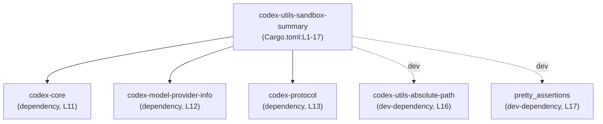
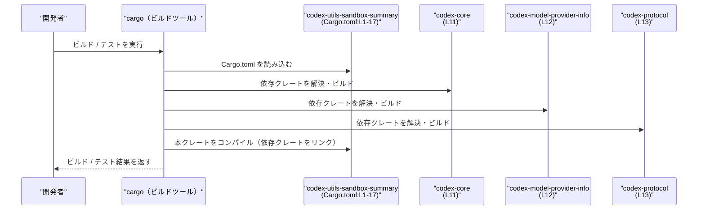

# utils/sandbox-summary/Cargo.toml コード解説

## 0. ざっくり一言

`codex-utils-sandbox-summary` クレートの **Cargo マニフェスト（パッケージと依存関係の定義ファイル）** です（Cargo.toml:L1-5, L10-17）。  
このファイル自体には Rust の型や関数は含まれていません。

---

## 1. このモジュールの役割

### 1.1 概要

- このファイルは、`codex-utils-sandbox-summary` という名前のクレートをワークスペース内に定義し（Cargo.toml:L1-2）、  
  バージョン・エディション・ライセンスをワークスペースの共通設定に委譲しています（Cargo.toml:L3-5）。
- さらに、共通の lint 設定を有効化し（Cargo.toml:L7-8）、本番用依存クレートと開発用依存クレートを宣言します（Cargo.toml:L10-17）。
- クレート名から「sandbox summary」関連のユーティリティである可能性がありますが、**このファイルだけではクレートが提供する具体的な機能は分かりません**。

### 1.2 アーキテクチャ内での位置づけ

この Cargo.toml から分かる範囲では、`codex-utils-sandbox-summary` クレートは以下のクレートに依存します。

- 本番依存（[dependencies] セクション, Cargo.toml:L10-13）
  - `codex-core`（Cargo.toml:L11）
  - `codex-model-provider-info`（Cargo.toml:L12）
  - `codex-protocol`（Cargo.toml:L13）
- 開発・テスト用依存（[dev-dependencies] セクション, Cargo.toml:L15-17）
  - `codex-utils-absolute-path`（Cargo.toml:L16）
  - `pretty_assertions`（Cargo.toml:L17）

Mermaid で依存関係を示すと次のようになります。



これら依存クレートの **中身や API、ディレクトリ構成は、このチャンクには現れません**。

### 1.3 設計上のポイント

コードから読み取れる設計上の特徴は次のとおりです。

- **ワークスペース集中管理**
  - `version.workspace = true` / `edition.workspace = true` / `license.workspace = true` により（Cargo.toml:L3-5）、  
    バージョン・エディション・ライセンスはワークスペースルート側で一元管理されています。
  - 依存クレートにも `workspace = true` が付いており（Cargo.toml:L11-13, L16-17）、  
    依存のバージョン等もワークスペースで共通化されています。
- **lint 設定の一元化**
  - `[lints] workspace = true` により（Cargo.toml:L7-8）、lint ルールもワークスペースで共通管理されています。
- **シンプルなマニフェスト**
  - features、build script（`build = "build.rs"`）、`[features]` セクションなどは **このチャンクには現れません**。
  - そのため、このクレート固有のビルドオプションや feature フラグは、少なくとも Cargo.toml には定義されていないか、別ファイルにあります（詳細は不明）。

---

## 2. 主要な機能一覧

このファイルは設定ファイルであり実行ロジックは持ちませんが、「Cargo マニフェストとして提供している機能」を整理すると次のようになります。

- パッケージ識別情報の定義:  
  `name` と、ワークスペース由来の `version` / `edition` / `license` の設定（Cargo.toml:L1-5）。
- lint 設定の継承:  
  ワークスペース共通の lint ルールをこのクレートにも適用（Cargo.toml:L7-8）。
- 本番用依存クレートの宣言:  
  `codex-core` / `codex-model-provider-info` / `codex-protocol` への依存を宣言（Cargo.toml:L10-13）。
- 開発・テスト用依存クレートの宣言:  
  `codex-utils-absolute-path` / `pretty_assertions` を dev-dependency として宣言（Cargo.toml:L15-17）。

---

## 3. 公開 API と詳細解説

### 3.1 型一覧（構造体・列挙体など）

このファイルは **Cargo の設定ファイル** であり、Rust の構造体や列挙体の定義は含まれていません（Cargo.toml:L1-17）。

このため、ここでは **「コンポーネント（クレートや依存クレート）」のインベントリー** として整理します。

| 名前                        | 種別                 | 役割 / 用途（このファイルから分かる範囲）                                                                                 | 根拠                      |
|---------------------------|----------------------|----------------------------------------------------------------------------------------------------------------------------|---------------------------|
| `codex-utils-sandbox-summary` | パッケージ / クレート | 本ファイルで定義されるクレートの名前。具体的な機能内容はこのチャンクからは不明。                                          | Cargo.toml:L1-2          |
| `codex-core`              | 依存クレート         | 本クレートから利用されるコア機能クレートと推測されるが、API 内容は不明。                                                   | Cargo.toml:L10-11        |
| `codex-model-provider-info` | 依存クレート       | モデルプロバイダ情報に関係するクレート名だが、具体的役割や API は本チャンクには現れない。                                   | Cargo.toml:L10-12        |
| `codex-protocol`          | 依存クレート         | プロトコル関連クレート名だが、詳細は不明。                                                                                 | Cargo.toml:L10-13        |
| `codex-utils-absolute-path` | 開発用依存クレート | 開発・テスト時に利用されるユーティリティクレート。絶対パス関連ユーティリティであることが名前から想像されるが、詳細は不明。 | Cargo.toml:L15-16        |
| `pretty_assertions`       | 開発用依存クレート   | テスト等で利用されるアサーション補助クレート名だが、具体的な利用箇所はこのチャンクには現れない。                           | Cargo.toml:L15-17        |

> 備考: 依存クレートがワークスペースメンバーか外部クレートかは、`workspace = true` からは断定できません。  
> バージョンなどの詳細はワークスペースルート側の Cargo.toml にあると考えられますが、**このチャンクには現れません**。

### 3.2 関数詳細（最大 7 件）

このファイルには Rust の関数・メソッド・モジュール定義は一切含まれていません（Cargo.toml:L1-17）。  
したがって、**詳解すべき公開関数やコアロジックはこのチャンクには存在しません**。

このクレートが提供する実際の公開 API（関数・型）は、ソースコード側（例: `src/` 以下の `.rs` ファイル）に定義されているはずですが、その内容はこのファイルだけからは分かりません。

### 3.3 その他の関数

- 補助的な関数やラッパー関数も、このファイルには存在しません。

---

## 4. データフロー

このファイルにロジックはありませんが、**ビルド時のデータフロー** の中でどのように利用されるかを整理します。

1. 開発者がワークスペースで `cargo build` や `cargo test` を実行する。
2. Cargo はワークスペースルートと、この `codex-utils-sandbox-summary` の Cargo.toml（Cargo.toml:L1-17）を読み込む。
3. `[dependencies]` の `codex-core` / `codex-model-provider-info` / `codex-protocol` を解決・ビルドし（Cargo.toml:L10-13）、本クレートとリンクする。
4. `cargo test` の場合は、`[dev-dependencies]` の `codex-utils-absolute-path` / `pretty_assertions` も解決され、テストコードから利用される（Cargo.toml:L15-17）。

この流れを sequence diagram で示します。



開発用依存（`codex-utils-absolute-path`, `pretty_assertions`）は、テストや補助ツール内で利用されると考えられますが、**どのファイルからどう呼ばれるかはこのチャンクには現れません**。

---

## 5. 使い方（How to Use）

### 5.1 基本的な使用方法

この Cargo.toml を含むワークスペースにおいて、`codex-utils-sandbox-summary` クレートをビルド・テストする典型的な例です。

```bash
# ワークスペースルートで、本クレートだけをビルドする例
cargo build -p codex-utils-sandbox-summary

# ワークスペースルートで、本クレートのテストを実行する例
cargo test -p codex-utils-sandbox-summary
```

- クレート名 `codex-utils-sandbox-summary` は `name` フィールドに対応します（Cargo.toml:L2）。
- 実際にビルド可能かどうかは、ワークスペースの構成や他クレートの定義に依存します。このチャンクからはそこまで確認できません。

### 5.2 よくある使用パターン

このファイルレベルで想定される利用パターンは次のとおりです。

1. **依存クレートの追加・更新**
   - 新しい機能を実装する際、必要なクレートを `[dependencies]` または `[dev-dependencies]` に追加する。
   - 本ファイルでは既存依存はすべて `workspace = true` にしているため（Cargo.toml:L11-13, L16-17）、  
     追加する依存も同様にワークスペース集中管理にするかどうかを決める。

2. **ワークスペース共通設定の利用**
   - バージョン・エディション・ライセンス・lint 設定をワークスペースに任せる構成のため（Cargo.toml:L3-5, L7-8）、  
     個別クレートでは基本的に追加設定のみに集中できる構成になっています。

### 5.3 よくある間違い

このファイルの構成から起こり得る誤り例と、その修正例を示します。

```toml
# （誤り例）同じ項目に workspace と個別指定を混在させる
[dependencies]
codex-core = { workspace = true, version = "0.1" } # 一般に避けるべき指定

# （望ましい一貫した例）ワークスペースに完全に委譲する
[dependencies]
codex-core = { workspace = true }

# （あるいは）このクレートだけバージョンを変えたいなら、workspace を外す
[dependencies]
codex-core = "0.1"
```

- このファイルでは既に `workspace = true` パターンで統一されているため（Cargo.toml:L3-5, L11-13, L16-17）、  
  個別バージョン指定を混ぜると設定が複雑になりやすい点に注意が必要です。
- 実際にどのパターンを採用すべきかは、ワークスペース全体のポリシー次第であり、このチャンクからは判断できません。

### 5.4 使用上の注意点（まとめ）

- **ワークスペース依存**  
  - バージョン・エディション・ライセンス・lint および依存クレート設定はワークスペース側に依存しているため（Cargo.toml:L3-5, L7-8, L11-13, L16-17）、  
    これらを変更したい場合はワークスペースルートの設定も確認する必要があります。
- **依存の追加・削除の影響**  
  - 依存クレートの追加や削除はビルドエラーや未使用依存の発生につながる可能性があります。  
    このファイルからはソースコード側の実際の利用状況が見えないため、変更時にはコード検索等で確認が必要です。
- **セキュリティ / ライセンス**  
  - 実際に利用される依存クレートのバージョンやライセンスはワークスペースの定義に依存します。  
    セキュリティポリシーやライセンス要件を満たすかどうかは、ワークスペースルートの設定も含めて確認する必要があります。

---

## 6. 変更の仕方（How to Modify）

### 6.1 新しい機能を追加する場合

新しい機能をこのクレートに追加する際、Cargo.toml 側で行う作業の例です。

1. **必要な依存クレートの検討**
   - 実装したい機能に外部クレートが必要か検討します。
2. **[dependencies] または [dev-dependencies] の更新**
   - 実装コードから利用するなら `[dependencies]`（Cargo.toml:L10-13）、
   - テストやツールからのみ利用するなら `[dev-dependencies]`（Cargo.toml:L15-17）  
     に依存を追加します。
   - ワークスペースでバージョンを一元管理する場合は `workspace = true` を付与し、  
     そうでない場合はローカルにバージョンを指定します。
3. **ワークスペースルートの確認**
   - `workspace = true` を付与した場合、その依存がワークスペースルートの Cargo.toml で定義されているかを確認・追加します。  
     （ワークスペースルートの内容はこのチャンクには現れないため、実際のパスや定義は別途確認が必要です。）

### 6.2 既存の機能を変更する場合

このファイルに関わる代表的な変更ポイントと注意事項です。

- **バージョン・エディション・ライセンスの変更**
  - 現状はすべて `workspace = true` でワークスペースに委譲されています（Cargo.toml:L3-5）。
  - このクレートだけ設定を変えたい場合は、該当項目から `workspace = true` を外し、明示的に値を指定する必要があります。
- **依存クレートの入れ替え・削除**
  - 不要になった依存を `[dependencies]` / `[dev-dependencies]` から削除する際は、  
    ソースコード側で参照が残っていないかを確認する必要があります（このチャンクからは参照状況は分かりません）。
- **lint 設定の変更**
  - `[lints] workspace = true` により lint 設定はワークスペースに依存しているため（Cargo.toml:L7-8）、  
    このクレートだけ別の lint ポリシーにしたい場合はワークスペース設定の変更または個別設定の追加が必要になります。

---

## 7. 関連ファイル

この Cargo.toml から推測される関連ファイル・ディレクトリを示します。  
ただし、**具体的なパスや存在はこのチャンクには現れない**ため、その旨を明記します。

| パス（推定 / 一般形）         | 役割 / 関係                                                                                                                                       |
|------------------------------|--------------------------------------------------------------------------------------------------------------------------------------------------|
| （ワークスペースルート）`Cargo.toml` | `version.workspace = true` / `edition.workspace = true` / `license.workspace = true` / `lints.workspace = true` などの共通設定を持つファイルと考えられますが、このチャンクには位置や内容は現れません（Cargo.toml:L3-5, L7-8）。 |
| `codex-core` 関連ディレクトリ | 依存クレート `codex-core` のソースツリー。実際のパス（例: `core/` など）はこのチャンクからは不明です（Cargo.toml:L11）。                                             |
| `codex-model-provider-info` 関連ディレクトリ | 同名クレートのソースツリー。役割は名前から想像されますが、コードやパスはこのチャンクには現れません（Cargo.toml:L12）。                                      |
| `codex-protocol` 関連ディレクトリ | 同名クレートのソースツリー。プロトコル定義などを含む可能性がありますが、詳細は不明です（Cargo.toml:L13）。                                                     |
| `codex-utils-absolute-path` 関連ディレクトリ | 開発用依存クレートのソースツリー。テストやツールから利用されると考えられますが、具体的な利用箇所やパスはこのチャンクには現れません（Cargo.toml:L16）。           |
| テストコード (`tests/`, `src/*_test.rs` 等) | `pretty_assertions` を利用するテストコードが存在すると考えられますが、ファイル構成や内容はこのチャンクには現れません（Cargo.toml:L17）。                                 |

---

### Bugs / Security / Edge Cases について

- このファイル自体は宣言的な設定のみであり、実行ロジックはありません（Cargo.toml:L1-17）。
- セキュリティ上の懸念やバグは、主に
  - 依存クレートのバージョン・feature、
  - ワークスペース共通設定  
  に依存しますが、それらの詳細はこのチャンクには現れません。
- Cargo 側の一般的挙動として、セクション名のタイプミスや不正な構文があるとビルド時にエラーになりますが、  
  このチャンクの内容は TOML として整合しており、構文エラーは見当たりません。

このファイル単体では並行性・エラーハンドリング・パフォーマンスに関するロジックは存在しないため、それらの詳細な解説は **このチャンクからは行えません**。
