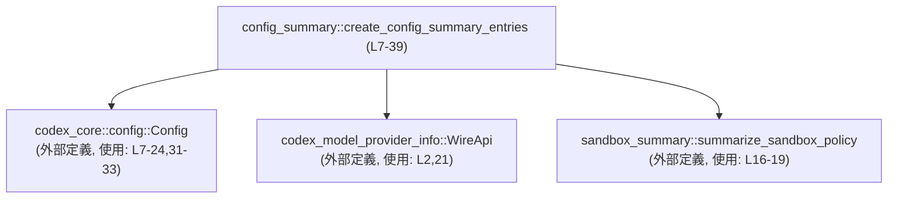
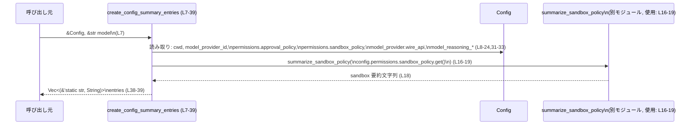

# utils/sandbox-summary/src/config_summary.rs コード解説

## 0. ざっくり一言

このファイルは、`Config` 構造体とモデル名から **設定内容の要約（key/value 文字列ペアの一覧）を構築する関数**を提供します（config_summary.rs:L6-7）。

---

## 1. このモジュールの役割

### 1.1 概要

- このモジュールは、アプリケーションの設定値（作業ディレクトリ、モデル名、プロバイダ、承認ポリシー、サンドボックス設定など）を、人が読みやすい形の **キー文字列と値文字列の一覧** にまとめるために存在します（config_summary.rs:L8-20）。
- モデル・プロバイダの種別に応じて、推論関連の設定（reasoning effort / reasoning summaries）の要約も含めるかどうかを切り替えます（config_summary.rs:L21-35）。

### 1.2 アーキテクチャ内での位置づけ

- 入力:
  - `codex_core::config::Config` 型の設定オブジェクト（config_summary.rs:L1, L7）。
  - モデル名の文字列（`&str`）（config_summary.rs:L7）。
- 依存:
  - `codex_model_provider_info::WireApi` 列挙体を用いて、プロバイダの wire API 種別を判定します（config_summary.rs:L2, L21）。
  - `crate::sandbox_summary::summarize_sandbox_policy` 関数にサンドボックスポリシーの要約を委譲します（config_summary.rs:L4, L16-19）。
- 出力:
  - `Vec<(&'static str, String)>` 形式の key/value ペア一覧（config_summary.rs:L7, L38-39）。

この関数は **状態を持たない純粋なユーティリティ関数**として機能し、どのコンテキストからも呼び出せる公開 API (`pub fn`) になっています（config_summary.rs:L7）。



### 1.3 設計上のポイント

- **責務集中**  
  - 公開関数は `create_config_summary_entries` 1 つだけで、設定要約の構築を一箇所に集約しています（config_summary.rs:L7-39）。
- **ステートレス / 副作用なし**  
  - 引数 `&Config` と `&str` を読み取るだけで、外部状態の変更や I/O は行っていません（config_summary.rs:L7-35）。
- **条件付き拡張**  
  - `config.model_provider.wire_api` が `WireApi::Responses` の場合にのみ、推論関連の要約エントリを追加する条件分岐があります（config_summary.rs:L21-35）。
- **Option の安全な取り扱い**  
  - `model_reasoning_effort` および `model_reasoning_summary` は `map` と `unwrap_or_else` によって `Option` を安全に文字列へ変換しています。`unwrap` などのパニックを起こしうる呼び出しは使っていません（config_summary.rs:L22-24, L27, L31-34）。
- **サンドボックスロジックの分離**  
  - サンドボックス設定の詳細な要約ロジックは `summarize_sandbox_policy` に委譲し、このモジュールはその結果を文字列として受け取るだけです（config_summary.rs:L16-19）。

---

## 2. 主要な機能一覧

- 設定要約エントリ生成: `Config` とモデル名から、設定内容の要約を表す key/value 文字列ペアの一覧を生成する（config_summary.rs:L7-39）。

### 2.1 コンポーネントインベントリー（このチャンク）

| 種別 | 名前 | 公開 | 概要 | 定義/使用位置 |
|------|------|------|------|----------------|
| 関数 | `create_config_summary_entries` | 公開 (`pub`) | 設定内容の要約を表す `Vec<(&'static str, String)>` を生成する | 定義: config_summary.rs:L7-39 |
| 関数（外部） | `summarize_sandbox_policy` | 不明（このチャンク外） | サンドボックスポリシーを説明用の文字列に変換する | 使用: config_summary.rs:L16-19 |
| 型（外部） | `Config` | 不明（このチャンク外） | アプリケーションの設定値を保持する構造体 | インポート: config_summary.rs:L1, 使用: L7-24,31-33 |
| 型（外部） | `WireApi` | 不明（このチャンク外） | モデルプロバイダの wire API 種別を表す列挙体とみられます（名前からの推測。定義は不明） | インポート: config_summary.rs:L2, 使用: L21 |
| フィールド（外部型内） | `Config::cwd` | 不明 | 現在の作業ディレクトリ。`display()` が呼ばれているためパス表現に関連する型と考えられますが、定義はこのチャンクには現れません | 使用: config_summary.rs:L8-9 |
| フィールド（外部型内） | `Config::model_provider_id` | 不明 | モデルプロバイダを識別する ID | 使用: config_summary.rs:L11 |
| フィールド（外部型内） | `Config::permissions.approval_policy` | 不明 | 承認ポリシー。`value().to_string()` から列挙などの値を文字列化していると推測されます | 使用: config_summary.rs:L12-15 |
| フィールド（外部型内） | `Config::permissions.sandbox_policy` | 不明 | サンドボックスポリシー。`get()` で内部値を取得して要約関数に渡しています | 使用: config_summary.rs:L16-19 |
| フィールド（外部型内） | `Config::model_provider.wire_api` | 不明 | Wire API の種別 | 使用: config_summary.rs:L21 |
| フィールド（外部型内） | `Config::model_reasoning_effort` | 不明 | 推論の「effort」設定。`Option` から `map` していることが読み取れます | 使用: config_summary.rs:L22-24,26-27 |
| フィールド（外部型内） | `Config::model_reasoning_summary` | 不明 | 推論サマリ関連の設定。こちらも `Option` とみられます | 使用: config_summary.rs:L31-34 |

※ Config 内部の型・詳細はこのチャンクには定義がないため不明です。

---

## 3. 公開 API と詳細解説

### 3.1 型一覧（構造体・列挙体など）

このファイル内で **新たに定義される型はありません**。

ここでは参考として、このファイルで利用している外部型を整理します。

| 名前 | 種別 | 役割 / 用途 | 定義位置（このチャンクから分かる範囲） | 使用位置 |
|------|------|-------------|-----------------------------------------|----------|
| `Config` | 構造体（とみられます） | アプリケーション全体の設定値を保持する | `codex_core::config` モジュールからインポート（config_summary.rs:L1） | config_summary.rs:L7-24,31-33 |
| `WireApi` | 列挙体（とみられます） | モデルプロバイダの wire API 種別の判定に使用 | `codex_model_provider_info` モジュールからインポート（config_summary.rs:L2） | config_summary.rs:L21 |

※ これらの型の中身（フィールドやバリアント）はこのチャンクには現れません。

### 3.2 関数詳細

#### `create_config_summary_entries(config: &Config, model: &str) -> Vec<(&'static str, String)>`

**概要**

- 有効な設定 (`config`) とモデル名 (`model`) から、設定項目名とその値を表す文字列ペアの一覧を生成します（config_summary.rs:L7-20, L21-35）。
- 一覧は `"workdir"`, `"model"`, `"provider"`, `"approval"`, `"sandbox"` を必ず含み、特定条件下では `"reasoning effort"`, `"reasoning summaries"` も含みます（config_summary.rs:L8-20, L25-35）。

**引数**

| 引数名 | 型 | 説明 | 根拠 |
|--------|----|------|------|
| `config` | `&Config` | 設定全体を表す参照。各種フィールドから要約項目が取り出されます。 | シグネチャ（config_summary.rs:L7）、フィールド参照（L8-24,31-33） |
| `model` | `&str` | 使用するモデル名。要約中 `"model"` キーの値として利用されます。 | シグネチャ（config_summary.rs:L7）、使用（L10） |

**戻り値**

- 型: `Vec<(&'static str, String)>`（config_summary.rs:L7）
  - ベクタの各要素は `(キー名, 値文字列)` のペアです。
  - キー名は `'static` ライフタイムを持つリテラル文字列（例: `"workdir"`, `"model"` 等）で、値は所有権を持つ `String` です（config_summary.rs:L8-20, L25-35）。
- 含まれるキー（順序はコードの push 順に従います）:
  1. `"workdir"`: `config.cwd` を `display().to_string()` したもの（config_summary.rs:L8-9）。
  2. `"model"`: 引数 `model` を `to_string()` したもの（config_summary.rs:L10）。
  3. `"provider"`: `config.model_provider_id.clone()`（config_summary.rs:L11）。
  4. `"approval"`: `config.permissions.approval_policy.value().to_string()`（config_summary.rs:L12-15）。
  5. `"sandbox"`: `summarize_sandbox_policy(config.permissions.sandbox_policy.get())` の結果（config_summary.rs:L16-19）。
  6. `"reasoning effort"`（条件付き）: `config.model_reasoning_effort` を文字列化したもの、または `"none"`（config_summary.rs:L22-27）。
  7. `"reasoning summaries"`（条件付き）: `config.model_reasoning_summary` を文字列化したもの、または `"none"`（config_summary.rs:L31-34）。

**内部処理の流れ（アルゴリズム）**

1. `entries` という `Vec<(&'static str, String)>` を初期化し、5つの基本エントリを `vec![ ... ]` で作成します（config_summary.rs:L8-20）。
2. `config.model_provider.wire_api == WireApi::Responses` かどうかを判定します（config_summary.rs:L21）。
3. 条件が真の場合:
   1. `config.model_reasoning_effort` を `Option` として取得し、`map(|effort| effort.to_string())` で `Option<String>` に変換します（config_summary.rs:L22-24）。
   2. `unwrap_or_else(|| "none".to_string())` によって、`Some` の場合はその文字列、`None` の場合は `"none"` を得て `"reasoning effort"` エントリを `entries.push` します（config_summary.rs:L25-27）。
   3. 同様に `config.model_reasoning_summary` を `Option<String>` に変換し（config_summary.rs:L31-33）、`unwrap_or_else(|| "none".to_string())` で `"reasoning summaries"` エントリを `entries.push` します（config_summary.rs:L29-35）。
4. `entries` ベクタを返します（config_summary.rs:L38-39）。

簡単なフローを図示します。

```mermaid
flowchart TD
    A["開始\ncreate_config_summary_entries (L7-39)"]
    B["基本エントリ5件を entries に格納 (L8-20)"]
    C{"config.model_provider.wire_api\n== WireApi::Responses ? (L21)"}
    D["model_reasoning_effort を Option<String> に変換 (L22-24)"]
    E["\"reasoning effort\" エントリ追加 (L25-27)"]
    F["model_reasoning_summary を Option<String> に変換 (L31-33)"]
    G["\"reasoning summaries\" エントリ追加 (L29-35)"]
    H["entries を返す (L38-39)"]

    A --> B --> C
    C -- いいえ --> H
    C -- はい --> D --> E --> F --> G --> H
```

**Examples（使用例）**

`Config` の具体的な生成方法はこのチャンクには現れないため、不明な部分はコメントで示します。

```rust
use codex_core::config::Config;                      // Config 型をインポート（config_summary.rs:L1 と同様）
use utils::sandbox_summary::config_summary::create_config_summary_entries;
// ↑ 実際のモジュールパスはこのチャンクからは確定できないため、例として記述します。

fn main() {
    // 何らかの方法で Config を初期化する                      // Config の構築方法はこのファイルには定義されていません
    let config: Config = /* 設定読み込み処理など */ todo!();

    // モデル名を決定する                                       // model 引数に渡す &str
    let model_name = "gpt-example-model";

    // 設定要約エントリを生成する                               // create_config_summary_entries を呼び出し
    let entries = create_config_summary_entries(&config, model_name);

    // 結果を表示する                                           // 各 key/value を表示
    for (key, value) in entries {
        println!("{key}: {value}");
    }
}
```

この例では、`entries` に含まれる key/value の組をそのまま標準出力に書き出しています。`WireApi::Responses` 条件に応じて、推論関連の2項目が含まれる場合と含まれない場合があります（config_summary.rs:L21-35）。

**Errors / Panics**

- 関数シグネチャには `Result` や `Option` は含まれておらず、エラーを戻り値として表現していません（config_summary.rs:L7）。
- この関数内では `unwrap` や `expect`、`panic!` など明示的なパニックを引き起こす呼び出しは使用していません（config_summary.rs:L8-35）。
  - `unwrap_or_else` は `None` の場合でもデフォルト値 `"none".to_string()` を返すため、パニックを起こしません（config_summary.rs:L27, L34）。
- ただし、呼び出しているメソッド（例: `to_string()`, `display()`, `summarize_sandbox_policy` など）が内部でパニックを起こす可能性については、このチャンクからは分かりません。

**Edge cases（エッジケース）**

- `config.model_provider.wire_api != WireApi::Responses` の場合（config_summary.rs:L21）:
  - `"reasoning effort"` と `"reasoning summaries"` のエントリは追加されず、基本 5 件のみが返されます（config_summary.rs:L8-20）。
- `config.model_reasoning_effort` が `None` の場合（config_summary.rs:L22-24）:
  - `"reasoning effort"` の値は `"none"` になります（config_summary.rs:L25-27）。
- `config.model_reasoning_summary` が `None` の場合（config_summary.rs:L31-33）:
  - `"reasoning summaries"` の値は `"none"` になります（config_summary.rs:L29-35）。
- `model` 引数が空文字列 `""` の場合:
  - `"model"` キーの値は空文字列を `String` に変換したものになります（config_summary.rs:L10）。空であることを特別扱いするロジックはありません。
- `config.cwd` や `config.model_provider_id` が空である、または特殊文字を含む場合:
  - それらは `display().to_string()` や `clone()` によってそのまま文字列化されます（config_summary.rs:L8-9, L11）。空や特殊文字を特別扱いするコードはありません。
- `summarize_sandbox_policy` の返り値がどのような文字列であっても、そのまま `"sandbox"` キーの値になります（config_summary.rs:L16-19）。その関数のエッジケース挙動はこのチャンクには現れません。

**使用上の注意点**

- **表示やログへの利用時のサニタイズ**  
  - 値はすべて `to_string()` などでそのまま文字列化して格納しています（config_summary.rs:L8-11, L14, L18, L24, L33）。  
    ログや UI に表示する際には、表示コンテキストに応じたエスケープやマスキングが必要な場合があります。
- **`WireApi::Responses` 依存の項目**  
  - 推論関連の2項目が存在するかどうかは `wire_api` の値に依存します（config_summary.rs:L21-35）。  
    呼び出し側で `"reasoning effort"` や `"reasoning summaries"` の存在を前提にしない実装が必要です。
- **所有権とコピーコスト**  
  - 返り値の `String` はすべて新規に作成されます（`to_string()`, `clone()` など; config_summary.rs:L8-11, L14, L18, L24, L27, L33, L34）。  
    大きな文字列が多い場合はメモリ使用量やコピーコストが増加しますが、この関数内では必要最低限のコピー以外の特別な最適化は行っていません。
- **並行性**  
  - この関数自体はグローバル状態や内部可変状態を持たず、単に引数からベクタを生成して返すだけです（config_summary.rs:L7-39）。  
    スレッドや `async` は使用していないため、この関数の呼び出し自体による競合状態は生じません。

### 3.3 その他の関数

- このファイルには `create_config_summary_entries` 以外の関数定義はありません（config_summary.rs:L1-39）。

---

## 4. データフロー

この関数の代表的なデータフローをシーケンス図で示します。



要点:

- 入力として渡された `Config` と `model` から必要なフィールドを読み取り、すべて `String` に変換して `entries` に格納します（config_summary.rs:L8-20, L22-27, L29-35）。
- サンドボックスポリシーの詳細は `summarize_sandbox_policy` に委譲し、その結果だけを `"sandbox"` の値として利用します（config_summary.rs:L16-19）。
- `Config` のフィールドへのアクセスはすべて読み取り専用であり、`Config` 自体を変更する処理はありません（config_summary.rs:L8-24,31-33）。

---

## 5. 使い方（How to Use）

### 5.1 基本的な使用方法

`Config` が既に読み込まれていると仮定した最小限の使用例です。

```rust
use codex_core::config::Config;                      // Config 型のインポート（config_summary.rs:L1）
use codex_model_provider_info::WireApi;              // WireApi 型のインポート（config_summary.rs:L2）

// 実際のパスはプロジェクト構成に依存します。
// ここでは config_summary モジュールに関数がある前提の例です。
use crate::sandbox_summary::config_summary::create_config_summary_entries;

fn show_config_summary(config: &Config) {
    let model = "example-model";                     // 利用するモデル名を &str として用意

    let entries = create_config_summary_entries(config, model); // 要約エントリ生成（L7-39）

    for (key, value) in entries {                    // 結果のベクタを走査
        println!("{key}: {value}");                  // 任意のフォーマットで表示
    }
}
```

この関数はエラー型を返さないため、`?` 演算子などを使ったエラーハンドリングは不要です（config_summary.rs:L7-39）。

### 5.2 よくある使用パターン

1. **設定ダンプ用のログ出力**  
   - アプリケーション起動時に、現在の設定をログに残す用途で、生成された key/value ペアをそのままログに出力する。
2. **UI 上の設定確認ビュー**  
   - Web UI や CLI の「現在の設定」画面で、この関数が返す一覧をテーブル表示する。  
   - `"reasoning effort"` / `"reasoning summaries"` が存在するかどうかは `wire_api` に依存するため、存在チェックを行った上で表示列を決定する必要があります（config_summary.rs:L21-35）。

### 5.3 よくある間違い（起こりうる誤用）

このチャンクに呼び出しコードは含まれていないため、想定される誤用を抽象的にまとめます。

```rust
// 誤りの可能性: reasoning エントリが常に存在すると決め打ちする例
let entries = create_config_summary_entries(&config, model);

// "reasoning effort" を無条件にインデックスアクセスするようなコード
// 例: entries[5] を常に "reasoning effort" だとみなす ... など
// → wire_api が Responses 以外のとき、ベクタにその要素が存在しない可能性があります（L21-35）。

// より安全な例: key を検索してから使う
if let Some((_, effort)) = entries.iter().find(|(k, _)| *k == "reasoning effort") {
    println!("Reasoning effort: {effort}");
}
```

### 5.4 使用上の注意点（まとめ）

- `WireApi::Responses` 以外のプロバイダでは推論関連エントリが生成されないため、呼び出し側はキーの存在を動的に確認する必要があります（config_summary.rs:L21-35）。
- 返り値は `String` を多数含むため、一度に大量の設定を要約するとメモリ使用量が増加します（config_summary.rs:L8-11, L14, L18, L24, L27, L33, L34）。
- 並列で呼び出しても競合状態は発生しませんが、`Config` の参照を複数スレッドで共有する場合の安全性は `Config` 型の実装に依存し、このチャンクからは判断できません。

---

## 6. 変更の仕方（How to Modify）

### 6.1 新しい機能を追加する場合（新しい要約項目の追加）

1. **新しい項目をどこに追加するか決める**  
   - 基本項目に追加したい場合: 初期の `vec![ ... ]` の中へ新しいタプルを追加します（config_summary.rs:L8-20）。
   - 条件付き項目にしたい場合: `if config.model_provider.wire_api == WireApi::Responses` ブロック内、もしくはその前後に新しい条件分岐を追加します（config_summary.rs:L21-35）。
2. **値の取得元を決定する**  
   - `Config` にすでに存在するフィールドを利用する場合、そのフィールドをこの関数内で参照します（例: `config.model_provider_id` のように; config_summary.rs:L11）。
   - 新しいフィールドが必要であれば、それは `Config` 側の変更となり、このチャンクには現れません。
3. **文字列化の方法を決める**  
   - 既存コードと同様、`to_string()` で文字列化するか、別のフォーマットを定義するかを選びます（config_summary.rs:L8-11, L14, L18, L24, L27, L33, L34）。

### 6.2 既存の機能を変更する場合

- **影響範囲の確認**  
  - `create_config_summary_entries` は `pub fn` であるため、クレート内外の複数の場所から呼ばれている可能性があります（config_summary.rs:L7）。  
  - どのキーが存在するか・値のフォーマットがどうなっているかに依存するロジックがないか、全呼び出し箇所の検索が必要です（このチャンクには呼び出し元は現れません）。
- **前提条件の維持**  
  - `"workdir"`, `"model"`, `"provider"`, `"approval"`, `"sandbox"` の5つは常に存在するという前提に依存したコードがある可能性があります（config_summary.rs:L8-20）。  
    これらを削除・名称変更する場合は注意が必要です。
- **エラー特性の維持**  
  - 現状は `Result` を返さず、パニックも明示的には発生させていません（config_summary.rs:L7-39）。  
    エラーを新たに導入する場合は、呼び出し側のエラーハンドリングも含めて設計を見直す必要があります。

---

## 7. 関連ファイル

このモジュールと密接に関係すると思われるファイル・ディレクトリをまとめます。

| パス / モジュール | 役割 / 関係 | 根拠 |
|-------------------|------------|------|
| `codex_core::config::Config` | 設定値を保持する構造体。この関数の主要な入力です。 | インポート宣言（config_summary.rs:L1）、フィールド利用（L8-24,31-33） |
| `codex_model_provider_info::WireApi` | モデルプロバイダの wire API 種別を表す型で、推論関連要約を追加するかどうかの判定に使われます。 | インポート宣言（config_summary.rs:L2）、比較（L21） |
| `crate::sandbox_summary::summarize_sandbox_policy` | サンドボックスポリシーを文字列に要約する関数。このファイルから呼び出されています。 | インポート宣言（config_summary.rs:L4）、呼び出し（L16-19） |
| `crate::sandbox_summary` モジュール | `summarize_sandbox_policy` を提供するモジュール本体。ファイルパスはこのチャンクからは特定できませんが、同一クレート内に存在します。 | モジュールパス（config_summary.rs:L4） |

このチャンクにはテストコードやベンチマークコードは含まれていないため、テストの場所や内容については不明です（config_summary.rs:L1-39）。
