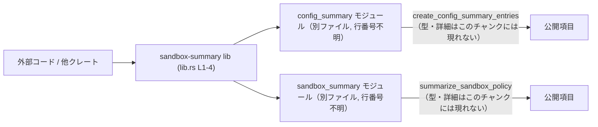

# utils/sandbox-summary/src/lib.rs コード解説

## 0. ざっくり一言

- `utils/sandbox-summary` クレート（あるいはライブラリ）の**公開窓口（エントリポイント）として、内部モジュールの公開項目を再エクスポートするファイル**です（`lib.rs:L1-4`）。

---

## 1. このモジュールの役割

### 1.1 概要

- このファイルは、`config_summary` モジュールと `sandbox_summary` モジュールをサブモジュールとして宣言し（`lib.rs:L1-2`）、  
  それぞれから `create_config_summary_entries` と `summarize_sandbox_policy` という公開項目を**再エクスポート**しています（`lib.rs:L3-4`）。
- これにより、クレートの利用者は `utils::sandbox_summary::create_config_summary_entries` のように、  
  直接 `lib.rs` 経由でこれらの機能にアクセスできる構造になっています（ただし実際のパスは上位の `Cargo.toml` などに依存し、このチャンクからは確定できません）。

### 1.2 アーキテクチャ内での位置づけ

この `lib.rs` は、クレート外部と内部モジュールの間の「表のインターフェース」を提供していると解釈できます。



- 実際の処理ロジックやデータ構造は `config_summary` / `sandbox_summary` 内に存在し、このファイルはそれらをまとめて公開しているだけです（`lib.rs:L1-4`）。
- `create_config_summary_entries` / `summarize_sandbox_policy` が関数か構造体か等は、このチャンクだけでは断定できません。

### 1.3 設計上のポイント（このファイルから読み取れる範囲）

- **責務の分離**  
  - 処理ロジックはサブモジュール（`config_summary`, `sandbox_summary`）側にあり、  
    `lib.rs` は公開 API の選択・再エクスポートのみを担当しています（`lib.rs:L1-4`）。
- **公開 API の絞り込み**  
  - サブモジュール全体ではなく、特定の識別子だけを `pub use` しているため、  
    外部に見せたい API を意図的に限定している構造になっています（`lib.rs:L3-4`）。
- **状態管理・エラーハンドリング・並行性**  
  - このファイルには状態を持つデータ構造やロジックはなく、  
    エラー処理やスレッド安全性に関するコードも含まれていません（`lib.rs:L1-4`）。  
    これらの詳細はサブモジュール側に委ねられており、このチャンクからは不明です。

---

## 2. 主要な機能一覧（コンポーネントインベントリー）

このファイルから把握できるコンポーネントを一覧にします。

### 2.1 モジュール一覧

| 名前             | 種別   | 役割 / 用途                                               | 定義位置           |
|------------------|--------|-----------------------------------------------------------|--------------------|
| `config_summary` | モジュール | 設定に関する「サマリ」を扱う内部モジュールであると推測されるが、実装はこのチャンクには現れない | `lib.rs:L1`        |
| `sandbox_summary`| モジュール | サンドボックスポリシーに関する「サマリ」を扱う内部モジュールであると推測されるが、実装はこのチャンクには現れない | `lib.rs:L2`        |

> モジュール名から用途は推測できますが、具体的な責務や構造は別ファイルにあり、このチャンクだけでは断定できません。

### 2.2 再エクスポートされる公開項目一覧

`pub use` によって、クレート外部から直接利用可能になる識別子です。

| 公開名                          | 元モジュール      | 種別（関数かどうか） | 役割 / 用途（推測を明示）                                            | 定義位置（再エクスポート） |
|---------------------------------|-------------------|----------------------|-----------------------------------------------------------------------|----------------------------|
| `create_config_summary_entries` | `config_summary`  | 不明（関数名風）     | 名前からは「設定サマリのエントリ群を生成する」機能と推測できるが、シグネチャ含め詳細は不明 | `lib.rs:L3`                |
| `summarize_sandbox_policy`      | `sandbox_summary` | 不明（関数名風）     | 名前からは「サンドボックスポリシーを集約・要約する」機能と推測できるが、シグネチャ含め詳細は不明 | `lib.rs:L4`                |

- Rust の文法上、`pub use module::item;` の `item` は関数・構造体・列挙体など任意の公開項目になり得るため、このチャンクだけでは種別は不明です。
- ただし、命名規則上は「動詞 + 名詞」の形から関数である可能性が高いと言えますが、**推測であり断定はできません**。

---

## 3. 公開 API と詳細解説

### 3.1 型一覧（構造体・列挙体など）

このファイル自体には、構造体・列挙体・型エイリアスなどの**型定義は存在しません**（`lib.rs:L1-4`）。

| 名前 | 種別 | 役割 / 用途 | 定義位置 |
|------|------|-------------|----------|
| （なし） | - | - | - |

型に関する情報はすべてサブモジュール側にあり、このチャンクだけでは解説できません。

### 3.2 公開項目詳細（テンプレート適用）

このセクションでは、再エクスポートされている 2 つの公開項目について、  
**このチャンクから分かる範囲のみ** でテンプレート形式の説明を行います。

#### `create_config_summary_entries`（元: `config_summary`）

**概要**

- `config_summary` モジュールから再エクスポートされている公開項目です（`lib.rs:L3`）。
- 名前からは「設定値の概要（サマリ）を表すエントリ群を生成する」機能と推測されますが、  
  実際にどのような処理を行うかは、このチャンクには現れません。

**シグネチャ / 引数**

- このチャンクにはシグネチャが存在せず、**引数の有無・型は不明**です。
- したがって、引数仕様に関する契約（前提条件など）はここでは説明できません。

| 引数名 | 型 | 説明 |
|--------|----|------|
| （不明） | （不明） | このチャンクには定義がないため不明です |

**戻り値**

- 戻り値の有無・型も、このチャンクからは不明です。
- `create_*` という名前から、何らかのコレクションや構造体を返す可能性はありますが、推測に留まります。

**内部処理の流れ（アルゴリズム）**

- 実装が `config_summary` 側にあり、このファイルには含まれていないため、  
  内部のアルゴリズムは読み取れません。

**Examples（使用例）**

- 実際の型シグネチャが不明なため、**コンパイル可能な具体例を示すことはできません**。
- 利用イメージのみ、抽象的に示すと次のような形になります（パスは一例です）:

```rust
// 注意: create_config_summary_entries の引数・戻り値はこのチャンクからは不明です。
// 以下はあくまで「再エクスポートされた識別子を呼ぶ」というイメージの擬似コードです。

use sandbox_summary::create_config_summary_entries; // lib.rs の pub use により利用可能（lib.rs:L3）

fn main() {
    // 実際には何らかの設定情報を引数に取るか、もしくは引数なしで呼び出す可能性があります。
    // let entries = create_config_summary_entries(config); // 実際のシグネチャは不明
}
```

**Errors / Panics**

- エラー型や panic 条件についても、このチャンクからは情報がありません。
- エラー契約は `config_summary` 内の実装に依存しますが、そのコードはこのチャンクには現れません。

**Edge cases（エッジケース）**

- 空の設定、極端に大きな設定、無効な値などに対する扱いも不明です。
- したがって、エッジケースの挙動はここでは整理できません。

**使用上の注意点**

- この公開項目を利用する際の注意点（例えば「I/O が発生する」「スレッドセーフかどうか」など）は、  
  このファイルからは判断できません。
- 実際に利用・変更する場合は、**`config_summary` モジュールの定義ファイル**を参照する必要があります。

---

#### `summarize_sandbox_policy`（元: `sandbox_summary`）

**概要**

- `sandbox_summary` モジュールから再エクスポートされている公開項目です（`lib.rs:L4`）。
- 名前からは「サンドボックスポリシーを集約または要約する」機能と推測されますが、  
  実際の処理内容はこのチャンクには現れません。

**シグネチャ / 引数**

- シグネチャはこのファイル には存在せず、引数も不明です。

| 引数名 | 型 | 説明 |
|--------|----|------|
| （不明） | （不明） | このチャンクには定義がないため不明です |

**戻り値**

- 戻り値の有無・型も不明です。
- 例えば「サンドボックスポリシーの要約結果」を表す構造体や文字列かもしれませんが、推測に留まります。

**内部処理の流れ（アルゴリズム）**

- 実装は `sandbox_summary` モジュール側にあり、このファイルからは読み取れません。

**Examples（使用例）**

```rust
// 注意: summarize_sandbox_policy の引数・戻り値はこのチャンクからは不明です。

use sandbox_summary::summarize_sandbox_policy; // lib.rs の pub use により利用可能（lib.rs:L4）

fn main() {
    // 擬似コードイメージ
    // let summary = summarize_sandbox_policy(policy); // 実際のシグネチャは不明
}
```

**Errors / Panics**

- エラー処理・panic 条件とも、このチャンクでは不明です。
- セキュリティに関わる「サンドボックスポリシー」を扱う可能性があるため、  
  実際のエラー処理や検証ロジックはセキュリティ上重要ですが、ここでは確認できません。

**Edge cases（エッジケース）**

- ポリシーが空・無効・極端に制限的／緩いなどのケースにどう対応するかも不明です。

**使用上の注意点**

- セキュリティ設定に関係する可能性があるため、本番環境での利用時には  
  **実装ファイル（`sandbox_summary`）側での契約やドキュメントの確認が必須**になります。

---

### 3.3 その他の関数

- この `lib.rs` には、再エクスポート以外の関数定義は存在しません（`lib.rs:L1-4`）。
- よって、このセクションで解説すべき補助関数等もありません。

| 名前 | 役割（1 行） | 定義位置 |
|------|--------------|----------|
| （なし） | - | - |

---

## 4. データフロー

このファイル単体では具体的な処理データの流れは分かりませんが、  
**「外部コード → 再エクスポートされた公開項目 → サブモジュール実装」** という呼び出し経路は読み取れます。

```mermaid
sequenceDiagram
    participant Ext as 外部コード
    participant Lib as sandbox-summary lib (lib.rs L1-4)
    participant CS as config_summary（別ファイル）
    participant SS as sandbox_summary（別ファイル）

    Ext->>Lib: create_config_summary_entries(...) 呼び出し（シグネチャ不明）
    Note right of Lib: pub use config_summary::create_config_summary_entries;（lib.rs:L3）
    Lib->>CS: create_config_summary_entries(...) 実体を呼び出し

    Ext->>Lib: summarize_sandbox_policy(...) 呼び出し（シグネチャ不明）
    Note right of Lib: pub use sandbox_summary::summarize_sandbox_policy;（lib.rs:L4）
    Lib->>SS: summarize_sandbox_policy(...) 実体を呼び出し
```

- `lib.rs` は単なる「窓口」であり、実際のデータ処理は `config_summary` / `sandbox_summary` に委譲されます。
- データの具体的な構造（設定オブジェクトやポリシーオブジェクトの型など）は、このチャンクには現れません。

---

## 5. 使い方（How to Use）

このファイルは再エクスポート専用のため、利用者が意識するのは **公開項目のパス** のみです。

### 5.1 基本的な使用方法

実際のシグネチャが不明なため、ここでは「パスの解決」を中心に示します。

```rust
// lib.rs の pub use により、クレートルート（またはモジュール）から直接インポートできる想定です。
// 実際のクレート名や上位モジュール名は、このチャンクからは分かりません。

use sandbox_summary::create_config_summary_entries;   // lib.rs:L3 で再エクスポート
use sandbox_summary::summarize_sandbox_policy;        // lib.rs:L4 で再エクスポート

fn main() {
    // シグネチャは不明なので、ここでは呼び出しはコメントのみに留めます。
    // let entries = create_config_summary_entries(...);
    // let summary = summarize_sandbox_policy(...);
}
```

### 5.2 よくある使用パターン

- このチャンクには、同期 / 非同期や設定値の違いによる使い分けなどに関する情報はありません。
- 使用パターンを論じるには、`config_summary` / `sandbox_summary` の実装と周辺コードの確認が必要です。

### 5.3 よくある間違い（推測できる範囲）

このファイルから推測できる範囲で、起こり得る誤用例を挙げます。

```rust
// （誤用の可能性）: 別パスから直接モジュールを参照しようとする
// use sandbox_summary::config_summary::create_config_summary_entries;
// ↑ 実際にこのパスが存在するかは不明であり、lib.rs の設計意図とも限りません。

// （より安全な使い方）: lib.rs の再エクスポートに従う
use sandbox_summary::create_config_summary_entries; // lib.rs:L3
```

- モジュール階層を直接たどるより、**公開されているパスに合わせて利用する**方が、  
  将来の内部構造変更に強いという意味で安定です。

### 5.4 使用上の注意点（まとめ）

- `lib.rs` は再エクスポートのみを行っており、**エラー処理・並行性・セキュリティの具体的な挙動はサブモジュール側に依存**します。
- 利用時には、  
  - どのような型を引数 / 戻り値に取るか  
  - どのようなエラーが返り得るか  
  - スレッドセーフに利用できるか  
  を確認するために、必ず `config_summary` / `sandbox_summary` の実装・ドキュメントを参照する必要があります。

---

## 6. 変更の仕方（How to Modify）

### 6.1 新しい機能を追加する場合

このファイルの役割から見た「追加の入口」は次のようになります。

1. **新しい内部モジュールまたは既存モジュールに機能を実装**  
   - 例: `mod new_feature;` を追加し、その中に新しい公開項目を定義する（このチャンクには `new_feature` はありませんが、パターンとして）。
2. **`lib.rs` から再エクスポートするかどうかを決める**  
   - 外部から直接使わせたい API であれば、`pub use new_feature::new_item;` のような行を追加します。
3. **外部コード側でのインポートパスを決める**  
   - 再エクスポートした場合、利用者は `sandbox_summary::new_item` のようにシンプルなパスで利用できます。

このファイルに新しい `pub use` を追加する際の注意:

- すでに同名の公開項目が存在しないかを確認する（名前衝突防止）。
- 内部モジュールの可視性（`pub` の有無）を合わせて確認する必要があります。

### 6.2 既存の機能を変更する場合

`create_config_summary_entries` や `summarize_sandbox_policy` の仕様変更や差し替えを行う場合の観点です。

- **影響範囲の確認**
  - これらを利用している外部コードは、`lib.rs` の `pub use` が指すシンボルに依存しています（`lib.rs:L3-4`）。
  - シグネチャ変更などは、すべての利用箇所に影響します。
- **パスを変えずに実装だけ変更する**
  - 実装を `config_summary` / `sandbox_summary` 内で変更するだけであれば、  
    `lib.rs` 側は変更不要で、外部コードの import も変わりません。
- **API を削除または非推奨化する場合**
  - まずは内部で deprecated 属性を付けるなどし、利用側での影響を確認する必要がありますが、  
    そのための情報はこのチャンクには存在しません。

---

## 7. 関連ファイル

このファイルと密接に関連するファイルは、モジュール宣言から次の 2 つが読み取れます。

| パス（推定）                 | 役割 / 関係                                                                                   | 根拠 |
|-----------------------------|----------------------------------------------------------------------------------------------|------|
| `utils/sandbox-summary/src/config_summary.rs` または `mod config_summary` 用のファイル | `config_summary` モジュールの実装が置かれていると考えられる。`create_config_summary_entries` の定義元。 | `lib.rs:L1, L3` |
| `utils/sandbox-summary/src/sandbox_summary.rs` または対応するディレクトリ構成 | `sandbox_summary` モジュールの実装が置かれていると考えられる。`summarize_sandbox_policy` の定義元。     | `lib.rs:L2, L4` |

> 実際のファイル配置（`mod.rs` を用いているか、ディレクトリ構成かどうか）はこのチャンクからは分かりませんが、  
> Rust の標準的なモジュール規約に従うと上記のいずれかになることが多いです。

---

### まとめ（このチャンクから分かること）

- `lib.rs` は **2 つの内部モジュールを宣言し、その中の特定の公開項目を再エクスポートする役割** を持ちます（`lib.rs:L1-4`）。
- コアロジック・エラー処理・並行性・セキュリティに関する実装はすべてサブモジュール側にあり、このチャンクには現れません。
- 外部から見たときの主な関心事は「どの識別子がどのパスで公開されているか」であり、  
  それをこのファイルが明示していると言えます。
