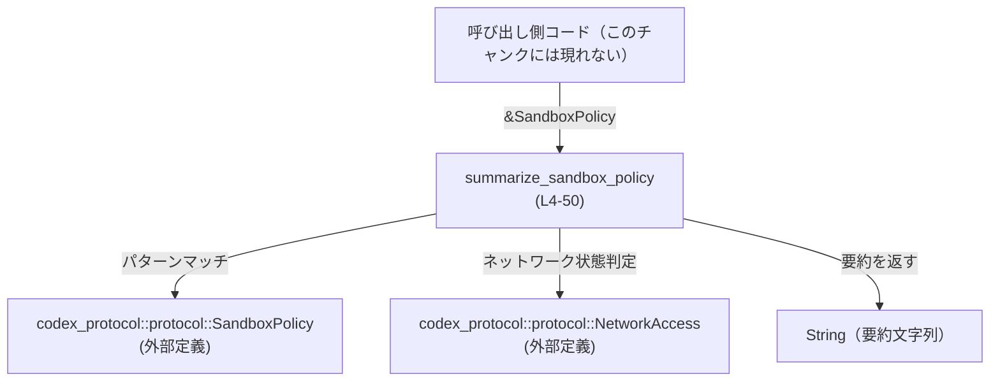
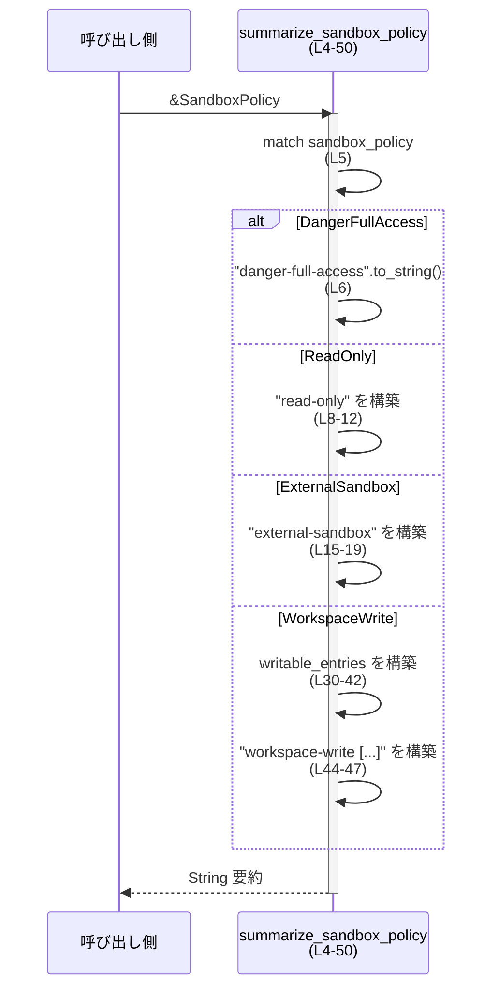
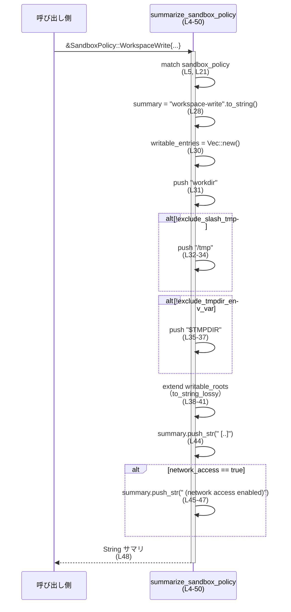

# utils/sandbox-summary/src/sandbox_summary.rs

## 0. ざっくり一言

`SandboxPolicy`（外部クレート `codex_protocol` の型）の内容から、人間が読める短いサマリ文字列を生成するユーティリティ関数と、その挙動を確認するテスト群のファイルです（`utils/sandbox-summary/src/sandbox_summary.rs:L1-50, L53-103`）。

---

## 1. このモジュールの役割

### 1.1 概要

- このモジュールは **Sandbox の制限内容を簡潔な文字列に要約する** ために存在し、`summarize_sandbox_policy` 関数を提供します（`utils/sandbox-summary/src/sandbox_summary.rs:L4-50`）。
- 要約文字列には、Sandbox のモード（read-only / external-sandbox / workspace-write / danger-full-access）と、必要に応じて **ネットワークアクセスの有効/無効** や **書き込み可能ディレクトリ一覧** が含まれます（`utils/sandbox-summary/src/sandbox_summary.rs:L6-48`）。

### 1.2 アーキテクチャ内での位置づけ

このモジュールは、外部クレート `codex_protocol::protocol` が定義する `SandboxPolicy`・`NetworkAccess` を入力として受け取り、標準ライブラリの `String` を返す小さな変換層として機能しています（`utils/sandbox-summary/src/sandbox_summary.rs:L1-2, L4`）。



※ 呼び出し側の具体的なモジュール名や用途は、このチャンクには現れないため不明です。

### 1.3 設計上のポイント

- **純粋関数**  
  - `summarize_sandbox_policy` は引数の参照から `String` を生成するだけで、副作用（I/O やグローバル状態の変更）はありません（`utils/sandbox-summary/src/sandbox_summary.rs:L4-50`）。  
  - そのため、スレッド間で同じ `SandboxPolicy` を共有して同関数を呼び出しても安全に利用できます（Rust の共有参照 `&T` はスレッドセーフな設計の基礎です）。
- **コンパイル時に網羅性が担保されるパターンマッチ**  
  - すべての扱いたい `SandboxPolicy` バリアントに対して `match` で分岐しています（`DangerFullAccess`, `ReadOnly`, `ExternalSandbox`, `WorkspaceWrite`）（`utils/sandbox-summary/src/sandbox_summary.rs:L5-49`）。
  - 将来 `SandboxPolicy` にバリアントが追加された場合には、コンパイルエラーとして検出される構造になっています（`_` アームが存在しないため）。
- **ネットワークアクセスの表現**  
  - `ReadOnly` と `WorkspaceWrite` では `bool` フィールド `network_access` を用い、真の場合に `" (network access enabled)"` のサフィックスを追加します（`utils/sandbox-summary/src/sandbox_summary.rs:L7-13, L21-24, L44-47`）。
  - `ExternalSandbox` では `NetworkAccess::Enabled` とのマッチングにより、同様のサフィックスを付加します（`utils/sandbox-summary/src/sandbox_summary.rs:L14-18`）。
- **書き込み可能ディレクトリ情報のまとめ**  
  - `WorkspaceWrite` の場合、`workdir`・条件付きの `/tmp`・`$TMPDIR`・`writable_roots` のパスを一つのリストにまとめて `"workspace-write [ ... ]"` の形式で出力します（`utils/sandbox-summary/src/sandbox_summary.rs:L21-22, L28-44`）。
  - パスは `to_string_lossy` で文字列化されるため、非 UTF-8 のパスは代替文字に置き換えられる可能性があります（`utils/sandbox-summary/src/sandbox_summary.rs:L38-41`）。

---

## 2. コンポーネント一覧と主要な機能

### 2.1 コンポーネントインベントリー

| 名前 | 種別 | 公開範囲 | 役割 / 説明 | 根拠 |
|------|------|----------|-------------|------|
| `summarize_sandbox_policy` | 関数 | `pub` | `SandboxPolicy` を人間向けの要約文字列に変換するコア関数 | `utils/sandbox-summary/src/sandbox_summary.rs:L4-50` |
| `tests::summarizes_external_sandbox_without_network_access_suffix` | テスト関数 | テストビルド時 | `ExternalSandbox` かつネットワーク制限ありのときサフィックスが付かないことを検証 | `utils/sandbox-summary/src/sandbox_summary.rs:L59-65` |
| `tests::summarizes_external_sandbox_with_enabled_network` | テスト関数 | テストビルド時 | `ExternalSandbox` かつ `NetworkAccess::Enabled` のときサフィックスが付くことを検証 | `utils/sandbox-summary/src/sandbox_summary.rs:L67-73` |
| `tests::summarizes_read_only_with_enabled_network` | テスト関数 | テストビルド時 | `ReadOnly` かつ `network_access = true` のときサフィックスが付くことを検証 | `utils/sandbox-summary/src/sandbox_summary.rs:L75-82` |
| `tests::workspace_write_summary_still_includes_network_access` | テスト関数 | テストビルド時 | `WorkspaceWrite` のサマリに書き込み可能ルートとネットワークサフィックスが含まれることを検証 | `utils/sandbox-summary/src/sandbox_summary.rs:L84-101` |

### 2.2 主要な機能一覧

- Sandbox ポリシー種別ごとの **定型的なラベル文字列** の生成  
  - 例: `"danger-full-access"`, `"read-only"`, `"external-sandbox"`, `"workspace-write"`（`utils/sandbox-summary/src/sandbox_summary.rs:L6, L8, L15, L28`）
- ネットワークアクセスが有効な場合の **サフィックス `" (network access enabled)"` の付加**（`utils/sandbox-summary/src/sandbox_summary.rs:L9-11, L16-18, L44-47`）
- `WorkspaceWrite` ポリシーにおける **書き込み可能ディレクトリ一覧の組み立てと整形**（`utils/sandbox-summary/src/sandbox_summary.rs:L28-44`）

---

## 3. 公開 API と詳細解説

### 3.1 型一覧（構造体・列挙体など）

このファイル内で新たに定義されている型はありませんが、外部から以下の型を利用しています。

| 名前 | 種別 | 定義元 | 役割 / 用途 | 根拠 |
|------|------|--------|-------------|------|
| `SandboxPolicy` | 列挙体（enum、外部） | `codex_protocol::protocol` | サンドボックスの動作ポリシーを表す。少なくとも `DangerFullAccess`, `ReadOnly`, `ExternalSandbox`, `WorkspaceWrite` のバリアントが存在する | `utils/sandbox-summary/src/sandbox_summary.rs:L2, L5-7, L14-15, L21-27` |
| `NetworkAccess` | 列挙体（enum、外部） | `codex_protocol::protocol` | ネットワークアクセスの状態を表す。少なくとも `Enabled` と `Restricted` が存在する | `utils/sandbox-summary/src/sandbox_summary.rs:L1, L14-18, L61-63, L69-71` |
| `AbsolutePathBuf` | 構造体（外部、テスト専用） | `codex_utils_absolute_path` | 絶対パスを表す型。`WorkspaceWrite` テストで書き込み可能ルートの生成に使用 | `utils/sandbox-summary/src/sandbox_summary.rs:L56, L86-90` |

`SandboxPolicy` や `NetworkAccess` の詳細なフィールド・全バリアントは、このチャンクには現れないため不明です。

### 3.2 関数詳細：`summarize_sandbox_policy`

#### `summarize_sandbox_policy(sandbox_policy: &SandboxPolicy) -> String`

**概要**

- 渡された `SandboxPolicy` の内容に応じて、人間が読める短い要約文字列を生成して返す関数です（`utils/sandbox-summary/src/sandbox_summary.rs:L4-50`）。
- 主に以下の情報を文字列化します:
  - ポリシーの種類（danger-full-access / read-only / external-sandbox / workspace-write）
  - `WorkspaceWrite` の場合の書き込み可能ディレクトリ一覧
  - ネットワークアクセスが有効かどうか

**引数**

| 引数名 | 型 | 説明 |
|--------|----|------|
| `sandbox_policy` | `&SandboxPolicy` | 要約対象となるサンドボックスポリシー。共有参照で受け取り、所有権は奪いません（`utils/sandbox-summary/src/sandbox_summary.rs:L4`）。 |

**戻り値**

- 型: `String`（所有権を持つ UTF-8 文字列）
- 意味: `sandbox_policy` の種別と一部の設定を反映した要約文字列。例として:
  - `SandboxPolicy::DangerFullAccess` → `"danger-full-access"`（`utils/sandbox-summary/src/sandbox_summary.rs:L6`）
  - `SandboxPolicy::ReadOnly` かつ `network_access = true` → `"read-only (network access enabled)"`（`utils/sandbox-summary/src/sandbox_summary.rs:L7-13`）
  - `SandboxPolicy::ExternalSandbox { network_access: NetworkAccess::Enabled }` → `"external-sandbox (network access enabled)"`（`utils/sandbox-summary/src/sandbox_summary.rs:L14-18`）
  - `SandboxPolicy::WorkspaceWrite { ... }` → `"workspace-write [workdir, ...] (network access enabled?)"` の形式（`utils/sandbox-summary/src/sandbox_summary.rs:L21-48`）

**内部処理の流れ（アルゴリズム）**

1. `sandbox_policy` に対して `match` を行い、バリアントごとに分岐します（`utils/sandbox-summary/src/sandbox_summary.rs:L5`）。
2. `DangerFullAccess` の場合  
   - `"danger-full-access".to_string()` をそのまま返します（`utils/sandbox-summary/src/sandbox_summary.rs:L6`）。
3. `ReadOnly { network_access, .. }` の場合（`utils/sandbox-summary/src/sandbox_summary.rs:L7-13`）  
   - `summary` を `"read-only"` で初期化します（`L8`）。  
   - `*network_access` が `true` のとき、`" (network access enabled)"` を末尾に追加します（`L9-11`）。  
   - `summary` を返します（`L12`）。
4. `ExternalSandbox { network_access }` の場合（`utils/sandbox-summary/src/sandbox_summary.rs:L14-19`）  
   - `summary` を `"external-sandbox"` で初期化します（`L15`）。  
   - `matches!(network_access, NetworkAccess::Enabled)` が真のとき、同様に `" (network access enabled)"` を追加します（`L16-17`）。  
   - `summary` を返します（`L18-19`）。
5. `WorkspaceWrite { writable_roots, network_access, exclude_tmpdir_env_var, exclude_slash_tmp, read_only_access: _ }` の場合（`utils/sandbox-summary/src/sandbox_summary.rs:L21-27`）  
   - `summary` を `"workspace-write"` で初期化します（`L28`）。  
   - `writable_entries: Vec<String>` を作成し、以下を順に追加します（`L30-42`）:  
     - `"workdir"`（`L31`）  
     - `!exclude_slash_tmp` のときは `"/tmp"`（`L32-34`）  
     - `!exclude_tmpdir_env_var` のときは `"$TMPDIR"`（`L35-37`）  
     - `writable_roots` に含まれる各パスを `to_string_lossy().to_string()` で文字列化したもの（`L38-41`）  
   - `summary.push_str(&format!(" [{}]", writable_entries.join(", ")))` で、`"workspace-write [workdir, /tmp, ...]"` の形に整形します（`L44`）。  
   - `*network_access` が `true` のとき `" (network access enabled)"` を追加します（`L45-47`）。  
   - `summary` を返します（`L48`）。

この関数の処理フローをシーケンス図にすると次のようになります。



**Examples（使用例）**

1. `ReadOnly` ポリシー（ネットワーク有効）の要約

```rust
use codex_protocol::protocol::{SandboxPolicy, NetworkAccess}; // ポリシーとネットワーク状態の型をインポート
use utils::sandbox_summary::summarize_sandbox_policy;         // このモジュールの関数（パスは実際のクレート構成に依存）

fn print_read_only_summary() {
    // ReadOnly ポリシーを生成する。access フィールドはデフォルト値を使用
    let policy = SandboxPolicy::ReadOnly {
        access: Default::default(),  // このフィールドの型は外部定義のため詳細不明（テストを参考）
        network_access: true,        // ネットワークアクセスを有効にする
    };

    // ポリシーを要約文字列に変換
    let summary = summarize_sandbox_policy(&policy);

    // "read-only (network access enabled)" が出力される
    println!("{}", summary);
}
```

1. `WorkspaceWrite` ポリシー（ネットワーク有効・追加ルートあり）の要約  
   テストコードのパターンをもとにした例です（`utils/sandbox-summary/src/sandbox_summary.rs:L84-101`）。

```rust
use codex_protocol::protocol::SandboxPolicy;                  // SandboxPolicy をインポート
use codex_utils_absolute_path::AbsolutePathBuf;               // 絶対パス型（外部クレート）をインポート
use utils::sandbox_summary::summarize_sandbox_policy;         // サマリ生成関数をインポート

fn print_workspace_write_summary() {
    // プラットフォームに応じてルートパスの文字列表現を用意
    let root = if cfg!(windows) { "C:\\repo" } else { "/repo" };

    // 文字列から AbsolutePathBuf を生成（失敗時の挙動は AbsolutePathBuf 側の定義に依存）
    let writable_root = AbsolutePathBuf::try_from(root).unwrap();

    // WorkspaceWrite ポリシーを構築
    let policy = SandboxPolicy::WorkspaceWrite {
        writable_roots: vec![writable_root.clone()],  // 追加の書き込み可能ルート
        read_only_access: Default::default(),         // 読み取り専用領域の設定（詳細不明）
        network_access: true,                         // ネットワークアクセスを有効にする
        exclude_tmpdir_env_var: true,                 // $TMPDIR を除外
        exclude_slash_tmp: true,                      // /tmp を除外
    };

    // サマリ文字列を取得
    let summary = summarize_sandbox_policy(&policy);

    // 例: "workspace-write [workdir, /repo] (network access enabled)" のような形式になる
    println!("{}", summary);
}
```

**Errors / Panics（エラー・パニック）**

- `summarize_sandbox_policy` 自体は、`String` の生成と `Vec<String>` の操作のみを行い、**明示的なエラーや panic を発生させる処理を含みません**（`utils/sandbox-summary/src/sandbox_summary.rs:L6-48`）。
  - `to_string`・`push_str`・`Vec::push`・`Iterator::map` など、ここで用いられている標準ライブラリ API は、この使い方では panic しないことが一般的です（容量不足時は OS / ランタイム側の挙動になります）。
- テストコード内では `AbsolutePathBuf::try_from(root).unwrap()` が使われているため、無効なパスが `root` に入った場合は panic の可能性があります（`utils/sandbox-summary/src/sandbox_summary.rs:L86-87`）。
  - ただし、`root` は固定文字列 `"C:\\repo"` または `"/repo"` のため、通常の OS では有効な絶対パスと考えられます。この前提自体はコード上に明示されています（`cfg!(windows)` の分岐、`utils/sandbox-summary/src/sandbox_summary.rs:L86`）。

**言語固有の安全性・並行性**

- Rust の共有参照 `&SandboxPolicy` を取っているため、この関数は **SandboxPolicy の所有権を奪わず、内容も変更しません**（`utils/sandbox-summary/src/sandbox_summary.rs:L4`）。
- 内部で `unsafe` ブロックは使用しておらず、すべて安全な Rust（safe Rust）の範囲に収まっています（ファイル全体に `unsafe` が存在しません）。
- グローバルな可変状態や I/O を扱っていないため、**複数スレッドから同時に呼び出してもデータ競合は発生しません**。
  - 返り値の `String` は各呼び出しごとに新しく生成される独立した所有値です。

**Edge cases（エッジケース）**

- `ReadOnly` かつ `network_access = false`  
  - サフィックスが付かず `"read-only"` のみになります（`utils/sandbox-summary/src/sandbox_summary.rs:L7-13`）。
- `ExternalSandbox` かつ `NetworkAccess::Restricted`  
  - `matches!(network_access, NetworkAccess::Enabled)` が偽のため、サフィックスが付かず `"external-sandbox"` になります。テストで明示的に検証されています（`utils/sandbox-summary/src/sandbox_summary.rs:L16-18, L59-65`）。
- `WorkspaceWrite` で `exclude_tmpdir_env_var = true` かつ `exclude_slash_tmp = true` かつ `writable_roots` が空  
  - `writable_entries` には `"workdir"` のみが含まれ、サマリは `"workspace-write [workdir]"`（ネットワーク有効ならさらにサフィックス）になります（`utils/sandbox-summary/src/sandbox_summary.rs:L30-37, L44-47`）。
- `writable_roots` に複数のパスが含まれる場合  
  - `writable_entries.join(", ")` により、 `"[workdir, /tmp, path1, path2]"` のように **カンマ区切りで連結** されます（`utils/sandbox-summary/src/sandbox_summary.rs:L38-41, L44`）。パスにカンマを含んでいても特別なエスケープは行われません。
- 非 UTF-8 のパス  
  - `to_string_lossy()` により、無効なバイト列は Unicode の代替文字（`�`）などに置き換えられた文字列になります（`utils/sandbox-summary/src/sandbox_summary.rs:L38-41`）。  
  - このため、**文字列サマリは元のパスを完全には再現できない場合があります**。

**使用上の注意点**

- **仕様の情報源としての位置づけ**  
  - この関数は人間向けのサマリを返すものであり、文字列形式をパースして元の `SandboxPolicy` を再構築するような用途には設計されていません（文字列に全情報が含まれている保証はコードからは読み取れません）。
- **文字列形式の安定性**  
  - ラベルやサフィックスのテキスト `"danger-full-access"`, `"read-only"`, `"external-sandbox"`, `"workspace-write"`, `" (network access enabled)"` は、このファイルで直接埋め込まれています（`utils/sandbox-summary/src/sandbox_summary.rs:L6, L8, L15, L28, L10, L17, L46`）。  
  - したがって、これらの文字列に依存した外部処理（ログ解析など）を行う場合は、この実装に強く依存することになります。
- **パフォーマンス上の性質**  
  - 各呼び出しで `String` および `Vec<String>` を新規に確保し、`writable_roots` の要素数に比例して文字列を生成します（`utils/sandbox-summary/src/sandbox_summary.rs:L28-44`）。  
  - 一般的な用途（ログや UI 表示）では軽量ですが、高頻度に呼ばれるループ内部で `WorkspaceWrite` を大量に処理する場合には割り当てコストを考慮する必要があります。
- **セキュリティ上の観点**  
  - サマリ文字列には、ネットワークアクセスが有効かどうかが明示されるため、ログや UI 上で **危険な設定（例: danger-full-access や network access enabled）を識別する手掛かり** になります（`utils/sandbox-summary/src/sandbox_summary.rs:L6, L9-11, L16-18, L44-47`）。  
  - 一方で、サマリからはポリシーの全ての詳細（例えば read-only の範囲など）は分からないため、**文字列だけをもってセキュリティ判断を行うと情報不足の可能性**があります。

### 3.3 その他の関数（テスト）

| 関数名 | 役割（1 行） | 根拠 |
|--------|--------------|------|
| `tests::summarizes_external_sandbox_without_network_access_suffix` | `ExternalSandbox` かつ `NetworkAccess::Restricted` の場合にサフィックスが付かないことを検証 | `utils/sandbox-summary/src/sandbox_summary.rs:L59-65` |
| `tests::summarizes_external_sandbox_with_enabled_network` | `ExternalSandbox` かつ `NetworkAccess::Enabled` の場合にサフィックスが付くことを検証 | `utils/sandbox-summary/src/sandbox_summary.rs:L67-73` |
| `tests::summarizes_read_only_with_enabled_network` | `ReadOnly` かつ `network_access = true` の場合にサフィックスが付くことを検証 | `utils/sandbox-summary/src/sandbox_summary.rs:L75-82` |
| `tests::workspace_write_summary_still_includes_network_access` | `WorkspaceWrite` のサマリに workdir と `writable_roots` の内容、およびサフィックスが含まれることを検証 | `utils/sandbox-summary/src/sandbox_summary.rs:L84-101` |

---

## 4. データフロー

ここでは `WorkspaceWrite` ポリシーを要約する場合のデータフローを例に説明します。

- 入力として、`writable_roots`・`network_access`・`exclude_tmpdir_env_var`・`exclude_slash_tmp` などのフィールドを持つ `SandboxPolicy::WorkspaceWrite` が渡されます（`utils/sandbox-summary/src/sandbox_summary.rs:L21-27`）。
- 関数内部で、これらのフィールドをもとに `"workspace-write [ ... ]"` の形の文字列と、必要に応じてネットワークサフィックスが組み立てられます（`utils/sandbox-summary/src/sandbox_summary.rs:L28-48`）。



このフローから分かるように、**外部とのやり取りは引数と戻り値のみ**であり、ファイル I/O やネットワーク、グローバル状態へのアクセスは行っていません。

---

## 5. 使い方（How to Use）

### 5.1 基本的な使用方法

典型的なフローは「`SandboxPolicy` を構築 → `summarize_sandbox_policy` を呼び出し → 文字列をログや UI に表示」です。

```rust
use codex_protocol::protocol::{SandboxPolicy, NetworkAccess};  // ポリシーとネットワーク状態
use utils::sandbox_summary::summarize_sandbox_policy;          // 要約関数

fn log_policy(policy: &SandboxPolicy) {
    // ポリシーを要約文字列に変換
    let summary = summarize_sandbox_policy(policy);            // 所有権は奪われない

    // ログに出力（例）
    log::info!("Sandbox policy: {}", summary);                 // ここでは仮の log マクロを使用
}

fn example() {
    // 例として、外部サンドボックス（ネットワーク有効）のポリシーを構築
    let policy = SandboxPolicy::ExternalSandbox {
        network_access: NetworkAccess::Enabled,                // ネットワークアクセス有効
    };

    // ログ出力
    log_policy(&policy);
}
```

### 5.2 よくある使用パターン

1. **設定のダンプ・ログ出力**  
   - 起動時やジョブ開始時に `SandboxPolicy` をサマリ文字列としてログに出しておくことで、後からポリシーの概要を確認できます。
2. **UI 表示用のラベル生成**  
   - 管理画面などで、内部の `SandboxPolicy` をそのまま表示する代わりに、本関数の文字列を表示すると、人間が直感的に理解しやすくなります。
3. **テストのアサーションを簡略化**  
   - `SandboxPolicy` の詳細な内部構造の比較ではなく、サマリ文字列同士を比較することで、テストコードを簡潔にできます（このファイル内のテストがその例です、`utils/sandbox-summary/src/sandbox_summary.rs:L59-82`）。

### 5.3 よくある間違い

```rust
use codex_protocol::protocol::SandboxPolicy;
use utils::sandbox_summary::summarize_sandbox_policy;

// 間違い例: サマリ文字列からポリシーの完全な情報を復元しようとする
fn parse_policy_from_summary(summary: &str) -> SandboxPolicy {
    // 実装しようとしても、サマリ文字列には全ての情報が含まれていないため、
    // 元の SandboxPolicy を一意に再構成することはできません。
    unimplemented!()
}

// 正しい利用例: もとの SandboxPolicy は別途管理し、
// summarize_sandbox_policy はあくまで表示・ログ用に使う
fn show_policy(policy: &SandboxPolicy) {
    let summary = summarize_sandbox_policy(policy); // 要約だけを取り出す
    println!("Policy: {}", summary);                 // 表示やログに利用
}
```

- このように、**サマリ文字列を仕様上の唯一の情報源として扱うと、情報が欠落する可能性がある**点に注意が必要です。

### 5.4 使用上の注意点（まとめ）

- このモジュールは **純粋関数とテストのみ** で構成されており、スレッド安全性の観点で特別な注意は不要です（`utils/sandbox-summary/src/sandbox_summary.rs:L4-50, L53-103`）。
- サマリ文字列は人間向けの説明であり、形式が今後変更される可能性についてこのファイルからは読み取れません。文字列形式に強く依存する処理を組む場合は、その点を前提とする必要があります。
- `WorkspaceWrite` のサマリには実際のパス文字列が含まれるため、ログ出力時には機密情報（ユーザ名を含んだパスなど）が混入しうることに留意する必要があります（`utils/sandbox-summary/src/sandbox_summary.rs:L38-44`）。

---

## 6. 変更の仕方（How to Modify）

### 6.1 新しい機能を追加する場合

1. **`SandboxPolicy` に新しいバリアントを追加する場合**  
   - `codex_protocol::protocol::SandboxPolicy` 側で新バリアントを追加すると、この関数の `match` が非網羅的になり、コンパイルエラーで知らせてくれます（`utils/sandbox-summary/src/sandbox_summary.rs:L5`）。  
   - このファイルに新しい `match` アームを追加し、要約文字列の形式を決定します。
   - 必要であれば、新しいテストケースを `mod tests` 内に追加して、期待するサマリ文字列を検証します（`utils/sandbox-summary/src/sandbox_summary.rs:L53-103`）。
2. **サマリに含める情報を増やす場合**  
   - 例えば、`ReadOnly` の他のフィールドを文字列に含めたい場合、`ReadOnly { network_access, .. }` のパターン部分を詳細なフィールドリストに変更し、`summary` の構築ロジックを拡張します（`utils/sandbox-summary/src/sandbox_summary.rs:L7-13`）。
   - 文字列形式を変更した場合は、既存テストの期待値（`assert_eq!` の第2引数）も合わせて更新する必要があります（`utils/sandbox-summary/src/sandbox_summary.rs:L64, L72, L81, L95-100`）。

### 6.2 既存の機能を変更する場合

- **文字列フォーマットを変更する場合**  
  - ラベルやサフィックスのテキストを変更すると、その文字列に依存するテストが失敗するため、テストの期待値も合わせて修正する必要があります（`utils/sandbox-summary/src/sandbox_summary.rs:L64, L72, L81, L95-100`）。
- **`WorkspaceWrite` の書き込みディレクトリ列挙ロジックを変更する場合**  
  - `writable_entries` の構築部分（`utils/sandbox-summary/src/sandbox_summary.rs:L30-42`）が変更ポイントになります。  
  - `exclude_*` フラグの意味（true で除外）と、`writable_roots` の追加順序などが暗黙の仕様となっているため、仕様変更の際には既存の呼び出し側への影響を確認する必要があります（このチャンクには呼び出し側は現れません）。
- **ネットワークサフィックスの条件を変える場合**  
  - `ReadOnly` / `WorkspaceWrite` の `*network_access` 判定（`utils/sandbox-summary/src/sandbox_summary.rs:L9-11, L45-47`）  
  - `ExternalSandbox` の `matches!(network_access, NetworkAccess::Enabled)`（`utils/sandbox-summary/src/sandbox_summary.rs:L16-17`）  
  - これらを変更すると、ネットワーク有効時の文字列が変わるため、テストを追加・変更する必要があります（`utils/sandbox-summary/src/sandbox_summary.rs:L59-73, L84-101`）。

---

## 7. 関連ファイル

| パス / モジュール | 役割 / 関係 |
|-------------------|------------|
| `codex_protocol::protocol::SandboxPolicy` | サンドボックスポリシーの列挙体。ここでの入力型として使用されます（`utils/sandbox-summary/src/sandbox_summary.rs:L2, L5-7, L14-15, L21-27`）。 |
| `codex_protocol::protocol::NetworkAccess` | ネットワークアクセス状態の列挙体。`ExternalSandbox` およびテストで使用されます（`utils/sandbox-summary/src/sandbox_summary.rs:L1, L14-18, L61-63, L69-71`）。 |
| `codex_utils_absolute_path::AbsolutePathBuf` | 絶対パスを扱うユーティリティ型。`WorkspaceWrite` のテストケースで書き込み可能ルートの生成に使用されています（`utils/sandbox-summary/src/sandbox_summary.rs:L56, L86-90`）。 |
| `pretty_assertions::assert_eq` | テスト用のアサーションマクロ。失敗時に差分表示を改善する目的で利用されていると推測されますが、詳細な挙動はこのチャンクには現れません（`utils/sandbox-summary/src/sandbox_summary.rs:L57`）。 |

このファイル以外のソースコード（たとえば `SandboxPolicy` を実際にどこで設定しているかなど）は、このチャンクには現れないため不明です。
