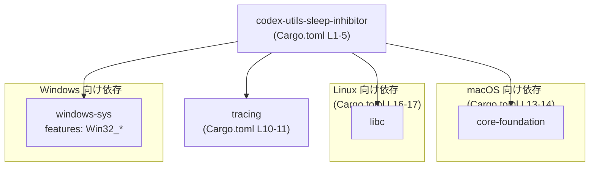
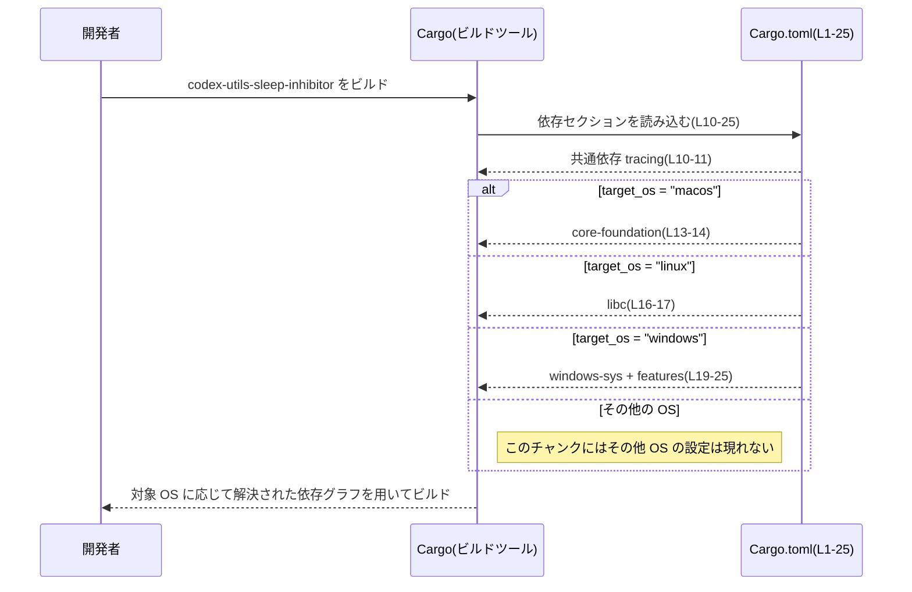

# utils/sleep-inhibitor/Cargo.toml コード解説

## 0. ざっくり一言

`codex-utils-sleep-inhibitor` クレートの **Cargo マニフェスト**であり、ワークスペース共通設定と、OS ごとに異なるシステム依存クレート（`core-foundation` / `libc` / `windows-sys`）を切り替えるための依存関係定義を行うファイルです（`Cargo.toml:L1-25`）。

---

## 1. このモジュールの役割

### 1.1 概要

- このファイルは、Rust クレート `codex-utils-sleep-inhibitor` の **メタデータと依存関係**を定義する Cargo マニフェストです（`Cargo.toml:L1-5,10-25`）。
- バージョン・エディション・ライセンス・lint 設定・一部依存クレートは **ワークスペース共通設定に従う**形になっています（`Cargo.toml:L3-5,L7-8,L11,L17`）。
- 対象 OS ごとに異なる FFI 系クレート（C API をラップしたクレート）を依存として選択することで、OS 非依存な API をこのクレート側で提供する構造が想定されますが、実装コードはこのチャンクには現れません（`Cargo.toml:L13-25`）。

### 1.2 アーキテクチャ内での位置づけ

このファイルから分かる範囲では、`codex-utils-sleep-inhibitor` クレートと依存クレートの関係は次のようになります。



- `codex-utils-sleep-inhibitor` は共通で `tracing` に依存します（`Cargo.toml:L10-11`）。
- ビルドターゲット OS が macOS のときのみ `core-foundation` が有効になります（`Cargo.toml:L13-14`）。
- Linux のときのみ `libc` が有効になります（`Cargo.toml:L16-17`）。
- Windows のときのみ `windows-sys` が有効になり、その際に特定の Win32 系サブモジュールを feature として利用します（`Cargo.toml:L19-25`）。

実際にこれらの依存クレートをどのような API で呼び出しているかは、Rust ソースコード側にあり、このチャンクには現れません。

### 1.3 設計上のポイント

コードから読み取れる設計上の特徴は次の通りです。

- **ワークスペース前提のクレート**  
  - バージョン・エディション・ライセンスは `workspace = true` としており、ワークスペースルート側で一元管理しています（`Cargo.toml:L3-5`）。
  - lint 設定もワークスペース共通化されており、コード品質方針をプロジェクト全体で共有する設計です（`Cargo.toml:L7-8`）。

- **共通トレース基盤の利用**  
  - ログ・トレース用途の `tracing` クレートを依存としており、観測可能性（observability）を前提に設計されていると読めます（`Cargo.toml:L10-11`）。
  - バージョンはワークスペース側で固定され、他クレートと同一の `tracing` バージョンを共有する設計です（`Cargo.toml:L11`）。

- **OS ごとの FFI クレートを切り替える構造**  
  - macOS: `core-foundation` を直接バージョン `0.9` で利用します（`Cargo.toml:L13-14`）。
  - Linux: `libc` のバージョンはワークスペースで管理されます（`Cargo.toml:L16-17`）。
  - Windows: `windows-sys` をバージョン `0.61.2` かつ特定の Win32 サブ API を feature として有効化します（`Cargo.toml:L19-25`）。
  - これらはいずれも C / OS ネイティブ API をラップするクレートであり、Rust 側では通常 `unsafe` を伴う呼び出しとなりますが、具体的な安全性の担保方法は、このファイルからは分かりません。

- **安全性・並行性への示唆（このファイルから分かる範囲）**  
  - FFI クレートを利用していることから、**メモリ安全性** や **スレッド安全性** は呼び出し側（このクレートの実装）で注意が必要な領域であることが推測されます。ただし、その実装が具体的にどうなっているかは、このチャンクには現れません。
  - `tracing` 依存から、エラーや並行実行時の挙動をログ・トレースで観測できるような実装になっている可能性がありますが、詳細は不明です。

### 1.4 コンポーネントインベントリー（本ファイルから分かる範囲）

このセクションでは、「コンポーネント」をクレート単位（および OS 条件付き依存）として整理します。

| コンポーネント名 | 種別 | 対象 OS | 定義/参照箇所 |
|------------------|------|---------|----------------|
| `codex-utils-sleep-inhibitor` | Rust クレート（本体） | 全 OS | `Cargo.toml:L1-5` |
| `tracing` | 依存クレート（共通） | 全 OS | `Cargo.toml:L10-11` |
| `core-foundation` | 依存クレート（FFI） | `target_os = "macos"` | `Cargo.toml:L13-14` |
| `libc` | 依存クレート（FFI） | `target_os = "linux"` | `Cargo.toml:L16-17` |
| `windows-sys` | 依存クレート（FFI、feature 指定） | `target_os = "windows"` | `Cargo.toml:L19-25` |

#### 関数・構造体インベントリー（このファイルに関して）

- このファイルは Cargo の設定ファイルであり、**Rust の関数や構造体定義は一切含みません**（`Cargo.toml:L1-25`）。
- 公開 API やコアロジックは、対応する Rust ソースコード（例: `src/lib.rs` など）に定義されていると考えられますが、このチャンクには現れないため、詳細は不明です。

---

## 2. 主要な機能一覧

このファイル自体は **実行コードを含まない設定ファイル** であるため、「関数レベルの機能」は直接は分かりません。

Cargo.toml から確実に言える「機能」は次の通りです（いずれもビルド設定上の機能です）。

- ワークスペース設定の委譲: バージョン・エディション・ライセンス・lint 設定をワークスペース側に委譲する（`Cargo.toml:L3-5,L7-8`）。
- 共通ログ/トレース基盤の利用準備: `tracing` を依存クレートとして宣言する（`Cargo.toml:L10-11`）。
- macOS 向けの CoreFoundation API 利用準備: `core-foundation` を macOS ターゲット時のみ依存として解決する（`Cargo.toml:L13-14`）。
- Linux 向けの C ランタイム API 利用準備: `libc` を Linux ターゲット時のみ依存として解決する（`Cargo.toml:L16-17`）。
- Windows 向けの Win32 API 利用準備: `windows-sys` の特定サブモジュールを Windows ターゲット時のみ依存として解決する（`Cargo.toml:L19-25`）。

これらを通じて、このクレートは「OS ごとに異なる低レベル API を内部で利用しつつ、外からは一貫したインターフェースを提供する」役割を担っている可能性がありますが、その公開 API はこのファイルからは分かりません。

---

## 3. 公開 API と詳細解説

このチャンクには Rust ソースコードが含まれておらず、型や関数定義が一切見えないため、公開 API の詳細な解説はできません。

### 3.1 型一覧（構造体・列挙体など）

| 名前 | 種別 | 役割 / 用途 | 定義箇所 |
|------|------|-------------|----------|
| （なし） | - | このファイルには型定義がありません | `Cargo.toml:L1-25` |

- 実際の構造体・列挙体は Rust ソースコード側に存在するはずですが、このチャンクには現れないため、内容は不明です。

### 3.2 関数詳細（最大 7 件）

- このファイルには **関数定義が存在しない** ため、関数詳細セクションは該当しません（`Cargo.toml:L1-25`）。
- `core-foundation` / `libc` / `windows-sys` を利用する関数やメソッドは Rust ソース側にあり、そのシグネチャ・エラー型・並行性の扱い等は、このチャンクからは読み取れません。

### 3.3 その他の関数

- 上記と同様に、Cargo.toml 内に関数は存在しないため、該当なしです。

---

## 4. データフロー

このファイル自体には実行時のデータフローは存在しませんが、**ビルド時に Cargo がどのように依存関係を解決するか** という意味での「フロー」を示すと、次のようになります。



- 実際の実行時データフロー（どの関数がどの OS API を呼ぶか）は、Rust ソースコード側に依存し、このチャンクでは分かりません。
- ただし、この設定により「どのプラットフォームでどの FFI クレートがリンクされるか」は明確に決まります。

---

## 5. 使い方（How to Use）

### 5.1 基本的な使用方法

このクレートの **Cargo.toml 自体**の使い方は、通常は以下のようになります。

1. プロジェクトのワークスペースにこのクレートをメンバーとして含める（ワークスペースルートの `Cargo.toml` で管理）。
2. 他クレートから `codex-utils-sleep-inhibitor` に依存する。

例: 同一ワークスペース内の別クレートから依存する場合の設定例です（パスは本ファイルの配置パスに基づく一例です）。

```toml
# （例）他クレートの Cargo.toml

[dependencies]
codex-utils-sleep-inhibitor = { path = "utils/sleep-inhibitor" }
```

- この例では、`utils/sleep-inhibitor/Cargo.toml` に定義されたクレートをローカルパス依存として利用しています。
- 実際のバージョン指定やパス指定は、ワークスペース構成によって異なります。このチャンクから正確なルート位置は分かりません。

### 5.2 よくある使用パターン

Cargo.toml の観点から見た代表的な使用パターンは次の通りです。

- **共通ロギング基盤としての `tracing` 利用**  
  - `codex-utils-sleep-inhibitor` 内部で `tracing` を用いてイベントやエラーを記録し、他クレートも同じ `tracing` を使うことで、一貫したログ/トレースを得る構成が考えられます（`Cargo.toml:L10-11`）。

- **クロスプラットフォーム・ビルド**  
  - 同じソースコードを対象 OS ごとにビルドする際、Cargo は自動的に該当 OS の依存クレートのみを解決します（`Cargo.toml:L13-25`）。
  - これにより、アプリケーションコードは `codex-utils-sleep-inhibitor` の API だけを意識し、OS ごとの依存設定はこのファイル側に閉じ込められます。

※ 実際にどのような API で `codex-utils-sleep-inhibitor` が呼ばれるかは、このチャンクには現れません。

### 5.3 よくある間違い（Cargo 設定面で想定されるもの）

このファイルの内容から想定される、設定面での典型的な問題例を挙げます。

```toml
# （誤り例）OS 固有依存を共通 dependencies に追加してしまう
[dependencies]
core-foundation = "0.9" # macOS 以外でも解決されてしまう
```

```toml
# （より適切な例）OS ごとの target セクションに分ける
[target.'cfg(target_os = "macos")'.dependencies]
core-foundation = "0.9"
```

- このファイルではすでに OS ごとの target セクションを用いており（`Cargo.toml:L13-25`）、その点は整合的です。
- ここから外して共通依存にしてしまうと、Windows・Linux でも不要なクレートを解決したり、ビルドエラーの原因になることがあります。

### 5.4 使用上の注意点（まとめ）

- **FFI クレート利用に伴う安全性**  
  - `core-foundation` / `libc` / `windows-sys` は OS ネイティブ API をラップするクレートであり、通常は `unsafe` を伴う呼び出しとなります。
  - このファイル自体は安全性に直接影響しませんが、これらを利用する実装では、ポインタ操作・ライフタイム・スレッド安全性などに注意が必要です。  
    （具体的な対策や API は、このチャンクからは分かりません。）

- **OS ごとの依存を増やす際の整合性**  
  - 新たに OS 固有の機能を追加する場合、対応する target セクションを追加・変更し、すべてのサポート OS でビルド可能かを確認する必要があります（`Cargo.toml:L13-25`）。

- **テスト関連の依存**  
  - このファイルには `[dev-dependencies]` などテスト専用依存は定義されていません（`Cargo.toml:L1-25`）。
  - テスト用クレートやモックは、ワークスペースルート側か別ファイルで管理されている可能性がありますが、このチャンクからは不明です。

---

## 6. 変更の仕方（How to Modify）

### 6.1 新しい機能を追加する場合（Cargo.toml 観点）

何らかの新機能に伴い OS 固有の API を利用したい場合、このファイルの変更ポイントは概ね次のようになります。

1. **共通の Rust 依存クレートを追加する**  
   - すべての OS で利用するライブラリであれば、`[dependencies]` セクションに追記します（`Cargo.toml:L10-11` を参考）。

2. **OS 固有の依存クレートを追加する**  
   - ある OS にだけ必要な依存であれば、`[target.'cfg(target_os = "...")'.dependencies]` セクションに追加します（`Cargo.toml:L13-17,L19-25`）。
   - 既存構造に揃えることで、ビルドターゲットごとの依存が明確になります。

3. **ワークスペースでバージョン管理するかを決める**  
   - `workspace = true` を用いるか、ローカルにバージョンを固定するかを選びます（`tracing` と `libc` は workspace 管理、`core-foundation` と `windows-sys` はローカル指定という現在の方針が見えます: `Cargo.toml:L11,L14,L17,L20`）。

4. **安全性・並行性の観点**  
   - 追加する依存が FFI クレートの場合、Rust 側実装での `unsafe` 利用やマルチスレッド時の制約などを設計に反映させる必要がありますが、その実装場所は Rust ソース側であり、このファイルからは分かりません。

### 6.2 既存の機能を変更する場合

既存依存を更新・削除する際の注意点です。

- **依存バージョンの更新**  
  - `core-foundation` / `windows-sys` のバージョンを変更する場合は、API の互換性を確認する必要があります（`Cargo.toml:L14,L20`）。
  - `tracing` / `libc` はワークスペース管理のため、ルート側でバージョンを変更すると、他クレートへの影響範囲も広くなります（`Cargo.toml:L11,L17`）。

- **feature の変更（Windows）**  
  - `windows-sys` の feature リストを変更すると、利用可能な Win32 API 群が変わります（`Cargo.toml:L20-25`）。
  - 使っている API に対応する feature を外すとビルドエラーになるため、Rust ソース側の利用箇所との整合性を確認する必要があります。

- **依存削除の影響範囲**  
  - 依存クレートを削除する前に、`ripgrep` 等でそのクレートの型・関数が使われていないかを確認する必要がありますが、このチャンクからは使用箇所が見えないため、別途ソースコードを調査する必要があります。

---

## 7. 関連ファイル

このチャンクには、他ファイルへのパスや参照は含まれていません。

| パス | 役割 / 関係 |
|------|------------|
| （不明） | この Cargo.toml に対応する Rust ソースファイル（例: `src/lib.rs` など）が存在するはずですが、このファイルから具体的なパスは分かりません。 |
| （不明） | ワークスペースルートの `Cargo.toml` の存在が前提になっていますが、その場所や内容はこのチャンクには現れません。 |

---

### まとめ（このチャンクから言える範囲）

- このファイルは `codex-utils-sleep-inhibitor` クレートの **ビルド設定と依存関係**のみを定義しており、公開 API やコアロジックは **一切含まれていません**（`Cargo.toml:L1-25`）。
- OS ごとに異なる FFI クレートを利用するための準備がなされており、安全性・並行性・エラー処理の詳細は **Rust 実装側に委ねられている** ことが分かります。
- コンポーネント（クレート）と依存関係、ビルド時の依存解決フローは把握できますが、実際の関数やデータフローは、このチャンクだけでは不明です。
