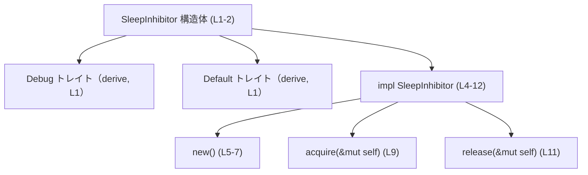
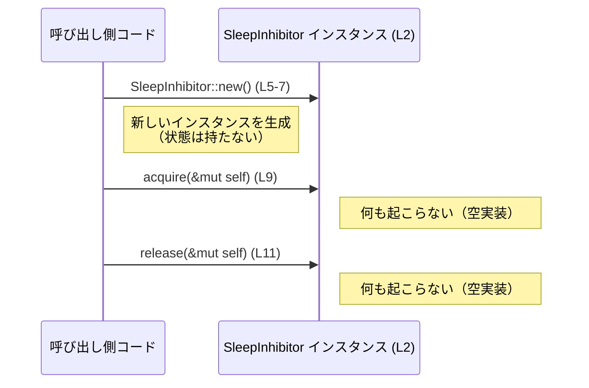

# utils/sleep-inhibitor/src/dummy.rs コード解説

## 0. ざっくり一言

フィールドを持たない `SleepInhibitor` 構造体と、その空実装のメソッドを定義するモジュールです（`dummy.rs:L1-12`）。  
実行時に副作用となる処理は一切含まれていません。

> 注: 以下の行番号は、このスニペットの先頭行を `L1` として付与しています。

---

## 1. このモジュールの役割

### 1.1 概要

- このモジュールは `SleepInhibitor` という名前の構造体を定義し（`dummy.rs:L1-2`）、それに対して
  - インスタンス生成用の `new` メソッド（`dummy.rs:L5-7`）
  - 空の `acquire` / `release` メソッド（`dummy.rs:L9-11`）
  を提供します。
- いずれのメソッドも本ファイル内では何の処理も行わず、副作用を伴いません（`dummy.rs:L9-11`）。

構造体名やメソッド名からは「スリープ抑止（sleep inhibitor）」のインターフェースを表す型と解釈できますが、  
このファイルだけから用途や上位の設計意図を断定することはできません。

### 1.2 アーキテクチャ内での位置づけ

- このファイルでは、外部モジュール・外部クレートの関数や型は明示的に参照されていません（`dummy.rs:L1-12`）。
- `#[derive(Debug, Default)]` により、標準ライブラリの `Debug` / `Default` トレイト実装が自動生成されます（`dummy.rs:L1`）。

このファイル内の関係を簡略化した依存関係図は次の通りです。



このチャンクには、`SleepInhibitor` がどのモジュールから呼び出されるかに関する情報は現れません。

### 1.3 設計上のポイント

- **ゼロフィールド構造体**  
  - `SleepInhibitor` はフィールドを一切持たない構造体として定義されています（`dummy.rs:L2`）。  
    実行時に追加データを保持しないため、インスタンスは論理的に「マーカー」や「ハンドル」として振る舞います。
- **空実装のメソッド**  
  - `acquire` / `release` の本体は空で、副作用となる処理は行われません（`dummy.rs:L9-11`）。
- **可視性の範囲**  
  - 構造体とメソッドはいずれも `pub(crate)` で、同一クレート内からのみ利用可能です（`dummy.rs:L2, L5, L9, L11`）。  
    外部クレートには直接公開されません。
- **エラーやパニックの可能性がない**  
  - `Result` や `Option` を返さず、`panic!` や `unwrap` も使用していないため、  
    このモジュール内のコードはエラーを返したりパニックを起こしたりしません（`dummy.rs:L1-12`）。
- **並行性に関する要素がない**  
  - `unsafe` ブロックやスレッド・非同期ランタイム関連の API 呼び出しはなく、  
    並行実行に関する特別な処理は登場しません（`dummy.rs:L1-12`）。

---

## 2. 主要な機能一覧

このファイルが提供する主な機能は次の通りです（いずれもクレート内公開）。

- `SleepInhibitor` 構造体の定義: フィールドを持たないマーカー的な型（`dummy.rs:L2`）
- `SleepInhibitor::new`: 新しい `SleepInhibitor` インスタンスを生成（`dummy.rs:L5-7`）
- `SleepInhibitor::acquire`: 何も行わない取得処理のプレースホルダ（`dummy.rs:L9`）
- `SleepInhibitor::release`: 何も行わない解放処理のプレースホルダ（`dummy.rs:L11`）

---

## 3. 公開 API と詳細解説

### 3.0 コンポーネントインベントリー（行番号付き）

| 種別 | 名前 / シグネチャ | 可視性 | 役割 | 定義位置 |
|------|-------------------|--------|------|----------|
| 構造体 | `SleepInhibitor` | `pub(crate)` | フィールドを持たない型本体 | `dummy.rs:L1-2` |
| impl ブロック | `impl SleepInhibitor` | - | メソッド定義をまとめるブロック | `dummy.rs:L4-12` |
| メソッド | `fn new() -> Self` | `pub(crate)` | 新しい `SleepInhibitor` を生成 | `dummy.rs:L5-7` |
| メソッド | `fn acquire(&mut self)` | `pub(crate)` | 空の取得処理（副作用なし） | `dummy.rs:L9` |
| メソッド | `fn release(&mut self)` | `pub(crate)` | 空の解放処理（副作用なし） | `dummy.rs:L11` |

※ このファイルには、これ以外の関数・型は定義されていません（`dummy.rs:L1-12`）。

### 3.1 型一覧（構造体・列挙体など）

| 名前 | 種別 | 可視性 | 役割 / 用途 | 定義位置 |
|------|------|--------|-------------|----------|
| `SleepInhibitor` | 構造体（フィールドなし） | `pub(crate)` | スリープ抑止に関するインターフェースの実装対象と推測される、フィールドを持たない型本体。このファイルではメソッドとセットでプレースホルダとして機能します。 | `dummy.rs:L1-2` |

### 3.2 関数詳細

#### `SleepInhibitor::new() -> SleepInhibitor`

**概要**

- 新しい `SleepInhibitor` インスタンスを生成して返します（`dummy.rs:L5-7`）。
- 引数はなく、常に同じ形のインスタンスを返します。

**引数**

なし。

**戻り値**

- 型: `SleepInhibitor`
- フィールドを持たない `SleepInhibitor` の新しいインスタンスを返します（`dummy.rs:L5-7`）。

**内部処理の流れ**

1. `Self`（= `SleepInhibitor`）をそのまま返しています（`dummy.rs:L6`）。
2. フィールドがないため、追加の初期化処理や計算は行われません。

**Examples（使用例）**

```rust
// `SleepInhibitor` 型を使うための宣言（同一クレート内想定）
use crate::utils::sleep_inhibitor::dummy::SleepInhibitor;

// 新しい SleepInhibitor インスタンスを生成する例
fn main() {
    let mut inhibitor = SleepInhibitor::new(); // new() でインスタンスを生成（L5-7）
    // inhibitor はここでは何の状態も持たず、副作用もありません
}
```

**Errors / Panics**

- このメソッドは常に成功し、エラーやパニックは発生しません。
  - `Result` や `Option` を返さず、`panic!` なども使用していません（`dummy.rs:L5-7`）。

**Edge cases（エッジケース）**

- 引数がなく、内部処理も定数的であるため、特筆すべきエッジケースはありません。

**使用上の注意点**

- 戻り値のインスタンスはフィールドを持たないため、この型単体では状態管理やリソース保持は行われません（`dummy.rs:L2`）。
- 実際に何らかの OS リソースやハンドルを保持させたい場合は、構造体にフィールドを追加する必要があります。

---

#### `SleepInhibitor::acquire(&mut self)`

**概要**

- `SleepInhibitor` に対する「取得」操作を表すメソッドですが、  
  本ファイルでは本体が空であり、何の処理も行いません（`dummy.rs:L9`）。

**引数**

| 引数名 | 型 | 説明 |
|--------|----|------|
| `&mut self` | `&mut SleepInhibitor` | 呼び出し対象となる `SleepInhibitor` の可変参照 |

**戻り値**

- 戻り値はなく、ユニット型 `()` です（暗黙的戻り値、`dummy.rs:L9`）。
- 何も返さず、かつ副作用もありません。

**内部処理の流れ**

1. メソッド本体 `{}` が空であるため（`dummy.rs:L9`）、処理は即座に終了します。
2. 内部状態の更新や外部リソース操作は一切行われません。

**Examples（使用例）**

```rust
use crate::utils::sleep_inhibitor::dummy::SleepInhibitor;

fn main() {
    let mut inhibitor = SleepInhibitor::new(); // インスタンス生成（L5-7）

    // acquire を呼び出すが、この実装では何も起こらない（L9）
    inhibitor.acquire();

    // この後も inhibitor の状態は変化していません（フィールドがないため）
}
```

**Errors / Panics**

- エラーやパニックは発生しません。
  - 本体に処理がなく、`panic!`・`unwrap` なども使用していません（`dummy.rs:L9`）。

**Edge cases（エッジケース）**

- あらゆるタイミングで呼び出しても、動作は「何も起こらない」のみです。
- `self` がどのような状態であっても（そもそも状態を持ちませんが）、結果は変わりません。

**使用上の注意点**

- このメソッドを呼び出しても、OS のスリープ抑止など外部への影響は一切ありません。  
  そのため、「呼べば何かをロックしてくれる」と期待すると、本ファイル単体の実装では目的を満たせません。
- 可変参照 `&mut self` を受け取るため、同じインスタンスに対して同時に複数スレッドから呼び出すことはコンパイラにより防がれますが、  
  そもそも内部状態がないため、並行性上の問題は読み取れません（`dummy.rs:L2, L9`）。

---

#### `SleepInhibitor::release(&mut self)`

**概要**

- `SleepInhibitor` に対する「解放」操作を表すメソッドですが、  
  `acquire` と同様に本体が空で、何の処理も行いません（`dummy.rs:L11`）。

**引数**

| 引数名 | 型 | 説明 |
|--------|----|------|
| `&mut self` | `&mut SleepInhibitor` | 呼び出し対象となる `SleepInhibitor` の可変参照 |

**戻り値**

- 戻り値はなく、ユニット型 `()` です（暗黙的戻り値、`dummy.rs:L11`）。

**内部処理の流れ**

1. 本体 `{}` が空であるため（`dummy.rs:L11`）、即座に終了します。
2. ロック解除やリソース解放などの処理は行われません。

**Examples（使用例）**

```rust
use crate::utils::sleep_inhibitor::dummy::SleepInhibitor;

fn main() {
    let mut inhibitor = SleepInhibitor::new(); // 生成（L5-7）

    inhibitor.acquire(); // 何もしない取得（L9）
    inhibitor.release(); // 何もしない解放（L11）

    // acquire / release の前後で、観測可能な変化はありません
}
```

**Errors / Panics**

- エラーやパニックは発生しません（`dummy.rs:L11`）。

**Edge cases（エッジケース）**

- `acquire` を呼ばずに `release` のみを呼んでも、内部状態がないため、動作は変わりません。
- 複数回連続して `release` を呼び出しても、何も起こりません。

**使用上の注意点**

- 実際に何かのロック解除やスリープ抑止解除を行いたい場合、この空実装だけでは不十分です。  
  必要に応じて、このメソッド内に具体的な処理を追加する必要があります。

---

### 3.3 その他の関数

- このファイルには、上記以外の補助関数・ラッパー関数は存在しません（`dummy.rs:L1-12`）。

---

## 4. データフロー

このファイル内には他コードとのやり取りはなく、メソッドも空実装であるため、  
実際のデータの流れはほとんど存在しません。

想定される典型的な利用フロー（例）を、シーケンス図として示します。  
※あくまで API 定義から考えられる利用例であり、実際にどこから呼ばれているかはこのチャンクには現れません。



ポイント:

- インスタンス生成時にも、その後の `acquire` / `release` 呼び出し時にも、  
  内部状態の変更や外部システムとの通信は行われません（`dummy.rs:L2, L5-7, L9, L11`）。
- Rust の所有権・借用の観点では、`acquire` / `release` はどちらも `&mut self` を受け取るため、  
  同一インスタンスに対する同時並行の呼び出しはコンパイル時に防止されますが、  
  内部状態がないため実行時のデータ競合も発生しません。

---

## 5. 使い方（How to Use）

### 5.1 基本的な使用方法

このモジュールの API を用いた最も直接的な利用例は、以下のようなコードです。

```rust
use crate::utils::sleep_inhibitor::dummy::SleepInhibitor; // 同一クレート内からの使用を想定

fn main() {
    // 1. インスタンスを生成する
    let mut inhibitor = SleepInhibitor::new(); // new() で生成（L5-7）

    // 2. 何らかの処理の前に acquire を呼ぶ（この実装では何も起こらない）
    inhibitor.acquire(); // L9

    // ... 実際のアプリケーション処理 ...

    // 3. 処理終了後に release を呼ぶ（この実装では何も起こらない）
    inhibitor.release(); // L11
}
```

この実装では、上記コードを実行しても観測可能な動作は変化しません。

### 5.2 よくある使用パターン（想定例）

このファイルだけから実際の呼び出しパターンは分かりませんが、  
API 形状から考えられる典型的なパターンは次の通りです。

1. **処理全体を囲む acquire/release**

   - ある処理ブロックの前後で `acquire` / `release` を呼ぶパターン。
   - RAII（スコープに応じた自動解放）ではなく、明示的なペア呼び出しです。

2. **ダミー実装としての利用**

   - 実際のプラットフォーム向け実装とは別に、「何もしない実装」として差し替える用途。  
     ただし、差し替えの仕組みや他プラットフォームの実装は、このチャンクには現れません。

### 5.3 よくある間違い（起こりうる勘違い）

このファイルの実装に限定した場合、想定される誤解は次のようなものです。

```rust
// 誤解しがちな例: acquire/release が何かをロック／アンロックすると期待している
fn use_inhibitor_wrong() {
    let mut inhibitor = SleepInhibitor::new();
    inhibitor.acquire();

    // 「ここではスリープしないはず」と期待してしまうかもしれないが、
    // dummy.rs の実装では何も行われない（L9）

    inhibitor.release();
}

// 実際の挙動（このファイルの範囲内で言えること）:
// - acquire/release は空実装で、外部システムへの作用は一切ない
```

### 5.4 使用上の注意点（まとめ）

- **機能面**
  - `acquire` / `release` は空実装であり、  
    スリープ抑止やロック取得などの実動作は一切行いません（`dummy.rs:L9, L11`）。
- **安全性（メモリ / 並行性）**
  - `unsafe` ブロックやポインタ操作がなく、メモリ安全性に関する特別な注意点はありません（`dummy.rs:L1-12`）。
  - メソッドが `&mut self` を要求するため、同一インスタンスに対する並行呼び出しはコンパイル時に制限されます。
- **エラー処理**
  - エラーを返す手段がないため、「処理失敗を検出する」といった目的には適しません。
  - 実際にエラーを検出したい場合は、戻り値を `Result` などに変更する必要があります。

---

## 6. 変更の仕方（How to Modify）

### 6.1 新しい機能を追加する場合

スリープ抑止など実際の機能を追加したい場合、一般的には次のような変更が想定されます（コードから導かれる構造の範囲で記述します）。

1. **構造体にフィールドを追加**

   - 例: OS 依存のハンドルや、状態フラグなどを持たせる。
   - 変更箇所: `SleepInhibitor` 定義（`dummy.rs:L2`）。

2. **`new` の初期化処理を追加**

   - 追加されたフィールドを初期化する処理を `new` に記述する。
   - 変更箇所: `SleepInhibitor::new` 本体（`dummy.rs:L5-7`）。

3. **`acquire` / `release` に実処理を追加**

   - OS の API 呼び出しや内部フラグ更新などを行う。
   - 変更箇所: `dummy.rs:L9, L11`。

4. **必要に応じてエラー処理を導入**

   - 失敗し得る処理を追加する場合、戻り値を `Result` に変更し、呼び出し側との契約を見直す。

### 6.2 既存の機能を変更する場合の注意点

- **クレート内 API としての契約**
  - 現在は「何もしない」「常に成功する」という挙動が前提になっている可能性があります。  
    これを変更すると、呼び出し側コードの挙動が変わるため、影響範囲を確認する必要があります。
- **呼び出し順の前提**
  - このファイルからは `acquire` → `release` の呼び出し順を強制するコードは読み取れません。  
    もし順序を前提とする仕様に変更する場合は、その前提をコード（もしくはドキュメント）で明示する必要があります。
- **テスト**
  - このチャンクにはテストコードは含まれていません（`dummy.rs:L1-12`）。  
    挙動を変更する際には、別ファイルにあるかもしれないテストの有無を確認し、必要なテストを追加することが望ましいです。

---

## 7. 関連ファイル

このチャンク（`utils/sleep-inhibitor/src/dummy.rs`）には、他のファイルやモジュールへの直接の参照は登場しません（`dummy.rs:L1-12`）。  
そのため、関連ファイルについて確定的に言える情報はありません。

| パス | 役割 / 関係 |
|------|------------|
| 不明 | このチャンクには他ファイルへの参照が現れないため、関連ファイルは特定できません。 |

---

## 補足: Bugs / Security / テスト / パフォーマンスの観点

- **バグの可能性**
  - コード上の明確なバグ（未初期化使用・パニックなど）は見当たりません（`dummy.rs:L1-12`）。
  - 機能的には「何もしない」こと自体が設計上の選択であり、その妥当性は他ファイル側の期待値に依存します（このチャンクには現れません）。

- **セキュリティ**
  - 外部入力の処理やネットワーク・ファイル I/O を行っておらず、`unsafe` も使用していないため、  
    セキュリティ上の直接的なリスクはコードからは読み取れません。

- **テスト**
  - このファイル内に `#[cfg(test)]` モジュールやテスト関数は存在しません（`dummy.rs:L1-12`）。

- **パフォーマンス**
  - メソッド本体が空であり、処理負荷は無視できる程度です。
  - 構造体がフィールドを持たないため、インスタンス生成・メソッド呼び出しのオーバーヘッドも極小です。
