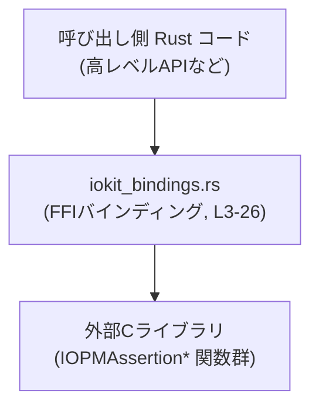
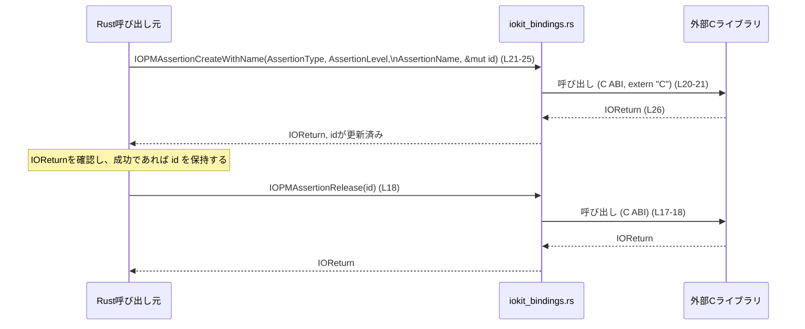

# utils\sleep-inhibitor\src\iokit_bindings.rs コード解説

## 0. ざっくり一言

C 側の `IOPMAssertion*` 系 API を Rust から呼び出すための、生の FFI バインディング（型・定数・関数宣言）を定義しているファイルです（`iokit_bindings.rs:L1-27`）。

---

## 1. このモジュールの役割

### 1.1 概要

- このモジュールは、外部 C ライブラリに存在する `IOPMAssertionRelease` および `IOPMAssertionCreateWithName` 関数を Rust から直接呼び出せるようにするための **低レベル FFI 定義** を提供します（`iokit_bindings.rs:L17-26`）。
- そのために、C 側の型（`kern_return_t`, `CFStringRef` など）に対応する Rust の型エイリアスや、戻り値用の定数（`kIOReturnSuccess`）を定義しています（`iokit_bindings.rs:L3-16`）。
- 実際のロジック（スリープ抑止など）がどう動くかは C 実装側にあり、このファイルには含まれていません。

### 1.2 アーキテクチャ内での位置づけ

このモジュールは、Rust コードと外部 C ライブラリの間にある **境界レイヤ** の役割を持ちます。



- Rust 側からは `pub` な定数・型・関数（`IOPMAssertionCreateWithName`, `IOPMAssertionRelease`）を通じて C ライブラリにアクセスします（`iokit_bindings.rs:L3-16, L17-26`）。
- `extern "C"` の宣言により、C の ABI（バイナリ呼び出し規約）でリンクされる前提となっています（`iokit_bindings.rs:L17, L20`）。

### 1.3 設計上のポイント

コードから読み取れる設計上の特徴は次のとおりです。

- **自動生成ファイル**  
  - 先頭コメントに「`automatically generated by rust-bindgen 0.71.1`」とあり、自動生成されたコードであることが明記されています（`iokit_bindings.rs:L1`）。
  - 通常、この種のファイルは直接編集ではなく、bindgen の設定や元ヘッダを変更して再生成する運用になります。

- **C 互換レイアウトと型エイリアス**
  - `__CFString` 構造体は `#[repr(C)]` で C と同じメモリレイアウトを持つことが保証されています（`iokit_bindings.rs:L4-7`）。
  - `kern_return_t`, `_bindgen_ty_36` などは `c_int` や `c_uint` に型エイリアスされており、C 側の型定義に合わせています（`iokit_bindings.rs:L10, L16`）。

- **Opaque（不透明）なポインタ型**
  - `__CFString` は `_unused: [u8; 0]` のみを持つゼロサイズ構造体で、実体を触らずポインタ経由でのみ扱う「不透明な型」として使われています（`iokit_bindings.rs:L4-9`）。
  - `CFStringRef = *const __CFString` により、C 側の文字列オブジェクトを指す生ポインタ型を表現しています（`iokit_bindings.rs:L9`）。

- **unsafe extern "C" 関数**
  - 外部関数は `unsafe extern "C"` として宣言されており（`iokit_bindings.rs:L17-26`）、呼び出しは必ず `unsafe` ブロック内で行う必要があります。
  - Rust コンパイラは引数の妥当性やスレッド安全性をチェックできず、FFI 呼び出しの安全性は呼び出し側の責任になります。

- **エラーコード式の戻り値**
  - `IOPMAssertionRelease`, `IOPMAssertionCreateWithName` は `IOReturn`（実体は `c_int`）を返します（`iokit_bindings.rs:L11, L18, L26`）。
  - `kIOReturnSuccess: u32 = 0` という定数が定義され、0 が「成功」を表す戻り値として使われる想定であることが読み取れます（`iokit_bindings.rs:L3`）。

---

## 2. 主要な機能一覧 ＆ コンポーネントインベントリー

### 2.1 機能一覧（高レベル）

- C の戻り値型・ID 型のエイリアス定義: `kern_return_t`, `IOReturn`, `IOPMAssertionID`, `IOPMAssertionLevel`（`iokit_bindings.rs:L10-13`）
- CFString を表す不透明なポインタ型の定義: `__CFString`, `CFStringRef`（`iokit_bindings.rs:L4-9`）
- 戻り値およびアサーションレベルの定数定義: `kIOReturnSuccess`, `kIOPMAssertionLevelOff`, `kIOPMAssertionLevelOn`（`iokit_bindings.rs:L3, L14-15`）
- 外部 C 関数の宣言:
  - `IOPMAssertionRelease`（`iokit_bindings.rs:L17-19`）
  - `IOPMAssertionCreateWithName`（`iokit_bindings.rs:L20-26`）

### 2.2 コンポーネントインベントリー（行番号付き）

| 名前 | 種別 | 定義位置 | 概要 |
|------|------|----------|------|
| `kIOReturnSuccess` | `pub const u32` | `iokit_bindings.rs:L3` | `IOReturn` が成功であることを表すと考えられる定数（値は 0）。 |
| `__CFString` | `pub struct` | `iokit_bindings.rs:L4-7` | C 側の `CFString` 相当を表す不透明なゼロサイズ構造体。直接インスタンス化せずポインタ経由で利用する想定。 |
| `CFStringRef` | `pub type` | `iokit_bindings.rs:L9` | `*const __CFString` へのポインタ型。C 側の文字列オブジェクトを指す。 |
| `kern_return_t` | `pub type` | `iokit_bindings.rs:L10` | C の `kern_return_t` に対応する `c_int` 型エイリアス。 |
| `IOReturn` | `pub type` | `iokit_bindings.rs:L11` | `kern_return_t` の別名。外部関数の戻り値として使われる。 |
| `IOPMAssertionID` | `pub type` | `iokit_bindings.rs:L12` | アサーション（何らかのハンドル）を識別する ID を表す `u32`。 |
| `IOPMAssertionLevel` | `pub type` | `iokit_bindings.rs:L13` | アサーションの「レベル」（有効/無効など）を表す `u32`。 |
| `kIOPMAssertionLevelOff` | `pub const _bindgen_ty_36` | `iokit_bindings.rs:L14` | アサーションレベルが「Off」を表す定数（値 0）。 |
| `kIOPMAssertionLevelOn` | `pub const _bindgen_ty_36` | `iokit_bindings.rs:L15` | アサーションレベルが「On」を表す定数（値 255）。 |
| `_bindgen_ty_36` | `pub type` | `iokit_bindings.rs:L16` | `c_uint` のエイリアス。レベル定数の型として使用。 |
| `IOPMAssertionRelease` | `pub unsafe extern "C" fn` | `iokit_bindings.rs:L17-19` | `IOPMAssertionID` を受け取り `IOReturn` を返す外部 C 関数。アサーションの解放に対応する名前。 |
| `IOPMAssertionCreateWithName` | `pub unsafe extern "C" fn` | `iokit_bindings.rs:L20-26` | 各種パラメータを受け取り `IOPMAssertionID` を生成する外部 C 関数。作成に対応する名前。 |

---

## 3. 公開 API と詳細解説

### 3.1 型一覧（構造体・型エイリアス）

主に FFI 用の型が公開されています。

| 名前 | 種別 | 役割 / 用途 | 根拠 |
|------|------|-------------|------|
| `__CFString` | 構造体 | C 側の `CFString` 相当を表す不透明な型。実体を扱わず、ポインタ越しにのみ利用する前提です。 | `iokit_bindings.rs:L4-7` |
| `CFStringRef` | 型エイリアス | `*const __CFString`。C 側文字列オブジェクトへの参照を表現します。 | `iokit_bindings.rs:L9` |
| `kern_return_t` | 型エイリアス | OS/ライブラリ共通の戻り値型 `c_int`。FFI 関数の戻り値の基礎型です。 | `iokit_bindings.rs:L10` |
| `IOReturn` | 型エイリアス | `kern_return_t` の別名。`IOPMAssertion*` 関数の戻り値として使われます。 | `iokit_bindings.rs:L11, L18, L26` |
| `IOPMAssertionID` | 型エイリアス | アサーションを識別する ID（`u32`）。`Create` 側で生成され、`Release` 側に渡されることが想定されます。 | `iokit_bindings.rs:L12, L18, L25` |
| `IOPMAssertionLevel` | 型エイリアス | アサーションのレベル（`u32`）。`kIOPMAssertionLevelOff/On` などの定数と組み合わせて使用されます。 | `iokit_bindings.rs:L13-15, L23` |
| `_bindgen_ty_36` | 型エイリアス | `c_uint`。`kIOPMAssertionLevelOff/On` の型として利用されます。 | `iokit_bindings.rs:L14-16` |

定数についての補足:

- `kIOReturnSuccess: u32 = 0` は、`IOReturn` が成功であることを示す用途の定数と考えられます（`iokit_bindings.rs:L3`）。
- `kIOPMAssertionLevelOff = 0`, `kIOPMAssertionLevelOn = 255` は、`IOPMAssertionLevel` の代表的な値を表す定数です（`iokit_bindings.rs:L14-15`）。

### 3.2 関数詳細

このファイルに定義されている外部関数は 2 つだけなので、両方を詳細に説明します。

#### `IOPMAssertionRelease(AssertionID: IOPMAssertionID) -> IOReturn`

**概要**

- `IOPMAssertionID` を引数に取り、`IOReturn` を返す外部 C 関数です（`iokit_bindings.rs:L17-19`）。
- 名前から、先に取得したアサーションを解放する用途であると解釈できますが、具体的な動作は C 実装側に依存し、このファイルだけでは分かりません。

**引数**

| 引数名 | 型 | 説明 | 根拠 |
|--------|----|------|------|
| `AssertionID` | `IOPMAssertionID` (`u32`) | 何らかのアサーションを識別する ID。通常は `IOPMAssertionCreateWithName` で取得した ID を渡すと解釈できます。 | `iokit_bindings.rs:L12, L18` |

**戻り値**

- 型: `IOReturn`（実体は `c_int`）（`iokit_bindings.rs:L11, L18`）。
- このファイルでは 0 (`kIOReturnSuccess`) 以外の値の意味は定義されていませんが、`kIOReturnSuccess = 0` が存在することから、0 が成功を表すことが想定されます（`iokit_bindings.rs:L3`）。

**内部処理の流れ（FFI 観点）**

Rust 側から見た処理の流れを示します（C 側の内部処理は不明です）。

1. 呼び出し側が `IOPMAssertionID` を準備し、`unsafe` ブロック内で `IOPMAssertionRelease` を呼び出す（`iokit_bindings.rs:L18`）。
2. Rust ランタイムは C の ABI 規約に従って、ID をレジスタ/スタック経由で外部 C 関数に渡します（`extern "C"` による指定、`iokit_bindings.rs:L17`）。
3. 外部 C 関数が実行され、`kern_return_t` 型の戻り値を返します（`iokit_bindings.rs:L10-11`）。
4. その戻り値が `IOReturn` として Rust 側に戻されます。

**Examples（使用例）**

以下は、ID を解放する処理を行う想定の使用例です。CFString の生成手段などはこのファイルに含まれていないため、省略します。

```rust
use utils::sleep_inhibitor::iokit_bindings::{
    IOPMAssertionID, IOPMAssertionRelease, IOReturn, kIOReturnSuccess,
};

// どこかで IOPMAssertionCreateWithName により取得した ID があるとする
fn release_assertion(id: IOPMAssertionID) -> Result<(), IOReturn> {
    unsafe {
        // 外部C関数を呼び出すため、unsafeブロックが必要
        let result: IOReturn = IOPMAssertionRelease(id);

        // 成功とみなせるかどうかを kIOReturnSuccess との比較で判断する
        if result == kIOReturnSuccess as IOReturn {
            Ok(())
        } else {
            Err(result)
        }
    }
}
```

※ `IOPMAssertionID` の取得方法や意味はこのファイルには書かれていないため、「ID は有効である」と仮定した例になっています。

**Errors / Panics（エラー条件）**

- Rust レベルでは、関数シグネチャ上はパニックや `Result` は利用しておらず、単に `IOReturn` を返すだけです（`iokit_bindings.rs:L18`）。
- `kIOReturnSuccess` 以外の値が返ってきた場合の扱い（エラーか否か、個々の値の意味）はこのファイルには定義されていません。
- `AssertionID` に不正な値（未初期化、意味のない ID）を渡した場合、C 側がどう振る舞うかは不明であり、一般的な FFI の前提として未定義動作・エラーが起こり得ます。

**Edge cases（エッジケース）**

- `AssertionID = 0` や極端に大きな値: 型が単なる `u32` であるため Rust 側では特別扱いされません（`iokit_bindings.rs:L12`）。意味は C 側の仕様に依存します。
- 同じ ID を複数回解放する: このファイルには制約が記述されておらず、C 側の仕様に依存します（複数回解放が許容されるかどうかは不明です）。
- スレッド間共有: `IOPMAssertionID` は `u32` なのでスレッド間でコピー・共有できますが、C ライブラリがスレッド安全かどうかはこのファイルからは分かりません。

**使用上の注意点**

- **unsafe の必要性**  
  - 関数は `unsafe extern "C"` として宣言されており（`iokit_bindings.rs:L17-18`）、呼び出しは必ず `unsafe` ブロック内で行う必要があります。
- **ID の妥当性の保証**  
  - 渡す `AssertionID` が、適切な作成関数から取得した有効な値であることを呼び出し側が保証する必要があります。
- **戻り値のチェック**  
  - 戻り値は `IOReturn` であり、成功かどうかは呼び出し側で判定する必要があります。少なくとも `kIOReturnSuccess` との比較は可能です（`iokit_bindings.rs:L3`）。

---

#### `IOPMAssertionCreateWithName(AssertionType, AssertionLevel, AssertionName, AssertionID) -> IOReturn`

**概要**

- 複数の引数を受け取り、`IOPMAssertionID` を出力パラメータとして返す外部 C 関数です（`iokit_bindings.rs:L20-26`）。
- 名前から、「アサーションを作成し、その ID を `AssertionID` 経由で返す」役割があると解釈できますが、詳細な意味や副作用は C 実装に依存します。

**引数**

| 引数名 | 型 | 説明 | 根拠 |
|--------|----|------|------|
| `AssertionType` | `CFStringRef` (`*const __CFString`) | アサーションの種別を表す C 側文字列へのポインタと考えられます。実際の文字列内容や有効な値は不明です。 | `iokit_bindings.rs:L9, L21-22` |
| `AssertionLevel` | `IOPMAssertionLevel` (`u32`) | アサーションのレベルを表す値。`kIOPMAssertionLevelOff/On` などの定数を渡す想定です。 | `iokit_bindings.rs:L13-15, L23` |
| `AssertionName` | `CFStringRef` | アサーションの名前・説明を表す文字列へのポインタと解釈できます。具体的な使用方法は不明です。 | `iokit_bindings.rs:L9, L24` |
| `AssertionID` | `*mut IOPMAssertionID` | 成功時にアサーション ID を格納するための出力ポインタ。呼び出し側が有効な書き込み可能領域を渡す必要があります。 | `iokit_bindings.rs:L12, L25` |

**戻り値**

- 型: `IOReturn`（`c_int` 相当）（`iokit_bindings.rs:L11, L26`）。
- `kIOReturnSuccess = 0` との比較により、成功・失敗を判断する形が想定されます（`iokit_bindings.rs:L3`）。

**内部処理の流れ（FFI 観点）**

Rust 側視点での呼び出しフローです。

1. 呼び出し側で `CFStringRef` 型の `AssertionType`, `AssertionName` を用意し、`IOPMAssertionLevel` と出力用の `IOPMAssertionID` 変数を準備する（`iokit_bindings.rs:L9, L13, L21-25`）。
2. `unsafe` ブロック内で `IOPMAssertionCreateWithName` を呼び出し、出力用ポインタ `AssertionID` と他の引数を渡す（`iokit_bindings.rs:L21-25`）。
3. C 側関数が内部で処理を行い、必要であれば `AssertionID` が指すメモリに ID を書き込む。
4. C 関数は `IOReturn` を返し、それが Rust 側の戻り値として返却される（`iokit_bindings.rs:L26`）。
5. 戻り値をチェックし、成功時には `AssertionID` の中身を使用する。

**Examples（使用例）**

`CFStringRef` の具体的な生成方法はこのファイルには含まれていないため、「有効な `CFStringRef` が用意されている」という前提での例です。

```rust
use utils::sleep_inhibitor::iokit_bindings::{
    CFStringRef, IOPMAssertionID, IOPMAssertionLevel, IOPMAssertionCreateWithName,
    IOPMAssertionRelease, IOReturn, kIOReturnSuccess, kIOPMAssertionLevelOn,
};

// 有効な CFStringRef を引数として受け取ることを仮定する
unsafe fn create_and_release_assertion(
    assertion_type: CFStringRef,
    assertion_name: CFStringRef,
) -> Result<(), IOReturn> {
    let mut id: IOPMAssertionID = 0; // 出力用のIDを格納する変数

    // アサーションを作成する
    let result: IOReturn = IOPMAssertionCreateWithName(
        assertion_type,
        kIOPMAssertionLevelOn as IOPMAssertionLevel,
        assertion_name,
        &mut id as *mut IOPMAssertionID,
    );

    if result != kIOReturnSuccess as IOReturn {
        return Err(result);
    }

    // 取得したIDを使って解放処理を行う
    let result_release = IOPMAssertionRelease(id);
    if result_release != kIOReturnSuccess as IOReturn {
        return Err(result_release);
    }

    Ok(())
}
```

※ `assertion_type` と `assertion_name` の構築方法は別の FFI（CoreFoundation 等）に依存し、このファイルには含まれていません。

**Errors / Panics（エラー条件）**

- Rust レベルでは、パニック条件はありません。関数は常に `IOReturn` を返します（`iokit_bindings.rs:L26`）。
- `AssertionID` に `null` ポインタや無効なポインタを渡した場合、C 側がそのポインタをデリファレンスすると未定義動作（クラッシュ等）になり得ます。これは一般的な FFI 契約に基づく注意点です。
- `AssertionType`・`AssertionName` に無効な `CFStringRef` を渡した場合も同様に危険です。Rust の型は単なるポインタなので、妥当性を保証しません（`iokit_bindings.rs:L9, L21-24`）。

**Edge cases（エッジケース）**

- `AssertionID` に `std::ptr::null_mut()` を渡す: Rust の型システム上は可能ですが、C 側が書き込みを試みると未定義動作となる可能性が高く、避けるべきです。
- `AssertionLevel` に `kIOPMAssertionLevelOff`/`On` 以外の値を渡す: 型はただの `u32` なので Rust では拒否されません（`iokit_bindings.rs:L13-16`）。どう扱われるかは C 側仕様に依存します。
- `CFStringRef` が `null` の場合: Rust の型としては `*const T` に `null` を入れることができますが、その扱いが許されるかどうかは C 側仕様によります。このファイルには記述がありません。

**使用上の注意点**

- **メモリ安全性**  
  - `AssertionID` には有効な書き込み可能領域を指すポインタを渡す必要があります。`&mut` から `*mut` へのキャストは安全ですが、`null_mut()` などを渡すべきではありません（一般的な FFI 前提）。
  - `CFStringRef` は有効な C 側オブジェクトを指している必要があります。ダングリングポインタや解放済みオブジェクトを指していると重大な不具合になり得ます。

- **所有権とライフタイム**  
  - Rust の型レベルではライフタイムは表現されていないため、`CFStringRef` や `AssertionID` に紐づくリソースの所有権・ライフタイム管理は呼び出し側の責任で行う必要があります。

- **並行性**  
  - 関数自体はグローバル関数であり、Rust 型としてはスレッド間から自由に呼び出せますが、C ライブラリ側がスレッド安全かどうかはこのファイルからは分かりません。
  - マルチスレッド環境で使用する場合は、外部ライブラリのドキュメントを確認し、必要に応じてロックなどで保護する必要があります。

---

### 3.3 その他の関数

- このファイルには上記 2 つ以外の関数定義はありません（`iokit_bindings.rs:L17-26`）。

---

## 4. データフロー

`IOPMAssertionCreateWithName` で ID を作成し、`IOPMAssertionRelease` で解放する、典型的なフローを FFI 観点で整理します。

### 4.1 処理の要点（Rust 視点）

1. Rust 側コードが、有効な `CFStringRef` などの引数を準備する。
2. `unsafe` ブロック内で `IOPMAssertionCreateWithName` を呼び、`IOPMAssertionID` を出力ポインタ経由で取得する（`iokit_bindings.rs:L21-26`）。
3. 取得した ID をアプリケーションが保持・利用する（具体的な利用形態はこのファイルには現れません）。
4. 不要になった時点で、`IOPMAssertionRelease` に ID を渡して解放する（`iokit_bindings.rs:L18`）。

### 4.2 シーケンス図（呼び出しフロー）



- `iokit_bindings.rs` 自体はロジックを持たず、C 関数への入口として機能し、戻り値と出力引数をそのまま Rust 側に引き渡します。
- `IOPMAssertionID` のライフサイクル管理（いつ作成し、いつ解放するか）は、このファイルではなく呼び出し側の責任範囲です。

---

## 5. 使い方（How to Use）

### 5.1 基本的な使用方法（安全ラッパの例）

実用上は、このような「生の FFI」をアプリケーションのあちこちから直接呼び出すのではなく、**安全ラッパ型**を定義するのが一般的です。ここでは、その一例を示します。

```rust
use std::marker::PhantomData;
use utils::sleep_inhibitor::iokit_bindings::{
    CFStringRef,
    IOPMAssertionID,
    IOPMAssertionLevel,
    IOPMAssertionCreateWithName,
    IOPMAssertionRelease,
    IOReturn,
    kIOReturnSuccess,
    kIOPMAssertionLevelOn,
};

// アサーションの所有権を表すRAII型の例
pub struct AssertionHandle {
    id: IOPMAssertionID,   // C側で管理されるアサーションID
    _marker: PhantomData<()>, // Send/Sync制御などに使えるマーカー（ここでは空）
}

impl AssertionHandle {
    /// 安全でないFFIをラップするコンストラクタ。
    /// CFStringRef が有効であることを呼び出し側が保証する必要があります。
    pub unsafe fn new(
        assertion_type: CFStringRef,
        assertion_name: CFStringRef,
    ) -> Result<Self, IOReturn> {
        let mut id: IOPMAssertionID = 0;

        let result = IOPMAssertionCreateWithName(
            assertion_type,
            kIOPMAssertionLevelOn as IOPMAssertionLevel,
            assertion_name,
            &mut id as *mut IOPMAssertionID,
        );

        if result == kIOReturnSuccess as IOReturn {
            Ok(AssertionHandle {
                id,
                _marker: PhantomData,
            })
        } else {
            Err(result)
        }
    }

    /// （必要なら）IDを外部に渡すためのゲッタ
    pub fn id(&self) -> IOPMAssertionID {
        self.id
    }
}

// ドロップ時に自動解放する
impl Drop for AssertionHandle {
    fn drop(&mut self) {
        unsafe {
            let _ = IOPMAssertionRelease(self.id);
        }
    }
}
```

ポイント:

- FFI 呼び出しは `unsafe` に閉じ込め、外側に安全な API（`AssertionHandle` のコンストラクタや `Drop`）を提供しています。
- `CFStringRef` の妥当性やライフタイムに関する前提は、`unsafe fn new` のドキュメントで明示する必要があります。
- `Drop` 実装により、ハンドルがスコープを抜けたときに自動で `IOPMAssertionRelease` が呼ばれます。

### 5.2 よくある使用パターン

1. **RAII によるリソース管理**
   - 上記のように `Drop` で `IOPMAssertionRelease` を呼ぶ型を作ることで、解放漏れを防ぎます。
2. **Result へのマッピング**
   - `IOReturn` をそのまま扱うのではなく、独自の `enum`（例: `enum AssertionError`）にマップして意味のあるエラー種別に変換するパターンがよく使われます。戻り値の具体的な値一覧はこのファイルにはないため、外部ドキュメントを参照して対応する必要があります。

### 5.3 よくある間違い（想定される誤用）

```rust
use utils::sleep_inhibitor::iokit_bindings::{
    IOPMAssertionCreateWithName,
    IOPMAssertionID,
    IOPMAssertionLevel,
    kIOPMAssertionLevelOn,
};

// 間違い例: 出力ポインタにnullを渡している
unsafe fn wrong_usage(assertion_type: CFStringRef, assertion_name: CFStringRef) {
    let result = IOPMAssertionCreateWithName(
        assertion_type,
        kIOPMAssertionLevelOn as IOPMAssertionLevel,
        assertion_name,
        std::ptr::null_mut(), // ❌ C側が書き込むと未定義動作になり得る
    );
}

// 正しい例: 有効な変数のポインタを渡す
unsafe fn correct_usage(assertion_type: CFStringRef, assertion_name: CFStringRef) {
    let mut id: IOPMAssertionID = 0;
    let result = IOPMAssertionCreateWithName(
        assertion_type,
        kIOPMAssertionLevelOn as IOPMAssertionLevel,
        assertion_name,
        &mut id, // ✅ 書き込み可能なメモリを渡している
    );
}
```

- 誤用例では `AssertionID` に `null` を渡しており、C 側が書き込もうとするとクラッシュする可能性があります。
- 正しい例では `IOPMAssertionID` 型の変数を用意し、そのアドレスを渡しています。

### 5.4 使用上の注意点（まとめ）

- **unsafe FFI の境界を限定する**  
  可能な限り、このファイルを直接呼び出すコードは 1 箇所（または少数）に集約し、その周りに安全なラッパー API を設計するのが望ましいです。
- **戻り値チェックを徹底する**  
  `IOReturn` の値を無視すると、エラー状態でもそのまま処理を進めてしまいます。少なくとも `kIOReturnSuccess` との比較は必須です。
- **並行性・再入性は不明**  
  このファイルからは、外部ライブラリがスレッド安全か・再入可能かは分かりません。高頻度での並行呼び出しやループ内の多用は、外部ドキュメントを確認した上で判断する必要があります。
- **セキュリティ上の留意点**  
  無効なポインタや破壊された文字列を渡すと、C 側で任意メモリアクセスなどの不具合の原因になり得ます。FFI 境界では、常に入力の妥当性を確保することが重要です。

---

## 6. 変更の仕方（How to Modify）

### 6.1 新しい機能を追加する場合

このファイルは `rust-bindgen` により自動生成されています（`iokit_bindings.rs:L1`）。そのため、基本的には **直接編集ではなく再生成** で対応するのが前提になります。

外部 C API を追加でバインドしたい場合の典型的な手順:

1. **C のヘッダファイルを編集する**  
   - 対象の C 関数・型宣言をヘッダに追加する、または既存のヘッダを指定しておく。
2. **bindgen の設定を更新する**  
   - 生成対象のシンボル（`allowlist_function` / `allowlist_type` など）に新しい関数・型を追加する（bindgen を使っている設定側のファイルで行う）。
3. **`iokit_bindings.rs` を再生成する**  
   - `bindgen` を再実行し、このファイルを上書き生成する。
4. **高レベルの安全ラッパを追加する**  
   - 新しい FFI 関数を呼び出す安全な Rust API を、別のモジュール（例: `sleep_inhibitor` のサービスクラス）に実装する。

### 6.2 既存の機能を変更する場合

- **型定義の変更には ABI 互換性への配慮が必須**  
  - 例: `IOPMAssertionID` を `u32` から `u64` に変えると、C 側との ABI が一致しなくなり、不正な動作につながります（`iokit_bindings.rs:L12`）。
  - `#[repr(C)]` が付いている `__CFString` のレイアウトを変更することも、C 側との互換性を壊します（`iokit_bindings.rs:L4-7`）。

- **関数シグネチャの変更は原則禁止**  
  - 引数の順序や型を変更すると、リンク時や実行時に不整合が発生します（`iokit_bindings.rs:L17-26`）。
  - 変更する必要がある場合は、C 側ヘッダおよびライブラリ自体が変更され、それに合わせて bindgen で再生成されるべきです。

- **影響範囲の確認**
  - このファイル内のシンボルは `pub` として公開されており（`iokit_bindings.rs:L3, L4-16, L18, L21`）、crate 内の他モジュールから使われている可能性があります。
  - 変更前に `rg` や IDE の「参照検索」などで使用箇所を確認し、影響範囲を把握する必要があります。

---

## 7. 関連ファイル

このファイル自身には、他の Rust ファイルへの参照やモジュールインポートは存在しません（`use` 行などがない, `iokit_bindings.rs:L1-27`）。そのため、直接の関連ファイルはコードからは特定できません。

推測ではなく、コードから読み取れる範囲で整理すると次のようになります。

| パス | 役割 / 関係 |
|------|------------|
| （不明） | このファイルから他のモジュール・ファイルへの参照はなく、関連ファイルはこのチャンクからは特定できません。 |

実際のプロジェクト構成では、通常このような FFI バインディングは:

- crate ルート（例: `src/lib.rs`）から `mod iokit_bindings;` で取り込まれ、
- 別の高レベルモジュール（例: `sleep_inhibitor` のサービス層）がこのファイルの関数・型を利用する、

という構成になることが多いですが、これらはこのチャンクには現れていないため、あくまで一般的なパターンとしての補足にとどまります。

---

### 補足: テスト・パフォーマンス・観測性について

- **テスト**
  - このファイルにはテストコード（`#[test]` や `mod tests`）は含まれていません（`iokit_bindings.rs:L1-27`）。
  - FFI に対するテストは、実際の OS/ライブラリが利用可能な環境での統合テスト（E2E テスト）として書かれるのが一般的です。

- **パフォーマンス / スケーラビリティ**
  - このファイルは単なる宣言であり、パフォーマンス特性は外部 C ライブラリの実装に依存します。
  - Rust 側から見れば、呼び出しは関数ポインタ経由の C 呼び出しであり、通常の関数呼び出しに近いコストですが、内部でブロッキング I/O などが行われているかどうかは不明です。

- **観測性（ログ・メトリクス）**
  - このファイルにはログ出力やトレース機構はありません。
  - 呼び出し状況やエラー頻度を観測したい場合は、`IOPMAssertion*` をラップする高レベル API 側でログやメトリクス計測を追加する必要があります。
