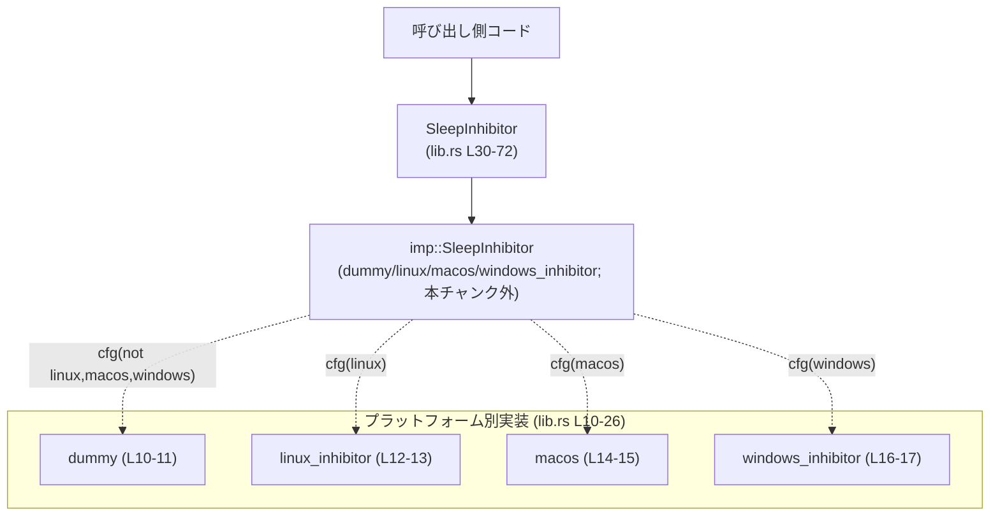
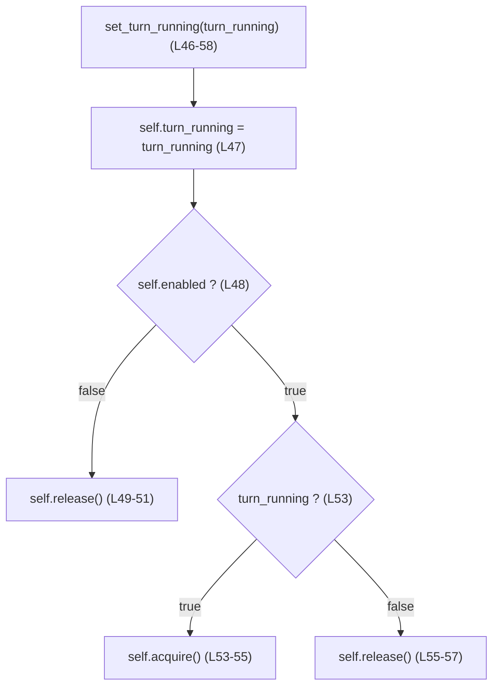

utils/sleep-inhibitor/src/lib.rs

---

## 0. ざっくり一言

ターン（処理単位）の実行中に OS のスリープ（アイドルスリープ）を一時的に抑止するための、クロスプラットフォームなラッパー `SleepInhibitor` を提供するモジュールです（macOS / Linux / Windows 向けに各 OS ごとの実装に委譲します）。  
（根拠: utils/sleep-inhibitor/src/lib.rs:L1-8, L30-34）

---

## 1. このモジュールの役割

### 1.1 概要

- 解決する問題  
  - ターン制ゲームなどで「ターン処理中はマシンをスリープさせたくないが、普段は OS の電源管理に任せたい」という要件を扱います。  
    （根拠: ドキュメントコメント「while a turn is running」（L1））
- 提供する機能  
  - `SleepInhibitor` 構造体を通じて「スリープ抑止機能の有効/無効」と「現在ターン中かどうか」の状態を管理し、状態に応じて各 OS 向けの抑止機構を `acquire`/`release` で呼び分けます。  
    （根拠: `SleepInhibitor` フィールドと `set_turn_running` の処理（L30-34, L46-58））

### 1.2 アーキテクチャ内での位置づけ

このファイルは「プラットフォーム共通のフロントエンド」として機能し、内部でコンパイル時条件付きコンパイルにより、各 OS 向け実装モジュールへ委譲します。

- プラットフォーム別モジュール定義  
  - `dummy`（その他の OS 向け; No-op）（L10-11）
  - `linux_inhibitor`（Linux 向け）（L12-13）
  - `macos`（macOS 向け）（L14-15）
  - `windows_inhibitor`（Windows 向け）（L16-17）
- それらを `imp` という別名でインポートし、`SleepInhibitor` の `platform` フィールドとして保持します（L19-26, L33）。

Mermaid 図で示すと次のような依存関係になります（本チャンクの範囲のみを記載しています）。



さらに、ドキュメントコメントから、各 OS 実装では次のような OS API を利用することが示唆されています（実装は本チャンク外）。

- macOS: IOKit power assertions（L4）
- Linux: `systemd-inhibit` / `gnome-session-inhibit` コマンド（L5）
- Windows: `PowerCreateRequest` + `PowerSetRequest(PowerRequestSystemRequired)`（L6-7）
- その他: No-op backend（L8）

### 1.3 設計上のポイント

コードから読める設計の特徴を列挙します。

- 責務分割  
  - `lib.rs` の `SleepInhibitor` は、  
    - 「有効フラグ (`enabled`)」と  
    - 「論理的なターン状態 (`turn_running`)」  
    の2つのブール状態を管理し、状態変化に応じて `platform.acquire()` / `platform.release()` を呼び出します（L30-34, L46-58, L60-66）。
  - OS 依存の実処理は `imp::SleepInhibitor` に委譲し、このファイルでは OS 非依存な制御フローのみに集中しています（L19-26, L33, L60-66）。

- 状態管理  
  - `enabled`: ユーザー設定によりスリープ抑止を有効にするかどうか（L31, L37-39）。
  - `turn_running`: 呼び出し側が最後に指定した「ターン中かどうか」を保持（L32, L40, L47, L69-71）。
  - OS レベルの実際の抑止状態は `platform` 側で管理されると考えられますが、このチャンクにはその実装は現れません。

- エラーハンドリング方針  
  - `new` / `set_turn_running` / `is_turn_running` はいずれも `Result` などのエラー型を返さず、失敗を表現する仕組みは設けられていません（L37-43, L46-58, L69-71）。
  - 代わりに、プラットフォーム固有の `imp::SleepInhibitor` 側でエラー処理を完結させる方針であると解釈できますが、具体的な挙動はこのチャンクからは不明です。

- 並行性  
  - `set_turn_running` は `&mut self` を受け取るメソッドであり（L46）、同じインスタンスに対する同時呼び出しはコンパイル時に防止されます。
  - `SleepInhibitor` が `Send` / `Sync` であるかどうかは、内部の `imp::SleepInhibitor` の実装次第で、このチャンクからは判断できません。

### 1.4 コンポーネント一覧（インベントリー）

このチャンクに現れるモジュール・型・関数の一覧です。

| 種別 | 名前 | 公開範囲 | 役割 / 説明 | 定義位置 |
|------|------|----------|-------------|----------|
| モジュール | `dummy` | private | 非対応 OS 向けの No-op 実装（詳細は本チャンク外） | utils/sleep-inhibitor/src/lib.rs:L10-11 |
| モジュール | `linux_inhibitor` | private | Linux 向け実装（詳細は本チャンク外） | L12-13 |
| モジュール | `macos` | private | macOS 向け実装（詳細は本チャンク外） | L14-15 |
| モジュール | `windows_inhibitor` | private | Windows 向け実装（詳細は本チャンク外） | L16-17 |
| use 別名 | `imp` | private | 上記いずれかのモジュールを指す型別名 | L19-26 |
| 構造体 | `SleepInhibitor` | `pub` | スリープ抑止の共通ラッパー | L30-34 |
| impl メソッド | `SleepInhibitor::new` | `pub` | インスタンスを生成する | L37-43 |
| impl メソッド | `SleepInhibitor::set_turn_running` | `pub` | ターン状態に応じて抑止の on/off を切り替える | L46-58 |
| impl メソッド | `SleepInhibitor::acquire` | private | `platform.acquire()` への委譲 | L60-62 |
| impl メソッド | `SleepInhibitor::release` | private | `platform.release()` への委譲 | L64-66 |
| impl メソッド | `SleepInhibitor::is_turn_running` | `pub` | 呼び出し側が最後に指定したターン状態を返す | L69-71 |
| テストモジュール | `tests` | cfg(test) | 単体テスト | L74-112 |
| テスト関数 | `sleep_inhibitor_toggles_without_panicking` | `#[test]` | 有効状態での単純な on/off と panic しないことを検証 | L78-85 |
| テスト関数 | `sleep_inhibitor_disabled_does_not_panic` | `#[test]` | 無効状態での on/off と panic しないことを検証 | L87-94 |
| テスト関数 | `sleep_inhibitor_multiple_true_calls_are_idempotent` | `#[test]` | `true` 連続呼び出しが panic しないことを検証 | L96-102 |
| テスト関数 | `sleep_inhibitor_can_toggle_multiple_times` | `#[test]` | 複数回の on/off トグルが可能であること（panic しない）を検証 | L105-112 |

---

## 2. 主要な機能一覧

このモジュールが提供する主要機能を整理します。

- スリープ抑止ラッパーの生成: `SleepInhibitor::new(enabled: bool)` で「このインスタンスがスリープ抑止を行うかどうか」を設定しつつ初期化します（L37-43）。
- ターン状態の更新と抑止 on/off: `set_turn_running(&mut self, turn_running: bool)` で「ターン中かどうか」を更新し、状態と `enabled` フラグに応じて `platform.acquire()/release()` を呼び分けます（L46-58, L60-66）。
- ターン状態の参照: `is_turn_running(&self) -> bool` で、最後に設定した論理的なターン状態を取得できます（L69-71）。

---

## 3. 公開 API と詳細解説

### 3.1 型一覧（構造体）

| 名前 | 種別 | 公開 | 役割 / 用途 | 主なフィールド | 定義位置 |
|------|------|------|-------------|----------------|----------|
| `SleepInhibitor` | 構造体 | `pub` | スリープ抑止の制御ラッパー。呼び出し側からの「ターン中」フラグに応じて、プラットフォーム固有の抑止処理を呼び出す。 | `enabled: bool`, `turn_running: bool`, `platform: imp::SleepInhibitor` | utils/sleep-inhibitor/src/lib.rs:L30-34 |

`imp::SleepInhibitor` はこのファイル外で定義されていますが、`SleepInhibitor` 構造体の内部実装として利用されます（L33）。

---

### 3.2 関数詳細

#### `SleepInhibitor::new(enabled: bool) -> Self`

**概要**

- `SleepInhibitor` インスタンスを新しく生成します。  
- スリープ抑止機能を有効にするかどうかを `enabled` 引数で指定し、内部のプラットフォーム固有インスタンスも初期化します。  
  （根拠: utils/sleep-inhibitor/src/lib.rs:L37-43）

**引数**

| 引数名 | 型 | 説明 |
|--------|----|------|
| `enabled` | `bool` | `true` の場合、ターン中にスリープ抑止を行う。`false` の場合、`set_turn_running` を呼んでも OS レベルの抑止は行わず、常に `release()` のみが呼ばれる。 |

**戻り値**

- `SleepInhibitor` 構造体の新しいインスタンス。  
  - `enabled` フィールド: 引数そのまま（L38-39）。  
  - `turn_running` フィールド: 常に `false` に初期化（L40）。  
  - `platform` フィールド: `imp::SleepInhibitor::new()` の結果（L41）。

**内部処理の流れ**

1. `Self { ... }` 構文で `SleepInhibitor` を構築します（L37-42）。
2. `enabled` フィールドに引数 `enabled` を格納します（L38-39）。
3. `turn_running` を `false` に初期化します（L40）。
4. プラットフォーム固有の `imp::SleepInhibitor::new()` を呼び出して `platform` フィールドに格納します（L41）。

**Examples（使用例）**

1. スリープ抑止を有効にして使う例

```rust
use utils::sleep_inhibitor::SleepInhibitor; // 実際のパスはクレート構成に依存

fn main() {
    // スリープ抑止を有効にしたインスタンスを作成
    let mut inhibitor = SleepInhibitor::new(true); // enabled = true

    // ターン開始時にスリープ抑止を有効化
    inhibitor.set_turn_running(true);

    // ... ターンの処理 ...

    // ターン終了時にスリープ抑止を解除
    inhibitor.set_turn_running(false);
}
```

1. スリープ抑止機能自体を無効にして使う例（設定で OFF にしたい場合）

```rust
let mut inhibitor = SleepInhibitor::new(false); // enabled = false

// 呼び出しパターンは同じだが、内部では acquire は呼ばれず release のみ
inhibitor.set_turn_running(true);
assert!(inhibitor.is_turn_running()); // 状態は true に更新される

inhibitor.set_turn_running(false);
assert!(!inhibitor.is_turn_running());
```

**Errors / Panics**

- この関数本体には明示的な `panic!` や `Result` の返却はありません（L37-43）。
- ただし、内部で呼び出す `imp::SleepInhibitor::new()` の挙動はこのチャンクには現れず、そこで panic やエラーが発生しないかどうかは判断できません（L41）。

**Edge cases（エッジケース）**

- `enabled == false` の場合でも、`turn_running` は通常通り `set_turn_running` で更新されます（L47）。  
  ただし `set_turn_running` 内では `!self.enabled` の場合に常に `release()` のみが呼ばれるため、OS レベルの抑止は行われない設計です（L48-51, L56-57）。
- コンストラクタ時点では `platform.acquire()` は呼ばれません。最初の `set_turn_running(true)` 呼び出しまで OS 側には何も行いません（L37-43, L46-58）。

**使用上の注意点**

- `enabled` が `false` のインスタンスは、「ターン状態を記録するだけで OS スリープ抑止は行わないラッパー」のような挙動になります（L31, L37-40, L46-51）。  
  設定画面などで「スリープ抑止を無効化」するときに利用できる設計です。
- プラットフォームごとの初期化コストは `imp::SleepInhibitor::new()` に依存します。高コストな実装である可能性もあるため、このインスタンスを大量に生成するかどうかは実装次第です（このチャンクからは不明）。

---

#### `SleepInhibitor::set_turn_running(&mut self, turn_running: bool)`

**概要**

- 「現在ターンが実行中かどうか」を更新し、その状態と `enabled` フラグに応じて、OS レベルのスリープ抑止を on/off するための `acquire` / `release` を呼び出します（L45-58）。  

**引数**

| 引数名 | 型 | 説明 |
|--------|----|------|
| `turn_running` | `bool` | `true`: ターン実行中、`false`: ターン停止中として扱う。 |

**戻り値**

- なし（`()`）。状態更新と OS 側への副作用のみを行います（L46-58）。

**内部処理の流れ**

1. `self.turn_running` を引数 `turn_running` で上書きします（L47）。  
   - これにより `is_turn_running()` の戻り値が更新されます（L69-71）。
2. `self.enabled` が `false` の場合  
   - `self.release()` を呼び出し（L49）、即座に `return` します（L50）。  
   - これにより、無効状態では必ず release のみが呼ばれ、`acquire` は呼ばれません。
3. `self.enabled` が `true` の場合  
   - `turn_running` が `true` なら `self.acquire()` を呼び出します（L53-55）。  
   - `turn_running` が `false` なら `self.release()` を呼び出します（L55-57）。

**簡易フローチャート**



**Examples（使用例）**

1. ターン開始・終了で素直に使う例

```rust
let mut inhibitor = SleepInhibitor::new(true); // 有効な抑止ラッパー

// ターン開始
inhibitor.set_turn_running(true);
// -> enabled = true なので platform.acquire() が呼ばれる

// ... ターン処理 ...

// ターン終了
inhibitor.set_turn_running(false);
// -> platform.release() が呼ばれる
```

1. 設定で抑止を無効化した状態の例

```rust
let mut inhibitor = SleepInhibitor::new(false); // enabled = false

inhibitor.set_turn_running(true);
// -> turn_running は true になるが、enabled = false のため release() のみ呼び出される

inhibitor.set_turn_running(false);
// -> turn_running は false になり、再び release() が呼ばれる
```

**Errors / Panics**

- 本メソッド自体には `panic!` などは書かれていません（L46-58）。
- しかし内部で呼び出す `self.platform.acquire()` / `self.platform.release()` の挙動は本チャンク外にあり（L60-66）、そこで panic や OS 由来のエラーが発生しないかどうかは、このコードだけからは判断できません。

**Edge cases（エッジケース）**

- **同じ値を繰り返し設定する**  
  - 例えば `set_turn_running(true)` を連続して呼び出した場合、毎回 `self.acquire()` が呼ばれます（L47, L53-55）。  
  - これに関して、テスト `sleep_inhibitor_multiple_true_calls_are_idempotent` は「複数回 true を指定しても panic しない」ことのみを確認しており、OS レベルでの抑止が完全に冪等かどうかは、このチャンクからは分かりません（L96-102）。
- **無効状態 (`enabled == false`) のとき**  
  - `turn_running` は更新されますが（L47）、常に `release()` のみが呼ばれます（L48-51）。  
  - 通常は「何も抑止していない状態での `release()` 呼び出し」が発生しうる設計であり、`imp::SleepInhibitor::release()` がそのような呼び出しに対して安全であることを前提としていると解釈できます。
- **初期状態からいきなり `set_turn_running(false)` を呼ぶ**  
  - `turn_running` はもともと `false` で初期化されていますが（L40）、初回に `false` を指定しても同様に `release()` が呼び出されます（L47, L53-57）。  
  - これも「抑止が取得されていない状態での `release()` 呼び出し」がありうるケースです。

**使用上の注意点**

- 「ターン開始時 `true`」「ターン終了時 `false`」という *論理的なペア* を保つように使用することが前提になっています（L46-58）。  
  そうしないと、プラットフォーム実装によっては OS レベルのスリープ抑止が過剰または不足する可能性があります（ただし具体的な実害の有無はこのチャンク外）。
- `is_turn_running()` はあくまで最後に設定した論理値を返すだけであり、OS 側の実際の抑止状態を検査してはいません（L69-71）。  
  実際の OS 状態と同値であるとはこのコードからは保証されません。
- `&mut self` を要求するため、1インスタンスを複数スレッドから同時に操作するには、外側で `Mutex` などの同期プリミティブが必要です（並行性を巡る安全性は Rust の借用ルールによって静的に保証されます）。

---

#### `SleepInhibitor::is_turn_running(&self) -> bool`

**概要**

- 呼び出し側が最後に `set_turn_running` で指定したターン状態（`true` / `false`）を返します（L68-71）。
- OS 側の実際のスリープ抑止状態は参照していません。

**引数**

| 引数名 | 型 | 説明 |
|--------|----|------|
| `&self` | `&SleepInhibitor` | インスタンスの参照。読み取り専用です。 |

**戻り値**

- `bool`: `set_turn_running` で最後に指定した `turn_running` の値をそのまま返します（L69-71）。

**内部処理の流れ**

1. 単に `self.turn_running` を返すだけです（L69-71）。

**Examples（使用例）**

```rust
let mut inhibitor = SleepInhibitor::new(true);
assert!(!inhibitor.is_turn_running()); // 初期値は false

inhibitor.set_turn_running(true);
assert!(inhibitor.is_turn_running());

inhibitor.set_turn_running(false);
assert!(!inhibitor.is_turn_running());
```

**Errors / Panics**

- フィールドを読み取って返すだけの処理であり、panic を発生させるコードは含まれていません（L69-71）。

**Edge cases（エッジケース）**

- `enabled == false` のインスタンスでも、`set_turn_running(true)` を呼べば `is_turn_running()` は `true` を返します（L31, L37-40, L46-47, L69-71）。  
  これは「論理的なターン状態」と「実際に OS で抑止が有効かどうか」が独立した概念であることを意味します。

**使用上の注意点**

- `is_turn_running()` を「OS が現在スリープ抑止状態かどうか」の判定に利用するのは適切ではありません。  
  あくまで「自分たちのロジック上、最後に `set_turn_running` で何を指定したか」を知るための補助的な API です（L69-71）。

---

### 3.3 その他の関数

内部でのみ利用される補助メソッドです。

| 関数名 | 役割（1 行） | 定義位置 |
|--------|--------------|----------|
| `SleepInhibitor::acquire(&mut self)` | `self.platform.acquire()` を呼び出してプラットフォーム固有のスリープ抑止を開始する | utils/sleep-inhibitor/src/lib.rs:L60-62 |
| `SleepInhibitor::release(&mut self)` | `self.platform.release()` を呼び出してプラットフォーム固有のスリープ抑止を終了する | L64-66 |

いずれも `set_turn_running` からのみ呼ばれ、外部 API としては公開されていません（L53-57, L60-66）。

---

## 4. データフロー

ここでは、「スリープ抑止を有効にしたインスタンスで、ターン開始と終了を 1 回ずつ行う」シナリオのデータフローを説明します。

1. 呼び出し側が `SleepInhibitor::new(true)` でインスタンスを生成する（L37-43）。
2. ターン開始時に `set_turn_running(true)` を呼び出すと、`turn_running` が `true` に設定され、`enabled == true` なので `acquire()` 経由で `platform.acquire()` が呼ばれます（L47-55, L60-62）。
3. ターン終了時に `set_turn_running(false)` を呼び出すと、`turn_running` が `false` に設定され、`release()` 経由で `platform.release()` が呼ばれます（L47, L55-57, L64-66）。

Mermaid のシーケンス図で表すと次のようになります。

```mermaid
sequenceDiagram
    participant Caller as 呼び出し側コード
    participant SI as SleepInhibitor<br/>(lib.rs L30-72)
    participant IMP as imp::SleepInhibitor<br/>(L33, L41, L60-66; 本チャンク外実装)

    Caller->>SI: new(enabled = true) (L37-43)
    Note over SI: enabled = true<br/>turn_running = false<br/>platform = imp::SleepInhibitor::new()

    Caller->>SI: set_turn_running(true) (L46-58)
    SI->>SI: self.turn_running = true (L47)
    SI->>IMP: acquire() (L53-55, L60-62)

    Caller->>SI: set_turn_running(false) (L46-58)
    SI->>SI: self.turn_running = false (L47)
    SI->>IMP: release() (L55-57, L64-66)
```

要点:

- `enabled` が `false` の場合、このシーケンスで `IMP.acquire()` は呼ばれず、`IMP.release()` のみが呼ばれることになります（L48-51）。
- `is_turn_running()` は常に `turn_running` フィールドの値だけを返します。`IMP` の実際の状態を問い合わせる処理は行っていません（L69-71）。

---

## 5. 使い方（How to Use）

### 5.1 基本的な使用方法

典型的な使用フローは「初期化 → ターン開始で `true` → ターン終了で `false`」です。

```rust
use utils::sleep_inhibitor::SleepInhibitor; // 実際のパスはクレート構成に依存

fn main() {
    // 設定からスリープ抑止の ON/OFF を決定したと仮定
    let sleep_inhibit_enabled = true; // 例えば設定ファイルから読み込む

    // モジュールの主要な型を初期化する
    let mut inhibitor = SleepInhibitor::new(sleep_inhibit_enabled);

    // --- ターン開始 ---
    inhibitor.set_turn_running(true);

    // ターン中の処理
    // ...

    // --- ターン終了 ---
    inhibitor.set_turn_running(false);

    // 状態の確認（主にデバッグ・テスト用途）
    assert!(!inhibitor.is_turn_running());
}
```

### 5.2 よくある使用パターン

1. 設定による有効/無効の切り替え

```rust
fn create_inhibitor_from_settings(settings: &Settings) -> SleepInhibitor {
    // 設定に「スリープ抑止を有効にする」オプションがあると仮定
    let enabled = settings.prevent_sleep_during_turns;
    SleepInhibitor::new(enabled)
}
```

1. ライフサイクルマネージャからの利用

```rust
fn on_turn_started(inhibitor: &mut SleepInhibitor) {
    inhibitor.set_turn_running(true);
}

fn on_turn_finished(inhibitor: &mut SleepInhibitor) {
    inhibitor.set_turn_running(false);
}
```

### 5.3 よくある間違い

ここでは、この API の構造から起こりやすい誤用パターンを挙げます（いずれもコードの挙動として導かれるもので、実際にどの程度問題になるかはプラットフォーム実装に依存します）。

```rust
// 誤り例: ターン終了時に false を呼び忘れる
let mut inhibitor = SleepInhibitor::new(true);
inhibitor.set_turn_running(true);
// ... ここで関数を return してしまうなど ...
// -> platform.release() が呼ばれないままになる可能性がある

// 正しい例: true/false をペアで呼ぶ
let mut inhibitor = SleepInhibitor::new(true);
inhibitor.set_turn_running(true);
// ... ターン処理 ...
inhibitor.set_turn_running(false);
```

```rust
// 誤り例: is_turn_running を OS 状態の確認に使う
if inhibitor.is_turn_running() {
    // 「OS がスリープ抑止状態だ」と決めつけてしまう
}

// 実際: is_turn_running は self.turn_running だけを見る
// enabled = false の場合でも true を返しうる
```

### 5.4 使用上の注意点（まとめ）

- **前提条件**  
  - ターン開始時には `set_turn_running(true)`、ターン終了時には `set_turn_running(false)` を呼ぶことが前提になっています（L46-58）。
  - `imp::SleepInhibitor::release()` が「未取得状態での release 呼び出し」に対して安全であることを前提としています（L48-51, L55-57, L60-66）。

- **論理状態と OS 状態の乖離**  
  - `is_turn_running()` は論理状態のみを返し、プラットフォーム側との同期は行っていません（L69-71）。
  - 監視や UI 表示などで「OS 側の抑止状態」を知りたい場合は、別の手段が必要になります。

- **並行性**  
  - インスタンスメソッドは `&mut self` を要求するため、単一インスタンスを複数スレッドから直接操作するには外側で同期が必要です（L46, L60, L64）。
  - Rust の型システムにより、「同時に複数の可変参照から `set_turn_running` を呼ぶ」といったパターンはコンパイルエラーになります。

- **ドロップ時の挙動**  
  - `SleepInhibitor` 自身には `Drop` 実装がありません（L36-72）。  
    インスタンス破棄時に OS レベルの抑止を自動解除するかどうかは、`platform` フィールドの型 `imp::SleepInhibitor` の `Drop` 実装に依存します（L33）。  
    このチャンクからは、その詳細は分かりません。

---

## 6. 変更の仕方（How to Modify）

### 6.1 新しい機能を追加する場合

例として、「より細かい状態（例えば理由やタイムアウト）を付与したい」などの拡張を考える場合の変更エントリポイントを示します。

- **共通ロジックの変更・追加**  
  - `SleepInhibitor` のフィールドを拡張する場合は、`lib.rs` の構造体定義（L30-34）とコンストラクタ `new`（L37-43）を更新します。
  - 状態に応じた `acquire` / `release` の呼び分けは `set_turn_running` に集約されているため、新しい状態遷移ロジックを追加する場合はこのメソッド（L46-58）を中心に変更します。

- **プラットフォームごとの拡張**  
  - OS 依存の細かい振る舞いが必要な場合は、各プラットフォームモジュール  
    - `dummy` / `linux_inhibitor` / `macos` / `windows_inhibitor`（L10-17）  
    の `SleepInhibitor` 実装を変更・拡張する必要があります。  
  - これらのファイルは本チャンクには含まれていないため、具体的な変更方法はこのファイルからは分かりませんが、`platform.acquire()` / `platform.release()` が共通インターフェースであること（L60-66）だけは前提として保持する必要があります。

### 6.2 既存の機能を変更する場合

- **`set_turn_running` の挙動を変えたい場合**  
  - 例えば「同じ値を繰り返し設定したときは何もしない（完全な冪等性）」にしたい場合、現在は毎回 `acquire` / `release` を呼び出す実装なので（L47, L53-57）、  
    - 以前の `turn_running` の値を保持して比較し、変更があったときだけ `acquire` / `release` するように条件分岐を追加する形になります。
  - その際、既存のテスト（特に `sleep_inhibitor_multiple_true_calls_are_idempotent`（L96-102））との整合性を確認し、必要ならテストの意図を見直す必要があります。

- **`enabled` フラグの扱いを変えたい場合**  
  - 現状は「無効状態でも `turn_running` は更新されるが、`acquire` は一切呼ばない」という仕様です（L31, L37-40, L46-51）。  
  - 例えば「無効状態では `turn_running` も常に false に保つ」といった変更を行う場合、  
    - `set_turn_running` 内で `enabled` が false のときは `self.turn_running` を強制的に false にする、などの処理が必要になります。

- **影響範囲の確認**  
  - 公開 API に関わるメソッド（`new` / `set_turn_running` / `is_turn_running`）のシグネチャや挙動を変える際は、このモジュールを利用している全ての呼び出し側と、テストモジュール（L74-112）を確認する必要があります。

---

## 7. 関連ファイル

このモジュールと密接に関係するファイル・ディレクトリ（このチャンクに名前だけ現れるもの）を列挙します。

| パス | 役割 / 関係 |
|------|------------|
| `utils/sleep-inhibitor/src/lib.rs` | 本レポート対象のファイル。プラットフォーム共通の `SleepInhibitor` ラッパーを定義する。 |
| `utils/sleep-inhibitor/src/dummy.rs` | 非対応 OS 向けの No-op 実装モジュール。`cfg(not(linux, macos, windows))` のときに `imp` として利用される（L10-11, L19-20）。 |
| `utils/sleep-inhibitor/src/linux_inhibitor.rs` | Linux 向けのスリープ抑止実装モジュール。`cfg(target_os = "linux")` で `imp` として利用される（L12-13, L21-22）。 |
| `utils/sleep-inhibitor/src/macos.rs` | macOS 向けのスリープ抑止実装モジュール。`cfg(target_os = "macos")` で `imp` として利用される（L14-15, L23-24）。 |
| `utils/sleep-inhibitor/src/windows_inhibitor.rs` | Windows 向けのスリープ抑止実装モジュール。`cfg(target_os = "windows")` で `imp` として利用される（L16-17, L25-26）。 |

これらのファイルの中身（`imp::SleepInhibitor` の実装詳細）は、このチャンクには現れないため、本レポートでは「型名」「役割（OS ごとの実装）」のみが把握できます。
