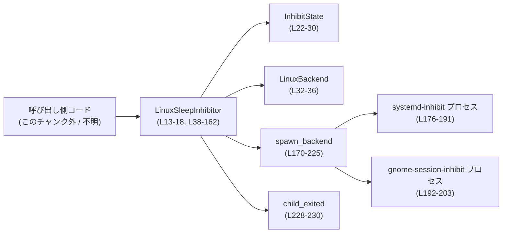
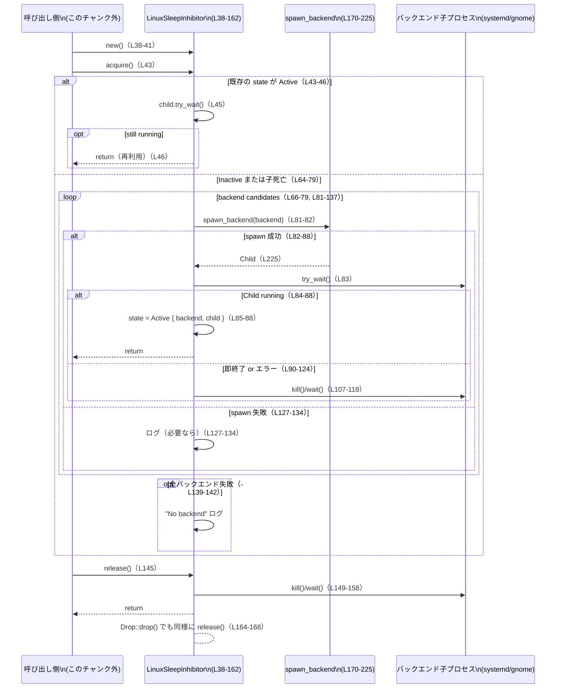

# utils/sleep-inhibitor/src/linux_inhibitor.rs コード解説

---

## 0. ざっくり一言

Linux 上で、`systemd-inhibit` または `gnome-session-inhibit` コマンドを子プロセスとして起動し、そのプロセスが生きている間はアイドルスリープを抑止する小さなステートフルコンポーネントです（RAII で自動解放を行います）。  
（utils/sleep-inhibitor/src/linux_inhibitor.rs:L7-11, L13-20, L170-201）

---

## 1. このモジュールの役割

### 1.1 概要

- このモジュールは **Linux デスクトップ環境のアイドルスリープを抑止するための子プロセス管理** を行います。  
- `LinuxSleepInhibitor` 型が、スリープ抑止の獲得 (`acquire`) と解放 (`release`) を提供し、その内部で `systemd-inhibit` または `gnome-session-inhibit` を起動・監視します。  
（L13-20, L32-36, L38-43, L170-201）

### 1.2 アーキテクチャ内での位置づけ

主要コンポーネントと依存関係は次の通りです。

- `LinuxSleepInhibitor` が公開される（crate 内）API で、状態を `InhibitState` で管理します。（L13-18, L22-30, L38-162）
- 実際の OS 連携は `spawn_backend` と `child_exited` のプライベート関数が担当します。（L170-230）
- 外部には `systemd-inhibit` または `gnome-session-inhibit` コマンドとして現れます。（L176-203）



※ 呼び出し元モジュールの具体的なパスは、このチャンクには現れません。

### 1.3 設計上のポイント

- **状態管理**  
  - `InhibitState` 列挙体で「Inactive / Active(child + backend)」の 2 状態を明示的に表現しています。（L22-30）
  - `preferred_backend` に直近成功したバックエンドを記録し、次回以降はそのバックエンドを優先して試行します。（L15-17, L66-79, L85-87）

- **バックエンドのフェイルオーバ**  
  - `systemd-inhibit` と `gnome-session-inhibit` の 2 種類のバックエンドを順番に試行し、失敗した場合はもう一方にフォールバックします。（L32-36, L66-79, L81-137）

- **RAII による自動解放**  
  - `Drop` 実装で `release` を呼ぶことで、スコープを抜けたときに子プロセスを確実に停止・回収するようになっています。（L164-168, L145-161）

- **エラーハンドリングとログ**  
  - 失敗時は `tracing::warn` で詳細な情報をログ出力しますが、バックエンドが存在しない（`ENOENT` 相当）場合はログを抑制し、さらに「バックエンドなし」のログも一度だけに制限しています。（L48-59, L91-106, L128-142）

- **Unix 固有の安全性処理**  
  - `libc::prctl(PR_SET_PDEATHSIG, SIGTERM)` により、親プロセス死亡時に子プロセスが SIGTERM を受けるように設定しています。（L171-176, L210-221）
  - `pre_exec` クロージャ内で `getppid` を確認し、親が既に変わっていれば自分自身に SIGTERM を送ることで、fork/exec レース時のゾンビ化を避けています。（L210-221）

---

## 2. 主要な機能一覧

- スリープ抑止セッションの開始・維持: `LinuxSleepInhibitor::acquire` が、動作中の抑止バックエンドを確保し、既存のものが生きていれば再利用します。（L43-62, L81-143）
- スリープ抑止セッションの終了: `LinuxSleepInhibitor::release` / `Drop` が、子プロセスの kill + wait により OS 資源を解放します。（L145-161, L164-168）
- バックエンドの自動選択とフェイルオーバ: `preferred_backend` と `LinuxBackend` に基づき、`systemd-inhibit` と `gnome-session-inhibit` のどちらかを優先・代替します。（L32-36, L15-17, L66-79）
- 子プロセス起動と親死亡時の SIGTERM 設定: `spawn_backend` が実際に `systemd-inhibit`/`gnome-session-inhibit` を起動し、PDEATHSIG を設定します。（L170-225）
- 子プロセス終了済みエラーの判定: `child_exited` が `ErrorKind::InvalidInput` を「既に終了済み」とみなし、ログ抑制に利用します。（L228-230）
- 長時間スリープ値の定義: `BLOCKER_SLEEP_SECONDS` が、ブロッカー子プロセスを「十分長く」動かす秒数を表し、テストで `i32::MAX` と一致することを検証しています。（L9-11, L232-239）

---

## 3. 公開 API と詳細解説

### 3.1 型・定数一覧

| 名前 | 種別 | 公開範囲 | 役割 / 用途 | コード位置 |
|------|------|----------|-------------|------------|
| `LinuxSleepInhibitor` | 構造体 | `pub(crate)` | Linux のスリープ抑止セッションを管理するメインのハンドラ。現在の状態とバックエンド選好を保持します。 | utils/sleep-inhibitor/src/linux_inhibitor.rs:L13-18 |
| `SleepInhibitor` | 型エイリアス | `pub(crate)` | 他モジュールから `LinuxSleepInhibitor` を OS 非依存名で参照するためのエイリアス。 | L20 |
| `InhibitState` | 列挙体 | モジュール内 | `Inactive` または `Active { backend, child }` による状態表現。 | L22-30 |
| `LinuxBackend` | 列挙体 | モジュール内 | 利用可能な Linux バックエンド（`SystemdInhibit` / `GnomeSessionInhibit`）を表します。 | L32-36 |
| `ASSERTION_REASON` | 定数 `&'static str` | モジュール内 | バックエンドに渡す「なぜ抑止しているか」の説明文。ログや OS UI に表示される可能性があります。 | L7 |
| `APP_ID` | 定数 `&'static str` | モジュール内 | バックエンドに渡すアプリケーション ID。`systemd-inhibit --who` に使用されます。 | L8, L182-183 |
| `BLOCKER_SLEEP_SECONDS` | 定数 `&'static str` | モジュール内 | ブロッカー子プロセスに渡すスリープ秒数文字列。`i32::MAX` に固定されています。 | L9-11, L187-188, L199-200 |
| `spawn_backend` | 関数 | モジュール内 | 指定された `LinuxBackend` を子プロセスとして起動し、PDEATHSIG を設定した `Child` を返します。 | L170-225 |
| `child_exited` | 関数 | モジュール内 | `std::io::Error` が「子プロセスが既に終了している」ことを示すかどうかの判定に使われます。 | L228-230 |
| `tests::sleep_seconds_is_i32_max` | テスト関数 | テスト用 | `BLOCKER_SLEEP_SECONDS` が `i32::MAX` と一致することを保証します。 | L232-239 |

### 3.2 関数詳細

#### `LinuxSleepInhibitor::new() -> Self`（L38-41）

**概要**

- `LinuxSleepInhibitor` の新しいインスタンスを、デフォルト状態（`Inactive` かつ `preferred_backend=None`）で生成します。（L13-18, L22-25, L38-41）

**引数**

なし。

**戻り値**

- `Self` (`LinuxSleepInhibitor`): 状態が `Inactive`、`preferred_backend` が `None`、`missing_backend_logged` が `false` で初期化された値です。（L13-18）

**内部処理**

- `Self::default()` を呼ぶだけで、`#[derive(Default)]` に任せています。（L13, L38-41）

**Examples（使用例）**

```rust
// モジュールパスはプロジェクト構成に依存するため省略
let mut inhibitor = LinuxSleepInhibitor::new(); // 初期状態は Inactive
// 以降、acquire()/release() を呼んでスリープ抑止を制御できる
```

**Errors / Panics**

- エラーや panic を発生させる処理は含まれていません（単なる構造体初期化）。  

**Edge cases**

- 特にありません。

**使用上の注意点**

- 実際にスリープ抑止を有効化するには、続けて `acquire` を呼ぶ必要があります。（L43-62, L81-143）

---

#### `LinuxSleepInhibitor::acquire(&mut self)`（L43-143）

**概要**

- スリープ抑止を「獲得」します。  
- 既にアクティブな子プロセスが生きていればそのまま再利用し、死んでいればログを出して再起動を試みます。（L43-62）  
- `systemd-inhibit` / `gnome-session-inhibit` を試行し、いずれかが正常に起動した時点で状態を `Active` に更新します。（L66-88）

**引数**

| 引数名 | 型 | 説明 |
|--------|----|------|
| `&mut self` | `&mut LinuxSleepInhibitor` | 内部状態（子プロセスとバックエンド選好）を書き換えるため、排他的な可変参照が必要です。 |

**戻り値**

- なし（副作用として内部状態と子プロセスを更新します）。

**内部処理の流れ**

1. **既存セッションの確認**（L43-62）
   - `self.state` が `Active { backend, child }` の場合、`child.try_wait()` を呼び、子プロセスの状態を確認します。
     - `Ok(None)` → 子プロセスはまだ動作中なので、何もせず `return`（idempotent な acquire）。（L44-46）
     - `Ok(Some(status))` → 思わぬ終了として警告ログを出し、再取得処理へ移行。（L47-53）
     - `Err(error)` → ステータス取得失敗として警告ログを出し、再取得処理へ移行。（L54-60）

2. **状態リセットとロギング制御の決定**（L64-65）
   - `self.state = InhibitState::Inactive` にして前回の `Child` を破棄します。（L64）
   - 一度「バックエンドが見つからない」と判定した後はログを抑制するため、`should_log_backend_failures = !self.missing_backend_logged` を計算します。（L65）

3. **バックエンド優先順の決定**（L66-79）
   - 前回成功した `preferred_backend` があればそれを先頭に、なければ `SystemdInhibit` → `GnomeSessionInhibit` の順で試行します。（L66-79）

4. **バックエンド試行ループ**（L81-137）
   - 各 `backend` について `spawn_backend(backend)` を呼びます。（L81-82）
   - 成功 (`Ok(mut child)`) した場合：
     - `child.try_wait()` で直後に状態を確認。（L83）
       - `Ok(None)` → 子プロセスが正常に起動しているとみなし、`self.state = Active { backend, child }`・`self.preferred_backend = Some(backend)`・`self.missing_backend_logged = false` として `return`。（L84-88）
       - `Ok(Some(status))` → 即時終了として、必要なら警告ログ。（L90-97）
       - `Err(error)` → ステータス取得失敗として、必要なら警告ログを出した後、`child.kill()` と `child.wait()` を試し、それぞれ `child_exited` で「既に終了済みなら無視、そうでなければ警告ログ」を行います。（L99-124, L107-118, L228-230）
   - 失敗 (`Err(error)`) した場合：
     - `ErrorKind::NotFound` 以外かつ `should_log_backend_failures == true` のときのみ、「バックエンド起動に失敗した」警告を出します。（L127-134）

5. **すべてのバックエンドが利用不能だった場合**（L139-142）
   - `should_log_backend_failures` が `true` のときだけ、「No Linux sleep inhibitor backend is available」という警告を一度出し、`self.missing_backend_logged = true` にして次回以降のログを抑制します。（L139-142）

**Examples（使用例）**

```rust
// スコープ全体でスリープ抑止を有効にする例
fn run_turn() {
    let mut inhibitor = LinuxSleepInhibitor::new(); // 初期化（L38-41）
    inhibitor.acquire();                            // バックエンドを確保（L43-143）

    // ここで「アクティブなターン」の処理を行う
    do_work_during_active_turn();

    // 明示的に release してもよいし、スコープ終了時の Drop に任せてもよい
    inhibitor.release();                            // 子プロセスを停止（L145-161）
}
```

**Errors / Panics**

- `panic!` を直接呼ぶコードはありません。
- システムコールや `Command::spawn` が返す `std::io::Error` はすべて捕捉され、`tracing::warn` によるロギングに留まります。（L45-60, L82-135）
- `spawn_backend` 内の `pre_exec` 失敗も `Result::Err` として上位に伝播し、ここで処理されます。（L170-225, 特に L215-217, L127-133）

**Edge cases（エッジケース）**

- **既にアクティブだった場合**  
  - `Active` かつ `child.try_wait() == Ok(None)` なら、何もせず返るため、複数回 `acquire` を呼んでも子プロセスが増殖しません。（L43-46）
- **バックエンドコマンドが存在しない場合**  
  - `systemd-inhibit` / `gnome-session-inhibit` が見つからない (`ErrorKind::NotFound`) 場合、そのバックエンドについてはログを出さずにスキップします。（L127-134）
  - 両方見つからない場合、初回のみ「No backend is available」と警告し、それ以降は同じ状況でもログを出しません。（L139-142）
- **起動直後に子プロセスが即終了する場合**  
  - `try_wait()` が `Ok(Some(status))` を返し、`should_log_backend_failures` が真なら警告ログが出力されます。（L90-97）
- **`kill` / `wait` が「既に終了している」ことを示すエラーを返した場合**  
  - `child_exited` が `ErrorKind::InvalidInput` のとき `true` を返し、そのエラーはログに出されません。（L107-118, L228-230）

**使用上の注意点**

- `&mut self` を要求するため、同一インスタンスに対して同時に複数スレッドから `acquire` を呼ぶことはコンパイル時に禁止されます。並行利用する場合は外側で排他制御（例: `Mutex`）を行う必要があります。
- `acquire` は失敗してもエラーを返さないため、「抑止できなかった」ことを検知するにはログを監視する必要があります（戻り値では分かりません）。  
- コマンド名や引数は固定文字列であり、呼び出し側から任意に変更する手段は、このチャンクには現れません。

---

#### `LinuxSleepInhibitor::release(&mut self)`（L145-161）

**概要**

- アクティブなスリープ抑止セッションを終了し、子プロセスを停止 (`kill`) して回収 (`wait`) します。  
- `Inactive` 状態で呼ばれた場合は何も行いません。（L145-160）

**引数**

| 引数名 | 型 | 説明 |
|--------|----|------|
| `&mut self` | `&mut LinuxSleepInhibitor` | 内部の `state` を `Inactive` にリセットするために可変参照が必要です。 |

**戻り値**

- なし。

**内部処理の流れ**

1. `std::mem::take(&mut self.state)` で現在の状態を取り出し、`self.state` を `Inactive` にリセットします。（L145-147）
2. 取り出した状態が:
   - `InhibitState::Inactive` の場合 → 何もせず終了。（L147）
   - `InhibitState::Active { backend, mut child }` の場合 → 次の処理を実行。（L148-159）
3. `child.kill()` を呼び、`Err(error)` かつ `!child_exited(&error)` のときだけ警告ログを出します。（L149-153, L228-230）
4. 続けて `child.wait()` を呼び、同様にエラー種別に応じてログを出すかどうかを決めます。（L154-158）

**Examples（使用例）**

```rust
fn run_turn_with_drop_only() {
    let mut inhibitor = LinuxSleepInhibitor::new();
    inhibitor.acquire();

    do_work_during_active_turn();

    // release を呼ばずにスコープを抜ける場合でも、
    // Drop 実装内で release が呼ばれて子プロセスは停止・回収される（L164-168）
} // ここで drop → release()
```

**Errors / Panics**

- `kill` および `wait` が返す `std::io::Error` はすべて捕捉され、ログに出されるだけです。（L149-158）
- panic を発生させるコードはありません。

**Edge cases**

- **Inactive な状態で呼ばれた場合**  
  - `match` パターンが `InhibitState::Inactive => {}` の分岐で何もせず終了します。（L145-147）
- **子プロセスが既に終了している場合**  
  - `kill` / `wait` が `ErrorKind::InvalidInput` を返すと `child_exited` により「終了済み」とみなされ、ログは出ません。（L149-156, L228-230）

**使用上の注意点**

- `Drop` 実装からも自動的に呼ばれるため、`release` を二重に呼んでも問題ありません（2 回目以降は `Inactive` 分岐になります）。（L145-147, L164-168）
- 長時間スリープする子プロセスを使う設計なので、`release` を呼ばずにプロセスを長時間保持すると、その間はスリープ抑止が継続したままになります。

---

#### `impl Drop for LinuxSleepInhibitor::drop(&mut self)`（L164-168）

**概要**

- `LinuxSleepInhibitor` がスコープを抜けたときに自動で `release` を呼び、子プロセスを停止・回収する RAII パターンを実現します。（L164-168）

**引数**

- `&mut self`: Drop トレイトの標準シグネチャです。

**戻り値**

- なし。

**内部処理**

- 単に `self.release()` を呼ぶだけです。（L165-166）

**使用上の注意点**

- `release` を明示的に呼ばなくても、インスタンスが破棄されれば子プロセスは停止します。
- `drop` ではエラーを返せないため、`release` 内でのエラーはすべてログ出力に委ねられます。（L145-158）

---

#### `spawn_backend(backend: LinuxBackend) -> Result<Child, std::io::Error>`（L170-225）

**概要**

- 指定された `LinuxBackend` に対応するコマンド (`systemd-inhibit` または `gnome-session-inhibit`) を、PDEATHSIG 設定付きで子プロセスとして起動し、その `Child` を返します。（L170-205, L210-225）

**引数**

| 引数名 | 型 | 説明 |
|--------|----|------|
| `backend` | `LinuxBackend` | 起動するバックエンド種別。`SystemdInhibit` または `GnomeSessionInhibit`。（L170, L176-203） |

**戻り値**

- `Result<Child, std::io::Error>`  
  - `Ok(child)` : 起動に成功し、`pre_exec` の設定も完了した子プロセス。  
  - `Err(e)` : コマンドが存在しない、`spawn` に失敗した、または `pre_exec` 内で PDEATHSIG 設定に失敗した場合などの I/O エラー。

**内部処理の流れ**

1. **親 PID の取得**（L171-176）
   - `unsafe { libc::getpid() }` で現時点の親 PID を取得し、`parent_pid` としてクロージャにキャプチャします。（L175）
   - コメントで、「fork/exec レースを避けるために pre_exec で `getppid()` をチェックする」ことが明記されています。（L171-174）

2. **コマンドと引数の構築**（L176-205）
   - `backend` に応じて `Command::new("systemd-inhibit")` または `Command::new("gnome-session-inhibit")` を作成。（L176-178, L192-193）
   - `systemd-inhibit` の場合の引数：`--what=idle --mode=block --who APP_ID --why ASSERTION_REASON -- sleep BLOCKER_SLEEP_SECONDS`（L179-189）
   - `gnome-session-inhibit` の場合の引数：`--inhibit idle --reason ASSERTION_REASON sleep BLOCKER_SLEEP_SECONDS`（L194-201）
   - `stdin` / `stdout` / `stderr` をすべて `Stdio::null()` に設定し、サイレントなヘルパープロセスとします。（L205-208）

3. **pre_exec による PDEATHSIG 設定と親確認**（L210-223）
   - `unsafe` ブロック内で `command.pre_exec` を設定します。（L210-214）
   - クロージャ内では：
     - `prctl(PR_SET_PDEATHSIG, SIGTERM)` を呼び、親が死んだときに SIGTERM を受け取るよう設定。失敗した場合は `Err(last_os_error())` を返します。（L215-217）
     - `getppid()` と `parent_pid` を比較し、違っていれば `raise(SIGTERM)` により自分自身を即座に終了させます（親が既に変わっている → レースの検出）。（L218-220）
     - 最後に `Ok(())` を返し、`spawn` 続行を許可します。（L221）

4. **spawn の実行**（L225）
   - `command.spawn()` の結果をそのまま返します。ここでのエラーは `Result::Err` として上位に伝播します。（L225）

**Examples（使用例）**

> この関数はモジュール内の `acquire` からのみ呼び出されているため（L81-82）、外部から直接呼ばれる設計ではありません。

```rust
// テスト的に直接呼ぶ場合の例（通常は acquire を使う）
let child = spawn_backend(LinuxBackend::SystemdInhibit)?;
assert!(child.id() > 0); // 子プロセス ID が割り当てられていることを確認
```

※ 実際のコードベースでこのような直接呼び出しが行われているかどうかは、このチャンクには現れません。

**Errors / Panics**

- `unsafe` ブロックで C ライブラリ関数を呼んでいますが、`prctl` 失敗時は `io::Error::last_os_error()` として `Err` を返す設計になっており、panic にはなりません。（L215-217）
- `Command::new` / `spawn` に起因するエラー（実行ファイルがない等）は `Result::Err` に反映され、呼び出し元の `acquire` でログ付きで処理されます。（L176-205, L225, L82, L127-134）

**Edge cases**

- **バックエンドコマンドが見つからない場合**  
  - `Command::new` 自体は失敗しませんが、`spawn()` で `ErrorKind::NotFound` が返る可能性があります。これは `acquire` 側でログ抑制の対象になります。（L225, L127-134）
- **prctl が失敗する場合**  
  - `prctl` が -1 を返した場合、`last_os_error()` を元に `Err` が返され、子プロセスは起動しません。（L215-217, L225）
- **fork/exec レース**  
  - `getppid() != parent_pid` のときに `raise(SIGTERM)` で自分自身を終了させるため、親が既に死んでいる場合でも孤立したヘルパーが残らないようにしています。（L218-220）

**使用上の注意点**

- `unsafe` を伴う低レベル処理のため、この関数の呼び出しは `acquire` に限定されており、呼び出し側で直接扱うのは推奨されない設計と解釈できます（コード上、公開されていないため）。（L81-82, L170）
- `pre_exec` クロージャの内容は子プロセスコンテキストで実行されるため、Rust の安全なコードとは別の実行文脈である点に注意が必要です。（L210-221）

---

#### `child_exited(error: &std::io::Error) -> bool`（L228-230）

**概要**

- `Child::kill` / `wait` が返した `std::io::Error` が「子プロセスが既に終了している」ケースを表しているとみなせるかどうかを判定します。（L149-156, L228-230）

**引数**

| 引数名 | 型 | 説明 |
|--------|----|------|
| `error` | `&std::io::Error` | `kill` / `wait` の失敗時に得られたエラー。 |

**戻り値**

- `true` : `error.kind() == ErrorKind::InvalidInput` の場合。  
- `false` : それ以外の `ErrorKind` の場合。

**内部処理**

- `matches!(error.kind(), std::io::ErrorKind::InvalidInput)` という 1 行で実装されています。（L229）

**Examples（使用例）**

```rust
use std::io::{Error, ErrorKind};

let already_exited_error = Error::from(ErrorKind::InvalidInput);
assert!(child_exited(&already_exited_error)); // true が返る想定（L228-230）

let other_error = Error::from(ErrorKind::PermissionDenied);
assert!(!child_exited(&other_error)); // false が返る
```

**Errors / Panics**

- ありません。

**Edge cases**

- OS によっては「既に終了している」状態が `InvalidInput` 以外の `ErrorKind` で表現される可能性がありますが、そのようなケースについての考慮はこのコードからは読み取れません。

**使用上の注意点**

- `release` および `acquire` のエラーハンドリングロジックは、この判定結果に依存しています。（L107-118, L149-156, L228-230）
- この関数の仕様を変更すると、ログ出力の頻度や内容が変わる可能性があります。

---

### 3.3 その他の関数

| 関数名 | 役割（1 行） | コード位置 |
|--------|--------------|------------|
| `tests::sleep_seconds_is_i32_max` | `BLOCKER_SLEEP_SECONDS` が `i32::MAX` と一致することを確認するユニットテストです。 | utils/sleep-inhibitor/src/linux_inhibitor.rs:L232-239 |

---

## 4. データフロー

ここでは、典型的な「スリープ抑止セッションの開始〜終了」のフローを示します。

1. 呼び出し側が `LinuxSleepInhibitor::new()` でインスタンスを生成し、`acquire()` を呼びます。（L38-43）
2. `acquire()` は、既存の子プロセスを再利用するか、新たに `spawn_backend()` を呼び出してバックエンドプロセスを起動します。（L43-62, L81-88）
3. セッション終了時に `release()` または `Drop` が `child.kill()` / `child.wait()` を呼び、プロセスを停止・回収します。（L145-161, L164-168）



---

## 5. 使い方（How to Use）

### 5.1 基本的な使用方法

このモジュール単体から読み取れる典型的な利用パターンは、

- `LinuxSleepInhibitor::new()` でインスタンスを生成し、
- スリープ抑止したい区間の前で `acquire()` を呼び、
- 区間の後で `release()` する（またはスコープ終端に任せる）

という流れです。（L38-43, L145-161, L164-168）

```rust
// モジュールパスは実際のプロジェクト依存のため省略
fn run_active_turn() {
    let mut inhibitor = LinuxSleepInhibitor::new(); // Inactive 状態で生成（L38-41）

    // ここからスリープ抑止を有効化
    inhibitor.acquire();                            // バックエンドを起動（L43-143）

    // 「アクティブなターン」の処理
    do_some_work();

    // 明示的に解放する場合
    inhibitor.release();                            // 子プロセスを停止・回収（L145-161）
    // もしくは release を呼ばずにスコープを抜けても Drop で解放されます（L164-168）
}
```

### 5.2 よくある使用パターン

1. **RAII パターンでの利用**

```rust
fn run_with_raii() {
    {
        let mut inhibitor = LinuxSleepInhibitor::new();
        inhibitor.acquire();    // スコープ内でスリープ抑止（L43-143）

        do_work();
    } // ここで drop → release() → 子プロセス kill/wait（L164-168, L145-158）
}
```

1. **再利用可能なインスタンス**

```rust
fn run_multiple_turns() {
    let mut inhibitor = LinuxSleepInhibitor::new();

    for _ in 0..3 {
        inhibitor.acquire(); // すでに Active かつ子が生きていれば何もしない（L43-46）
        do_turn();
        // release を呼ばない場合、同じ子プロセスが次のループでも再利用される
    }

    inhibitor.release(); // 最後にまとめて停止（L145-161）
}
```

### 5.3 よくある間違い

> ここでの「誤用例」は、コードから推測できる範囲での挙動説明であり、実際にどう使われているかはこのチャンクには現れません。

```rust
// 誤用例: インスタンスを毎回捨ててしまう
fn turn() {
    let mut inhibitor = LinuxSleepInhibitor::new();
    inhibitor.acquire();
    do_work();
    // release もせず、インスタンスも保持しない
} // Drop により release は呼ばれるが、毎回新しい子プロセスを起動する可能性がある
```

```rust
// より安定したパターン: インスタンスを長く保持する
fn run_loop() {
    let mut inhibitor = LinuxSleepInhibitor::new();

    loop {
        inhibitor.acquire(); // 既に Active なら追加の処理は行われない（L43-46）
        do_work_once();

        if should_stop() {
            break;
        }
    }

    inhibitor.release(); // 最後に明示的に止める（L145-161）
}
```

### 5.4 使用上の注意点（まとめ）

- **スレッド安全性**  
  - メソッドは `&mut self` を受け取るため、同じインスタンスへの同時アクセスはコンパイル時に禁止されます。マルチスレッドで共用する場合は外側で同期プリミティブを使う必要があります。
- **バックエンドの存在依存**  
  - `systemd-inhibit` または `gnome-session-inhibit` が PATH 上に存在しない場合、実質的にスリープ抑止は行われません。その際、初回のみ「No backend is available」という警告ログが出ます。（L127-134, L139-142）
- **エラー通知手段**  
  - 関数は `Result` を返さず、すべての失敗は警告ログにのみ反映されます。呼び出し側から成功／失敗を同期的に判定する手段は、このチャンクには現れません。（L48-59, L91-106, L127-134）
- **プロセス数とリソース**  
  - 子プロセスは `sleep 2147483647` のような長時間待機を行うため、`release` も Drop も起こらない間はプロセス 1 個分のリソースを消費し続けます。（L9-11, L179-201）

---

## 6. 変更の仕方（How to Modify）

### 6.1 新しい機能を追加する場合

**例: 新しいバックエンドを追加する**

1. `LinuxBackend` に新しいバリアントを追加します。  
   - 例: `KdeInhibit` など。（L32-36）
2. `spawn_backend` の `match backend` に、追加したバリアントに対応するコマンドと引数を実装します。（L176-204）
3. `acquire` 内の `backends` 配列生成ロジックに、新しいバックエンドの優先順位を組み込みます。（L66-79）
4. 追加バックエンドが失敗したときのログ挙動も、既存ケースに合わせて確認します。（L91-106, L127-134, L139-142）

### 6.2 既存の機能を変更する場合

- **`BLOCKER_SLEEP_SECONDS` を変更する場合**  
  - 定数値（L11）と、それが `i32::MAX` であることを確認するテスト（L232-239）の両方を更新する必要があります。意味的には「十分長いが実装依存で許容される秒数」であることがコメントから読み取れます。（L9-11）
- **エラーログの粒度を変えたい場合**  
  - `acquire` 内の各 `warn!` 呼び出しを探し、メッセージや条件を調整します。（L48-59, L91-106, L107-124, L127-134, L139-142, L149-158）
- **ゾンビプロセス対策や PDEATHSIG の挙動を変える場合**  
  - すべて `spawn_backend` の `pre_exec` クロージャ内に集中しています。（L210-221）  
  - ここを変更すると、親プロセス異常終了時の子プロセス生存条件が変わるため、動作検証が必要です。

変更時の注意点:

- `acquire` / `release` のインターフェース（シグネチャ）を変えると、crate 内の他モジュールへの影響範囲が広くなると考えられますが、実際の呼び出し箇所はこのチャンクには現れません。
- `child_exited` の判定ロジックを変更すると、「ログに出るべきでないエラー」や「無視されるべきでないエラー」の扱いが変わる可能性があります。（L228-230, L107-118, L149-156）

---

## 7. 関連ファイル

このモジュールと密接に関係しそうなファイルやディレクトリについて、このチャンクから直接読み取れるのは次の点のみです。

| パス | 役割 / 関係 |
|------|------------|
| `utils/sleep-inhibitor/src/linux_inhibitor.rs` | 現在解説している Linux 向けスリープ抑止実装本体です。 |
| （不明） | 他 OS（Windows, macOS）向けの `SleepInhibitor` 実装や、この型を実際に利用する高レベルのモジュールは、このチャンクには現れません。 |

---

### 補足: Bugs / Security / テスト / 性能などの要点

- **潜在的な問題点（Bugs 寄り）**
  - `child_exited` が `ErrorKind::InvalidInput` のみを「既に終了済み」とみなしているため、プラットフォームによっては他の `ErrorKind` で同様の状況が返る可能性があります。その場合、不要な警告ログが出ることがあります。（L228-230, L107-118, L149-156）
- **Security 観点**
  - 起動するコマンド名・引数はすべて固定文字列であり、外部入力が混入する箇所はこのチャンクには現れません。（L176-201）
  - `Command::new` にはシェルは介在せず、コマンドインジェクションのリスクは低い構造です。
  - `pre_exec` 内の `raise(SIGTERM)` により、親プロセスとの関係が崩れた子プロセスは自殺するため、孤立プロセスの長時間残存をある程度防いでいます。（L210-221）
- **テスト**
  - ユニットテストは定数 `BLOCKER_SLEEP_SECONDS` の値保証に特化しており、プロセス起動ロジックやエラーハンドリングについてのテストはこのチャンクには現れません。（L232-239）
- **性能 / スケーラビリティ**
  - 仕様上、バックエンドは「ほぼ無限に近い秒数 sleep する子プロセス」1 個のみであり、大量のプロセスを生成する設計ではありません。（L9-11, L179-201）
  - `acquire` が何度呼ばれても、既存の生きている子プロセスがあれば再利用されるため、無駄な子プロセス増加は抑えられています。（L43-46, L84-88）
