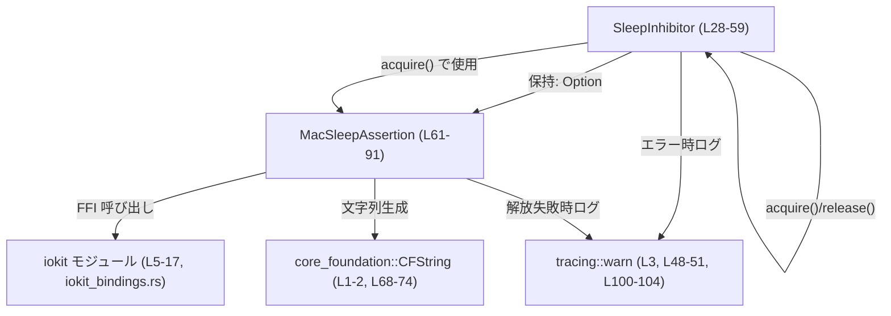
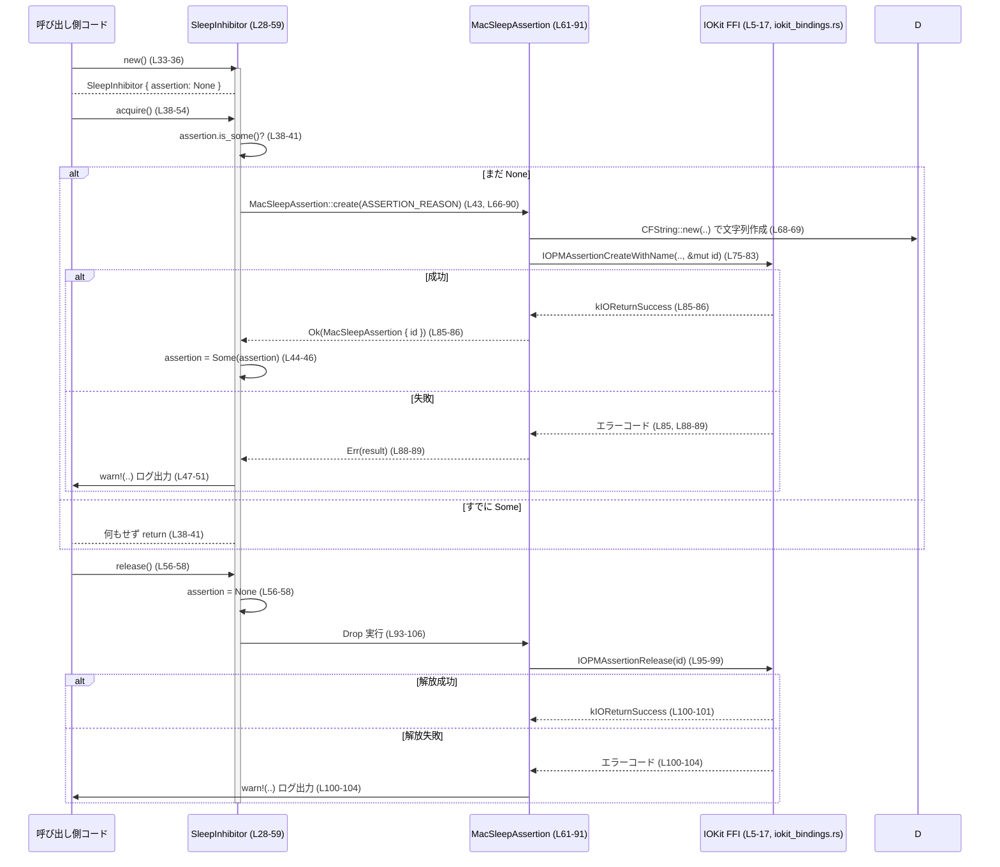

# utils\sleep-inhibitor\src\macos.rs コード解説

---

## 0. ざっくり一言

macOS の IOKit に対する FFI を通じて、「ユーザーアイドルによるシステムスリープ」を抑止するアサーションを作成・破棄するための、RAII 風ラッパーモジュールです。`SleepInhibitor` 型を通じて取得と解放を行い、内部で `MacSleepAssertion` と IOKit の `IOPMAssertion*` 関数を呼び出します。  
(utils\sleep-inhibitor\src\macos.rs:L5-21, L28-31, L61-64, L66-90, L93-106)

---

## 1. このモジュールの役割

### 1.1 概要

- このモジュールは、macOS 上でアプリケーション動作中にシステムスリープ（ユーザーのアイドルによるスリープ）を防ぐための IOKit アサーションを管理する問題を解決するために存在します。  
  (utils\sleep-inhibitor\src\macos.rs:L23-26, L66-90)
- Rust コードから安全に扱えるように、`SleepInhibitor` 構造体がアサーションの生存期間を管理し、内部で `MacSleepAssertion` が IOKit の `IOPMAssertionCreateWithName` と `IOPMAssertionRelease` を呼び出します。  
  (utils\sleep-inhibitor\src\macos.rs:L28-31, L38-58, L61-64, L66-90, L93-106)

### 1.2 アーキテクチャ内での位置づけ

このファイル内の依存関係は概ね次のような構造になっています。



- `SleepInhibitor` は公開範囲 `pub(crate)` のフロントエンドであり、外部（同一クレート内）から直接利用される想定です。  
  (utils\sleep-inhibitor\src\macos.rs:L28-31, L33-58)
- `MacSleepAssertion` はモジュール内専用（非 `pub`）の実装詳細で、IOKit のアサーション ID を保持し、生成と解放の責務を担います。  
  (utils\sleep-inhibitor\src\macos.rs:L61-64, L66-90, L93-106)
- `iokit` モジュールは `include!("iokit_bindings.rs")` を通じて IOKit のバインディングを取り込みますが、その具体的な中身はこのチャンクには現れません。  
  (utils\sleep-inhibitor\src\macos.rs:L5-17)

### 1.3 設計上のポイント

- **RAII によるリソース管理**  
  - `MacSleepAssertion` が `Drop` を実装し、インスタンスがスコープを抜けると自動的に `IOPMAssertionRelease` が呼ばれる構造になっています。  
    (utils\sleep-inhibitor\src\macos.rs:L61-64, L93-106)
  - `SleepInhibitor::release` で `Option<MacSleepAssertion>` を `None` にすることで、`Drop` によってアサーションが解放されます。  
    (utils\sleep-inhibitor\src\macos.rs:L28-31, L56-58)
- **状態管理の単純化**  
  - `SleepInhibitor` は `assertion: Option<MacSleepAssertion>` という 1 フィールドのみを持ち、アサーションが取得済みかどうかを `Option` で表現しています。  
    (utils\sleep-inhibitor\src\macos.rs:L28-31, L38-41)
- **エラーハンドリング**  
  - IOKit 呼び出しの戻り値 `IOReturn` を `Result<Self, IOReturn>` で返し、呼び出し側の `SleepInhibitor::acquire` では `tracing::warn!` によるログ出力のみを行い、呼び出し元にはエラーを伝播しません。  
    (utils\sleep-inhibitor\src\macos.rs:L20-21, L38-53, L66-90, L48-51)
- **FFI 安全性への配慮**  
  - FFI 呼び出し部分のみ `unsafe` ブロックに閉じ込め、事前に `CFString` から `CFStringRef` へのキャストを行うことで、Rust 側の型安全性を保ちつつポインタを渡しています。  
    (utils\sleep-inhibitor\src\macos.rs:L66-84)
  - 解放側も `unsafe` ブロックを最小限にし、`self.id` を一度だけ渡すことをコメントで明示しています。  
    (utils\sleep-inhibitor\src\macos.rs:L93-99)
- **並行性**  
  - `SleepInhibitor::acquire` / `release` はどちらも `&mut self` を受け取るため、同一インスタンスに対して複数スレッドから同時にこれらを呼び出すことは Rust の借用規則によりコンパイル時に制限されます。  
    (utils\sleep-inhibitor\src\macos.rs:L38-39, L56-57)

---

## 2. 主要な機能一覧

- システムスリープ抑止アサーションの生成: IOKit の `IOPMAssertionCreateWithName` をラップして、ユーザーアイドルスリープを防ぐアサーションを作成します。  
  (utils\sleep-inhibitor\src\macos.rs:L23-26, L66-84)
- アサーション ID の RAII 管理: `MacSleepAssertion` の `Drop` 実装を通じて `IOPMAssertionRelease` を自動的に呼び出します。  
  (utils\sleep-inhibitor\src\macos.rs:L61-64, L93-106)
- 高レベル API (`SleepInhibitor`): アサーション取得 (`acquire`) と解放 (`release`) をクレート内の他コードから利用しやすい形で提供します。  
  (utils\sleep-inhibitor\src\macos.rs:L28-31, L33-58)
- エラー時のログ出力: アサーションの取得・解放に失敗した場合に `tracing::warn!` で警告ログを出します。  
  (utils\sleep-inhibitor\src\macos.rs:L48-51, L100-104)

---

## 2.5 コンポーネントインベントリー（構造体・関数・定数など）

このチャンクに現れる主要コンポーネントを一覧にします。

| 名前 | 種別 | 役割 / 用途 | 定義位置 |
|------|------|-------------|----------|
| `iokit` | モジュール | IOKit フレームワークの FFI バインディングを含む内部モジュール。`iokit_bindings.rs` を `include!` で取り込みます。 | utils\sleep-inhibitor\src\macos.rs:L5-17 |
| `IOPMAssertionID` | 型エイリアス | IOKit のアサーション ID を表す型。`MacSleepAssertion.id` の型として使用。 | utils\sleep-inhibitor\src\macos.rs:L19, L61-63 |
| `IOPMAssertionLevel` | 型エイリアス | IOKit のアサーションレベル（On/Off など）を表す型。 | utils\sleep-inhibitor\src\macos.rs:L20, L80 |
| `IOReturn` | 型エイリアス | IOKit 関数の戻り値コードを表す型。エラーコードとしても利用。 | utils\sleep-inhibitor\src\macos.rs:L21, L66-90 |
| `ASSERTION_REASON` | 定数 `&str` | アサーション名として渡す説明文字列（"Codex is running an active turn"）。 | utils\sleep-inhibitor\src\macos.rs:L23 |
| `ASSERTION_TYPE_PREVENT_USER_IDLE_SYSTEM_SLEEP` | 定数 `&str` | ユーザーアイドルスリープを防ぐアサーションタイプ名。`CFString` に変換して使用。 | utils\sleep-inhibitor\src\macos.rs:L24-26, L68 |
| `SleepInhibitor` | 構造体 | クレート内公開の高レベル API。内部に `Option<MacSleepAssertion>` を保持し、アサーションの有無を管理。 | utils\sleep-inhibitor\src\macos.rs:L28-31 |
| `SleepInhibitor::new` | メソッド | `Default` 実装を用いて `SleepInhibitor` を初期化するコンストラクタ。 | utils\sleep-inhibitor\src\macos.rs:L33-36 |
| `SleepInhibitor::acquire` | メソッド | まだアサーションが存在しない場合に新たに取得し、内部に保存。失敗時は警告ログ。 | utils\sleep-inhibitor\src\macos.rs:L38-54 |
| `SleepInhibitor::release` | メソッド | 内部の `MacSleepAssertion` を破棄してアサーションを解放（`Drop` 経由で `IOPMAssertionRelease` 呼び出し）。 | utils\sleep-inhibitor\src\macos.rs:L56-58 |
| `MacSleepAssertion` | 構造体 | IOKit のアサーション ID を保持し、その生成・解放を担う低レベルラッパー。 | utils\sleep-inhibitor\src\macos.rs:L61-64 |
| `MacSleepAssertion::create` | 関数（関連関数） | 指定名で IOKit アサーションを作成し、成功時に `MacSleepAssertion` を返す。失敗時は `IOReturn` を返す。 | utils\sleep-inhibitor\src\macos.rs:L66-90 |
| `Drop for MacSleepAssertion::drop` | メソッド | 保持しているアサーション ID に対して `IOPMAssertionRelease` を呼び出し、解放失敗時に警告ログを出す。 | utils\sleep-inhibitor\src\macos.rs:L93-106 |

---

## 3. 公開 API と詳細解説

### 3.1 型一覧（構造体・列挙体など）

| 名前 | 種別 | 役割 / 用途 | 主なフィールド | 定義位置 |
|------|------|-------------|----------------|----------|
| `SleepInhibitor` | 構造体（`pub(crate)`） | macOS スリープ抑止アサーションの取得・解放を管理する高レベル API。 | `assertion: Option<MacSleepAssertion>` | utils\sleep-inhibitor\src\macos.rs:L28-31 |
| `MacSleepAssertion` | 構造体（非公開） | 単一の IOKit アサーション ID の所有権を保持し、生成・解放を担当。 | `id: IOPMAssertionID` | utils\sleep-inhibitor\src\macos.rs:L61-64 |
| `IOPMAssertionID` | 型エイリアス | IOKit 側のアサーション ID ハンドル。具体的な中身は `iokit_bindings.rs` に依存し、このチャンクには現れません。 | – | utils\sleep-inhibitor\src\macos.rs:L19 |
| `IOPMAssertionLevel` | 型エイリアス | アサーションレベルを表す IOKit 側の型。 | – | utils\sleep-inhibitor\src\macos.rs:L20 |
| `IOReturn` | 型エイリアス | IOKit 関数の戻り値（エラーコード）を表す型。 | – | utils\sleep-inhibitor\src\macos.rs:L21 |

---

### 3.2 関数詳細

#### `SleepInhibitor::new() -> SleepInhibitor`

**概要**

`SleepInhibitor` のデフォルトインスタンスを作成します。内部の `assertion` フィールドは `None` で初期化されます。  
(utils\sleep-inhibitor\src\macos.rs:L28-31, L33-36)

**引数**

なし。

**戻り値**

- `SleepInhibitor`: まだ IOKit アサーションを保持していないインスタンス。

**内部処理の流れ**

1. `Self::default()` を呼び出し、`#[derive(Default)]` された `SleepInhibitor` のデフォルト値を取得します。  
   (utils\sleep-inhibitor\src\macos.rs:L28-29, L33-36)
2. それをそのまま返します。

**Errors / Panics**

- このメソッド内でエラーや panic を発生させるコードはありません。

**Edge cases（エッジケース）**

- 特になし（単純なデフォルト構築のみ）。

**使用上の注意点**

- `new` はアサーションを自動的には取得しません。スリープ抑止を行うには、この後に `acquire` を呼び出す必要があります。  
  (utils\sleep-inhibitor\src\macos.rs:L38-41)

---

#### `SleepInhibitor::acquire(&mut self)`

**概要**

まだアサーションを保持していない場合に、macOS IOKit のスリープ抑止アサーションを作成し、インスタンス内部に保存します。すでにアサーションを保持している場合は何も行いません。  
(utils\sleep-inhibitor\src\macos.rs:L28-31, L38-54)

**引数**

| 引数名 | 型 | 説明 |
|--------|----|------|
| `&mut self` | `&mut SleepInhibitor` | 可変参照。メソッド内で `self.assertion` を更新するため、ミュータブル借用が必要です。 |

**戻り値**

- 戻り値はありません（`()`）。成功・失敗の情報は戻り値ではなくログにのみ反映されます。

**内部処理の流れ**

1. `self.assertion.is_some()` をチェックし、すでにアサーションが存在する場合は早期リターンします。  
   (utils\sleep-inhibitor\src\macos.rs:L38-41)
2. 存在しない場合、`MacSleepAssertion::create(ASSERTION_REASON)` を呼び出して新しいアサーションを作成します。  
   (utils\sleep-inhibitor\src\macos.rs:L23, L43)
3. 戻り値の `Result` を `match` で分岐します。  
   - `Ok(assertion)` の場合: `self.assertion = Some(assertion)` として保存します。  
     (utils\sleep-inhibitor\src\macos.rs:L44-46)
   - `Err(error)` の場合: `tracing::warn!` で IOKit エラーコードとメッセージをログ出力します。`self.assertion` は変更されません。  
     (utils\sleep-inhibitor\src\macos.rs:L47-51)

**Errors / Panics**

- IOKit 呼び出しが失敗した場合、`MacSleepAssertion::create` は `Err(IOReturn)` を返し、このメソッドではそれをログ出力するだけで呼び出し元には伝播しません。  
  (utils\sleep-inhibitor\src\macos.rs:L43-51, L66-90)
- このメソッド自身は `Result` を返さないため、呼び出し側からは成功・失敗を判別できません（ログを参照する必要があります）。

**Edge cases（エッジケース）**

- **複数回の `acquire` 呼び出し**  
  - すでに `assertion` が `Some` の場合、2回目以降の `acquire` は即座に `return` し、新たなアサーションは作成されません。  
    (utils\sleep-inhibitor\src\macos.rs:L38-41)
- **アサーション作成失敗**  
  - `MacSleepAssertion::create` が `Err` を返した場合、`self.assertion` は引き続き `None` のままで、以降の `acquire` で再度作成を試みることができます。  
    (utils\sleep-inhibitor\src\macos.rs:L43-51)

**使用上の注意点**

- `&mut self` を要求するため、同じ `SleepInhibitor` インスタンスに対して並行して `acquire` を呼ぶことはできません（Rust の借用規則によりコンパイルエラーになります）。これは並行性上の安全性を高めるものです。  
  (utils\sleep-inhibitor\src\macos.rs:L38-39)
- アサーション作成の成功/失敗が API からは分からない点に注意が必要です。スリープ抑止が必須な処理であれば、`MacSleepAssertion::create` を直接呼び出すか、この API を拡張して `Result` を返すようにする必要があるかもしれませんが、そのような拡張はこのチャンクには現れません。  
  (utils\sleep-inhibitor\src\macos.rs:L38-51, L66-90)

---

#### `SleepInhibitor::release(&mut self)`

**概要**

内部に保持している `MacSleepAssertion` を破棄し、対応する IOKit アサーションを解放します。保持していない場合は何もしません。  
(utils\sleep-inhibitor\src\macos.rs:L28-31, L56-58, L93-106)

**引数**

| 引数名 | 型 | 説明 |
|--------|----|------|
| `&mut self` | `&mut SleepInhibitor` | 可変参照。内部の `assertion` を `None` に更新するために使用します。 |

**戻り値**

- なし（`()`）。

**内部処理の流れ**

1. `self.assertion = None;` と代入します。これにより、以前 `Some` であった場合は `MacSleepAssertion` がドロップされます。  
   (utils\sleep-inhibitor\src\macos.rs:L56-58)
2. `MacSleepAssertion` の `Drop` 実装が走り、`IOPMAssertionRelease` が呼び出されます。  
   (utils\sleep-inhibitor\src\macos.rs:L93-99)

**Errors / Panics**

- 解放に失敗した場合、`MacSleepAssertion::drop` で `tracing::warn!` が呼び出されるだけで、`release` の呼び出し側には何も通知されません。  
  (utils\sleep-inhibitor\src\macos.rs:L100-104)
- `release` 自体は `Result` を返さず、panic の可能性があるコードも含まれていません。

**Edge cases（エッジケース）**

- **アサーション未保持時の `release`**  
  - `assertion` がすでに `None` である場合でも、再度 `None` を代入するだけで、副作用は発生しません（`Drop` も呼ばれません）。  
    (utils\sleep-inhibitor\src\macos.rs:L28-31, L56-58)
- **`SleepInhibitor` のスコープ終了時**  
  - `release` を明示的に呼ばなくても、`SleepInhibitor` がドロップされる際に内部の `MacSleepAssertion` もドロップされるため、アサーションは自動的に解放されます。これは RAII パターンの一部です。  
    (utils\sleep-inhibitor\src\macos.rs:L28-31, L61-64, L93-106)

**使用上の注意点**

- 長時間の処理が終わる前に `release` を呼ぶと、その時点でスリープ抑止アサーションが解放されるため、以降はシステムがスリープする可能性があります。
- `SleepInhibitor` インスタンスを短いスコープに閉じ込めることで、`Drop` による自動解放を利用することもできます。

---

#### `MacSleepAssertion::create(name: &str) -> Result<MacSleepAssertion, IOReturn>`

**概要**

指定された名前を持つ macOS のスリープ抑止アサーションを作成し、成功時にはアサーション ID を保持する `MacSleepAssertion` を返します。失敗時には IOKit の戻り値コード（`IOReturn`）を `Err` で返します。  
(utils\sleep-inhibitor\src\macos.rs:L66-90)

**引数**

| 引数名 | 型 | 説明 |
|--------|----|------|
| `name` | `&str` | アサーションの説明文字列（ログやシステムに表示される名称）。 |

**戻り値**

- `Ok(MacSleepAssertion)` : アサーション作成に成功し、`id: IOPMAssertionID` を保持する構造体が返されます。  
- `Err(IOReturn)` : IOKit の `IOPMAssertionCreateWithName` からエラーコードが返ってきた場合。

**内部処理の流れ**

1. アサーションタイプ用 `CFString` を作成  
   - `ASSERTION_TYPE_PREVENT_USER_IDLE_SYSTEM_SLEEP` を元に `CFString::new` を呼び、アサーションタイプの `CFString` を作成します。  
     (utils\sleep-inhibitor\src\macos.rs:L24-26, L68)
2. アサーション名用 `CFString` を作成  
   - 渡された `name` 文字列を `CFString::new` で `CFString` に変換します。  
     (utils\sleep-inhibitor\src\macos.rs:L69)
3. アサーション ID の初期化  
   - `let mut id: IOPMAssertionID = 0;` として ID 変数を初期化します。具体的な型は `iokit_bindings.rs` に依存し、このチャンクには現れません。  
     (utils\sleep-inhibitor\src\macos.rs:L70)
4. `CFString` から `CFStringRef` へのキャスト  
   - `assertion_type.as_concrete_TypeRef().cast()` / `assertion_name.as_concrete_TypeRef().cast()` で、`core-foundation` の `CFString` から IOKit バインディングで定義された `CFStringRef` 型にキャストします。  
     (utils\sleep-inhibitor\src\macos.rs:L71-74)
5. IOKit 関数の呼び出し（`unsafe`）  
   - `IOPMAssertionCreateWithName` を `unsafe` ブロック内で呼び出し、アサーションを作成します。引数として、タイプ・レベル（`kIOPMAssertionLevelOn`）・名前・`&mut id` を渡します。  
     (utils\sleep-inhibitor\src\macos.rs:L75-83)
6. 戻り値の判定  
   - 戻り値 `result` を `kIOReturnSuccess` と比較し、等しければ `Ok(Self { id })` を返し、そうでなければ `Err(result)` としてエラーコードを返します。  
     (utils\sleep-inhibitor\src\macos.rs:L85-89)

**Errors / Panics**

- `IOPMAssertionCreateWithName` 自体は FFI 関数であり、戻り値として `IOReturn` を返す設計になっているため、この関数はそれを `Result` に変換して扱います。  
  (utils\sleep-inhibitor\src\macos.rs:L75-83, L85-89)
- `unwrap` や `expect` は使用されておらず、panic を発生させるコードは含まれていません。

**Edge cases（エッジケース）**

- **`name` が空文字列の場合**  
  - この関数内では `name` の内容に対する特別なチェックは行っていません。IOKit が空名をどのように扱うかは `iokit_bindings.rs` および OS の仕様によるため、このチャンクからは分かりません。  
    (utils\sleep-inhibitor\src\macos.rs:L67-69)
- **`IOPMAssertionCreateWithName` の異常戻り値**  
  - 成功時以外のすべての戻り値を `Err(result)` として扱います。具体的なエラーコードの意味（例えば権限不足・無効なパラメータなど）はこのチャンクには現れません。  
    (utils\sleep-inhibitor\src\macos.rs:L85-89)

**使用上の注意点**

- この関数は `pub` ではなく、モジュール内からのみ利用されています（`SleepInhibitor::acquire` から）。  
  (utils\sleep-inhibitor\src\macos.rs:L43-45, L66-90)
- FFI 呼び出しの安全性は、`CFString` と `CFStringRef` の実装が前提どおりであることに依存しますが、その詳細は `core-foundation` クレートおよび `iokit_bindings.rs` に委ねられており、このチャンクからは確認できません。  
  (utils\sleep-inhibitor\src\macos.rs:L1-2, L71-74)

---

#### `impl Drop for MacSleepAssertion { fn drop(&mut self) }`

**概要**

`MacSleepAssertion` がドロップされるときに、保持しているアサーション ID に対して IOKit の `IOPMAssertionRelease` を呼び出し、アサーションを解放します。解放に失敗した場合は警告ログを出力します。  
(utils\sleep-inhibitor\src\macos.rs:L61-64, L93-106)

**引数**

| 引数名 | 型 | 説明 |
|--------|----|------|
| `&mut self` | `&mut MacSleepAssertion` | ドロップされるインスタンスへの可変参照。`self.id` を解放に使用します。 |

**戻り値**

- `drop` は戻り値を持ちません（Rust の `Drop` トレイト仕様）。

**内部処理の流れ**

1. FFI 呼び出しで解放  
   - `unsafe` ブロック内で `iokit::IOPMAssertionRelease(self.id)` を呼び出し、結果を `result` 変数に格納します。  
     (utils\sleep-inhibitor\src\macos.rs:L95-99)
2. 戻り値の判定  
   - `result != kIOReturnSuccess` の場合、`tracing::warn!` を使ってエラーコードとエラーメッセージをログ出力します。  
     (utils\sleep-inhibitor\src\macos.rs:L100-104)

**Errors / Panics**

- `IOPMAssertionRelease` が失敗しても panic にはならず、ログ出力のみにとどまります。  
  (utils\sleep-inhibitor\src\macos.rs:L100-104)
- `unsafe` ブロックは FFI 呼び出しに限定されており、その前後では安全な Rust コードのみです。  

**Edge cases（エッジケース）**

- **`id` が無効な場合**  
  - コード上は常に `IOPMAssertionCreateWithName` から返された ID のみを保持している想定ですが、仮に `id` が無効であれば、`IOPMAssertionRelease` が失敗し、警告ログが出力されると考えられます。ただし、無効 ID の具体的な扱いはこのチャンクからは分かりません。  
    (utils\sleep-inhibitor\src\macos.rs:L66-90, L93-106)
- **二重解放の防止**  
  - `Drop` は Rust により各インスタンスにつき一度だけ呼び出されるため、同じ `id` に対して `IOPMAssertionRelease` を二重に呼び出すことは構造上発生しません。  
    (utils\sleep-inhibitor\src\macos.rs:L61-64, L93-106)

**使用上の注意点**

- `MacSleepAssertion` を所有している限り、対応するアサーションは生き続け、インスタンスがドロップされると解放されます。`SleepInhibitor` を通じて RAII を利用するのが前提となっています。  
  (utils\sleep-inhibitor\src\macos.rs:L28-31, L56-58, L93-106)
- `Drop` 実装内では `unwrap` 等を使っていないため、解放失敗がアプリケーション全体のクラッシュにつながることはありませんが、スリープ抑止状態が意図通り解除されない可能性はあります。

---

### 3.3 その他の関数

このファイルには、上記以外の補助的な関数や単純なラッパー関数は存在しません。  
(utils\sleep-inhibitor\src\macos.rs:L1-107)

---

## 4. データフロー

ここでは、典型的な利用シナリオ「`SleepInhibitor` を使って処理中のスリープを防ぎ、終了時に解放する場合」のデータフローを示します。

1. 呼び出し側が `SleepInhibitor::new()` でインスタンスを生成する（この時点ではアサーション ID なし）。  
   (utils\sleep-inhibitor\src\macos.rs:L28-31, L33-36)
2. `acquire()` を呼び出すと、内部で `MacSleepAssertion::create` が呼び出され、IOKit を通じてアサーション ID が取得・保持される。  
   (utils\sleep-inhibitor\src\macos.rs:L38-45, L66-90)
3. 長時間の処理中は、該当アサーションによりユーザーアイドルスリープが抑止される（OS 側の挙動）。この詳細はこのチャンクには現れません。
4. 処理完了後に `release()` を呼ぶか、`SleepInhibitor` のスコープが終了すると、`MacSleepAssertion` の `Drop` が走り `IOPMAssertionRelease` でアサーションが解放される。  
   (utils\sleep-inhibitor\src\macos.rs:L56-58, L93-106)



---

## 5. 使い方（How to Use）

### 5.1 基本的な使用方法

`SleepInhibitor` はクレート内公開 (`pub(crate)`) なので、同じクレート内のコードから次のように利用できる設計になっています。  
(utils\sleep-inhibitor\src\macos.rs:L28-31, L33-58)

```rust
// utils::sleep_inhibitor::macos モジュールの中、もしくは同一クレート内の例

fn run_long_task() {
    // 長時間処理の開始前に SleepInhibitor を生成する
    let mut inhibitor = SleepInhibitor::new();        // assertion は None で開始される
    inhibitor.acquire();                              // IOKit アサーションを取得（失敗時は warn ログ）

    // --- ここから長時間にわたる処理 ---
    do_some_work();                                   // ユーザーがアイドルでもシステムスリープされにくくなる想定
    // --- 処理ここまで ---

    // 明示的に解放したい場合は release() を呼び出す
    inhibitor.release();                              // assertion = None になり、Drop 経由で解放
                                                      // ここで関数を抜ければ inhibitor 自体もドロップされる
}
```

- `acquire` / `release` のいずれも `Result` を返さないため、状態はログ（`tracing::warn!`）で確認する設計です。  
  (utils\sleep-inhibitor\src\macos.rs:L38-58, L48-51, L100-104)
- 明示的に `release` を呼ばなくても、`inhibitor` がスコープを抜けるときに内部の `MacSleepAssertion` の `Drop` によって解放されます。  
  (utils\sleep-inhibitor\src\macos.rs:L28-31, L61-64, L93-106)

### 5.2 よくある使用パターン

1. **スコープに紐づけた RAII 利用**

```rust
fn run_task_with_scope_inhibition() {
    {
        let mut inhibitor = SleepInhibitor::new();   // スコープ開始時に作成
        inhibitor.acquire();                         // スリープ抑止を有効化

        do_some_work();                              // このブロック内だけ抑止される
    }                                               // ブロックを抜けると inhibitor がドロップされ、アサーションも自動解放
}
```

1. **複数回の `acquire` を安全に無視**

```rust
fn idempotent_acquire() {
    let mut inhibitor = SleepInhibitor::new();

    inhibitor.acquire();    // 最初の取得
    inhibitor.acquire();    // 2回目: assertion は Some のため何も起きない
                            // IOKit 呼び出しの二重実行が抑制される設計
}
```

(utils\sleep-inhibitor\src\macos.rs:L38-41)

### 5.3 よくある間違い

```rust
// 間違い例: SleepInhibitor をローカルで作らず、一時変数で acquire してすぐドロップしてしまう
fn wrong_usage() {
    SleepInhibitor::new().acquire();  // 一時値に対して acquire を呼ぶ
    // ここに到達する前に一時値がドロップされるため、アサーションもすぐ解放される
}

// 正しい例: inhibitor を変数として保持し、必要な期間スコープ内に置いておく
fn correct_usage() {
    let mut inhibitor = SleepInhibitor::new();   // 変数に束縛
    inhibitor.acquire();                         // スリープ抑止を有効化

    do_some_work();                              // inhibitor がスコープ内にある間は抑止が継続する
}                                               // スコープを抜けると inhibitor の Drop により解放される
```

このように、所有権（どの変数が `SleepInhibitor` を所有しているか）とスコープの長さが、スリープ抑止の期間に直結します。  
(utils\sleep-inhibitor\src\macos.rs:L28-31, L33-58, L61-64, L93-106)

### 5.4 使用上の注意点（まとめ）

- **前提条件**
  - macOS 専用の IOKit 依存コードであり、他 OS では利用できない設計です（`#[link(name = "IOKit", kind = "framework")]` より推定）。  
    (utils\sleep-inhibitor\src\macos.rs:L13-14)
- **エラー通知**
  - IOKit の作成・解放エラーは `tracing::warn!` ログに出るだけで、呼び出し元には型レベルでは伝わりません。スリープ抑止が必須な用途では、ログ監視などで検知する必要があります。  
    (utils\sleep-inhibitor\src\macos.rs:L48-51, L100-104)
- **並行性**
  - `acquire` / `release` は `&mut self` を要求するため、1つの `SleepInhibitor` インスタンスに対して同時に複数スレッドから操作することはコンパイル時に防止されます。ただし、複数の `SleepInhibitor` インスタンスを作成すること自体は防いでいません。  
    (utils\sleep-inhibitor\src\macos.rs:L38-39, L56-57)
- **Drop への依存**
  - プロセスが正常終了せずに異常終了した場合など、`Drop` が呼ばれないケースではアサーションが OS 側にどのように残るかはこのチャンクからは分かりません。そのようなシナリオの扱いは OS の仕様と IOKit に依存します。  
    (utils\sleep-inhibitor\src\macos.rs:L93-106)

---

## 6. 変更の仕方（How to Modify）

### 6.1 新しい機能を追加する場合

例として、「別種のアサーションタイプもサポートしたい」「エラーを呼び出し元へ返したい」といった拡張を考える場合の観点です。

1. **アサーションタイプの追加**
   - 新しい IOKit アサーションタイプの CFString 名を定数として追加します。  
     (既存の `ASSERTION_TYPE_PREVENT_USER_IDLE_SYSTEM_SLEEP` の定義を参考にする: utils\sleep-inhibitor\src\macos.rs:L24-26)
   - `MacSleepAssertion::create` に引数としてアサーションタイプを渡すようにインターフェースを拡張し、内部で使用する CFString を切り替えます。  
     (utils\sleep-inhibitor\src\macos.rs:L66-74)
   - それに合わせて `SleepInhibitor::acquire` の引数や内部ロジックを調整します。  
     (utils\sleep-inhibitor\src\macos.rs:L38-54)

2. **エラーを呼び出し元に返す**
   - `SleepInhibitor::acquire` のシグネチャを `pub(crate) fn acquire(&mut self) -> Result<(), IOReturn>` のように変更し、`MacSleepAssertion::create` の結果をそのまま返す設計に変更することが考えられます。  
     (現状は `Result` を受けてもログのみ: utils\sleep-inhibitor\src\macos.rs:L43-51)
   - 変更時には、`acquire` を呼び出しているすべての箇所で `Result` を扱う必要があります。このファイル内には呼び出し元は現れないため、他ファイルを検索する必要があります（このチャンクには情報がありません）。

3. **ログの拡張**
   - 現在は `warn!` ログのみなので、必要に応じて追加情報（例えばアサーション名）をフィールドとして出力するように変更できます。  
     (utils\sleep-inhibitor\src\macos.rs:L48-51, L100-104)

### 6.2 既存の機能を変更する場合

- **影響範囲の確認**
  - `SleepInhibitor` はクレート内で使用される公開 API (`pub(crate)`) なので、そのフィールドやメソッドシグネチャを変更する場合は、クレート内の呼び出し箇所すべてに影響が出ます。  
    (utils\sleep-inhibitor\src\macos.rs:L28-31, L33-58)
  - `MacSleepAssertion` はモジュール内専用なので、そのインターフェース変更はこのモジュール内に閉じますが、`SleepInhibitor::acquire` との整合性を保つ必要があります。  
    (utils\sleep-inhibitor\src\macos.rs:L43-45, L61-64, L66-90)

- **契約（前提条件・返り値の意味）**
  - `MacSleepAssertion::create` が「成功なら `Ok`, それ以外は `Err`」という契約を持っている点を変える場合は、`SleepInhibitor::acquire` のエラーハンドリングも合わせて更新する必要があります。  
    (utils\sleep-inhibitor\src\macos.rs:L66-90, L43-51)
  - `Drop` 実装は「必ず一度だけ `IOPMAssertionRelease` を呼ぶ」という契約を暗に持っているため、この契約を壊す変更（例えば `id` を共有するような構造変更）は注意が必要です。  
    (utils\sleep-inhibitor\src\macos.rs:L61-64, L93-106)

- **テストと確認**
  - このファイルにはテストコードが含まれていません。`#[cfg(test)]` モジュールなども存在しません。変更後の挙動を確認するには、別ファイルにあるはずのテストや、実際の macOS 環境での実行テストが必要になります。  
    (utils\sleep-inhibitor\src\macos.rs:L1-107)

---

## 7. 関連ファイル

| パス | 役割 / 関係 |
|------|------------|
| `utils/sleep-inhibitor/src/macos.rs` | 本ファイル。macOS 向けのスリープ抑止ロジックと IOKit との FFI を提供します。 |
| `utils/sleep-inhibitor/src/iokit_bindings.rs` | `include!("iokit_bindings.rs")` で読み込まれる IOKit のバインディング定義ファイル。`IOPMAssertionID` や `IOPMAssertionCreateWithName` などの具体的な型・関数シグネチャはここに記述されていると推測されますが、このチャンクにはその中身は現れません。 (utils\sleep-inhibitor\src\macos.rs:L16) |

このチャンクには、他 OS（Windows や Linux）向けの sleep inhibitor 実装や、テストコードを含むファイルへの言及はありません。そのため、それらの存在や構造については「不明」となります。
