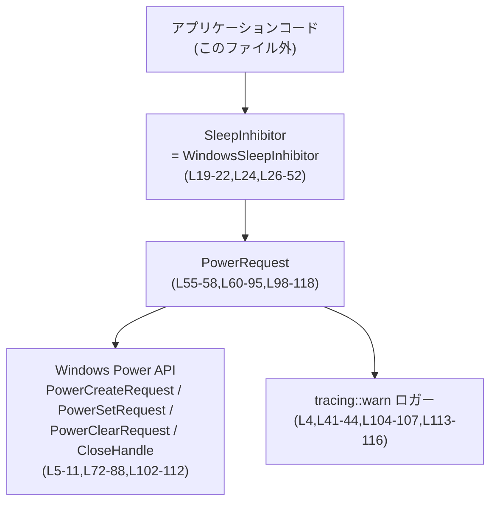
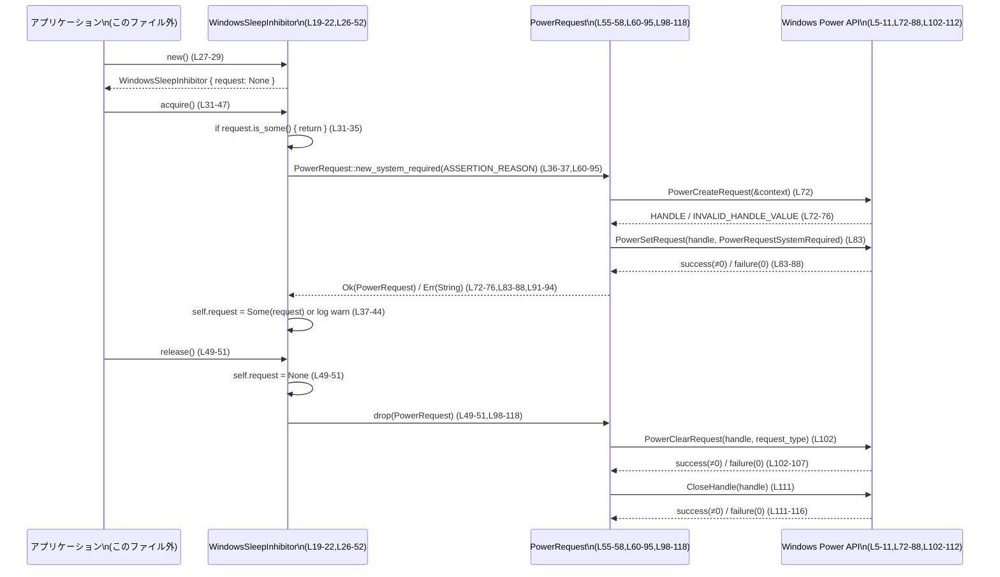

# utils\sleep-inhibitor\src\windows_inhibitor.rs

---

## 0. ざっくり一言

Windows の電源管理 API を呼び出して、アプリケーションの実行中に OS がアイドルスリープに入るのを抑止するための、小さなラッパーモジュールです（`WindowsSleepInhibitor` と内部の `PowerRequest` で構成されています。`windows_inhibitor.rs:L19-22,L55-58`）。

---

## 1. このモジュールの役割

### 1.1 概要

- このモジュールは、**「処理中は Windows をスリープさせたくない」**という問題を解決するために存在し、Windows の `PowerCreateRequest` / `PowerSetRequest` / `PowerClearRequest` を安全な Rust API で包んでいます（`windows_inhibitor.rs:L5-11,L60-95,L98-118`）。
- 呼び出し側は `WindowsSleepInhibitor`（別名 `SleepInhibitor`）を生成し、`acquire` と `release` を呼ぶだけで、対象スコープの間だけスリープ抑止を有効にできます（`windows_inhibitor.rs:L19-24,L26-52`）。
- FFI 部分は内部の `PowerRequest` 型に閉じ込められており、Drop 実装により OS 側のリソース解放を自動化しています（`windows_inhibitor.rs:L55-58,L60-95,L98-118`）。

### 1.2 アーキテクチャ内での位置づけ

このモジュール内の主なコンポーネントと依存関係を図示します。



- アプリケーションコードは `SleepInhibitor`（`pub(crate) use` された `WindowsSleepInhibitor`）を通じてのみこのモジュールとやり取りします（`windows_inhibitor.rs:L19-24`）。
- 実際の Windows API 呼び出しはすべて `PowerRequest::new_system_required` と `Drop for PowerRequest` に閉じ込められています（`windows_inhibitor.rs:L60-95,L98-118`）。
- エラー情報は全て `tracing::warn` でロギングされ、API シグネチャとしては露出していません（`windows_inhibitor.rs:L4,L40-44,L103-107,L112-116`）。

### 1.3 設計上のポイント

- **RAII によるリソース管理**  
  Windows のパワーリクエストハンドルは `PowerRequest` に保持され、`Drop` 実装で `PowerClearRequest` と `CloseHandle` が必ず呼ばれる構造になっています（`windows_inhibitor.rs:L55-58,L98-118`）。  
  これにより、呼び出し側が `release` を呼び忘れてもスコープ終了時に OS リソースが解放されます。

- **安全な公開 API**  
  FFI (`unsafe` ブロック) は `PowerRequest::new_system_required` と `Drop::drop` 内に限定されており、外部に公開される API (`WindowsSleepInhibitor::new/acquire/release`) はすべて安全な Rust 関数として提供されています（`windows_inhibitor.rs:L26-52,L60-95,L98-118`）。

- **単一のアクティブリクエスト**  
  `WindowsSleepInhibitor` は `Option<PowerRequest>` 1つだけを保持し、`acquire` 時にすでに `Some` であれば何もしないようになっています（`windows_inhibitor.rs:L19-22,L31-35`）。  
  これにより、同一インスタンス上での二重取得やネスト管理は行わず、「最大 1 つのリクエスト」を保証します。

- **エラー処理方針**  
  FFI の失敗 (`PowerCreateRequest` / `PowerSetRequest` / `PowerClearRequest` / `CloseHandle`) は `std::io::Error::last_os_error()` の結果をメッセージにして `Err(String)` として返したり、`tracing::warn` で記録する形で扱われており、パニックは発生させません（`windows_inhibitor.rs:L72-76,L83-88,L102-107,L111-116`）。

- **並行性の前提**  
  `acquire` と `release` はどちらも `&mut self` を要求し（`windows_inhibitor.rs:L31,L49`）、同一インスタンスへの同時アクセスはコンパイル時に禁止されます。内部にはスレッド同期の仕組みは持たず、このレベルの排他性に依存しています（`windows_inhibitor.rs:L19-22,L26-52`）。

---

## 2. 主要な機能一覧

- スリープ抑止ハンドルの管理構造体 `WindowsSleepInhibitor` の提供（`windows_inhibitor.rs:L19-22,L24`）。
- `WindowsSleepInhibitor::new` による抑止機構の初期化（`windows_inhibitor.rs:L26-29`）。
- `WindowsSleepInhibitor::acquire` による Windows へのスリープ抑止リクエスト発行（`windows_inhibitor.rs:L31-47`）。
- `WindowsSleepInhibitor::release` による抑止解除（内部の `PowerRequest` の Drop による解放）（`windows_inhibitor.rs:L49-51,L98-118`）。
- `PowerRequest::new_system_required` による Windows Power Request ハンドルの生成と設定（`windows_inhibitor.rs:L55-58,L60-95`）。

---

## 3. 公開 API と詳細解説

### 3.1 型一覧（構造体・列挙体など）

| 名前                         | 種別        | 公開範囲      | 役割 / 用途                                                                                     | 定義箇所                          |
|------------------------------|-------------|---------------|--------------------------------------------------------------------------------------------------|-----------------------------------|
| `WindowsSleepInhibitor`      | 構造体      | `pub(crate)`  | Windows のスリープ抑止リクエストを管理する高レベル API。内部に `Option<PowerRequest>` を保持。 | `windows_inhibitor.rs:L19-22`     |
| `SleepInhibitor`             | 型エイリアス（再公開） | `pub(crate)`  | 他モジュールから `SleepInhibitor` という名前で `WindowsSleepInhibitor` を利用可能にする別名。    | `windows_inhibitor.rs:L24`        |
| `PowerRequest`               | 構造体      | モジュール内のみ | Windows の Power Request ハンドルとリクエスト種別を保持し、FFI 呼び出しと Drop での解放を担当。 | `windows_inhibitor.rs:L54-58`     |
| `ASSERTION_REASON`           | `&'static str` 定数 | モジュール内のみ | Windows に渡すスリープ抑止理由文字列。`PowerRequest::new_system_required` に渡される。          | `windows_inhibitor.rs:L17`        |

### 3.2 関数詳細

#### `WindowsSleepInhibitor::new() -> Self`

**概要**

- スリープ抑止リクエストをまだ持たない `WindowsSleepInhibitor` を生成します（`windows_inhibitor.rs:L26-29`）。
- 内部では `Default` 実装をそのまま呼び出しているため、常に成功します（`windows_inhibitor.rs:L19-22,L27-29`）。

**引数**

- なし。

**戻り値**

- `Self`（`WindowsSleepInhibitor`）: `request` フィールドが `None` の状態のインスタンスです（`windows_inhibitor.rs:L19-22,L27-29`）。

**内部処理の流れ**

1. `Self::default()` を呼び出し、`request: None` のインスタンスを生成します（`windows_inhibitor.rs:L19-22,L27-29`）。

**Examples（使用例）**

```rust
// 実際のモジュールパスはプロジェクト構成に合わせて調整する必要があります。
use crate::sleep_inhibitor::SleepInhibitor; // = WindowsSleepInhibitor

fn main() {
    // スリープ抑止機能のインスタンスを生成（まだ OS には何も要求していない）
    let mut inhibitor = SleepInhibitor::new(); // windows_inhibitor.rs:L26-29

    // 必要に応じて acquire() でスリープ抑止を開始する
    inhibitor.acquire();
}
```

**Errors / Panics**

- この関数内でエラーやパニックを発生させるコードは含まれていません（単一の `Self::default()` 呼び出しのみ）（`windows_inhibitor.rs:L27-29`）。

**Edge cases（エッジケース）**

- 特筆すべきエッジケースはありません。常に同じ初期状態のインスタンスが返ります。

**使用上の注意点**

- `acquire` や `release` を使うために、呼び出し側はインスタンスを可変（`mut`）で保持する必要があります（`windows_inhibitor.rs:L31,L49`）。

---

#### `WindowsSleepInhibitor::acquire(&mut self)`

**概要**

- まだ Windows のスリープ抑止リクエストを保持していない場合に、新たにリクエストを作成・登録します（`windows_inhibitor.rs:L31-47`）。
- すでにリクエストを保持している場合は何もせずに戻ります（`windows_inhibitor.rs:L31-35`）。

**引数**

| 引数名  | 型                    | 説明                                              |
|--------|------------------------|---------------------------------------------------|
| `self` | `&mut WindowsSleepInhibitor` | 自身。内部状態（`request`）を書き換えるため可変参照が必要です。 |

**戻り値**

- なし（戻り値型は `()`）。成功／失敗は戻り値ではなくログ出力によりしか分かりません（`windows_inhibitor.rs:L31-47`）。

**内部処理の流れ**

1. `self.request.is_some()` をチェックし、すでにリクエストを保持している場合は即座に `return` します（`windows_inhibitor.rs:L31-35`）。
2. そうでなければ、`PowerRequest::new_system_required(ASSERTION_REASON)` を呼び出して Windows Power Request を作成します（`windows_inhibitor.rs:L36-37,L60-95`）。
3. 戻り値が `Ok(request)` の場合は `self.request = Some(request)` として保存します（`windows_inhibitor.rs:L37-39`）。
4. 戻り値が `Err(error)` の場合は、`tracing::warn!` でエラーメッセージをログ出力します（`windows_inhibitor.rs:L40-44`）。

**Examples（使用例）**

```rust
use crate::sleep_inhibitor::SleepInhibitor;

fn run_long_task() {
    // ここで時間のかかる処理を行う
}

fn main() {
    let mut inhibitor = SleepInhibitor::new();

    // Windows に「このアプリが動いている間はアイドルスリープしないで」と要求
    inhibitor.acquire(); // windows_inhibitor.rs:L31-47

    run_long_task();

    // 明示的に解除（しなくても drop 時に解除されるが、早めに解除したい場合）
    inhibitor.release(); // windows_inhibitor.rs:L49-51
}
```

**Errors / Panics**

- `PowerRequest::new_system_required` が `Err(String)` を返した場合（`PowerCreateRequest` または `PowerSetRequest` が失敗した場合）、`acquire` 自身はパニックせず、警告ログを出すだけで終了します（`windows_inhibitor.rs:L36-44,L72-76,L83-88`）。
- 呼び出し側にはエラーは返されません。失敗しても `self.request` は `None` のままです（`windows_inhibitor.rs:L37-39`）。

**Edge cases（エッジケース）**

- **二重取得**: すでに `request` が `Some` のときに `acquire` を呼ぶと、何もせずに即 return します。追加の Power Request は作成されません（`windows_inhibitor.rs:L31-35`）。
- **取得失敗**: Windows API が失敗した場合、ログだけが残り、スリープ抑止は有効になりません（`windows_inhibitor.rs:L36-44,L72-76,L83-88`）。

**使用上の注意点**

- 取得に失敗したかどうかは戻り値では分からないため、「絶対にスリープさせたくない」ような用途では、ログを監視するか、API を `Result` を返すよう拡張する必要があります。
- `&mut self` を要求するため、複数スレッドで同じインスタンスを同時に `acquire` することはコンパイル時に防がれますが、複数インスタンスを並行して使うかどうかの制御は呼び出し側に委ねられています。

---

#### `WindowsSleepInhibitor::release(&mut self)`

**概要**

- 現在保持している `PowerRequest` を破棄し、Windows に対するスリープ抑止リクエストを取り消します（`windows_inhibitor.rs:L49-51,L98-118`）。
- `request` が `Some` の場合は、その値がドロップされることで `PowerClearRequest` と `CloseHandle` が呼ばれます（`windows_inhibitor.rs:L49-51,L98-118`）。

**引数**

| 引数名  | 型                    | 説明                         |
|--------|------------------------|------------------------------|
| `self` | `&mut WindowsSleepInhibitor` | 自身の `request` を `None` にするための可変参照。 |

**戻り値**

- なし（`()`)。

**内部処理の流れ**

1. `self.request = None;` と代入します（`windows_inhibitor.rs:L49-51`）。
2. もし以前 `Some(PowerRequest)` が入っていれば、その値がドロップされ、`Drop for PowerRequest` が実行されます（`windows_inhibitor.rs:L49-51,L98-118`）。

**Examples（使用例）**

```rust
fn main() {
    let mut inhibitor = SleepInhibitor::new();
    inhibitor.acquire();

    // ここで一時的にスリープ抑止を有効化

    // もう抑止が不要になったので解除
    inhibitor.release(); // windows_inhibitor.rs:L49-51
    // 以降は通常どおり OS がアイドルスリープする可能性がある
}
```

**Errors / Panics**

- `release` 自身はエラーやパニックを発生させません（`windows_inhibitor.rs:L49-51`）。
- ただし、内部でドロップされる `PowerRequest` の `Drop` 実装内で Windows API の呼び出しに失敗した場合、`tracing::warn` によるロギングが行われます（`windows_inhibitor.rs:L98-118`）。

**Edge cases（エッジケース）**

- **未取得時の release**: `self.request` がすでに `None` の場合でも、単に代入されるだけで追加の副作用はありません（`windows_inhibitor.rs:L19-22,L49-51`）。
- **二重 release**: 1 回目の `release` で `Option` が `None` になるため、2 回目以降は何も起こりません。

**使用上の注意点**

- `release` を呼ばなくてもスコープ終端で `WindowsSleepInhibitor` 自体がドロップされ、その中の `PowerRequest` もドロップされるため、リソースリークは発生しません。ただし、「特定の処理だけ抑止したい」場合は適切なタイミングで `release` を呼ぶ必要があります。

---

#### `PowerRequest::new_system_required(reason: &str) -> Result<Self, String>`

**概要**

- Windows API を用いて「アイドル状態でシステムがスリープしない」ようにする Power Request を作成し、有効化します（`windows_inhibitor.rs:L60-95`）。
- 成功すれば `PowerRequest` インスタンスを返し、失敗すれば詳細なエラーメッセージを含む `Err(String)` を返します（`windows_inhibitor.rs:L72-76,L83-88`）。

**引数**

| 引数名  | 型        | 説明                          |
|--------|-----------|-------------------------------|
| `reason` | `&str` | スリープ抑止の理由を説明する文字列。Windows の `REASON_CONTEXT` に渡されます。 |

**戻り値**

- `Result<PowerRequest, String>`  
  - `Ok(PowerRequest)` : 有効な Windows Power Request ハンドルとリクエスト種別を保持する構造体。  
  - `Err(String)` : `PowerCreateRequest` または `PowerSetRequest` が失敗した場合のエラーメッセージ（`std::io::Error::last_os_error()` を文字列化したもの）。

**内部処理の流れ（アルゴリズム）**

1. `reason` を UTF-16 の `Vec<u16>` にエンコードし、末尾にヌル終端（0）を追加します（`windows_inhibitor.rs:L61-62`）。
2. 上記のバッファへのポインタを含む `REASON_CONTEXT` 構造体を構築します（`windows_inhibitor.rs:L63-69`）。
3. `unsafe { PowerCreateRequest(&context) }` を呼び出し、Power Request ハンドルを取得します（`windows_inhibitor.rs:L72`）。
4. 戻り値のハンドルがヌルまたは `INVALID_HANDLE_VALUE` の場合、`std::io::Error::last_os_error()` の内容を含む `Err` を返します（`windows_inhibitor.rs:L72-76`）。
5. `request_type` として `PowerRequestSystemRequired` を選択し（`windows_inhibitor.rs:L80`）、`unsafe { PowerSetRequest(handle, request_type) }` で実際のスリープ抑止を設定します（`windows_inhibitor.rs:L83`）。
6. `PowerSetRequest` が 0（失敗）を返した場合、`CloseHandle(handle)` でハンドルを明示的に閉じたうえで `Err(String)` を返します（`windows_inhibitor.rs:L83-88`）。
7. すべて成功した場合、`Ok(Self { handle, request_type })` を返します（`windows_inhibitor.rs:L91-94`）。

**Examples（使用例）**

`PowerRequest` はモジュール外に公開されていないため、通常は `WindowsSleepInhibitor::acquire` を通して間接的に利用されます（`windows_inhibitor.rs:L54-58,L60-95`）。

内部利用イメージは次のとおりです。

```rust
// 内部実装の概略（実際には windows_inhibitor.rs:L36-44 のように使われている）
fn acquire_system_required() -> Result<(), String> {
    // 内部定数 ASSERTION_REASON を使って PowerRequest を作成
    let _req = PowerRequest::new_system_required(ASSERTION_REASON)?; // windows_inhibitor.rs:L36-37,L60-95

    // _req がスコープにいる間はスリープ抑止が有効
    Ok(())
}
```

**Errors / Panics**

- `PowerCreateRequest` 失敗時  
  `handle.is_null() || handle == INVALID_HANDLE_VALUE` の場合に `Err("PowerCreateRequest failed: {error}")` を返します（`windows_inhibitor.rs:L72-76`）。
- `PowerSetRequest` 失敗時  
  一度 `CloseHandle(handle)` を試みたあと、`Err("PowerSetRequest failed: {error}")` を返します（`windows_inhibitor.rs:L83-88`）。
- パニック条件  
  - `Vec::collect` やメモリ確保に関する一般的な Rust の挙動として、メモリ不足などでパニックしうる可能性はありますが、このファイルから明示的なパニック呼び出しは読み取れません（`windows_inhibitor.rs:L61-62`）。

**Edge cases（エッジケース）**

- **非常に長い理由文字列**: Windows API 側の制約についてはこのファイルからは分かりませんが、ここでは単に UTF-16 バッファを作成して渡しているだけです（`windows_inhibitor.rs:L61-69`）。
- **`reason` にヌル文字が含まれる場合**: `encode_wide()` は文字列全体を UTF-16 に変換し、最後に明示的に 0 を追加しているだけなので、途中に 0 が含まれる可能性もありますが、その扱いは Windows API 側の仕様に依存します（`windows_inhibitor.rs:L61-62`）。
- **Windows API 呼び出し失敗**: 失敗時にはリソースリークが発生しないように `CloseHandle` が呼ばれてから `Err` が返されます（`windows_inhibitor.rs:L83-88`）。

**使用上の注意点**

- `PowerRequest` は Drop で `PowerClearRequest` を呼ぶ前提で設計されているため、`handle` を外部に公開して勝手に閉じるような変更を行うと、二重解放になる危険があります。
- `unsafe` ブロックでは Windows API の仕様に依存した前提（呼び出し中だけ `REASON_CONTEXT` のポインタが有効ならよい、など）を置いているため、その仕様が変わらないことが前提です（`windows_inhibitor.rs:L70-72` のコメント）。

---

#### `impl Drop for PowerRequest { fn drop(&mut self) }`

**概要**

- `PowerRequest` がドロップされる際に、対応する Windows のスリープ抑止リクエストを解除し、ハンドルを閉じます（`windows_inhibitor.rs:L98-118`）。
- 失敗した場合はパニックせず、警告ログにとどめます（`windows_inhibitor.rs:L102-107,L111-116`）。

**引数**

| 引数名  | 型                | 説明                          |
|--------|--------------------|-------------------------------|
| `self` | `&mut PowerRequest` | ドロップ対象の自身。所有するハンドルと種別にアクセスします。 |

**戻り値**

- なし（`Drop` トレイトの仕様上、戻り値は常に `()`）。

**内部処理の流れ（アルゴリズム）**

1. `unsafe { PowerClearRequest(self.handle, self.request_type) }` を呼び出し、スリープ抑止リクエストを解除しようとします（`windows_inhibitor.rs:L102`）。
2. 戻り値が 0（失敗）の場合は `std::io::Error::last_os_error()` を取得し、`tracing::warn!` でログ出力します（`windows_inhibitor.rs:L102-107`）。
3. 続いて `unsafe { CloseHandle(self.handle) }` を呼び出し、ハンドルを閉じます（`windows_inhibitor.rs:L111`）。
4. 戻り値が 0（失敗）の場合は同様に `last_os_error()` の内容を警告ログとして出力します（`windows_inhibitor.rs:L111-116`）。

**Examples（使用例）**

`PowerRequest` は通常、`WindowsSleepInhibitor` の `request: Option<PowerRequest>` として保持され、`release` または `WindowsSleepInhibitor` 自体のドロップによって間接的にドロップされます（`windows_inhibitor.rs:L19-22,L49-51,L98-118`）。

```rust
fn scoped_inhibit() {
    let mut inhibitor = SleepInhibitor::new();
    inhibitor.acquire();       // OS にスリープ抑止を要求

    // ... ここでやりたい処理 ...

} // ここで inhibitor がスコープを抜ける
  //  -> 内部の PowerRequest が drop され、PowerClearRequest + CloseHandle が呼ばれる
```

**Errors / Panics**

- `PowerClearRequest` または `CloseHandle` が失敗しても、パニックは発生させず、`tracing::warn!` のログに留めています（`windows_inhibitor.rs:L102-107,L111-116`）。
- `Drop` 実装内では `Result` を返せないため、この設計は一般的なパターンです。

**Edge cases（エッジケース）**

- **`PowerSetRequest` が失敗したあと**: `new_system_required` 内で `CloseHandle` した上で `Err` を返すため、`Drop` が呼ばれる `PowerRequest` インスタンスは基本的に正常に `PowerSetRequest` が成功したもののみです（`windows_inhibitor.rs:L83-88,L91-94`）。
- **`PowerClearRequest` 失敗時**: 失敗しても後続の `CloseHandle` は実行されるため、ハンドルのリークは防がれます（`windows_inhibitor.rs:L100-112`）。

**使用上の注意点**

- `PowerRequest` を他の構造体にコピーして複数箇所でドロップさせるような設計に変更すると、`CloseHandle` の二重呼び出しになり得るため危険です。本ファイル内ではそのようなコピーは行われていません（`windows_inhibitor.rs:L55-58,L60-95,L98-118`）。

---

### 3.3 その他の関数

- このファイルには、上記以外の補助的な独立関数は定義されていません（`impl` ブロック内のメソッドのみ）（`windows_inhibitor.rs:L26-52,L60-95,L98-118`）。

---

## 4. データフロー

ここでは、「アプリケーションがスリープ抑止を開始し、後で解除する」典型的なシナリオでのデータフローを示します。

### 4.1 スリープ抑止の開始〜解除まで



要点：

- `ASSERTION_REASON` は「なぜスリープ抑止するか」の説明として `PowerCreateRequest` に渡される `REASON_CONTEXT` の一部になります（`windows_inhibitor.rs:L17,L63-69`）。
- `WindowsSleepInhibitor` の `request` フィールドが `Some(PowerRequest)` である限り、OS にはスリープ抑止が有効な状態のはずです（`windows_inhibitor.rs:L19-22,L31-39,L55-58,L60-95`）。
- `release` を呼ぶか、`WindowsSleepInhibitor` がドロップされることで `PowerRequest` の `Drop` が走り、OS 側の状態が元に戻ります（`windows_inhibitor.rs:L49-51,L98-118`）。

---

## 5. 使い方（How to Use）

### 5.1 基本的な使用方法

典型的な利用方法は、「時間のかかる処理の間だけスリープ抑止を有効にする」というものです。

```rust
// 実際のモジュールパスはプロジェクト構成に合わせて調整してください。
use crate::sleep_inhibitor::SleepInhibitor; // windows_inhibitor.rs:L24

fn do_long_running_work() {
    // 時間のかかる処理
}

fn main() {
    // Windows 専用コードであるため、必要なら cfg(target_os = "windows") でガードすることを想定
    let mut inhibitor = SleepInhibitor::new(); // L26-29

    // ここからスリープ抑止を有効化
    inhibitor.acquire(); // L31-47

    do_long_running_work();

    // もう抑止は不要なので解除
    inhibitor.release(); // L49-51

    // main 終了時にも再度 drop が走るが、request はすでに None のため追加処理はない
}
```

### 5.2 よくある使用パターン

1. **スコープ全体での抑止（RAII による自動解除）**

```rust
fn run_cli() {
    let mut inhibitor = SleepInhibitor::new();
    inhibitor.acquire(); // プログラム実行中は常に抑止

    // CLI のメイン処理
    // ...

} // ここで inhibitor がドロップされ、Drop 経由でスリープ抑止が解除される
```

1. **特定処理の間だけ抑止**

```rust
fn process_file(path: &str) {
    let mut inhibitor = SleepInhibitor::new();
    inhibitor.acquire(); // ファイル処理中のみ抑止

    // ファイル処理
    // ...

    inhibitor.release(); // 処理終了後すぐ抑止解除
}
```

1. **再利用するインスタンス**

同じインスタンスで何度も `acquire` / `release` を繰り返すこともできます（`Option<PowerRequest>` の再代入のみ）（`windows_inhibitor.rs:L19-22,L31-39,L49-51`）。

```rust
fn periodic_task(mut inhibitor: SleepInhibitor) {
    loop {
        inhibitor.acquire();
        // 1回分のタスク処理
        inhibitor.release();
    }
}
```

### 5.3 よくある間違い

```rust
// 間違い例: スリープ抑止インスタンスの寿命が短すぎる
fn main() {
    SleepInhibitor::new().acquire(); // 一時値に対して acquire するのみ（L26-29,L31-47）
    // 直後に一時値が drop され、PowerRequest も drop される
    // -> 実質的にスリープ抑止はすぐ解除されてしまう
}

// 正しい例: インスタンスを変数として保持し、必要な期間生かしておく
fn main() {
    let mut inhibitor = SleepInhibitor::new();
    inhibitor.acquire();

    // ここで長時間の処理
    // ...

    inhibitor.release(); // またはスコープ終端まで保持
}
```

```rust
// 間違い例: acquire のエラーを想定していない（成功を前提にする）
fn main() {
    let mut inhibitor = SleepInhibitor::new();
    inhibitor.acquire();
    // ここで絶対にスリープしない前提の処理を書いてしまう
    // しかし、PowerCreateRequest/PowerSetRequest が失敗している可能性がある（L72-76,L83-88）。
}

// 正しい例: 少なくともログを監視し、必要なら API を拡張して Result を返す
```

### 5.4 使用上の注意点（まとめ）

- **プラットフォーム依存**  
  `std::os::windows::ffi::OsStrExt` や `windows_sys` クレートに依存しているため、このモジュールは Windows 以外ではコンパイルできません（`windows_inhibitor.rs:L1-3,L5-15`）。通常は `cfg(target_os = "windows")` でガードされることが想定されます。

- **エラー検知にはログが必要**  
  `acquire` はエラーを戻り値に反映せず、`tracing::warn` によるロギングのみを行います（`windows_inhibitor.rs:L36-44`）。スリープ抑止が確実に効いていることを保証したい場合は、ログの確認や API 拡張が必要です。

- **ネストした参照カウントは行っていない**  
  `WindowsSleepInhibitor` は「一度 `acquire` したら `release` するまで 1 つのリクエストを維持する」設計であり、複数コンポーネントからの参照カウントのような動作はしません（`windows_inhibitor.rs:L19-22,L31-35,L49-51`）。

- **並行アクセス**  
  `acquire` / `release` は `&mut self` を要求するため、同一インスタンスに対して同時に操作することはできません（`windows_inhibitor.rs:L31,L49`）。複数スレッドで利用する場合には、呼び出し側で適切な同期（ミューテックスなど）を用意する必要があります。

- **セキュリティ的な観点**  
  このモジュール自体は権限昇格などは行っておらず、システムの電源設定に対してのみ影響します。失敗時にもパニックしないため、スリープ抑止が効かなかったことに気付きにくい点には注意が必要です（`windows_inhibitor.rs:L36-44,L72-76,L83-88`）。

---

## 6. 変更の仕方（How to Modify）

### 6.1 新しい機能を追加する場合

1. **別種の Power Request を追加したい場合**  
   - 例: ディスプレイのスリープも防ぎたい、など。  
   - 変更候補:
     - `PowerRequest` に `request_type` 以外のフラグやオプションを追加する（`windows_inhibitor.rs:L55-58`）。
     - `new_system_required` を汎用的な `new(request_type: POWER_REQUEST_TYPE, reason: &str)` などに拡張し、呼び出し側で `PowerRequestSystemRequired` 以外を選べるようにする（`windows_inhibitor.rs:L60-95`）。
     - それに伴い、`WindowsSleepInhibitor::acquire` からの呼び出しを調整する（`windows_inhibitor.rs:L31-47`）。

2. **エラー情報を呼び出し側に返したい場合**

   - `WindowsSleepInhibitor::acquire` を `pub(crate) fn acquire(&mut self) -> Result<(), String>` のように変更し、`PowerRequest::new_system_required` の結果をそのまま返すようにします（`windows_inhibitor.rs:L31-47,L60-95`）。
   - この場合、呼び出し側コードの修正（`?` で伝播するなど）が必要になります。

3. **理由文字列を外部から指定したい場合**

   - 現在は `ASSERTION_REASON` が固定されています（`windows_inhibitor.rs:L17`）。
   - これを `WindowsSleepInhibitor` のフィールドとして持たせるか、`acquire_with_reason(&mut self, reason: &str)` のようなメソッドを追加することで、呼び出しごとに理由を変えられるようになります（`windows_inhibitor.rs:L19-22,L31-47,L60-69`）。

### 6.2 既存の機能を変更する場合

- **スリープ抑止の解除タイミングを変更したい場合**

  - 現状: `release` または `WindowsSleepInhibitor` 自体のドロップ時に `PowerRequest` がドロップされ、そこで `PowerClearRequest` と `CloseHandle` が呼ばれます（`windows_inhibitor.rs:L49-51,L98-118`）。
  - 変更時の注意:
    - `Drop` 実装を削除・変更する場合は、必ずハンドルが漏れないこと／二重に閉じられないことを確認する必要があります。
    - `release` 内で直接 `PowerClearRequest` を呼ぶように変更すると、`Drop` との二重実行を避ける仕組み（フラグなど）が必要になります。

- **ログレベルやメッセージを変更したい場合**

  - `tracing::warn!` を `info!` や `error!` に変更するなどは `acquire`／`Drop` 内のログ呼び出しを書き換えればよいです（`windows_inhibitor.rs:L40-44,L103-107,L112-116`）。
  - メッセージやフィールド名（`reason = %error`）を変える場合も同様です。

- **Windows API の呼び出し方法を変えたい場合**

  - たとえば、`PowerCreateRequest` の引数 `REASON_CONTEXT` の構成を変更する場合は、`wide_reason` の生成や `REASON_CONTEXT_0` の埋め方（`SimpleReasonString` など）を変更することになります（`windows_inhibitor.rs:L61-69`）。
  - その際、`unsafe` ブロックの安全性（ライフタイムや所有権）を再度確認する必要があります。

---

## 7. 関連ファイル

このファイルから直接分かる関連コンポーネントは、主に外部クレートです。

| パス / コンポーネント                         | 役割 / 関係                                                                 |
|-----------------------------------------------|-----------------------------------------------------------------------------|
| `tracing` クレート (`tracing::warn`)          | エラーや異常系（取得／解除／ハンドルクローズ失敗）の警告ログ出力に使用（`windows_inhibitor.rs:L4,L40-44,L103-107,L112-116`）。 |
| `windows_sys` クレート                        | Windows の Power API / Foundation API を提供する低レベルバインディング（`windows_inhibitor.rs:L5-15,L72-88,L102-112`）。 |
| 親モジュール（パス不明）                      | `pub(crate) use WindowsSleepInhibitor as SleepInhibitor;` を通じて、この Windows 固有実装を利用する側に露出していると考えられますが、具体的なファイルパスはこのチャンクには現れません（`windows_inhibitor.rs:L24`）。 |

このファイル単体では、クロスプラットフォームな抽象インターフェースや他 OS 向けの実装ファイルの位置は特定できません。
