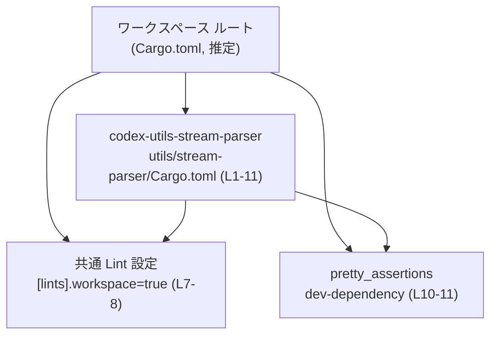
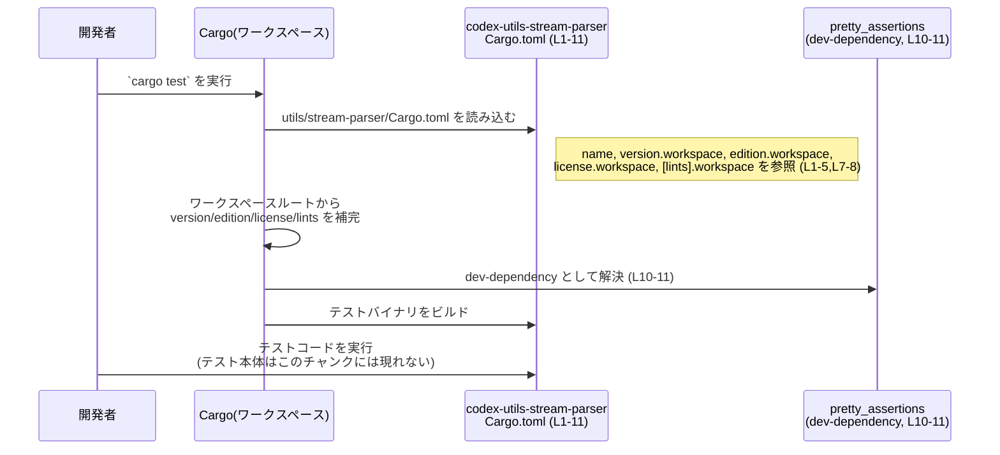

# utils/stream-parser/Cargo.toml コード解説

## 0. ざっくり一言

`codex-utils-stream-parser` クレートの Cargo マニフェストであり、クレート名の定義と、バージョン・edition・ライセンス・Lint 設定・テスト用 dev-dependency をワークスペースから継承する構成になっています（`utils/stream-parser/Cargo.toml:L1-5,L7-8,L10-11`）。

---

## 1. このモジュールの役割

### 1.1 概要

- このファイルは、Rust クレート `codex-utils-stream-parser` の **パッケージメタデータとビルド設定** を記述する Cargo.toml です（`[package]` セクション, `L1-5`）。
- バージョン、edition、ライセンス、および Lint 設定、`pretty_assertions` の dev-dependency 情報は、**ワークスペースルートの設定を参照する**ようになっています（`*.workspace = true`, `L3-5,L7-8,L10-11`）。
- このファイルには Rust の関数や構造体の定義は含まれていないため、**公開 API やコアロジックの詳細は、このチャンクからは分かりません**。

クレート名やディレクトリ名から、ストリームパーサ関連のユーティリティであることが想定されますが、その具体的な処理内容は、このファイル単体からは読み取れません。

### 1.2 アーキテクチャ内での位置づけ

この Cargo.toml は Cargo ワークスペースの一員として振る舞います。

- `version.workspace = true` などから、このクレートは **ワークスペース共通の設定**（バージョン・edition・ライセンス）を利用していることが分かります（`L3-5`）。
- `[lints] workspace = true` により、Lint 設定もワークスペースルートで定義されたものを共有しています（`L7-8`）。
- `[dev-dependencies]` の `pretty_assertions = { workspace = true }` から、テストで利用する `pretty_assertions` クレートの設定もワークスペース側に集約されていることが分かります（`L10-11`）。

この関係を簡略化した依存関係図は次のとおりです。



※ ワークスペースルートの `Cargo.toml` の具体的なパスや内容は、このチャンクには現れませんが、`*.workspace = true` の記述から、存在が前提になっていると解釈できます。

### 1.3 設計上のポイント

このファイルから読み取れる設計上の特徴は次のとおりです。

- **ワークスペース集中管理**  
  - バージョン・edition・ライセンスを個別のクレートではなくワークスペースで一元管理しています（`version.workspace = true`, `edition.workspace = true`, `license.workspace = true`, `L3-5`）。
- **Lint 設定の共有**  
  - `[lints] workspace = true` により、Lint レベルやルールを全クレートで統一する設計になっています（`L7-8`）。
- **dev-dependency の共有**  
  - `pretty_assertions` の設定をワークスペースに移譲しており、複数クレートで同じバージョン・設定を共有できる構成になっています（`L10-11`）。
- **このファイル単体では、実行時ロジック・エラー処理・並行性に関する情報は一切現れない**  
  - Rust コード（`src/*.rs`）がこのチャンクには含まれていないため、言語固有の安全性・エラー処理・並行性の設計は不明です。

---

## 2. 主要な機能一覧

この Cargo.toml 自体は「機能」や「関数」を提供するわけではありませんが、ビルド構成として次の役割を果たします。

- パッケージ定義: クレート名 `codex-utils-stream-parser` を定義する（`L1-2`）。
- バージョンのワークスペース継承: バージョン番号をワークスペースルートの設定から継承する（`version.workspace = true`, `L3`）。
- edition のワークスペース継承: Rust edition をワークスペース共通設定から継承する（`edition.workspace = true`, `L4`）。
- ライセンスのワークスペース継承: ライセンス情報をワークスペース共通設定から継承する（`license.workspace = true`, `L5`）。
- Lint 設定のワークスペース継承: Lint 設定をワークスペース定義に委譲する（`[lints] workspace = true`, `L7-8`）。
- テスト用 dev-dependency の共有: `pretty_assertions` の設定をワークスペースに集約し、このクレートはそれを利用する（`[dev-dependencies] pretty_assertions = { workspace = true }`, `L10-11`）。

---

## 3. 公開 API と詳細解説

### 3.1 型一覧（構造体・列挙体など）

このファイルには Rust の型定義（構造体・列挙体など）は含まれていません。  
代わりに、この Cargo.toml が宣言している「コンポーネント」を一覧します。

| 名前 | 種別 | 役割 / 用途 | 根拠 |
|------|------|-------------|------|
| `codex-utils-stream-parser` | クレート（パッケージ） | ストリームパーサ関連と推測されるユーティリティクレート。名前のみ定義されており、実際の API や実装は `src/*.rs` 側に存在すると考えられます。 | `utils/stream-parser/Cargo.toml:L1-2` |
| （ワークスペースルートの `Cargo.toml`） | ワークスペース設定 | バージョン、edition、ライセンス、Lint 設定、および `pretty_assertions` の詳細設定を提供するファイル。パスはこのチャンクからは不明です。 | `utils/stream-parser/Cargo.toml:L3-5,L7-8,L10-11` |
| `pretty_assertions` | dev-dependency クレート | テスト時に利用される dev-dependency。バージョンなどの詳細はワークスペース側の設定に委譲されています。このチャンクからは機能詳細は分かりません。 | `utils/stream-parser/Cargo.toml:L10-11` |

※ `pretty_assertions` の具体的な機能は一般的には知られていますが、このレポートでは Cargo.toml に直接現れている情報のみに基づいています。

### 3.2 関数詳細（最大 7 件）

この Cargo.toml には **Rust の関数・メソッド定義が存在しない** ため、公開 API の関数詳細はこのチャンクからは記述できません。

- 公開 API やコアロジックは、おそらく `utils/stream-parser/src/lib.rs` や `src/main.rs` などに定義されていますが、それらはこのチャンクには現れません。
- 言語固有の安全性（所有権、ライフタイム）、エラー処理（`Result` や `anyhow` 等）、並行性（`async`/`await`、スレッドなど）に関する情報も、ここからは確認できません。

### 3.3 その他の関数

- 該当なし（このファイルには関数やメソッドの定義がありません）。

---

## 4. データフロー

このファイル単体ではランタイムのデータフローは不明ですが、**ビルド〜テスト実行時のフロー**は次のように整理できます。

1. 開発者が `cargo test` などを実行する。
2. Cargo はワークスペースルートの `Cargo.toml` を読み込み、ワークスペースメンバーとして `codex-utils-stream-parser` を認識する（ワークスペース側の情報はこのチャンクにはありません）。
3. Cargo は `utils/stream-parser/Cargo.toml` を読み込み、`version.workspace = true` などの記述に基づき、バージョンや edition、ライセンス、Lint 設定をワークスペースから補完します（`L3-5,L7-8`）。
4. Cargo は `[dev-dependencies]` を見て、このクレートのテストビルドに `pretty_assertions` を含めるよう解決します（`L10-11`）。
5. テストコード内で `pretty_assertions` が利用されていれば、その API を通じてアサーションが行われますが、テストコードはこのチャンクには現れません。

これをシーケンス図にすると次のようになります。



---

## 5. 使い方（How to Use）

### 5.1 基本的な使用方法

この Cargo.toml は、ワークスペースの一部としてクレートを定義するために使われます。典型的な利用フローは次のとおりです。

1. **ワークスペースルートの `Cargo.toml`** に、`utils/stream-parser` ディレクトリをメンバーとして登録する（ワークスペース側の例・推定）:

   ```toml
   # (ワークスペースルート)/Cargo.toml の一例（このリポジトリの実物ではなく一般的な例）
   [workspace]
   members = [
       "utils/stream-parser",
       # 他のクレート …
   ]

   [workspace.package]
   version = "0.1.0"
   edition = "2021"
   license = "MIT"

   [workspace.lints.rust]
   # 例: deny(warnings) などの共通 Lint 設定

   [workspace.dev-dependencies]
   pretty_assertions = "1.4"
   ```

2. `utils/stream-parser/Cargo.toml` は、今回のようにワークスペース設定を参照します。

   ```toml
   [package]
   name = "codex-utils-stream-parser"
   version.workspace = true
   edition.workspace = true
   license.workspace = true

   [lints]
   workspace = true

   [dev-dependencies]
   pretty_assertions = { workspace = true }
   ```

3. クレートの実装は `utils/stream-parser/src/*.rs` に記述され、他クレートからは通常どおり `Cargo.toml` の依存関係経由で利用されます（このチャンクには依存関係セクションがないため、外部への公開方法は不明です）。

### 5.2 よくある使用パターン

このような構成の Cargo.toml で想定されるパターンを挙げます。

- **ワークスペース集中管理パターン**  
  - すべてのクレートで同一の `version`・`edition`・`license`・Lint ポリシーを使いたい場合に、現在のように `*.workspace = true` を使います（`L3-5,L7-8`）。
- **テスト用ライブラリの共通化**  
  - `pretty_assertions` のようなテスト専用クレートを複数クレートで使う場合、ワークスペース側にだけバージョンを定義し、各クレートでは `workspace = true` を指定することでバージョンのばらつきを防ぎます（`L10-11`）。

### 5.3 よくある間違い

この種の構成で起こりがちな誤りを、一般的な例として挙げます（具体的な誤用コードはこのリポジトリからではなく一般的なパターンです）。

```toml
# 誤り例: 個別クレートで version を直接指定しつつ、
# ワークスペース側でも同じクレートに対して version を管理してしまう
[package]
name = "codex-utils-stream-parser"
version = "0.1.0"          # ← 個別指定
# version.workspace = true  # ← こちらも有効にしてしまうと矛盾の元

# 正しい一例: ワークスペース集中管理か、個別管理かのどちらかに統一する
[package]
name = "codex-utils-stream-parser"
version.workspace = true    # 版数はワークスペース側だけで管理
```

```toml
# 誤り例: Lint をワークスペースで有効にしているつもりで、個別定義してしまう
[lints]
# workspace = true を忘れて個別定義にしてしまう
rust = { warnings = "deny" }

# （現在のファイルのように）ワークスペース設定を使う場合は
[lints]
workspace = true
```

### 5.4 使用上の注意点（まとめ）

- **ワークスペース設定の前提**  
  - `version.workspace = true` などの記述は、ワークスペースルート側に対応する設定があることを前提としています。ワークスペース側に定義がないと、ビルド時にエラーになる可能性があります。
- **ローカル上書きとの整合性**  
  - ある項目で `*.workspace = true` を使いつつ、同じ項目をローカルにも定義すると、意図しない設定になる可能性があります。集中管理するか個別管理するかは統一する必要があります。
- **Lint 設定の影響範囲**  
  - `[lints] workspace = true` により、このクレートのコードはワークスペース共通の Lint ポリシーに従います。Lint レベルが厳しい場合、コード変更時に警告やエラーが増える可能性があります。
- **公開 API・エラー・並行性は別ファイル依存**  
  - 実際の関数・エラー型・並行実行モデルなどは `src/*.rs` に依存しており、Cargo.toml の変更だけではそれらの挙動は変わりません（機能としては「依存関係の追加・バージョン変更」を通じて間接的に影響を与えます）。

---

## 6. 変更の仕方（How to Modify）

### 6.1 新しい機能を追加する場合（依存関係の追加など）

この Cargo.toml に関連する「新しい機能追加」は、多くの場合 **依存クレートの追加** や **feature フラグの追加** になります。

一般的なステップを示します（このリポジトリからではなく Cargo の慣習に基づく説明です）。

1. **新たなランタイム依存クレートが必要な場合**

   - `utils/stream-parser/Cargo.toml` に `[dependencies]` セクションを追加し、依存クレートを記述します。

   ```toml
   [dependencies]
   serde = "1.0"
   ```

   ※ 現在のチャンクには `[dependencies]` セクションは存在しません。

2. **ワークスペース共通の依存関係として扱いたい場合**

   - ワークスペースルートの `Cargo.toml` に `serde` を定義し、ここでは `workspace = true` を使います（例: `pretty_assertions` と同じパターン）。

   ```toml
   # (ワークスペースルート)/Cargo.toml
   [workspace.dependencies]
   serde = "1.0"
   ```

   ```toml
   # utils/stream-parser/Cargo.toml の一例
   [dependencies]
   serde = { workspace = true }
   ```

3. **テスト専用の機能追加**

   - テストで新しいクレートを利用する場合、`[dev-dependencies]` に追加します。ワークスペース共通にしたい場合は `pretty_assertions` と同様に `workspace = true` を使います（`L10-11` が参考になります）。

### 6.2 既存の機能を変更する場合

Cargo.toml の現在の内容に関して、変更時に注意すべき点を整理します。

- **バージョン・edition・ライセンスを個別に変えたい場合**

  1. ワークスペース側の `[workspace.package]` から当該クレートを切り離す、もしくはそこから値を削除します（ワークスペース側の実装はこのチャンクでは不明）。
  2. `utils/stream-parser/Cargo.toml` で `version.workspace = true` などを削除し、明示的な値を設定します。

  ```toml
  [package]
  name = "codex-utils-stream-parser"
  version = "0.2.0"
  edition = "2021"
  license = "MIT"
  ```

- **Lint 設定をこのクレートだけ変えたい場合**

  1. `[lints] workspace = true` を削除します（`L7-8`）。
  2. クレート固有の Lint 設定を `[lints]` 以下に記述します。

  ```toml
  [lints.rust]
  warnings = "deny"
  ```

- **`pretty_assertions` の利用をやめる / 置き換える場合**

  1. ワークスペースルート側で `pretty_assertions` の定義を削除または変更します（推定）。
  2. `utils/stream-parser/Cargo.toml` の `[dev-dependencies]` から該当行を削除または変更します（`L10-11`）。

変更時には、次の点を確認する必要があります。

- ワークスペース内の他クレートで同じ設定を共有しているかどうか。
- 依存クレートのバージョンの整合性（衝突がないか）。
- Lint 設定の変更によって警告やエラーが増えないか。

---

## 7. 関連ファイル

この Cargo.toml と密接に関連すると考えられるファイル・ディレクトリを整理します。

| パス | 役割 / 関係 |
|------|------------|
| `(ワークスペースルート)/Cargo.toml` | `version.workspace = true`、`edition.workspace = true`、`license.workspace = true`、`[lints] workspace = true`、`pretty_assertions = { workspace = true }` の参照先となる設定を定義するファイルです（`L3-5,L7-8,L10-11` から存在が前提とされています）。 |
| `utils/stream-parser/` | 現在の Cargo.toml が置かれているクレートディレクトリです。Rust コード（`src/*.rs`）やテストコード（`tests/*.rs` など）は通常この配下に存在すると考えられますが、このチャンクには現れません。 |
| `utils/stream-parser/src/lib.rs` / `src/main.rs`（推定） | クレート `codex-utils-stream-parser` の公開 API やコアロジックが定義されていると想定されるファイルです。ただし、このチャンクからは存在・内容ともに確認できません。 |
| `utils/stream-parser/tests/`（推定） | `pretty_assertions` を利用する可能性がある統合テストなどが置かれていると推定されるディレクトリです。このチャンクには定義が現れません。 |

このチャンクに含まれているのは Cargo.toml のみであり、**公開 API、コアロジック、エラー処理、並行性に関する具体的な情報は、上記のソースコードファイル側を参照しない限り分かりません**。
