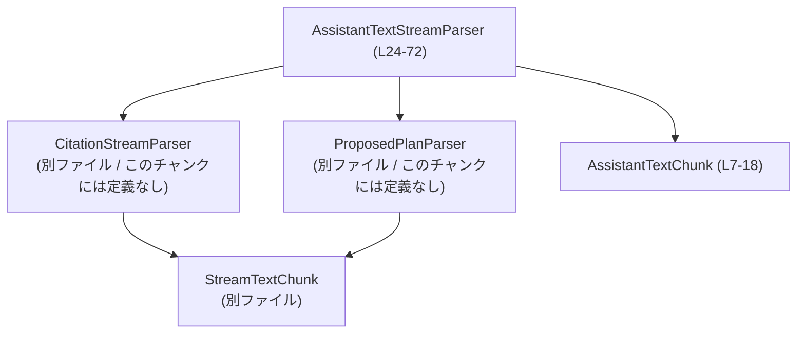
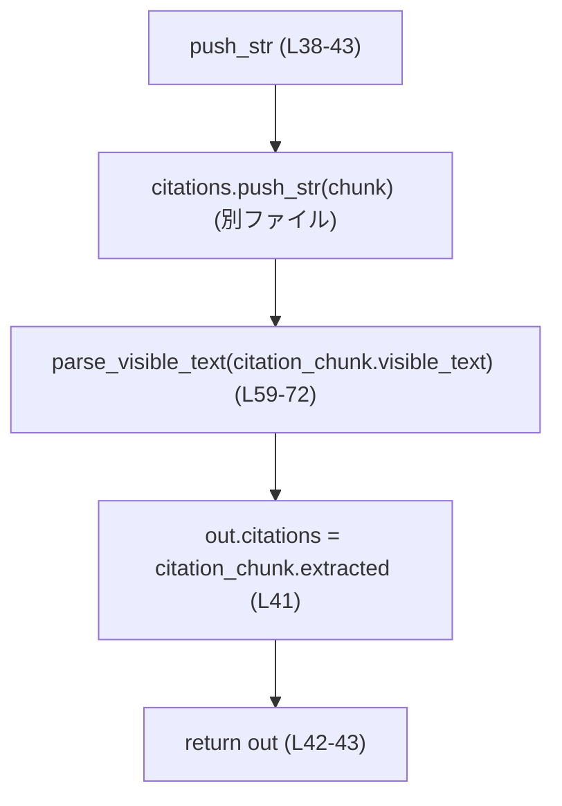

# utils/stream-parser/src/assistant_text.rs

## 0. ざっくり一言

ストリーミングで到着するアシスタント応答テキストから、

- `<oai-mem-citation>` タグを取り除きつつ引用キーを抽出し、
- オプションで `<proposed_plan>` ブロックを取り除きつつ「プランセグメント」に分割する

ためのラッパパーサを提供するモジュールです（assistant_text.rs:L20-28, L38-72）。

---

## 1. このモジュールの役割

### 1.1 概要

このモジュールは、ストリーミング中のアシスタント出力テキストに含まれる独自マークアップを一度のパスで処理するために存在します。

- 引用タグ `<oai-mem-citation>...</oai-mem-citation>` を検出・削除し、引用文字列を抽出する（assistant_text.rs:L20-22, L38-43）。
- プランモード時には `<proposed_plan>...</proposed_plan>` ブロックも解析し、「プランの開始・差分・終了」といったセグメント列に変換する（assistant_text.rs:L20-22, L59-72）。
- 呼び出し側には、可視テキスト・引用・プランセグメントをまとめた `AssistantTextChunk` を逐次返します（assistant_text.rs:L7-12, L38-43, L45-57, L59-72）。

### 1.2 アーキテクチャ内での位置づけ

このモジュールは、自前で詳細なパースロジックを持たず、下位のストリームパーサを合成する「調整役」です。

- **引用処理**: `CitationStreamParser` に委譲（assistant_text.rs:L1, L24-27, L38-41, L45-47）。
- **プラン処理**: `ProposedPlanParser` に委譲（assistant_text.rs:L2-3, L24-27, L59-72）。
- **共通チャンク型**: 下位パーサから `StreamTextChunk<T>` を受け取り、それを `AssistantTextChunk` に変換（assistant_text.rs:L4, L38-43, L45-57, L59-72）。

依存関係を簡略化した図は次のとおりです。



### 1.3 設計上のポイント

コードから読み取れる特徴は次のとおりです。

- **責務分割**
  - このモジュール自体は「引用 → プラン」の処理順序と結果統合のみを担当し、タグの詳細なパースは下位パーサに委譲しています（assistant_text.rs:L38-43, L45-57, L59-72）。
- **状態管理**
  - `AssistantTextStreamParser` はストリーミング状態を内部に保持する状態付きオブジェクトです。`plan_mode` フラグと、2 つのサブパーサインスタンスをフィールドに持ちます（assistant_text.rs:L24-28）。
- **エラーハンドリング**
  - 公開メソッドはすべて `Result` ではなく値を直接返し、明示的なエラー分岐や `unwrap` はありません（assistant_text.rs:L31-57, L59-72）。パース失敗などの扱いは下位パーサ依存と考えられますが、このチャンクからは確認できません。
- **ストリーミング前提**
  - `push_str` と `finish` の 2 ステップ API で、複数チャンクに分割されたタグをまたいで正しく処理できるようにしています（tests 内の使用例が根拠、assistant_text.rs:L81-95, L97-129）。
- **Rust の安全性**
  - `unsafe` は一切使用しておらず（このチャンクには存在しません）、内部状態へのアクセスは `&mut self` 経由のみのため、コンパイル時にデータ競合が防がれます（assistant_text.rs:L31-57, L59-72）。

---

## 2. 主要な機能一覧

### 2.1 コンポーネントインベントリー（型・関数）

#### 型（構造体・列挙体など）

| 名前 | 種別 | 公開範囲 | 役割 / 用途 | 定義位置 |
|------|------|----------|-------------|----------|
| `AssistantTextChunk` | 構造体 | `pub` | 1 回の `push_str` / `finish` 呼び出しで得られる、可視テキスト・引用・プランセグメントの束を表す DTO（データ転送用オブジェクト）です。 | assistant_text.rs:L7-12 |
| `AssistantTextStreamParser` | 構造体 | `pub` | ストリーミングテキストから引用とプランセグメントを抽出する高水準パーサです。内部で `CitationStreamParser` と `ProposedPlanParser` をラップします。 | assistant_text.rs:L24-28 |

#### メソッド・関数

| 名前 | 所属 | 公開 | 概要 | 定義位置 |
|------|------|------|------|----------|
| `AssistantTextChunk::is_empty(&self) -> bool` | `AssistantTextChunk` | `pub` | 可視テキスト・引用・プランセグメントのいずれも空かどうかを判定します。テストで `finish` の結果が空かどうかの検査に使用されています。 | assistant_text.rs:L14-18, L128 |
| `AssistantTextStreamParser::new(plan_mode: bool) -> Self` | `AssistantTextStreamParser` | `pub` | プランモードの有無を指定して、新しいストリームパーサを生成します。下位パーサは `Default` 実装に任せています。 | assistant_text.rs:L30-36 |
| `AssistantTextStreamParser::push_str(&mut self, chunk: &str) -> AssistantTextChunk` | `AssistantTextStreamParser` | `pub` | 新しいテキストチャンクをストリームに流し込み、引用削除 + （必要に応じて）プラン解析を行った結果チャンクを返します。 | assistant_text.rs:L38-43 |
| `AssistantTextStreamParser::finish(&mut self) -> AssistantTextChunk` | `AssistantTextStreamParser` | `pub` | 残っているバッファをすべてフラッシュし、最後の結果チャンクを返します。タグがチャンク境界をまたぐ場合の残り部分もここで処理されます。 | assistant_text.rs:L45-57 |
| `AssistantTextStreamParser::parse_visible_text(&mut self, visible_text: String) -> AssistantTextChunk` | `AssistantTextStreamParser` | `fn`（非公開） | `plan_mode` に応じて、可視テキストをそのまま返すか、`ProposedPlanParser` に通してプランセグメントに分解します。 | assistant_text.rs:L59-72 |
| `parses_citations_across_seed_and_delta_boundaries()` | テスト関数 | `#[test]` | 引用タグが複数チャンクにまたがる場合でも、1 つの引用として抽出されることを検証します。 | assistant_text.rs:L81-95 |
| `parses_plan_segments_after_citation_stripping()` | テスト関数 | `#[test]` | 引用削除後のテキストに対して、プランタグが正しい順序とセグメント種別で解析されることを検証します。 | assistant_text.rs:L97-129 |

### 2.2 主要な機能一覧（箇条書き）

- アシスタント出力のストリームから `<oai-mem-citation>` タグを削除し、引用文字列（例: `"doc1"`）を抽出する機能（assistant_text.rs:L20-22, L38-43, L81-95）。
- プランモード時に `<proposed_plan>` ブロックを検出し、「開始」「差分テキスト」「終了」などの `ProposedPlanSegment` 列を生成する機能（assistant_text.rs:L20-22, L59-72, L97-127）。
- 上記 2 つの処理を順序付き（必ず「引用削除 → プラン解析」の順）で行い、`AssistantTextChunk` に統合して呼び出し側に返す機能（assistant_text.rs:L38-43, L45-57, L59-72）。
- ストリーム終端で残っている未処理テキストを `finish` でフラッシュする機能（assistant_text.rs:L45-57）。

---

## 3. 公開 API と詳細解説

### 3.1 型一覧（構造体）

| 名前 | 種別 | フィールド | 役割 / 用途 | 定義位置 |
|------|------|-----------|-------------|----------|
| `AssistantTextChunk` | 構造体 | `visible_text: String` / `citations: Vec<String>` / `plan_segments: Vec<ProposedPlanSegment>` | 1 ステップのパース結果をまとめたコンテナです。可視テキストはマークアップを除去したテキストを表し、`citations` は直近チャンクで新たに検出された引用キー、`plan_segments` は検出されたプラン構造を表します（assistant_text.rs:L7-12）。 | assistant_text.rs:L7-12 |
| `AssistantTextStreamParser` | 構造体 | `plan_mode: bool` / `citations: CitationStreamParser` / `plan: ProposedPlanParser` | アシスタントテキストをストリーミングで解析する状態付きパーサです。`plan_mode` が `true` のときのみプラン解析を行い、それ以外では引用処理のみを行います（assistant_text.rs:L24-28）。 | assistant_text.rs:L24-28 |

### 3.2 関数詳細

#### `AssistantTextChunk::is_empty(&self) -> bool`

**概要**

このメソッドは、チャンク内に可視テキスト・引用・プランセグメントのいずれも含まれていないかどうかを判定します（assistant_text.rs:L14-18）。テストでは `finish()` の結果が空かどうかの確認に用いられています（assistant_text.rs:L128）。

**引数**

| 引数名 | 型 | 説明 |
|--------|----|------|
| `self` | `&AssistantTextChunk` | 判定対象のチャンクです。借用（参照）なので、所有権は移動しません。 |

**戻り値**

- `bool`  
  - `true`: `visible_text` が空かつ `citations` が空かつ `plan_segments` が空の場合。  
  - `false`: 上記のいずれかが非空の場合。

**内部処理の流れ**

1. `self.visible_text.is_empty()` を評価（assistant_text.rs:L16）。
2. `self.citations.is_empty()` を評価（assistant_text.rs:L16）。
3. `self.plan_segments.is_empty()` を評価（assistant_text.rs:L16）。
4. 3 つすべてが `true` のときのみ `true` を返し、それ以外は `false` を返します（assistant_text.rs:L16）。

**Examples（使用例）**

テスト内での使用例（finish の戻り値が空かどうかの確認）:

```rust
// ストリーム終端後のチャンク
let finish = parser.finish();                // assistant_text.rs:L104

// すべて空であることをチェック
assert!(finish.is_empty());                  // assistant_text.rs:L128
```

**Errors / Panics**

- 明示的なエラーや panic を発生させるコードはありません（単純なフィールドチェックのみ、assistant_text.rs:L16）。
- フィールドが `Option` ではなく常に存在する前提なので、ヌル参照なども起こりません。

**Edge cases（エッジケース）**

- `visible_text` が空文字列であっても、`citations` または `plan_segments` に要素があれば `false` になります。
- 3 フィールドすべてが空の場合のみ `true` になるため、「可視テキストはないが引用だけある」といったケースも `false` になります。

**使用上の注意点**

- 「このチャンクは無視してよいか」を判定する用途に向いていますが、呼び出し側がどのフィールドを重要とみなすかによって条件を変えたい場合は、個別フィールドを直接参照する必要があります。

---

#### `AssistantTextStreamParser::new(plan_mode: bool) -> Self`

**概要**

`AssistantTextStreamParser` のコンストラクタです。プラン解析を行うかどうかを制御する `plan_mode` を指定し、それ以外の内部パーサは `Default` 実装によって初期化します（assistant_text.rs:L30-36）。

**引数**

| 引数名 | 型 | 説明 |
|--------|----|------|
| `plan_mode` | `bool` | `true` の場合はプラン解析（`ProposedPlanParser`）も有効にし、`false` の場合は引用処理のみ行います（assistant_text.rs:L31-35, L59-65）。 |

**戻り値**

- `AssistantTextStreamParser`  
  - `plan_mode` が設定された新しいインスタンスです（assistant_text.rs:L31-36）。

**内部処理の流れ**

1. `Self { plan_mode, ..Self::default() }` を構築します（assistant_text.rs:L31-35）。
   - `plan_mode` フィールドに引数を設定。
   - その他のフィールド（`citations`, `plan`）は `Default` トレイトの実装に従って初期化されます。

**Examples（使用例）**

```rust
// プラン解析なしで引用のみ処理するパーサ
let mut parser = AssistantTextStreamParser::new(false);    // assistant_text.rs:L83

// プラン解析も有効にしたパーサ
let mut plan_parser = AssistantTextStreamParser::new(true); // assistant_text.rs:L99
```

**Errors / Panics**

- `Default` 実装が panic を起こさない限り、この関数自体が panic する可能性はコードからは読み取れません（assistant_text.rs:L31-35）。
- 明示的なエラー値も返していません。

**Edge cases**

- `plan_mode` の値によって `parse_visible_text` の挙動が変わるため、モードを間違えて構築すると、プランセグメントが一切出てこない／余計な解析が走るといった仕様レベルの問題が起きます（assistant_text.rs:L59-65）。

**使用上の注意点**

- 同じインスタンスで途中から `plan_mode` を切り替えることはできません。別モードで解析したい場合は別インスタンスを新たに生成する必要があります（コード上 `plan_mode` は `pub` ではなく外部から変更できないため、assistant_text.rs:L24-28, L31-35）。

---

#### `AssistantTextStreamParser::push_str(&mut self, chunk: &str) -> AssistantTextChunk`

**概要**

ストリーミングテキストの一部（チャンク）をパーサに渡し、その時点で確定した可視テキスト・引用・プランセグメントを `AssistantTextChunk` として返します（assistant_text.rs:L38-43）。

**引数**

| 引数名 | 型 | 説明 |
|--------|----|------|
| `self` | `&mut AssistantTextStreamParser` | 内部状態（下位パーサのバッファなど）を更新するため、可変参照として受け取ります。並行使用はコンパイル時に制限されます。 |
| `chunk` | `&str` | 新たに到着したテキスト片。タグが前後のチャンクにまたがっていても構いません（tests の入力が根拠、assistant_text.rs:L85-87, L101-103）。 |

**戻り値**

- `AssistantTextChunk`  
  - この `chunk` の処理によって新たに「可視」となったテキスト・引用・プランセグメントを含みます（assistant_text.rs:L38-43, L59-72）。

**内部処理の流れ**

1. `self.citations.push_str(chunk)` を呼び、引用タグをパースします（assistant_text.rs:L38-39）。
   - 戻り値 `citation_chunk` は `StreamTextChunk` 型で、`visible_text` と `extracted`（抽出された引用）を持つと推測できますが、定義はこのチャンクにはありません。
2. `citation_chunk.visible_text` を `self.parse_visible_text(...)` に渡し、プラン解析（プランモード時のみ）を行います（assistant_text.rs:L40, L59-72）。
3. `parse_visible_text` から返された `AssistantTextChunk` を `out` として受け取ります（assistant_text.rs:L40）。
4. `out.citations = citation_chunk.extracted;` として、引用のリストを設定します（assistant_text.rs:L41）。
5. `out` を返します（assistant_text.rs:L42-43）。

**フローチャート（概要）**



**Examples（使用例）**

引用タグが 2 チャンクにまたがる場合の例（テストより簡略化）:

```rust
let mut parser = AssistantTextStreamParser::new(false);      // 引用のみ処理

let seeded = parser.push_str("hello <oai-mem-citation>doc"); // 開始タグだけ到着
assert_eq!(seeded.visible_text, "hello ");                   // タグ前のテキストのみ可視
assert!(seeded.citations.is_empty());                        // 引用はまだ確定しない

let parsed = parser.push_str("1</oai-mem-citation> world");  // 残りと閉じタグが到着
assert_eq!(parsed.visible_text, " world");                   // タグ後のテキストが可視
assert_eq!(parsed.citations, vec!["doc1".to_string()]);      // 1 つの引用として抽出
```

（根拠: assistant_text.rs:L81-95）

**Errors / Panics**

- この関数内には `unwrap` や `panic!`、`?` 演算子は存在せず、明示的なエラー伝播は行っていません（assistant_text.rs:L38-43）。
- ただし、内部で呼び出している `citations.push_str` および `parse_visible_text` / `plan.push_str` の挙動は、このチャンクからは不明です。

**Edge cases（エッジケース）**

- **タグがチャンク境界をまたぐ場合**  
  - テストから、開始タグと閉じタグが別チャンクに分かれていても、1 つの引用として扱われることが確認できます（assistant_text.rs:L85-87, L91-92）。
- **plan_mode = false の場合**  
  - `parse_visible_text` は可視テキストをそのまま `AssistantTextChunk` に包んで返し、プランセグメントは常に空になります（assistant_text.rs:L59-65）。
- **空文字列のチャンク**  
  - このチャンクには空文字列を渡した場合のテストはありませんが、`citations.push_str` の実装次第で「何も変化しない」チャンクが返ると考えられます。ただし確証はありません（このチャンクには `CitationStreamParser` の実装がありません）。

**使用上の注意点**

- ストリーム終端時には必ず `finish` を呼んで、最終的な残りデータを回収する必要があります。`push_str` だけでは、チャンク境界にかかったタグの一部が未処理のまま残る可能性があります（assistant_text.rs:L45-57）。
- `&mut self` でしか呼び出せないため、同一インスタンスを複数スレッドから同時に使用することはコンパイル時に禁止されます（Rust の借用規則による安全性）。

---

#### `AssistantTextStreamParser::finish(&mut self) -> AssistantTextChunk`

**概要**

ストリーミング入力の終端で呼び出し、内部に残っているバッファ（引用パーサとプランパーサの両方）をすべてフラッシュして最終チャンクを返します（assistant_text.rs:L45-57）。テストでは、ストリーム終端後に追加の可視テキストやプランセグメントがないことの確認に利用されています（assistant_text.rs:L88-95, L104-128）。

**引数**

| 引数名 | 型 | 説明 |
|--------|----|------|
| `self` | `&mut AssistantTextStreamParser` | 内部のストリーム状態を消費するため、可変参照で受け取ります。 |

**戻り値**

- `AssistantTextChunk`  
  - 残りの可視テキスト・引用・プランセグメント（もしあれば）を含むチャンクです（assistant_text.rs:L45-57）。

**内部処理の流れ**

1. `let citation_chunk = self.citations.finish();`  
   - 引用パーサの残りをフラッシュし、可視テキストと引用を取得します（assistant_text.rs:L45-47）。
2. `let mut out = self.parse_visible_text(citation_chunk.visible_text);`  
   - フラッシュされた可視テキストに対して、プラン解析（必要であれば）を行います（assistant_text.rs:L47, L59-72）。
3. `if self.plan_mode { ... }` ブロック内でプランパーサの残りもフラッシュします（assistant_text.rs:L48-54）。
   - `let mut tail = self.plan.finish();`（assistant_text.rs:L49）。
   - `if !tail.is_empty() {` の条件で、空でない場合のみ以下を実行（assistant_text.rs:L50）。
     - `out.visible_text.push_str(&tail.visible_text);`（assistant_text.rs:L51）。
     - `out.plan_segments.append(&mut tail.extracted);`（assistant_text.rs:L52）。
4. `out.citations = citation_chunk.extracted;` として、引用リストを設定します（assistant_text.rs:L55）。
5. `out` を返します（assistant_text.rs:L56-57）。

**Examples（使用例）**

引用のみのケース:

```rust
let mut parser = AssistantTextStreamParser::new(false);
// ... push_str を 2 回呼び出した後
let tail = parser.finish();

assert_eq!(tail.visible_text, "");                   // 残りテキストなし
assert!(tail.citations.is_empty());                 // 残り引用もなし
```

（根拠: assistant_text.rs:L81-95）

プラン付きのケース:

```rust
let mut parser = AssistantTextStreamParser::new(true);
// 3 回の push_str 後に finish
let finish = parser.finish();

// 追加のプランセグメントやテキストがないことを確認
assert!(finish.is_empty());                         // assistant_text.rs:L128
```

**Errors / Panics**

- この関数内でも明示的なエラーや panic はありません（assistant_text.rs:L45-57）。
- `tail.is_empty()` や `tail.visible_text.push_str` などは、`tail` が `Option` ではなく正しく構築されている前提で動作します。`plan.finish()` が `StreamTextChunk` を返すという契約に依存していますが、このチャンクにはその定義がありません。

**Edge cases（エッジケース）**

- 引用タグやプランタグがストリーム末尾で中途半端に終わっている場合、`citations.finish()` や `plan.finish()` がどのように扱うかは、このチャンクでは不明です。ただし、`finish` がそれらを「最終的にどう扱うか」を決定する唯一の機会であることは確かです（assistant_text.rs:L45-54）。
- `plan_mode = false` の場合、`plan.finish()` は呼ばれず、プランセグメントのフラッシュは行いません（assistant_text.rs:L48-54）。

**使用上の注意点**

- ストリームが終わったら必ず一度 `finish` を呼ぶことが前提の設計です。呼び忘れると、最後のチャンクに含まれるべき引用やプランセグメントが取りこぼされます。
- 同じインスタンスに対して `finish` を複数回呼ぶことは仕様として明示されていません。このチャンクからは二度目の `finish` がどう振る舞うかは分からないため、1 インスタンスにつき 1 回だけ呼び出す前提で使うのが安全です。

---

#### `AssistantTextStreamParser::parse_visible_text(&mut self, visible_text: String) -> AssistantTextChunk`

**概要**

`AssistantTextStreamParser` の内部ヘルパーです。引用処理後の「可視テキスト」に対して、プラン解析を行うかどうかを `plan_mode` に応じて切り替えます（assistant_text.rs:L59-72）。

**引数**

| 引数名 | 型 | 説明 |
|--------|----|------|
| `self` | `&mut AssistantTextStreamParser` | プランパーサの状態を更新するための可変参照です。 |
| `visible_text` | `String` | 引用タグが取り除かれた後のテキスト。所有権ごと渡されます（`String` 型）。 |

**戻り値**

- `AssistantTextChunk`  
  - `plan_mode = false` の場合: 与えられた `visible_text` をそのまま含み、他のフィールドがデフォルト（空）になっているチャンク。
  - `plan_mode = true` の場合: `ProposedPlanParser` による解析結果（可視テキスト + `ProposedPlanSegment` 列）を含むチャンク。

**内部処理の流れ**

1. `if !self.plan_mode { ... }`  
   - プランモードでない場合、`AssistantTextChunk { visible_text, ..AssistantTextChunk::default() }` を即座に返します（assistant_text.rs:L59-65）。
2. プランモードの場合、`self.plan.push_str(&visible_text)` を呼び、プランタグをパースします（assistant_text.rs:L66）。
   - 戻り値 `plan_chunk` は `StreamTextChunk<ProposedPlanSegment>` として、可視テキストおよびプランセグメントを保持します。
3. `AssistantTextChunk { visible_text: plan_chunk.visible_text, plan_segments: plan_chunk.extracted, ..AssistantTextChunk::default() }` を構築して返します（assistant_text.rs:L67-71）。

**Examples（使用例・外部からの間接利用）**

テストでは直接呼ばれず、`push_str` 経由で呼ばれますが、その挙動は次のように現れます。

```rust
let mut parser = AssistantTextStreamParser::new(true);

let seeded = parser.push_str("Intro\n<proposed");
assert_eq!(seeded.visible_text, "Intro\n");          // プラン開始前のテキスト
assert_eq!(
    seeded.plan_segments,
    vec![ProposedPlanSegment::Normal("Intro\n".to_string())]
);

let parsed = parser.push_str("_plan>\n- step <oai-mem-citation>doc</oai-mem-citation>\n");
assert_eq!(parsed.visible_text, "");                 // プラン内は可視テキストに出ない
// plan_segments: Start と Delta が格納
```

（根拠: assistant_text.rs:L97-119）

**Errors / Panics**

- この関数自体は単純な条件分岐と構造体構築のみで、panic を発生させるコードは含まれていません（assistant_text.rs:L59-71）。
- `self.plan.push_str` の内部挙動はこのチャンクからは不明です。

**Edge cases（エッジケース）**

- `plan_mode = false` のとき、`ProposedPlanParser` は一切使われないため、`plan` フィールドは初期化されたままですが未使用になります（assistant_text.rs:L59-65）。
- プランタグが不完全な場合（`<proposed_plan>` 開始のみ到着など）、`self.plan.push_str` がどのような `visible_text` や `extracted` を返すかは、このチャンクでは分かりませんが、テストから「開始直前のテキストは Normal セグメントとして返る」ことだけは確認できます（assistant_text.rs:L101-110）。

**使用上の注意点**

- 外部から直接呼ぶことは想定されていない内部メソッドです。公開 API（`push_str` / `finish`）を通じて利用する前提で設計されています。

---

### 3.3 その他の関数

- このモジュールには、上記以外の公開関数や補助関数は存在しません（tests を除く、assistant_text.rs:L1-73）。

---

## 4. データフロー

ここでは、`plan_mode = true` の場合に、2 回の `push_str` と 1 回の `finish` を呼ぶ典型的なフローを説明します（assistant_text.rs:L97-129）。

1. 呼び出し側が `push_str` にテキストチャンクを渡す。
2. `AssistantTextStreamParser` が `CitationStreamParser` に渡し、引用タグを取り除きつつ可視テキスト（引用削除後）を得る。
3. 得られた可視テキストを `parse_visible_text` に渡し、`plan_mode` が `true` であれば `ProposedPlanParser` に送り、プランセグメントを抽出する。
4. 2–3 の結果を `AssistantTextChunk` にまとめて返却する。
5. ストリーム終端で `finish` を呼び、引用・プランの両パーサに残っているデータをフラッシュして最終チャンクを返す。

これをシーケンス図で表すと次のようになります。

```mermaid
sequenceDiagram
    participant Caller as 呼び出し側
    participant Parser as AssistantTextStreamParser<br/>(L24-72)
    participant Cit as CitationStreamParser<br/>(別ファイル)
    participant Plan as ProposedPlanParser<br/>(別ファイル)

    Caller->>Parser: new(true) (L30-36)
    activate Parser

    Caller->>Parser: push_str("Intro\\n<proposed") (L101)
    activate Cit
    Parser->>Cit: push_str(chunk) (L38-39)
    Cit-->>Parser: StreamTextChunk{visible_text: "Intro\\n", extracted: []}
    deactivate Cit

    activate Plan
    Parser->>Plan: push_str("Intro\\n") (L66)
    Plan-->>Parser: StreamTextChunk{visible_text: "Intro\\n", extracted: [Normal("Intro\\n")]}
    deactivate Plan

    Parser-->>Caller: AssistantTextChunk{visible_text: "Intro\\n", plan_segments: [Normal(...)]} (L67-71)
    deactivate Parser

    Caller->>Parser: push_str("_plan>...") (L102-103)
    ... 略: 同様に CitationStreamParser → ProposedPlanParser の順 ...

    Caller->>Parser: finish() (L104)
    activate Cit
    Parser->>Cit: finish() (L45-47)
    Cit-->>Parser: StreamTextChunk{visible_text: "", extracted: []}
    deactivate Cit

    activate Plan
    Parser->>Plan: finish() (L48-52)
    Plan-->>Parser: StreamTextChunk{visible_text: "Outro", extracted: [ProposedPlanEnd, Normal("Outro")]}
    deactivate Plan

    Parser-->>Caller: AssistantTextChunk{visible_text: "Outro", plan_segments: [...]} (L50-56)
```

---

## 5. 使い方（How to Use）

### 5.1 基本的な使用方法

ここでは、引用とプランの両方を解析する基本フローを示します。

```rust
use utils_stream_parser::AssistantTextStreamParser; // 実際のパス名はこのチャンクからは不明

fn main() {
    // プラン解析も有効にしたパーサを作成
    let mut parser = AssistantTextStreamParser::new(true); // assistant_text.rs:L30-36

    // ストリーミングで到着するテキストチャンクを順に投入
    let chunk1 = "Intro\n<proposed";
    let out1 = parser.push_str(chunk1);                   // assistant_text.rs:L38-43
    // out1.visible_text == "Intro\n"
    // out1.citations.is_empty()
    // out1.plan_segments には Normal("Intro\n") などが入る

    let chunk2 = "_plan>\n- step <oai-mem-citation>doc</oai-mem-citation>\n";
    let out2 = parser.push_str(chunk2);
    // out2.citations に ["doc"] が入る
    // out2.plan_segments に ProposedPlanStart, ProposedPlanDelta(...) などが入る

    let chunk3 = "</proposed_plan>\nOutro";
    let out3 = parser.push_str(chunk3);
    // out3.visible_text == "Outro"
    // out3.plan_segments に ProposedPlanEnd, Normal("Outro") などが入る

    // 終端処理（最後に残ったものがあればここで回収）
    let tail = parser.finish();                            // assistant_text.rs:L45-57
    assert!(tail.is_empty());                              // assistant_text.rs:L14-18, L128
}
```

（構造と挙動はテスト `parses_plan_segments_after_citation_stripping` に基づきます、assistant_text.rs:L97-129）

### 5.2 よくある使用パターン

1. **引用のみ欲しい場合**

```rust
let mut parser = AssistantTextStreamParser::new(false);     // plan_mode = false

let out = parser.push_str("hello <oai-mem-citation>doc1</oai-mem-citation> world");
// out.visible_text == "hello  world"
// out.citations == ["doc1"]
// out.plan_segments は常に空になる（assistant_text.rs:L59-65）
```

1. **プラン解析も行いたい場合**

テストにあるように、プラン部分は可視テキストから除外し、プラン構造として扱うことが多いと考えられます（assistant_text.rs:L101-120）。

### 5.3 よくある間違い

このチャンクとテストから推測できる「誤用になりやすい点」は以下です。

```rust
// 誤りの可能性: finish を呼ばずにストリームを終了してしまう
let mut parser = AssistantTextStreamParser::new(true);
let _ = parser.push_str("Intro<proposed_plan>...");
// ここで処理を終えると、ストリーム末尾のセグメントが flush されない可能性がある

// 正しいパターン: 最後に finish を必ず呼ぶ
let mut parser = AssistantTextStreamParser::new(true);
let _ = parser.push_str("Intro<proposed_plan>...");
let _ = parser.push_str("...<oai-mem-citation>doc</oai-mem-citation>...");
let tail = parser.finish(); // ここで残りが回収される
```

根拠: `finish` によってのみ `citations.finish()` / `plan.finish()` が呼ばれるため（assistant_text.rs:L45-54）。

### 5.4 使用上の注意点（まとめ）

- **ストリーム終端時の `finish` 呼び出しが必須**  
  - これを怠ると、チャンク境界にかかったタグの残り部分が処理されない恐れがあります（assistant_text.rs:L45-54）。
- **同一インスタンスの再利用**  
  - 同じパーサインスタンスで別のストリームを解析したい場合、明示的なリセット手段はこのチャンクにはありません。新しいストリームには新インスタンスを使うのが安全です。
- **並行性**  
  - すべてのメソッドが `&mut self` を要求するため、同一インスタンスを複数スレッドから同時に利用することはできません。スレッド間で共有する場合は、外側で `Mutex` などを使って排他制御する必要があります（言語仕様上の一般論）。
- **入力検証**  
  - このモジュールでは、入力文字列のサイズや内容に制限を設けていません。極端に大きなテキストを単一のチャンクとして渡すと、一度の処理でのメモリ使用量が増える可能性があります。

---

## 6. 変更の仕方（How to Modify）

### 6.1 新しい機能を追加する場合

ストリーミングテキストに新しい種類のマークアップを追加したい場合の、変更の入口の例を示します。

1. **新しいストリームパーサの追加（別モジュール）**
   - `CitationStreamParser` や `ProposedPlanParser` と同様のインターフェース（`push_str`, `finish`, `StreamTextChunk`）を持つパーサを別ファイルに実装するのが自然です（assistant_text.rs:L1-4, L24-28, L38-43, L45-57, L59-72）。
2. **`AssistantTextStreamParser` にフィールド追加**
   - 新しいパーサをフィールドとして追加し（assistant_text.rs:L24-28 を参考）、`Default` で初期化されるようにします。
3. **`push_str` / `finish` への統合**
   - 既存コードと同様、「引用 → プラン」の前後どこで新パーサを挟むべきかを決め、`push_str` と `finish` 内で順序通りに呼び出します（assistant_text.rs:L38-43, L45-57）。
4. **`AssistantTextChunk` の拡張**
   - 新しい解析結果を呼び出し側に返したい場合は、`AssistantTextChunk` にフィールドを追加します（assistant_text.rs:L7-12）。

### 6.2 既存の機能を変更する場合

- **引用処理の変更**
  - 引用タグ形式を変更する場合は、`CitationStreamParser` 側の実装を変更するのが自然です。このモジュールでは `citations.push_str` / `finish` の呼び出し位置と順序のみを維持すればよいです（assistant_text.rs:L38-41, L45-47, L55）。
- **プラン解析の仕様変更**
  - `ProposedPlanParser` の挙動を変更した際は、テスト `parses_plan_segments_after_citation_stripping` の期待値も合わせて更新する必要があります（assistant_text.rs:L97-129）。
- **影響範囲の確認**
  - `AssistantTextChunk` のフィールドや `AssistantTextStreamParser` のメソッドシグネチャを変更する場合、クレート外からの直接利用が想定されるため、コンパイルエラーで全利用箇所を確認する必要があります。

---

## 7. 関連ファイル

このモジュールと密接に関係する型は `use` 文から分かりますが、具体的なファイルパスはこのチャンクには現れません。

| パス / 型 | 役割 / 関係 |
|-----------|------------|
| `CitationStreamParser` | `<oai-mem-citation>` タグを処理し、引用文字列とタグ除去後の可視テキストを生成するストリームパーサです。`AssistantTextStreamParser` の `citations` フィールドとして保持されます（assistant_text.rs:L1, L24-27, L38-41, L45-47, L55）。 |
| `ProposedPlanParser` | `<proposed_plan>` ブロックを処理し、`ProposedPlanSegment` 列と可視テキストを生成するストリームパーサです。`AssistantTextStreamParser` の `plan` フィールドとして保持されます（assistant_text.rs:L2-3, L24-27, L59-72, L48-52）。 |
| `ProposedPlanSegment` | プラン解析結果を表す列挙体と推測されます。`AssistantTextChunk::plan_segments` の要素型であり、テストで具体的なバリアント名（`Normal`, `ProposedPlanStart`, `ProposedPlanDelta`, `ProposedPlanEnd`）が確認できます（assistant_text.rs:L3, L10-11, L107-118, L120-126）。 |
| `StreamTextChunk<T>` | ストリーミングパーサから返される、「可視テキスト」と「抽出された値（`T`）」の組を表す汎用型と推測されます。`CitationStreamParser` と `ProposedPlanParser` の両方がこの型を返していると見られますが、定義はこのチャンクには現れません（assistant_text.rs:L4, L38-41, L45-47, L66-70）。 |
| `StreamTextParser` | インターフェース（トレイト）または共通のベース型と推測されますが、このファイル内では直接使用されておらず、役割は不明です（assistant_text.rs:L5）。 |

---

### Bugs / Security に関する補足（このチャンクから読み取れる範囲）

- **潜在バグ**
  - このモジュール単体では、明らかな論理バグは確認できません。`push_str` → `finish` の呼び出し順序もテストで検証されています（assistant_text.rs:L81-95, L97-129）。
- **セキュリティ**
  - 入力はすべて通常の `String` / `&str` として扱われ、`unsafe` や OS レベルリソースへのアクセスはありません。このモジュールだけを見る限り、バッファオーバーフローなどの典型的なメモリ安全性問題は Rust の型システムにより防がれています（assistant_text.rs:L1-72）。
  - 入力テキストの内容検証（HTML エスケープなど）は行っていないため、最終的な表示までの別のレイヤで適切なサニタイズが必要です。ただし、この点はこのチャンクの責務外です。
